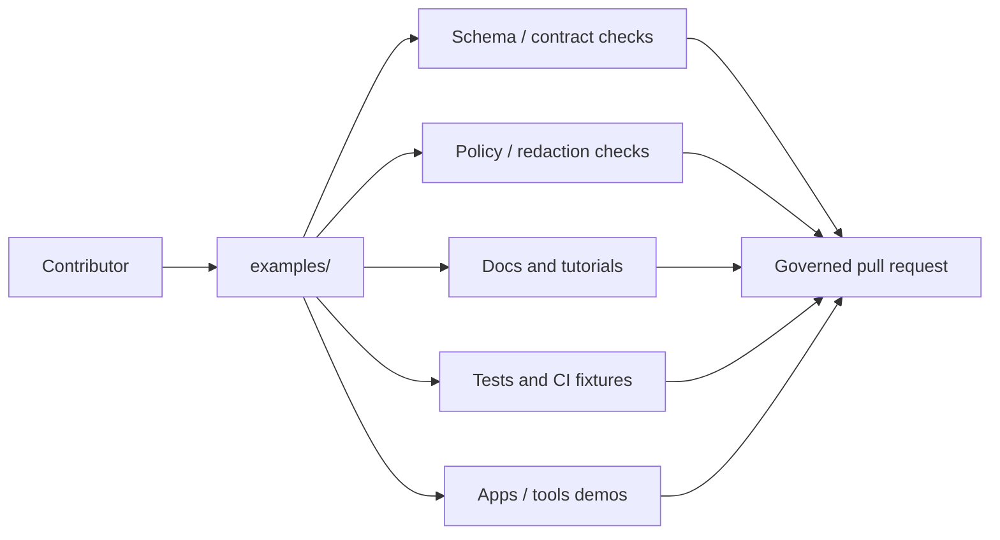

<!-- [KFM_META_BLOCK_V2]
doc_id: kfm://doc/6d9d1168-95cf-4b6f-96af-3b5da5d7c402
title: examples/README.md
type: standard
version: v1
status: draft
owners: TBD; verify in ../.github/CODEOWNERS
created: 2026-03-07
updated: 2026-03-07
policy_label: public
related: [../README.md, ../contracts/, ../schemas/, ../policy/, ../tests/, ../docs/]
tags: [kfm, examples, fixtures, docs]
notes: [Directory README for safe example material and demonstration assets.]
[/KFM_META_BLOCK_V2] -->

> **Status:** active  
> **Owners:** TBD; verify in [`../.github/CODEOWNERS`](../.github/CODEOWNERS)  
>     
> **Quick jump:** [Scope](#scope) · [Repo fit](#repo-fit) · [Accepted inputs](#accepted-inputs) · [Exclusions](#exclusions) · [Directory tree](#directory-tree) · [Quickstart](#quickstart) · [Repository guide](#repository-guide) · [Diagram](#diagram) · [Definition of done](#definition-of-done) · [FAQ](#faq) · [Appendix](#appendix)

# examples

Safe example material, fixtures, and demonstration assets for Kansas Frontier Matrix.

## Scope

This directory holds **small, reviewable, non-sensitive examples** that help contributors understand how KFM contracts, policies, and product surfaces behave.

Examples here should be easy to inspect, safe to publish, and cheap to run in CI. They are **supporting artifacts**, not canonical datasets and not a shortcut around the governed data lifecycle.

## Repo fit

- **Path:** `/examples/`
- **Upstream:** [`../README.md`](../README.md), [`../contracts/`](../contracts/), [`../schemas/`](../schemas/), [`../policy/`](../policy/), [`../data/`](../data/)
- **Downstream:** [`../tests/`](../tests/), [`../docs/`](../docs/), [`../apps/`](../apps/), [`../tools/`](../tools/)
- **Use this directory for:** safe fixtures, demo payloads, generalized spatial samples, policy examples, and tiny reproducible assets used by docs, tests, or application demos
- **Do not use this directory for:** production data, authoritative catalog records, unpublished research assets, or anything that must move through the full RAW → WORK → PROCESSED truth path

## Accepted inputs

This directory may contain:

- synthetic or heavily minimized example payloads
- public-domain or clearly licensed sample files
- generalized or redacted geospatial examples
- tiny STAC / DCAT / PROV / API examples for documentation and tests
- example request / response bodies for governed API behavior
- CI fixtures that verify schemas, policies, evidence resolution, or redaction behavior
- screenshots, thumbnails, or demo media that are safe to redistribute
- example notebooks or scripts only when they are small, reproducible, and do not require privileged access

## Exclusions

Do **not** place the following here:

- raw or processed production datasets
- secrets, tokens, credentials, internal endpoints, or signed URLs
- rights-unclear, culturally sensitive, or sensitive-location source material
- precise protected-site geometries or any other geometry that must be generalized before publication
- large binaries that make review or cloning expensive
- one-off local scratch files, analyst work-in-progress, or unpublished partner data
- policy-significant artifacts whose canonical home is under `data/`, `policy/`, `contracts/`, or `schemas/`

## Directory tree

### Current tree

```text
examples/
└── README.md
```

### Growth rule

Add subdirectories **only when the first real example for that topic lands**. Keep the current tree honest; do not create placeholder folders with no maintainer or consumer.

## Quickstart

```bash
# Inspect the current examples directory
find examples -maxdepth 3 -print | sort

# See which parts of the repo currently reference examples
git grep -n "examples/" .github docs tests apps tools contracts policy scripts 2>/dev/null || true
```

### Adding a new example

1. Keep it small, safe, and clearly named.
2. Prefer synthetic or public-domain content.
3. If it resembles real production structure, strip secrets and reduce the payload.
4. If it contains geometry, generalize or redact as needed before commit.
5. Link the example from the consumer that needs it: docs, tests, apps, or tools.
6. Run the relevant validators before opening a PR.

## Repository guide

| Concern | Best home | Why |
|---|---|---|
| Production datasets and versioned artifacts | [`../data/`](../data/) | Preserves the governed truth path and promotion model. |
| Public-facing narrative documentation | [`../docs/`](../docs/) | Keeps long-form explanation separate from fixtures. |
| API and schema contracts | [`../contracts/`](../contracts/), [`../schemas/`](../schemas/) | Makes public structure inspectable and testable. |
| Policy rules and access logic | [`../policy/`](../policy/) | Keeps governance explicit and reviewable. |
| Shared safe fixtures and demos | `/examples/` | Central place for tiny, redistributable examples. |
| Assertions and test logic | [`../tests/`](../tests/) | Keeps execution and expected outcomes near the test harness. |
| Runtime code | [`../apps/`](../apps/), [`../tools/`](../tools/) | Prevents examples from turning into hidden application logic. |

## Example classes

| Example class | Typical contents | Primary consumers | Notes |
|---|---|---|---|
| API examples | request / response JSON, curl snippets, audit-safe bodies | docs, apps, tests | Keep IDs fake or clearly non-production. |
| Catalog examples | STAC Items, Collections, DCAT records, PROV snippets | docs, tests, policy | Must validate or intentionally fail with explanation. |
| Spatial examples | tiny GeoJSON, generalized PMTiles references, redaction demos | docs, tools, tests | Never commit exact protected geometries. |
| Policy examples | allow / deny fixtures, masking examples, review-state examples | policy, tests, docs | Prefer one-file-per-case naming. |
| UI demo assets | screenshots, thumbnails, tiny demo records | docs, apps | Keep file sizes small and licensing explicit. |

## Usage rules

- Keep examples **deterministic** whenever possible.
- Name files for what they prove, not where they came from.
- Make failure fixtures obvious, for example `*.fail.json` or `*.deny.json`.
- Put a short local `README.md` in any subdirectory that grows beyond a handful of files.
- If a consumer disappears, either move the example to its new owner or delete it.
- If an example needs explanation longer than the file itself, the explanation belongs in `docs/` and should link back here.

## Diagram


```mermaid
flowchart LR
    A[Contributor] --> B[examples/]
    B --> C[Schema / contract checks]
    B --> D[Policy / redaction checks]
    B --> E[Docs and tutorials]
    B --> F[Tests and CI fixtures]
    B --> G[Apps / tools demos]

    C --> H[Governed pull request]
    D --> H
    E --> H
    F --> H
    G --> H
```

## Definition of done

A new example is ready to merge only when all of the following are true:

- [ ] The example has a clear consumer in `docs/`, `tests/`, `apps/`, or `tools/`.
- [ ] The example is synthetic, generalized, or clearly redistributable.
- [ ] No secrets, credentials, or privileged URLs are present.
- [ ] Any geometry is already safe for publication.
- [ ] The file size is reasonable for normal review.
- [ ] The filename communicates intent, not just source.
- [ ] Relevant validation or policy checks have been run.
- [ ] The PR explains why the example belongs in `/examples/` instead of `data/` or `docs/`.
- [ ] If the example is intentionally invalid, that purpose is documented.
- [ ] The example does not create a side channel around KFM governance.

## Task list

- [ ] Add the first real topic subdirectory only when a concrete consumer exists.
- [ ] Add at least one schema-valid example and one intentionally failing example for each governed format that uses this directory.
- [ ] Link every committed example from its owning docs page or test.
- [ ] Remove stale examples that are no longer referenced by any consumer.
- [ ] Add per-subdirectory README files when a topic grows past a few artifacts.

## FAQ

### Why not put all sample data under `data/`?

Because `/data/` is the home of the governed dataset lifecycle. `/examples/` is for **safe demonstration material** that should stay lightweight and easy to review.

### Can I put a real dataset here if it is public?

Usually no. If it is important enough to be treated as a real source or product, it should go through the proper data, catalog, and promotion path. Keep `/examples/` for tiny, distributable slices and fixtures.

### Can tests depend on files in this directory?

Yes, when the files are small, stable, and safe to publish. Keep the **test logic** in `../tests/`; keep only the shared example artifacts here.

### Can I use this directory for screenshots?

Yes, if they are small, redistributable, and actually support docs, tests, or demos. Avoid piling up unreferenced media.

## Appendix

<details>
<summary>Suggested future layout (illustrative only; add folders only when needed)</summary>

```text
examples/
├── api/
│   ├── README.md
│   └── requests-and-responses/
├── catalog/
│   ├── README.md
│   ├── stac/
│   ├── dcat/
│   └── prov/
├── policy/
│   ├── README.md
│   ├── allow/
│   └── deny/
├── spatial/
│   ├── README.md
│   ├── geojson/
│   └── redaction/
└── ui/
    ├── README.md
    └── screenshots/
```

Use this only as a naming guide. Do not pre-create the structure unless a real example and a real consumer exist.

</details>

[Back to top](#examples)