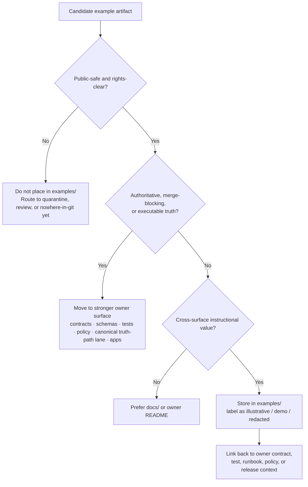

<!-- [KFM_META_BLOCK_V2]
doc_id: kfm://doc/NEEDS-VERIFICATION
title: examples
type: standard
version: v1
status: draft
owners: NEEDS VERIFICATION
created: YYYY-MM-DD
updated: YYYY-MM-DD
policy_label: NEEDS VERIFICATION
related: [../README.md, ../CONTRIBUTING.md, ../.github/README.md]
tags: [kfm, examples, fixtures, readme]
notes: [doc_id, owners, dates, policy_label, and related links require repo verification; current session verified PDF doctrine and March 2026 realization overlays, not a mounted repo tree]
[/KFM_META_BLOCK_V2] -->

# examples

Public-safe, non-authoritative sample datasets, example payloads, thin-slice illustrations, and demo assets for Kansas Frontier Matrix.

| Field | Value |
|---|---|
| Status | experimental |
| Owners | **NEEDS VERIFICATION** |
| Path | `examples/README.md` |
| Repo fit | **PROPOSED** public-safe explanatory lane for example packs, demo payloads, and walkthrough artifacts |
| Quick jumps | [Scope](#scope) · [Repo fit](#repo-fit) · [Accepted inputs](#accepted-inputs) · [Exclusions](#exclusions) · [Directory tree](#directory-tree) · [Quickstart](#quickstart) · [Usage](#usage) · [Diagram](#diagram) · [Tables](#tables) · [Task list](#task-list--definition-of-done) · [FAQ](#faq) · [Appendix](#appendix) |


> [!IMPORTANT]
> This README is intentionally **evidence-bounded**.
>
> In the current session, March 2026 KFM doctrine and realization overlays were visible through attached PDFs, but a checked-out repository tree was **not** directly verified. Read path-level claims below as:
>
> - **CONFIRMED** when they reflect stable KFM doctrine or direct source text
> - **PROPOSED** when they follow the strongest March 2026 realization overlays but were not verified in a mounted checkout
> - **UNKNOWN** when current repo state, implementation depth, or owner placement is not proven here
> - **NEEDS VERIFICATION** when a placeholder, link, owner, or path must be checked against the active branch
>
> Nothing in `examples/` should masquerade as canonical truth, promoted data, release proof, policy truth, or rights-unclear source material.

> [!NOTE]
> March 2026 sources report **more than one** home for example-like artifacts. The corpus mentions `contracts/examples/valid/`, `contracts/examples/invalid/`, `fixtures/valid/`, `fixtures/invalid/`, `examples/thin_slice/hydrology/`, and `examples/thin-slice/hydrology/`. This README therefore keeps `examples/` narrow: it is the **public-safe explanatory lane**, not the automatic home for every fixture in the project.

---

## Scope

`examples/` is the repo’s **working example lane for public-safe explanation**.

Its job is to help contributors, reviewers, and maintainers inspect how KFM objects, flows, and surfaces are supposed to look **without** confusing sample material with canonical records, promoted releases, or runtime truth. In KFM terms, this directory should support the **truth path** and the **trust membrane**, not weaken them.

That makes `examples/` intentionally narrow:

- keep **small, inspectable, public-safe** material here
- keep **authoritative or merge-blocking** material with its owning surface
- keep **sensitive, rights-unclear, release-bearing, or canonical** material out
- keep example packs current enough that they do not drift away from contracts, runbooks, and trust-visible UI behavior

A good example here should explain something real, remain visibly illustrative, and be easy to move once a stronger owner surface is confirmed.

[Back to top](#examples)

## Repo fit

**Path:** `examples/README.md`

**Role in repo:** directory README for public-safe example material and demo assets.

### Upstream and downstream links

**Upstream links** *(inherited placeholders — verify in the mounted checkout)*:
- [`../README.md`](../README.md)
- [`../CONTRIBUTING.md`](../CONTRIBUTING.md)
- [`../.github/README.md`](../.github/README.md)

**Downstream**:
- [`./README.md`](./README.md)
- any future public-safe example packs created beneath `examples/`

### Likely stronger owner surfaces *(PROPOSED until checkout verification)*

| Likely owner surface | What belongs there | Why it should not default to `examples/` |
|---|---|---|
| `contracts/` and/or `schemas/` | machine-readable contract files, contract examples, standards profiles, schema-adjacent valid/invalid samples | contract homes should stay diffable, testable, and versioned |
| `tests/` or fixture-owning lanes | executable fixtures, regression packs, negative-path coverage, correction drills, UI state checks | merge-blocking proof belongs with tests |
| `policy/` | reason codes, obligation codes, policy bundles, decision fixtures, runtime outcome registries | executable policy should not hide inside demos |
| canonical truth-path data surface | `RAW`, `WORK / QUARANTINE`, `PROCESSED`, `CATALOG`, `PUBLISHED` artifacts and release-bearing objects | canonical truth-path material is not example material |
| `apps/` or governed API surfaces | live route payloads, surface-state mappings, shell-facing contracts, mounted runtime examples | active surface behavior should stay with its owner |
| `docs/` and `docs/runbooks/` | long-form walkthroughs, ADRs, procedures, release/correction runbooks, operational reference | narrative authority belongs in docs, not in a sample lane |

> [!TIP]
> A useful rule of thumb: if the artifact is needed to make CI fail, promotion pass, policy decide, or runtime truth resolve, it probably has a stronger owner than `examples/`.

[Back to top](#examples)

## Accepted inputs

Content that belongs here includes:

- small, public-safe sample datasets or subsets used for walkthroughs
- redacted example payloads for map, dossier, story, Evidence Drawer, or Focus surfaces
- illustrative `EvidenceBundle`, `RuntimeResponseEnvelope`, `ProjectionBuildReceipt`, or release/proof examples when they are clearly labeled as non-authoritative
- tiny sample objects that explain KFM contract families without pretending to be canonical
- hydrology-first thin-slice illustration packs when the goal is explanation rather than merge-blocking execution
- review-overlay or steward-packet examples when they are public-safe and explicitly non-authoritative
- onboarding, screenshot, or tutorial assets that help readers understand governed behavior
- sidecar metadata that clarifies purpose, owner surface, redaction status, and limits

Examples here should be **labeled**, **reviewable in one diff**, and **obviously illustrative**.

[Back to top](#examples)

## Exclusions

The following do **not** belong here:

- canonical `RAW`, `WORK`, `QUARANTINE`, `PROCESSED`, `CATALOG`, or `PUBLISHED` artifacts
- release manifests, proof packs, correction notices, or other release-bearing evidence objects presented as system truth
- authoritative contract schemas or merge-blocking valid/invalid fixtures
- secrets, tokens, local environment files, or machine-specific configuration
- rights-unclear, restricted, or precise sensitive-location material
- large binaries, dumps, archives, or model files that add weight without review value
- example payloads that imply verified route names, DTO names, or mounted schemas that the checkout has not proved
- narrative claims presented as authoritative fact without provenance and release context

### Send these elsewhere instead

| If the artifact is… | Prefer… |
|---|---|
| canonical truth-path material | the relevant canonical data or release surface |
| machine-checkable contract or standards material | `contracts/` and/or `schemas/` |
| merge-blocking valid/invalid fixture coverage | fixture-owning test lanes |
| executable policy logic or registry state | `policy/` |
| long-form explanation or operational procedure | `docs/` or `docs/runbooks/` |
| restricted, rights-unclear, or unresolved material | quarantine, review, or no Git placement yet |

[Back to top](#examples)

## Directory tree

### Conservative current view

```text
examples/
└── README.md   # target of this revision; mounted repo shape still needs verification
```

This README is designed to stay useful even if `examples/` is otherwise sparse.

<details>
<summary><strong>Source-reported / PROPOSED growth shapes</strong></summary>

The March 2026 corpus points to several plausible example and fixture homes. Do not freeze any one of these as settled repo fact until the checkout confirms it.

```text
# Path family reported in some integrated March 2026 manuals
examples/
└── thin_slice/
    └── hydrology/
        ├── source_descriptor.json
        ├── ingest_receipt.json
        ├── dataset_version.json
        ├── catalog_closure.json
        ├── release_manifest.json
        └── evidence_bundle.json
```

```text
# Path family reported in later starter-layout examples
examples/
└── thin-slice/
    └── hydrology/
        ├── source_descriptor.json
        ├── ingest_receipt.json
        ├── validation_report.json
        ├── decision_envelope.json
        ├── review_record.json
        ├── release_manifest.json
        ├── projection_build_receipt.json
        ├── runtime_response_envelope.json
        └── correction_notice.json
```

```text
# Contract-owned and fixture-owned variants also appear
contracts/
└── examples/
    ├── valid/
    └── invalid/

fixtures/
├── valid/
└── invalid/
```

Working interpretation for this README:

- keep **public-safe explanatory packs** in `examples/`
- keep **contract-owned valid/invalid examples** with `contracts/` or `schemas/`
- keep **merge-blocking executable fixtures** with `tests/` or fixture-owning lanes
- treat underscore-vs-hyphen naming as an active verification item, not a settled convention
</details>

[Back to top](#examples)

## Quickstart

Verify the checkout first. Do **not** assume this README’s neighboring paths are mounted exactly as shown until the active branch proves them.

```bash
# Verify the checkout shape before relying on path claims
pwd
find . -maxdepth 2 -type d | sort
```

Inspect the example lane and the most likely neighboring owner surfaces:

```bash
# Example lane itself
find examples -maxdepth 4 -print 2>/dev/null | sort || true

# Likely stronger owner surfaces, if present
find contracts schemas fixtures tests docs policy apps -maxdepth 3 -print 2>/dev/null | sort | sed -n '1,200p'
```

Check which naming pattern the active checkout actually uses before adding a thin-slice pack:

```bash
find . \( -path "*/examples/*" -o -path "*/fixtures/*" -o -path "*/contracts/examples/*" \) 2>/dev/null | sort
```

Before adding a new artifact, answer these questions:

1. Is it public-safe and rights-clear?
2. Is it obviously illustrative rather than authoritative?
3. Would `contracts/`, `schemas/`, `tests/`, `policy/`, a canonical truth-path surface, `apps/`, or `docs/` own it more naturally?
4. If it demonstrates governed behavior, where is the owner surface that proves that behavior?
5. Can it be deleted or relocated later without breaking the repo’s source of truth?

[Back to top](#examples)

## Usage

### 1. Choose the owning surface first

Start by deciding where the **source of truth** lives.

- If the material defines a contract, schema, or standards-facing envelope, its stronger owner is probably `contracts/` or `schemas/`.
- If it proves positive or negative behavior, its stronger owner is probably `tests/` or a fixture-owning lane.
- If it carries policy logic or review-role semantics, its stronger owner is probably `policy/`.
- If it is part of the governed lifecycle, it likely belongs with the canonical truth-path owner surface.
- If it explains a user flow or runbook, `docs/` may be the better home.

Put material in `examples/` only when the value is **instructional, public-safe, and cross-surface**.

### 2. Keep examples small, labeled, and reversible

A good example in this directory should be:

- small enough to inspect in one screenful or one pull request
- labeled as `example`, `demo`, `illustrative`, `redacted`, or equivalent
- explicit about what it proves and what it does **not** prove
- easy to relocate once a stronger owner surface becomes available

### 3. Pair behavior-heavy examples with stronger proof

If the example demonstrates validation, policy, release, or runtime behavior, do not leave it alone.

Link it back to:

- the owning contract or schema
- the relevant test or fixture lane
- the governing runbook
- the policy or review rule that makes the behavior valid
- the release or correction context that keeps the example inspectable

### 4. Treat documentation drift as a real failure mode

KFM’s March 2026 verification overlays explicitly treat contracts, examples, diagrams, runbooks, and trust-visible outputs as part of a documentation/accessibility gate. An example pack that drifts away from current contracts or surface behavior is not harmless clutter; it is misleading project memory.

### 5. Prefer cross-linking over duplicate authority

`examples/` should make the repo easier to navigate, not create a second authority layer.

A strong example pack should point back to the owner surface, not replace it.

[Back to top](#examples)

## Diagram


```mermaid
flowchart TD
    A[Candidate example artifact] --> B{Public-safe and rights-clear?}
    B -- No --> X[Do not place in examples/<br/>Route to quarantine, review, or nowhere-in-git yet]
    B -- Yes --> C{Authoritative, merge-blocking,<br/>or executable truth?}
    C -- Yes --> D[Move to stronger owner surface<br/>contracts · schemas · tests · policy · canonical truth-path lane · apps]
    C -- No --> E{Cross-surface instructional value?}
    E -- No --> F[Prefer docs/ or owner README]
    E -- Yes --> G[Store in examples/<br/>label as illustrative / demo / redacted]
    G --> H[Link back to owner contract,<br/>test, runbook, policy, or release context]
```

[Back to top](#examples)

## Tables

### Placement matrix

| Artifact class | Keep in `examples/`? | Stronger owner when authoritative | Why |
|---|---|---|---|
| Tiny redacted request/response sample | Yes | `contracts/`, `schemas/`, or `apps/` | Good for walkthroughs; weak as source of truth |
| Story or dossier demo payload | Yes, if public-safe | `apps/` plus tests/docs | Helpful for review and onboarding |
| `EvidenceBundle` or `RuntimeResponseEnvelope` illustration | Yes, if clearly labeled | contract + app + test lanes | Useful for UI/API review, unsafe as lone authority |
| Valid contract example | Usually no | `contracts/examples/valid/`, `schemas/`, or fixture-owning lanes | Canonical contract fixtures should stay with the contract home |
| Invalid contract example | Usually no | `contracts/examples/invalid/`, `fixtures/invalid/`, or `tests/` | Negative behavior should stay executable and reviewable |
| Hydrology thin-slice illustration pack | Sometimes | fixture lanes, contract lanes, or test-owned thin-slice proof | Good here only when explanatory and public-safe |
| Canonical dataset snapshot | No | governed truth-path owner surface | Examples must not replace the truth path |
| Release manifest / proof pack / correction notice | No, unless explicitly illustrative and non-authoritative | release, delivery, or ops evidence surfaces | These are evidence-bearing operational artifacts |
| Sensitive coordinates / rights-unclear material | No | nowhere in Git until resolved | Violates KFM trust posture |
| Screenshot or UI walkthrough asset | Yes, if public-safe | `docs/` or `apps/` | Useful when it supports, not replaces, real behavior |

### Path-shape status matrix

| Path family reported in March 2026 corpus | Status | How to treat it here |
|---|---|---|
| `contracts/examples/valid/` and `contracts/examples/invalid/` | **PROPOSED** repo shape | Strong signal for contract-owned examples; verify before creating paths |
| `fixtures/valid/` and `fixtures/invalid/` | **PROPOSED** repo shape | Strong signal for CI-facing fixtures; keep them out of `examples/` by default |
| `examples/thin_slice/hydrology/` | **PROPOSED** repo shape | Treat as one reported thin-slice naming variant |
| `examples/thin-slice/hydrology/` | **PROPOSED** repo shape | Treat as a second reported naming variant |
| `examples/README.md` itself | **NEEDS VERIFICATION** as mounted file | Suitable directory README target, but current checkout was not visible here |

### Status language used here

| Label | Use here when… |
|---|---|
| **CONFIRMED** | stable KFM doctrine or direct source text supports the statement |
| **PROPOSED** | the shape is repo-native and supported by fresh March 2026 realization overlays, but not verified in the mounted checkout |
| **UNKNOWN** | current repo state, owner placement, or implementation depth is not established here |
| **NEEDS VERIFICATION** | a placeholder field, link, owner, or path must be checked before commit |

[Back to top](#examples)

## Task list / Definition of done

A contribution to `examples/` is ready when all relevant checks below are true:

- [ ] It is public-safe, rights-clear, and small enough to review quickly.
- [ ] It is labeled as **example**, **demo**, **illustrative**, **redacted**, or equivalent.
- [ ] It does not pretend to be canonical truth, a promoted dataset, or release evidence.
- [ ] The stronger owner surface is identified and linked when one exists.
- [ ] If it demonstrates behavior, the related contract, policy, test, or runbook is linked.
- [ ] If it is a thin-slice illustration pack, a reviewer can move from example read -> evidence -> release or correction context without a trust gap.
- [ ] If a negative path matters, the failing example exists in a reviewable owner surface.
- [ ] No secrets, tokens, local machine paths, or restricted precise coordinates are embedded.
- [ ] If trust-visible surface behavior changes, the documentation/accessibility implications are updated too.
- [ ] The example improves contributor understanding more than it increases maintenance cost.
- [ ] Relocation or deletion is easy once the stronger owner surface is confirmed.

[Back to top](#examples)

## FAQ

### Why can this directory stay small?

Because a narrow, honest example lane is still useful. The directory can clarify what belongs here and what must stay with stronger owner surfaces even before it holds many files.

### Where should valid and invalid fixtures live?

Prefer the strongest owner surface. Fresh March 2026 overlays repeatedly center **contract-owned valid/invalid examples** and **fixture- or test-owned executable checks**, not a catch-all sample folder.

### Why not store real dataset snapshots here?

Because KFM separates examples from authoritative truth. Governed data belongs in the truth path and its owning release/data surfaces, not in a convenience directory.

### What about the first thin slice?

The corpus strongly prefers a **public-safe hydrology-first governed slice**, but it does **not** prove one final repo path for those files. Keep any `examples/` thin-slice pack explanatory and public-safe; let executable proof move to its stronger owner lane.

### When should something move out of `examples/`?

Move it once it becomes authoritative, merge-blocking, schema-governing, release-bearing, or tightly owned by one surface.

[Back to top](#examples)

## Appendix

<details>
<summary><strong>PROPOSED sidecar fields for richer example packs</strong></summary>

Use a sidecar only when the example needs more context than a filename can carry.

```yaml
example_id: NEEDS-VERIFICATION
title: Example title
purpose: Short sentence explaining what this demonstrates
authority_status: illustrative
owner_surface: contracts/ | schemas/ | tests/ | policy/ | apps/ | docs/ | canonical-truth-path-surface
redaction_status: public_safe
related_contracts: []
related_tests: []
related_runbooks: []
related_release_artifacts: []
source_state: source_reported_or_proposed
notes:
  - Replace placeholders before commit
  - Link the stronger owner surface when known
```

A sidecar should reduce ambiguity, not add ceremony.
</details>

<details>
<summary><strong>PROPOSED naming guidance</strong></summary>

Prefer names that tell a reviewer what the asset is doing:

- `public-read-example.json`
- `focus-abstain-example.json`
- `story-citation-example.md`
- `catalog-closure-example.json`
- `redacted-feature-example.geojson`
- `hydrology-evidence-bundle-example.json`

Avoid names that imply authority or production state:

- `final.json`
- `real_data.csv`
- `release-ready.geojson`
- `truth-layer.parquet`
- `production-response.json`
</details>

<details>
<summary><strong>March 2026 path-shape caution</strong></summary>

The March 2026 corpus does **not** fully agree on one example/fixture naming convention. The following all appear in source-reported or proposed form:

- `contracts/examples/valid/*`
- `contracts/examples/invalid/*`
- `fixtures/valid/*`
- `fixtures/invalid/*`
- `examples/thin_slice/hydrology/*`
- `examples/thin-slice/hydrology/*`

Do not let this README silently settle that debate. Verify the active repo convention first, then keep `examples/` aligned to it without weakening contract ownership, fixture ownership, or truth-path discipline.
</details>

[Back to top](#examples)
