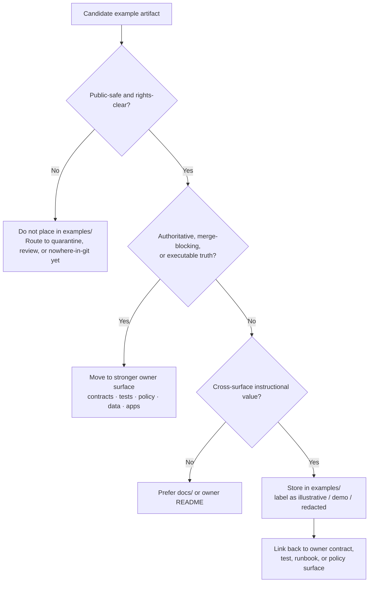

<!-- [KFM_META_BLOCK_V2]
doc_id: kfm://doc/NEEDS-VERIFICATION
title: examples
type: standard
version: v1
status: draft
owners: NEEDS VERIFICATION
created: YYYY-MM-DD
updated: YYYY-MM-DD
policy_label: NEEDS VERIFICATION
related: [../README.md, ../CONTRIBUTING.md, ../.github/README.md]
tags: [kfm, examples, fixtures, readme]
notes: [doc_id, owners, dates, policy_label, and related links require repo verification; current session verified PDF doctrine, not a mounted repo tree]
[/KFM_META_BLOCK_V2] -->

# examples

Public-safe, non-authoritative sample datasets, stories, policies, and demo assets for Kansas Frontier Matrix.

| Field | Value |
|---|---|
| Status | experimental |
| Owners | **NEEDS VERIFICATION** |
| Path | `examples/README.md` |
| Repo fit | cross-surface example lane for public-safe walkthrough material, demo payloads, and instructional artifacts |
| Quick jumps | [Scope](#scope) · [Repo fit](#repo-fit) · [Accepted inputs](#accepted-inputs) · [Exclusions](#exclusions) · [Directory tree](#directory-tree) · [Quickstart](#quickstart) · [Usage](#usage) · [Diagram](#diagram) · [Tables](#tables) · [Task list](#task-list--definition-of-done) · [FAQ](#faq) · [Appendix](#appendix) |


> [!IMPORTANT]
> This README is intentionally **evidence-bounded**.
>
> In the current session, KFM doctrine and realization detail were visible through the mounted March 2026 PDF corpus, but a checked-out repository tree was **not** directly verified. Read path-level claims below as:
>
> - **CONFIRMED** when they reflect stable KFM doctrine or direct source text
> - **PROPOSED** when they follow the strongest March 2026 realization overlays but were not verified in a mounted checkout
> - **UNKNOWN** when current repo state, implementation depth, or owner placement is not proven here
> - **NEEDS VERIFICATION** when a placeholder or inherited link must be checked against the active branch
>
> Nothing in `examples/` should masquerade as canonical truth, promoted data, release proof, policy truth, or rights-unclear source material.

> [!NOTE]
> Fresh March 2026 sources use **more than one** home for example-like artifacts: `contracts/examples/*`, `fixtures/*`, and `examples/thin_slice/*` all appear in project materials. This README therefore keeps `examples/` narrow: it is the **public-safe explanatory lane**, not the automatic home for every fixture in the repo.

---

## Scope

`examples/` is the repo’s **public-safe example lane**.

Its job is to help contributors, reviewers, and maintainers inspect how KFM objects, flows, and surfaces are supposed to look **without** confusing sample material with canonical records, promoted releases, or runtime truth. In KFM terms, this directory should support the **truth path** and the **trust membrane**, not weaken them.

That makes `examples/` intentionally narrow:

- keep **small, inspectable, public-safe** material here
- keep **authoritative or merge-blocking** material with its owning surface
- keep **sensitive, rights-unclear, release-bearing, or canonical** material out

A good example here should explain something real, remain visibly illustrative, and be easy to move once a stronger owner surface is confirmed.

[Back to top](#examples)

## Repo fit

**Path:** `examples/README.md`

**Role in repo:** directory README for public-safe example material and demo assets.

**Upstream links** *(inherited placeholders — verify in the mounted checkout)*:
- [`../README.md`](../README.md)
- [`../CONTRIBUTING.md`](../CONTRIBUTING.md)
- [`../.github/README.md`](../.github/README.md)

**Downstream**:
- [`./README.md`](./README.md)
- any future public-safe example packs created beneath `examples/`

### Source-reported / proposed owner surfaces

The March 2026 corpus repeatedly points to stronger owner surfaces for authoritative or executable material. Treat the table below as **repo-native guidance**, not as a claim that every path is mounted exactly as shown today.

| Owner surface | What belongs there | Why it should not default to `examples/` |
|---|---|---|
| `../contracts/` | machine-readable contract schemas, standards profiles, API descriptions, canonical valid/invalid contract examples | contract homes should stay diffable, testable, and versioned |
| `../tests/` | executable fixtures, regression packs, end-to-end proof lanes, negative-path behavior | merge-blocking behavior belongs with tests |
| `../policy/` | reason codes, obligation codes, review-role maps, policy fixtures and bundles | executable policy should not hide inside demos |
| `../data/` | governed `raw/`, `work/`, `processed/`, `catalog/`, `receipts/`, `registry/` lanes | canonical truth path material is not example material |
| `../apps/` | runtime-owned UI/API behavior, route-specific samples, surface-linked assets | live surface behavior should stay with its owner |
| `../docs/` | runbooks, ADRs, long-form walkthroughs, explanation-heavy reference material | narrative authority belongs in docs, not in a sample lane |

> [!TIP]
> A useful rule of thumb: if the artifact is needed to make CI fail, promotion pass, policy decide, or runtime truth resolve, it probably has a stronger owner than `examples/`.

[Back to top](#examples)

## Accepted inputs

Content that belongs here includes:

- small, public-safe sample datasets or subsets used for walkthroughs
- redacted example payloads for map, dossier, story, Evidence Drawer, or Focus surfaces
- tiny sample objects that explain KFM contract families without pretending to be canonical
- demo packs used in onboarding, screenshots, tutorials, or review walkthroughs
- public-safe thin-slice illustrative artifacts when the goal is explanation rather than merge-blocking execution
- example-sidecar metadata that clarifies purpose, limits, owner surface, and redaction status

Typical examples here should be **labeled**, **reviewable in one diff**, and **obviously illustrative**.

[Back to top](#examples)

## Exclusions

The following do **not** belong here:

- canonical `raw/`, `work/`, `processed/`, `catalog/`, or `published` artifacts
- release manifests, proof packs, correction notices, or other release-bearing evidence objects
- authoritative contract schemas or merge-blocking valid/invalid fixtures
- secrets, tokens, local environment files, or machine-specific configuration
- rights-unclear, restricted, or precise sensitive-location material
- large binaries, model files, convenience dumps, or archives that add weight without review value
- narrative claims presented as authoritative fact without evidence and provenance context

Where these should go instead:

- governed truth-path artifacts belong with `data/` or the relevant runtime publication lane
- executable contract examples belong with `contracts/` and/or `tests/`
- release and correction evidence belongs with release/runbook/ops surfaces
- restricted or unresolved material should remain quarantined until policy and rights state are clear

[Back to top](#examples)

## Directory tree

### Conservative current view

```text
examples/
└── README.md   # target of this revision; mounted repo shape still needs verification
```

This README is designed to remain useful even if `examples/` is otherwise sparse.

<details>
<summary><strong>Source-reported / PROPOSED growth shapes</strong></summary>

The March 2026 corpus points to several plausible example and fixture homes. Do not freeze any one of these as settled repo fact until the checkout confirms it.

```text
examples/
├── thin_slice/
│   └── hydrology/
│       ├── source_descriptor.json
│       ├── ingest_receipt.json
│       ├── dataset_version.json
│       ├── catalog_closure.json
│       ├── release_manifest.json
│       └── evidence_bundle.json
└── README.md
```

```text
contracts/
└── examples/
    ├── valid/
    └── invalid/
```

```text
fixtures/
├── valid/
├── invalid/
└── thin_slice/
    └── hydrology/
```

Working interpretation for this README:

- keep **public-safe explanatory packs** in `examples/`
- keep **contract-owned valid/invalid examples** with `contracts/`
- keep **merge-blocking executable fixtures** with `tests/` or fixture-owning lanes
</details>

[Back to top](#examples)

## Quickstart

Verify the checkout first. Do **not** assume this README’s neighboring paths are mounted exactly as shown until the active branch proves them.

```bash
# Verify the checkout shape before relying on path claims
pwd
find . -maxdepth 2 -type d | sort
```

Inspect the example lane and its likely owner surfaces:

```bash
# examples/ itself
find examples -maxdepth 3 -type f | sort 2>/dev/null || true

# stronger owner surfaces, if present in the checkout
find contracts tests docs data apps policy -maxdepth 2 -type f 2>/dev/null | sort | head -200
```

Illustrative local flow only — verify project commands before use:

```bash
# Example-only commands drawn from KFM documentation patterns
make validate-schemas
make test
make sample-ingest SOURCE=example_fixture
make catalog-validate
```

Before adding a new artifact, answer these questions:

1. Is it public-safe and rights-clear?
2. Is it obviously illustrative rather than authoritative?
3. Would `contracts/`, `tests/`, `policy/`, `data/`, `apps/`, or `docs/` own it more naturally?
4. If it demonstrates governed behavior, where is the owner surface that proves that behavior?
5. Can it be deleted or relocated later without breaking the repo’s source of truth?

[Back to top](#examples)

## Usage

### 1. Choose the owning surface first

Start by deciding where the **source of truth** lives.

- If the material defines a contract, schema, or runtime envelope, its stronger owner is probably `contracts/`.
- If it proves positive/negative behavior, its stronger owner is probably `tests/`.
- If it carries policy logic or review-role semantics, its stronger owner is probably `policy/`.
- If it is part of the governed lifecycle, it likely belongs somewhere in `data/`.
- If it explains a user flow or runbook, `docs/` may be the better home.

Put material in `examples/` only when the value is **instructional, public-safe, and cross-surface**.

### 2. Keep examples small, labeled, and reversible

A good example in this directory should be:

- small enough to inspect in one screenful or one pull request
- labeled as `example`, `demo`, `illustrative`, `redacted`, or equivalent
- explicit about what it proves and what it does **not** prove
- easy to relocate once a stronger owner surface becomes available

### 3. Pair behavior-heavy examples with stronger proof

If the example demonstrates validation, policy, or runtime behavior, do not leave it alone.

Link it back to:

- the owning contract or schema
- the relevant test lane
- the governing runbook or doctrine
- the policy or review rule that makes the behavior valid

### 4. Prefer cross-linking over duplicate authority

`examples/` should make the repo easier to navigate, not create a second authority layer.

A strong example pack should point back to the owner surface, not replace it.

[Back to top](#examples)

## Diagram


```mermaid
flowchart TD
    A[Candidate example artifact] --> B{Public-safe and rights-clear?}
    B -- No --> X[Do not place in examples/<br/>Route to quarantine, review, or nowhere-in-git yet]
    B -- Yes --> C{Authoritative, merge-blocking,<br/>or executable truth?}
    C -- Yes --> D[Move to stronger owner surface<br/>contracts · tests · policy · data · apps]
    C -- No --> E{Cross-surface instructional value?}
    E -- No --> F[Prefer docs/ or owner README]
    E -- Yes --> G[Store in examples/<br/>label as illustrative / demo / redacted]
    G --> H[Link back to owner contract,<br/>test, runbook, or policy surface]
```

[Back to top](#examples)

## Tables

### Placement matrix

| Artifact class | Keep in `examples/`? | Stronger owner when authoritative | Why |
|---|---|---|---|
| Tiny redacted request/response sample | Yes | `../contracts/` or `../apps/` | Good for walkthroughs; weak as source of truth |
| Story or dossier demo payload | Yes, if public-safe | `../apps/` plus tests/docs | Helpful for review and onboarding |
| Valid contract example | Usually no | `../contracts/examples/valid/` | Canonical contract fixtures should stay with the contract home |
| Invalid contract example | Usually no | `../contracts/examples/invalid/` or `../tests/` | Negative behavior should stay executable and reviewable |
| Thin-slice hydrology example pack | Sometimes | `../tests/`, `../fixtures/`, or contract owner lane | Good here only when explanatory and public-safe |
| Canonical dataset snapshot | No | governed `data/` lanes | Examples must not replace the truth path |
| Release manifest / proof pack / correction notice | No | runbook, release, or ops evidence surface | These are evidence-bearing operational artifacts |
| Sensitive coordinates / rights-unclear material | No | nowhere in git until resolved | Violates KFM trust posture |
| Screenshot or UI walkthrough asset | Yes, if public-safe | `../docs/` or `../apps/` | Useful when it supports, not replaces, real behavior |

### Status language used here

| Label | Use here when… |
|---|---|
| **CONFIRMED** | stable KFM doctrine or direct source text supports the statement |
| **PROPOSED** | the shape is repo-native and supported by fresh March 2026 realization overlays, but not verified in the mounted checkout |
| **UNKNOWN** | current repo state, owner placement, or implementation depth is not established here |
| **NEEDS VERIFICATION** | a placeholder field, link, owner, or path must be checked before commit |

[Back to top](#examples)

## Task list / Definition of done

A contribution to `examples/` is ready when all relevant checks below are true:

- [ ] It is public-safe, rights-clear, and small enough to review quickly.
- [ ] It is labeled as **example**, **demo**, **illustrative**, **redacted**, or equivalent.
- [ ] It does not pretend to be canonical truth, a promoted dataset, or release evidence.
- [ ] The stronger owner surface is identified and linked when one exists.
- [ ] If it demonstrates behavior, the related contract, policy, test, or runbook is linked.
- [ ] If a negative path matters, the failing example exists in a reviewable owner surface.
- [ ] No secrets, tokens, local machine paths, or restricted precise coordinates are embedded.
- [ ] The example improves contributor understanding more than it increases maintenance cost.
- [ ] Relocation or deletion is easy once the stronger owner surface is confirmed.

[Back to top](#examples)

## FAQ

### Why can this directory stay small?

Because a narrow, honest example lane is still useful. The directory can clarify what belongs here and what must stay with stronger owner surfaces even before it holds many files.

### Where should valid and invalid fixtures live?

Prefer the strongest owner surface. Fresh March 2026 KFM realization and verification overlays center **contract-owned valid/invalid examples** and **test-owned executable fixtures**, not a catch-all sample folder.

### Why not store real dataset snapshots here?

Because KFM separates examples from authoritative truth. Governed data belongs in the truth path and its owning data surfaces, not in a convenience directory.

### What about the first thin slice?

The corpus strongly prefers a **public-safe hydrology thin slice**, but it does **not** prove one final repo path for those files. Keep any `examples/` thin-slice pack explanatory and public-safe; let executable proof move to its stronger owner lane.

### When should something move out of `examples/`?

Move it once it becomes authoritative, merge-blocking, schema-governing, release-bearing, or tightly owned by one surface.

[Back to top](#examples)

## Appendix

<details>
<summary><strong>PROPOSED sidecar fields for richer example packs</strong></summary>

Use a sidecar only when the example needs more context than a filename can carry.

```yaml
example_id: NEEDS-VERIFICATION
title: Example title
purpose: Short sentence explaining what this demonstrates
authority_status: illustrative
owner_surface: ../contracts/ or ../tests/ or ../apps/ or ../docs/
redaction_status: public_safe
related_contracts: []
related_tests: []
related_runbooks: []
source_state: source_reported_or_proposed
notes:
  - Replace placeholders before commit
  - Link the stronger owner surface when known
```

A sidecar should reduce ambiguity, not add ceremony.
</details>

<details>
<summary><strong>PROPOSED naming guidance</strong></summary>

Prefer names that tell a reviewer what the asset is doing:

- `public-read-example.json`
- `focus-abstain-example.json`
- `story-citation-example.md`
- `catalog-closure-example.json`
- `redacted-feature-example.geojson`

Avoid names that imply authority or production state:

- `final.json`
- `real_data.csv`
- `release-ready.geojson`
- `truth-layer.parquet`
</details>

<details>
<summary><strong>Path-shape caution for future maintainers</strong></summary>

March 2026 KFM sources do **not** fully agree on one example/fixture naming convention. The following all appear in source-reported or proposed form:

- `contracts/examples/valid/*`
- `contracts/examples/invalid/*`
- `fixtures/valid/*`
- `fixtures/invalid/*`
- `examples/thin_slice/hydrology/*`
- `fixtures/thin_slice/hydrology/*`

Do not let this README silently settle that debate. Verify the active repo convention first, then keep `examples/` aligned to it without weakening contract ownership or test ownership.
</details>

[Back to top](#examples)
