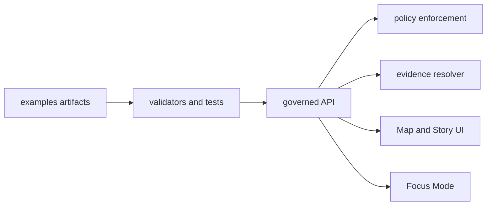

<!-- [KFM_META_BLOCK_V2]
doc_id: kfm://doc/9b589b1f-3a10-4fdf-b7c9-6d13fca4f0c2
title: examples/ — Example datasets, stories, and policy fixtures
type: standard
version: v1.1
status: draft
owners: KFM Maintainers
created: 2026-03-03
updated: 2026-03-03
policy_label: public
related:
  - ../docs/
  - ../data/
  - ../policy/
  - ../contracts/
  - ../tests/
  - ../tools/
tags: [kfm, examples]
notes:
  - This README documents the intent and governance rules for the examples/ directory.
  - Claims are explicitly labeled CONFIRMED / PROPOSED / UNKNOWN (per KFM evidence discipline).
[/KFM_META_BLOCK_V2] -->

# `examples/` — Example datasets, stories, and policy fixtures

> **One-line purpose:** **CONFIRMED:** `examples/` holds **sample datasets, stories, and policies** (example data + narratives) used to demonstrate and test KFM — while respecting the governed “truth path” and “trust membrane” (no direct client/UI access to storage).  


**Status:** experimental (directory contract) • **Owners:** KFM Maintainers • **Policy label:** public (this README)

---

## Navigation
- [Evidence labels](#evidence-labels)
- [Scope](#scope)
- [Where this fits](#where-this-fits)
- [Acceptable inputs](#acceptable-inputs)
- [Exclusions](#exclusions)
- [Directory tree](#directory-tree)
- [Quickstart](#quickstart)
- [Usage](#usage)
- [How examples flow through KFM](#how-examples-flow-through-kfm)
- [Fixture contract matrix](#fixture-contract-matrix)
- [How to add a new example](#how-to-add-a-new-example)
- [Templates](#templates)
- [FAQ](#faq)
- [Appendix](#appendix)

---

## Evidence labels

KFM docs require meaningful claims to be explicitly labeled:

- **CONFIRMED:** supported by an existing KFM doc/artifact (design requirements count as “confirmed intent”).
- **PROPOSED:** recommended convention / desired future state.
- **UNKNOWN:** not verified in the repo as of this README’s last update.

When something is **UNKNOWN**, include the *smallest verification step* needed to make it **CONFIRMED**.

[Back to top](#navigation)

---

## Scope

### What this directory is for

- **CONFIRMED:** Example **datasets**, **stories**, and **policy fixtures** that can be used in docs, demos, and automated tests.
- **PROPOSED:** “Fixtures you can safely ship”: small, synthetic/redacted, license-cleared, and deterministic.
- **PROPOSED:** Governance-focused demonstrations (e.g., default-deny, redaction obligations, resolvable citations, receipts).

### What this directory is not for

- **PROPOSED:** Not a substitute for the KFM lifecycle zones (`RAW → WORK/Quarantine → PROCESSED → CATALOG → PUBLISHED`).
- **PROPOSED:** Not a place for “production-ish” datasets, large binaries, or anything that bypasses policy enforcement.

> [!WARNING]
> **PROPOSED safety bar:** If you wouldn’t be comfortable attaching the artifact to a public issue, it doesn’t belong here.

[Back to top](#navigation)

---

## Where this fits

- **CONFIRMED:** KFM enforces a “trust membrane”: **clients/UI do not access DB/storage directly**; reads/writes cross a governed API boundary with policy enforcement.
- **CONFIRMED:** KFM has a “truth path” lifecycle and promotion gates; **no governed runtime surface should exist without receipts, validation, and catalogs**.

**PROPOSED role of `examples/`:**
- Provide **repeatable fixtures** that exercise:
  - catalog validation (DCAT/STAC/PROV),
  - policy evaluation (allow/deny + obligations),
  - evidence resolution and citation gates (cite-or-abstain),
  - story publishing workflow (review state + resolvable citations),
  - Focus Mode “governed run” receipts.

[Back to top](#navigation)

---

## Acceptable inputs

**PROPOSED:** Keep examples **small and reviewable** (a PR diff should tell the story).

Typical acceptable formats:
- **Data fixtures:** GeoJSON, GeoParquet (tiny), CSV, JSON/JSON-LD, small COG/PMTiles *only if truly tiny*.
- **Catalog/provenance:** DCAT JSON-LD, STAC JSON, PROV JSON-LD, checksums text.
- **Story fixtures:** Markdown + JSON sidecar (map state + citations).
- **Policy fixtures:** JSON inputs/expected outputs + Rego tests.
- **API examples:** Request/response JSON matching contracts.

[Back to top](#navigation)

---

## Exclusions

- **PROPOSED:** Secrets, credentials, tokens, private keys.
- **PROPOSED:** Any real PII or sensitive location data (e.g., precise archaeological or endangered species coordinates).
- **PROPOSED:** Large binaries that bloat Git history.
- **PROPOSED:** Executable payloads (or “payloads intended to prove a point”).

> [!IMPORTANT]
> **PROPOSED:** If you need realism, prefer **metadata-only** examples or **public_generalized** derivatives (and document the redaction transform).

[Back to top](#navigation)

---

## Directory tree

### Current layout
- **UNKNOWN:** Exact on-disk structure in the current checkout.  
  **Verify:** run `tree examples/ -L 4` and update this section.

### Recommended layout
- **PROPOSED:** Organize by intent and keep each example self-contained (data + catalogs + receipts + checksums + tests).

```text
examples/
├── README.md
├── datasets/
│   └── <dataset_id>/
│       └── <dataset_version_id>/
│           ├── README.md
│           ├── dcat.dataset.jsonld
│           ├── stac.collection.json
│           ├── stac.items/
│           │   └── <item_id>.json
│           ├── prov.bundle.jsonld
│           ├── evidence/
│           │   ├── run_receipt.json
│           │   └── checksums.txt
│           └── data/
│               └── <tiny_fixture_files>
├── stories/
│   └── <story_id>/
│       ├── README.md
│       ├── story.md
│       └── story.sidecar.json
├── policy/
│   └── <case_id>/
│       ├── README.md
│       ├── input.json
│       └── expected.json
└── api/
    └── <endpoint_or_contract>/
        ├── request.json
        └── response.json
```

[Back to top](#navigation)

---

## Quickstart

### Inspect what exists (runnable)
```bash
# Capture commit + high-level tree for evidence / PR context
git rev-parse HEAD
tree examples/ -L 4
```

### Validate examples (pseudocode)
> **UNKNOWN:** the exact validation entrypoints for this repo.  
> **Verify:** inspect `Makefile`, `tools/`, and `.github/workflows/` for the authoritative commands.

```bash
# PSEUDOCODE — replace with actual repo targets/scripts.
make validate-examples
make test
conftest test examples/policy/ -p policy/
```

[Back to top](#navigation)

---

## Usage

### Using examples in documentation
- **PROPOSED:** Prefer machine-readable artifacts in `examples/` over copy/pasted JSON in prose.
- **PROPOSED:** Docs should reference example files so CI can lint and validate them.

### Using examples in automated tests
- **PROPOSED:** Contract tests should load example request/response JSON.
- **PROPOSED:** Policy tests should load allow/deny fixtures and expected obligations.
- **PROPOSED:** End-to-end tests should run through governed APIs (never read from storage directly).

[Back to top](#navigation)

---

## How examples flow through KFM

**CONFIRMED:** Examples must follow the mediated “truth path” and never bypass policy enforcement.


```mermaid
flowchart LR
  E[examples artifacts] --> T[validators and tests]
  T --> G[governed API]
  G --> P[policy enforcement]
  G --> R[evidence resolver]
  G --> U[Map and Story UI]
  G --> F[Focus Mode]
```

**PROPOSED:** Any example used for a demo should either be runnable in CI or have a documented local command that fails closed when evidence is missing.

[Back to top](#navigation)

---

## Fixture contract matrix

This matrix is a **PROPOSED** contract for what “good example fixtures” look like.

| Fixture type | Minimal contents | Must demonstrate | Typical consumer |
|---|---|---|---|
| Dataset fixture | tiny data + DCAT/STAC/PROV + checksums + run_receipt | rights + policy_label + resolvable evidence | Catalog UI, tiles/query endpoints, evidence drawer |
| Story fixture | story.md + sidecar (map state + citations) | citation gates + review state + evidence drawer UX | Story UI, publish workflow tests |
| Policy fixture | input.json + expected.json + tests | default-deny + obligations + regression checks | CI policy gates (Conftest/OPA) |
| API example | request/response JSON + schema link | contract-first behavior + stable shapes | OpenAPI/contract tests, docs |

[Back to top](#navigation)

---

## How to add a new example

### Minimal patch plan (small + reversible)
1. **PROPOSED:** Choose a stable ID (`<dataset_id>` + `<dataset_version_id>` / `<story_id>` / `<case_id>`).
2. **PROPOSED:** Add the smallest fixture that still exercises the behavior you care about.
3. **PROPOSED:** Add rights + sensitivity posture:
   - license / rights (explicit)
   - `policy_label` and any redaction obligations (if relevant)
4. **PROPOSED:** Add catalogs + provenance:
   - DCAT + STAC + PROV cross-links
   - run receipt + checksums
5. **PROPOSED:** Add/extend a test that *actually executes* the example.

### Definition of Done
- [ ] **PROPOSED:** Example is small and deterministic (hashes stable).
- [ ] **PROPOSED:** Licensing/rights metadata is explicit (no “unknown license”).
- [ ] **PROPOSED:** Sensitivity is classified; redaction/generalization applied where required.
- [ ] **PROPOSED:** DCAT/STAC/PROV validate and cross-link (no broken EvidenceRefs).
- [ ] **PROPOSED:** Run receipt exists (inputs, tool versions, hashes, policy decisions).
- [ ] **PROPOSED:** CI fails closed if any required piece is missing.

[Back to top](#navigation)

---

## Templates

### Template: `run_receipt.json` (minimal)
```json
{
  "dataset_id": "kfm.example.<dataset_id>",
  "dataset_version_id": "<dataset_version_id>",
  "run_id": "kfm://run/<timestamp>.<slug>",
  "spec_hash": "sha256:<hex>",
  "policy": {
    "policy_label": "public",
    "decision": "allow",
    "obligations": []
  },
  "artifacts": [
    "examples/datasets/<dataset_id>/<dataset_version_id>/data/<fixture_file>"
  ],
  "rights_spdx": "CC0-1.0",
  "environment": {
    "git_commit": "<commit>",
    "container_image": "sha256:<image_digest>"
  }
}
```

### Template: DCAT/STAC/PROV “triplet” checklist
- **DCAT (who/what/rights):** title, description, publisher, license/rights, distributions, spatial/temporal coverage, policy_label.
- **STAC (assets/extent):** collection + items with extent + assets + checksums + links to DCAT/PROV.
- **PROV (how/lineage):** Activity (run), Entities (artifacts), Agent (tool/steward), used/wasGeneratedBy edges, policy decision references.

### Template: Policy fixture layout
```text
examples/policy/<case_id>/
├── README.md
├── input.json
├── expected.json
└── notes.md        # optional rationale
```

### Template: Story fixture layout
```text
examples/stories/<story_id>/
├── README.md
├── story.md              # narrative with inline citations
└── story.sidecar.json    # map_state + citations + review_state + policy_label
```

[Back to top](#navigation)

---

## FAQ

**Q: Can I add “real” upstream sample data here?**  
- **PROPOSED:** Only if rights are explicit and the sensitivity posture is safe for public distribution. Otherwise prefer **metadata-only** examples or **public_generalized** derivatives.

**Q: Can the UI read from `examples/` directly for demos?**  
- **CONFIRMED (requirement posture):** No. Demos should exercise fixtures through governed APIs and policy enforcement.

**Q: Where do bigger artifacts go?**  
- **PROPOSED:** Use the normal lifecycle zones under `data/` and keep this directory tiny.

[Back to top](#navigation)

---

## Appendix

<details>
<summary>Verification steps to keep this README accurate</summary>

- **UNKNOWN:** Which subfolders currently exist under `examples/`.  
  **Verify:** `tree examples/ -L 4` and paste the output into “Current layout”.

- **UNKNOWN:** Exact validation commands for examples.  
  **Verify:** inspect:
  - `Makefile` targets
  - `tools/` validator CLIs
  - `.github/workflows/` gate definitions

- **PROPOSED:** When updating this README, include the repo commit hash and a short “what changed” note.

</details>

### References (internal)
- **REF-AGDP-2026-02-27:** *Kansas Frontier Matrix (KFM) — Architecture, Governance, and Delivery Plan* (Feb 27, 2026).
- **REF-GDG-2026-02-20:** *Kansas Frontier Matrix (KFM) — Definitive Design & Governance Guide (vNext)* (Generated Feb 20, 2026).
- **REF-UB-2026-02-20:** *Kansas Frontier Matrix (KFM) — Ultimate Blueprint (Draft)* (Generated Feb 20, 2026).
