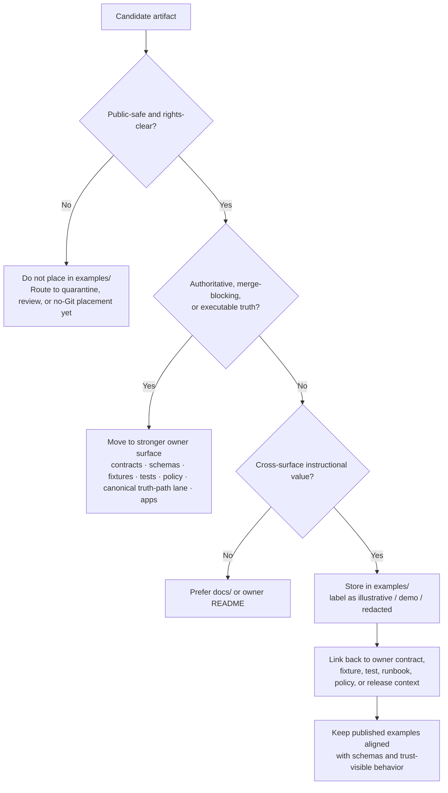

<!-- [KFM_META_BLOCK_V2]
doc_id: kfm://doc/NEEDS-VERIFICATION
title: examples
type: standard
version: v1
status: draft
owners: NEEDS VERIFICATION
created: YYYY-MM-DD
updated: YYYY-MM-DD
policy_label: NEEDS VERIFICATION
related: [../README.md, ../CONTRIBUTING.md, ../.github/README.md]
tags: [kfm, examples, fixtures, readme]
notes: [owners, dates, policy_label, related links, and mounted repo-path specifics require checkout verification; current session verified March 2026 PDF doctrine and refined reference overlays, not a directly visible repo tree]
[/KFM_META_BLOCK_V2] -->

# examples

Public-safe, non-authoritative sample datasets, example payloads, thin-slice illustrations, and demo assets for Kansas Frontier Matrix.

| Field | Value |
|---|---|
| Status | experimental |
| Owners | **NEEDS VERIFICATION** |
| Path | `examples/README.md` |
| Repo fit | **PROPOSED** public-safe explanatory lane for example packs, demo payloads, and thin-slice illustrations |
| Upstream | [`../README.md`](../README.md) · [`../CONTRIBUTING.md`](../CONTRIBUTING.md) · [`../.github/README.md`](../.github/README.md) **(NEEDS VERIFICATION)** |
| Downstream | `examples/` subfolders and example packs that remain public-safe, non-authoritative, and easy to relocate |
| Quick jumps | [Scope](#scope) · [Repo fit](#repo-fit) · [Accepted inputs](#accepted-inputs) · [Exclusions](#exclusions) · [Directory tree](#directory-tree) · [Quickstart](#quickstart) · [Usage](#usage) · [Diagram](#diagram) · [Tables](#tables) · [Task list](#task-list--definition-of-done) · [FAQ](#faq) · [Appendix](#appendix) |


> [!IMPORTANT]
> This README is intentionally **evidence-bounded**.
>
> In the current session, March 2026 KFM doctrine and refined realization references were directly visible as PDFs, but a checked-out repository tree was **not** directly verified. Read file-path and ownership claims below as:
>
> - **CONFIRMED** when they reflect stable KFM doctrine or directly visible PDF text
> - **PROPOSED** when they follow the strongest March 2026 realization overlays but are not verified in a mounted checkout
> - **UNKNOWN** when current repo state, owner placement, or implementation depth is not established here
> - **NEEDS VERIFICATION** when a placeholder, owner, date, label, or link must be checked against the active branch
>
> Nothing in `examples/` should masquerade as canonical truth, promoted data, release proof, policy truth, or rights-unclear source material.

> [!NOTE]
> March 2026 source material does **not** settle one final example-path spelling:
>
> - a March 14 continuity scaffold names `examples/thin_slice/hydrology/`
> - a March 19 refined schema/contract reference shows an illustrative starter layout using `examples/thin-slice/hydrology/`
>
> This README preserves both as **source-reported variants** and refuses to standardize the spelling until the mounted repo is surfaced.

---

## Scope

`examples/` is the repo’s **working example lane for public-safe explanation**.

Its job is to help contributors, reviewers, and maintainers inspect how KFM objects, flows, and trust-visible surfaces are supposed to look **without** confusing sample material with canonical records, promoted releases, or runtime truth. In KFM terms, this directory should support the **truth path**, the **trust membrane**, and the **documentation/accessibility gate**—not weaken them.

That makes `examples/` intentionally narrow:

- keep **small, inspectable, public-safe** material here
- keep **authoritative or merge-blocking** material with its owning surface
- keep **sensitive, rights-unclear, release-bearing, or canonical** material out
- keep example packs current enough that they do not drift away from contracts, fixtures, runbooks, or trust-visible UI behavior

A good example here should explain something real, remain visibly illustrative, and be easy to move once a stronger owner surface is confirmed.

> [!TIP]
> Treat `examples/` as part of repository truth, but **not** as the truth source.

[Back to top](#examples)

## Repo fit

**Path:** `examples/README.md`

**Role in repo:** directory README for public-safe example material, demo assets, and thin-slice illustrations that help humans understand KFM behavior.

### Why this directory exists

KFM’s March 2026 manuals repeatedly push the project toward **artifactization**: first-wave schemas, valid and invalid fixtures, starter registries, proof objects, `EvidenceBundle` examples, `RuntimeResponseEnvelope` examples, and one hydrology-first governed slice. This README gives those pressures a **human-readable landing zone** without stealing authority from contracts, tests, policies, or release surfaces.

### Stronger owner surfaces

| Stronger owner surface | What belongs there | Why it should not default to `examples/` |
|---|---|---|
| `contracts/`, `schemas/`, or `schemas/contracts/` | machine-readable contracts, schema families, outward profiles, contract examples tightly coupled to a spec | contract truth should stay diffable, versioned, and mechanically validated |
| `fixtures/` and/or `tests/` | valid/invalid fixtures, negative-path packs, replay samples, merge-blocking examples | CI-facing proof belongs with the harness that enforces it |
| `policy/` | reason codes, obligation codes, rights classes, sensitivity classes, policy fixtures, decision tests | executable governance should not hide inside demos |
| canonical truth-path lanes | `RAW`, `WORK / QUARANTINE`, `PROCESSED`, `CATALOG`, `PUBLISHED` artifacts and release-bearing objects | canonical material is not example material |
| `apps/` or governed API surfaces | runtime payloads, trust-state examples tightly coupled to UI/API behavior | live surface behavior should stay with its owner |
| `docs/`, `docs/runbooks/`, `docs/adr/`, or `docs/standards/` | long-form walkthroughs, ADRs, operator procedures, release/correction runbooks | narrative authority belongs in docs, not in a sample lane |

### Working interpretation for this README

**PROPOSED:** `examples/` is the **public-safe explanatory lane**.

That means:

- illustrative examples may live here
- machine-checkable truth should live closer to the surface that owns it
- a thin-slice example pack may live here **only** when it is clearly labeled as explanatory and public-safe
- exact repo topology still needs checkout verification before any path is treated as settled

[Back to top](#examples)

## Accepted inputs

Content that belongs here includes:

- small, public-safe sample datasets or subsets used for walkthroughs
- redacted example payloads for map, dossier, story, Evidence Drawer, or Focus surfaces
- illustrative `EvidenceBundle`, `RuntimeResponseEnvelope`, `ProjectionBuildReceipt`, or `CorrectionNotice` samples when they are clearly labeled as non-authoritative
- tiny sample objects that explain KFM contract families without pretending to be canonical records
- hydrology-first thin-slice illustration packs when the goal is explanation rather than merge-blocking execution
- onboarding, screenshot, or tutorial assets that help readers understand governed behavior
- sidecar metadata that clarifies purpose, owner surface, redaction status, and limits

A useful heuristic is simple: examples here should be **labeled**, **reviewable in one diff**, and **obviously illustrative**.

[Back to top](#examples)

## Exclusions

The following do **not** belong here:

- canonical `RAW`, `WORK`, `QUARANTINE`, `PROCESSED`, `CATALOG`, or `PUBLISHED` artifacts
- release manifests, proof packs, attestation bundles, or correction records presented as system truth
- authoritative contract schemas or merge-blocking valid/invalid fixtures
- secrets, tokens, local environment files, or machine-specific configuration
- rights-unclear, restricted, or precise sensitive-location material
- large binaries, dumps, archives, or model files that add weight without review value
- example payloads that imply verified route names, DTOs, manifests, or mounted schemas the checkout has not proved
- narrative claims presented as authoritative fact without provenance and release context

### Put these elsewhere instead

| If the artifact is… | Prefer… |
|---|---|
| canonical truth-path material | the relevant canonical data or release surface |
| machine-checkable contract material | `contracts/`, `schemas/`, or `schemas/contracts/` |
| valid/invalid fixture coverage | `fixtures/` or test-owning lanes |
| executable policy logic or policy fixtures | `policy/` |
| long-form explanation or operational procedure | `docs/`, `docs/runbooks/`, `docs/adr/`, or `docs/standards/` |
| restricted, rights-unclear, or unresolved material | quarantine, review, or no Git placement yet |

> [!WARNING]
> If a file is needed to make CI fail, promotion pass, policy decide, or runtime truth resolve, it probably has a stronger owner than `examples/`.

[Back to top](#examples)

## Directory tree

### Conservative current view

```text
examples/
└── README.md   # target of this revision; mounted repo shape still needs verification
```

This README is designed to stay useful even if `examples/` is otherwise sparse.

<details>
<summary><strong>Source-reported / PROPOSED growth shapes</strong></summary>

The visible March 2026 corpus points to several **illustrative** shapes, but it explicitly warns against standardizing repo paths in documentation before the mounted repo is surfaced.

```text
# March 14 continuity-scaffold variant
examples/
└── thin_slice/
    └── hydrology/
        ├── source_descriptor.json
        ├── ingest_receipt.json
        ├── dataset_version.json
        ├── catalog_closure.json
        ├── release_manifest.json
        └── evidence_bundle.json
```

```text
# March 19 refined-reference variant
examples/
└── thin-slice/
    └── hydrology/
        # illustrative starter-layout path; mounted contents still need verification
```

```text
# Stronger owner surfaces repeatedly emphasized elsewhere
schemas/
└── contracts/

fixtures/
├── valid/
└── invalid/

docs/
├── adr/
├── runbooks/
└── standards/
```

Working rule for this README:

- keep **public-safe explanatory packs** in `examples/`
- keep **valid/invalid fixtures** with `fixtures/` or test-owning lanes
- keep **machine-readable contract truth** with `contracts/` / `schemas/`
- treat exact repo subpaths as **NEEDS VERIFICATION** until the mounted checkout is inspected
</details>

[Back to top](#examples)

## Quickstart

Verify the checkout first. Do **not** assume this README’s neighboring paths are mounted exactly as shown until the active branch proves them.

```bash
# Verify the checkout shape before relying on path claims
pwd
find . -maxdepth 2 -type d | sort
```

Inspect the example lane and the most likely neighboring owner surfaces:

```bash
# Example lane itself
find examples -maxdepth 4 -print 2>/dev/null | sort || true

# Likely stronger owner surfaces, if present
find contracts schemas fixtures tests docs policy apps -maxdepth 3 -print 2>/dev/null | sort | sed -n '1,200p'
```

Check what the active checkout actually uses before adding a thin-slice pack:

```bash
git ls-files 'examples/**' 'fixtures/**' 'contracts/**' 'schemas/**' 'tests/**' 'docs/**' 2>/dev/null || true
```

Before adding a new artifact, answer these questions:

1. Is it public-safe and rights-clear?
2. Is it obviously illustrative rather than authoritative?
3. Would `contracts/`, `schemas/`, `fixtures/`, `tests/`, `policy/`, a canonical truth-path surface, `apps/`, or `docs/` own it more naturally?
4. If it demonstrates governed behavior, where is the owner surface that proves that behavior?
5. Can it be deleted or relocated later without breaking the repo’s source of truth?

> [!NOTE]
> Do **not** standardize `examples/` path spelling from documentation alone. Surface the mounted repo tree first, then align this README to that evidence.

[Back to top](#examples)

## Usage

### 1. Choose the owning surface first

Start by deciding where the **source of truth** lives.

- If the material defines a contract, schema, or standards-facing envelope, its stronger owner is probably `contracts/` or `schemas/`.
- If it proves positive or negative behavior, its stronger owner is probably `fixtures/`, `tests/`, or a fixture-owning lane.
- If it carries policy logic or review-role semantics, its stronger owner is probably `policy/`.
- If it is part of the governed lifecycle, it likely belongs with the canonical truth-path owner surface.
- If it explains a user flow or runbook, `docs/` may be the better home.

Put material in `examples/` only when the value is **instructional, public-safe, and cross-surface**.

### 2. Keep examples small, labeled, and reversible

A good example in this directory should be:

- small enough to inspect in one screenful or one pull request
- labeled as `example`, `demo`, `illustrative`, `redacted`, or equivalent
- explicit about what it proves and what it does **not** prove
- easy to relocate once a stronger owner surface becomes available

### 3. Keep published examples aligned with schemas

KFM documentation rules treat examples as part of the governed system, not as disposable decoration.

That means:

- behavior-significant changes should update examples along with contracts, diagrams, runbooks, and operating notes
- published examples should still agree with the schemas or contracts they illustrate
- version-sensitive facts should be visibly marked when they are not directly verified

### 4. Pair behavior-heavy examples with stronger proof

If the example demonstrates validation, policy, release, or runtime behavior, do not leave it alone.

Link it back to:

- the owning contract or schema
- the relevant fixture or test lane
- the governing runbook
- the policy or review rule that makes the behavior valid
- the release or correction context that keeps the example inspectable

### 5. Prefer cross-linking over duplicate authority

`examples/` should make the repo easier to navigate, not create a second authority layer.

A strong example pack should point back to the owner surface, not replace it.

[Back to top](#examples)

## Diagram


```mermaid
flowchart TD
    A[Candidate artifact] --> B{Public-safe and rights-clear?}
    B -- No --> X[Do not place in examples/<br/>Route to quarantine, review, or no-Git placement yet]
    B -- Yes --> C{Authoritative, merge-blocking,<br/>or executable truth?}
    C -- Yes --> D[Move to stronger owner surface<br/>contracts · schemas · fixtures · tests · policy · canonical truth-path lane · apps]
    C -- No --> E{Cross-surface instructional value?}
    E -- No --> F[Prefer docs/ or owner README]
    E -- Yes --> G[Store in examples/<br/>label as illustrative / demo / redacted]
    G --> H[Link back to owner contract,<br/>fixture, test, runbook, policy, or release context]
    H --> I[Keep published examples aligned<br/>with schemas and trust-visible behavior]
```

[Back to top](#examples)

## Tables

### Placement matrix

| Artifact class | Keep in `examples/`? | Stronger owner when authoritative | Why |
|---|---|---|---|
| Tiny redacted request/response sample | Yes | `contracts/`, `schemas/`, or `apps/` | Good for walkthroughs; weak as source of truth |
| Story or dossier demo payload | Yes, if public-safe | `apps/` plus tests/docs | Helpful for review and onboarding |
| `EvidenceBundle` or `RuntimeResponseEnvelope` illustration | Yes, if clearly labeled | contract + app + test lanes | Useful for UI/API review, unsafe as lone authority |
| Valid schema/contract fixture | Usually no | `fixtures/`, `tests/`, or contract-owning lanes | Should stay mechanically checked |
| Invalid schema/contract fixture | Usually no | `fixtures/`, `tests/`, or policy/contract lanes | Negative behavior should stay executable |
| Hydrology thin-slice illustration pack | Sometimes | fixture lanes, contract lanes, or test-owned thin-slice proof | Good here only when explanatory and public-safe |
| Canonical dataset snapshot | No | governed truth-path owner surface | Examples must not replace the truth path |
| Release manifest / proof pack / correction notice | No, unless explicitly illustrative and non-authoritative | release, delivery, or ops evidence surfaces | These are evidence-bearing operational artifacts |
| Sensitive coordinates / rights-unclear material | No | nowhere in Git until resolved | Violates KFM trust posture |
| Screenshot or UI walkthrough asset | Yes, if public-safe | `docs/` or `apps/` | Useful when it supports, not replaces, real behavior |

### Path-shape status matrix

| Path family | Status in this README | How to treat it here |
|---|---|---|
| `examples/README.md` | **NEEDS VERIFICATION** as mounted file | Suitable directory README target, but current checkout was not directly visible |
| `examples/thin_slice/hydrology/` | **PROPOSED** March 14 continuity-scaffold variant | Reasonable continuity-reported thin-slice path; verify before creating |
| `examples/thin-slice/hydrology/` | **PROPOSED** March 19 illustrative-layout variant | Reasonable refined-reference path; verify before creating |
| `fixtures/valid/*` and `fixtures/invalid/*` | **PROPOSED** starter family | Strong signal for CI-facing fixture ownership |
| `schemas/contracts/` | **PROPOSED** illustrative starter-layout family | Strong signal for contract/schema ownership, not a verified mounted path |
| `docs/runbooks/`, `docs/adr/`, and `docs/standards/` | **PROPOSED** illustrative documentation families | Good homes for narrative authority and operator guidance |
| repo-path standardization itself | **DEFERRED until checkout verification** | Do not settle path spelling from doctrine alone |

### Status language used here

| Label | Use here when… |
|---|---|
| **CONFIRMED** | stable KFM doctrine or directly visible PDF text supports the statement |
| **PROPOSED** | the shape is repo-native and supported by March 2026 realization overlays, but not verified in a mounted checkout |
| **UNKNOWN** | current repo state, owner placement, or implementation depth is not established here |
| **NEEDS VERIFICATION** | a placeholder field, link, owner, or path must be checked before commit |

[Back to top](#examples)

## Task list / Definition of done

A contribution to `examples/` is ready when all relevant checks below are true:

- [ ] It is public-safe, rights-clear, and small enough to review quickly.
- [ ] It is labeled as **example**, **demo**, **illustrative**, **redacted**, or equivalent.
- [ ] It does not pretend to be canonical truth, a promoted dataset, or release evidence.
- [ ] The stronger owner surface is identified and linked when one exists.
- [ ] If it demonstrates behavior, the related contract, fixture, test, policy, or runbook is linked.
- [ ] Published examples still agree with the schemas or contracts they illustrate.
- [ ] If it is a thin-slice illustration pack, a reviewer can move from example read -> evidence -> release or correction context without a trust gap.
- [ ] If a negative path matters, the failing example exists in a reviewable owner surface.
- [ ] No secrets, tokens, local machine paths, or restricted precise coordinates are embedded.
- [ ] If trust-visible surface behavior changes, the documentation/accessibility implications are updated too.
- [ ] The example improves contributor understanding more than it increases maintenance cost.
- [ ] Relocation or deletion is easy once the stronger owner surface is confirmed.

[Back to top](#examples)

## FAQ

### Why can this directory stay small?

Because a narrow, honest example lane is still useful. The directory can clarify what belongs here and what must stay with stronger owner surfaces even before it holds many files.

### Where should valid and invalid fixtures live?

Prefer the strongest owner surface. March 2026 KFM material repeatedly centers **valid/invalid fixtures** as machine-checkable proof, not as loose sample clutter.

### Why not store real dataset snapshots here?

Because KFM separates examples from authoritative truth. Governed data belongs in the truth path and its owning release/data surfaces, not in a convenience directory.

### What about the first thin slice?

The corpus strongly favors a **public-safe hydrology-first governed slice**, but it does not prove one final mounted path spelling for that example lane. Keep any pack here explanatory and public-safe; let executable proof move to stronger owner lanes.

### When should something move out of `examples/`?

Move it once it becomes authoritative, merge-blocking, schema-governing, release-bearing, or tightly owned by one surface.

[Back to top](#examples)

## Appendix

<details>
<summary><strong>PROPOSED sidecar fields for richer example packs</strong></summary>

Use a sidecar only when the example needs more context than a filename can carry.

```yaml
example_id: NEEDS-VERIFICATION
title: Example title
purpose: Short sentence explaining what this demonstrates
authority_status: illustrative
owner_surface: contracts/ | schemas/ | fixtures/ | tests/ | policy/ | apps/ | docs/ | canonical-truth-path-surface
redaction_status: public_safe
related_contracts: []
related_fixtures: []
related_tests: []
related_runbooks: []
related_release_artifacts: []
source_state: source_reported_or_proposed
notes:
  - Replace placeholders before commit
  - Link the stronger owner surface when known
  - Update when the mounted repo settles path spelling
```

A sidecar should reduce ambiguity, not add ceremony.
</details>

<details>
<summary><strong>PROPOSED naming guidance</strong></summary>

Prefer names that tell a reviewer what the asset is doing:

- `public-read-example.json`
- `focus-abstain-example.json`
- `story-citation-example.md`
- `catalog-closure-example.json`
- `redacted-feature-example.geojson`
- `hydrology-evidence-bundle-example.json`

Avoid names that imply authority or production state:

- `final.json`
- `real_data.csv`
- `release-ready.geojson`
- `truth-layer.parquet`
- `production-response.json`
</details>

<details>
<summary><strong>Source-reported path caution</strong></summary>

The March 2026 corpus supports **path pressure**, not final repo certainty.

At least these variants appear in source-reported or illustrative form:

- `examples/thin_slice/hydrology/`
- `examples/thin-slice/hydrology/`
- `fixtures/valid/*`
- `fixtures/invalid/*`
- `schemas/contracts/`
- `docs/runbooks/`
- `docs/adr/`
- `docs/standards/`

Do not let this README silently settle that debate. Surface the active repo convention first, then align this file to the checkout without weakening contract ownership, fixture ownership, or truth-path discipline.
</details>

[Back to top](#examples)
