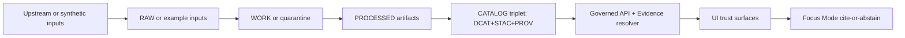
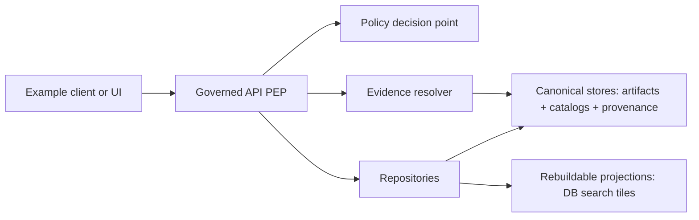

<!-- [KFM_META_BLOCK_V2]
doc_id: kfm://doc/677a9d0c-ca5d-4a30-be1e-f4bec92d976f
title: examples/ — Governed, Reproducible End-to-End Examples
type: standard
version: v3
status: draft
owners: KFM Maintainers (resolve via CODEOWNERS)
created: 2026-02-24
updated: 2026-03-02
policy_label: public
related:
  - ../README.md
  - ../CONTRIBUTING.md
  - ../SECURITY.md
  - ../contracts/README.md
  - ../configs/README.md
  - ../data/README.md
  - ../.github/README.md
tags:
  - kfm
  - examples
  - reproducibility
  - evidence-first
  - cite-or-abstain
notes:
  - Defines the directory contract for /examples with a default-deny posture.
  - Examples are small, policy-safe, and reproducible; they demonstrate trust surfaces and gates.
  - Aligns example “promotion” gates with the Promotion Contract gate names (A–G).
  - Clarifies EvidenceRef → EvidenceBundle resolution and hard citation gates for Story + Focus Mode.
[/KFM_META_BLOCK_V2] -->

<a id="top"></a>

# `examples/` — Governed, reproducible end-to-end examples
**Purpose:** minimal, reproducible, *policy-safe* examples that demonstrate end-to-end KFM workflows  
**Status:** draft • **Owners:** resolve via CODEOWNERS • **Policy:** `public` (this README; each example declares its own)


> [!IMPORTANT]
> `examples/` is the **sandbox of truth** — small enough to run locally, strict enough to survive CI.
>
> - Examples **MUST NOT** bypass governed APIs, policy checks, or evidence resolution.
> - Examples **MUST** be reproducible and emit evidence (receipts + checksums).
> - Examples **MUST** be safe under policy (default-deny; no sensitive leakage).
>
> If an example cannot be made safe to publish, it does not belong here.

---

## Quick navigation

- [Truth status legend](#truth-status-legend)
- [Normative language](#normative-language)
- [Contract at a glance](#contract-at-a-glance)
- [What this directory is](#what-this-directory-is)
- [Where it fits in the repo](#where-it-fits-in-the-repo)
- [Directory contract](#directory-contract)
- [Maintainer verification checklist](#maintainer-verification-checklist)
- [Quickstart](#quickstart)
- [Example package standard](#example-package-standard)
- [Evidence and provenance](#evidence-and-provenance)
- [Citations are EvidenceRefs](#citations-are-evidencerefs)
- [Policy labels and obligations](#policy-labels-and-obligations)
- [Controlled vocabularies](#controlled-vocabularies)
- [Policy-as-code architecture](#policy-as-code-architecture)
- [Promotion gates for example outputs](#promotion-gates-for-example-outputs)
- [Example registry](#example-registry)
- [Recommended layout](#recommended-layout)
- [CI gates](#ci-gates)
- [Contributing](#contributing)
- [Further reading](#further-reading)

---

## Truth status legend

This README uses explicit truth tags so it stays evidence-first and fail-closed:

- **CONFIRMED (docs):** invariant documented in KFM governance/architecture docs
- **PROPOSED:** recommended repo template/pattern (adopt, or update to match your repo)
- **UNKNOWN (repo):** not yet verified on this branch (include minimum verification steps)

> [!NOTE]
> Treat any runner commands, file paths, and CI job names as **PROPOSED** unless this repo has
> already implemented them and they are linked from `related:` above.

<p align="right"><a href="#top">Back to top ↑</a></p>

---

## Normative language

This README uses RFC-style keywords:

- **MUST / MUST NOT** — required for compliance
- **SHOULD / SHOULD NOT** — strongly recommended
- **MAY** — optional

<p align="right"><a href="#top">Back to top ↑</a></p>

---

## Contract at a glance

| Contract surface | MUST (merge-safe) | SHOULD (high leverage) | MUST NOT |
|---|---|---|---|
| Reproducibility | `run.sh` + deterministic `verify.sh`; stable outputs or normalized diffs | container/devcontainer; pinned tool versions | “works on my machine” only |
| Evidence | `evidence/run-receipt.json` + `evidence/checksums.json` | `evidence/notes.md`; provenance bundle (PROV JSON-LD) | receipts containing secrets/PII |
| Policy posture | explicit `policy_label` in manifest; default-deny if unclear | obligations recorded + UI notice examples | leaking restricted existence/details via errors |
| Citations | citations are resolvable **EvidenceRefs** (not pasted URLs) | mock evidence resolver in CI with allow/deny semantics | “citation = external link in prose” |
| Data | synthetic or explicitly approved, tiny, license declared | “metadata-only reference” demonstrations | unlicensed media, sensitive coordinates, PII |
| Trust membrane | example client calls **governed APIs** only | local mock API for offline runs | direct DB/object-store access from client |

> [!WARNING]
> Examples are where unsafe patterns spread fastest. Treat `examples/` like production teaching material.

<p align="right"><a href="#top">Back to top ↑</a></p>

---

## What this directory is

This directory contains **minimal packages** that demonstrate one governed workflow each:

- **Data → pipeline → validation → receipts/checksums**
- **Catalog/provenance concepts (DCAT/STAC/PROV) in miniature**
- **Governed API usage** (no direct DB/storage access from clients)
- **UI trust surfaces** (Evidence Drawer / Receipt Viewer behavior, in sample form)
- **Focus Mode** cite-or-abstain behavior *only* with policy-safe, synthetic, or explicitly approved inputs

### Toy-scale reference flow

> [!NOTE]
> This is a **toy-scale reference flow**. Examples are not an alternate production pipeline.


```mermaid
flowchart LR
  U[Upstream or synthetic inputs] --> R[RAW or example inputs]
  R --> W[WORK or quarantine]
  W --> P[PROCESSED artifacts]
  P --> C[CATALOG triplet: DCAT+STAC+PROV]
  C --> API[Governed API + Evidence resolver]
  API --> UI[UI trust surfaces]
  UI --> FM[Focus Mode cite-or-abstain]
```

### Trust membrane reminder


```mermaid
flowchart LR
  Client[Example client or UI] --> PEP[Governed API PEP]
  PEP --> PDP[Policy decision point]
  PEP --> Resolver[Evidence resolver]
  PEP --> Repos[Repositories]
  Repos --> Canon[Canonical stores: artifacts + catalogs + provenance]
  Repos --> Proj[Rebuildable projections: DB search tiles]
  Resolver --> Canon
```

> [!IMPORTANT]
> Examples demonstrate the **behavior**. They MUST NOT create backdoors around policy, provenance, or
> governed APIs.

<p align="right"><a href="#top">Back to top ↑</a></p>

---

## Where it fits in the repo

Conceptually, `examples/` complements these repo surfaces:

- `data/` — canonical truth-path zones and promoted datasets (raw/work/processed/catalog/published)
- `contracts/` — canonical schemas and API contracts
- `configs/` — governed config inputs (policy labels, thresholds, controlled vocab)
- `.github/` — CI gates and CODEOWNERS routing

> [!NOTE]
> The directories above are referenced via `related:` in the MetaBlock. Treat their exact presence and layout as
> **UNKNOWN (repo)** until verified on your current branch.

<p align="right"><a href="#top">Back to top ↑</a></p>

---

## Directory contract

### What belongs here

✅ Runnable examples that are **small**, **reproducible**, and **policy-safe**, demonstrating one primary claim.

✅ Synthetic or explicitly approved sample data **small enough to commit**, with license + sensitivity declared.

✅ Examples with:
- a single-command run step
- a deterministic verify step (or explicit manual verification checklist + stable expected output shape)
- evidence outputs (run receipt + checksums)
- a clear policy posture (allowed/denied/generalized)

### What must not go here

🚫 Secrets, tokens, private keys, credentials, or real `.env` values  
🚫 Direct DB access or “storage fetch” that bypasses the governed API boundary  
🚫 Unlicensed or unclear-rights data, scraped content without explicit permission  
🚫 PII, sensitive locations, culturally restricted knowledge, or doxxable specifics  
🚫 Large artifacts (raw dumps, large rasters, model weights); use governed pointers + reproducible fetch scripts **only if allowed**

> [!WARNING]
> “It’s just an example” is not an exception.

<p align="right"><a href="#top">Back to top ↑</a></p>

---

## Maintainer verification checklist

> [!IMPORTANT]
> Minimum maintainer checklist to keep `examples/` aligned with repo + CI posture.
> Treat failures as **fail-closed**: downgrade claims to PROPOSED/UNKNOWN until verified.

- [ ] Capture current commit + root tree (attach to PR): `git rev-parse HEAD` and `tree -L 3`
- [ ] Confirm required foundation exists (or explicitly absent): `spec_hash`, policy pack/tests, validators/linkcheck, evidence resolver route, dataset registry schema
- [ ] Extract merge-blocking CI gate list from `.github/workflows` and document what is required
- [ ] Choose 1 MVP example and ensure it can traverse gates with receipts + catalogs (toy-scale OK)
- [ ] Validate UI cannot bypass the PEP and EvidenceRefs resolve end-to-end in Map Explorer and Story publishing
- [ ] Run Focus Mode evaluation harness (if present) and store golden outputs + diffs as build artifacts

<p align="right"><a href="#top">Back to top ↑</a></p>

---

## Quickstart

> [!NOTE]
> Commands below are **PROPOSED**. Replace them with repo-real targets once your tooling is confirmed.

1) List examples:
```bash
ls -1 examples
```

2) Read an example:
```bash
cat examples/<example-id>/README.md
```

3) Run:
```bash
./examples/<example-id>/run.sh
```

4) Verify:
```bash
./examples/<example-id>/verify.sh
```

If an example cannot provide a `verify` script, it MUST clearly document:
- expected outputs (paths + stable shapes),
- validation criteria,
- what constitutes failure.

<p align="right"><a href="#top">Back to top ↑</a></p>

---

## Example package standard

Each example is a self-contained package under `examples/<example-id>/`.

### Naming convention

Use **kebab-case**. Prefix by category:

- `api-...` — governed API request/response patterns
- `pipe-...` — pipeline/validation/promotion demonstration (toy-scale)
- `ui-...` — UI trust flows (evidence drawer, receipts viewer)
- `focus-...` — Focus Mode cite-or-abstain (policy-safe only)
- `gov-...` — governance behaviors (labels, obligations, deny UX), with synthetic fixtures

Examples:
- `api-feature-query`
- `pipe-validate-and-promote-toy`
- `ui-evidence-drawer-minimal`
- `focus-cite-or-abstain-toy`
- `gov-policy-labels-obligations`

### Required files (minimum)

Every `examples/<example-id>/` MUST include:

- `README.md` — one-line purpose + steps + expected outputs + safety notes
- `kfm.example.yaml` — machine-readable manifest (inputs/outputs/licenses/sensitivity)
- `run.sh` — single-command runner (no secrets; safe defaults)
- `verify.sh` — deterministic verification (or documented substitute)
- `evidence/run-receipt.json` — run receipt (policy-safe)
- `evidence/checksums.json` — input + output digests

### Recommended extras

- `src/` — minimal code / scripts
- `data/` — tiny inputs (synthetic or approved), **never** sensitive
- `outputs/` — expected normalized outputs (small, diff-friendly)
- `evidence/notes.md` — thresholds, “why we trust it”, and policy obligations applied
- `contracts/` — local copies of *example-level* schemas (NOT canonical contracts)

> [!TIP]
> If an example needs canonical schemas/contracts, reference them from `contracts/` rather than duplicating.

<p align="right"><a href="#top">Back to top ↑</a></p>

---

## Evidence and provenance

Each example MUST be able to answer:

1) **What ran?** (runner, versions, minimal environment)
2) **What inputs?** (license + sensitivity + checksums)
3) **What outputs?** (paths + checksums + stable shapes)
4) **What policy decisions?** (deny/allow + obligations such as generalization)
5) **What verification passed?** (checks + thresholds)

### Determinism and hashing expectations

- If you compute stable IDs (e.g., `spec_hash`), you MUST use a canonicalization scheme and test for stability across OS/CI.
- Checksums MUST use deterministic ordering (no locale-dependent sorting).
- Examples SHOULD treat “freshness” as “last verified,” not “last edited.”

### `kfm.example.yaml` template (v1)

```yaml
# examples/<example-id>/kfm.example.yaml
kfm_example_manifest_version: "v1"

example_id: "<example-id>"
title: "<Short human title>"
summary: "<One paragraph describing the goal and the single primary claim this example demonstrates>"

owners:
  - "<team-or-person>"
status: "draft"   # draft | review | published

# MUST be from controlled vocabulary; see: Controlled vocabularies
policy_label: "public"  # public | public_generalized | restricted | restricted_sensitive_location | internal | embargoed | quarantine

tags:
  - "api"
  - "evidence"
  - "policy"

citations_used:
  # EvidenceRef schemes preferred; raw URLs discouraged
  - { ref: "dcat://...", kind: "dcat" }   # kind: dcat | stac | prov | doc | graph | url (discouraged)

inputs:
  - name: "<input-name>"
    path: "data/<file>"
    media_type: "<optional>"
    license: "<SPDX identifier or reference>"
    attribution: "<optional>"
    sensitivity: "public"   # must align with policy_label and any local rubric
    checksum: "sha256:<...>"

outputs:
  - name: "<output-name>"
    path: "outputs/<file>"
    media_type: "<optional>"
    checksum: "sha256:<...>"

repro:
  run: "./run.sh"
  verify: "./verify.sh"

evidence:
  run_receipt: "evidence/run-receipt.json"
  checksums: "evidence/checksums.json"
  notes: "evidence/notes.md"

claims:
  - id: "claim-1"
    text: "<What a reviewer can conclude if verify passes>"
    evidence_paths:
      - "evidence/run-receipt.json"
      - "evidence/checksums.json"
      - "outputs/<file>"

depends_on: []
```

### Run receipt minimum fields

A policy-safe `evidence/run-receipt.json` SHOULD include:

- `kfm_run_receipt_version`
- `example_id`
- `run_id` (opaque id acceptable)
- `git_commit` (if available)
- `environment` (tool versions; container digest if used)
- `inputs[]` (paths + digests)
- `outputs[]` (paths + digests)
- `checks[]` (pass/fail + thresholds)
- `policy` (decision id, `policy_label`, obligations applied)
- `created_at` (allowed; avoid injecting nondeterminism into golden outputs)

> [!WARNING]
> Receipts MUST NOT record secrets, user identifiers, internal-only endpoints, or restricted dataset existence
> (unless policy allows acknowledging it).

<p align="right"><a href="#top">Back to top ↑</a></p>

---

## Citations are EvidenceRefs

In KFM, a “citation” is **not** a URL pasted into text. It is an **EvidenceRef** that must resolve—via the
evidence resolver—into an **EvidenceBundle** containing sufficient metadata, artifacts, and provenance to
inspect the claim.

Requirements for `examples/`:
- Examples that make user-facing claims MUST emit EvidenceRefs (or equivalent IDs) and demonstrate how they resolve.
- `verify.sh` MUST fail if citations cannot be resolved or are policy-denied.
- When policy denies evidence, examples MUST fail closed (abstain, narrow scope, or show deny UX) without leaking restricted details.

### EvidenceRef kinds (starter)

Preferred `kind` values:
- `dcat` — dataset/distribution metadata
- `stac` — collections/items/assets
- `prov` — runs/lineage
- `doc` — governed docs (policy-safe)
- `graph` — entity relations (if enabled)
- `url` — **discouraged** (use resolvable schemes when possible)

> [!TIP]
> If CI cannot call a real evidence resolver yet, use a policy-safe local mock that preserves the same
> allow/deny + obligation semantics.

<p align="right"><a href="#top">Back to top ↑</a></p>

---

## Policy labels and obligations

Policy labeling is a **gate input**. Examples MUST declare `policy_label` and MUST treat unknown classification as restricted.

Rules of thumb (fail closed):
- Default deny for `restricted` and `restricted_sensitive_location`.
- If any public representation is allowed, produce a separate `public_generalized` output (and record the obligation).
- Never leak restricted metadata in “not found” / “forbidden” UX or errors.
- Treat redaction/generalization as a first-class transform (record it in receipts and provenance).

<p align="right"><a href="#top">Back to top ↑</a></p>

---

## Controlled vocabularies

Controlled vocabularies must be versioned and maintained (starter lists):

**`policy_label` (starter)**
- `public`
- `public_generalized`
- `restricted`
- `restricted_sensitive_location`
- `internal`
- `embargoed`
- `quarantine`

**`artifact.zone` (starter)**
- `raw`
- `work`
- `processed`
- `catalog`
- `published`

**`citation.kind` (starter)**
- `dcat`
- `stac`
- `prov`
- `doc`
- `graph`
- `url` (discouraged)

<p align="right"><a href="#top">Back to top ↑</a></p>

---

## Policy-as-code architecture

KFM requires the same policy semantics in CI and runtime (or at minimum the same fixtures and outcomes).

Recommended pattern:
- **PDP (Policy Decision Point):** OPA running in-process or as a sidecar.
- **PEPs (Policy Enforcement Points):**
  - CI: schema validation + policy tests block merges.
  - Runtime API: policy checks before serving data.
  - Evidence resolver: policy checks before resolving evidence and rendering bundles.
  - UI: policy badges and notices; **UI never makes policy decisions**.

<p align="right"><a href="#top">Back to top ↑</a></p>

---

## Promotion gates for example outputs

Some examples demonstrate the Promotion Contract. When they do, they MUST use the **same gate names**
and required artifacts at toy scale.

> [!NOTE]
> This table is intentionally aligned to the Promotion Contract gate naming (A–G). If your repo’s
> implementation differs, keep the naming stable and document any deltas.

| Gate | What must be present (toy-scale) | Where in the example |
|---|---|---|
| **Gate A — Identity and versioning** | stable dataset/example identity; immutable version derived from stable spec hash (if used) | `kfm.example.yaml` + receipt + checksums |
| **Gate B — Licensing and rights metadata** | license explicit; rights holder/attribution captured; unclear license → fail closed | manifest + evidence notes |
| **Gate C — Sensitivity classification and redaction plan** | `policy_label` assigned; redaction/generalization plan exists for restricted cases and is recorded | manifest + receipt `policy` + `evidence/notes.md` |
| **Gate D — Catalog triplet validation** | DCAT/STAC/PROV validate and cross-link; EvidenceRefs resolve without guessing | `outputs/catalog/` + validators + linkcheck |
| **Gate E — Run receipt and checksums** | `run_receipt` exists; inputs/outputs enumerated with checksums; environment captured | `evidence/run-receipt.json` + `evidence/checksums.json` |
| **Gate F — Policy tests and contract tests** | policy fixture tests pass; evidence resolver resolves at least one EvidenceRef in CI; API/contracts validate | CI job(s) + fixtures + mock/real resolver |
| **Gate G — Optional but recommended** | SBOM/build provenance; performance/accessibility smoke checks (evidence drawer keyboard nav) | CI “posture” suite |

<p align="right"><a href="#top">Back to top ↑</a></p>

---

## Example registry

To scale safely, keep a machine-readable registry of examples.

> [!PROPOSED]
> `examples/registry/examples.v1.json` is the canonical index used by CI and humans.

Example registry shape (illustrative):

```json
{
  "kfm_example_registry_version": "v1",
  "updated": "2026-03-02",
  "examples": [
    {
      "example_id": "api-feature-query",
      "path": "examples/api-feature-query",
      "policy_label": "public",
      "tags": ["api", "evidence", "policy"],
      "owners": ["kfm-maintainers"],
      "run": "./run.sh",
      "verify": "./verify.sh"
    }
  ]
}
```

Registry Definition of Done:
- [ ] Every example directory has a matching registry entry
- [ ] Every entry includes `policy_label`, owners, and run/verify commands
- [ ] CI can select examples to run (by tag, by changed paths, or nightly batch)

<p align="right"><a href="#top">Back to top ↑</a></p>

---

## Recommended layout

> This layout is **PROPOSED**. Adopt it if the repo doesn’t already standardize a different pattern.

<details>
<summary><strong>Proposed directory tree (click to expand)</strong></summary>

```text
examples/                                         # End-to-end examples (small, reproducible, policy-safe)  (PROPOSED)
├─ README.md                                      # Directory contract + safety rules + how to run/verify
├─ .gitignore                                     # Ignore generated outputs + local logs (no secrets) (recommended)
├─ LICENSES/                                      # (Optional) example-level third-party notices (tiny, text-only)
│  └─ README.md                                   # How attribution is tracked for example inputs
│
├─ registry/                                      # Machine-readable registries + schemas + fixtures (small)
│  ├─ examples.v1.json                            # Canonical example registry (paths, owners, tags, run/verify)
│  ├─ examples.v1.schema.json                     # Schema for the registry itself (recommended)
│  │
│  ├─ schemas/                                    # Schemas for example manifests + evidence artifacts
│  │  ├─ kfm.example.manifest.v1.schema.json      # Schema for kfm.example.yaml
│  │  ├─ kfm.run_receipt.v1.schema.json           # Schema for evidence/run-receipt.json
│  │  ├─ kfm.checksums.v1.schema.json             # Schema for evidence/checksums.json
│  │  └─ README.md                                # Schema versioning rules for examples
│  │
│  └─ fixtures/                                   # CI validation fixtures (valid/invalid)
│     ├─ manifests/valid/                          # minimal_public.yaml, etc.
│     ├─ manifests/invalid/                        # missing_license.yaml, etc.
│     ├─ receipts/valid/
│     ├─ receipts/invalid/
│     └─ README.md                                 # What fixtures prove + how CI uses them
│
├─ _shared/                                       # Shared tiny fixtures and helpers (optional, high leverage)
│  ├─ README.md                                   # Safety constraints for shared assets
│  ├─ data/                                       # Tiny synthetic datasets (NO sensitive coords)
│  └─ scripts/                                    # Hashing/normalization/secret-scan helpers
│
├─ api-feature-query/
├─ pipe-validate-and-promote-toy/
└─ ui-story-node-minimal/
```

</details>

<p align="right"><a href="#top">Back to top ↑</a></p>

---

## CI gates

Examples only pay off if they don’t rot. Treat example validation as merge gates.

Recommended CI checks (**PROPOSED**, align with your workflows):
- **Manifest lint:** validate `kfm.example.yaml` + controlled vocab
- **Policy fixture tests:** allow/deny + obligations using same semantics as runtime
- **Secret scan:** block secrets in scripts/docs/receipts
- **Size limits:** block large files and accidental binaries
- **License/sensitivity lint:** require license + sensitivity for all inputs
- **Catalog validators + linkcheck:** validate DCAT/STAC/PROV + cross-links
- **Evidence resolution lint:** fail if EvidenceRefs can’t resolve (mock or real)
- **Run + verify:** run selected examples and enforce verify success
- **Focus eval harness (if present):** golden queries; merge blocked on regressions
- **Anti-skip gate summary:** final job fails if required example gates didn’t run

> [!IMPORTANT]
> Anti-skip rule: required gates must not be bypassable via path filters or `if:` conditions.
> Prefer a “gate summary” job as the required status check.

<p align="right"><a href="#top">Back to top ↑</a></p>

---

## Contributing

1. Copy an existing example and change one thing at a time.
2. Keep data tiny and safe; prefer synthetic fixtures.
3. Add deterministic verify rules and normalize outputs.
4. Emit receipts + checksums.
5. Add your example to the Example Registry (if used).
6. Keep the example focused on **one primary claim**.

Review expectations:
- Examples that touch policy boundaries (deny UX, obligations, generalization) should route to governance owners.
- Examples that introduce dependencies must justify them and include lockfile changes where applicable.

<p align="right"><a href="#top">Back to top ↑</a></p>

---

## Further reading

- Root README for system overview and invariants
- `contracts/` for schema/contract surfaces
- `configs/` for governed configuration inputs
- `data/` for the canonical truth path zones
- `.github/` for CI gates, required checks, and CODEOWNERS routing

<p align="right"><a href="#top">Back to top ↑</a></p>
