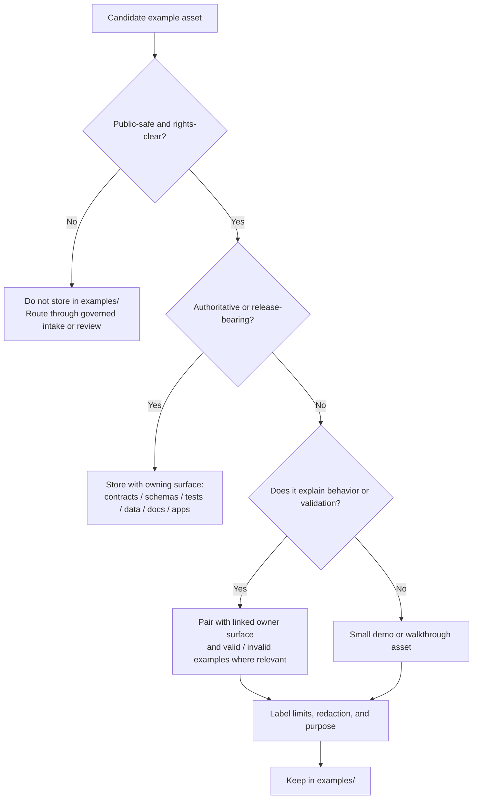

<!-- [KFM_META_BLOCK_V2]
doc_id: kfm://doc/NEEDS-VERIFICATION
title: examples
type: standard
version: v1
status: draft
owners: NEEDS VERIFICATION
created: YYYY-MM-DD
updated: YYYY-MM-DD
policy_label: NEEDS VERIFICATION
related: [../README.md, ../CONTRIBUTING.md, ../.github/README.md]
tags: [kfm, examples, fixtures, readme]
notes: [doc_id, owners, dates, and policy_label require repo verification]
[/KFM_META_BLOCK_V2] -->

# examples

Public-safe, non-authoritative examples and demo assets for Kansas Frontier Matrix.

| Field | Value |
|---|---|
| Status | experimental |
| Owners | **NEEDS VERIFICATION** |
| Path | `examples/README.md` |
| Role | cross-surface example lane for safe demos, walkthrough payloads, and instructional fixtures |
| Quick jumps | [Scope](#scope) · [Repo fit](#repo-fit) · [Accepted inputs](#accepted-inputs) · [Exclusions](#exclusions) · [Directory tree](#directory-tree) · [Quickstart](#quickstart) · [Usage](#usage) · [Diagram](#diagram) · [Tables](#tables) · [Task list](#task-list--definition-of-done) · [FAQ](#faq) · [Appendix](#appendix) |


> [!IMPORTANT]
> This directory is intentionally kept in the repository, even when empty.
>
> Read repo-shaped statements here as one of:
> - **CONFIRMED** — grounded in the current visible repo state or stable KFM doctrine
> - **PROPOSED** — a repo-native growth path consistent with KFM
> - **UNKNOWN** — not established strongly enough from the current visible evidence
> - **NEEDS VERIFICATION** — placeholder metadata or path that should be checked in the active checkout
>
> Nothing in `examples/` should masquerade as canonical truth, release evidence, policy truth, or rights-unclear source material.

---

## Scope

`examples/` is the repo’s **public-safe example lane**.

Its job is to help contributors, reviewers, and maintainers understand how KFM artifacts, surfaces, and contracts are supposed to look **without** confusing sample material with canonical records or promoted releases. In KFM terms, this directory should support the truth path and the trust membrane, not weaken them.

That makes `examples/` intentionally narrow:

- keep **small, safe, inspectable** material here
- keep **authoritative** material with its owning surface
- keep **sensitive, rights-unclear, or release-bearing** material out

[Back to top](#examples)

## Repo fit

**Path:** `examples/README.md`

**Role in repo:** directory README for safe example material and demo assets.

**Upstream anchors:**
- [`../README.md`](../README.md)
- [`../CONTRIBUTING.md`](../CONTRIBUTING.md)
- [`../.github/README.md`](../.github/README.md)

**Downstream contents (currently CONFIRMED):**
- [`./README.md`](./README.md)

**Adjacent owner surfaces:**
- [`../contracts/`](../contracts/) for authoritative contract examples and stable API envelopes
- [`../schemas/`](../schemas/) for validation schemas and example payload ownership
- [`../tests/`](../tests/) for executable fixtures and negative-path coverage
- [`../docs/`](../docs/) for long-form walkthroughs, runbooks, and narrative explanation
- [`../data/`](../data/) for governed data-facing examples, manifests, and registry-linked artifacts
- [`../apps/`](../apps/) for runtime-owned UI and API behaviors

> [!NOTE]
> Owner-owned examples should stay with the owning surface once they become merge-blocking, schema-governing, or runtime-significant. `examples/` is the cross-surface demo lane, not the universal home for every fixture.

[Back to top](#examples)

## Accepted inputs

Content that belongs here includes:

- small, public-safe request/response examples that explain a contract or user flow
- redacted example payloads for Story, Focus, Evidence Drawer, Timeline, Map, or review surfaces
- tiny walkthrough assets that help a contributor inspect KFM behavior without needing real source captures
- demo manifests or sidecars that explain expected fields while staying clearly illustrative
- instructional fixture packs used in docs, tutorials, screenshots, or onboarding material
- temporary cross-surface examples that do not yet have a stronger owner surface, provided they are clearly labeled

## Exclusions

The following do **not** belong here:

- canonical dataset versions, raw captures, or published catalog artifacts — send these to governed data and catalog lanes instead
- authoritative schemas, policy bundles, or stable API contracts — keep them with `../schemas/`, `../policy/`, or `../contracts/`
- release manifests, proof packs, receipts, or correction notices — keep them with release, runbook, or runtime evidence surfaces
- secrets, tokens, environment files, or machine-local configuration — never commit them here
- rights-unclear, restricted, or precise sensitive-location material — route it through governed intake and review first
- large binaries, model weights, or convenience dumps that add size without adding review value
- narrative claims presented as fact without evidence, limits, or provenance context

[Back to top](#examples)

## Directory tree

### Current verified shape

```text
examples/
└── README.md
```

The current directory is intentionally minimal.

<details>
<summary><strong>PROPOSED future growth shape</strong> — not current repo fact</summary>

```text
examples/
├── api/
│   ├── public/
│   └── review/
├── catalog/
├── fixtures/
│   ├── valid/
│   └── invalid/
├── story/
├── ui/
└── README.md
```

Use a growth shape like this only when the directory actually gains enough material to justify subfolders. Until then, keeping `examples/` minimal is the cleaner choice.
</details>

[Back to top](#examples)

## Quickstart

Inspect the directory first. Do not assume it contains more than the checked-out branch proves.

```bash
# Inspect the current directory
ls -la examples
find examples -maxdepth 3 -type f | sort

# Inspect the owner surfaces before adding anything new
ls -la contracts schemas tests docs data apps
```

Use a verification-first local flow before documenting example behavior as fact:

```bash
# Illustrative only — use only if analogous targets exist in your checkout
make validate-schemas
make test
make sample-ingest SOURCE=example_fixture
```

Before adding a new example, answer these questions:

1. Is it public-safe and rights-clear?
2. Is it clearly non-authoritative?
3. Does it belong more naturally with `contracts/`, `schemas/`, `tests/`, `docs/`, `data/`, or `apps/`?
4. If it demonstrates governed behavior, where is the owner surface that proves it?

[Back to top](#examples)

## Usage

### 1. Choose the owning surface first

Start by deciding where the **source of truth** lives.

- If the example defines a contract, schema, or negative-path guarantee, the owner is probably `../contracts/`, `../schemas/`, or `../tests/`.
- If it demonstrates governed data shape or registry-linked behavior, the owner is probably `../data/`.
- If it explains a flow or a contributor path, the owner may be `../docs/`.

Put material in `examples/` only when the value is **instructional, cross-surface, and public-safe**.

### 2. Keep examples small and explicit

A good example in this directory should be:

- tiny enough to inspect in one screenful or one diff
- labeled as illustrative, sample, redacted, or demo
- easy to delete, replace, or move once a stronger owner surface exists
- obvious about what it proves and what it does **not** prove

### 3. Prefer paired examples for behavior-heavy changes

If the example exists to demonstrate validation, policy, or runtime behavior, add both:

- a **happy-path** example
- a **negative-path** or constrained example

That keeps `examples/` aligned with KFM’s fail-closed posture instead of documenting only the polished path.

### 4. Cross-link, do not duplicate authority

A strong example README entry or sidecar should point back to:

- the owning contract or schema
- the governing doc or runbook
- the relevant test lane
- the relevant policy or review rule, when one exists

`examples/` should make the repo easier to navigate, not create a second unofficial authority layer.

[Back to top](#examples)

## Diagram


```mermaid
flowchart TD
    A[Candidate example asset] --> B{Public-safe and rights-clear?}
    B -- No --> X[Do not store in examples/<br/>Route through governed intake or review]
    B -- Yes --> C{Authoritative or release-bearing?}
    C -- Yes --> Y[Store with owning surface:<br/>contracts / schemas / tests / data / docs / apps]
    C -- No --> D{Does it explain behavior or validation?}
    D -- Yes --> E[Pair with linked owner surface<br/>and valid / invalid examples where relevant]
    D -- No --> F[Small demo or walkthrough asset]
    E --> G[Label limits, redaction, and purpose]
    F --> G
    G --> H[Keep in examples/]
```

[Back to top](#examples)

## Tables

### Placement matrix

| Artifact class | Keep in `examples/`? | Better home when authoritative | Why |
|---|---|---|---|
| Tiny redacted API example | Yes | `../contracts/` or `../apps/` once stable | Good for walkthroughs; weak as source of truth |
| Demo map or Focus payload | Yes, if public-safe | `../apps/` plus tests/docs | Helpful for review and onboarding |
| Valid schema fixture | Sometimes | `../schemas/` or `../tests/` | Owner surface should hold the canonical fixture |
| Invalid fixture / failure case | Sometimes | `../tests/` or `../contracts/` | Negative behavior should stay executable |
| Example EvidenceRef or bundle sketch | Yes, if clearly illustrative | `../contracts/`, `../data/`, or runtime docs | Useful for explanation; risky if treated as live truth |
| Canonical dataset snapshot | No | `../data/` governed lanes | Examples must not replace the truth path |
| Release manifest / proof pack / receipt | No | release, runbook, or runtime evidence surface | These are evidence-bearing operational artifacts |
| Secret-bearing or rights-unclear material | No | nowhere in git until resolved | Violates KFM trust posture |

### Status guide for this directory

| Label | Use here when… |
|---|---|
| **CONFIRMED** | the active branch or stable repo doctrine proves the statement |
| **PROPOSED** | the shape is sensible but not yet present in the visible repo |
| **UNKNOWN** | ownership, implementation depth, or content presence is not verified |
| **NEEDS VERIFICATION** | a placeholder field or path should be checked before commit |

[Back to top](#examples)

## Task list / Definition of done

A contribution to `examples/` is ready when all relevant checks below are true:

- [ ] It is public-safe, rights-clear, and small enough to review quickly.
- [ ] It is labeled as **example**, **demo**, **redacted**, **illustrative**, or equivalent.
- [ ] It does not pretend to be canonical truth, a promoted dataset, or a release artifact.
- [ ] The owning surface is identified and linked.
- [ ] If it demonstrates behavior, the related schema, contract, test, or runbook is linked.
- [ ] If a negative case matters, a failing or constrained example exists somewhere reviewable.
- [ ] No secrets, tokens, local machine paths, or restricted coordinates are embedded.
- [ ] The example improves contributor understanding more than it increases maintenance cost.
- [ ] Deletion or relocation is easy once a stronger owner surface becomes available.

[Back to top](#examples)

## FAQ

### Why can this directory stay empty?

Because the directory already has a valid role even when it holds only its README: it declares where safe example material belongs and where it does **not** belong.

### Why not store real dataset snapshots here?

Because KFM separates examples from authoritative truth. Real governed data belongs in the truth path and its owning data surfaces, not in a convenience folder.

### Where should executable fixtures live?

With the owner that enforces them. In practice that usually means `../schemas/`, `../contracts/`, or `../tests/`.

### Can screenshots or demo assets live here?

Yes, when they are public-safe, small, clearly labeled, and not the only place where important behavior is described.

### When should something be moved out of `examples/`?

Move it once it becomes authoritative, merge-blocking, schema-governing, release-bearing, or tightly bound to one owner surface.

[Back to top](#examples)

## Appendix

<details>
<summary><strong>PROPOSED sidecar fields for richer example packs</strong></summary>

Use a tiny sidecar only when the example needs more context than a filename can carry.

```yaml
example_id: NEEDS-VERIFICATION
title: Example title
purpose: Short sentence explaining what this demonstrates
owner_surface: ../contracts/ or ../tests/ or ../apps/
authority_status: illustrative
redaction_status: public_safe
source_links:
  - ../README.md
  - ../CONTRIBUTING.md
validation_links:
  - ../schemas/
  - ../tests/
notes:
  - Replace placeholders before commit
```

A sidecar like this is useful only when it reduces ambiguity. Do not create metadata just to decorate a tiny example.
</details>

<details>
<summary><strong>PROPOSED naming guidance</strong></summary>

Prefer names that tell a reviewer what the asset is doing:

- `public-read-example.json`
- `focus-abstain-example.json`
- `story-citation-example.md`
- `catalog-closure-example.json`
- `redacted-feature-example.geojson`

Avoid names that imply authority or production state:

- `final.json`
- `real_data.csv`
- `release-ready.geojson`
- `truth-layer-example.parquet`
</details>

[Back to top](#examples)