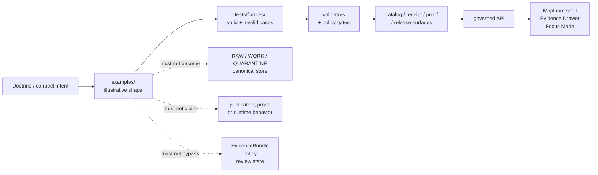

<!-- [KFM_META_BLOCK_V2]
doc_id: kfm://doc/NEEDS_VERIFICATION__examples_readme
title: Examples
type: standard
version: v1
status: draft
owners: NEEDS_VERIFICATION__owner_or_team
created: NEEDS_VERIFICATION__YYYY-MM-DD
updated: NEEDS_VERIFICATION__YYYY-MM-DD
policy_label: NEEDS_VERIFICATION__public_or_internal
related: [../README.md, ../docs/README.md, ../schemas/README.md, ../contracts/README.md, ../policy/README.md, ../tests/README.md, ../data/README.md, ../tools/README.md]
tags: [kfm, examples, documentation, fixtures, evidence, governance, map-first, governed-ai]
notes: [Target path is examples/README.md. This file is repository-ready draft content, but owners, dates, policy label, adjacent links, validation commands, and child inventory remain NEEDS VERIFICATION until checked in the active KFM repository.]
[/KFM_META_BLOCK_V2] -->

<a id="top"></a>

# Examples

<p align="center">
  <strong>Small, public-safe illustrations of KFM object shapes and governed flows — never source data, proof, release state, or canonical truth.</strong>
</p>

<p align="center">
  
  
  
  
  
  
</p>

<p align="center">
  <a href="#scope">Scope</a> ·
  <a href="#repo-fit">Repo fit</a> ·
  <a href="#accepted-inputs">Accepted inputs</a> ·
  <a href="#exclusions">Exclusions</a> ·
  <a href="#directory-map">Directory map</a> ·
  <a href="#quickstart">Quickstart</a> ·
  <a href="#usage">Usage</a> ·
  <a href="#object-lifecycle">Object lifecycle</a> ·
  <a href="#review-gates">Review gates</a> ·
  <a href="#appendix">Appendix</a>
</p>

> [!IMPORTANT]
> `examples/` is a **teaching and orientation surface**. It may demonstrate how a KFM object is shaped, named, labeled, or connected, but it must not become evidence, fixture authority, source custody, release proof, policy clearance, runtime output, or a shortcut around promotion.

| Field | Value |
|---|---|
| Status | `draft` |
| Intended path | `examples/README.md` |
| Primary audience | Contributors, maintainers, reviewers, documentation stewards, schema/policy/test authors |
| Evidence mode | `NEEDS_VERIFICATION` for active repo inventory; attached doctrine supports the directory role |
| Directory authority | README-like directory standard; child inventory is not confirmed by this file |
| Safety posture | Public-safe, synthetic/redacted examples only |
| Canonical truth posture | Examples are not canonical records and do not prove behavior |

---

## Scope

`examples/` is the low-risk, human-readable place for **small illustrative artifacts** that make KFM easier to understand and review.

Use it to show what a `SourceDescriptor`, `EvidenceBundle`, `DecisionEnvelope`, `RuntimeResponseEnvelope`, `LayerManifest`, `FocusModePayload`, Story Node binding, MapLibre source/layer fragment, or promotion dry-run payload is expected to *look like* before that shape is promoted into schemas, tests, policy, runtime contracts, catalog records, proof packs, release manifests, or published surfaces.

The hard boundary is the KFM truth path:

```text
RAW -> WORK / QUARANTINE -> PROCESSED -> CATALOG / TRIPLET -> PUBLISHED
```

Examples may point toward that path. They must not skip it.

> [!WARNING]
> Examples do **not** prove source authority, publication readiness, policy clearance, validator coverage, runtime behavior, reviewer approval, release state, map-layer safety, or EvidenceBundle resolution.

<p align="right"><a href="#top">Back to top ↑</a></p>

---

## What this is / what this is not

| This directory is… | This directory is not… |
|---|---|
| A contributor-friendly way to learn object grammar. | A canonical store. |
| A place for tiny synthetic or redacted examples. | A place for RAW, WORK, QUARANTINE, or provider downloads. |
| A bridge from documentation into schemas, contracts, policy, and fixtures. | A substitute for schemas, validators, policy gates, or fixtures. |
| A safe rehearsal surface for map, UI, Focus Mode, and promotion payload shapes. | A runtime, model output surface, publication surface, or proof surface. |
| A place to make uncertainty visible. | A place to make plausible-but-unverified claims look finished. |

> [!NOTE]
> A useful example should be easy to delete without changing canonical truth, public behavior, release state, source custody, or policy posture.

<p align="right"><a href="#top">Back to top ↑</a></p>

---

## Repo fit

The links below are expected neighboring surfaces. They remain `NEEDS VERIFICATION` until the active repository checkout confirms paths, ownership, and conventions.

| Relation | Surface | Status | Role |
|---|---|---:|---|
| Current path | `examples/README.md` | **PROPOSED / draft** | Directory contract for example-only content. |
| Upstream | [`../README.md`](../README.md) | **NEEDS VERIFICATION** | Root orientation, repo-wide trust rules, and navigation. |
| Upstream | [`../docs/README.md`](../docs/README.md) | **NEEDS VERIFICATION** | Doctrine, standards, ADRs, runbooks, and documentation control. |
| Upstream | [`../schemas/README.md`](../schemas/README.md) | **NEEDS VERIFICATION** | Machine-readable schema authority; examples must not redefine it. |
| Upstream | [`../contracts/README.md`](../contracts/README.md) | **NEEDS VERIFICATION** | API/runtime/payload contract authority; examples must not override it. |
| Upstream | [`../policy/README.md`](../policy/README.md) | **NEEDS VERIFICATION** | Rights, sensitivity, redaction, deny, quarantine, and publication policy. |
| Adjacent verification | [`../tests/README.md`](../tests/README.md) | **NEEDS VERIFICATION** | Valid/invalid fixtures and regression tests. |
| Adjacent lifecycle | [`../data/README.md`](../data/README.md) | **NEEDS VERIFICATION** | RAW, WORK, QUARANTINE, PROCESSED, CATALOG, receipts, proofs, published artifacts. |
| Adjacent tooling | [`../tools/README.md`](../tools/README.md) | **NEEDS VERIFICATION** | Validators, checkers, renderers, probes, and promotion helpers. |

> [!CAUTION]
> If the mounted repository uses different homes, update this README through the repository’s documentation convention or an ADR. Do not preserve broken links just because this draft names them.

<p align="right"><a href="#top">Back to top ↑</a></p>

---

## Accepted inputs

Examples must be small, public-safe, and explicitly non-authoritative.

| Accepted input | Allowed here when… | Required posture |
|---|---|---:|
| `*.example.json`, `*.example.yaml`, `*.example.geojson` | Tiny, synthetic/redacted, and clearly illustrative. | **PROPOSED** |
| Source descriptor sketches | Source role, access posture, rights posture, and inactive/default-safe status are visible. | **PROPOSED** |
| Evidence object sketches | Citation/evidence shape is demonstrated without claiming real EvidenceBundle resolution. | **PROPOSED** |
| Runtime envelope examples | Finite outcomes such as `ANSWER`, `ABSTAIN`, `DENY`, or `ERROR` are demonstrated without calling a model. | **PROPOSED** |
| MapLibre fragments | Renderer/spec/data boundaries are clear and URIs are placeholders or already released-public references. | **PROPOSED** |
| Story Node / Focus Mode payload sketches | Trust-visible UI payload shape is shown without becoming UI state or AI truth. | **PROPOSED** |
| Promotion dry-run examples | Review payload shape is demonstrated without creating receipts, proofs, catalogs, signatures, or release state. | **PROPOSED** |
| README-local snippets | Snippets help humans copy a safe pattern into the correct repo surface. | **PROPOSED** |

Examples should be boringly safe: small enough to review in a diff, explicit about uncertainty, and impossible to confuse with source data.

<p align="right"><a href="#top">Back to top ↑</a></p>

---

## Exclusions

Do **not** put these in `examples/`.

| Excluded content | Goes instead | Why |
|---|---|---|
| RAW provider downloads, mirrors, scraped pages, bulk extracts | `../data/raw/` or source-specific governed intake path | Examples are not data custody. |
| WORK or QUARANTINE candidates | `../data/work/` or `../data/quarantine/` | Examples must not bypass validation or sensitivity review. |
| Published artifacts, PMTiles, COGs, STAC items, DCAT records, PROV bundles, release manifests | Governed catalog/proof/published homes | Publication is a governed state transition, not an example copy. |
| Receipts, proofs, attestations, signatures, correction notices, rollback references | Receipt/proof/release homes | Process memory and proof objects must stay distinct. |
| Valid/invalid test fixtures | `../tests/fixtures/` | Fixtures prove behavior; examples teach shape. |
| Secrets, tokens, API keys, cookies, private URLs, local credentials | Nowhere in repo | Secrets must never enter examples. |
| Sensitive exact locations | Governed restricted lane after policy review | Archaeology, rare species, cultural, critical infrastructure, private/living-person, and similar contexts fail closed. |
| Emergency, medical, legal, or life-safety guidance | Official systems and governed contextual docs | KFM examples are not operational alerts or professional advice. |
| Generated model output as truth | Governed AI fixtures or review artifacts | AI is interpretive; EvidenceBundle and policy outrank generated language. |
| Production pipeline scripts | `../tools/`, `../pipelines/`, or app-native homes | Examples should not become unreviewed automation. |

> [!WARNING]
> A file that starts as an example can become evidence only after it moves through the correct contract, fixture, validation, policy, catalog, proof, review, and promotion surfaces.

<p align="right"><a href="#top">Back to top ↑</a></p>

---

## Directory map

The child structure below is a **proposed orientation map**, not a confirmed inventory.

```text
examples/
├── README.md
├── source-descriptors/
│   └── README.md                       # PROPOSED: inactive source admission sketches
├── evidence/
│   └── README.md                       # PROPOSED: EvidenceBundle / DecisionEnvelope sketches
├── runtime/
│   └── README.md                       # PROPOSED: finite runtime envelope sketches
├── maplibre/
│   └── README.md                       # PROPOSED: source/layer/style fragments; no production tiles
├── promotion/
│   └── README.md                       # PROPOSED: review and dry-run examples; not receipts/proofs
├── stories/
│   └── README.md                       # PROPOSED: Story Node and Focus Mode payload examples
└── _archive/
    └── README.md                       # PROPOSED: deprecated examples retained only with successor notes
```

Start with this `README.md` only unless the active branch already contains child examples. Add a child directory only when at least one example is small, reviewed, public-safe, and linked to its intended downstream home.

<p align="right"><a href="#top">Back to top ↑</a></p>

---

## Quickstart

Use `examples/` first as a reading surface.

```bash
# Safe inventory only. This does not validate semantics or prove release state.
find examples -maxdepth 3 -type f | sort
```

When repo-native validators exist, prefer the project’s documented command. The placeholder below is intentionally **not** claimed as current implementation.

```text
NEEDS VERIFICATION:
make validate-examples
```

Before copying an example into a real contract, fixture, data lane, or release workflow, answer five questions:

1. What KFM object family does this illustrate?
2. What schema or contract should own the machine-readable shape?
3. What valid and invalid fixture should prove behavior?
4. What policy gate would deny or quarantine unsafe variants?
5. What receipt, proof, catalog, or release object would exist outside `examples/` if this became real?

<p align="right"><a href="#top">Back to top ↑</a></p>

---

## Usage

### Add a new example

1. Choose the narrowest object family.
2. Use a filename that says it is an example.
3. Keep the payload small and public-safe.
4. Include a short child `README.md` when the example family needs context.
5. Link to the intended schema, contract, policy, validator, or fixture home.
6. Mark unresolved values with `NEEDS_VERIFICATION`, not plausible guesses.
7. Add companion valid/invalid fixtures under `../tests/fixtures/` only when behavior needs to be enforced.

Recommended filename pattern:

```text
<object-family>__<scenario>__example.<json|yaml|geojson|md>
```

Examples:

```text
source_descriptor__wbd_huc12__example.yaml
evidence_bundle__released_claim_support__example.json
decision_envelope__abstain_missing_evidence__example.json
runtime_response__deny_sensitive_location__example.json
maplibre_layer__released_pmtiles_source__example.json
focus_mode_payload__answer_with_citations__example.json
promotion_review_payload__hold_for_rights__example.json
```

### Promote an example into a tested fixture

Do not edit the example into a fixture in place. Copy the smallest useful shape into the fixture home and make the new role explicit.

| Step | Example home | Fixture / proof home |
|---|---|---|
| Teach shape | `examples/evidence/decision_envelope__abstain_missing_evidence__example.json` | Not authoritative |
| Prove valid behavior | `../tests/fixtures/evidence/decision_envelope__abstain_missing_evidence__valid.json` | Test fixture |
| Prove invalid behavior | `../tests/fixtures/evidence/decision_envelope__unknown_outcome__invalid.json` | Test fixture |
| Record process memory | Receipt home | Not owned here |
| Record release proof | Proof/release home | Not owned here |

<p align="right"><a href="#top">Back to top ↑</a></p>

---

## Object lifecycle


```mermaid
flowchart LR
  A["Doctrine / contract intent"] --> B["examples/\nillustrative shape"]
  B --> C["tests/fixtures/\nvalid + invalid cases"]
  C --> D["validators\n+ policy gates"]
  D --> E["catalog / receipt / proof\n/ release surfaces"]
  E --> F["governed API"]
  F --> G["MapLibre shell\nEvidence Drawer\nFocus Mode"]

  B -. "must not become" .-> X["RAW / WORK / QUARANTINE\ncanonical store"]
  B -. "must not claim" .-> Y["publication, proof,\nor runtime behavior"]
  B -. "must not bypass" .-> Z["EvidenceBundle\npolicy\nreview state"]
```

This flow is intentionally asymmetric. Examples can inspire fixtures and contracts, but examples cannot shortcut the governed lifecycle.

<p align="right"><a href="#top">Back to top ↑</a></p>

---

## Operating rules

### Status labels

| Label | Use in `examples/` |
|---|---|
| **CONFIRMED** | Use only for facts directly verified in the active branch or attached source being summarized. |
| **INFERRED** | Use when branch evidence strongly suggests a relationship but does not prove it. |
| **PROPOSED** | Use for new examples, directory shapes, or naming conventions not yet enforced. |
| **UNKNOWN** | Use when repo, source, owner, validator, rights, or runtime state is not verified. |
| **NEEDS VERIFICATION** | Use for checkable placeholders that must be resolved before merge or promotion. |

### Boundary checklist

| Question | Required answer |
|---|---|
| Does this file contain real source data? | No. |
| Does this file contain secrets or credentials? | No. |
| Does this file expose sensitive exact locations? | No. |
| Does this file claim publication or proof status? | No. |
| Does this file point directly at RAW, WORK, QUARANTINE, or canonical stores? | No. |
| Does this file have an intended schema/contract/policy/fixture destination? | Yes, or explicitly `UNKNOWN`. |
| Is every uncertainty visible in the file or README? | Yes. |

### Common example families

| Example family | Recommended child path | Downstream owner |
|---|---|---|
| Source admission sketch | `examples/source-descriptors/` | `../schemas/`, `../contracts/`, `../policy/`, `../tests/fixtures/` |
| Evidence object sketch | `examples/evidence/` | Evidence schemas, citation validators, Evidence Drawer payload tests |
| Runtime response sketch | `examples/runtime/` | Runtime envelope schema, governed AI tests, API contract tests |
| Map layer/style sketch | `examples/maplibre/` | Layer manifest schema, UI trust-state tests, released artifact registry |
| Promotion review sketch | `examples/promotion/` | Review/promotion validators, receipt/proof/release homes |
| Story or Focus Mode sketch | `examples/stories/` | UI contract, Evidence Drawer, Focus Mode, policy postcheck |

<p align="right"><a href="#top">Back to top ↑</a></p>

---

## Map, UI, and AI boundaries

Examples may include map, UI, Story Node, or Focus Mode shapes, but those shapes must keep trust state visible.

| Surface | Example may show | Example must not imply |
|---|---|---|
| MapLibre source/layer | Style/source/layer shape, placeholder tiles, released-safe URI shape, attribution field shape. | That a tile exists, was released, is safe, or is canonical truth. |
| Evidence Drawer | EvidenceRef/EvidenceBundle display shape, citation status, policy status, review status. | That evidence actually resolves unless the fixture/proof home verifies it. |
| Focus Mode | Finite answer envelope, citations field, `ABSTAIN`, `DENY`, or `ERROR` handling. | That model output is proof or that direct model calls are allowed. |
| Story Node | Binding structure, temporal scope, source role display, trust badges. | That a story export is publication proof. |
| Review surface | Review payload shape and decision labels. | That review was performed or that promotion occurred. |

> [!TIP]
> Prefer negative-state examples. `ABSTAIN`, `DENY`, and `ERROR` examples teach KFM’s safety posture better than a polished happy-path answer alone.

<p align="right"><a href="#top">Back to top ↑</a></p>

---

## Review gates

A change to `examples/` is ready for review when:

- [ ] The example is visibly labeled as illustrative, synthetic, redacted, or public-safe.
- [ ] The filename includes `example` or the directory README states the example-only status.
- [ ] No raw provider data, secrets, tokens, restricted identifiers, sensitive exact coordinates, or private URLs are present.
- [ ] The example does not claim to be a receipt, proof, catalog object, release artifact, canonical record, emitted runtime object, or policy decision.
- [ ] The intended schema, contract, policy, validator, or fixture destination is linked or marked `NEEDS_VERIFICATION`.
- [ ] If the example demonstrates an outcome, the finite outcome vocabulary is explicit.
- [ ] If the example demonstrates a source, source role, access posture, and rights posture are explicit.
- [ ] If the example demonstrates a map layer, renderer/spec/data/released-artifact boundaries are explicit.
- [ ] If the example demonstrates AI or Focus Mode, EvidenceBundle and policy dependencies are explicit.
- [ ] Any child README includes a KFM Meta Block V2, status, owner placeholder or owner, path, quick links, accepted inputs, exclusions, and validation notes.
- [ ] Links are checked from the active branch before merge.
- [ ] A maintainer can delete the example without changing canonical truth, data custody, release state, public behavior, or policy posture.

<p align="right"><a href="#top">Back to top ↑</a></p>

---

## Validation

Validation is repository-dependent and remains `NEEDS_VERIFICATION` until the active checkout confirms tooling.

Recommended validation intent:

| Validation target | What should be checked |
|---|---|
| Markdown rendering | Headings, callouts, Mermaid, tables, details blocks, links, and code fences render correctly. |
| Example naming | Filenames use `example` and stable object-family naming. |
| Safety boundary | No secrets, raw source data, sensitive exact locations, or false release/proof claims. |
| Contract destination | Each example points to an intended schema/contract/policy/fixture destination or says `UNKNOWN`. |
| Lifecycle boundary | No example points directly into RAW, WORK, QUARANTINE, canonical stores, or unpublished candidate data. |
| Negative outcomes | AI/runtime examples use finite outcomes and make `ABSTAIN`, `DENY`, and `ERROR` visible where relevant. |

Illustrative command placeholders:

```bash
# NEEDS VERIFICATION — use the repo-native Markdown/link checker if one exists.
markdownlint examples/README.md
```

```bash
# NEEDS VERIFICATION — use repo-native example validators if available.
make validate-examples
```

```bash
# NEEDS VERIFICATION — safety grep only; not a substitute for policy validation.
grep -RInE 'api[_-]?key|token|secret|password|BEGIN PRIVATE KEY' examples/ || true
```

<p align="right"><a href="#top">Back to top ↑</a></p>

---

## Deprecation, rollback, and correction

Examples are intentionally low authority, but they still affect contributor expectations.

| Situation | Required action |
|---|---|
| Example shape is superseded by schema or contract change | Update the example, add a successor note, and preserve the old example only if it teaches migration. |
| Example is discovered to imply false implementation behavior | Correct immediately; add a note explaining the boundary. |
| Example contains unsafe content | Remove or quarantine it; do not preserve unsafe content for historical interest. |
| Example was copied into a fixture or contract | Keep the example illustrative and link the real fixture/contract path after verification. |
| Child directory is removed | Update this README and any parent navigation links. |

Rollback rule: deleting an example must never require data rollback, release withdrawal, proof invalidation, source deactivation, or public API change. If it does, the file was in the wrong directory.

<p align="right"><a href="#top">Back to top ↑</a></p>

---

## FAQ

### Why have `examples/` if `tests/fixtures/` already exists?

Examples and fixtures do different jobs. Examples help humans understand shape and intent. Fixtures make validators, policies, contracts, and runtime behavior testable.

### Can an example use a real public source name?

Yes, when the name clarifies the pattern and the file does not mirror provider data, imply source activation, or bypass source-role review. Use `NEEDS_VERIFICATION` for rights, cadence, endpoint, quota, and automation details unless active evidence verifies them.

### Can examples include GeoJSON?

Yes, but only tiny synthetic or generalized geometry. Do not include sensitive exact locations, real unpublished candidate features, precise archaeology locations, rare species occurrences, critical infrastructure exposure, or living-person/private-property-sensitive coordinates.

### Can examples be copied into docs?

Yes, but keep one canonical explanation. If a long example is needed in docs, prefer linking back to this directory or to a specific child README.

### Can examples be used by CI?

Only as documentation smoke material unless a repo-native validator explicitly treats them as example examples. Valid/invalid behavior belongs in `tests/fixtures/`.

### Does this README prove that `examples/` currently contains child directories?

No. The tree is proposed until confirmed in the active repository checkout.

<p align="right"><a href="#top">Back to top ↑</a></p>

---

## Appendix

<details>
<summary><strong>Child README minimum contract</strong></summary>

Every child README should include:

- KFM Meta Block V2.
- One H1 only.
- One-line purpose.
- Compact badge band with static/TODO badges only unless real targets are verified.
- Quick links.
- Accepted inputs and exclusions for that child family.
- Downstream schema/contract/policy/test destination or `NEEDS_VERIFICATION`.
- At least one boundary checklist.
- At least one example card when files exist.
- Validation notes.
- Rollback/correction note.

</details>

<details>
<summary><strong>Illustrative example card template</strong></summary>

Use this card in child READMEs when adding a new example family.

```yaml
example_card:
  example_id: NEEDS_VERIFICATION__stable_example_id
  path: examples/<family>/<object-family>__<scenario>__example.yaml
  status: PROPOSED
  purpose: "Teach object shape without becoming evidence, fixture, proof, or release state."

  object_family:
    name: NEEDS_VERIFICATION__SourceDescriptor_or_EvidenceBundle_or_other
    intended_schema: ../schemas/NEEDS_VERIFICATION
    intended_contract: ../contracts/NEEDS_VERIFICATION
    intended_policy: ../policy/NEEDS_VERIFICATION
    intended_fixture_home: ../tests/fixtures/NEEDS_VERIFICATION

  safety:
    contains_real_source_data: false
    contains_secrets: false
    contains_sensitive_exact_location: false
    public_safe: true

  boundaries:
    not_a_fixture: true
    not_a_receipt: true
    not_a_proof: true
    not_a_catalog_record: true
    not_a_release_artifact: true
    not_canonical_truth: true

  review:
    owner: NEEDS_VERIFICATION__owner_or_team
    next_step: "Promote the smallest useful valid/invalid cases into tests/fixtures if enforcement is needed."
```

</details>

<details>
<summary><strong>Illustrative SourceDescriptor sketch</strong></summary>

This sketch is intentionally incomplete. It demonstrates safe labeling, not a runnable source connector.

```yaml
version: v1
kind: SourceDescriptor
status: illustrative_only

identity:
  source_id: NEEDS_VERIFICATION__example_source
  title: Example Source
  provider: Example Provider

role_and_scope:
  source_role: NEEDS_VERIFICATION__source_role
  primary_lane: NEEDS_VERIFICATION__domain_lane
  publication_intent: example_only

access:
  mode: no_live_access
  auth_model: none
  notes:
    - "No network request should be made from this example."

rights_and_sensitivity:
  redistribution_posture: NEEDS_VERIFICATION
  sensitivity_posture: public_safe_synthetic
  public_use_with_citation: NEEDS_VERIFICATION

validation:
  required_checks:
    - source_identity_present
    - source_role_explicit
    - rights_posture_explicit
    - no_live_connector_claim
    - no_sensitive_geometry
```

</details>

<details>
<summary><strong>Illustrative DecisionEnvelope sketch</strong></summary>

```json
{
  "version": "v1",
  "kind": "DecisionEnvelope",
  "status": "illustrative_only",
  "outcome": "ABSTAIN",
  "reason_codes": [
    "missing_evidence_bundle",
    "source_role_not_verified"
  ],
  "evidence_refs": [],
  "policy": {
    "decision": "hold",
    "reason": "Example cannot answer without resolved evidence and policy state."
  },
  "notes": [
    "This is not runtime output.",
    "This is not a proof object.",
    "This is not a publication decision."
  ]
}
```

</details>

<details>
<summary><strong>Illustrative RuntimeResponseEnvelope sketch</strong></summary>

```json
{
  "version": "v1",
  "kind": "RuntimeResponseEnvelope",
  "status": "illustrative_only",
  "outcome": "DENY",
  "request_scope": {
    "mode": "focus_mode",
    "topic": "NEEDS_VERIFICATION__example_topic"
  },
  "evidence": {
    "evidence_refs": [],
    "resolution_status": "not_resolved_in_example"
  },
  "policy": {
    "decision": "deny",
    "reason_codes": ["sensitive_exact_location_not_public_safe"]
  },
  "answer": null,
  "notes": [
    "Example demonstrates finite negative outcome handling.",
    "No model call is represented by this object."
  ]
}
```

</details>

<details>
<summary><strong>Illustrative MapLibre layer fragment</strong></summary>

```json
{
  "version": 8,
  "status": "illustrative_only",
  "sources": {
    "kfm_example_released_tiles": {
      "type": "vector",
      "url": "NEEDS_VERIFICATION__released_tilejson_or_pmtiles_uri",
      "attribution": "NEEDS_VERIFICATION__source_attribution"
    }
  },
  "layers": [
    {
      "id": "kfm-example-public-safe-layer",
      "type": "fill",
      "source": "kfm_example_released_tiles",
      "source-layer": "NEEDS_VERIFICATION__source_layer",
      "metadata": {
        "kfm:example_only": true,
        "kfm:not_canonical_truth": true,
        "kfm:evidence_drawer_required": true
      },
      "paint": {
        "fill-opacity": 0.4
      }
    }
  ]
}
```

</details>

<details>
<summary><strong>Pre-merge reviewer prompt</strong></summary>

```text
Review this examples/ change for KFM boundary safety.

Confirm:
1. The file is illustrative only.
2. It does not contain real source data, secrets, private URLs, or sensitive exact locations.
3. It does not claim publication, proof, runtime, or policy status.
4. It links or names its intended downstream schema/contract/policy/fixture home, or marks that destination UNKNOWN / NEEDS_VERIFICATION.
5. It can be removed without changing canonical truth, release state, public behavior, source custody, or policy posture.
```

</details>

<p align="right"><a href="#top">Back to top ↑</a></p>
