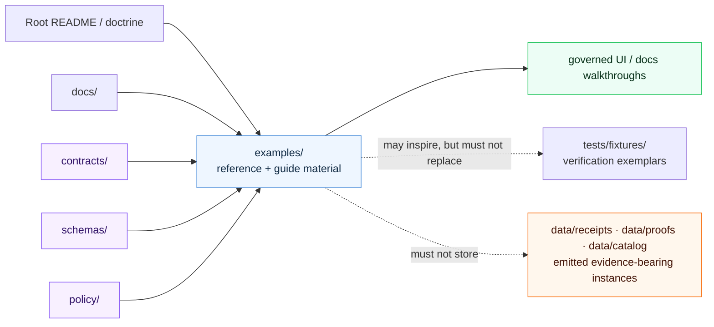

<!-- [KFM_META_BLOCK_V2]
doc_id: kfm://doc/NEEDS_VERIFICATION__examples_readme
title: Examples
type: standard
version: v1
status: draft
owners: NEEDS_VERIFICATION
created: 2026-04-26
updated: 2026-04-26
policy_label: NEEDS_VERIFICATION__public_or_internal
related: [../README.md, ../docs/README.md, ../contracts/README.md, ../schemas/README.md, ../policy/README.md, ../tests/README.md, ../data/README.md]
tags: [kfm, examples, readme, reference, governed-examples]
notes: [Active checkout not mounted in this session; verify owners, policy label, child paths, and related links before merge.]
[/KFM_META_BLOCK_V2] -->

<a id="top"></a>

# Examples

Small, public-safe demonstration artifacts that help contributors understand KFM contracts, flows, and trust boundaries without becoming canonical truth.


> [!IMPORTANT]
> **Status:** `experimental`  
> **Owners:** `NEEDS_VERIFICATION`  
> **Path:** `examples/README.md`  
> **Authority:** reference / pedagogical examples  
> **Quick jumps:** [Scope](#scope) · [Repo fit](#repo-fit) · [Inputs](#inputs) · [Exclusions](#exclusions) · [Directory tree](#directory-tree) · [Quickstart](#quickstart) · [Usage](#usage) · [Diagram](#diagram) · [Operating tables](#operating-tables) · [Task list](#task-list--definition-of-done) · [FAQ](#faq) · [Appendix](#appendix)

> [!WARNING]
> `examples/` is a teaching and orientation surface. It must not become the hidden home for canonical contracts, machine schemas, policy rules, source custody, fixtures, generated receipts, proofs, catalogs, releases, or live data.

---

## Scope

`examples/` exists to make KFM’s governed architecture easier to understand by showing **small, labeled, reviewable examples** of payloads, flows, shell states, and thin-slice patterns.

Use this directory for examples that are:

- **public-safe** and intentionally small;
- clearly marked as `illustrative`, `reference`, or `demo`;
- connected to KFM’s evidence-first posture;
- useful for contributors learning how a contract, payload, UI state, or governed flow is supposed to feel;
- safe to read without source credentials, private records, exact sensitive locations, or unpublished canonical stores.

**CONFIRMED doctrine:** KFM examples are reference material, not root truth.  
**NEEDS VERIFICATION:** the active branch inventory under `examples/` was not inspectable in this session.

[Back to top](#top)

---

## Repo fit

| Field | Value |
|---|---|
| Directory | `examples/` |
| This file | `examples/README.md` |
| Local role | Reference examples and guide material |
| Authority level | Reference / pedagogical |
| Must not replace | `../contracts/`, `../schemas/`, `../policy/`, `../tests/fixtures/`, `../data/receipts/`, `../data/proofs/`, `../data/catalog/`, or `../data/published/` |
| Upstream anchors | [Root README](../README.md), [Docs](../docs/README.md), [Contracts](../contracts/README.md), [Schemas](../schemas/README.md), [Policy](../policy/README.md) |
| Downstream consumers | [Tests](../tests/README.md), UI demos, contributor guides, onboarding notes, review walkthroughs |
| Verification note | Relative links and child directories require active-checkout verification before merge. |

> [!NOTE]
> A good example makes a governed flow legible. It does **not** grant authority to the payload it shows.

[Back to top](#top)

---

## Inputs

Accepted inputs are intentionally narrow.

| Accepted input | Belongs here when… | Required posture |
|---|---|---|
| Example payloads | They demonstrate the shape or feel of a KFM object without becoming a fixture. | Mark as `illustrative`; link to the owning contract/schema when verified. |
| UI state examples | They show shell state, Evidence Drawer state, Focus outcomes, or trust chips. | Use governed payloads only; no raw source shortcuts. |
| Thin-slice walkthroughs | They explain a small proof lane such as hydrology or UI evidence flow. | Keep source roles, release state, and evidence boundaries visible. |
| Demo manifests | They describe a sample example package or guide sequence. | Must not be confused with release manifests. |
| Contributor guide snippets | They teach safe example authoring. | Keep commands non-destructive and clearly scoped. |

### Minimal example metadata

Every example folder should include a short local README or manifest with at least:

```json
{
  "example_id": "kfm.example.NEEDS_VERIFICATION",
  "status": "illustrative",
  "truth_label": "PROPOSED",
  "uses": ["NEEDS_VERIFICATION__contract_or_payload_name"],
  "must_not_be_used_as": ["fixture", "proof", "release", "canonical_source"],
  "review_notes": "Verify links, owner, and policy label before promotion."
}
```

[Back to top](#top)

---

## Exclusions

These do **not** belong in `examples/`.

| Do not place here | Use instead | Why |
|---|---|---|
| Normative semantic object definitions | `../contracts/` | Examples do not define object meaning. |
| Machine-checkable schemas | `../schemas/` | Examples do not own executable validation. |
| Policy rules, deny logic, obligations | `../policy/` | Policy must remain enforceable and reviewable. |
| Valid/invalid regression fixtures | `../tests/fixtures/` | Fixtures are verification support, not pedagogy. |
| RAW, WORK, QUARANTINE, or source captures | `../data/raw/`, `../data/work/`, `../data/quarantine/` | Examples must not bypass the lifecycle. |
| Receipts, proofs, catalogs, release manifests | `../data/receipts/`, `../data/proofs/`, `../data/catalog/`, `../release/` | Emitted artifacts are evidence-bearing instances. |
| Secrets, credentials, tokens, private endpoints | Nowhere in repo examples | These must never be committed. |
| Exact sensitive locations or private personal data | Restricted governed lanes only | Public examples must fail closed on sensitivity. |
| Free-form AI outputs without evidence links | Governed Focus fixtures or tests after validation | Generated language is not root truth. |

> [!CAUTION]
> An example that looks realistic enough to be mistaken for production evidence needs stronger labels, smaller scope, or relocation into the proper governed surface.

[Back to top](#top)

---

## Directory tree

**NEEDS VERIFICATION:** this session did not expose the active repository checkout. The tree below is a review target, not a current inventory claim.

```text
examples/
├── README.md                         # this document
├── thin_slice/
│   └── hydrology/                    # NEEDS VERIFICATION: referenced by prior repo-facing docs
├── ui/                               # NEEDS VERIFICATION: referenced by prior repo-facing docs
└── <example-family>/                 # PROPOSED: add only after owning contract/schema is known
    ├── README.md                     # local purpose, status, inputs, exclusions
    ├── input.example.json            # illustrative input, not a test fixture
    ├── expected.example.json         # illustrative expected shape, not proof
    └── NOTES.md                      # assumptions, caveats, verification gaps
```

### Naming pattern

Prefer stable, lowercase, hyphenated folders:

```text
examples/
└── evidence-drawer-hydrology/
```

Avoid vague names:

```text
examples/
└── demo/
```

[Back to top](#top)

---

## Quickstart

From the repository root, run a non-destructive inventory before editing this directory:

```bash
git status --short
test -f examples/README.md
find examples -maxdepth 3 -type f | sort
```

Run the documentation checker only after verifying it exists in the active checkout:

```bash
if [ -f tools/docs/check_doc_structure.py ]; then
  python tools/docs/check_doc_structure.py examples/README.md
else
  echo "NEEDS VERIFICATION: tools/docs/check_doc_structure.py not found in this checkout"
fi
```

Before opening a PR, verify links from this README:

```bash
for path in \
  ../README.md \
  ../docs/README.md \
  ../contracts/README.md \
  ../schemas/README.md \
  ../policy/README.md \
  ../tests/README.md \
  ../data/README.md
do
  test -e "examples/$path" || echo "NEEDS VERIFICATION: $path"
done
```

[Back to top](#top)

---

## Usage

### Add a new example

1. Choose the smallest possible example surface.
2. Confirm the owning contract, schema, policy, or UI surface.
3. Create one folder with a local `README.md`.
4. Label every payload as `illustrative` unless it is deliberately promoted into a fixture elsewhere.
5. Keep the payload public-safe.
6. Add links to the relevant contract/schema/policy/test surface once verified.
7. Run the doc checker and link checker.
8. Record open verification gaps instead of smoothing them over.

### Example folder README checklist

```text
Required local fields:
- purpose
- status
- owner or NEEDS_VERIFICATION
- truth label
- accepted inputs
- exclusions
- linked upstream contract/schema/policy
- whether payloads are illustrative or fixtures
- sensitivity and rights posture
- verification gaps
```

> [!TIP]
> Use examples to teach the seam between objects. For instance, show why an `EvidenceBundle` is not a `RuntimeResponseEnvelope`, or why a run receipt is not a proof pack.

[Back to top](#top)

---

## Diagram

The diagram shows the intended responsibility boundary for `examples/`.


```mermaid
flowchart LR
    root["Root README / doctrine"]
    docs["docs/"]
    contracts["contracts/"]
    schemas["schemas/"]
    policy["policy/"]
    examples["examples/\nreference + guide material"]
    tests["tests/fixtures/\nverification exemplars"]
    data["data/receipts · data/proofs · data/catalog\nemitted evidence-bearing instances"]
    public["governed UI / docs walkthroughs"]

    root --> examples
    docs --> examples
    contracts --> examples
    schemas --> examples
    policy --> examples

    examples --> public
    examples -. "may inspire, but must not replace" .-> tests
    examples -. "must not store" .-> data

    classDef reference fill:#eef6ff,stroke:#4c8eda,color:#102a43;
    classDef normative fill:#f8f0ff,stroke:#8b5cf6,color:#2e1065;
    classDef evidence fill:#fff7ed,stroke:#f97316,color:#431407;
    classDef output fill:#ecfdf5,stroke:#22c55e,color:#052e16;

    class examples reference;
    class contracts,schemas,policy normative;
    class data evidence;
    class public output;
```

[Back to top](#top)

---

## Operating tables

### Example class matrix

| Example class | Good use | Bad use |
|---|---|---|
| Contract payload example | Helps a reader understand field intent. | Becomes the only definition of the object. |
| Evidence Drawer example | Shows visible source role, review, freshness, and sensitivity fields. | Hides policy or evidence state behind prose. |
| Focus outcome example | Demonstrates `ANSWER`, `ABSTAIN`, `DENY`, or `ERROR` as visible outcomes. | Acts like a free-form chatbot transcript. |
| Thin-slice walkthrough | Shows a narrow governed flow end to end. | Claims live connector, CI, or runtime maturity without proof. |
| UI shell example | Shows trust-visible interaction patterns. | Lets the renderer or style replace evidence state. |

### Boundary matrix

| Surface | Owns | Does not own |
|---|---|---|
| `examples/` | Pedagogical examples and guide material | Canon, policy, fixtures, emitted proof |
| `contracts/` | Object meaning and invariants | Executable validation as sole authority |
| `schemas/` | Machine-checkable structure | Semantic explanation as sole authority |
| `policy/` | Rights, sensitivity, admissibility, denial logic | Generic object meaning |
| `tests/fixtures/` | Valid/invalid exemplars and regression pressure | Teaching examples as the main goal |
| `data/receipts/` | Run/process memory | Proof or catalog truth |
| `data/proofs/` | Evidence-bearing proof instances | Pedagogical examples |
| `data/catalog/` | Discovery and lineage surfaces | Canonical source truth |

[Back to top](#top)

---

## Task list / definition of done

A change under `examples/` is ready for review when:

- [ ] The example has a clear local purpose and a truth label.
- [ ] Owner, status, and policy label are either confirmed or marked `NEEDS_VERIFICATION`.
- [ ] No raw source captures, credentials, secrets, or private endpoints are included.
- [ ] No exact sensitive locations or private personal data are included.
- [ ] Every payload is labeled as `illustrative`, `fixture`, or `generated`; `fixture` and `generated` payloads are moved to the correct owning surface.
- [ ] Related contract/schema/policy/test links are verified or explicitly marked as pending.
- [ ] The example does not claim active CI, route, runtime, workflow, or release behavior without direct evidence.
- [ ] Relative links render from `examples/README.md`.
- [ ] Mermaid diagram renders in GitHub.
- [ ] Any long reference material is placed in `<details>`.
- [ ] Reviewer can tell what belongs here and what must go elsewhere within one minute.

[Back to top](#top)

---

## FAQ

### Can an example include real data?

Only when the data is already public-safe, rights-cleared, small, and intentionally included as reference material. Source captures, sensitive locations, private records, unpublished candidates, and live connector output do not belong here.

### Can an example double as a test fixture?

Not by default. Move validation exemplars to `../tests/fixtures/` and link back from the example. The same payload can inspire a fixture, but the fixture must live under the verification surface.

### Can examples show Focus Mode or model-assisted output?

Yes, but only as bounded examples with visible outcome state, evidence references, policy posture, and citation expectations. Free-form model output without evidence linkage does not fit KFM’s trust model.

### Can UI examples read raw data directly?

No. UI examples should demonstrate governed payloads, released artifacts, or explicitly illustrative mock objects. They must not normalize a public path around RAW, WORK, QUARANTINE, canonical stores, vector indexes, model runtimes, or credentials.

### What should reviewers look for first?

Reviewers should check for accidental authority. The most common failure is an example that quietly becomes a schema, a fixture, a proof object, a release manifest, or a policy rule.

[Back to top](#top)

---

## Appendix

<details>
<summary>Truth labels used in this README</summary>

| Label | Meaning |
|---|---|
| `CONFIRMED` | Directly supported by current-session evidence or project doctrine. |
| `INFERRED` | Conservative conclusion grounded in available evidence, but not directly verified as implementation. |
| `PROPOSED` | Recommended structure or practice not proven as active repo behavior. |
| `UNKNOWN` | Not verified strongly enough to state. |
| `NEEDS_VERIFICATION` | Specific check required before merge, release, or stronger wording. |
| `CONFLICTED` | Source or convention ambiguity that must remain visible. |

</details>

<details>
<summary>Example authoring guardrails</summary>

A good KFM example is:

- small enough to inspect in a code review;
- safe enough to publish in a public repository;
- narrow enough to avoid pretending to be a complete implementation;
- explicit about what it demonstrates;
- explicit about what it does **not** prove;
- linked to the owning surfaces that define, validate, constrain, or test the real object.

A bad KFM example:

- uses realistic private data to feel convincing;
- shows a model answer without evidence linkage;
- includes a source token or endpoint credential;
- hides sensitivity or rights posture;
- becomes the only visible copy of an object shape;
- claims workflow, route, validator, or release maturity that the repo has not proven.

</details>

<details>
<summary>Pre-publish checklist for this README</summary>

- [x] One H1.
- [x] One-line purpose directly under the title.
- [x] KFM Meta Block V2 present.
- [x] README-like impact block present.
- [x] Status, owner, badges, path, and quick jumps present.
- [x] Repo fit, inputs, and exclusions present.
- [x] Directory tree included with verification labels.
- [x] Quickstart commands are non-destructive.
- [x] Mermaid diagram included.
- [x] Tables clarify boundaries and example classes.
- [x] Task list includes definition of done.
- [x] FAQ included.
- [x] Long appendix content wrapped in `<details>`.
- [ ] Active branch verifies owner, policy label, related links, child paths, and doc-checker command.

</details>

[Back to top](#top)
