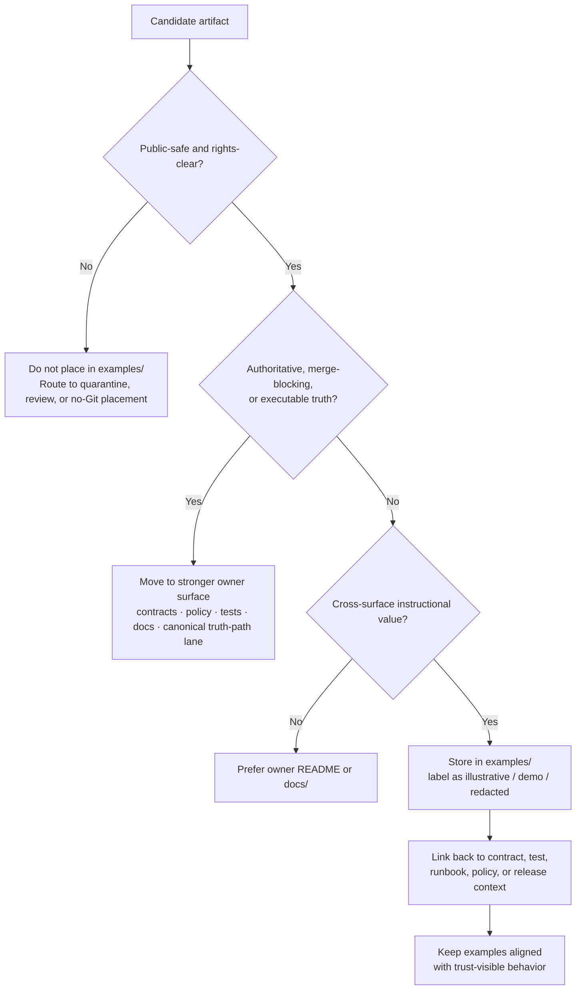

<!-- [KFM_META_BLOCK_V2]
doc_id: kfm://doc/NEEDS-VERIFICATION
title: examples
type: standard
version: v1
status: draft
owners: NEEDS VERIFICATION
created: YYYY-MM-DD
updated: YYYY-MM-DD
policy_label: NEEDS VERIFICATION
related: [../README.md, ../CONTRIBUTING.md, ../.github/README.md]
tags: [kfm, examples, fixtures, readme]
notes: [mounted checkout not directly visible in this session; March 2026 doctrine and one March 2026 repo-inventory document confirm a documented examples lane, but owners, dates, policy label, adjacent link targets, and final path/placement details still require branch verification]
[/KFM_META_BLOCK_V2] -->

# examples

Public-safe, non-authoritative sample datasets, example payloads, thin-slice illustrations, and demo assets for Kansas Frontier Matrix.

| Field | Value |
|---|---|
| Status | experimental |
| Owners | **NEEDS VERIFICATION** |
| Path | `examples/README.md` |
| Repo fit | **CONFIRMED in March 2026 repo-inventory documentation; mounted checkout still NEEDS VERIFICATION** |
| Upstream | [`../README.md`](../README.md) · [`../CONTRIBUTING.md`](../CONTRIBUTING.md) · [`../.github/README.md`](../.github/README.md) **(link targets NEED VERIFICATION)** |
| Downstream | `examples/` subfolders and example packs that remain public-safe, non-authoritative, and easy to relocate once stronger owners are verified |
| Quick jumps | [Scope](#scope) · [Repo fit](#repo-fit) · [Accepted inputs](#accepted-inputs) · [Exclusions](#exclusions) · [Directory tree](#directory-tree) · [Quickstart](#quickstart) · [Usage](#usage) · [Diagram](#diagram) · [Tables](#tables) · [Task list](#task-list--definition-of-done) · [FAQ](#faq) · [Appendix](#appendix) |


> [!IMPORTANT]
> This README is intentionally **evidence-bounded**.
>
> In this session, March 2026 KFM doctrine and design manuals were directly visible, and one March 2026 repo-inventory document also described a top-level `examples/` lane. The **active mounted checkout itself was not directly inspectable**, so file-path, owner, and adjacency claims below are split as:
>
> - **CONFIRMED** when they are directly supported by the visible March 2026 project documents
> - **INFERRED** when they reconcile multiple source documents into a repo-native rule
> - **PROPOSED** when they are recommended placement or workflow patterns, not mounted implementation fact
> - **UNKNOWN** when current repo state or implementation depth is not established here
> - **NEEDS VERIFICATION** when a path, owner, date, label, or link target must be checked against the active branch
>
> Nothing in `examples/` should masquerade as canonical truth, promoted data, policy truth, release proof, or rights-unclear source material.

> [!NOTE]
> The directly inspectable March 2026 corpus clearly confirms a proposed hydrology thin-slice pack at `examples/thin_slice/hydrology/`.
>
> An alternative `thin-slice` spelling appeared in earlier draft material but was **not** re-verified in the directly inspected source set during this pass, so this README leaves that variant as **NEEDS VERIFICATION** instead of silently standardizing it.

---

## Scope

`examples/` is KFM’s **human-facing example lane**.

Its job is to make real system behavior easier to understand **without** turning examples into authority. In KFM terms, the directory should support the **governed truth path**, the **trust membrane**, and the **trust-visible product shell**—not weaken them.

That keeps the scope intentionally narrow:

- keep **small, inspectable, public-safe** example artifacts here
- keep **authoritative, merge-blocking, or release-bearing** artifacts with their owning surface
- keep **sensitive, rights-unclear, or canonical** material out
- keep example packs aligned with the contracts, fixtures, policy rules, and trust-visible surfaces they illustrate

A good example in this directory should do three things well:

1. explain something real
2. stay visibly illustrative
3. remain easy to move once a stronger owner surface is confirmed

> [!TIP]
> Treat `examples/` as part of repository truth, but **not** as the truth source.

[Back to top](#examples)

## Repo fit

**Path:** `examples/README.md`

**Role in repo:** directory README for public-safe example material, demo assets, and thin-slice illustrations that help contributors understand KFM behavior.

### Why this directory exists

The March 2026 KFM corpus repeatedly pushes toward **artifactization**: starter schemas, valid/invalid fixtures, example bundles, release proof objects, Evidence Drawer payloads, runtime envelopes, and one hydrology-first governed slice. This README gives those pressures a **clear explanatory landing zone** without stealing authority from contracts, tests, policy bundles, release artifacts, or canonical data movement.

### Documented neighboring lanes

The visible March 2026 project corpus describes a repo shape in which `examples/` sits beside stronger owner surfaces such as `docs/`, `contracts/`, `policy/`, and `tests/`. This README follows that documented directory logic while still treating the mounted checkout as unverified.

| Neighbor lane | Documented role | Relationship to `examples/` |
|---|---|---|
| `contracts/` | API contracts and schemas | Move normative schema examples and spec-coupled payloads here |
| `policy/` | authorization and policy code/fixtures | Move executable policy cases and merge-blocking policy fixtures here |
| `docs/` | ADRs, runbooks, standards, human-readable guidance | Move long-form procedures and authoritative explanations here |
| `tests/` | unit, integration, and e2e suites | Move CI-facing valid/invalid proof packs here |
| `examples/` | sample datasets, stories, and policies in explanatory form | Keep only public-safe, non-authoritative examples here |

### Stronger owner surfaces

| Stronger owner surface | What belongs there | Why it should not default to `examples/` |
|---|---|---|
| `contracts/` | machine-readable contracts, schemas, outward profiles, contract examples tightly coupled to a spec | contract truth should stay versioned, diffable, and mechanically checked |
| `tests/` and fixture-owning lanes | valid/invalid fixtures, negative-path packs, replay samples, merge-blocking examples | CI-facing proof belongs with the harness that enforces it |
| `policy/` | reason codes, obligation codes, rights classes, sensitivity classes, policy fixtures, decision tests | executable governance should not hide inside a demo lane |
| canonical truth-path lanes | `RAW`, `WORK`, `QUARANTINE`, `PROCESSED`, `CATALOG`, and `PUBLISHED` artifacts | canonical material is not example material |
| governed app and API surfaces | live payloads, route-specific examples, trust-state examples tightly coupled to runtime behavior | runtime truth should stay with its owner |
| `docs/` and runbooks | ADRs, operator procedures, publication/correction guides, explanatory standards | narrative authority belongs in docs, not in a sample lane |

### Working interpretation for this README

**INFERRED:** `examples/` is the repo’s **public-safe explanatory lane**.

That means:

- example packs may live here
- machine-checkable truth should live closer to the surface that owns it
- story or policy illustrations may live here **only** when they are clearly labeled as non-authoritative
- exact file placement still needs mounted-checkout verification before any path is treated as settled implementation fact

[Back to top](#examples)

## Accepted inputs

Content that belongs here includes:

- small, public-safe sample datasets or subsets used for walkthroughs
- redacted example payloads for map, dossier, story, Evidence Drawer, or Focus surfaces
- illustrative `EvidenceBundle`, `RuntimeResponseEnvelope`, `ProjectionBuildReceipt`, or `CorrectionNotice` samples when they are clearly labeled as examples
- tiny sample objects that explain KFM contract families without pretending to be canonical records
- public-safe example stories or thin-slice narratives that help contributors inspect trust-visible behavior
- hydrology-first illustration packs when the goal is explanation rather than merge-blocking execution
- screenshot, tutorial, or onboarding assets that help readers understand governed behavior
- sidecar metadata that clarifies purpose, redaction state, stronger owner, and limits
- **illustrative** policy or reason-code examples only when they are explanatory and not the executable policy fixture of record

A useful heuristic is simple: examples here should be **labeled**, **reviewable in one diff**, and **obviously illustrative**.

[Back to top](#examples)

## Exclusions

The following do **not** belong here:

- canonical `RAW`, `WORK`, `QUARANTINE`, `PROCESSED`, `CATALOG`, or `PUBLISHED` artifacts
- release manifests, proof packs, attestation bundles, or correction records presented as operational truth
- authoritative contract schemas or merge-blocking valid/invalid fixtures
- executable policy fixtures, access rules, or review-decision logic
- secrets, tokens, local environment files, or machine-specific configuration
- rights-unclear, restricted, or precise sensitive-location material
- large binaries, dumps, archives, or model files that add weight without review value
- example payloads that imply verified route names, DTOs, manifests, or mounted schemas the checkout has not proved
- narrative claims presented as authoritative fact without provenance and release context

### Put these elsewhere instead

| If the artifact is… | Prefer… |
|---|---|
| canonical truth-path material | the relevant canonical data or release surface |
| machine-checkable contract material | `contracts/` or the contract-owning lane |
| valid/invalid fixture coverage | `tests/` or the fixture-owning lane |
| executable policy logic or policy fixtures | `policy/` |
| long-form explanation or operational procedure | `docs/`, ADRs, or runbooks |
| restricted, rights-unclear, or unresolved material | quarantine, review, or no Git placement yet |

> [!WARNING]
> If a file is needed to make CI fail, promotion pass, policy decide, or runtime truth resolve, it probably has a stronger owner than `examples/`.

[Back to top](#examples)

## Directory tree

### Conservative current view

```text
examples/
└── README.md   # target of this revision; mounted contents still need verification
```

This README is designed to remain useful even if the lane is sparse.

<details>
<summary><strong>Documented and PROPOSED growth shapes</strong></summary>

The visible March 2026 corpus documents a top-level `examples/` lane and also proposes a hydrology-first example pack. It separately emphasizes `contracts/`, `policy/`, `docs/`, and `tests/` as stronger owner surfaces.

```text
# Documented repo-context lanes from March 2026 inventory
contracts/
docs/
examples/
policy/
tests/
```

```text
# March 14 proposed hydrology-first artifact pack
examples/
└── thin_slice/
    └── hydrology/
        ├── source_descriptor.json
        ├── ingest_receipt.json
        ├── dataset_version.json
        ├── catalog_closure.json
        ├── release_manifest.json
        └── evidence_bundle.json
```

```text
# March 20 doctrine repeatedly pairs contracts with fixtures and runbooks
contracts/
tests/
docs/
└── runbooks/
```

Working rule for this README:

- keep **public-safe explanatory packs** in `examples/`
- keep **machine-checkable proof** with `tests/` or another owner surface
- keep **normative contracts** with `contracts/`
- keep **operational procedures** with `docs/` / runbooks
- verify any exact mounted path before treating it as settled repo fact
</details>

[Back to top](#examples)

## Quickstart

Verify the checkout first. Do **not** let this README settle path details that the active branch has not proved.

```bash
# See whether a repo checkout is actually mounted
pwd
git rev-parse --show-toplevel 2>/dev/null || echo "No mounted git checkout detected"

# Inspect nearby top-level lanes if a checkout is present
find . -maxdepth 2 -type d | sort
```

Inspect the example lane and the most likely stronger owner surfaces:

```bash
# Example lane itself
find examples -maxdepth 4 -print 2>/dev/null | sort || true

# Likely stronger owner surfaces
find contracts policy docs tests -maxdepth 3 -print 2>/dev/null | sort | sed -n '1,200p'
```

Check what the active checkout actually uses before adding a thin-slice pack or example fixture:

```bash
git ls-files 'examples/**' 'contracts/**' 'policy/**' 'docs/**' 'tests/**' 2>/dev/null || true
```

Before adding a new artifact, answer these questions:

1. Is it public-safe and rights-clear?
2. Is it obviously illustrative rather than authoritative?
3. Would `contracts/`, `policy/`, `tests/`, `docs/`, or a canonical truth-path surface own it more naturally?
4. If it demonstrates governed behavior, where is the owner surface that proves that behavior?
5. Can it be moved or deleted later without breaking the repo’s source of truth?

> [!NOTE]
> The directly inspectable corpus confirms a proposed `examples/thin_slice/hydrology/` pack. Any alternative spelling should be verified in the mounted checkout before adoption.

[Back to top](#examples)

## Usage

### 1. Choose the owning surface first

Start by deciding where the **source of truth** lives.

- If the material defines a contract or outward payload, its stronger owner is probably `contracts/`.
- If it proves positive or negative behavior, its stronger owner is probably `tests/` or a fixture-owning lane.
- If it carries policy logic or review-role semantics, its stronger owner is probably `policy/`.
- If it is part of the governed lifecycle, it likely belongs with the canonical truth-path owner.
- If it explains a user flow, runbook, or standards decision, `docs/` is usually better.

Put material in `examples/` only when the value is **instructional, public-safe, and cross-surface**.

### 2. Keep examples small, labeled, and reversible

A good example in this directory should be:

- small enough to review quickly
- labeled as `example`, `demo`, `illustrative`, `redacted`, or equivalent
- explicit about what it proves and what it does **not** prove
- easy to relocate once a stronger owner surface becomes available

### 3. Keep examples aligned with the surfaces they illustrate

KFM treats examples as part of the working system, not as disposable decoration.

That means:

- behavior-significant changes should update examples along with contracts, diagrams, runbooks, or trust-state guidance
- published examples should still agree with the schemas or contracts they illustrate
- version-sensitive facts should be visibly marked when they are not mount-verified
- correction and stale/superseded behavior should stay visible rather than silently overwritten

### 4. Pair behavior-heavy examples with stronger proof

If the example demonstrates validation, policy, publication, correction, or runtime behavior, do not leave it alone.

Link it back to:

- the owning contract
- the relevant test or fixture lane
- the governing runbook
- the policy rule or review condition that makes the behavior valid
- the release or correction context that keeps the example inspectable

### 5. Prefer cross-links over duplicate authority

`examples/` should make the repo easier to navigate, not create a second authority layer.

A strong example pack should point back to the owner surface, not replace it.

[Back to top](#examples)

## Diagram


```mermaid
flowchart TD
    A[Candidate artifact] --> B{Public-safe and rights-clear?}
    B -- No --> X[Do not place in examples/<br/>Route to quarantine, review, or no-Git placement]
    B -- Yes --> C{Authoritative, merge-blocking,<br/>or executable truth?}
    C -- Yes --> D[Move to stronger owner surface<br/>contracts · policy · tests · docs · canonical truth-path lane]
    C -- No --> E{Cross-surface instructional value?}
    E -- No --> F[Prefer owner README or docs/]
    E -- Yes --> G[Store in examples/<br/>label as illustrative / demo / redacted]
    G --> H[Link back to contract, test,<br/>runbook, policy, or release context]
    H --> I[Keep examples aligned<br/>with trust-visible behavior]
```

[Back to top](#examples)

## Tables

### Placement matrix

| Artifact class | Keep in `examples/`? | Stronger owner when authoritative | Why |
|---|---|---|---|
| Tiny redacted request/response sample | Yes | `contracts/` or runtime-owning lane | Good for walkthroughs; weak as source of truth |
| Story or dossier demo payload | Yes, if public-safe | app/test/docs owner | Helpful for onboarding and review |
| `EvidenceBundle` illustration | Yes, if clearly labeled | evidence/runtime/test lanes | Useful for UI review, unsafe as lone authority |
| `RuntimeResponseEnvelope` illustration | Yes, if clearly labeled | contract + API + test lanes | Good for trust-state explanation |
| Valid schema/contract fixture | Usually no | `tests/` or contract-owning lane | Should stay mechanically checked |
| Invalid schema/contract fixture | Usually no | `tests/` or policy/contract lane | Negative behavior should stay executable |
| Explanatory policy example | Sometimes | `policy/` | Only belongs here when clearly non-authoritative |
| Hydrology thin-slice illustration pack | Sometimes | test, contract, or release-owning lane | Good here only when explanatory and public-safe |
| Canonical dataset snapshot | No | governed truth-path owner | Examples must not replace the truth path |
| Release manifest / proof pack / correction notice | No, unless explicitly illustrative and marked non-authoritative | release, delivery, or ops evidence surface | These are trust-bearing operational objects |
| Sensitive coordinates / rights-unclear material | No | nowhere in Git until resolved | Violates KFM trust posture |
| Screenshot or UI walkthrough asset | Yes, if public-safe | `docs/` or app owner | Useful when it supports, not replaces, real behavior |

### Path-shape status matrix

| Path family | Status in this README | How to treat it here |
|---|---|---|
| `examples/` | **CONFIRMED in March 2026 repo-inventory documentation; mounted checkout still NEEDS VERIFICATION** | Use as documented repo context, not as branch-proven mount state |
| `examples/README.md` | **Task target / branch placement still NEEDS VERIFICATION** | Suitable README target for this lane |
| `examples/thin_slice/hydrology/` | **PROPOSED** | Directly supported as a proposed hydrology-first artifact pack |
| `examples/thin-slice/hydrology/` | **NEEDS VERIFICATION** | Do not standardize this spelling from the current evidence set |
| `contracts/` | **CONFIRMED in March 2026 repo-inventory documentation** | Strong owner for normative contracts and schemas |
| `policy/` | **CONFIRMED in March 2026 repo-inventory documentation** | Strong owner for executable policy rules and fixtures |
| `tests/` | **CONFIRMED in March 2026 repo-inventory documentation** | Strong owner for valid/invalid and runtime proof packs |
| `docs/runbooks/` | **INFERRED / PROPOSED** | Consistent home for operational guidance; verify exact mount path |
| `schemas/*.schema.json` and `fixtures/valid|invalid/*` | **PROPOSED starter family in March 2026 doctrine** | Treat as companion-path pressure, not mounted fact |
| repo-path standardization itself | **DEFERRED until checkout verification** | Do not let README prose settle unresolved branch reality |

### Status language used here

| Label | Use here when… |
|---|---|
| **CONFIRMED** | the visible March 2026 project documents directly support the statement |
| **INFERRED** | multiple visible project documents converge on the rule, but the mounted checkout is still absent |
| **PROPOSED** | the shape is a recommended artifact or placement pattern, not proven implementation reality |
| **UNKNOWN** | current repo state, owner placement, or implementation depth is not established here |
| **NEEDS VERIFICATION** | a placeholder field, link target, owner, or exact path must be checked before commit |

[Back to top](#examples)

## Task list / Definition of done

A contribution to `examples/` is ready when all relevant checks below are true:

- [ ] It is public-safe, rights-clear, and small enough to review quickly.
- [ ] It is labeled as **example**, **demo**, **illustrative**, **redacted**, or equivalent.
- [ ] It does not pretend to be canonical truth, a promoted dataset, or release evidence.
- [ ] The stronger owner surface is identified and linked when one exists.
- [ ] If it demonstrates behavior, the related contract, test, policy, runbook, or release context is linked.
- [ ] Published examples still agree with the schemas or contracts they illustrate.
- [ ] If it is a thin-slice illustration pack, a reviewer can move from example read -> evidence -> release or correction context without a trust gap.
- [ ] If a negative path matters, the failing example exists in a stronger owner surface.
- [ ] No secrets, tokens, local machine paths, or restricted precise coordinates are embedded.
- [ ] If trust-visible surface behavior changes, the documentation/accessibility implications are updated too.
- [ ] The example improves contributor understanding more than it increases maintenance cost.
- [ ] Relocation or deletion is easy once the stronger owner surface is confirmed.

[Back to top](#examples)

## FAQ

### Why can this directory stay small?

Because a narrow, honest example lane is still useful. The directory can clarify what belongs here and what must stay with stronger owner surfaces even before it holds many files.

### Where should valid and invalid fixtures live?

Prefer the strongest owner surface. March 2026 KFM doctrine repeatedly treats valid/invalid fixtures as machine-checkable proof, not as loose sample clutter.

### Why not store real dataset snapshots here?

Because KFM separates examples from authoritative truth. Governed data belongs in the truth path and its owning release/data surfaces, not in a convenience lane.

### Why hydrology first?

Because the visible March 2026 corpus repeatedly treats hydrology as the strongest public-safe thin slice: it is specific enough to build, broad enough to prove the governed path, and rich enough to exercise Evidence Drawer, release proof, correction, and rollback behavior.

### When should something move out of `examples/`?

Move it once it becomes authoritative, merge-blocking, schema-governing, release-bearing, or tightly owned by one surface.

[Back to top](#examples)

## Appendix

<details>
<summary><strong>PROPOSED sidecar fields for richer example packs</strong></summary>

Use a sidecar only when the example needs more context than a filename can carry.

```yaml
example_id: NEEDS-VERIFICATION
title: Example title
purpose: Short sentence explaining what this demonstrates
authority_status: illustrative
owner_surface: contracts/ | policy/ | tests/ | docs/ | app-runtime-owner | canonical-truth-path-owner
redaction_status: public_safe
related_contracts: []
related_tests: []
related_policies: []
related_runbooks: []
related_release_artifacts: []
source_state: documented_or_proposed
notes:
  - Replace placeholders before commit
  - Link the stronger owner surface when known
  - Re-check exact path and branch placement before standardizing filenames
```

A sidecar should reduce ambiguity, not add ceremony.
</details>

<details>
<summary><strong>PROPOSED naming guidance</strong></summary>

Prefer names that tell a reviewer what the asset is doing:

- `public-read-example.json`
- `focus-abstain-example.json`
- `story-citation-example.md`
- `catalog-closure-example.json`
- `redacted-feature-example.geojson`
- `hydrology-evidence-bundle-example.json`

Avoid names that imply authority or production state:

- `final.json`
- `real_data.csv`
- `release-ready.geojson`
- `truth-layer.parquet`
- `production-response.json`
</details>

<details>
<summary><strong>Evidence caution for path standardization</strong></summary>

The current source set supports **documented repo context** plus **proposed artifact pressure**.

Directly inspectable evidence in this pass supports at least these points:

- a documented top-level `examples/` lane in March 2026 repo-inventory material
- a proposed hydrology-first pack at `examples/thin_slice/hydrology/`
- documented stronger owner surfaces such as `contracts/`, `policy/`, and `tests/`
- proposed doctrine pressure for `schemas/*.schema.json`, `fixtures/valid/*`, `fixtures/invalid/*`, and `docs/runbooks/*`

Do not let this README silently settle any unresolved branch-level path debate. Surface the active checkout first, then align the file to the mounted repo without weakening contract ownership, fixture ownership, policy ownership, or truth-path discipline.
</details>

[Back to top](#examples)
