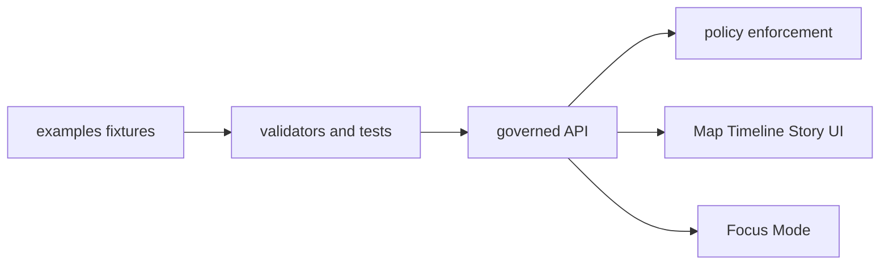

<!-- [KFM_META_BLOCK_V2]
doc_id: kfm://doc/9b589b1f-3a10-4fdf-b7c9-6d13fca4f0c2
title: examples/ — Example datasets, stories, and policy fixtures
type: standard
version: v1
status: draft
owners: KFM Maintainers
created: 2026-03-03
updated: 2026-03-03
policy_label: public
related:
  - ../docs/
  - ../data/
  - ../policy/
tags: [kfm, examples]
notes:
  - This README documents the intent and governance rules for the examples/ directory.
  - Claims are explicitly labeled Confirmed / Proposed / Unknown (per KFM evidence discipline).
[/KFM_META_BLOCK_V2] -->

# `examples/` — Example datasets, stories, and policy fixtures

> **One-line purpose:** **Confirmed:** Keep small, safe, governed examples (datasets + stories + policies) for demos, docs, and automated tests.


**Status:** draft • **Owners:** KFM Maintainers

## Navigation
- [Evidence labels used in this README](#evidence-labels-used-in-this-readme)
- [What this folder is for](#what-this-folder-is-for)
- [Where this fits in the repo](#where-this-fits-in-the-repo)
- [What belongs here](#what-belongs-here)
- [What must not go here](#what-must-not-go-here)
- [Directory layout](#directory-layout)
- [How examples flow through the system](#how-examples-flow-through-the-system)
- [How to add a new example](#how-to-add-a-new-example)
- [Templates](#templates)
- [Appendix: Keeping this README accurate](#appendix-keeping-this-readme-accurate)

---

## Evidence labels used in this README

KFM documentation requires that meaningful claims be explicitly labeled:

- **Confirmed:** Supported by an existing KFM doc/artifact.
- **Proposed:** Recommended convention / desired future state.
- **Unknown:** Not verified in the repo as of this README’s last update.

When something is **Unknown**, this README includes the *smallest verification step* needed to make it **Confirmed**.

[Back to top](#navigation)

---

## What this folder is for

- **Confirmed:** `examples/` is intended for **sample datasets, stories, and policies** — “example data and narratives.”
- **Confirmed:** KFM is evidence-first and policy-governed; user-visible outputs should be traceable and fail-closed when requirements are missing.
- **Confirmed:** Examples must respect KFM’s “truth path”: UI and Focus Mode should exercise examples **through governed APIs and policy enforcement**, not by directly reading from databases/storage.

> [!NOTE]
> **Proposed:** Treat `examples/` as the canonical place for *fixtures you can safely ship* (small, synthetic/redacted, license-cleared).  
> **Proposed:** Production-ish data should follow the normal KFM lifecycle and promotion gates (RAW → WORK → PROCESSED → PUBLISHED), not “live” in `examples/`.

[Back to top](#navigation)

---

## Where this fits in the repo

- **Confirmed:** KFM is a layered system; the UI never directly touches databases, and access is mediated by backend APIs enforcing governance and policy.
- **Proposed:** `examples/` should be referenced by:
  - documentation pages (illustrative sample payloads),
  - automated tests (fixtures for contract/e2e),
  - demo scripts (repeatable “hello world” flows).

> [!TIP]
> **Proposed:** If an example exists only as documentation text, prefer also including a machine-readable artifact here so CI can validate it.

[Back to top](#navigation)

---

## What belongs here

**Proposed (common buckets):**
- Small **dataset fixtures** (GeoJSON, tiny rasters, CSV, JSON-LD), with accompanying metadata (DCAT/STAC/PROV).
- **Story fixtures** (Story Nodes, story snippets, narrative overlays) that cite evidence bundles and demonstrate citation UX.
- **Policy fixtures** (Rego evaluation inputs/outputs, allow/deny scenarios, redaction examples) used by Conftest/OPA tests.
- **API examples** (request/response JSON) for documentation and contract tests.

**Proposed (minimum for anything “data-like” in examples):**
- A `policy_label` (public/restricted/…) + explicit redaction posture (even if “not needed”).
- Explicit rights + license (e.g., `rights_spdx`) and attribution.
- A `spec_hash` and `run_receipt` (or pointer) so CI can verify determinism and provenance.

[Back to top](#navigation)

---

## What must not go here

- **Proposed:** Anything containing real secrets, tokens, credentials, or private keys.
- **Proposed:** Any real PII or sensitive location data.
- **Proposed:** Large binaries that bloat Git history (keep examples tiny; use the proper data zones for real artifacts).
- **Proposed:** Executable payloads intended to “prove a point.”

> [!WARNING]
> **Proposed safety bar for *all* example artifacts:** they should be synthetic/redacted, contain no executable content, and be safe for open distribution.

[Back to top](#navigation)

---

## Directory layout

### Current layout

- **Unknown:** The exact on-disk structure of `examples/` in the current repo checkout.
  - **Verify:** run `tree examples/` (or `ls -R examples/`) and update this section with the real paths.

### Recommended layout

- **Proposed:** Organize examples by intent and keep each example self-contained.

```text
examples/
├── README.md
├── datasets/
│   └── <example_id>/
│       ├── README.md
│       ├── dcat.dataset.jsonld
│       ├── stac.collection.json
│       ├── stac.items/
│       │   └── <item_id>.json
│       ├── prov.bundle.json
│       ├── evidence/
│       │   ├── run_receipt.json
│       │   └── checksums.txt
│       └── data/
│           └── <tiny_fixture_files>
├── stories/
│   └── <story_id>/
│       ├── README.md
│       └── story_node.json
├── policy/
│   └── <policy_case_id>/
│       ├── README.md
│       ├── input.json
│       └── expected.json
└── api/
    └── <endpoint_or_contract>/
        ├── request.json
        └── response.json
```

[Back to top](#navigation)

---

## How examples flow through the system

**Confirmed:** KFM’s architecture enforces a mediated “truth path” where the UI does not bypass backend APIs, and governance policies apply at the API boundary.


```mermaid
flowchart LR
  X[examples fixtures] --> V[validators and tests]
  V --> A[governed API]
  A --> P[policy enforcement]
  A --> U[Map Timeline Story UI]
  A --> F[Focus Mode]
```

**Proposed:** Any demo that uses examples should be runnable in CI (or at least via a documented command) and should fail-closed when required evidence is missing.

[Back to top](#navigation)

---

## How to add a new example

### Minimal patch plan

**Proposed:** Add one self-contained example folder at a time; keep PRs small and reversible.

1. **Proposed:** Pick a stable ID (`<example_id>` / `<story_id>` / `<policy_case_id>`).
2. **Proposed:** Add the smallest possible fixture that still exercises the behavior you care about.
3. **Proposed:** Add metadata + provenance:
   - DCAT dataset record (license, publisher, spatial/temporal extents)
   - STAC collection + item(s)
   - PROV bundle and/or a run receipt
4. **Proposed:** Add a short README explaining:
   - intent
   - inputs/outputs
   - how it’s validated
   - what it must *not* be used for
5. **Proposed:** Add/extend a test so CI actually executes the example.

### Definition of Done

- [ ] **Proposed:** Example is small (reviewable in a diff) and uses deterministic outputs.
- [ ] **Proposed:** Licensing is explicit (license is treated as a policy input, not “paperwork”).
- [ ] **Proposed:** Contains no secrets / PII / unsafe content.
- [ ] **Proposed:** Has an evidence pointer (receipt, checksums, and/or evidence bundle reference).
- [ ] **Proposed:** Fails closed if requirements aren’t met (validation/test enforces).

[Back to top](#navigation)

---

## Templates

### Template: `run_receipt.json` (minimal)

**Proposed:** Store a tiny, immutable run receipt alongside any “data-like” example.

```json
{
  "dataset_id": "kfm.example.<id>",
  "run_id": "2026-03-03T00:00:00Z-demo",
  "fetch_time": "2026-03-03T00:00:00Z",
  "http_validators": {
    "etag": "W/\"demo\"",
    "last_modified": "Tue, 03 Mar 2026 00:00:00 GMT"
  },
  "spec_hash": "sha256:<hex>",
  "artifacts": [
    "examples/datasets/<example_id>/data/<fixture_file>"
  ],
  "rights_spdx": "CC0-1.0"
}
```

### Template: DCAT/STAC/PROV “triplet” checklist

**Confirmed:** KFM treats catalogs + provenance as contract surfaces; DCAT/STAC/PROV each answer different questions and should be cross-linked.

**Proposed (for examples):**
- DCAT:
  - title/description/publisher
  - license/rights
  - spatial + temporal coverage
  - distribution(s) that point at fixture artifacts
- STAC:
  - collection with spatial/temporal extent + license
  - item(s) with geometry/bbox, datetime, assets
  - links to DCAT and provenance/receipt
- PROV:
  - Activity (the run)
  - Entities (inputs/outputs)
  - used / wasGeneratedBy edges
  - agent (tool and/or steward)

### Template: “policy fixture” layout

```text
examples/policy/<case_id>/
├── README.md
├── input.json        # API request or evaluation input
├── expected.json     # expected allow/deny + obligations
└── notes.md          # optional, short rationale
```

[Back to top](#navigation)

---

## Appendix: Keeping this README accurate

- **Unknown:** Which example subfolders currently exist (`datasets/`, `stories/`, etc.).
  - **Verify:** `tree examples/` and update the “Current layout” section with the real structure.
- **Unknown:** Which local validation commands exist for examples (Make targets, scripts, etc.).
  - **Verify:** inspect `Makefile` and `tools/` for validators; link them from this README.

> [!TIP]
> **Proposed:** Keep this file boring and operational. If you introduce a new example category, update the directory tree *and* add a test that exercises it.

[Back to top](#navigation)
