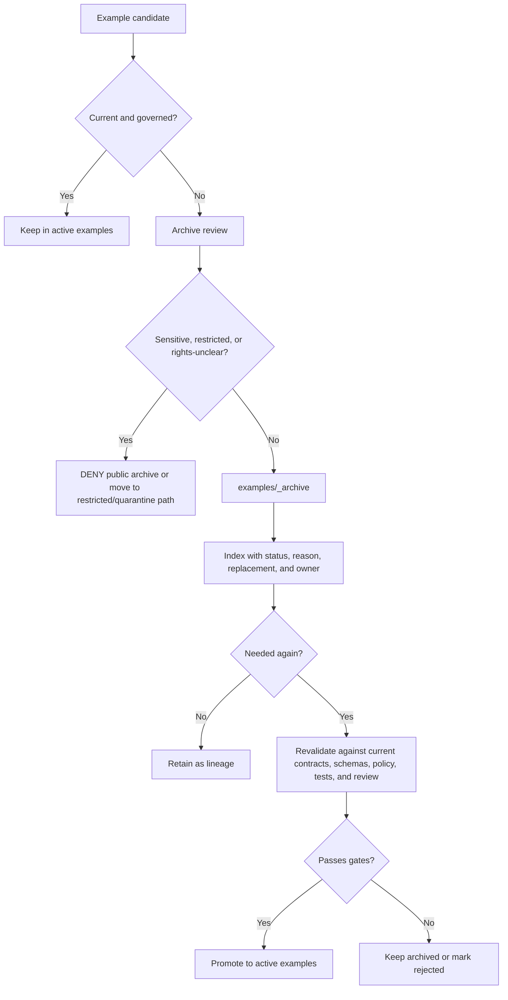

<!-- [KFM_META_BLOCK_V2]
doc_id: kfm://doc/NEEDS-VERIFICATION
title: Archived Examples
type: standard
version: v1
status: draft
owners: OWNER_TBD
created: TODO(date): set on first commit
updated: TODO(date): set on first commit or revision
policy_label: TODO(policy): public-or-restricted
related: [NEEDS_VERIFICATION:../README.md, NEEDS_VERIFICATION:../../docs/archive/README.md, NEEDS_VERIFICATION:../../docs/intake/README.md, NEEDS_VERIFICATION:../../docs/governance/document-authority-ladder.md]
tags: [kfm, examples, archive, lineage, governance]
notes: [Directory README for archived KFM examples, Target path supplied by request, Current repo contents and owners remain NEEDS VERIFICATION, Archived examples are lineage only unless revalidated and promoted]
[/KFM_META_BLOCK_V2] -->

# Archived Examples

Preserve retired, superseded, or exploratory KFM examples as inspectable lineage without letting them masquerade as current runnable proof.

<p>
  
  
  
  
</p>

> [!IMPORTANT]
> **Impact block**
>
> | Field | Value |
> |---|---|
> | Status | `experimental` until the mounted repository confirms this directory, owner, index, and adjacent links |
> | Owners | `OWNER_TBD` |
> | Target path | `examples/_archive/README.md` |
> | Authority level | `lineage-only`; archived examples do not define current contracts, policy, runtime behavior, source authority, or publication readiness |
> | Truth posture | **CONFIRMED** KFM doctrine / **PROPOSED** archive rules / **UNKNOWN** current directory contents |
> | Quick jumps | [Scope](#scope) · [Repo fit](#repo-fit) · [Accepted inputs](#accepted-inputs) · [Exclusions](#exclusions) · [Directory tree](#directory-tree) · [Usage](#usage) · [Archive flow](#archive-flow) · [Definition of done](#definition-of-done) · [FAQ](#faq) |

---

## Scope

`examples/_archive/` is the holding area for example materials that are worth preserving but should no longer be treated as active examples.

An archived example may explain prior thinking, preserve a migration trail, support regression comparison, or document why a former pattern was retired. It must not be used as proof that the current KFM repository implements a route, schema, policy, source connector, workflow, UI behavior, runtime envelope, receipt, proof object, or publication path.

> [!WARNING]
> Archived examples are not current truth surfaces. Before copying one back into active use, revalidate it against current contracts, schemas, policy, source rights, sensitivity rules, review state, release state, and rollback expectations.

## Repo fit

| Surface | Relationship | Status |
|---|---|---|
| `../README.md` | Active examples landing page and nearest parent for current example rules | **NEEDS VERIFICATION** |
| `../../docs/archive/README.md` | Project-wide archive doctrine and lineage handling | **NEEDS VERIFICATION** |
| `../../docs/intake/README.md` | Intake and triage path for new idea/example candidates before promotion or archiving | **NEEDS VERIFICATION** |
| `../../contracts/` and `../../schemas/` | Contract and schema authority for any example payload restored to active use | **NEEDS VERIFICATION** |
| `../../policy/` | Policy and fail-closed rules that archived examples must satisfy before reuse | **NEEDS VERIFICATION** |
| `../../tests/` | Regression or compatibility tests for restored examples | **NEEDS VERIFICATION** |
| `../../data/receipts/` and `../../data/proofs/` | Receipt/proof families; archived examples must not replace emitted proof artifacts | **NEEDS VERIFICATION** |

**Repo role:** scaffolding-bearing support surface.

**Upstream law:** KFM truth path, source authority ladder, trust membrane, cite-or-abstain posture, and archive/intake discipline.

**Downstream effect:** maintainers can inspect old examples without mistaking them for active runnable fixtures or release evidence.

## Accepted inputs

Place an item here only when it is useful as history and unsafe or misleading as an active example.

Accepted material includes:

- retired thin-slice examples with a replacement path;
- superseded API, UI, map, story, or Focus Mode examples;
- old fixture payloads retained for compatibility comparison;
- historical example snapshots referenced by migration notes;
- exploratory examples that were useful but never promoted;
- examples whose source, policy, schema, or runtime assumptions are stale but still explain a decision;
- example bundles explicitly marked `LINEAGE`, `SUPERSEDED`, or `EXPLORATORY`.

Every archived item should include one of the following:

| Required marker | Purpose |
|---|---|
| `ARCHIVE_NOTE.md` | Explains why the item was archived, when, by whom, and what replaced it |
| `archive_status` field | Machine-readable status when the item is a JSON/YAML example |
| `README.md` note | Human-readable status for a folder-level archived example |
| `INDEX.md` row | Directory-level discoverability when no sidecar is practical |

## Exclusions

The archive exists to reduce confusion, not to hide active work.

| Do not place here | Put it here instead | Reason |
|---|---|---|
| Active runnable examples | `../` or the appropriate active examples subdirectory | Active examples should remain visible and testable |
| Current schema examples | `../../schemas/` or schema-owned example folders | Schema authority must not drift into archive |
| Current contract examples | `../../contracts/` | Contract authority belongs with the contract |
| Policy fixtures | `../../policy/fixtures/` or `../../tests/policy/` | Policy tests must remain executable and governed |
| Emitted receipts | `../../data/receipts/` | Receipts are process memory, not examples |
| Emitted proof packs | `../../data/proofs/` | Proof objects must remain separate from illustrative examples |
| RAW, WORK, or QUARANTINE data | `../../data/raw/`, `../../data/work/`, or `../../data/quarantine/` | Lifecycle state must remain explicit |
| Sensitive exact locations or restricted records | Restricted data handling path, not public examples | Sensitive material fails closed |
| Secrets, credentials, tokens, or live service keys | Nowhere in the repo | Never commit secrets |
| Generated language presented as authoritative | Governed docs only after evidence review | AI output is interpretive, not root truth |

## Directory tree

Diagram omitted as an implementation claim; the tree below is a **PROPOSED** archive structure for this target path.

```text
examples/_archive/
├── README.md
├── INDEX.md                         # PROPOSED: searchable inventory of archived examples
├── lineage/                         # PROPOSED: historically useful examples from prior editions
├── superseded/                      # PROPOSED: examples replaced by newer active examples
├── exploratory/                     # PROPOSED: never-promoted examples retained for context
└── migration-notes/                 # PROPOSED: notes linking archived examples to replacements
```

Use the shallowest structure that keeps status clear. Do not create subfolders just to make the archive look busy.

## Usage

### Reading an archived example

Before relying on anything in this directory, check:

1. Why was it archived?
2. What replaced it?
3. Which contract, schema, policy, source descriptor, or runtime assumption is stale?
4. Does the example contain sensitive, rights-uncertain, or location-exposing detail?
5. Is there a revalidation path if the example should become active again?

### Restoring an archived example

Restoration is a governed change, not a copy operation.

```bash
# Inspection aid only — run from the repository root after the real repo is mounted.
find examples/_archive -maxdepth 3 -type f | sort
```

A restored example must pass the same standard as a new active example:

- [ ] Replacement or restoration reason is documented.
- [ ] Owner is assigned.
- [ ] Source role and rights posture are known.
- [ ] Sensitive details are removed, generalized, or restricted.
- [ ] Current contract/schema validation passes.
- [ ] Policy expectations are explicit.
- [ ] Any linked EvidenceRef resolves to an EvidenceBundle where the example makes a consequential claim.
- [ ] The active examples index links to the restored example.
- [ ] The archive index records the movement.
- [ ] Rollback target is known.

## Archive flow



## Archive status labels

| Label | Use in this directory |
|---|---|
| `LINEAGE` | Historically useful; not current authority |
| `SUPERSEDED` | Replaced by a newer active example or contract |
| `EXPLORATORY` | Idea/example retained for context but never promoted |
| `NEEDS VERIFICATION` | Missing owner, replacement path, source status, rights status, or validation result |
| `CONFLICTED` | Contains unresolved path, contract, schema, source, or policy ambiguity |
| `DENY` | Must not be published or reused under current evidence/policy conditions |
| `ABSTAIN` | Cannot support a claim or example role without more evidence |

## Definition of done

This README is complete enough for first commit when:

- [ ] `examples/_archive/` exists in the mounted repository.
- [ ] Owner is confirmed.
- [ ] Parent `examples/` README links here.
- [ ] Project archive or intake docs link here, or the missing link is recorded.
- [ ] `INDEX.md` exists or the team intentionally defers it with a review note.
- [ ] No active example depends on an archived file as its primary source.
- [ ] No archived file contains secrets, restricted exact locations, living-person data, rights-uncertain source payloads, or unpublished RAW/WORK/QUARANTINE artifacts.
- [ ] Archived examples carry status, archive reason, replacement path, and restoration conditions.
- [ ] Restoration procedure is tested on at least one harmless legacy example before any sensitive lane uses this archive.

## Maintenance

Review this directory during:

- release-candidate preparation;
- schema or contract migration;
- examples cleanup;
- source-rights review;
- policy gate changes;
- UI/Focus Mode example refresh;
- correction or rollback drills.

Maintenance questions:

| Question | Expected answer |
|---|---|
| Does every archived item have a reason? | Yes, or mark `NEEDS VERIFICATION` |
| Does every superseded item point to a replacement? | Yes, or explain why no replacement exists |
| Are any archived examples still linked as active examples? | No |
| Are any archived examples carrying sensitive details? | No; fail closed |
| Could a maintainer mistake this for current proof? | No; labels must be visible |

## FAQ

### Can archived examples be cited?

Yes, but only as lineage. Do not cite them for current implementation, release behavior, source authority, or policy enforcement unless a current validation record confirms the restored example.

### Can tests read archived examples?

Only when the test name and fixture path make the legacy role explicit. Prefer active fixtures for current behavior.

### Can archived examples include generated AI outputs?

Only as clearly labeled historical or illustrative material. Generated language must not be treated as evidence, policy, review state, or release authority.

### Can this archive hold old source payloads?

No. Source payloads belong in the governed data lifecycle, not in examples. If a payload is sensitive, rights-uncertain, unpublished, or raw, it must not be placed here.

## Evidence boundary

| Source | Status | Supports | Limits |
|---|---|---|---|
| Current task request | **CONFIRMED** | Target path: `examples/_archive/README.md` | Does not prove directory exists |
| Current workspace inspection | **CONFIRMED** | Mounted local repo was not visible during authoring | Does not prove public repo contents are absent |
| KFM documentation architecture corpus | **CONFIRMED doctrine / LINEAGE for prior scans** | README standards, archive/intake need, examples as scaffolding-bearing surface | Does not prove this exact directory currently exists |
| KFM core doctrine | **CONFIRMED doctrine** | Truth path, trust membrane, cite-or-abstain, public clients through governed surfaces | Does not prove current runtime enforcement |
| This README | **PROPOSED** | Archive rules for this path | Must be verified in the mounted repository before being treated as canonical |

## Verification checklist

- [ ] Confirm `examples/_archive/` exists or create it in the smallest docs-only PR.
- [ ] Confirm owner and update the KFM meta block.
- [ ] Confirm policy label.
- [ ] Confirm related links from this README resolve.
- [ ] Confirm whether `INDEX.md` should be created with the first archived item.
- [ ] Confirm no archived item is included in active publication, active examples navigation, or runtime fixtures without explicit legacy labeling.
- [ ] Confirm no public path bypasses governed interfaces.
- [ ] Confirm rollback target for any archive cleanup PR.

## Rollback

Rollback is required if this README causes archived examples to be treated as active examples, weakens source integrity, hides sensitive material, breaks stable links without replacement, or creates a parallel contract/schema authority.

Rollback target: `ROLLBACK_TARGET_TBD_AFTER_REPO_INSPECTION`
