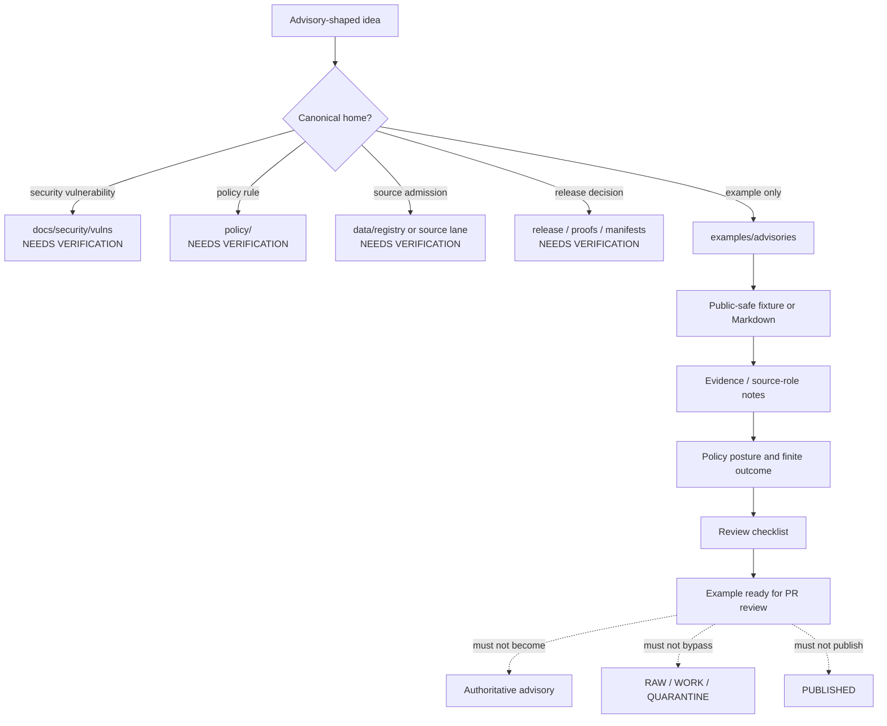

<!-- [KFM_META_BLOCK_V2]
doc_id: kfm://doc/NEEDS-VERIFICATION
title: Advisory Examples
type: standard
version: v1
status: draft
owners: OWNER_TBD
created: 2026-05-02
updated: 2026-05-02
policy_label: NEEDS_VERIFICATION__public_safe_examples
related: [../README.md, ../../README.md, ../../docs/security/vulns/README.md, ../../policy/README.md, ../../schemas/README.md, kfm://doc/NEEDS-VERIFICATION]
tags: [kfm, examples, advisories, evidence, policy, review, publication]
notes: [Target path supplied by user; path existence, owners, policy label, related links, downstream example inventory, and active validation commands remain NEEDS VERIFICATION until mounted repo inspection.]
[/KFM_META_BLOCK_V2] -->

# Advisory Examples

Public-safe, evidence-bounded advisory examples for demonstrating KFM review, policy, citation, and correction behavior without becoming an authoritative advisory registry.

> [!IMPORTANT]
> **Status:** experimental  
> **Owners:** `OWNER_TBD` — NEEDS VERIFICATION  
> **Path:** `examples/advisories/README.md` — user-specified; existence still NEEDS VERIFICATION  
> **Badges:**  
> 
> 
> 
> 
>   
> **Quick jumps:** [Scope](#scope) · [Repo fit](#repo-fit) · [Accepted inputs](#accepted-inputs) · [Exclusions](#exclusions) · [Directory tree](#directory-tree) · [How to add an advisory example](#how-to-add-an-advisory-example) · [Diagram](#diagram) · [Advisory example contract](#advisory-example-contract) · [Definition of done](#definition-of-done) · [FAQ](#faq) · [Verification backlog](#verification-backlog)

> [!NOTE]
> Current implementation depth is **UNKNOWN**. This README is written as a bounded, repo-useful directory guide. It does not prove that `examples/advisories/`, downstream examples, validators, workflows, or advisory fixtures already exist in the active checkout.

---

## Scope

`examples/advisories/` is for **illustrative advisory examples** that help maintainers and reviewers understand how KFM should express advisory-like material while preserving evidence, policy, review state, sensitivity handling, and rollback.

Use this directory for examples that demonstrate how an advisory-shaped document or fixture should behave when it is:

- evidence-bounded
- clearly labeled as an example
- linked to source roles or evidence references
- explicit about policy posture
- safe to inspect in a public or semi-public repository
- unable to publish unsupported claims as authoritative
- easy to withdraw, supersede, or correct

This directory is **not** the canonical home for security advisories, emergency alerts, source activation decisions, vulnerability lifecycle policy, or public release authority.

> [!WARNING]
> Advisory examples can look official if they are polished. Every file in this directory must remain visibly marked as **example**, **fixture**, **draft**, **PROPOSED**, or **NEEDS VERIFICATION** unless direct repo evidence and review state prove a stronger status.

[Back to top](#advisory-examples)

---

## Repo fit

| Relationship | Path | Status | Role |
| --- | --- | --- | --- |
| This directory | `examples/advisories/` | NEEDS VERIFICATION | Example-only advisory lane. |
| Parent examples index | [`../README.md`](../README.md) | NEEDS VERIFICATION | Should explain how advisory examples relate to other example packs. |
| Repo root | [`../../README.md`](../../README.md) | NEEDS VERIFICATION | Should carry project-wide orientation and trust posture. |
| Security advisory registry | [`../../docs/security/vulns/README.md`](../../docs/security/vulns/README.md) | NEEDS VERIFICATION | Canonical security advisory registry if present; this directory must not compete with it. |
| Policy authority | [`../../policy/README.md`](../../policy/README.md) | NEEDS VERIFICATION | Policy decisions, obligations, sensitivity, and deny/abstain behavior belong there. |
| Schema authority | [`../../schemas/README.md`](../../schemas/README.md) | NEEDS VERIFICATION | Machine-readable shapes belong there when examples depend on schemas. |
| Downstream example leaves | `./*/README.md` | PROPOSED | Individual advisory example packs should live below this directory if the repo confirms the pattern. |

### Repo-fit summary

| Question | Answer |
| --- | --- |
| What belongs here? | Small, public-safe advisory examples and fixtures that demonstrate evidence, policy, correction, and review behavior. |
| What does **not** belong here? | Real emergency alerts, canonical CVE records, vulnerability lifecycle policy, source registries, promotion decisions, or release authority. |
| What should stay linked instead of copied? | EvidenceBundles, policy decisions, release manifests, source descriptors, proof packs, and authoritative security or domain registries. |
| What is the safest posture? | Treat every advisory example as illustrative until review, validation, source rights, and release state prove otherwise. |

[Back to top](#advisory-examples)

---

## Accepted inputs

Only **explicit, bounded, reviewable, public-safe** material belongs in this directory.

| Input class | Examples | Why it belongs here |
| --- | --- | --- |
| Illustrative advisory Markdown | Synthetic or redacted examples showing how an advisory should explain evidence, impact, policy posture, and correction path. | Helps reviewers see the shape without activating an advisory as official truth. |
| Public-safe fixture payloads | Small JSON/YAML snippets for `DecisionEnvelope`, `RuntimeResponseEnvelope`, or Evidence Drawer behavior. | Demonstrates finite outcomes such as `ANSWER`, `ABSTAIN`, `DENY`, and `ERROR`. |
| Synthetic source-status examples | Mock freshness, availability, or drift notices with no live-source dependency. | Teaches source caution without turning examples into probes or monitors. |
| Policy outcome examples | ABSTAIN/DENY examples with reason codes, obligations, or redaction notes. | Makes negative states reviewable instead of silent. |
| Correction and withdrawal examples | Retired, superseded, or corrected advisory examples with replacement links. | Keeps correction lineage visible. |
| Reviewer checklists | Small checklists for evaluating an example before it is copied into another lane. | Prevents polished examples from becoming accidental authority. |

### Input rules

1. Mark example status visibly near the top of every file.
2. Prefer synthetic or redacted evidence over copied live records.
3. Link to authoritative homes instead of duplicating their content.
4. Include `NEEDS VERIFICATION` where source facts, rights, owners, or dates are not confirmed.
5. Keep advisory examples small enough for maintainers to inspect in a pull request.
6. Preserve `cite-or-abstain` behavior in every consequential claim.

[Back to top](#advisory-examples)

---

## Exclusions

| Does **not** belong here | Better home | Why |
| --- | --- | --- |
| Official KFM security advisories or CVE write-ups | `../../docs/security/vulns/` — NEEDS VERIFICATION | Security advisory authority should not live in example fixtures. |
| Emergency alerts or life-safety instructions | Official alerting systems and domain runbooks | KFM examples must not become an emergency alert system. |
| Source activation records | `../../data/registry/` or source registry lane — NEEDS VERIFICATION | Source admission requires rights, cadence, sensitivity, and policy gates. |
| Policy rules or obligations as authority | `../../policy/` — NEEDS VERIFICATION | Examples may illustrate policy outcomes, but policy owns the rule. |
| Machine schemas | `../../schemas/` or repo-confirmed schema home | Examples may reference schemas but must not become schema authority. |
| Promotion or release decisions | `../../release/`, `../../data/proofs/`, or repo-confirmed release lane | Publication is a governed state transition, not an example file. |
| Sensitive exact locations, living-person details, DNA, title, archaeological, ecological, or security-sensitive specifics | Restricted lane, quarantine, redacted derivative, or staged access | Public examples should fail closed or generalize. |
| Raw model output or generated summaries as evidence | Governed AI/runtime contract lanes | AI is interpretive; EvidenceBundle and policy outrank generated language. |

[Back to top](#advisory-examples)

---

## Directory tree

The following tree is **PROPOSED** until the mounted repository confirms local conventions.

```text
examples/advisories/
├── README.md
├── security/
│   └── README.md                         # PROPOSED: example-only security advisory shapes
├── source-status/
│   └── README.md                         # PROPOSED: freshness, drift, and availability examples
├── policy-outcomes/
│   └── README.md                         # PROPOSED: ABSTAIN / DENY / ERROR examples
├── correction-lineage/
│   └── README.md                         # PROPOSED: supersession, withdrawal, correction examples
└── archive/
    └── README.md                         # PROPOSED: retired examples, not retired official advisories
```

> [!NOTE]
> Do not create subdirectories only to make the tree look complete. Add a downstream example lane only when it has a clear teaching purpose, a reviewable fixture, and a non-authoritative boundary.

[Back to top](#advisory-examples)

---

## How to add an advisory example

1. **Choose the advisory class.** Decide whether the example teaches security advisory shape, source-status caution, policy outcome behavior, correction lineage, or domain-specific advisory framing.
2. **Confirm the authoritative home.** If the content belongs in `docs/security/vulns/`, a domain lane, a source registry, a policy file, or a release object, do not place it here except as a clearly marked example.
3. **Use synthetic or redacted evidence.** Avoid live sensitive records, exact sensitive locations, unreleased source material, or unresolved rights.
4. **State the finite outcome.** Use `ANSWER`, `ABSTAIN`, `DENY`, or `ERROR` where the example describes runtime or review behavior.
5. **Add source and policy posture.** Every consequential claim should show evidence support, source role, sensitivity posture, and review state.
6. **Add correction behavior.** Include how the example would be superseded, withdrawn, or corrected.
7. **Run repo-local checks.** `NEEDS VERIFICATION`: confirm the mounted repo’s Markdown, schema, policy, fixture, and workflow checks before merge.
8. **Update this README or the parent index.** Only add links that exist or are clearly labeled `PROPOSED`.

[Back to top](#advisory-examples)

---

## Diagram



[Back to top](#advisory-examples)

---

## Advisory example contract

Each advisory example should include the following minimum fields or visible sections. This is a **PROPOSED example contract**, not a confirmed machine schema.

| Field or section | Required? | Purpose |
| --- | ---: | --- |
| Example status | Yes | Prevents readers from mistaking the example for official advisory content. |
| Advisory class | Yes | Security, source-status, policy-outcome, domain advisory, correction, or other reviewed class. |
| Scope | Yes | Defines what the example does and does not cover. |
| Evidence references | Yes | Points to synthetic fixtures, public-safe references, or EvidenceBundle placeholders. |
| Source role | Yes | Distinguishes authoritative, contextual, aggregator, modeled, derived, or illustrative sources. |
| Policy posture | Yes | States `public-safe`, `restricted`, `redacted`, `generalized`, `ABSTAIN`, `DENY`, or other reviewed posture. |
| Review state | Yes | Marks draft, reviewed, superseded, withdrawn, or NEEDS VERIFICATION. |
| Release state | Yes | Usually `not_published_example`; never imply release without proof. |
| Correction path | Yes | Shows how the example is updated, superseded, withdrawn, or archived. |
| Owner | Yes, placeholder allowed | Use `OWNER_TBD` if not verified. |
| Validation notes | Yes | Lists checks required before copying the example into a stronger lane. |

### Illustrative front matter

```yaml
# PROPOSED example shape only. Not a confirmed KFM schema.
example_kind: advisory
example_status: illustrative_only
advisory_class: policy-outcome
title: "Example advisory title"
owner: OWNER_TBD
created: 2026-05-02
updated: 2026-05-02
evidence_refs:
  - kfm://evidence/NEEDS-VERIFICATION
source_role: illustrative_fixture
policy_posture: public_safe_example
runtime_outcome: ABSTAIN
release_state: not_published_example
correction_path: "./archive/NEEDS-VERIFICATION.md"
notes:
  - "Do not treat this example as an official advisory."
  - "Replace placeholders only after mounted repo verification."
```

[Back to top](#advisory-examples)

---

## Advisory classes

| Class | Good example use | Required caution |
| --- | --- | --- |
| Security advisory shape | Demonstrate how a CVE-like note should link evidence, SBOM context, and review obligations. | Do not replace the canonical security vulnerability registry. |
| Source-status advisory | Demonstrate stale, unreachable, changed, or drifting source behavior. | Do not become a source monitor or source admission record. |
| Policy-outcome advisory | Demonstrate why KFM abstains, denies, redacts, or generalizes. | Do not define policy rules here. |
| Domain advisory | Demonstrate hazard, hydrology, ecology, archaeology, or infrastructure caution language. | Do not provide emergency instructions, legal/title conclusions, or exact sensitive locations. |
| Correction advisory | Demonstrate supersession, withdrawal, or correction lineage. | Do not mutate published state without release and rollback evidence. |
| AI-response advisory | Demonstrate bounded answer/abstain/deny/error behavior. | Do not treat generated text as evidence or persist hidden chain-of-thought. |

[Back to top](#advisory-examples)

---

## Definition of done

Use this checklist before adding or revising an advisory example.

- [ ] The file is visibly labeled as an example, fixture, draft, or `NEEDS VERIFICATION`.
- [ ] The example does not claim to be an official KFM advisory, release, alert, or policy decision.
- [ ] The authoritative home is identified or marked `NEEDS VERIFICATION`.
- [ ] Evidence references are public-safe, synthetic, redacted, or clearly placeholdered.
- [ ] Source role is stated and not inflated.
- [ ] Policy posture is stated.
- [ ] Review state is stated.
- [ ] Release state is stated and does not imply publication.
- [ ] Sensitive exact locations, living-person details, DNA, land/title conclusions, cultural heritage details, or exploitable security specifics are omitted, generalized, or restricted.
- [ ] Advisory text does not provide emergency instructions or claim life-safety authority.
- [ ] AI-generated or AI-assisted text is subordinate to evidence and review.
- [ ] Correction, withdrawal, or supersession behavior is documented.
- [ ] Relative links are verified from `examples/advisories/` or marked `NEEDS VERIFICATION`.
- [ ] Any schema, policy, workflow, validator, or package-manager command is repo-confirmed or clearly marked `NEEDS VERIFICATION`.
- [ ] Parent indexes are updated only when downstream files actually exist.
- [ ] Rollback is simple: revert the example file and remove any index links.

[Back to top](#advisory-examples)

---

## Review questions

Before approving an advisory example, ask:

1. Would a reader mistake this for an official advisory?
2. Does any claim outrun the evidence shown?
3. Does the example duplicate a stronger authority surface?
4. Are ABSTAIN, DENY, ERROR, redaction, or generalization handled visibly?
5. Is the example safe for public repository inspection?
6. Can the example be removed without changing canonical truth?
7. Does the example help future implementation, testing, review, or correction?

[Back to top](#advisory-examples)

---

## Rollback

Rollback is required if an advisory example:

- appears official without review state
- links to sensitive or unpublished evidence
- bypasses policy, rights, or source-role checks
- duplicates canonical security, policy, source, or release authority
- implies emergency, legal, medical, financial, title, archaeological, ecological, or security readiness without support
- contains live operational facts that have become stale or unverified

Rollback target: revert the example file, remove parent index links, and add a correction note if the example was already referenced elsewhere.

[Back to top](#advisory-examples)

---

## FAQ

### Is this the place for real security advisories?

No. This directory is for examples. Real KFM security advisories should live in the repo-confirmed security advisory registry, if present, or another explicitly governed security lane.

### Can an example use a real CVE?

Only as a clearly marked illustrative reference, and only if the example does not become a substitute for the authoritative CVE source or KFM’s official security advisory registry.

### Can an advisory example cite live source status?

Use caution. Live source facts can become stale. Prefer synthetic fixtures unless the example states retrieval date, source role, freshness limits, and verification needs.

### Can this directory include hazard or emergency examples?

Only as non-operational, non-life-safety examples. KFM advisory examples must not replace official alerting systems or emergency guidance.

### Can generated language be included?

Yes, if it is labeled as illustrative and evidence-subordinate. Generated text is not evidence, not policy, and not review approval.

[Back to top](#advisory-examples)

---

## Verification backlog

- [ ] Confirm `examples/advisories/` exists or create it through repo-approved documentation flow.
- [ ] Confirm owner or CODEOWNERS coverage.
- [ ] Confirm whether `examples/README.md` exists and should link here.
- [ ] Confirm whether `docs/security/vulns/README.md` exists and is the canonical KFM security advisory registry.
- [ ] Confirm schema home for any advisory example payloads.
- [ ] Confirm policy home for ABSTAIN/DENY/ERROR reason-code examples.
- [ ] Confirm whether existing example fixtures already use a different naming pattern.
- [ ] Confirm Markdown lint, metadata, and link-check commands.
- [ ] Confirm whether this README should be listed in a documentation registry.
- [ ] Confirm whether advisory example archives should exist or whether retired examples should simply be removed.

[Back to top](#advisory-examples)
