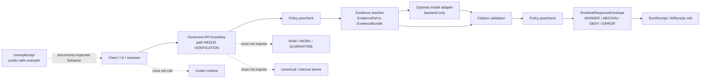

<!-- [KFM_META_BLOCK_V2]
doc_id: kfm://doc/NEEDS-VERIFICATION__examples_api_readme
title: API Examples
type: standard
version: v1
status: draft
owners: TODO(owner): confirm examples/API documentation owner and security steward
created: TODO(date): confirm commit/authoring date
updated: TODO(date): confirm commit/update date
policy_label: public
related: [TODO-VERIFY:../README.md, TODO-VERIFY:../../README.md, TODO-VERIFY:../../apps/governed-api/README.md, TODO-VERIFY:../../apps/api/README.md, TODO-VERIFY:../../contracts/README.md, TODO-VERIFY:../../schemas/contracts/README.md, TODO-VERIFY:../../policy/README.md, TODO-VERIFY:../../tests/README.md, TODO-VERIFY:../../docs/adr/README.md]
tags: [kfm, examples, api, governed-api, evidence, policy, runtime-envelope]
notes: [Target path supplied by request; current local checkout was not available during authoring; examples must remain public-safe and non-normative; confirm links and owners before commit.]
[/KFM_META_BLOCK_V2] -->

# API Examples

Public-safe request and response examples for KFM governed API flows.

<p>
  
  
  
  
  
</p>

> [!IMPORTANT]
> **Impact block**
>
> | Field | Value |
> |---|---|
> | Status | `experimental` until the checked-out branch confirms this path, adjacent links, example inventory, route names, and validation hooks |
> | Owners | `TODO(owner): confirm examples/API documentation owner and security steward` |
> | Target path | `examples/api/README.md` |
> | Boundary posture | Examples must document governed API behavior, not bypass it |
> | Truth posture | CONFIRMED KFM doctrine / PROPOSED example layout / UNKNOWN current repo implementation depth |
> | Public-safety posture | Public-safe synthetic or released examples only; no secrets, restricted records, exact sensitive locations, or unpublished evidence |
>
> **Quick jumps:** [Scope](#scope) · [Repo fit](#repo-fit) · [Accepted inputs](#accepted-inputs) · [Exclusions](#exclusions) · [Directory tree](#directory-tree) · [Quickstart](#quickstart) · [Usage](#usage) · [Flow diagram](#flow-diagram) · [Example standards](#example-standards) · [Validation checklist](#validation-checklist) · [Rollback](#rollback) · [FAQ](#faq)

---

## Scope

This directory is for **API example material** that helps maintainers, reviewers, and client developers understand how KFM governed API flows should look at the boundary.

The examples here are **not** the authority for schemas, policy, evidence, publication, or runtime behavior. They are readable demonstration surfaces that should point back to contracts, schemas, policy, tests, fixtures, release manifests, and runbooks.

Use this directory to show:

- how a client should ask a governed API question;
- how an example response should carry evidence, policy, review, release, and correction state;
- how finite outcomes such as `ANSWER`, `ABSTAIN`, `DENY`, and `ERROR` should be represented for humans reviewing examples;
- how examples stay downstream of `EvidenceRef → EvidenceBundle` resolution;
- how public-safe examples avoid raw, unpublished, sensitive, or rights-uncertain material.

> [!NOTE]
> Current implementation depth is **UNKNOWN** in this authoring pass because the local repository checkout, route files, tests, workflows, dashboards, logs, and emitted proof objects were not available. Keep route names and validator commands marked **NEEDS VERIFICATION** until checked in the real branch.

<p align="right"><a href="#api-examples">Back to top ↑</a></p>

---

## Repo fit

### Target path

`examples/api/README.md`

### Upstream surfaces

| Surface | Expected role | Link posture |
|---|---|---|
| Repository root | Project orientation and trust membrane | [`../../README.md`](../../README.md) — NEEDS VERIFICATION |
| Examples root | Parent examples index | [`../README.md`](../README.md) — NEEDS VERIFICATION |
| Governed API runtime | Boundary implementation or runtime-facing README | [`../../apps/governed-api/README.md`](../../apps/governed-api/README.md) — NEEDS VERIFICATION |
| API implementation | Adjacent API implementation surface, if separate | [`../../apps/api/README.md`](../../apps/api/README.md) — NEEDS VERIFICATION |
| Contracts | Human-readable contract and object-family docs | [`../../contracts/README.md`](../../contracts/README.md) — NEEDS VERIFICATION |
| Machine schemas | Versioned machine-readable contracts | [`../../schemas/contracts/README.md`](../../schemas/contracts/README.md) — NEEDS VERIFICATION |
| Policy | Deny/abstain/allow/review behavior | [`../../policy/README.md`](../../policy/README.md) — NEEDS VERIFICATION |
| Tests | Fixtures and executable expectations | [`../../tests/README.md`](../../tests/README.md) — NEEDS VERIFICATION |
| ADRs | Path, schema-home, API-boundary, and trust-boundary decisions | [`../../docs/adr/README.md`](../../docs/adr/README.md) — NEEDS VERIFICATION |

### Downstream consumers

| Consumer | How this directory helps | Boundary |
|---|---|---|
| API maintainers | Provides readable payload examples and negative-state examples | Does not replace route tests |
| UI maintainers | Shows envelope and drawer payload expectations | Does not call raw stores or model runtimes |
| Policy reviewers | Shows examples of `ABSTAIN`, `DENY`, obligations, reasons, and audit refs | Does not define policy |
| Documentation authors | Reuses examples in runbooks and guides | Must keep examples synced with schemas |
| Test authors | Can mirror example intent in fixtures | Normative fixtures belong under `tests/fixtures/`, not here |

<p align="right"><a href="#api-examples">Back to top ↑</a></p>

---

## Accepted inputs

Add only public-safe, reviewable, non-normative example material.

| Input type | Belongs here when… | Preferred naming |
|---|---|---|
| Request examples | They show a governed API request without secrets, credentials, unpublished source IDs, or sensitive geometry | `<surface>/<intent>.request.example.json` |
| Response examples | They show finite, evidence-aware outcomes and audit refs | `<surface>/<intent>.<outcome>.response.example.json` |
| HTTP examples | They use placeholder hosts and no real tokens | `<surface>/<intent>.example.http` |
| cURL snippets | They are documented examples, not live credentials or production commands | `<surface>/<intent>.curl.md` |
| Negative-state examples | They demonstrate `ABSTAIN`, `DENY`, or `ERROR` without exposing restricted details | `negative-states/<reason>.response.example.json` |
| Evidence-resolution examples | They show example `EvidenceRef` and `EvidenceBundle` linkage using synthetic or released refs | `evidence-resolution/<intent>.example.json` |
| Export examples | They show governed export request/response envelopes with rights and sensitivity state | `exports/<intent>.example.json` |
| Review notes | They explain why an example is safe, bounded, or intentionally negative | `<surface>/README.md` |

Every example should answer three review questions:

1. What governed API behavior does this demonstrate?
2. Which schema, contract, policy, test, or runbook should be checked before treating it as valid?
3. What does the example intentionally **not** prove?

<p align="right"><a href="#api-examples">Back to top ↑</a></p>

---

## Exclusions

The examples directory must not become a shortcut around the trust membrane.

| Do not put here | Where it belongs instead | Reason |
|---|---|---|
| Raw source records | `data/raw/` or source-specific intake docs | Raw source material is not public example material |
| `WORK` or `QUARANTINE` payloads | `data/work/`, `data/quarantine/`, or review-only fixtures | Public examples must not normalize unpublished candidate state |
| Canonical/internal store queries | Internal packages, migrations, or implementation docs | Examples must not teach direct public access to canonical truth |
| Production tokens, API keys, cookies, secrets, session IDs | Never in repo; use secret managers or environment docs | Prevent credential leakage |
| Live endpoint credentials or real private URLs | Environment/runbook docs with redaction | Avoid unsafe copy/paste behavior |
| Direct browser-to-model-runtime calls | Governed API and model-adapter docs | AI is evidence-subordinate and backend-mediated |
| Exact sensitive locations | Redacted/generalized examples or restricted review bundles | Prevent ecological, archaeological, cultural, security, or privacy harm |
| Rights-uncertain source excerpts | Source registry or quarantine notes | Public reuse must be rights-aware |
| Normative JSON Schemas | `schemas/contracts/` | Examples are not schema authority |
| Validator pass/fail fixtures | `tests/fixtures/` | Tests own executable truth |
| Release manifests, receipts, proof packs | `data/receipts/`, `data/proofs/`, `release/`, or catalog homes | Emitted proof objects are separate object families |
| OpenAPI source of truth | Contract/API docs or generated API spec location | This README does not define API routes |

> [!CAUTION]
> Do not add examples that teach clients to read `RAW`, `WORK`, `QUARANTINE`, canonical stores, graph internals, vector indexes, object stores, or model runtimes directly. Public and normal client examples must cross governed interfaces.

<p align="right"><a href="#api-examples">Back to top ↑</a></p>

---

## Directory tree

The tree below is **PROPOSED** until the checked-out branch confirms the actual `examples/api/` inventory.

```text
examples/api/
├── README.md
├── focus-query/
│   ├── README.md
│   ├── hydrology.answer.request.example.json
│   ├── hydrology.answer.response.example.json
│   ├── hydrology.abstain.response.example.json
│   └── policy-denied.response.example.json
├── evidence-resolution/
│   ├── README.md
│   ├── evidence-ref.example.json
│   └── evidence-bundle-summary.example.json
├── runtime-envelopes/
│   ├── README.md
│   ├── answer.response.example.json
│   ├── abstain.response.example.json
│   ├── deny.response.example.json
│   └── error.response.example.json
├── evidence-drawer/
│   ├── README.md
│   └── drawer-payload.example.json
├── exports/
│   ├── README.md
│   └── governed-export-request.example.json
└── negative-states/
    ├── README.md
    ├── evidence-missing.response.example.json
    ├── restricted.response.example.json
    ├── stale.response.example.json
    ├── citation-invalid.response.example.json
    └── policy-engine-unavailable.response.example.json
```

Small directories are preferable to one large pile of payloads. Each subdirectory should have its own README when the examples need local caveats.

<p align="right"><a href="#api-examples">Back to top ↑</a></p>

---

## Quickstart

### 1. Inspect this example directory

Run from the repository root.

```bash
find examples/api -maxdepth 3 -type f 2>/dev/null | sort
```

### 2. Inspect nearby contract and policy surfaces

```bash
find contracts schemas policy tests -maxdepth 4 -type f 2>/dev/null \
  | grep -E 'EvidenceBundle|EvidenceRef|DecisionEnvelope|RuntimeResponseEnvelope|Focus|focus|evidence|runtime|policy|release|correction|drawer' \
  || true
```

### 3. Look for unsafe example content

```bash
grep -RInE \
  'api[_-]?key|secret|token|password|cookie|Authorization:|RAW|WORK|QUARANTINE|localhost:11434|ollama|openai|model_runtime|vector_store|graph_store|object_store' \
  examples/api 2>/dev/null || true
```

A clean grep result is not proof of safety. It is only a first-pass warning check.

### 4. Validate examples with repo-native tooling

```bash
# NEEDS VERIFICATION: adapt command to the checked-out branch's validator.
python tools/validators/schema_validate.py --root . --examples examples/api
```

### 5. Run policy and contract tests

```bash
# NEEDS VERIFICATION: use the repo's actual test runner and policy tooling.
pytest tests/contracts tests/policy -q
```

> [!NOTE]
> Commands above are discovery and validation aids. They do not prove runtime enforcement, public-release readiness, deployment safety, or branch-protection status without CI logs and reviewer evidence.

<p align="right"><a href="#api-examples">Back to top ↑</a></p>

---

## Usage

### Add a new API example

1. Start from the governed behavior being demonstrated, not the route name.
2. Confirm the example is public-safe, synthetic, or tied to a released public artifact.
3. Put normative schema definitions in `schemas/contracts/`, not in this directory.
4. Add or update a companion test fixture under `tests/fixtures/` when the example should become executable.
5. Include one positive path and at least one relevant negative path when the behavior is consequential.
6. Keep evidence, policy, review, release, correction, and audit refs visible in the response shape.
7. Update this README when a new example family is added.

### Naming convention

Use stable, searchable names:

```text
<surface>/<domain-or-topic>.<outcome>.<request|response>.example.json
```

Examples:

```text
focus-query/hydrology.answer.request.example.json
focus-query/hydrology.answer.response.example.json
focus-query/hydrology.abstain.response.example.json
negative-states/policy-engine-unavailable.response.example.json
```

### Outcome words

Use the finite public runtime outcomes consistently:

| Outcome | Meaning in examples |
|---|---|
| `ANSWER` | The example has enough released, policy-safe support to answer within scope |
| `ABSTAIN` | Support is insufficient, stale, unresolved, or citation-incomplete |
| `DENY` | Policy, sensitivity, rights, source-role, or access constraints block release |
| `ERROR` | A system or validation failure occurred and must be inspectable |

Gate or promotion examples may use separate gate outcomes such as `PASS`, `HOLD`, `DENY`, or `ERROR`, but runtime examples should not blur those two vocabularies.

<p align="right"><a href="#api-examples">Back to top ↑</a></p>

---

## Flow diagram



The diagram is intentionally about **boundaries**, not exact route names. Route names remain **NEEDS VERIFICATION** until the checked-out branch proves them.

<p align="right"><a href="#api-examples">Back to top ↑</a></p>

---

## Example standards

### Minimum fields to preserve in response examples

Response examples should keep these trust surfaces visible, even when the exact schema field names are later adjusted.

| Surface | Why it matters |
|---|---|
| Outcome | Prevents fluent prose from hiding `ABSTAIN`, `DENY`, or `ERROR` |
| Scope | Shows spatial, temporal, domain, and audience bounds |
| Evidence refs | Keeps answers tied to released support |
| Decision or policy state | Shows why release was allowed, narrowed, denied, or deferred |
| Review state | Prevents unreviewed examples from appearing authoritative |
| Rights and sensitivity state | Keeps publication posture visible |
| Freshness and valid time | Prevents stale or out-of-scope evidence from being treated as current |
| Citation validation | Shows whether claims are supported by example evidence |
| Audit refs | Connects runtime examples to receipts where applicable |
| Correction or supersession refs | Keeps post-publication lineage visible |

### Illustrative response shape

The following is **illustrative**, not a normative schema. Confirm exact fields against the current `RuntimeResponseEnvelope`, `DecisionEnvelope`, and related schemas before copying it into tests.

```json
{
  "outcome": "ANSWER",
  "scope": {
    "domain": "hydrology",
    "place": "PUBLIC_SAFE_PLACEHOLDER",
    "valid_time": "PUBLIC_SAFE_VALID_TIME_PLACEHOLDER",
    "audience": "public"
  },
  "claim": {
    "text": "Illustrative public-safe claim text goes here.",
    "confidence": "bounded",
    "limitations": [
      "Example payload only.",
      "Confirm current schema and source support before reuse."
    ]
  },
  "evidence_refs": [
    {
      "ref": "kfm://evidence/EXAMPLE-ONLY",
      "role": "supporting",
      "release_state": "published",
      "sensitivity": "public"
    }
  ],
  "decision": {
    "outcome": "allow",
    "reason_codes": ["EXAMPLE_PUBLIC_SAFE"],
    "obligations": ["cite_support", "show_limitations"]
  },
  "citation_validation": {
    "status": "passed_example_only",
    "unsupported_claims": []
  },
  "audit_refs": {
    "run_receipt": "kfm://receipt/EXAMPLE-ONLY",
    "ai_receipt": "kfm://receipt/EXAMPLE-ONLY-AI"
  }
}
```

### Negative examples are first-class

Negative examples are not failures of documentation. They teach KFM’s trust posture.

| Negative state | Use when |
|---|---|
| `evidence_missing` | No released EvidenceBundle can support the requested claim |
| `restricted` | Evidence exists but cannot be shown to this audience |
| `stale` | Evidence is outside freshness expectations |
| `conflicted` | Sources disagree and the example must not smooth over the conflict |
| `citation_invalid` | Output language is not fully supported by cited evidence |
| `policy_denied` | Policy blocks the response |
| `policy_engine_unavailable` | The safe behavior is fail-closed |
| `invalid_payload` | The request or response shape is malformed |

<p align="right"><a href="#api-examples">Back to top ↑</a></p>

---

## Review checklist

Before adding, changing, or deleting an API example, confirm:

- [ ] The example does not include secrets, credentials, tokens, cookies, private URLs, or internal handles.
- [ ] The example does not expose `RAW`, `WORK`, `QUARANTINE`, unpublished candidates, or canonical/internal stores.
- [ ] The example uses public-safe, synthetic, redacted, generalized, or released evidence references.
- [ ] The example has a finite outcome: `ANSWER`, `ABSTAIN`, `DENY`, or `ERROR`.
- [ ] The example keeps evidence, policy, review, release, rights, sensitivity, freshness, and correction posture visible where relevant.
- [ ] Normative schema changes are made in the schema/contract home, not here.
- [ ] Executable pass/fail expectations are mirrored in `tests/fixtures/` when the example is meant to be enforceable.
- [ ] The example does not teach direct browser, UI, or client calls to model runtimes.
- [ ] Any route name, DTO name, package manager, validator, or workflow reference has been verified in the checked-out branch or marked `NEEDS VERIFICATION`.
- [ ] A negative-state example exists for consequential behavior.
- [ ] Links in this README resolve from `examples/api/`.

<p align="right"><a href="#api-examples">Back to top ↑</a></p>

---

## Validation checklist

Use this checklist during PR review.

| Check | Required result | Status |
|---|---|---|
| Path check | `examples/api/` exists in the checked-out branch | NEEDS VERIFICATION |
| Link check | Relative links resolve from this README | NEEDS VERIFICATION |
| Secret scan | No credentials or sensitive operational details | REQUIRED |
| Trust scan | No raw/work/quarantine/canonical bypass examples | REQUIRED |
| Schema alignment | Examples match current contracts or are labeled illustrative | NEEDS VERIFICATION |
| Policy alignment | Negative states match policy reason/obligation vocabulary | NEEDS VERIFICATION |
| Fixture alignment | Normative examples have companion fixtures/tests | NEEDS VERIFICATION |
| Runtime alignment | Route names and DTOs match implementation | NEEDS VERIFICATION |
| Public-safety review | No exact sensitive location or rights-uncertain payloads | REQUIRED |
| Rollback readiness | PR can revert examples without deleting proof objects | REQUIRED |

<p align="right"><a href="#api-examples">Back to top ↑</a></p>

---

## Maintenance rules

### Keep examples boring in the right way

Examples should be readable, small, and intentionally bounded. They should not become clever substitutes for schemas, validators, release manifests, or route tests.

### Keep example status visible

Use labels in filenames, README text, or payload notes when an example is:

| Label | Meaning |
|---|---|
| `illustrative` | Helpful shape, not executable contract |
| `schema-aligned` | Checked against current schema |
| `fixture-backed` | Mirrored by tests/fixtures |
| `released-artifact-backed` | Tied to public released support |
| `negative-state` | Intentionally demonstrates abstain/deny/error behavior |
| `deprecated` | Retained for lineage but superseded |
| `NEEDS VERIFICATION` | Cannot be trusted until branch evidence confirms it |

### Do not silently upgrade examples

An example should not move from illustrative to normative by tone. It becomes enforceable only when schemas, fixtures, policy, tests, and review records support that status.

<p align="right"><a href="#api-examples">Back to top ↑</a></p>

---

## Rollback

Rollback is required when an example weakens source integrity, leaks sensitive material, implies unsafe access, conflicts with current schemas, teaches a direct model/runtime bypass, or publishes unsupported claims as authoritative.

Rollback targets:

| Change type | Rollback action |
|---|---|
| README-only change | Revert the README PR |
| Unsafe example payload | Remove or redact payload, then add a correction note if already referenced |
| Schema-drifted example | Downgrade to `illustrative` or update after schema review |
| Route-name mismatch | Mark `NEEDS VERIFICATION` or remove route-specific wording |
| Sensitive or rights-uncertain material | Remove immediately; preserve review record outside public examples |
| Published downstream reference | Add correction/supersession note and update downstream docs |

Rollback must not delete receipts, proofs, release manifests, correction notices, or review records that are needed to preserve auditability.

<p align="right"><a href="#api-examples">Back to top ↑</a></p>

---

## FAQ

### Are these examples authoritative?

No. Examples are teaching and review aids. Schemas, contracts, policy, tests, release manifests, receipts, proofs, and reviewed implementation evidence carry authority.

### Can an example include a real API endpoint?

Use placeholder hosts unless the endpoint is confirmed public-safe and documented for examples. Do not include credentials or private deployment details.

### Can this directory contain OpenAPI?

Only small explanatory excerpts, if clearly labeled. The OpenAPI or API contract source of truth belongs in the repo’s contract/API surface, not in `examples/api/`.

### Can examples include model output?

Only as governed backend-mediated examples that return finite envelopes and citation-validation state. Do not include direct model-runtime calls or raw provider output as truth.

### Where do pass/fail payloads go?

Executable pass/fail fixtures belong under `tests/fixtures/` or the repo’s confirmed fixture home. This directory may link to them after path verification.

### Which API boundary is canonical?

UNKNOWN from this authoring pass. Prior KFM materials point to an API doc/runtime split that requires branch verification. Keep both `apps/governed-api/` and `apps/api/` references marked `NEEDS VERIFICATION` until an ADR or current repo evidence resolves the boundary.

<p align="right"><a href="#api-examples">Back to top ↑</a></p>
