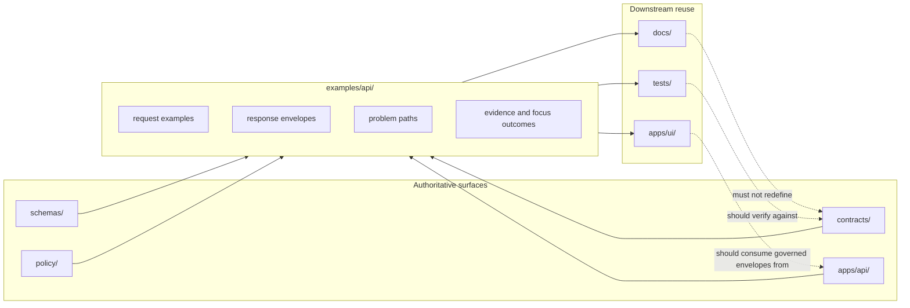

<!-- [KFM_META_BLOCK_V2]
doc_id: kfm://doc/TODO-UUID
title: API Examples
type: standard
version: v1
status: review
owners: TODO-OWNERS
created: TODO-YYYY-MM-DD
updated: TODO-YYYY-MM-DD
policy_label: TODO-POLICY-LABEL
related: [../../contracts/README.md, ../../schemas/README.md, ../../policy/README.md, ../../apps/api/, ../../tests/]
tags: [kfm, api, examples]
notes: [Placeholder values retained where current repo evidence did not confirm doc_id, owners, dates, policy label, or neighboring path existence. Baseline KFM vocabulary and path references were preserved; route examples and starter tree remain illustrative until repository verification.]
[/KFM_META_BLOCK_V2] -->

# API Examples

Governed request/response examples for the KFM API boundary, kept subordinate to contracts, policy, runtime behavior, and tests.


**Status:** experimental  
**Owners:** NEEDS VERIFICATION  
**Path:** `examples/api/`  
**Quick jump:** [Scope](#scope) · [Repo fit](#repo-fit) · [Inputs](#inputs) · [Exclusions](#exclusions) · [Directory tree](#directory-tree) · [Quickstart](#quickstart) · [Usage](#usage) · [Diagram](#diagram) · [Reference matrix](#reference-matrix) · [Definition of done](#definition-of-done) · [FAQ](#faq) · [Appendix](#appendix)

> [!IMPORTANT]
> This directory is for **example API boundary artifacts**: request bodies, response envelopes, error/problem examples, evidence-resolution examples, and other contract-aligned payloads that demonstrate how KFM should behave at the governed API edge.
>
> It is **not** the source of truth for schemas, policies, runtime code, or canonical data.

> [!NOTE]
> This draft preserves the baseline KFM vocabulary present in current evidence, including `EvidenceRef`, `Focus Mode`, STAC-shaped queries, and story-facing payloads. Folder names, route families, ownership metadata, and starter filenames should be treated as **NEEDS VERIFICATION** until the repository sources are directly available.

---

## Scope

This directory should make the KFM API membrane easier to understand, review, test, and document.

In practice, that means keeping **small, policy-safe, human-readable examples** of outward-facing API behavior close at hand: dataset listings, STAC-shaped queries, `EvidenceRef` resolution, Focus Mode envelopes, story-facing payloads, pagination, auth failures, denial paths, and citation-safe examples that downstream docs and tests can reuse without becoming a second source of truth.

Examples here should help answer questions like these:

- What does a contract-compliant request look like?
- What does a successful response envelope look like?
- What does an abstention, denial, or validation failure look like?
- Which fields must remain visible for trust, review, and evidence drill-through?
- How should examples stay aligned with contract and policy changes?

[Back to top](#api-examples)

## Repo fit

**Path:** `examples/api/`

This folder belongs in the repo’s example or sample surface. It should complement, not replace, the authoritative KFM layers that define and enforce API behavior.

### Upstream dependencies

- [`../../contracts/README.md`](../../contracts/README.md) — contract intent and API source-of-truth guidance
- [`../../schemas/README.md`](../../schemas/README.md) — machine-checkable shape definitions
- [`../../policy/README.md`](../../policy/README.md) — deny-by-default and policy vocabulary surfaces
- [`../../apps/api/`](../../apps/api/) — governed API implementation boundary

### Downstream consumers

- [`../../docs/`](../../docs/) — human-facing docs and runbooks
- [`../../tests/`](../../tests/) — executable fixtures, contract tests, regression suites
- [`../../apps/ui/`](../../apps/ui/) — steward or public UI surfaces that should consume governed envelopes instead of inventing their own

### Why it exists

KFM separates:

- **authoritative contracts and policies**
- **runtime implementation**
- **illustrative examples**

That separation keeps examples useful without letting them quietly become sovereign truth.

### Verification status

| Surface | Status | Current basis |
|---|---|---|
| Directory role as a governed API example surface | **CONFIRMED** | Present in the baseline document body |
| Path `examples/api/` and the related upstream/downstream references | **NEEDS VERIFICATION** | Preserved from the baseline document; repo tree not directly verified here |
| Example families (`datasets`, `stac`, `evidence`, `focus`, `story`, `shared`) | **INFERRED** | Supported by baseline terminology and the proposed starter layout |
| Route families shown in Quickstart (`/api/v1/...`) | **PROPOSED / ILLUSTRATIVE** | Useful for discussion, not evidence of live runtime inventory |
| Metadata values in the KFM block (`doc_id`, owners, dates, policy label) | **UNKNOWN** | No repo evidence confirmed these values |

[Back to top](#api-examples)

## Inputs

Accepted inputs for this directory include:

- redacted request examples for governed routes
- redacted response examples for governed routes
- example problem or error payloads
- evidence-resolution request/response pairs
- Focus Mode outcome examples (`answer`, `abstain`, `deny`, `error`)
- pagination and filter examples
- auth/header shape examples with non-secret placeholder values
- story- and dossier-facing payload examples that remain API-boundary artifacts
- tiny, deterministic fixture-like examples used by docs or tests

A good example in this directory is:

- contract-aligned
- policy-safe
- small enough to review in Git
- stable enough to diff
- paired with the route or envelope it demonstrates

[Back to top](#api-examples)

## Exclusions

The following do **not** belong here:

- canonical schemas or the schema registry
- policy bundles or policy tests as the source of truth
- runtime implementation code
- direct-storage examples that bypass the governed API
- raw or unpublished truth-path artifacts presented as public examples
- real access tokens, credentials, secrets, cookies, or signed headers
- copied production logs or environment-specific manifests
- stale example payloads that no longer match the current contract
- duplicated source-of-truth docs that already belong in `contracts/`, `schemas/`, `policy/`, or `apps/api/`

**Put it elsewhere instead**

| Artifact | Keep it here? | Put it in |
|---|---:|---|
| OpenAPI / JSON Schema source of truth | No | `../../contracts/`, `../../schemas/` |
| Policy bundles / rule tests | No | `../../policy/` |
| Governed route implementation | No | `../../apps/api/` |
| Executable fixtures tied to merge gates | Usually no | `../../tests/` |
| Redacted request/response examples for docs and reviews | Yes | `examples/api/` |
| Canonical raw/work/processed/catalog artifacts | No | truth-path storage areas |
| Secrets / live credentials | Never | nowhere in Git |

[Back to top](#api-examples)

## Directory tree

> [!NOTE]
> **PROPOSED starter layout** below. Confirm the actual mounted contents of `examples/api/` before treating any listed subdirectory or filename as existing.

```text
examples/api/
├── README.md
├── datasets/
│   ├── list.request.http
│   ├── list.response.json
│   └── list.denied.problem.json
├── stac/
│   ├── collections.response.json
│   ├── items.filtered.request.http
│   └── items.filtered.response.json
├── evidence/
│   ├── resolve.request.json
│   ├── resolve.response.json
│   └── resolve.denied.problem.json
├── focus/
│   ├── ask.request.json
│   ├── ask.answer.response.json
│   ├── ask.abstain.response.json
│   ├── ask.deny.response.json
│   └── ask.error.problem.json
├── story/
│   ├── create.request.json
│   ├── read.response.json
│   └── review_required.problem.json
├── shared/
│   ├── headers.example.txt
│   ├── pagination.example.json
│   └── audit_ref.example.json
└── _index/
    └── manifest.md
```

**Starter layout intent**

- `datasets/` keeps dataset-listing examples and policy-filtered response shapes.
- `stac/` keeps search, collection, and item examples that stay at the API boundary.
- `evidence/` keeps `EvidenceRef -> EvidenceBundle` illustrations.
- `focus/` keeps finite Focus Mode outcome examples.
- `story/` keeps story-facing route examples, not the narrative artifacts themselves.
- `shared/` keeps reusable boundary examples such as headers and pagination.
- `_index/manifest.md` can provide a compact human index if this folder grows.

[Back to top](#api-examples)

## Quickstart

> [!IMPORTANT]
> The route families below are **illustrative and contract-aligned**, not evidence that the mounted API currently exposes these exact endpoints. Verify the live route inventory in contracts, schemas, and `apps/api/` before treating any example as executable.

Set a base URL and token placeholder:

```bash
export KFM_BASE_URL="http://localhost:8000"
export KFM_TOKEN="REPLACE_ME"
```

List datasets:

```bash
# ILLUSTRATIVE route family — verify actual path names before use
curl -sS \
  -H "Authorization: Bearer ${KFM_TOKEN}" \
  "${KFM_BASE_URL}/api/v1/datasets"
```

Query STAC collections:

```bash
# ILLUSTRATIVE route family — verify actual path names before use
curl -sS \
  -H "Authorization: Bearer ${KFM_TOKEN}" \
  "${KFM_BASE_URL}/api/v1/stac/collections"
```

Resolve evidence from a saved example body:

```bash
# ILLUSTRATIVE route family — verify actual path names before use
curl -sS -X POST \
  -H "Authorization: Bearer ${KFM_TOKEN}" \
  -H "Content-Type: application/json" \
  "${KFM_BASE_URL}/api/v1/evidence/resolve" \
  --data @examples/api/evidence/resolve.request.json
```

Submit a Focus Mode request from a saved example body:

```bash
# ILLUSTRATIVE route family — verify actual path names before use
curl -sS -X POST \
  -H "Authorization: Bearer ${KFM_TOKEN}" \
  -H "Content-Type: application/json" \
  "${KFM_BASE_URL}/api/v1/focus/ask" \
  --data @examples/api/focus/ask.request.json
```

Inspect a local example without running the API:

```bash
jq . examples/api/focus/ask.abstain.response.json
```

[Back to top](#api-examples)

## Usage

### 1. Author from the contract, not from memory

Start with the current source-of-truth contract or schema. Then write the smallest example that demonstrates the boundary behavior clearly.

### 2. Pair success with failure

Where a route matters, keep both:

- a successful example
- at least one meaningful negative example

Examples are much more useful when they show fail-closed behavior, not just the happy path.

### 3. Prefer boundary artifacts over internals

Good examples show:

- request shape
- response envelope
- problem payload
- evidence link fields
- version, audit, or pagination fields when relevant

Good examples do **not** expose internal storage assumptions, unpublished data shortcuts, or implementation-only fields that should never leak.

### 4. Keep examples reviewable

Prefer:

- tiny payloads
- obvious placeholders
- deterministic ordering
- readable filenames
- explicit redactions
- stable slugs

Avoid:

- giant dumps
- copied production responses with noisy unrelated fields
- examples that cannot be traced back to a contract

### 5. Update examples in the same PR as contract changes

If a route, envelope, or policy-visible field changes, update the example at the same time. The directory should help catch drift, not become a second drift surface.

### 6. Keep downstream consumers honest

If docs, tests, or UI surfaces reuse examples from this folder, they should **reference** them or derive from them rather than silently copying and drifting. A stale copy elsewhere is harder to review than a single canonical example file here.

[Back to top](#api-examples)

## Diagram



**Reading the diagram**

- `contracts/`, `schemas/`, `policy/`, and `apps/api/` define or enforce behavior.
- `examples/api/` demonstrates that behavior at the governed boundary.
- `docs/`, `tests/`, and UI surfaces may reuse the same examples.
- Downstream consumers should not silently redefine the boundary they are supposed to explain or consume.

[Back to top](#api-examples)

## Reference matrix

| Example family | What it should prove | Typical companion source | Keep in `examples/api/`? |
|---|---|---:|---:|
| Dataset listing | policy-filtered list shape, pagination, version visibility | contracts + API route | Yes |
| STAC search / collections | outward geospatial query shape | contracts + schemas | Yes |
| Evidence resolution | `EvidenceRef` request and policy-safe bundle response | evidence contract or resolver docs | Yes |
| Focus Mode outcome | finite response outcomes and cite-or-abstain behavior | runtime envelope or Focus Mode contract | Yes |
| Story route example | route payload and review-sensitive response shape | story contract + API route | Yes |
| Raw canonical artifact | truth-path source material | canonical storage + catalog | No |
| JSON Schema source file | machine-checkable authority | `contracts/`, `schemas/` | No |
| Policy rule source | executable authorization or obligation logic | `policy/` | No |
| Merge-gating executable fixture | automated CI asset | `tests/` | Usually no |

[Back to top](#api-examples)

## Definition of done

Use this checklist before adding or approving a new example here:

- [ ] The example maps to a named contract, schema, or governed route family.
- [ ] The example is redacted, policy-safe, and free of secrets.
- [ ] The example is small enough to review comfortably in GitHub.
- [ ] The example shows the fields that matter for trust, evidence, or review.
- [ ] A negative-path example exists where failure semantics matter.
- [ ] The example does not duplicate the authoritative schema or policy bundle.
- [ ] The same PR updates the example when the contract changes.
- [ ] The example does not imply direct access to storage, unpublished artifacts, or internal-only services.
- [ ] Filenames are deterministic and outcome-oriented.
- [ ] Any copied timestamp, id, digest, or token value is clearly placeholder or sanitized.

[Back to top](#api-examples)

## FAQ

### Why not store the schema itself here?

Because examples are illustrative; `contracts/` and `schemas/` are authoritative. Duplicating the source of truth here creates drift.

### Are these examples documentation or fixtures?

They can support both, but once an example becomes **merge-gating executable test input**, it usually belongs in `tests/` and should be referenced from here rather than silently copied.

### Can this folder include auth examples?

Yes, but only **sanitized** header shapes, role-sensitive examples, and placeholder values. Never commit live tokens, cookies, or credentials.

### How is this different from thin-slice or domain examples?

`examples/api/` should stay at the **governed API boundary**. Truth-path artifacts, ingest receipts, dataset versions, catalog closures, and release manifests belong with slice, domain, or artifact-specific example areas instead.

### What is the most common failure mode for this folder?

Letting examples become stale after a contract or route change. The second most common failure mode is using examples to smuggle in undocumented behavior that the real contract never ratified.

[Back to top](#api-examples)

## Appendix

<details>
<summary><strong>Suggested naming and review conventions</strong></summary>

### Filename guidance

Prefer outcome- and direction-aware names:

- `*.request.json`
- `*.response.json`
- `*.problem.json`
- `*.headers.txt`
- `*.example.json`

Where useful, include the route family and outcome:

- `list.response.json`
- `resolve.denied.problem.json`
- `ask.abstain.response.json`
- `create.review_required.problem.json`

### Outcome slugs to keep stable

Use stable language where the project already relies on finite outcomes:

- `answer`
- `abstain`
- `deny`
- `error`
- `review_required`
- `stale`
- `generalized`

### Review hints

When reviewing a new example, ask:

1. Does it demonstrate governed API behavior rather than internal convenience?
2. Does it stay subordinate to the contract source of truth?
3. Does it show enough trust state to help docs, tests, and UI stay honest?
4. Would a new contributor know what belongs here after reading just this file?

</details>

[Back to top](#api-examples)
