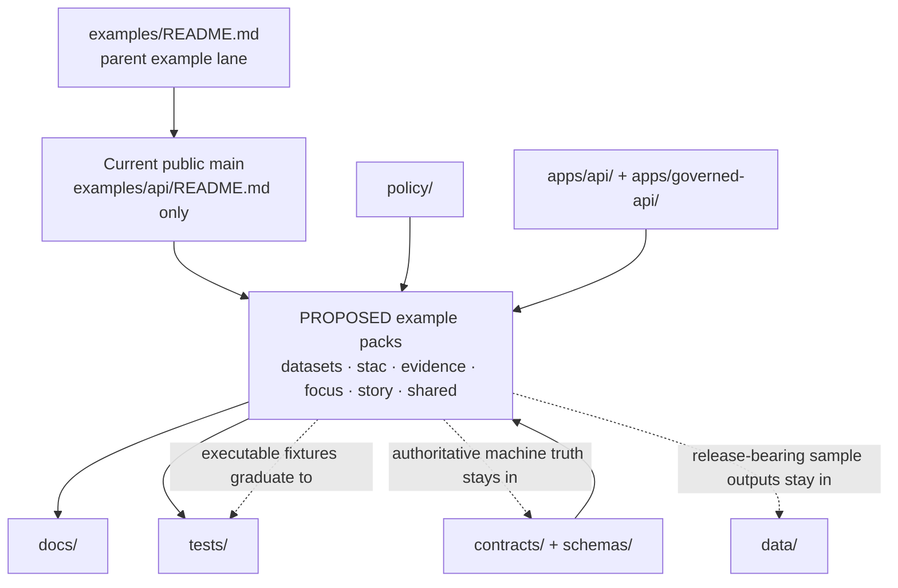

<!-- [KFM_META_BLOCK_V2]
doc_id: kfm://doc/TODO-UUID
title: API Examples
type: standard
version: v1
status: review
owners: @bartytime4life
created: TODO-YYYY-MM-DD
updated: TODO-YYYY-MM-DD
policy_label: TODO-POLICY-LABEL
related: [../README.md, ../../README.md, ../../.github/CODEOWNERS, ../../apps/README.md, ../../apps/api/README.md, ../../apps/governed-api/README.md, ../../contracts/, ../../schemas/, ../../policy/, ../../tests/]
tags: [kfm, api, examples]
notes: [Owner and path were updated from current public repo evidence; doc_id, dates, and policy_label still need verification; the proposed example-pack tree below is not yet confirmed as checked-in public-main content.]
[/KFM_META_BLOCK_V2] -->

# API Examples

Governed request/response examples for the KFM API boundary, kept illustrative, public-safe, and subordinate to contract truth.


**Status:** experimental  
**Owners:** `@bartytime4life`  
**Path:** `examples/api/README.md`  
**Repo fit:** parent [`../README.md`](../README.md) · upstream [`../../README.md`](../../README.md), [`../../apps/README.md`](../../apps/README.md), [`../../schemas/README.md`](../../schemas/README.md), [`../../policy/README.md`](../../policy/README.md), [`../../tests/README.md`](../../tests/README.md), [`../../.github/CODEOWNERS`](../../.github/CODEOWNERS) · adjacent API lanes [`../../apps/api/README.md`](../../apps/api/README.md), [`../../apps/governed-api/README.md`](../../apps/governed-api/README.md)  
**Quick jump:** [Scope](#scope) · [Repo fit](#repo-fit) · [Accepted inputs](#accepted-inputs) · [Exclusions](#exclusions) · [Directory tree](#directory-tree) · [Quickstart](#quickstart) · [Usage](#usage) · [Diagram](#diagram) · [Tables](#tables) · [Task list / definition of done](#task-list--definition-of-done) · [FAQ](#faq) · [Appendix](#appendix)

> [!IMPORTANT]
> `examples/api/` is the **illustrative API-boundary lane**, not the authoritative home of schemas, policy bundles, runtime code, release proof, or canonical data.

> [!NOTE]
> This README is **repo-aware and evidence-bounded**. Current public `main` confirms that `examples/api/` exists and is presently **README-only**. The example-pack tree below is therefore intentionally split into:
> - **CONFIRMED** current public contents
> - **PROPOSED** starter expansion for future checked-in packs

> [!CAUTION]
> Current public `main` exposes both [`../../apps/api/`](../../apps/api/) and [`../../apps/governed-api/`](../../apps/governed-api/). This README keeps both visible rather than guessing which path is the final authoritative API boundary name.

---

## Scope

`examples/api/` exists to make the KFM API membrane easier to inspect, review, and evolve without letting sample material quietly become sovereign truth.

In KFM, public and ordinary steward clients are supposed to cross **governed APIs** rather than talk directly to canonical stores, unpublished artifact trees, or model runtimes. That makes boundary examples useful: they help contributors see what a safe outward envelope should look like while keeping the true source of authority elsewhere.

Examples here should help answer questions like these:

- What does a contract-aligned request or response look like?
- What should a meaningful negative path look like?
- Which trust-visible fields should stay legible at the boundary?
- Which example belongs here, and which should live under contracts, schemas, policy, tests, apps, or data instead?

[Back to top](#api-examples)

## Repo fit

### Current public snapshot

| Surface | Current public-main signal | Status |
|---|---|---|
| `examples/api/` | `README.md` only | **CONFIRMED** |
| Parent example lane | `examples/` contains `api/`, `story/`, `thin_slice/`, `ui/`, and `README.md` | **CONFIRMED** |
| Ownership | `/examples/` is covered by `@bartytime4life` in current public `CODEOWNERS` | **CONFIRMED** |
| Adjacent runtime lanes | `apps/` publicly shows `api/`, `governed-api/`, `explorer-web/`, `review-console/`, `workers/`, and `cli/` | **CONFIRMED** |
| API-boundary naming authority | both `apps/api/` and `apps/governed-api/` are visible | **NEEDS VERIFICATION** |
| Checked-in example packs such as `datasets/`, `focus/`, or `evidence/` | not present in current public `examples/api/` tree | **CONFIRMED absent on public `main`** |

### Why this lane exists

KFM repeatedly separates:

- **authoritative contracts and schemas**
- **executable policy and review logic**
- **runtime implementation**
- **illustrative examples**

That separation keeps examples useful without turning them into a shadow contract registry, a test fixture dump, or a second truth layer.

### Stronger owner surfaces

Before adding anything here, check whether one of the lanes below is the better home.

| Stronger owner surface | Put it there when the artifact is… | Why it should not default to `examples/api/` |
|---|---|---|
| [`../../contracts/`](../../contracts/) | contract-owned example, shared outward object, or route family definition | contract truth should stay near contract review |
| [`../../schemas/`](../../schemas/) | schema file, valid/invalid example, or compatibility rule | schema drift is easier to catch when examples stay near schema ownership |
| [`../../policy/`](../../policy/) | policy bundle, reason/obligation vocabulary, decision grammar, or policy test | governance should not hide in a demo lane |
| [`../../tests/`](../../tests/) | merge-blocking fixture, executable negative-path pack, or runtime verification asset | executable proof belongs with the harness that enforces it |
| [`../../apps/`](../../apps/) | implementation-tied payload, UI/API state example, or runtime-owned behavior sample | app truth should stay near the emitting surface |
| [`../../data/`](../../data/) | governed manifest, release-linked sample output, or receipt-like artifact | example lanes must not replace the truth path |
| [`../../docs/`](../../docs/) | runbook, ADR, walkthrough, or long-form explanation | narrative authority belongs in docs |

[Back to top](#api-examples)

## Accepted inputs

Content that belongs here includes:

- small redacted request examples for governed routes
- small redacted response envelopes
- problem or denial examples that explain negative paths
- `EvidenceRef` / `EvidenceBundle` resolution examples at the outward API boundary
- finite Focus outcome examples such as `answer`, `abstain`, `deny`, and `error`
- sanitized auth/header examples with placeholder-only values
- story-facing or dossier-facing API payload examples
- tiny instructional packs that help docs, reviewers, or contributors understand boundary behavior

A strong API example is:

- contract-aligned
- policy-safe
- easy to diff in Git
- explicit about placeholders and redactions
- small enough to review without scrolling through noise
- paired with the route family or envelope it illustrates

[Back to top](#api-examples)

## Exclusions

The following do **not** belong here:

- canonical schema files
- policy bundles or policy tests as the source of truth
- runtime implementation code
- direct-storage examples that bypass the governed API
- release-bearing receipts or proof packs presented as though they were only “examples”
- copied production logs or environment-specific manifests
- stale payloads that no longer match the owning contract
- real secrets, live credentials, cookies, signed headers, or sensitive unpublished values

### Put it elsewhere instead

| Artifact | Keep it here? | Better home |
|---|---:|---|
| JSON Schema / contract source of truth | No | [`../../contracts/`](../../contracts/), [`../../schemas/`](../../schemas/) |
| Policy bundles / reason vocabularies / decision tests | No | [`../../policy/`](../../policy/) |
| Governed route implementation | No | [`../../apps/api/`](../../apps/api/), [`../../apps/governed-api/`](../../apps/governed-api/) |
| App-tied response-state examples | Usually no | [`../../apps/`](../../apps/) |
| Merge-blocking fixtures | Usually no | [`../../tests/`](../../tests/) |
| Release-linked sample outputs or receipts | No | [`../../data/`](../../data/) |
| Redacted docs-and-review examples | Yes | `examples/api/` |
| Secrets / live credentials | Never | nowhere in Git |

[Back to top](#api-examples)

## Directory tree

### Current public `main` tree

```text
examples/api/
└── README.md
```

### PROPOSED starter expansion

```text
examples/api/
├── README.md
├── datasets/
│   ├── list.request.http
│   ├── list.response.json
│   └── list.denied.problem.json
├── stac/
│   ├── collections.request.http
│   ├── collections.response.json
│   ├── items.filtered.request.http
│   └── items.filtered.response.json
├── evidence/
│   ├── resolve.request.json
│   ├── resolve.response.json
│   └── resolve.denied.problem.json
├── focus/
│   ├── ask.request.json
│   ├── ask.answer.response.json
│   ├── ask.abstain.response.json
│   ├── ask.deny.response.json
│   └── ask.error.problem.json
├── story/
│   ├── create.request.json
│   ├── read.response.json
│   └── review_required.problem.json
├── shared/
│   ├── headers.example.txt
│   ├── pagination.example.json
│   └── audit_ref.example.json
└── _index/
    └── manifest.md
```

### Why the split matters

- The **current public tree** tells reviewers what is actually checked in today.
- The **proposed starter tree** gives contributors a disciplined growth shape without pretending that those packs already exist.
- Keeping those two views separate reduces exactly the kind of drift KFM warns about elsewhere.

[Back to top](#api-examples)

## Quickstart

### 1. Inspect the lane as it exists today

```bash
find examples/api -maxdepth 2 -type f | sort
```

### 2. Review adjacent owner surfaces before adding anything

```bash
find apps -maxdepth 2 -type f | sort | sed -n '1,40p'
find schemas -maxdepth 2 -type f | sort | sed -n '1,40p'
find policy -maxdepth 2 -type f | sort | sed -n '1,40p'
find tests -maxdepth 2 -type f | sort | sed -n '1,40p'
```

### 3. Start the smallest possible example pack

```bash
mkdir -p examples/api/focus
touch examples/api/focus/ask.answer.response.json
touch examples/api/focus/ask.deny.problem.json
```

### 4. Validate JSON before opening a PR

```bash
jq empty examples/api/focus/*.json
```

### 5. Update this README in the same PR

Add the new pack to the proposed tree only after the files exist, and keep every new filename outcome-oriented.

<details>
<summary><strong>Illustrative HTTP family only (PROPOSED, not current-route proof)</strong></summary>

Use route snippets like these only as discussion aids until the active branch confirms final boundary naming and route inventory.

```bash
export KFM_BASE_URL="http://localhost:8000"
export KFM_TOKEN="REPLACE_ME"

# PROPOSED / ILLUSTRATIVE ONLY
curl -sS \
  -H "Authorization: Bearer ${KFM_TOKEN}" \
  "${KFM_BASE_URL}/api/v1/stac/collections"

# PROPOSED / ILLUSTRATIVE ONLY
curl -sS -X POST \
  -H "Authorization: Bearer ${KFM_TOKEN}" \
  -H "Content-Type: application/json" \
  "${KFM_BASE_URL}/api/v1/focus/ask" \
  --data @examples/api/focus/ask.request.json
```

</details>

[Back to top](#api-examples)

## Usage

### 1. Author from the strongest owner surface first

Start with the relevant contract, schema, policy bundle, or runtime boundary doc. Then write the smallest example that makes the outward behavior understandable.

### 2. Keep current public facts separate from planned starter shapes

If a directory or example pack is not checked in yet, mark it **PROPOSED** instead of quietly implying it exists.

### 3. Pair success with a meaningful negative path

Examples are more useful when they show fail-closed behavior, not only the happy path.

### 4. Keep trust-visible fields legible

Examples should favor fields like:

- request shape
- response envelope
- problem payload
- evidence-link fields
- pagination, version, freshness, audit, or review-visible fields when relevant

### 5. Keep packs reviewable

Prefer:

- tiny payloads
- stable ordering
- obvious placeholders
- explicit redactions
- readable filenames
- pack-local README notes only when necessary

Avoid:

- giant dumps
- copied production responses
- examples that cannot be traced to an owning surface
- fake implementation details passed off as current behavior

### 6. Promote executable proof out of this lane

If an example becomes merge-blocking, runtime-owned, or schema-owned, move it or reference it from the stronger owner surface instead of leaving the only copy here.

[Back to top](#api-examples)

## Diagram



**Reading the diagram**

- `examples/api/` is downstream of contracts, schemas, policy, and API boundary docs.
- Today’s public lane is **README-only**.
- Proposed example packs should stay illustrative until they are actually checked in.
- Executable proof, authoritative schemas, and release-bearing artifacts should graduate to stronger owner surfaces.

[Back to top](#api-examples)

## Tables

### Status vocabulary used here

| Label | Meaning in this README |
|---|---|
| **CONFIRMED** | directly supported by the current public repo tree or checked-in KFM docs |
| **INFERRED** | conservative interpretation of confirmed repo or doctrine evidence |
| **PROPOSED** | doctrine-consistent next shape not yet proven as checked-in behavior |
| **UNKNOWN** | not verified strongly enough from current evidence |
| **NEEDS VERIFICATION** | explicit review placeholder before merge |

### Example family matrix

| Example family | What it should prove | Typical companion source | Keep in `examples/api/`? |
|---|---|---|---:|
| Dataset listing | policy-filtered list shape, version/pagination visibility | contracts + API boundary docs | Yes |
| STAC search / collections | outward geospatial query shape | schemas + API boundary docs | Yes |
| Evidence resolution | `EvidenceRef` request and policy-safe bundle response | evidence contract / resolver docs | Yes |
| Focus outcome | finite response outcomes and cite-or-abstain behavior | runtime envelope / Focus boundary docs | Yes |
| Story route example | outward story-facing payload and review-sensitive response shape | story boundary docs | Yes |
| Runtime response envelope contract | machine-checkable truth for emitted states | contracts / schemas | No |
| Policy bundle or reason registry | executable authorization or obligation logic | policy | No |
| Merge-gating fixture pack | automated proof asset | tests | Usually no |
| Release-linked sample output | proof- or publish-bearing artifact | data | No |

[Back to top](#api-examples)

## Task list / definition of done

### Current next tasks

- [ ] Keep the **current public snapshot** aligned with the visible `main` tree.
- [ ] Add the first real example pack only after confirming its stronger owner surface.
- [ ] Keep route family names and payload families explicitly **PROPOSED** until checked-in proof exists.
- [ ] Graduate executable fixtures to `tests/` when they become merge-blocking.

### Definition of done for any new example pack

- [ ] The example maps to a named contract, schema, policy surface, or API boundary doc.
- [ ] The example is redacted, policy-safe, and free of secrets.
- [ ] The example is small enough to review comfortably in GitHub.
- [ ] The example shows the fields that matter for trust, evidence, or review.
- [ ] A negative-path example exists where failure semantics matter.
- [ ] The example does not duplicate the authoritative schema or policy bundle.
- [ ] The same PR updates this README when the pack changes the lane shape.
- [ ] The example does not imply direct storage access, unpublished artifacts, or hidden services.
- [ ] Filenames are deterministic and outcome-oriented.
- [ ] Any timestamp, digest, token, or identifier value is clearly placeholder or sanitized.

[Back to top](#api-examples)

## FAQ

### Why does this README separate current public contents from proposed expansion?

Because KFM’s truth posture is explicit: checked-in path facts should not be blended with doctrine-consistent future structure.

### Why mention both `apps/api/` and `apps/governed-api/`?

Because current public `main` exposes both path families. Until the active branch settles authoritative naming, this README should keep that ambiguity visible instead of smoothing it away.

### Are these examples documentation or fixtures?

They can support both, but once an example becomes merge-blocking executable proof, it should usually move to `tests/` or be referenced from there.

### Can this lane include auth examples?

Yes, but only sanitized header shapes, role-sensitive placeholders, and obviously non-live values.

### How do I know an example no longer belongs here?

Move it when it becomes:
- authoritative
- executable
- release-bearing
- tightly coupled to runtime implementation
- better owned by contracts, schemas, policy, tests, apps, docs, or data

[Back to top](#api-examples)

## Appendix

<details>
<summary><strong>Suggested naming and pack conventions</strong></summary>

### Filename guidance

Prefer outcome- and direction-aware names:

- `*.request.json`
- `*.response.json`
- `*.problem.json`
- `*.headers.txt`
- `*.example.json`

Where useful, include both the route family and the outcome:

- `list.response.json`
- `resolve.denied.problem.json`
- `ask.abstain.response.json`
- `create.review_required.problem.json`

### Outcome slugs to keep stable

Use stable language where the project already depends on finite outcomes or review-visible states:

- `answer`
- `abstain`
- `deny`
- `error`
- `review_required`
- `stale`
- `generalized`

### Minimal pack template

```text
<family>/
├── <operation>.request.json
├── <operation>.response.json
└── <operation>.problem.json
```

### Review questions

1. Does this demonstrate governed API behavior rather than internal convenience?
2. Is the stronger owner surface still the wrong home?
3. Is current-tree fact separated from future-shape guidance?
4. Would a new contributor understand what belongs here after reading only this file?

</details>

[Back to top](#api-examples)
