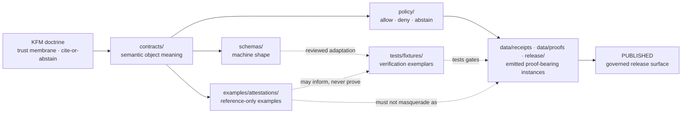

<!-- [KFM_META_BLOCK_V2]
doc_id: kfm://doc/NEEDS-VERIFICATION-attestation-examples-readme
title: Attestation Examples
type: standard
version: v1
status: draft
owners: OWNER_TBD
created: NEEDS VERIFICATION: confirm original creation date or set at commit time
updated: 2026-05-02
policy_label: NEEDS VERIFICATION: public-draft unless repo policy says otherwise
related: [NEEDS VERIFICATION: ../README.md, NEEDS VERIFICATION: ../../README.md, NEEDS VERIFICATION: ../../contracts/OBJECT_MAP.md, NEEDS VERIFICATION: ../../schemas/README.md, NEEDS VERIFICATION: ../../data/proofs/README.md, NEEDS VERIFICATION: ../../data/receipts/README.md]
tags: [kfm, examples, attestations, receipts, proofs, release]
notes: [Directory README for reference attestation examples; current repo implementation depth UNKNOWN; examples are not emitted proof objects]
[/KFM_META_BLOCK_V2] -->

# Attestation Examples

Reference-only attestation examples for showing how KFM trust objects may bind artifacts, receipts, proof packs, release manifests, and policy decisions without becoming production proof.

<a id="top"></a>

> [!IMPORTANT]
> **Status:** experimental — **PROPOSED** until the target repo path is inspected  
> **Owners:** `OWNER_TBD`  
> **Path:** `examples/attestations/`  
> **Authority level:** reference examples only  
> **Truth posture:** CONFIRMED doctrine / PROPOSED example shapes / UNKNOWN repo implementation depth  
>
> 
> 
> 
> 
>
> **Quick jumps:** [Scope](#scope) · [Repo fit](#repo-fit) · [Accepted inputs](#accepted-inputs) · [Exclusions](#exclusions) · [Directory map](#directory-map) · [Usage](#usage) · [Verification checklist](#verification-checklist) · [Rollback](#rollback)

> [!NOTE]
> This README states KFM doctrine where supported by project sources. Current implementation depth remains **UNKNOWN** where repo files, tests, workflows, dashboards, logs, emitted proof objects, and runtime artifacts have not been inspected.

## Scope

`examples/attestations/` is intended to hold **safe, non-production, human-readable examples** of attestation-like payloads.

These examples help maintainers, reviewers, and future implementers understand how KFM may describe:

- artifact digest binding,
- source or run provenance,
- policy decision support,
- release-manifest integrity,
- citation or EvidenceBundle support,
- rollback or correction linkage,
- signature or attestation references.

They are **not** canonical contracts, executable schemas, emitted receipts, proof packs, or release artifacts.

## Repo fit

| Item | Value |
| --- | --- |
| Target path | `examples/attestations/README.md` |
| Directory role | Reference examples for trust-bearing attestation payloads |
| Upstream doctrine | KFM trust membrane, proof-object family, cite-or-abstain posture, governed publication |
| Upstream homes to verify | [`../../contracts/OBJECT_MAP.md`](../../contracts/OBJECT_MAP.md), [`../../schemas/README.md`](../../schemas/README.md), [`../../policy/README.md`](../../policy/README.md) |
| Downstream homes to verify | [`../../tests/fixtures/README.md`](../../tests/fixtures/README.md), [`../../data/proofs/README.md`](../../data/proofs/README.md), [`../../data/receipts/README.md`](../../data/receipts/README.md), [`../../release/`](../../release/) |
| Public safety posture | Examples must be fake, non-sensitive, non-authoritative, and clearly marked as examples |
| Implementation status | **UNKNOWN** until the mounted repository is inspected |

### Boundary with neighboring object families

| Surface | What it is for | What this directory must not do |
| --- | --- | --- |
| `contracts/` | Human semantic meaning, invariants, field intent | Replace examples with normative object definitions |
| `schemas/` | Machine-checkable shape and constraints | Treat examples as executable schema authority |
| `policy/` | Allow / deny / abstain logic and obligations | Hide policy outcomes inside sample prose |
| `tests/fixtures/` | Valid and invalid verification exemplars | Use teaching examples as CI fixtures without review |
| `data/receipts/` | Emitted process-memory instances | Store real receipt instances here |
| `data/proofs/` | Emitted proof-bearing instances | Store production proof packs here |
| `release/` | Release manifests, release candidates, release records | Publish example attestations as release evidence |

## Accepted inputs

Examples belong here only when they are safe to review publicly and cannot be mistaken for live KFM evidence.

Accepted material:

- `*.attestation.example.json` files with fake identifiers and fake digest values.
- `*.attestation.invalid.example.json` files that demonstrate unsafe or rejected patterns.
- Short notes explaining how an attestation example relates to KFM object families.
- Example-only references to `EvidenceBundle`, `RunReceipt`, `ReleaseManifest`, `PolicyDecision`, `CorrectionNotice`, or rollback objects.
- Payload sketches that use `example: true` or another unmistakable example marker.
- Small examples that are useful for humans before formal schemas and fixtures are verified.

Recommended naming pattern:

```text
<subject-family>.<attestation-kind>.example.json
```

Examples:

```text
release-manifest.integrity.attestation.example.json
run-receipt.provenance.attestation.example.json
evidence-bundle.citation.attestation.example.json
policy-decision.deny.attestation.example.json
rollback-reference.withdrawal.attestation.example.json
```

## Exclusions

Do **not** place any of the following in this directory:

- Real signatures, signing bundles, private keys, tokens, secrets, credentials, or service account identities.
- Real emitted proof packs, release manifests, receipts, runtime envelopes, catalog records, or production attestations.
- Raw source records, unpublished candidate data, `RAW`, `WORK`, or `QUARANTINE` material.
- Exact sensitive locations, archaeology site locations, protected species locations, living-person data, DNA-related data, title/legal claims, or rights-uncertain source details.
- Canonical schema files, contract definitions, policy rules, validators, or CI fixtures unless reviewed and moved to the appropriate home.
- AI-generated claims presented as evidence.
- Anything that bypasses the governed path:

```text
RAW -> WORK / QUARANTINE -> PROCESSED -> CATALOG / TRIPLET -> PUBLISHED
```

> [!CAUTION]
> A file in `examples/attestations/` must never be cited as production evidence. If an example is copied into a proof, release, policy, or fixture path, it must be reviewed, renamed, validated, and linked to the governing contract/schema/policy surface first.

## Directory map

Diagram omitted for current files — **NEEDS VERIFICATION** because this session did not confirm the target repo tree.

PROPOSED directory shape:

```text
examples/attestations/
├── README.md
├── artifact-digest.integrity.attestation.example.json
├── run-receipt.provenance.attestation.example.json
├── evidence-bundle.citation.attestation.example.json
├── release-manifest.integrity.attestation.example.json
├── policy-decision.deny.attestation.example.json
└── rollback-reference.withdrawal.attestation.example.json
```

## Trust boundary diagram



## Usage

Use this directory to understand and review example payload shape before promoting any idea into contracts, schemas, fixtures, validators, or release processes.

Safe review flow:

1. Read the example and confirm it is clearly marked as example-only.
2. Check whether the subject family has a semantic contract.
3. Check whether the executable schema home is verified.
4. Check whether policy outcomes are visible and finite.
5. Check whether any example should become a fixture.
6. Move promoted examples into the correct home only after review.

PROPOSED syntax-only local check:

```bash
# PROPOSED: adapt to the repo-native validator once package manager and validator paths are verified.
python -m json.tool examples/attestations/release-manifest.integrity.attestation.example.json >/dev/null
```

> [!WARNING]
> Syntax-valid JSON is not a KFM validation result. A real KFM validation must check schema, policy, evidence closure, source role, rights, sensitivity, digest binding, release state, and rollback target where applicable.

## Example attestation shape

The shape below is **illustrative**, not normative.

```jsonc
{
  "example": true,
  "kfm_object_family": "attestation_example",
  "attestation_id": "example:attestation:release-manifest-integrity:001",
  "subject": {
    "subject_type": "ReleaseManifest",
    "subject_ref": "example:release-manifest:hydrology-thin-slice:001",
    "digest": {
      "algorithm": "sha256",
      "value": "EXAMPLE_DIGEST_NOT_FOR_VERIFICATION"
    }
  },
  "predicate_type": "kfm.example.integrity.v1",
  "predicate": {
    "claim": "This example shows how an integrity attestation might bind a release manifest to a digest and policy decision.",
    "evidence_refs": [
      "example:evidence-ref:001"
    ],
    "policy_decision": {
      "outcome": "ABSTAIN",
      "reason": "Example-only payload; no production evidence or validator run attached."
    },
    "review_state": "example_only",
    "release_state": "not_published"
  },
  "signature": {
    "signature_ref": "EXAMPLE_ONLY_NOT_A_SIGNATURE",
    "issuer": "OWNER_TBD",
    "verification_state": "not_verified"
  },
  "rollback": {
    "rollback_ref": "example:rollback-reference:001",
    "rollback_required_if": [
      "example is mistaken for production proof",
      "example contains real source or sensitive data",
      "example conflicts with canonical schema after verification"
    ]
  }
}
```

## Review rules

Every example in this directory should satisfy the following rules before commit:

| Rule | Required outcome |
| --- | --- |
| Example marker | File includes `example: true` or equivalent unmistakable marker |
| Fake data | No real signatures, secrets, identifiers, sensitive records, or production source claims |
| Digest clarity | Digest values are fake or explicitly marked as non-verifying |
| Policy visibility | Example shows `ANSWER`, `ABSTAIN`, `DENY`, `ERROR`, or another reviewed finite outcome only when appropriate |
| Evidence posture | Evidence references are fake or point only to approved example material |
| No publication claim | Example cannot be confused with a released artifact |
| Review trail | Promotion into fixtures, schemas, or emitted artifacts requires a separate review record |

## Maintenance checklist

- [ ] Confirm `examples/attestations/` exists in the mounted repository.
- [ ] Confirm owner and reviewer expectations.
- [ ] Confirm whether `examples/README.md` exists and should link here.
- [ ] Confirm adjacent homes for `contracts/`, `schemas/`, `policy/`, `tests/fixtures/`, `data/receipts/`, `data/proofs/`, and `release/`.
- [ ] Confirm naming convention for example JSON files.
- [ ] Confirm examples do not contain real signatures, source data, sensitive locations, private data, or production claims.
- [ ] Confirm promoted examples are moved into fixtures only through review.
- [ ] Confirm validators or CI do not treat examples as emitted proof objects unless explicitly designed to do so.
- [ ] Confirm rollback target for any documentation or example-file change.

## Verification checklist

- [ ] `git status --short` confirms the real repo is mounted and clean enough for documentation work.
- [ ] Target path `examples/attestations/README.md` is present or intentionally created.
- [ ] All relative links resolve from `examples/attestations/`.
- [ ] Repo-native README conventions do not supersede this structure.
- [ ] KFM Meta Block values are replaced with confirmed identifiers, owners, dates, and policy labels.
- [ ] Examples remain reference-only and cannot be mistaken for production proof.
- [ ] Any example promoted to a fixture has a matching contract/schema/policy review.
- [ ] No public path bypasses governed interfaces or release artifacts.
- [ ] Rollback path is documented before merge.

## Rollback

Rollback is required if this README or any example file:

- weakens the KFM trust membrane,
- blurs examples with emitted proof objects,
- introduces sensitive or real production data,
- creates schema or contract authority conflicts,
- breaks stable repo navigation,
- implies validation, signing, release, or policy enforcement that has not been verified.

Rollback target: `ROLLBACK_TARGET_TBD_AFTER_REPO_INSPECTION`

Preferred rollback action:

1. Revert the README/example-file commit.
2. Remove any example links from adjacent READMEs.
3. Add a correction note if an example was cited as proof.
4. Re-run link and syntax checks after revert.

## FAQ

### Are these examples evidence?

No. They are reference material. Evidence-bearing objects belong in governed emitted-artifact homes such as `data/receipts/`, `data/proofs/`, `release/`, or another verified repo-native location.

### Can an example become a fixture?

Yes, but only after review. A fixture belongs in `tests/fixtures/` and should have a clear valid/invalid expectation, schema relation, and validator invocation.

### Can an example include a real signature?

No. Real signatures, bundles, signing identities, and verification outputs belong in the appropriate release/proof process after policy and security review.

### Can Focus Mode or another AI surface cite these files?

Only as examples of format or documentation. They must not be cited as evidence for a real-world claim.

<details>
<summary><strong>Appendix — placeholder review list</strong></summary>

Search for these placeholders before publishing:

- `OWNER_TBD`
- `ROLLBACK_TARGET_TBD_AFTER_REPO_INSPECTION`
- `NEEDS VERIFICATION`
- `EXAMPLE_ONLY_NOT_A_SIGNATURE`
- `EXAMPLE_DIGEST_NOT_FOR_VERIFICATION`
- `example:`

</details>

[Back to top](#top)
