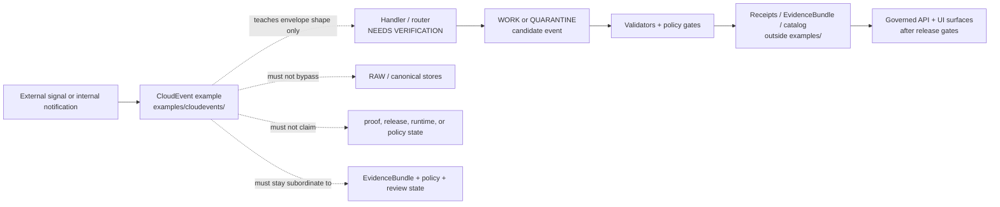

<!-- [KFM_META_BLOCK_V2]
doc_id: kfm://doc/NEEDS-VERIFICATION/examples-cloudevents-readme
title: CloudEvents Examples
type: standard
version: v1
status: draft
owners: OWNER_TBD_AFTER_REPO_INSPECTION
created: NEEDS VERIFICATION
updated: 2026-05-02
policy_label: public
related: [../README.md, notification_cloudevent_example.json, ../../contracts/README.md, ../../schemas/README.md, ../../policy/README.md, ../../tests/README.md, ../../tools/README.md]
tags: [kfm, examples, cloudevents, events, provenance, governance]
notes: [Target path requested by user; public main showed an existing empty README and one notification CloudEvent example; active checkout ownership, validators, and branch enforcement remain NEEDS VERIFICATION.]
[/KFM_META_BLOCK_V2] -->

# CloudEvents Examples

Small, public-safe CloudEvents examples for KFM notification and event-envelope shape — not evidence, proof, release state, or runtime behavior.


> [!IMPORTANT]
> **Status:** experimental README surface / draft content  
> **Owners:** `OWNER_TBD_AFTER_REPO_INSPECTION`  
> **Path:** `examples/cloudevents/README.md`  
> **Truth posture:** `CONFIRMED` public-main directory/file presence · `PROPOSED` README contract · `UNKNOWN` active checkout validator coverage  
> **Public posture:** synthetic or redacted examples only; cite-or-abstain and fail-closed where source role, rights, sensitivity, review state, or release state are unresolved.

**Quick jumps:** [Scope](#scope) · [Repo fit](#repo-fit) · [Accepted inputs](#accepted-inputs) · [Exclusions](#exclusions) · [Directory map](#directory-map) · [CloudEvents field guide](#cloudevents-field-guide) · [Current example](#current-example) · [Flow](#flow) · [Validation](#validation) · [Review gates](#review-gates) · [Rollback](#rollback) · [Open verification backlog](#open-verification-backlog)

---

## Scope

`examples/cloudevents/` is a teaching surface for small CloudEvents-shaped JSON objects that help maintainers and contributors understand how KFM may represent event notifications without turning those examples into source custody, executable fixtures, emitted receipts, proof packs, release manifests, or operational alerts.

Use this directory to illustrate:

- event envelope shape;
- notification payload shape;
- synthetic identifiers and timestamps;
- how CloudEvents context attributes can carry routing context;
- how KFM event data can point toward downstream governance objects without claiming they exist.

Do **not** use this directory to activate pipelines, persist live webhooks, store DLQ items, publish event streams, or prove that a handler, validator, policy gate, runtime route, catalog record, or release workflow exists.

> [!WARNING]
> A CloudEvent example is not an `EvidenceBundle`, not a `RunReceipt`, not a policy decision, not a source descriptor, and not a release artifact. It may demonstrate an envelope; it must not become the trust path.

[Back to top](#cloudevents-examples)

---

## Repo fit

This README is a child README under `examples/`. It inherits the examples-directory rule: examples teach shape and intent, while schemas, contracts, tests, policies, receipts, proofs, catalogs, releases, and runtime surfaces own stronger claims.

| Relation | Surface | Status | Role |
|---|---|---:|---|
| Current path | `examples/cloudevents/README.md` | **PROPOSED / draft** | Directory contract for CloudEvents examples. |
| Current example | [`notification_cloudevent_example.json`](notification_cloudevent_example.json) | **CONFIRMED on public main / illustrative** | Minimal notification-style CloudEvent example. |
| Upstream examples landing | [`../README.md`](../README.md) | **CONFIRMED on public main / NEEDS RECHECK in active checkout** | Parent examples rules: examples are not evidence or proof. |
| Root orientation | [`../../README.md`](../../README.md) | **NEEDS VERIFICATION** | Repo-wide identity, trust posture, and navigation. |
| Contracts | [`../../contracts/README.md`](../../contracts/README.md) | **NEEDS VERIFICATION** | Semantic/API/runtime contract authority; examples must not redefine it. |
| Schemas | [`../../schemas/README.md`](../../schemas/README.md) | **NEEDS VERIFICATION** | Machine-readable schema authority; CloudEvent validation belongs here or in a repo-approved schema home. |
| Policy | [`../../policy/README.md`](../../policy/README.md) | **NEEDS VERIFICATION** | Rights, sensitivity, source admission, deny, quarantine, and release policy. |
| Tests and fixtures | [`../../tests/README.md`](../../tests/README.md) | **NEEDS VERIFICATION** | Valid/invalid fixtures and regression tests. |
| Tooling | [`../../tools/README.md`](../../tools/README.md) | **NEEDS VERIFICATION** | Validators, linters, probes, and promotion helpers. |

> [!CAUTION]
> If the active checkout uses different homes for schemas, contracts, tests, or policies, update this README through the repo’s documentation convention or an ADR. Do not create parallel authority for CloudEvents.

[Back to top](#cloudevents-examples)

---

## Accepted inputs

CloudEvents examples must be small, public-safe, and explicitly non-authoritative.

| Accepted input | Allowed here when… | Required posture |
|---|---|---:|
| `*.json` CloudEvent examples | The event is synthetic, redacted, tiny, and clearly illustrative. | **PROPOSED** |
| Notification examples | The payload shows event shape without proving delivery, alerting, retry, DLQ, or handler behavior. | **PROPOSED** |
| Metadata-only event sketches | The event carries pointers or synthetic hashes rather than source payload copies. | **PROPOSED** |
| Negative-state examples | The event demonstrates `ABSTAIN`, `DENY`, `ERROR`, hold, quarantine, or review-required semantics in `data`. | **PROPOSED** |
| README-local snippets | Snippets help humans understand safe event-envelope practice. | **PROPOSED** |

A good CloudEvents example should be easy to inspect in one diff and safe to delete without affecting canonical truth, release state, public behavior, source custody, or policy posture.

[Back to top](#cloudevents-examples)

---

## Exclusions

Do **not** put these in `examples/cloudevents/`.

| Excluded content | Goes instead | Why |
|---|---|---|
| Live webhook payloads from providers | Governed intake or `data/raw/` after source approval | Examples are not source custody. |
| RAW, WORK, or QUARANTINE event candidates | `../../data/raw/`, `../../data/work/`, or `../../data/quarantine/` | Examples must not bypass lifecycle gates. |
| Event streams, queues, DLQ items, replay batches | Runtime, pipeline, or data lifecycle homes | Operational state is not an example. |
| Valid/invalid semantic fixtures | `../../tests/fixtures/` | Fixtures prove behavior; examples teach shape. |
| Receipts, proofs, release manifests, attestations | Receipt/proof/release homes | Process memory and proof objects must stay distinct. |
| Secrets, tokens, signatures, cookies, credentials, private URLs | Nowhere in repo | Secrets must never enter examples. |
| Sensitive exact locations or restricted identifiers | Governed restricted lane after policy review | Sensitive surfaces fail closed. |
| Emergency or life-safety alerts | Official systems and governed contextual docs | KFM examples are not alerting systems. |
| Generated AI text as truth | Governed AI fixtures or review artifacts | AI is interpretive; EvidenceBundle and policy outrank generation. |

[Back to top](#cloudevents-examples)

---

## Directory map

The public-main directory currently shows one README and one JSON example.

```text
examples/cloudevents/
├── README.md
└── notification_cloudevent_example.json
```

Recommended future files, only after repo convention and schema ownership are verified:

```text
examples/cloudevents/
├── README.md
├── notification_cloudevent_example.json
├── notification_cloudevent_denied_example.json          # PROPOSED
└── metadata_only_source_notice_cloudevent_example.json  # PROPOSED
```

[Back to top](#cloudevents-examples)

---

## CloudEvents field guide

This README does not redefine the CloudEvents specification. It only records the KFM-specific review posture for examples.

| Field | CloudEvents role | KFM example rule |
|---|---|---|
| `specversion` | Declares the CloudEvents spec interpretation. | Use `"1.0"` unless a repo-approved schema says otherwise. |
| `id` | Event identifier unique with `source`. | Use synthetic IDs; do not reuse real event IDs from providers. |
| `source` | Context in which the event happened. | Prefer stable, non-secret, non-private source names. |
| `type` | Event type used for routing, observability, or policy. | Prefer reverse-DNS-like KFM types where KFM defines semantics; do not imply production routing. |
| `time` | Event timestamp. | Use explicit RFC 3339 timestamps; synthetic timestamps are acceptable when obvious. |
| `datacontenttype` | Media type for `data`. | Use `application/json` for JSON examples. |
| `data` | Domain-specific payload. | Keep tiny, synthetic, and explicit about what downstream object it points toward. |
| `dataschema` | Optional schema URI. | Add only after schema-home ownership is verified. |
| Extension attributes | Top-level CloudEvents extensions. | Avoid until a KFM CloudEvents extension policy exists. Prefer fields inside `data` for examples. |

> [!TIP]
> Prefer event examples that point toward a governed object instead of embedding large payloads. For example, use a synthetic `notification_hash`, `candidate_ref`, `receipt_ref`, or `evidence_ref` placeholder rather than copying source content.

[Back to top](#cloudevents-examples)

---

## Current example

### `notification_cloudevent_example.json`

| Field | Value |
|---|---|
| Status | **CONFIRMED file on public main / illustrative example** |
| Event type | `org.soilgrids.notification.delivery` |
| Source | `soilgrids_notification_delivery` |
| Data shape | `notification_id`, `notification_hash` |
| What it demonstrates | Minimal CloudEvents JSON envelope for a notification-style event. |
| What it does not prove | Delivery, handler execution, retries, DLQ routing, source activation, policy clearance, EvidenceBundle resolution, catalog closure, proof emission, release state, or UI/runtime behavior. |

Formatted for readability:

```json
{
  "specversion": "1.0",
  "type": "org.soilgrids.notification.delivery",
  "source": "soilgrids_notification_delivery",
  "id": "notif_123",
  "time": "2026-01-01T00:00:00Z",
  "datacontenttype": "application/json",
  "data": {
    "notification_id": "notif_123",
    "notification_hash": "abc"
  }
}
```

### Reviewer notes

- `notification_hash` is illustrative and too short for a real digest.
- `source` is not an approved source descriptor in this README.
- The event does not include `dataschema`; that remains `NEEDS VERIFICATION`.
- The event is safe as an example because it contains no provider payload, secret, sensitive location, or release claim.

[Back to top](#cloudevents-examples)

---

## Flow

The diagram shows the intended boundary. The example may teach the envelope shape; it does not execute the downstream flow.



[Back to top](#cloudevents-examples)

---

## Validation

Validation remains repository-dependent. Use the active repo’s documented validators when they exist.

Syntax-only smoke check:

```bash
# From the repository root.
# This checks JSON syntax only. It does not prove CloudEvents conformance or KFM policy safety.
python -m json.tool examples/cloudevents/notification_cloudevent_example.json >/dev/null
```

Suggested semantic checks, pending repo-native validator confirmation:

```text
NEEDS VERIFICATION: validate CloudEvents required fields.
NEEDS VERIFICATION: validate no secrets, tokens, private URLs, or sensitive coordinates.
NEEDS VERIFICATION: validate example-only status.
NEEDS VERIFICATION: validate source + id uniqueness expectations if used in tests.
NEEDS VERIFICATION: validate KFM policy posture for any data fields that reference source, evidence, receipt, proof, or release objects.
```

Recommended future validator outcome vocabulary:

| Outcome | Use |
|---|---|
| `PASS` | The example is syntactically valid, public-safe, and explicitly illustrative. |
| `HOLD` | The example is probably safe but missing reviewable metadata, destination links, or schema refs. |
| `DENY` | The example includes unsafe content, false release/proof claims, secrets, or sensitive exposure. |
| `ERROR` | The validator cannot determine status because of malformed JSON, missing required fields, or tool failure. |

[Back to top](#cloudevents-examples)

---

## Review gates

A change to `examples/cloudevents/` is ready for review when:

- [ ] Every event is synthetic, redacted, metadata-only, or otherwise public-safe.
- [ ] No event contains real provider payloads unless they are explicitly public, rights-cleared, and still appropriate for examples.
- [ ] No secrets, credentials, cookies, private URLs, access tokens, or sensitive exact coordinates are present.
- [ ] The event has `specversion`, `id`, `source`, and `type`.
- [ ] `source` + `id` are not copied from a live provider event unless policy explicitly allows that use.
- [ ] `datacontenttype` is explicit when `data` is present.
- [ ] The event does not claim handler execution, delivery success, retry behavior, DLQ state, runtime emission, policy clearance, proof, receipt, catalog, or release status.
- [ ] Any `dataschema`, `evidence_ref`, `receipt_ref`, `candidate_ref`, `proof_ref`, or `release_ref` is either verified or marked `NEEDS_VERIFICATION`.
- [ ] The example can be removed without changing canonical truth, source custody, release state, public behavior, or policy posture.

[Back to top](#cloudevents-examples)

---

## Rollback

Rollback for this README is documentation-only.

| Trigger | Action |
|---|---|
| README implies runtime behavior that is not verified | Correct the statement or mark it `UNKNOWN` / `NEEDS VERIFICATION`. |
| Example is discovered to contain unsafe content | Remove or quarantine the example immediately; do not preserve unsafe payloads for history. |
| Schema-home ADR assigns CloudEvents elsewhere | Update links and destination notes; do not create a competing schema authority. |
| Event type naming changes | Keep old examples only if they teach migration; otherwise replace and note supersession. |
| Directory is removed or renamed | Update `../README.md` and any linked docs in the same PR. |

Rollback target: restore the prior `examples/cloudevents/README.md` state and keep `notification_cloudevent_example.json` unchanged unless the example itself is unsafe.

[Back to top](#cloudevents-examples)

---

## Open verification backlog

| Item | Status | Required check |
|---|---:|---|
| Target owner | `UNKNOWN` | Confirm owner/team for `examples/cloudevents/`. |
| Active checkout state | `UNKNOWN` | Confirm this path and file contents in the mounted repository before merge. |
| CloudEvents schema home | `NEEDS VERIFICATION` | Decide whether schema material belongs under `schemas/`, `contracts/`, `jsonschema/`, or another repo-approved home. |
| Example validator | `NEEDS VERIFICATION` | Locate or create repo-native validation for CloudEvents examples. |
| Event type registry | `PROPOSED` | Decide whether KFM event types should be listed in a contract, schema, or runtime registry. |
| Source descriptor link | `NEEDS VERIFICATION` | Confirm whether `soilgrids_notification_delivery` maps to an approved source descriptor. |
| Test fixture promotion | `PROPOSED` | If enforcement is needed, copy smallest valid/invalid cases into `../../tests/fixtures/`, not this directory. |
| Branch and CI enforcement | `UNKNOWN` | Verify workflows, required checks, branch protection, and platform settings before claiming active enforcement. |

[Back to top](#cloudevents-examples)

---

<details>
<summary><strong>Appendix: safe CloudEvent example card template</strong></summary>

```yaml
example_card:
  example_id: NEEDS_VERIFICATION__stable_example_id
  path: examples/cloudevents/NEEDS_VERIFICATION__example.json
  status: PROPOSED
  purpose: "Teach CloudEvents envelope shape without becoming evidence, fixture, proof, release state, or runtime output."
  cloudevents:
    specversion: "1.0"
    type: NEEDS_VERIFICATION__event_type
    source: NEEDS_VERIFICATION__event_source
    id: NEEDS_VERIFICATION__synthetic_id
    datacontenttype: application/json
  kfm_boundaries:
    not_a_fixture: true
    not_a_receipt: true
    not_a_proof: true
    not_a_catalog_record: true
    not_a_release_artifact: true
    not_runtime_output: true
    not_canonical_truth: true
  safety:
    contains_real_provider_payload: false
    contains_secrets: false
    contains_sensitive_exact_location: false
    public_safe: true
  downstream_destination:
    intended_schema: ../../schemas/NEEDS_VERIFICATION
    intended_contract: ../../contracts/NEEDS_VERIFICATION
    intended_policy: ../../policy/NEEDS_VERIFICATION
    intended_fixture_home: ../../tests/fixtures/NEEDS_VERIFICATION
  review:
    owner: OWNER_TBD_AFTER_REPO_INSPECTION
    next_step: "Promote valid/invalid cases into tests/fixtures only when enforcement is needed."
```

</details>

<details>
<summary><strong>Appendix: pre-merge reviewer prompt</strong></summary>

```text
Review this examples/cloudevents change for KFM boundary safety.

Confirm:
1. The event is illustrative only.
2. It does not contain real provider payloads, secrets, private URLs, restricted identifiers, or sensitive exact locations.
3. It does not claim delivery, handler, runtime, policy, proof, receipt, catalog, or release behavior.
4. It preserves required CloudEvents fields and uses JSON data safely.
5. It links or names its intended downstream schema/contract/policy/fixture home, or marks that destination UNKNOWN / NEEDS VERIFICATION.
6. It can be removed without changing canonical truth, release state, public behavior, source custody, or policy posture.
```

</details>
