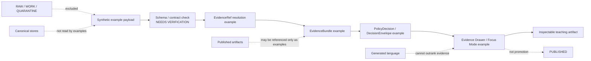

<!-- [KFM_META_BLOCK_V2]
doc_id: kfm://doc/NEEDS-VERIFICATION
title: Evidence Examples
type: standard
version: v1
status: draft
owners: OWNER_TBD
created: 2026-05-02
updated: 2026-05-02
policy_label: NEEDS VERIFICATION
related: [PATH_TBD_AFTER_REPO_INSPECTION]
tags: [kfm, examples, evidence, evidence-bundle, governed-ai]
notes: [Target path supplied by current request, UNKNOWN repo implementation depth, Child paths and links are PROPOSED until repo inspection, Examples are illustrative and not canonical evidence]
[/KFM_META_BLOCK_V2] -->

# Evidence Examples

Controlled example payloads for exercising KFM evidence resolution, citation behavior, policy decisions, and release-safe UI/API examples without treating examples as canonical truth.

> [!IMPORTANT]
> **Status:** experimental  
> **Owner:** OWNER_TBD  
> **Path:** `examples/evidence/README.md`  
> **Truth posture:** CONFIRMED doctrine / PROPOSED example layout / UNKNOWN current repo contents  
>
> 
> 
> 
> 
>
> **Quick links:** [Scope](#scope) · [Repo fit](#repo-fit) · [Accepted inputs](#accepted-inputs) · [Exclusions](#exclusions) · [Directory map](#directory-map) · [Trust boundary](#trust-boundary) · [Review checklist](#review-checklist)

> [!NOTE]
> This directory is for examples **about** KFM evidence objects. It is not a source of real-world evidence, not a canonical schema home, not a proof store, and not a publication gate.

## Scope

`examples/evidence/` is a public-safe example area for small, inspectable payloads that demonstrate how KFM evidence-bearing objects should look when they are used by documentation, API examples, UI examples, contract examples, or training material.

The folder should help maintainers answer questions such as:

- What does an `EvidenceBundle` example look like?
- How does an `EvidenceRef` resolve before a claim is rendered?
- What is the difference between `ANSWER`, `ABSTAIN`, `DENY`, and `ERROR` in an evidence-backed response?
- Which fields must remain visible to the Evidence Drawer, Focus Mode, review surfaces, and release checks?
- How do examples stay useful without becoming fake proof?

The core rule is simple:

> Examples may explain KFM trust objects. Examples do not create KFM truth.

[Back to top](#evidence-examples)

## Repo fit

| Field | Value |
| --- | --- |
| Target path | `examples/evidence/README.md` |
| Document type | Directory README / README-like standard doc |
| Upstream doctrine | KFM evidence-first, map-first, time-aware, governed publication doctrine |
| Upstream candidate paths | `../../docs/`, `../../schemas/`, `../../contracts/`, `../../policy/`, `../../data/registry/` — **NEEDS VERIFICATION** |
| Downstream consumers | API examples, Evidence Drawer examples, Focus Mode examples, review examples, schema examples, test fixtures — **NEEDS VERIFICATION** |
| Normal authority level | Example-bearing only |
| Current implementation depth | UNKNOWN until the real repo tree, tests, schemas, workflows, and adjacent READMEs are inspected |

> [!CAUTION]
> Do not use this directory as a shortcut around the trust membrane:
>
> `RAW -> WORK / QUARANTINE -> PROCESSED -> CATALOG / TRIPLET -> PUBLISHED`

### Neighboring surfaces to verify

Before this README is treated as final repo documentation, verify whether these homes exist and how they are used:

| Candidate surface | Why it matters | Status |
| --- | --- | --- |
| `examples/README.md` | Parent examples policy, naming convention, and navigation | NEEDS VERIFICATION |
| `schemas/contracts/v1/` | Machine schema authority for evidence objects | NEEDS VERIFICATION / possible schema-home conflict |
| `contracts/` | Human-readable or machine-readable contract authority, depending on repo convention | NEEDS VERIFICATION / possible schema-home conflict |
| `tests/fixtures/` | Strict fixtures consumed by tests | NEEDS VERIFICATION |
| `tests/e2e/` | Runtime proof or governed API examples | NEEDS VERIFICATION |
| `data/proofs/` | Release-grade proof objects | NEEDS VERIFICATION |
| `data/receipts/` | Process receipts and run memory | NEEDS VERIFICATION |
| `data/published/` | Released artifacts and public-safe outputs | NEEDS VERIFICATION |

[Back to top](#evidence-examples)

## Accepted inputs

This directory may contain small, public-safe examples for the following object families.

| Example family | Belongs here when | Must include |
| --- | --- | --- |
| `EvidenceBundle` | The payload demonstrates resolved evidence support for an illustrative claim | `bundle_id`, `source_refs`, `evidence_refs`, policy label, limitations, review state |
| `EvidenceRef` resolution | The example shows how a reference becomes inspectable evidence | request, response, unresolved/abstain case when applicable |
| `DecisionEnvelope` | The example shows a governed decision over a claim, artifact, or release candidate | finite outcome, reason codes, evidence reference, policy state |
| `RuntimeResponseEnvelope` | The example shows API/AI-facing finite outcomes | `ANSWER`, `ABSTAIN`, `DENY`, or `ERROR` plus citation posture |
| `CitationValidationReport` | The example shows why a generated or retrieved statement can or cannot be cited | checked references, failures, abstention reason |
| `PolicyDecision` | The example demonstrates fail-closed handling | decision, rule identifiers, obligations, redaction/generalization instructions |
| Evidence Drawer payload | The example shows what a public UI can inspect | claim summary, evidence links, source role, policy label, review state |
| Focus Mode payload | The example shows bounded evidence-backed assistance | resolved evidence only, no raw model truth, no hidden canonical access |
| Correction or rollback example | The example explains correction lineage without acting as a real correction | synthetic IDs, prior/current relation, rollback target placeholder |

### Example naming convention

Use names that make review intent obvious:

| Pattern | Meaning |
| --- | --- |
| `*.example.json` | Illustrative example, not directly consumed by tests unless explicitly wired |
| `*.negative.example.json` | Expected to fail validation or produce `ABSTAIN`, `DENY`, or `ERROR` |
| `*.drawer.example.json` | Evidence Drawer-facing example |
| `*.focus.example.json` | Focus Mode-facing example |
| `*.review.example.json` | Steward/reviewer workflow example |
| `README.review.md` | Optional notes explaining review posture for a group of examples |

Do not use `*.fixture.json` unless the repo’s test convention confirms this directory is allowed to hold executable fixtures.

[Back to top](#evidence-examples)

## Exclusions

The following do **not** belong in `examples/evidence/`.

| Excluded material | Why excluded | Put it here instead |
| --- | --- | --- |
| RAW source records | Examples must not become an ingest path | `data/raw/` or `data/quarantine/` — NEEDS VERIFICATION |
| WORK or QUARANTINE artifacts | Public examples must not expose unreviewed material | `data/work/` or `data/quarantine/` — NEEDS VERIFICATION |
| Real sensitive-location records | Exact locations can create ecological, archaeological, cultural, or security risk | Governed restricted store; public example must generalize or synthesize |
| Living-person, DNA, land-title, or private ownership data | High sensitivity and rights burden | Restricted lane fixtures only after policy review |
| Credentials, tokens, API keys, cookies, signed URLs, or secrets | Security risk | Never commit; use secret manager or local-only config |
| Canonical schemas | Examples must not create parallel schema authority | `schemas/` or `contracts/` after ADR-backed schema-home decision |
| Policy source code | Examples may show policy decisions, not define policy | `policy/` |
| Release-grade proof bundles | Examples can illustrate proof shape but cannot certify release | `data/proofs/` or `release/` — NEEDS VERIFICATION |
| Process receipts | Receipts are process memory, not examples | `data/receipts/` — NEEDS VERIFICATION |
| Generated model answers without evidence | AI is interpretive only | Governed API / Focus Mode example with resolved `EvidenceBundle` |
| Screenshots used as truth | Rendered pixels are presentation, not evidence | UI examples may include screenshots only as explanatory assets |

[Back to top](#evidence-examples)

## Directory map

PROPOSED layout until adjacent repo conventions are verified:

```text
examples/evidence/
├── README.md
├── evidence_bundle/
│   ├── public_answer.example.json
│   ├── abstain_missing_support.negative.example.json
│   └── deny_sensitive_location.negative.example.json
├── evidence_ref/
│   ├── resolve_request.example.json
│   └── resolve_response.example.json
├── runtime_envelope/
│   ├── answer.example.json
│   ├── abstain.example.json
│   ├── deny.example.json
│   └── error_schema_failed.negative.example.json
├── citation_validation/
│   ├── pass.example.json
│   └── fail_uncited_claim.negative.example.json
├── drawer_payload/
│   └── public_claim.drawer.example.json
├── focus_mode/
│   ├── answer.focus.example.json
│   └── abstain.focus.example.json
└── README.review.md
```

> [!NOTE]
> The tree above is a proposed example taxonomy. Do not create every file just to fill the shape. Add the smallest useful example set and keep it tied to real contracts after verification.

[Back to top](#evidence-examples)

## Trust boundary



Examples should make the evidence path visible without pretending to execute it. If an example would require live source access, a real source record, an unpublished artifact, or a sensitive geometry, use a synthetic substitute or move the work to a restricted fixture plan.

## Examples versus fixtures

| Surface | Purpose | Authority | Can fail tests? | Can support public claims? |
| --- | --- | --- | --- | --- |
| Example | Explains shape, flow, or review posture | Documentation/example-bearing | Only if explicitly wired | No |
| Fixture | Provides deterministic test input/output | Test-bearing | Yes | No |
| Receipt | Records a process run | Process-memory-bearing | May be validated | No, not alone |
| Proof bundle | Supports release-grade verification | Proof-bearing | Yes | Only through promotion gates |
| Catalog record | Makes artifacts discoverable and interpretable | Catalog-bearing | Yes | No, not alone |
| Released artifact | Public-safe promoted output | Publication-bearing | Yes | Only with evidence, policy, and review support |

[Back to top](#evidence-examples)

## Minimal illustrative payload

This example is synthetic. It demonstrates shape and obligations only.

```json
{
  "schema_version": "v1",
  "object_type": "EvidenceBundle",
  "bundle_id": "kfm://example/evidence/synthetic-public-claim",
  "domain": "example",
  "claim_text": "Illustrative claim placeholder — not evidence.",
  "source_refs": [
    "kfm://source/example/synthetic"
  ],
  "dataset_refs": [
    "kfm://dataset/example/synthetic"
  ],
  "evidence_refs": [
    "kfm://evidence/ref/example/synthetic"
  ],
  "resolved": true,
  "policy_label": "public",
  "rights_status": "synthetic",
  "sensitivity": "public",
  "review_state": "example_only",
  "release_state": "not_published",
  "limitations": [
    "Synthetic payload.",
    "Does not support a real-world claim.",
    "Must not be promoted without replacement by admissible evidence."
  ]
}
```

A useful negative companion should show what happens when required support is missing:

```json
{
  "schema_version": "v1",
  "object_type": "RuntimeResponseEnvelope",
  "outcome": "ABSTAIN",
  "reason_codes": [
    "evidence.missing",
    "citation.unresolved"
  ],
  "message": "No answer is released because the example does not resolve to an admissible EvidenceBundle.",
  "evidence_bundle_ref": null,
  "policy_obligations": [
    "do_not_publish_as_claim"
  ]
}
```

[Back to top](#evidence-examples)

## Review checklist

Before adding or changing an example, verify:

- [ ] The example is synthetic, redacted, or public-safe.
- [ ] The example does not contain RAW, WORK, QUARANTINE, credentials, secrets, or unpublished candidate data.
- [ ] The example does not expose exact sensitive locations.
- [ ] The example uses `*.example.json` unless repo test conventions prove fixture use.
- [ ] The example names its finite outcome when applicable: `ANSWER`, `ABSTAIN`, `DENY`, or `ERROR`.
- [ ] Any cited `EvidenceRef` resolves within the example set or is clearly marked `NEEDS VERIFICATION`.
- [ ] The example does not create a new schema, policy, or proof authority.
- [ ] The example includes limitations when it could be mistaken for evidence.
- [ ] The example remains small enough to inspect in review.
- [ ] Adjacent schema, policy, or API docs are updated when the example reflects a real contract change.

## Validation

Validation commands are repo-convention dependent. The commands below are placeholders until the mounted repository confirms package manager, validator paths, and schema home.

```bash
# NEEDS VERIFICATION: adapt after repo inspection.
python tools/validators/validate_json_examples.py examples/evidence
```

```bash
# NEEDS VERIFICATION: use the repo-native test runner if these examples become fixtures.
python -m pytest tests/examples/evidence
```

Expected validation behavior:

| Case | Expected result |
| --- | --- |
| Public-safe synthetic example | Pass schema checks |
| Missing evidence support | `ABSTAIN` or validation failure, depending on contract |
| Sensitive exact location | `DENY` or required generalization/redaction obligation |
| Unknown rights | `DENY` or `ABSTAIN` until source rights are resolved |
| Invalid schema shape | `ERROR` / schema failure |

[Back to top](#evidence-examples)

## Maintenance rules

1. Keep examples small, explicit, and reviewable.
2. Prefer one positive example plus one negative example for each major object family.
3. Do not duplicate canonical schemas inside this directory.
4. Do not let generated prose become the evidence object.
5. Keep examples synchronized with schema and policy changes.
6. Mark unresolved links, owners, contract paths, and IDs with searchable placeholders.
7. Remove or quarantine examples that become misleading after a schema or policy change.

## Rollback

Rollback this README or any example addition when it:

- creates parallel schema or policy authority,
- implies implementation maturity that has not been verified,
- includes sensitive or rights-uncertain material,
- encourages direct access to canonical/internal stores,
- bypasses EvidenceBundle resolution,
- weakens cite-or-abstain behavior,
- breaks adjacent verified repo conventions.

Rollback target: `ROLLBACK_TARGET_TBD_AFTER_REPO_INSPECTION`

## Open verification backlog

| Item | Why it matters | Status |
| --- | --- | --- |
| Confirm `examples/evidence/` exists or should be created | Target path is supplied, but repo tree was not mounted in this authoring pass | NEEDS VERIFICATION |
| Confirm parent `examples/README.md` convention | Prevents local README from drifting from parent examples policy | NEEDS VERIFICATION |
| Confirm owners | Required for review and maintenance | OWNER_TBD |
| Confirm schema home | Avoids `contracts/` versus `schemas/` parallel authority | NEEDS VERIFICATION |
| Confirm whether examples can be consumed by tests | Determines whether `*.fixture.json` is allowed here | NEEDS VERIFICATION |
| Confirm relative links | Prevents broken GitHub navigation | NEEDS VERIFICATION |
| Confirm badge policy | Prevents fake CI, release, or deployment claims | NEEDS VERIFICATION |
| Confirm adjacent Evidence Drawer / Focus Mode examples | Keeps UI examples evidence-subordinate | NEEDS VERIFICATION |

<details>
<summary>Glossary</summary>

| Term | Meaning in this README |
| --- | --- |
| `EvidenceRef` | A reference that must resolve to inspectable evidence before consequential use. |
| `EvidenceBundle` | A resolved evidence object that carries source references, limitations, policy posture, and review/release state. |
| `DecisionEnvelope` | A finite decision wrapper that records outcome, reasons, obligations, and evidence support. |
| `RuntimeResponseEnvelope` | A governed runtime response wrapper used by API/AI-facing surfaces. |
| `ABSTAIN` | Outcome used when support is insufficient to answer or publish. |
| `DENY` | Outcome used when policy, sensitivity, rights, or safety prevents release. |
| `ERROR` | Outcome used when validation, execution, schema, or environment failure prevents completion. |
| `Example` | A documentation-oriented payload that teaches shape or behavior. |
| `Fixture` | A deterministic test asset consumed by validators or tests. |
| `Proof` | Release-grade verification support; not interchangeable with a receipt or example. |
| `Receipt` | Process memory that records what ran or failed; not publication authority by itself. |

</details>

[Back to top](#evidence-examples)
