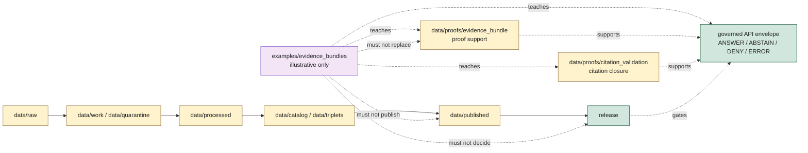

<!-- [KFM_META_BLOCK_V2]
doc_id: kfm://doc/examples/evidence-bundles/readme
title: EvidenceBundle Examples README
type: standard
version: v0.1.0
status: draft
owners: TODO(owner): examples steward; TODO(owner): evidence steward; TODO(owner): proof steward; TODO(owner): docs steward
created: NEEDS VERIFICATION - greenfield stub existed before 2026-06-30 expansion
updated: 2026-06-30
policy_label: public-review
related: [../README.md, ../../data/proofs/README.md, ../../data/proofs/evidence_bundle/README.md, ../../data/proofs/citation_validation/README.md, ../../data/proofs/proof_pack/README.md, ../../docs/architecture/governed-api.md, ../../docs/doctrine/directory-rules.md]
tags: [kfm, examples, evidence-bundle, evidenceref, proof-support, cite-or-abstain, fixtures, non-authoritative]
notes: ["This README replaces a greenfield stub at `examples/evidence_bundles/README.md`.", "Examples are illustrative and review aids only; canonical proof support belongs under `data/proofs/` and release decisions belong under `release/`.", "README presence does not prove example files, validators, schemas, fixtures, CI checks, or governed API route behavior exist."]
[/KFM_META_BLOCK_V2] -->

<a id="top"></a>

# EvidenceBundle Examples

Illustrative EvidenceBundle examples for showing claim support, EvidenceRef resolution, citation closure, finite outcomes, and trust-membrane behavior without becoming proof authority.

<p>
  
  
  
  
  
</p>

**Status:** draft / example-lane guidance  
**Owners:** `TODO(owner): examples steward` · `TODO(owner): evidence steward` · `TODO(owner): proof steward` · `TODO(owner): docs steward`  
**Path:** `examples/evidence_bundles/README.md`  
**Quick links:** [Scope](#scope) · [Path posture](#path-posture) · [Repo fit](#repo-fit) · [Accepted material](#accepted-material) · [Exclusions](#exclusions) · [Example contract](#example-contract) · [Lifecycle relationship](#lifecycle-relationship) · [Suggested layout](#suggested-layout) · [Validation checklist](#validation-checklist) · [Evidence ledger](#evidence-ledger)

> [!IMPORTANT]
> Files under `examples/evidence_bundles/` are examples. They are not canonical EvidenceBundles, proof packs, citation-validation records, source records, release decisions, policy decisions, public payloads, or governed API responses. If an example is useful enough to become operational, promote it through the proper responsibility root and keep the example copy synthetic or clearly fixture-scoped.

---

## Scope

`examples/evidence_bundles/` is a documentation and review aid for showing how EvidenceBundle-like material should behave in KFM.

Use this lane to demonstrate:

- how an `EvidenceRef` should resolve to EvidenceBundle support;
- how a claim keeps source role, spatial scope, temporal scope, rights posture, sensitivity posture, review state, release state, and limitation text visible;
- how citation validation supports cite-or-abstain behavior;
- how `ANSWER`, `ABSTAIN`, `DENY`, and `ERROR` outcomes differ;
- how examples should avoid direct public reads from RAW, WORK, QUARANTINE, PROCESSED, internal catalog, proof, receipt, source-registry, or review stores;
- how sensitive examples should use synthetic, redacted, generalized, or clearly non-real data.

This folder should make reviewers faster. It should not become a shortcut around schemas, validators, proof lanes, release gates, or policy review.

---

## Path posture

The target file existed as a greenfield stub:

```text
examples/evidence_bundles/README.md
```

Current placement evidence:

- `examples/README.md` describes examples as walkthroughs and example assemblies.
- `data/proofs/README.md` identifies `data/proofs/` as proof-support responsibility root.
- `data/proofs/evidence_bundle/README.md` identifies `data/proofs/evidence_bundle/` as the parent EvidenceBundle proof-family lane.
- `data/proofs/citation_validation/README.md` identifies citation-validation proof support as a separate proof-family lane.
- `data/proofs/proof_pack/README.md` identifies ProofPack support as release-grade proof support, not release authority.
- `docs/architecture/governed-api.md` states that public clients must use governed API envelopes, not direct internal store reads.
- Directory Rules list `examples/` as an examples root and `data/` as the lifecycle/proof/receipt/registry root.

Therefore this README treats `examples/evidence_bundles/` as **CONFIRMED path presence / DRAFT example-lane guidance / NON-AUTHORITATIVE by placement**.

---

## Repo fit

| Responsibility | Correct home | Boundary |
|---|---|---|
| Example EvidenceBundle snippets and walkthrough payloads | `examples/evidence_bundles/` | This lane. Illustrative only. |
| Canonical or operational EvidenceBundle proof support | [`../../data/proofs/evidence_bundle/`](../../data/proofs/evidence_bundle/README.md) | Proof-family lane, not examples. |
| Domain proof support | `data/proofs/<domain>/` | Domain-specific proof support, if present and accepted. |
| Citation validation support | [`../../data/proofs/citation_validation/`](../../data/proofs/citation_validation/README.md) | Citation closure and cite-or-abstain support. |
| ProofPack support | [`../../data/proofs/proof_pack/`](../../data/proofs/proof_pack/README.md) | Release-grade proof support; still not release authority. |
| Raw, work, quarantine, processed, catalog, triplet, published lifecycle artifacts | `data/<phase>/...` | Examples may reference shapes, but must not store operational artifacts. |
| Release decisions | `release/` | ReleaseManifest, PromotionDecision, rollback, correction, withdrawal, and signatures. |
| Schemas | `schemas/contracts/v1/...` | Machine shape. Examples must not create parallel schema authority. |
| Contracts | `contracts/...` | Semantic object meaning. Examples must not define object contracts. |
| Policy | `policy/...` | Admissibility and sensitivity decisions. Examples must not define policy. |
| Validators, tests, fixtures | `tools/validators/`, `tests/`, `fixtures/` | Operational validation and fixture strategy. Examples may point to these after verification. |
| Governed API runtime | `apps/governed-api/` if confirmed | Runtime boundary; examples are not route implementations. |

---

## Accepted material

Accepted files should be small, reviewable, synthetic or safely redacted, and clearly marked as examples.

| Accepted item | Use | Required markings |
|---|---|---|
| Minimal example bundle | Show the smallest evidence-supported claim shape. | `example: true`, synthetic IDs, no real sensitive coordinates. |
| Negative outcome example | Show `ABSTAIN`, `DENY`, or `ERROR` behavior. | Explicit reason code and no substantive restricted claim. |
| Claim-to-bundle walkthrough | Explain how a claim resolves to evidence support. | Links or IDs must be illustrative unless verified. |
| Citation closure example | Show how citation validation might pass, warn, hold, deny, or error. | Must not imply validator implementation unless verified. |
| Evidence Drawer example | Show governed UI payload shape at a high level. | Must state that public UI consumes governed projections, not this folder. |
| Redaction/generalization example | Show sensitivity-safe public representation patterns. | Use synthetic data or obviously generalized geometries. |
| README or notes | Explain example scope, limitations, and expected validator behavior. | Include evidence boundary and non-authority warning. |

Examples may use JSON, YAML, Markdown, or small tabular snippets when useful. Keep examples deterministic and easy to diff.

---

## Exclusions

| Do not place here | Correct home or action |
|---|---|
| Real RAW source payloads, source downloads, scans, extracts, or source-system mirrors | `data/raw/`, `data/work/`, or `data/quarantine/` depending on state |
| Operational EvidenceBundles, proof indexes, citation-validation records, validation reports, or ProofPacks | `data/proofs/` under the accepted proof-family or domain lane |
| Process receipts, AI receipts, transform receipts, policy-decision receipts, or validation receipts | `data/receipts/` or accepted receipt lanes |
| Catalog records, triplets, graph exports, or release candidates | `data/catalog/`, `data/triplets/`, or `release/candidates/` as appropriate |
| ReleaseManifest, PromotionDecision, RollbackCard, CorrectionNotice, WithdrawalNotice, release signatures, or changelog entries | `release/` |
| Published PMTiles, GeoParquet, reports, stories, API payloads, screenshots, or public downloads | `data/published/` after release gates |
| Contracts, schemas, policy bundles, validators, tests, fixtures, apps, packages, or pipeline code | Their canonical responsibility roots |
| Exact sensitive locations, living-person data, DNA/genomic records, archaeology site locations, rare species locations, critical infrastructure detail, private land/parcel joins, credentials, secrets, or proprietary terms | Quarantine, restrict, redact, generalize, synthesize, or deny |
| Generated summaries presented as evidence | Governed AI surfaces may cite evidence; generated text is not evidence |

---

## Example contract

Every example in this lane should answer five questions without claiming operational maturity:

| Question | Expected answer |
|---|---|
| What claim is being illustrated? | A bounded example claim with spatial, temporal, source-role, and limitation context. |
| What evidence supports it? | Synthetic or clearly marked sample `EvidenceRef` and EvidenceBundle-like members. |
| What policy posture applies? | `allow`, `restrict`, `hold`, `deny`, or `abstain` as illustrative policy outcome, not actual policy authority. |
| What release posture applies? | Example release reference or `not_released`; examples do not publish. |
| What should a public client do? | Render only governed `ANSWER`, `ABSTAIN`, `DENY`, or `ERROR` envelopes from the governed API, not this folder. |

Illustrative JSON should include a visible marker like this:

```json
{
  "example": true,
  "authority": "non_authoritative_example",
  "do_not_publish": true,
  "claim_id": "kfm://example/claim/NEEDS-VERIFICATION",
  "outcome": "ABSTAIN",
  "reason": "illustrative example only; EvidenceBundle schema and validator behavior NEEDS VERIFICATION"
}
```

> [!WARNING]
> Do not copy example IDs, example coordinates, example release refs, or example policy decisions into operational data. Examples are allowed to teach shape and failure behavior; they are not allowed to certify facts.

---

## Lifecycle relationship



The examples lane is outside the lifecycle spine. It can illustrate the spine, but it cannot become a phase of the spine.

---

## Suggested layout

This tree is **PROPOSED**. Confirm actual examples, schema paths, test strategy, and validator expectations before adding files.

```text
examples/evidence_bundles/
├── README.md
├── minimal/
│   ├── README.md
│   └── minimal.evidence-bundle.example.json
├── outcomes/
│   ├── answer.example.json
│   ├── abstain.example.json
│   ├── deny.example.json
│   └── error.example.json
├── sensitivity/
│   ├── generalized-location.example.json
│   └── redacted-sensitive-claim.example.json
└── walkthroughs/
    └── claim-to-evidence-bundle.md
```

Recommended file naming:

| Pattern | Use |
|---|---|
| `*.example.json` | Non-authoritative JSON example. |
| `*.example.yaml` | Non-authoritative YAML example. |
| `README.md` | Local explanation and boundaries. |
| `*.walkthrough.md` | Narrative walkthrough, not operational proof. |

---

## Validation checklist

Before adding or changing examples here, verify:

- [ ] The file is marked as an example and non-authoritative.
- [ ] The file contains no real sensitive coordinates, living-person data, DNA/genomic data, archaeology site locations, rare species locations, critical infrastructure detail, private parcel joins, secrets, credentials, or proprietary terms.
- [ ] The example does not create schema, contract, policy, proof, receipt, release, or source-registry authority.
- [ ] Any IDs are synthetic or clearly marked `NEEDS VERIFICATION`.
- [ ] Any claim with evidence dependency demonstrates cite-or-abstain behavior.
- [ ] Any public-facing example uses a governed finite outcome: `ANSWER`, `ABSTAIN`, `DENY`, or `ERROR`.
- [ ] Any sensitive example uses redacted, generalized, aggregated, synthetic, or denied output.
- [ ] Relative links from this README still resolve.
- [ ] Operational fixtures, if needed, are placed under the accepted test/fixture strategy rather than silently becoming examples.

---

## Status notes

| Item | Status | Notes |
|---|---:|---|
| Target path presence | CONFIRMED | `examples/evidence_bundles/README.md` existed as a greenfield stub before this update. |
| Examples root | CONFIRMED README | `examples/README.md` describes walkthroughs and example assemblies. |
| EvidenceBundle proof-family lane | CONFIRMED README | `data/proofs/evidence_bundle/README.md` defines parent EvidenceBundle proof support. |
| Citation-validation lane | CONFIRMED README | `data/proofs/citation_validation/README.md` defines citation closure and cite-or-abstain support. |
| ProofPack lane | CONFIRMED README | `data/proofs/proof_pack/README.md` defines release-grade proof support, not release authority. |
| Governed API doctrine | CONFIRMED architecture doc | Public clients use governed finite-outcome envelopes and do not read internal stores directly. |
| Example payload inventory | UNKNOWN | This edit did not verify child files beyond this README. |
| EvidenceBundle schema, validators, fixtures, CI checks, route behavior | NEEDS VERIFICATION | No runtime or validation enforcement was proven by this README. |
| Public release readiness | DENY | Examples cannot publish, prove, or release claims. |

---

## Evidence ledger

| Source | Status | Supports | Limits |
|---|---|---|---|
| Previous target file | CONFIRMED | Target existed as a greenfield stub. | Did not define boundaries, accepted material, or exclusions. |
| [`../README.md`](../README.md) | CONFIRMED README | `examples/` is for walkthroughs and example assemblies. | It is short and does not define EvidenceBundle example details. |
| [`../../data/proofs/README.md`](../../data/proofs/README.md) | CONFIRMED README | Proof support belongs under `data/proofs/` and does not replace release, catalog, receipts, schemas, contracts, or policy. | Does not prove emitted proof inventories or validators. |
| [`../../data/proofs/evidence_bundle/README.md`](../../data/proofs/evidence_bundle/README.md) | CONFIRMED README | EvidenceBundle proof-family boundary, EvidenceRef closure, cite-or-abstain posture, no public direct access. | Global schema, validators, route behavior, and inventory remain NEEDS VERIFICATION. |
| [`../../data/proofs/citation_validation/README.md`](../../data/proofs/citation_validation/README.md) | CONFIRMED README | Citation-validation proof-family boundary and finite negative-state behavior. | Does not prove validator implementation. |
| [`../../data/proofs/proof_pack/README.md`](../../data/proofs/proof_pack/README.md) | CONFIRMED README | ProofPack is release-grade support, not release authority. | Does not prove ProofPack instances or release linkage. |
| [`../../docs/architecture/governed-api.md`](../../docs/architecture/governed-api.md) | CONFIRMED architecture doc | Governed API finite outcomes and no direct public reads from internal stores. | Endpoint catalogue and runtime implementation remain PROPOSED / NEEDS VERIFICATION. |
| [`../../docs/doctrine/directory-rules.md`](../../docs/doctrine/directory-rules.md) | CONFIRMED doctrine | Responsibility-root placement, examples root, data lifecycle, proof/release separation. | Some path claims remain PROPOSED / NEEDS VERIFICATION per the doctrine's own notes. |

[Back to top](#top)
