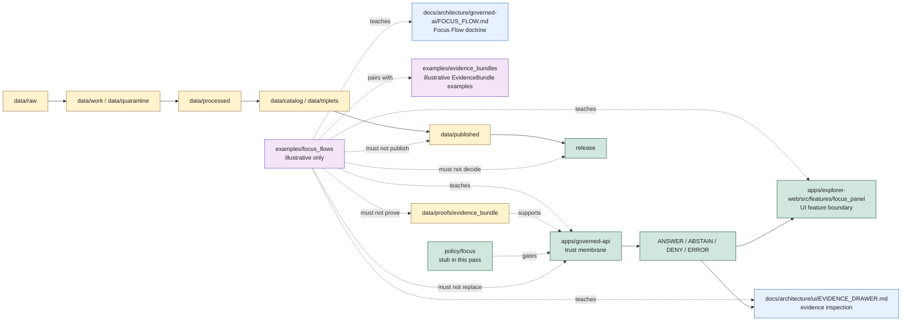

<!-- [KFM_META_BLOCK_V2]
doc_id: kfm://doc/examples/focus-flows/readme
title: Focus Flow Examples README
type: standard
version: v0.1.0
status: draft
owners: TODO(owner): examples steward; TODO(owner): Focus Mode steward; TODO(owner): governed API steward; TODO(owner): governed AI steward; TODO(owner): evidence steward; TODO(owner): policy steward; TODO(owner): UI steward; TODO(owner): docs steward
created: NEEDS VERIFICATION - greenfield stub existed before 2026-06-30 expansion
updated: 2026-06-30
policy_label: public-review
related: [../README.md, ../evidence_bundles/README.md, ../../docs/architecture/governed-ai/FOCUS_FLOW.md, ../../docs/architecture/governed-api.md, ../../docs/architecture/ui/EVIDENCE_DRAWER.md, ../../apps/explorer-web/src/features/focus_panel/README.md, ../../apps/governed-api/README.md, ../../policy/focus/README.md, ../../data/proofs/evidence_bundle/README.md, ../../docs/doctrine/directory-rules.md]
tags: [kfm, examples, focus-mode, focus-flow, governed-ai, governed-api, evidence-drawer, finite-outcomes, evidence-bundle, evidenceref, citation-validation, ai-receipt, no-browser-model, non-authoritative, fixtures, cite-or-abstain]
notes: ["This README replaces a greenfield stub at `examples/focus_flows/README.md`.", "Focus-flow examples are illustrative and review aids only; Focus Flow doctrine lives under `docs/architecture/governed-ai/FOCUS_FLOW.md`, UI feature boundaries live under `apps/explorer-web/src/features/focus_panel/`, and runtime/API implementation belongs under `apps/governed-api/` or ADR-resolved implementation roots.", "Examples must not become route implementations, runtime traces, model prompts, EvidenceBundles, proofs, receipts, release decisions, policy decisions, schemas, contracts, tests, or public payloads by placement.", "README presence does not prove example files, validators, schemas, fixtures, CI checks, governed API route behavior, Focus Panel wiring, AIReceipt emission, citation validation, or executable `policy/focus/` behavior."]
[/KFM_META_BLOCK_V2] -->

<a id="top"></a>

# Focus Flow Examples

Illustrative Focus Mode flow examples for showing governed request behavior, finite outcomes, Evidence Drawer handoffs, cite-or-abstain behavior, policy denial, citation failure, and safe negative states without becoming runtime authority.

<p>
  
  
  
  
  
</p>

**Status:** draft / example-lane guidance  
**Owners:** `TODO(owner): examples steward` · `TODO(owner): Focus Mode steward` · `TODO(owner): governed API steward` · `TODO(owner): governed AI steward` · `TODO(owner): evidence steward` · `TODO(owner): policy steward` · `TODO(owner): UI steward` · `TODO(owner): docs steward`  
**Path:** `examples/focus_flows/README.md`  
**Quick links:** [Scope](#scope) · [Path posture](#path-posture) · [Repo fit](#repo-fit) · [Accepted material](#accepted-material) · [Exclusions](#exclusions) · [Example contract](#example-contract) · [Focus-flow guardrails](#focus-flow-guardrails) · [Lifecycle relationship](#lifecycle-relationship) · [Suggested layout](#suggested-layout) · [Validation checklist](#validation-checklist) · [Status notes](#status-notes) · [Evidence ledger](#evidence-ledger)

> [!IMPORTANT]
> Files under `examples/focus_flows/` are examples. They are not Focus Mode route implementations, governed API responses, model traces, prompt logs, EvidenceBundles, ProofPacks, citation-validation reports, AIReceipts, policy decisions, release decisions, public payloads, schemas, contracts, validators, fixtures, or tests. If an example becomes operationally useful, promote the operational version through the correct responsibility root and keep this copy synthetic or clearly fixture-scoped.

---

## Scope

`examples/focus_flows/` is a documentation and review aid for showing how Focus Mode should behave at the trust membrane.

Use this lane to demonstrate:

- how a bounded `FocusModeRequest` should move through governed API, policy precheck, EvidenceRef-to-EvidenceBundle resolution, model adapter, citation validation, policy postcheck, and finite response-envelope assembly;
- how `ANSWER`, `ABSTAIN`, `DENY`, and `ERROR` examples differ;
- how Evidence Drawer handoffs should preserve evidence support and limitations;
- how policy denial and sensitive-lane fail-closed behavior should look without leaking restricted detail;
- how missing, stale, conflicting, or citation-failed evidence should produce `ABSTAIN`, not a weaker answer;
- how schema, adapter, resolver, or infrastructure failure should produce `ERROR`, not invented content;
- how examples should avoid direct public reads from RAW, WORK, QUARANTINE, PROCESSED, unpublished CATALOG/TRIPLET, proof stores, receipt stores, source registries, model runtimes, graph/vector stores, or canonical/internal stores;
- how examples should use synthetic, generalized, redacted, or clearly non-real data.

This folder should make reviewers faster. It should not become a shortcut around governed API implementation, schemas, validators, policy review, EvidenceBundle support, release gates, or tests.

---

## Path posture

The target file existed as a greenfield stub:

```text
examples/focus_flows/README.md
```

Current placement evidence:

- `examples/README.md` describes examples as walkthroughs and example assemblies, including focus mock flows.
- `examples/evidence_bundles/README.md` establishes the local examples pattern: illustrative, non-authoritative, and not proof or release authority by placement.
- `docs/architecture/governed-ai/FOCUS_FLOW.md` defines the Focus Mode request-to-envelope flow and says there is no browser-to-model shortcut and no answer without resolved EvidenceBundles and citation validation.
- `apps/explorer-web/src/features/focus_panel/README.md` defines the Focus Panel as a UI feature boundary that submits bounded Focus requests through governed API and renders finite outcomes.
- `docs/architecture/governed-api.md` defines the governed API as the public trust membrane and the finite-outcome path for public clients.
- `docs/architecture/ui/EVIDENCE_DRAWER.md` defines Evidence Drawer as a governed UI trust panel that consumes EvidenceBundle-derived projections rather than becoming an evidence store.
- `policy/focus/README.md` is currently a greenfield bundle stub, so executable Focus policy remains `NEEDS VERIFICATION`.
- Directory Rules treat root placement as authority-bearing: examples can demonstrate behavior, but operational artifacts belong in their owning roots.

Therefore this README treats `examples/focus_flows/` as **CONFIRMED path presence / DRAFT example-lane guidance / NON-AUTHORITATIVE by placement**.

---

## Repo fit

| Responsibility | Correct home | Boundary |
|---|---|---|
| Example Focus Mode walkthroughs and synthetic flow payloads | `examples/focus_flows/` | This lane. Illustrative only. |
| Example EvidenceBundle snippets used by Focus examples | [`../evidence_bundles/`](../evidence_bundles/README.md) | Example lane only; not proof authority. |
| Focus Flow doctrine | [`../../docs/architecture/governed-ai/FOCUS_FLOW.md`](../../docs/architecture/governed-ai/FOCUS_FLOW.md) | Architecture and governance boundary. |
| Focus Panel UI feature boundary | [`../../apps/explorer-web/src/features/focus_panel/`](../../apps/explorer-web/src/features/focus_panel/README.md) | UI feature source and finite-state rendering when implemented. |
| Governed API runtime boundary | [`../../apps/governed-api/`](../../apps/governed-api/README.md) | Trust membrane and route behavior when implemented. |
| Evidence Drawer architecture | [`../../docs/architecture/ui/EVIDENCE_DRAWER.md`](../../docs/architecture/ui/EVIDENCE_DRAWER.md) | UI evidence inspection architecture. |
| Operational EvidenceBundle support | [`../../data/proofs/evidence_bundle/`](../../data/proofs/evidence_bundle/README.md) | Proof-family lane, not examples. |
| Focus policy | [`../../policy/focus/`](../../policy/focus/README.md) | Current stub only; executable policy remains unverified. |
| AI/runtime receipts | `data/receipts/ai/` or accepted receipt home | Process memory; examples may point to synthetic refs only. |
| Schemas | `schemas/contracts/v1/focus/`, `schemas/contracts/v1/runtime/`, `schemas/contracts/v1/ui/` | Machine shape; examples must not create schema authority. |
| Contracts | `contracts/...` | Semantic object meaning; examples must not define contracts. |
| Tests and fixtures | `tests/`, `fixtures/` | Operational validation strategy; examples are not tests by placement. |
| Release decisions | `release/` | ReleaseManifest, PromotionDecision, rollback, correction, withdrawal, signatures. |

---

## Accepted material

Accepted files should be small, reviewable, synthetic or safely redacted, and clearly marked as examples.

| Accepted item | Use | Required markings |
|---|---|---|
| Outcome examples | Demonstrate `ANSWER`, `ABSTAIN`, `DENY`, and `ERROR` response behavior. | `example: true`, `authority: non_authoritative_example`, `do_not_publish: true`. |
| Flow walkthroughs | Explain request-to-envelope behavior step by step. | Synthetic IDs and explicit implementation boundary. |
| Negative-state examples | Show policy denial, citation failure, unresolved evidence, stale evidence, source conflict, adapter error, or schema error. | No substantive restricted claim and a visible reason code. |
| Evidence Drawer handoff examples | Show how Focus answer spans could link to evidence inspection. | Must state that UI consumes governed projections, not this folder. |
| Sensitive-boundary examples | Show safe `DENY` or generalized alternatives for sensitive lanes. | No exact restricted locations, exposure hints, or reconstructive detail. |
| Accessibility/state examples | Show UI states, keyboard/screen-reader expectations, and non-color trust labels. | Non-runtime example status and no component implementation claim. |
| README or notes | Explain example scope, limitations, and expected validator behavior. | Include evidence boundary and non-authority warning. |

Examples may use JSON, YAML, Markdown, or small tabular snippets. Keep examples deterministic, synthetic, easy to diff, and visibly non-authoritative.

---

## Exclusions

| Do not place here | Correct home or action |
|---|---|
| Real Focus API responses, production payloads, route fixtures, route handlers, DTOs, middleware, adapter code, or runtime traces | `apps/governed-api/`, `apps/explorer-web/`, `tests/`, `fixtures/`, or accepted implementation roots |
| Model prompts, raw prompt logs, raw model outputs, hidden reasoning, chain-of-thought, provider transcripts, model runtime files, or adapter internals | Runtime/receipt roots only where policy permits; never example truth |
| Operational EvidenceBundles, proof indexes, ProofPacks, citation-validation records, or proof manifests | `data/proofs/` under accepted proof-family or domain lanes |
| AIReceipts, RunReceipts, TransformReceipts, PolicyDecision receipts, validation receipts, telemetry receipts, or rollback receipts | `data/receipts/` or accepted receipt lanes |
| RAW, WORK, QUARANTINE, PROCESSED, CATALOG, TRIPLET, PUBLISHED, REGISTRY, or ROLLBACK lifecycle payloads | `data/<phase>/...` under lifecycle rules |
| SourceDescriptor, source registry, rights registry, sensitivity registry, layer registry, or release registry records | `data/registry/`, `control_plane/`, or ADR-resolved homes |
| ReleaseManifest, PromotionDecision, RollbackCard, CorrectionNotice, WithdrawalNotice, release signatures, or changelog entries | `release/` |
| Contracts, schemas, policy bundles, validators, tests, fixtures, apps, packages, pipelines, or workflows | Their canonical responsibility roots |
| Exact sensitive locations, living-person data, DNA/genomic records, archaeology site locations, rare species locations, critical infrastructure detail, private land/parcel joins, credentials, secrets, proprietary terms, or reconstructive redaction clues | Quarantine, restrict, redact, generalize, synthesize, or deny |
| Generated summaries presented as evidence | Governed AI surfaces may cite evidence; generated text is not evidence |

---

## Example contract

Every example in this lane should answer eight questions without claiming operational maturity:

| Question | Expected answer |
|---|---|
| What Focus scenario is being illustrated? | A bounded, synthetic scenario with map/time/layer/feature or non-map context. |
| What request is being illustrated? | A synthetic `FocusModeRequest`-like sketch, not a runtime request. |
| What evidence support is implied? | Synthetic or example `EvidenceRef` / EvidenceBundle-like refs, with cite-or-abstain posture. |
| What policy posture applies? | `allow`, `deny`, `restrict`, `hold`, `abstain`, or `error` as illustrative policy state, not actual policy authority. |
| What citation behavior applies? | Pass/fail/hold example only; no validator implementation claim. |
| What outcome should render? | Exactly one of `ANSWER`, `ABSTAIN`, `DENY`, or `ERROR`. |
| What should the UI show? | Finite state, citations or reason code, Evidence Drawer handoff where allowed, and safe limitations. |
| What must not happen? | No direct model call, no direct data-root read, no restricted-detail leak, no public publication by example. |

Illustrative JSON should include a visible marker like this:

```json
{
  "example": true,
  "authority": "non_authoritative_example",
  "do_not_publish": true,
  "scenario_id": "kfm://example/focus-flow/NEEDS-VERIFICATION",
  "surface": "focus_mode",
  "expected_outcome": "ABSTAIN",
  "reason": "illustrative example only; Focus route, schema, policy, validator, and receipt behavior NEEDS VERIFICATION",
  "forbidden_use": [
    "runtime_response",
    "model_trace",
    "proof_record",
    "receipt_record",
    "policy_decision",
    "release_artifact"
  ]
}
```

> [!WARNING]
> Do not copy example IDs, example coordinates, example request IDs, example evidence refs, example policy decisions, example release refs, or example answer text into operational data. Examples are allowed to teach flow shape and failure behavior; they are not allowed to certify facts.

---

## Focus-flow guardrails

| Risk | Guardrail |
|---|---|
| Example becomes runtime authority | Keep examples visibly synthetic and non-authoritative; operational Focus behavior belongs under apps, schemas, policy, tests, fixtures, receipts, proofs, and release roots. |
| Browser-to-model shortcut | Every example must show the browser going through governed API or explicitly mark direct model calls as forbidden. |
| Scope becomes proof | Map camera, visible layers, clicked features, user selection, and time locks may scope a request; they do not prove a claim. |
| Claim without evidence | Claim-bearing `ANSWER` examples must show EvidenceRef/EvidenceBundle support and citation validation; otherwise the example should render `ABSTAIN`. |
| Citation failure becomes weak answer | Citation-failed examples must end in `ABSTAIN` or safe negative state, not partial truth. |
| Sensitive lane leaks | Archaeology, rare species, living-person, DNA/genomic, cultural, sovereignty, infrastructure, private land, and exact-location examples fail closed by default. |
| Policy bypass | Policy precheck and postcheck must be represented in examples that touch sensitive or claim-bearing content. |
| AIReceipt overclaim | AIReceipt-like refs are process memory, not proof, release, or truth authority. |
| Telemetry leakage | Telemetry examples must not include prompt text, raw evidence, restricted geometry, secrets, or full bundle copies. |
| Accessibility omission | Trust-bearing examples should include non-color labels and keyboard/screen-reader considerations where UI behavior is illustrated. |
| Hidden reasoning leakage | Do not include chain-of-thought or model-private reasoning. Show answer support, cited evidence, limitations, and finite outcome reasons. |

---

## Lifecycle relationship



The examples lane is outside the lifecycle spine. It can illustrate the spine, but it cannot become a phase of the spine.

---

## Suggested layout

This tree is **PROPOSED**. Confirm actual examples, schema paths, test strategy, and validator expectations before adding files.

```text
examples/focus_flows/
├── README.md
├── outcomes/
│   ├── answer.example.json
│   ├── abstain.example.json
│   ├── deny.example.json
│   └── error.example.json
├── walkthroughs/
│   ├── claim-question-to-answer.walkthrough.md
│   ├── evidence-unresolved-to-abstain.walkthrough.md
│   ├── sensitive-lane-to-deny.walkthrough.md
│   └── adapter-failure-to-error.walkthrough.md
├── drawer-handoffs/
│   └── answer-span-to-evidence-drawer.example.json
├── sensitive-boundaries/
│   ├── archaeology-deny.example.json
│   ├── rare-species-deny.example.json
│   ├── living-person-deny.example.json
│   └── infrastructure-deny.example.json
└── ui-states/
    ├── loading.example.json
    ├── validating.example.json
    ├── citation-failed.example.json
    ├── stale-evidence.example.json
    └── cancelled.example.json
```

Recommended file naming:

| Pattern | Use |
|---|---|
| `*.example.json` | Non-authoritative JSON example. |
| `*.example.yaml` | Non-authoritative YAML example. |
| `*.walkthrough.md` | Narrative walkthrough, not operational proof. |
| `README.md` | Local explanation and boundaries. |

---

## Validation checklist

Before adding or changing examples here, verify:

- [ ] The file is marked as an example and non-authoritative.
- [ ] The file contains no real sensitive coordinates, living-person data, DNA/genomic data, archaeology site locations, rare species locations, critical infrastructure detail, private parcel joins, secrets, credentials, proprietary terms, or reconstructive redaction clues.
- [ ] The example does not create schema, contract, policy, proof, receipt, release, source-registry, route, model-runtime, fixture, or test authority.
- [ ] Any IDs are synthetic or clearly marked `NEEDS VERIFICATION`.
- [ ] Any claim-bearing `ANSWER` demonstrates EvidenceRef/EvidenceBundle support, citation validation, policy allow, release/review posture, limitations, and Evidence Drawer handoff.
- [ ] Any evidence-missing, stale, conflicting, or citation-failed example renders `ABSTAIN`.
- [ ] Any sensitive, rights-unclear, role-forbidden, unreleased, or restricted example renders `DENY` or a safely generalized non-sensitive alternative.
- [ ] Any malformed request, schema issue, adapter failure, resolver outage, or infrastructure failure renders `ERROR` without claim leakage.
- [ ] Any public-facing example uses exactly one governed finite outcome: `ANSWER`, `ABSTAIN`, `DENY`, or `ERROR`.
- [ ] Any telemetry example excludes prompt text, raw evidence, restricted geometry, full EvidenceBundle contents, secrets, credentials, and model-private reasoning.
- [ ] Relative links from this README still resolve.
- [ ] Operational fixtures, if needed, are placed under the accepted test/fixture strategy rather than silently becoming examples.

---

## Status notes

| Item | Status | Notes |
|---|---:|---|
| Target path presence | CONFIRMED | `examples/focus_flows/README.md` existed as a greenfield stub before this update. |
| Examples root | CONFIRMED README | `examples/README.md` describes walkthroughs and example assemblies, including focus mock flows. |
| EvidenceBundle examples pattern | CONFIRMED README | `examples/evidence_bundles/README.md` defines the example-lane non-authority pattern. |
| Focus Flow doctrine | CONFIRMED architecture doc | `docs/architecture/governed-ai/FOCUS_FLOW.md` defines the governed request-to-envelope path and finite outcomes. |
| Focus Panel feature boundary | CONFIRMED README | `apps/explorer-web/src/features/focus_panel/README.md` defines Focus Panel as governed UI feature boundary and blocks direct model/internal-store access. |
| Governed API architecture | CONFIRMED architecture doc | `docs/architecture/governed-api.md` defines governed API as the trust membrane and finite-outcome path. |
| Governed API app README | CONFIRMED README | `apps/governed-api/README.md` defines the intended executable trust-membrane app boundary while marking runtime maturity gaps. |
| Evidence Drawer architecture | CONFIRMED architecture doc | `docs/architecture/ui/EVIDENCE_DRAWER.md` defines governed evidence inspection and rejects direct browser access to canonical evidence stores. |
| Focus policy bundle | CONFIRMED stub | `policy/focus/README.md` is a greenfield bundle stub; executable policy remains unverified. |
| Example payload inventory | UNKNOWN | This edit did not verify child files beyond this README. |
| Focus schemas, validators, fixtures, CI checks, route behavior, AIReceipt emission, citation validation, policy enforcement | NEEDS VERIFICATION | No runtime or validation enforcement was proven by this README. |
| Public release readiness | DENY | Examples cannot publish, prove, release, or answer claims. |

---

## Evidence ledger

| Source | Status | Supports | Limits |
|---|---|---|---|
| Previous target file | CONFIRMED | Target existed as a greenfield stub. | Did not define boundaries, accepted material, or exclusions. |
| [`../README.md`](../README.md) | CONFIRMED README | `examples/` is for walkthroughs and example assemblies, including focus mock flows. | It is short and status `PROPOSED`. |
| [`../evidence_bundles/README.md`](../evidence_bundles/README.md) | CONFIRMED README | Establishes non-authoritative example-lane pattern, accepted material, exclusions, finite outcomes, and no-public-path behavior. | It covers EvidenceBundle examples, not Focus Flow examples directly. |
| [`../../docs/architecture/governed-ai/FOCUS_FLOW.md`](../../docs/architecture/governed-ai/FOCUS_FLOW.md) | CONFIRMED architecture doc | Focus Mode request-to-envelope doctrine, no browser-to-model shortcut, EvidenceBundle resolution, citation validation, policy gates, finite outcomes. | Implementation specifics remain PROPOSED / NEEDS VERIFICATION in that doc. |
| [`../../apps/explorer-web/src/features/focus_panel/README.md`](../../apps/explorer-web/src/features/focus_panel/README.md) | CONFIRMED README | Focus Panel UI boundary, finite states, governed API-only posture, no direct model/internal store access, Evidence Drawer handoffs. | Implementation files, route wiring, schemas, tests, fixtures, telemetry, and accessibility remain NEEDS VERIFICATION. |
| [`../../docs/architecture/governed-api.md`](../../docs/architecture/governed-api.md) | CONFIRMED architecture doc | Governed API as trust membrane, finite outcomes, public clients do not read internal stores directly. | Endpoint catalogue and runtime implementation remain PROPOSED / NEEDS VERIFICATION. |
| [`../../apps/governed-api/README.md`](../../apps/governed-api/README.md) | CONFIRMED README | Intended governed API app boundary and finite `RuntimeResponseEnvelope` posture. | Route handlers, DTOs, middleware, authorization, deployment, logs, dashboards, and CI pass state remain UNKNOWN / NEEDS VERIFICATION. |
| [`../../docs/architecture/ui/EVIDENCE_DRAWER.md`](../../docs/architecture/ui/EVIDENCE_DRAWER.md) | CONFIRMED architecture doc | Evidence Drawer consumes governed evidence projections and does not become source/proof/policy/release authority. | Implementation maturity remains UNKNOWN / PROPOSED in that doc. |
| [`../../data/proofs/evidence_bundle/README.md`](../../data/proofs/evidence_bundle/README.md) | CONFIRMED README | EvidenceBundle proof-family lane supports EvidenceRef closure, cite-or-abstain, citation validation, governed answers, and no direct public access. | Schema, validators, route behavior, inventory, and CI enforcement remain NEEDS VERIFICATION. |
| [`../../policy/focus/README.md`](../../policy/focus/README.md) | CONFIRMED stub | Focus policy path exists. | Only a greenfield stub; no executable policy was proven. |
| [`../../docs/doctrine/directory-rules.md`](../../docs/doctrine/directory-rules.md) | CONFIRMED doctrine | Responsibility-root placement, examples root, data lifecycle, trust membrane, proof/release separation, no topic-as-authority shortcut. | Some path claims remain PROPOSED / NEEDS VERIFICATION per the doctrine's own notes. |
| [`../../SKELETON_MAP.md`](../../SKELETON_MAP.md) | CONFIRMED scaffold map | Mentions examples as walkthroughs and Focus mock tests in the greenfield skeleton orientation. | Skeleton map is scaffold context, not implementation proof. |

[Back to top](#top)
