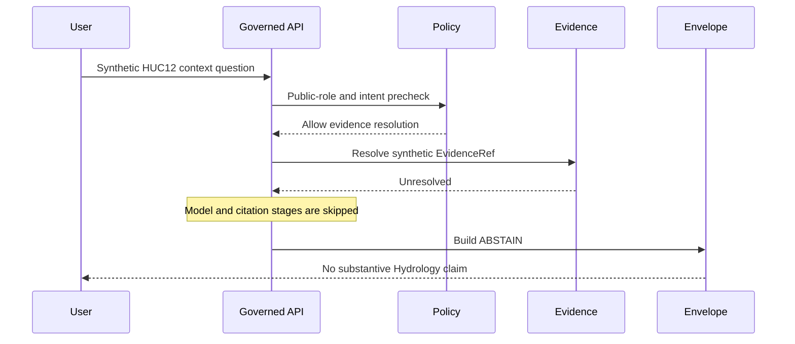

<!-- [KFM_META_BLOCK_V2]
doc_id: kfm://example/focus-flow/hydrology-huc12-question
title: Hydrology HUC12 Focus Question Example
type: example; static-walkthrough; non-authoritative
version: v0.2.0
status: STATIC_WALKTHROUGH; synthetic; expected-ABSTAIN; do-not-publish
owners: NEEDS VERIFICATION — examples, Focus Mode, governed API, Hydrology, evidence, policy, UI, and docs stewards
updated: 2026-07-24
supersedes: v0.1.1 at the same path; no runtime, evidence, policy, release, or publication state
prepared_under_prompt: KFM Markdown Engineering, Modernization & GitHub Documentation Implementation Agent v5.0.0
review_packet_id: kfm-md-examples-wave-20260724
current_path: examples/focus_flows/hydrology_huc12_question.md
evidence_snapshot:
  repository: bartytime4life/Kansas-Frontier-Matrix
  base_commit: fe9442ef01ed676e11ccea2796c6fe4090dd1e7e
  prior_blob: b9e2eb3f8ee58f24d310a47d26a3aef9a6f901ce
notes:
  - "Synthetic example only; no real HUC12, hydrologic condition, warning, or regulatory claim."
[/KFM_META_BLOCK_V2] -->

<a id="top"></a>

# Hydrology HUC12 Focus Question Example

> **Scenario.** A public user selects a released public-safe HUC12 context feature and asks what KFM can safely summarize.

[](#validation)
[](#expected-result)
[](#authority-boundary)

> [!CAUTION]
> This example is not a flood warning, emergency alert, observed-inundation claim, water-rights conclusion, regulatory determination, engineering analysis, or live water-condition report.

## Scenario

Question:

> What hydrology context can KFM safely summarize for this HUC12?

All identifiers, geometry, timestamps, release references, and evidence references are synthetic. The example does not identify a real watershed.

## Authority boundary

This file is not a Focus API fixture, runtime response, model prompt, EvidenceBundle, ProofPack, receipt, policy decision, release record, published layer, or Hydrology fact sheet.

HUC/WBD context, gauge observations, NFHL regulatory context, modeled hydrographs, forecasts/warnings, and emergency guidance are distinct source roles and must not collapse.

## Synthetic request

```json
{
  "example": true,
  "authority": "non_authoritative_example",
  "do_not_publish": true,
  "maturity": "STATIC_WALKTHROUGH",
  "scenario_id": "kfm://example/focus-flow/hydrology-huc12-question",
  "question": "What hydrology context can KFM safely summarize for this HUC12?",
  "user_role": "public",
  "selected_feature": {
    "feature_ref": "kfm://example/feature/hydrology/huc12/SYNTHETIC",
    "feature_type": "HUCUnit",
    "release_state": "synthetic_example_only"
  },
  "evidence_refs": [
    {
      "evidence_ref": "kfm://example/evidence-ref/hydrology/huc12-context/SYNTHETIC",
      "resolution_state": "synthetic_unresolved"
    }
  ],
  "forbidden_intents": [
    "current flood warning",
    "emergency or evacuation guidance",
    "official regulatory determination",
    "water-rights conclusion",
    "engineering advice"
  ]
}
```

## Governed walkthrough

| Stage | Static example result | Boundary |
|---|---|---|
| Request scope | `PASS_EXAMPLE` | Public-safe HUC12 context only. |
| Schema check | `NEEDS VERIFICATION` | No runtime schema execution occurred. |
| Policy precheck | `ALLOW_TO_RESOLVE_EXAMPLE` | Emergency/restricted intent would deny. |
| Evidence resolution | `UNRESOLVED` | Synthetic EvidenceRef has no operational EvidenceBundle. |
| Model adapter | `SKIPPED` | No evidence, no model call. |
| Citation validation | `SKIPPED` | No substantive cited spans. |
| Envelope assembly | `ABSTAIN` | Cite-or-abstain blocks a claim. |



## Expected result

```json
{
  "example": true,
  "authority": "non_authoritative_example",
  "do_not_publish": true,
  "outcome": "ABSTAIN",
  "reason_code": "EVIDENCE_BUNDLE_UNRESOLVED_EXAMPLE",
  "message": "This static example cannot support a Hydrology answer because its evidence reference is synthetic and unresolved.",
  "evidence_drawer": {
    "enabled": false,
    "reason": "no operational EvidenceBundle"
  }
}
```

A real `ANSWER` would require released HUC12 context, resolvable evidence, source-role separation, citation validation, policy allow, a non-emergency scope, and a governed Evidence Drawer handoff.

## Negative states

| Condition | Required outcome |
|---|---|
| Evidence missing, stale, conflicting, or citation-invalid | `ABSTAIN` |
| Emergency, restricted, or role-forbidden intent | `DENY` |
| Schema, resolver, adapter, or infrastructure failure | `ERROR` |
| Unreleased or policy-held context | `HOLD` or `ABSTAIN` |

## Hydrology guardrails

- HUC12 context is not current flow, flood, drought, water-quality, or regulatory truth.
- Gauge observations require site, unit, datum, observation time, retrieval time, qualifier, and evidence support.
- NFHL is regulatory hazard context, not observed inundation.
- Modeled hydrographs remain model outputs.
- KFM does not issue warnings, evacuation, rescue, dam-operation, engineering, or life-safety guidance.

## Validation

- `PASS`: complete file read and source-level Markdown/JSON/Mermaid review.
- `PASS`: all IDs and values are visibly synthetic.
- `PASS`: expected finite outcome is internally consistent.
- `NOT_RUN`: Focus schema, route, policy, evidence resolver, model adapter, citation validator, UI, and runtime tests.
- `NOT_RUN`: host rendering and accessibility execution.

## Correction and rollback

Update or mark this walkthrough `STALE` when Focus, Hydrology, evidence, policy, release, or finite-envelope contracts change. Roll back to prior blob `b9e2eb3f8ee58f24d310a47d26a3aef9a6f901ce`.

## Evidence ledger

| Evidence | Supports | Limit |
|---|---|---|
| [`README.md`](README.md) | Example-lane contract and finite-outcome boundary. | Not runtime proof. |
| [Focus Flow doctrine](../../docs/architecture/governed-ai/FOCUS_FLOW.md) | Governed request path and no browser-to-model shortcut. | Implementation remains bounded. |
| [Hydrology doctrine](../../docs/domains/hydrology/README.md) | HUC/source-role and not-emergency-system boundaries. | Synthetic refs do not resolve. |
| [EvidenceBundle lane](../../data/proofs/evidence_bundle/README.md) | EvidenceRef resolution and cite-or-abstain posture. | No operational bundle verified. |

<p align="right"><a href="#top">Back to top</a></p>
