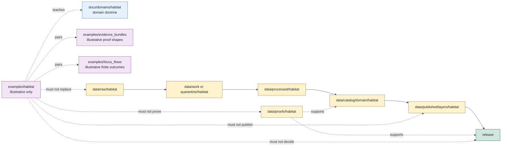

<!-- [KFM_META_BLOCK_V2]
doc_id: kfm://doc/examples/habitat/readme
title: Habitat Examples README
type: standard
version: v0.1.0
status: draft
owners: TODO(owner): examples steward; TODO(owner): habitat steward; TODO(owner): ecology data steward; TODO(owner): evidence steward; TODO(owner): policy steward; TODO(owner): release steward; TODO(owner): docs steward
created: NEEDS VERIFICATION - blank file existed before 2026-06-30 expansion
updated: 2026-06-30
policy_label: public-review
related: [../README.md, ../evidence_bundles/README.md, ../focus_flows/README.md, ../../docs/domains/habitat/README.md, ../../data/raw/habitat/README.md, ../../data/work/habitat/README.md, ../../data/processed/habitat/README.md, ../../data/catalog/domain/habitat/README.md, ../../data/proofs/habitat/README.md, ../../data/published/layers/habitat/README.md, ../../docs/doctrine/directory-rules.md]
tags: [kfm, examples, habitat, ecology, land-cover, ecoregions, habitat-patch, suitability, connectivity, restoration-opportunity, geoprivacy, sensitive-joins, evidence-bundle, finite-outcomes, non-authoritative, cite-or-abstain]
notes: ["This README replaces a blank file at `examples/habitat/README.md`.", "Habitat examples are illustrative and review aids only; operational Habitat data belongs under `data/<phase>/habitat/`, proofs under `data/proofs/`, release decisions under `release/`, and executable validation under `tests/`, `fixtures/`, or `tools/validators/` as appropriate.", "Examples must not become Habitat truth, species occurrence truth, critical-habitat designation, public layer authority, proof authority, receipt authority, policy authority, release authority, or direct AI output authority by placement.", "README presence does not prove example files, schemas, validators, fixtures, CI checks, governed API route behavior, public layer payloads, or Habitat release readiness."]
[/KFM_META_BLOCK_V2] -->

<a id="top"></a>

# Habitat Examples

Illustrative Habitat examples for teaching KFM reviewers how Habitat context, land-cover inputs, ecoregion context, suitability models, connectivity/corridor sketches, restoration-opportunity concepts, sensitive joins, EvidenceBundle support, and finite public outcomes should behave without becoming operational authority.

<p>
  
  
  
  
  
</p>

**Status:** draft / example-lane guidance  
**Owners:** `TODO(owner): examples steward` · `TODO(owner): habitat steward` · `TODO(owner): ecology data steward` · `TODO(owner): evidence steward` · `TODO(owner): policy steward` · `TODO(owner): release steward` · `TODO(owner): docs steward`  
**Path:** `examples/habitat/README.md`  
**Quick links:** [Scope](#scope) · [Path posture](#path-posture) · [Repo fit](#repo-fit) · [Accepted material](#accepted-material) · [Exclusions](#exclusions) · [Example contract](#example-contract) · [Habitat guardrails](#habitat-guardrails) · [Lifecycle relationship](#lifecycle-relationship) · [Suggested layout](#suggested-layout) · [Validation checklist](#validation-checklist) · [Status notes](#status-notes) · [Evidence ledger](#evidence-ledger)

> [!IMPORTANT]
> Files under `examples/habitat/` are examples. They are not Habitat source data, working data, processed data, catalog records, triplets, EvidenceBundles, ProofPacks, receipts, policy decisions, release decisions, published layers, fixtures, validators, governed API responses, Focus Mode answers, or Evidence Drawer payloads. If an example becomes operationally useful, promote the operational version through the correct responsibility root and keep this copy synthetic or clearly fixture-scoped.

> [!CAUTION]
> Habitat examples must not expose exact sensitive occurrence joins, rare-species context, rare-plant context, archaeology adjacency, private land/parcel joins, critical infrastructure context, or stewardship-sensitive details. Use synthetic, generalized, redacted, delayed, aggregated, or denied examples by default.

---

## Scope

`examples/habitat/` is a documentation and review aid for Habitat-domain examples.

Use this lane to demonstrate:

- how Habitat examples should preserve source role: `observed`, `regulatory`, `modeled`, `aggregate`, `administrative`, `candidate`, or `synthetic`;
- how a HabitatPatch, land-cover example, ecoregion context, suitability-model sketch, connectivity/corridor example, restoration-opportunity sketch, or stewardship-zone example should keep limitations visible;
- how Habitat joins to Fauna, Flora, Soil, Hydrology, Hazards, Agriculture, Archaeology, Spatial Foundation, and People/Land should preserve owning-lane truth;
- how sensitive Habitat-Fauna or Habitat-Flora examples should fail closed unless geoprivacy, policy, evidence, release, correction, and rollback posture are represented;
- how EvidenceRef/EvidenceBundle support, citation validation, redaction/generalization, policy decisions, release state, correction path, and rollback target should be discussed without creating those records here;
- how `ANSWER`, `ABSTAIN`, `DENY`, and `ERROR` public outcomes may be illustrated with synthetic payloads;
- how examples should avoid direct public reads from RAW, WORK, QUARANTINE, PROCESSED, unpublished CATALOG/TRIPLET, proof stores, receipt stores, source registries, model runtimes, graph/vector stores, or canonical/internal stores.

This folder should make reviewers faster. It should not become a shortcut around lifecycle data lanes, source descriptors, schemas, contracts, validators, proof lanes, release gates, policy review, or governed API behavior.

---

## Path posture

The target file existed as a blank file:

```text
examples/habitat/README.md
```

Current placement evidence:

- `examples/README.md` describes `examples/` as walkthroughs and example assemblies.
- `examples/evidence_bundles/README.md` establishes the local non-authoritative example-lane pattern.
- `examples/focus_flows/README.md` establishes finite-outcome Focus examples as illustrative, not runtime behavior.
- `docs/domains/habitat/README.md` defines Habitat as the landscape lane for habitat patches, classes, suitability, connectivity, corridors, restoration opportunity, and stewardship zones, while keeping species occurrence truth outside Habitat.
- `data/raw/habitat/README.md`, `data/work/habitat/README.md`, `data/processed/habitat/README.md`, `data/catalog/domain/habitat/README.md`, `data/proofs/habitat/README.md`, and `data/published/layers/habitat/README.md` each define operational homes that this examples lane must not replace.

Therefore this README treats `examples/habitat/` as **CONFIRMED path presence / DRAFT example-lane guidance / NON-AUTHORITATIVE by placement**.

---

## Repo fit

| Responsibility | Correct home | Boundary |
|---|---|---|
| Habitat example snippets, synthetic walkthroughs, and non-authoritative demonstration payloads | `examples/habitat/` | This lane. Illustrative only. |
| Example EvidenceBundle snippets used by Habitat examples | [`../evidence_bundles/`](../evidence_bundles/README.md) | Example lane only; not proof authority. |
| Example Focus Mode or governed-answer flows involving Habitat | [`../focus_flows/`](../focus_flows/README.md) | Example lane only; not runtime or API behavior. |
| Habitat domain doctrine | [`../../docs/domains/habitat/`](../../docs/domains/habitat/README.md) | Human-facing domain authority. |
| Habitat RAW source captures | [`../../data/raw/habitat/`](../../data/raw/habitat/README.md) | Immutable source-capture lane; no public path. |
| Habitat WORK intermediates | [`../../data/work/habitat/`](../../data/work/habitat/README.md) | Working normalization lane; no public path. |
| Habitat PROCESSED artifacts | [`../../data/processed/habitat/`](../../data/processed/habitat/README.md) | Validated upstream data; not public by default. |
| Habitat catalog records | [`../../data/catalog/domain/habitat/`](../../data/catalog/domain/habitat/README.md) | CATALOG-stage records; release-gated. |
| Habitat proof support | [`../../data/proofs/habitat/`](../../data/proofs/habitat/README.md) and `data/proofs/evidence_bundle/` | Proof lanes; examples do not prove claims. |
| Habitat published layers | [`../../data/published/layers/habitat/`](../../data/published/layers/habitat/README.md) | Released public-safe layer artifacts only. |
| Habitat release decisions | `release/` | ReleaseManifest, PromotionDecision, correction, withdrawal, rollback, signatures. |
| Habitat schemas/contracts/policy | `schemas/`, `contracts/`, `policy/` | Machine shape, semantic meaning, and admissibility authority. Examples must not define these. |
| Tests, fixtures, validators, apps, packages, pipelines | `tests/`, `fixtures/`, `tools/validators/`, `apps/`, `packages/`, `pipelines/` | Operational implementation and enforcement roots. |

---

## Accepted material

Accepted files should be small, reviewable, synthetic or safely redacted, and visibly marked as examples.

| Accepted item | Use | Required markings |
|---|---|---|
| Synthetic HabitatPatch walkthrough | Show patch identity, class, source role, evidence refs, limitations, and release posture. | `example: true`, synthetic geometry, no sensitive joins. |
| Land-cover context example | Show source-vintage, class scheme, crosswalk, uncertainty, and non-truth warnings. | Preserve native/source class and mark crosswalk as illustrative. |
| Ecoregion context example | Show landscape context without implying species occurrence or suitability. | Synthetic ID and context-only label. |
| Suitability-model example | Show model input/support/uncertainty and finite outcome behavior. | Must state suitability is not occurrence truth or critical habitat. |
| Connectivity/corridor example | Show derived corridor/connectivity interpretation and limitations. | No movement/pathway truth without evidence. |
| Restoration-opportunity example | Show opportunity framing and stewardship caveats. | Must not become prescription, legal advice, or land-management instruction. |
| Sensitive-join negative example | Show `DENY` or generalized `ABSTAIN` behavior for rare species, rare plants, or exact occurrence joins. | No exact restricted coordinates or reconstruction clues. |
| Evidence Drawer / Focus example note | Show how governed UI might explain support and limitations. | Must state public UI consumes governed projections, not this folder. |

Examples may use Markdown, JSON, YAML, or tiny tabular snippets. Keep examples deterministic and easy to diff.

---

## Exclusions

| Do not place here | Correct home or action |
|---|---|
| Real RAW source payloads, downloads, rasters, vectors, agency exports, source logs, or source-system mirrors | `data/raw/habitat/` or quarantine/work lanes as appropriate |
| WORK transforms, QA outputs, notebooks, raster/vector repairs, class crosswalk drafts, model tuning outputs, or redaction trials | `data/work/habitat/` |
| Quarantined rights/source-role/sensitivity/release-unclear material | `data/quarantine/habitat/` |
| Validated processed Habitat artifacts | `data/processed/habitat/` |
| Habitat catalog records, STAC/DCAT/PROV records, triplets, graph exports, or release candidates | `data/catalog/`, `data/triplets/`, or `release/candidates/` as appropriate |
| EvidenceBundles, ProofPacks, citation-validation records, validation reports, or proof indexes | `data/proofs/` |
| Run, transform, model, validation, policy, AI, telemetry, release, correction, or rollback receipts | `data/receipts/` |
| Published PMTiles, GeoParquet, GeoJSON, COGs, reports, stories, API payloads, screenshots, or public downloads | `data/published/` after release gates |
| ReleaseManifest, PromotionDecision, RollbackCard, CorrectionNotice, WithdrawalNotice, signatures, or changelog entries | `release/` |
| Contracts, schemas, policy bundles, validators, tests, fixtures, apps, packages, pipelines, connectors, or workflows | Their canonical responsibility roots |
| Exact sensitive locations, rare-species or rare-plant joins, archaeology/burial/sacred-site adjacency, critical infrastructure detail, private parcel joins, living-person data, secrets, credentials, or proprietary terms | Quarantine, restrict, redact, generalize, synthesize, or deny |
| Generated summaries presented as evidence | Governed AI surfaces may cite evidence; generated text is not evidence |

---

## Example contract

Every example in this lane should answer eight questions without claiming operational maturity:

| Question | Expected answer |
|---|---|
| What Habitat scenario is illustrated? | A bounded synthetic scenario such as land-cover context, patch context, ecoregion context, suitability, connectivity, restoration opportunity, or sensitive join. |
| Which object family is involved? | HabitatPatch, LandCoverObservation, EcoregionSnapshot, EcologicalSystem, SuitabilityModel, ConnectivityEdge, Corridor, RestorationOpportunity, StewardshipZone, or an explicitly synthetic teaching object. |
| What source role applies? | One of `observed`, `regulatory`, `modeled`, `aggregate`, `administrative`, `candidate`, or `synthetic`; roles do not collapse. |
| What evidence support is implied? | Synthetic or clearly marked sample EvidenceRef/EvidenceBundle-like refs, with cite-or-abstain posture. |
| What policy posture applies? | `allow`, `restrict`, `hold`, `deny`, `abstain`, or `error` as an illustrative policy state, not actual policy authority. |
| What release posture applies? | Example release reference or `not_released`; examples do not publish. |
| What public outcome should render? | Exactly one of `ANSWER`, `ABSTAIN`, `DENY`, or `ERROR` when public behavior is illustrated. |
| What must not happen? | No occurrence truth, critical-habitat truth, management prescription, public layer, proof, receipt, release, or policy decision by example placement. |

Illustrative JSON should include a visible marker like this:

```json
{
  "example": true,
  "authority": "non_authoritative_example",
  "do_not_publish": true,
  "domain": "habitat",
  "example_id": "kfm://example/habitat/NEEDS-VERIFICATION",
  "source_role": "synthetic",
  "expected_outcome": "ABSTAIN",
  "reason": "illustrative example only; Habitat evidence, policy, release, schema, route, and validator behavior NEEDS VERIFICATION"
}
```

> [!WARNING]
> Do not copy example IDs, example coordinates, example source roles, example evidence refs, example release refs, example policy decisions, or example generated text into operational data. Examples teach shape and failure behavior; they do not certify facts.

---

## Habitat guardrails

| Risk | Guardrail |
|---|---|
| Suitability becomes occurrence truth | Suitability surfaces are model/context outputs, not species occurrence records. |
| Habitat patch becomes critical habitat | Habitat patches and modeled habitat areas are not regulatory critical-habitat designations unless a regulatory source and release support that specific role. |
| Land cover becomes Habitat truth | Land-cover class is evidence/context. It does not prove suitability, quality, species presence, restoration priority, crop truth, soil truth, hydrology truth, or regulatory truth by itself. |
| Connectivity becomes movement truth | Connectivity/corridor examples are derived interpretations unless separately supported by evidence and policy. |
| Restoration opportunity becomes prescription | Restoration examples are review aids, not land-management instructions, legal advice, or stewardship decisions. |
| Species or plant truth collapses into Habitat | Fauna owns animal occurrence truth; Flora owns plant/specimen/rare-plant truth. Habitat may cite governed context only. |
| Sensitive joins leak | Rare species, rare plants, exact occurrence joins, archaeology adjacency, private land, and infrastructure-sensitive joins fail closed unless generalized, redacted, restricted, delayed, or denied. |
| Example becomes proof | This directory is outside the lifecycle/proof/release spine and cannot prove, publish, or release claims. |
| AI becomes authority | AI-generated habitat summaries are downstream carriers; EvidenceBundle, policy, review, and release state outrank generated language. |

---

## Lifecycle relationship



The examples lane is outside the lifecycle spine. It can illustrate lifecycle behavior, but it cannot become RAW, WORK, QUARANTINE, PROCESSED, CATALOG, TRIPLET, PUBLISHED, proof, receipt, registry, or release authority.

---

## Suggested layout

This tree is **PROPOSED**. Confirm actual examples, schema paths, fixture strategy, and validator expectations before adding files.

```text
examples/habitat/
├── README.md
├── patches/
│   └── synthetic-habitat-patch.example.json
├── land-cover/
│   ├── land-cover-context.example.json
│   └── class-crosswalk-limitation.walkthrough.md
├── ecoregions/
│   └── ecoregion-context.example.json
├── suitability/
│   ├── suitability-not-occurrence.example.json
│   └── citation-failed-abstain.example.json
├── sensitive-joins/
│   ├── rare-species-deny.example.json
│   ├── rare-plant-deny.example.json
│   └── generalized-habitat-context.example.json
├── restoration/
│   └── opportunity-not-prescription.example.json
└── walkthroughs/
    └── habitat-context-to-evidence-drawer.walkthrough.md
```

Recommended file naming:

| Pattern | Use |
|---|---|
| `*.example.json` | Non-authoritative JSON example. |
| `*.example.yaml` | Non-authoritative YAML example. |
| `*.walkthrough.md` | Narrative walkthrough, not operational proof. |
| `README.md` | Local explanation and boundaries. |

---

## Validation checklist

Before adding or changing examples here, verify:

- [ ] The file is marked as an example and non-authoritative.
- [ ] The file contains no real sensitive coordinates, rare-species/rare-plant localities, archaeology/burial/sacred-site clues, private parcel joins, infrastructure-sensitive detail, living-person data, secrets, credentials, proprietary terms, or reconstruction clues.
- [ ] The example does not create schema, contract, policy, proof, receipt, release, source-registry, route, model-runtime, fixture, validator, or test authority.
- [ ] Any IDs are synthetic or clearly marked `NEEDS VERIFICATION`.
- [ ] Any claim-bearing `ANSWER` example demonstrates EvidenceRef/EvidenceBundle support, citation validation, policy allow, release/review posture, limitations, correction path, and rollback posture.
- [ ] Any evidence-missing, stale, conflicting, or citation-failed example renders `ABSTAIN`.
- [ ] Any sensitive, rights-unclear, role-forbidden, unreleased, or restricted example renders `DENY` or a safely generalized non-sensitive alternative.
- [ ] Any suitability, connectivity, restoration, or model example preserves the model/context boundary.
- [ ] Any cross-domain example preserves owning-lane truth for Fauna, Flora, Soil, Hydrology, Agriculture, Hazards, Archaeology, Spatial Foundation, People/Land, and infrastructure context.
- [ ] Relative links from this README still resolve.
- [ ] Operational fixtures, if needed, are placed under the accepted test/fixture strategy rather than silently becoming examples.

---

## Status notes

| Item | Status | Notes |
|---|---:|---|
| Target path presence | CONFIRMED | `examples/habitat/README.md` existed as a blank file before this update. |
| Examples root | CONFIRMED README | `examples/README.md` describes walkthroughs and example assemblies. |
| EvidenceBundle examples pattern | CONFIRMED README | `examples/evidence_bundles/README.md` defines non-authoritative example-lane behavior. |
| Habitat domain doctrine | CONFIRMED README | `docs/domains/habitat/README.md` defines Habitat scope, ownership boundaries, source roles, sensitive joins, and governed AI posture. |
| Habitat RAW lane | CONFIRMED README | `data/raw/habitat/README.md` defines RAW as no-public-path source capture. |
| Habitat WORK lane | CONFIRMED README | `data/work/habitat/README.md` defines WORK as no-public-path intermediate normalization and review preparation. |
| Habitat PROCESSED lane | CONFIRMED README | `data/processed/habitat/README.md` defines processed Habitat artifacts as upstream of catalog, triplet, publication, and release. |
| Habitat catalog lane | CONFIRMED README | `data/catalog/domain/habitat/README.md` defines CATALOG-stage records as release-gated and not truth/public by placement. |
| Habitat proof lane | CONFIRMED README | `data/proofs/habitat/README.md` defines proof support as separate from public exposure and release authority. |
| Habitat published layer lane | CONFIRMED README | `data/published/layers/habitat/README.md` defines released public-safe layer artifacts and child lane posture. |
| Example payload inventory | UNKNOWN | This edit did not verify child files beyond this README. |
| Schemas, validators, fixtures, CI checks, policy enforcement, governed route behavior, release linkage | NEEDS VERIFICATION | No runtime or validation enforcement was proven by this README. |
| Public release readiness | DENY | Examples cannot publish, prove, release, or answer claims. |

---

## Evidence ledger

| Source | Status | Supports | Limits |
|---|---|---|---|
| Previous target file | CONFIRMED | Target existed as a blank file. | Did not define boundaries, accepted material, or exclusions. |
| [`../README.md`](../README.md) | CONFIRMED README | `examples/` is for walkthroughs and example assemblies. | It is short and status `PROPOSED`. |
| [`../evidence_bundles/README.md`](../evidence_bundles/README.md) | CONFIRMED README | Establishes non-authoritative examples, finite outcomes, proof separation, and no-public-path behavior. | Covers EvidenceBundle examples, not Habitat examples directly. |
| [`../../docs/domains/habitat/README.md`](../../docs/domains/habitat/README.md) | CONFIRMED doctrine / PROPOSED implementation | Habitat scope, object families, source-role anti-collapse, sensitive joins, cross-lane ownership, governed AI behavior, and path-form conflict notes. | Implementation maturity remains PROPOSED / NEEDS VERIFICATION. |
| [`../../data/raw/habitat/README.md`](../../data/raw/habitat/README.md) | CONFIRMED README | RAW Habitat source capture is no-public-path and preserves source role, rights, sensitivity, and source families. | Does not prove payloads, SourceDescriptors, connectors, or release readiness. |
| [`../../data/work/habitat/README.md`](../../data/work/habitat/README.md) | CONFIRMED README | WORK Habitat lane is no-public-path intermediate normalization and sensitive-join review. | Does not prove validators, payloads, or policy enforcement. |
| [`../../data/processed/habitat/README.md`](../../data/processed/habitat/README.md) | CONFIRMED README | Processed Habitat artifacts remain upstream of catalog/triplet/publication/release and must not be normal public sources. | Actual child inventory and runtime enforcement remain NEEDS VERIFICATION. |
| [`../../data/catalog/domain/habitat/README.md`](../../data/catalog/domain/habitat/README.md) | CONFIRMED README | Habitat catalog records are CATALOG-stage carriers, release-gated, and not truth/public by placement. | Catalog inventory, schemas, validators, access controls, and route behavior remain NEEDS VERIFICATION. |
| [`../../data/proofs/habitat/README.md`](../../data/proofs/habitat/README.md) | CONFIRMED README | Habitat proof lane supports validation, evidence closure, policy decisions, release review, correction, and rollback. | Proof schemas, validators, CI, and emitted artifacts remain UNKNOWN / NEEDS VERIFICATION. |
| [`../../data/published/layers/habitat/README.md`](../../data/published/layers/habitat/README.md) | CONFIRMED README | Published layer lane is for released public-safe Habitat layer artifacts, not release/proof/source/AI authority. | Concrete released payloads and route behavior remain NEEDS VERIFICATION. |
| [`../../docs/doctrine/directory-rules.md`](../../docs/doctrine/directory-rules.md) | CONFIRMED doctrine | Responsibility-root placement, compatibility-root controls, lifecycle/trust separation, and no topic-as-authority shortcut. | Some path claims remain PROPOSED / NEEDS VERIFICATION per the doctrine's own notes. |

[Back to top](#top)
