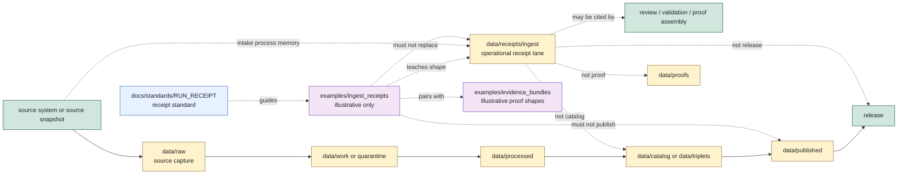

<!-- [KFM_META_BLOCK_V2]
doc_id: kfm://doc/examples/ingest-receipts/readme
title: Ingest Receipt Examples README
type: standard
version: v0.1.0
status: draft
owners: TODO(owner): examples steward; TODO(owner): receipt steward; TODO(owner): ingest steward; TODO(owner): source steward; TODO(owner): evidence steward; TODO(owner): policy steward; TODO(owner): docs steward
created: NEEDS VERIFICATION - greenfield stub existed before 2026-06-30 expansion
updated: 2026-06-30
policy_label: public-review
related: [../README.md, ../evidence_bundles/README.md, ../../data/receipts/README.md, ../../data/receipts/ingest/README.md, ../../data/receipts/validation/README.md, ../../docs/standards/RUN_RECEIPT.md, ../../docs/adr/ADR-0011-receipts-vs-proofs-vs-manifests-vs-catalog-separation.md, ../../docs/doctrine/directory-rules.md]
tags: [kfm, examples, ingest-receipts, receipts, source-intake, run-receipt, sourcedescriptor, source-role, source-head, policy-decision, quarantine-routing, non-authoritative, process-memory, cite-or-abstain]
notes: ["This README replaces a greenfield stub at `examples/ingest_receipts/README.md`.", "Ingest receipt examples are illustrative and review aids only; operational ingest receipt process memory belongs under `data/receipts/ingest/` or another ADR-accepted receipt lane.", "Examples must not become emitted receipts, RAW source payloads, SourceDescriptor authority, proof authority, catalog closure, policy authority, release authority, public artifacts, governed API responses, or source truth by placement.", "README presence does not prove example payload inventory, schemas, validators, fixtures, CI checks, signing, source activation, policy enforcement, evidence closure, correction hooks, rollback hooks, release integration, or governed route behavior."]
[/KFM_META_BLOCK_V2] -->

<a id="top"></a>

# Ingest Receipt Examples

Illustrative source-intake receipt examples for showing KFM receipt shape, source-head capture, source-role preservation, admission decisions, quarantine routing, policy handoffs, and finite negative outcomes without becoming operational process memory or source authority.

<p>
  
  
  
  
  
</p>

**Status:** draft / example-lane guidance  
**Owners:** `TODO(owner): examples steward` · `TODO(owner): receipt steward` · `TODO(owner): ingest steward` · `TODO(owner): source steward` · `TODO(owner): evidence steward` · `TODO(owner): policy steward` · `TODO(owner): docs steward`  
**Path:** `examples/ingest_receipts/README.md`  
**Quick links:** [Scope](#scope) · [Path posture](#path-posture) · [Repo fit](#repo-fit) · [Accepted material](#accepted-material) · [Exclusions](#exclusions) · [Example contract](#example-contract) · [Ingest receipt guardrails](#ingest-receipt-guardrails) · [Lifecycle relationship](#lifecycle-relationship) · [Suggested layout](#suggested-layout) · [Validation checklist](#validation-checklist) · [Status notes](#status-notes) · [Evidence ledger](#evidence-ledger)

> [!IMPORTANT]
> Files under `examples/ingest_receipts/` are examples. They are not emitted ingest receipts, RunReceipts, source-intake records, SourceDescriptors, RAW source captures, validation receipts, EvidenceBundles, ProofPacks, catalog records, policy decisions, release decisions, public payloads, governed API responses, test fixtures, validators, or CI outputs.

> [!CAUTION]
> Ingest receipt examples must not include real credentials, private tokens, full API responses, restricted coordinates, exact sensitive localities, private-party details, consent tokens, revocation tokens, steward-only review notes, or unsupported source-as-authority claims. Use synthetic IDs, redacted source heads, fake hashes, and clearly marked non-authoritative payloads.

---

## Scope

`examples/ingest_receipts/` is a documentation and review aid for teaching how ingest/source-intake receipt examples should look and fail safely.

Use this lane to demonstrate:

- how an ingest run might record source URL or provider URI, source-head metadata, retrieval time, source time, source role, source descriptor reference, digest, actor/runner identity, and handoff state;
- how intake examples should preserve source-role boundaries instead of upgrading an observed, regulatory, modeled, aggregate, administrative, candidate, advisory, interpretation, or synthetic source into another role by example convenience;
- how policy, validation, rights, citation, sensitivity, review, quarantine, correction, rollback, and release references may be represented as illustrative references without becoming those authority objects;
- how `PASS`, `WARN`, `FAIL`, `DENY`, `ABSTAIN`, `HOLD`, `QUARANTINE`, and `ERROR` examples differ;
- how missing source role, missing rights, missing SourceDescriptor, stale source head, digest mismatch, unsupported citation, sensitive geometry, or resolver failure should route to a finite negative outcome;
- how examples should avoid direct public reads from RAW, WORK, QUARANTINE, PROCESSED, unpublished CATALOG/TRIPLET, proof stores, receipt stores, source registries, model runtimes, graph/vector stores, or canonical/internal stores.

This folder should make reviewers faster. It should not become a shortcut around operational receipts, source registry, schemas, validators, proof lanes, policy review, release gates, or governed API behavior.

---

## Path posture

The target file existed as a greenfield stub:

```text
examples/ingest_receipts/README.md
```

Current placement evidence:

- `examples/README.md` describes `examples/` as walkthroughs and example assemblies, including source intake.
- `data/receipts/README.md` defines receipts as process memory and says receipt does not equal proof, catalog, or publication.
- `data/receipts/ingest/README.md` is the operational ingest receipt parent lane for source-intake process memory.
- `data/receipts/validation/README.md` defines validation receipt process memory separately from proof, catalog, policy, release, and public output.
- `docs/standards/RUN_RECEIPT.md` defines RunReceipt as the governed-run receipt standard and places receipts under `data/receipts/`.
- `docs/adr/ADR-0011-receipts-vs-proofs-vs-manifests-vs-catalog-separation.md` is proposed and states `receipt != proof != catalog != publication`.
- Directory Rules list `data/receipts/ingest/` under the data lifecycle tree and define receipts as process memory, not proof of release by themselves.

Therefore this README treats `examples/ingest_receipts/` as **CONFIRMED path presence / DRAFT example-lane guidance / NON-AUTHORITATIVE by placement**.

---

## Repo fit

| Responsibility | Correct home | Boundary |
|---|---|---|
| Ingest receipt example snippets and walkthroughs | `examples/ingest_receipts/` | This lane. Illustrative only. |
| Operational ingest receipt process memory | [`../../data/receipts/ingest/`](../../data/receipts/ingest/README.md) | Receipt authority for ingest/source-intake process memory. |
| Parent receipt guidance | [`../../data/receipts/`](../../data/receipts/README.md) | Receipt family root; process memory only. |
| Validation receipt examples or operational validation receipts | Examples stay here only as synthetic snippets; operational receipts go under [`../../data/receipts/validation/`](../../data/receipts/validation/README.md) or accepted receipt lanes. | Do not collapse ingest and validation authority. |
| Example EvidenceBundle snippets used beside receipt examples | [`../evidence_bundles/`](../evidence_bundles/README.md) | Example lane only; not proof authority. |
| RunReceipt standard | [`../../docs/standards/RUN_RECEIPT.md`](../../docs/standards/RUN_RECEIPT.md) | Standard guidance; exact schemas and enforcement remain `NEEDS VERIFICATION` where not proven. |
| RAW source captures | `data/raw/<domain>/<source_id>/<run_id>/` | Payload authority; examples must not store source bytes. |
| Source registry / SourceDescriptor authority | `data/registry/sources/` or accepted registry home | Source identity and activation authority, not examples. |
| Proof support | `data/proofs/` | EvidenceBundle, ProofPack, citation validation, integrity support. |
| Catalog records | `data/catalog/` | STAC/DCAT/PROV/domain catalog records. |
| Release decisions | `release/` | ReleaseManifest, PromotionDecision, rollback, correction, withdrawal, signatures. |
| Schemas, contracts, policy, validators, tests, fixtures | `schemas/`, `contracts/`, `policy/`, `tools/validators/`, `tests/`, `fixtures/` | Separate responsibility roots. Examples must not define or enforce them. |

---

## Accepted material

Accepted files should be small, synthetic, reviewable, and visibly marked as examples.

| Accepted item | Use | Required markings |
|---|---|---|
| Minimal source-intake receipt example | Show source head, SourceDescriptor ref, source role, digest, runner identity, outcome, and handoff state. | `example: true`, fake hashes, synthetic refs, no source payload. |
| Negative intake examples | Show `HOLD`, `DENY`, `ABSTAIN`, `QUARANTINE`, or `ERROR` behavior. | Explicit reason code and no sensitive details. |
| Source-head sketch | Show ETag/Last-Modified/content-length/source commit style fields. | Synthetic values and no provider secret. |
| Quarantine-routing walkthrough | Explain why an intake attempt routes to quarantine or review. | No raw data, private notes, or restricted geometry. |
| Rights/citation posture example | Show how rights/citation uncertainty blocks downstream use. | `rights_state: NEEDS_VERIFICATION` or equivalent. |
| Policy handoff example | Show illustrative policy state and obligations. | Not a PolicyDecision authority record. |
| Digest/checksum demonstration | Teach hash pinning behavior. | Fake digest values or tiny synthetic payload digests. |
| Public-summary example | Show a redacted review-safe summary of intake state. | Must not include raw payload, secrets, exact sensitive locations, or private identifiers. |

Examples may use JSON, YAML, Markdown, or small tables. Keep examples deterministic and easy to diff.

---

## Exclusions

| Do not place here | Correct home or action |
|---|---|
| Operational RunReceipts, ingest receipts, source-intake records, receipt manifests, checksums, DSSE/cosign sidecars, or receipt indexes | `data/receipts/ingest/` or accepted receipt lanes |
| Real source feeds, occurrence payloads, agency snapshots, source-native records, full API responses, or restricted source payloads | `data/raw/` or governed restricted storage as applicable |
| Work/scratch transformations, normalized candidates, or repair outputs | `data/work/` |
| Quarantined source material or unresolved sensitive records | `data/quarantine/` |
| Normalized processed payloads | `data/processed/` |
| SourceDescriptor records or source activation decisions | `data/registry/sources/` or accepted source registry home |
| EvidenceBundle, ProofPack, CatalogMatrix, citation-validation closure, or integrity bundles | `data/proofs/` |
| STAC, DCAT, PROV, or domain discovery records | `data/catalog/` |
| ReleaseManifest, PromotionDecision, CorrectionNotice, RollbackCard, withdrawal notice, signature, or release changelog | `release/` |
| Rights, sensitivity, geoprivacy, source-role, consent, revocation, publication, or release policy | `policy/` and governed policy roots |
| Validator code, fixtures, tests, packages, pipelines, connectors, or workflows | `tools/`, `fixtures/`, `tests/`, `packages/`, `pipelines/`, `connectors/`, `.github/workflows/` |
| Credentials, tokens, secrets, private review notes, consent/revocation tokens, exact restricted coordinates, private identifiers, critical infrastructure detail, or culturally sensitive detail | Restricted storage, quarantine, redaction, or deny |
| Public map/API/UI payloads, graph edges, vector-index content, health/life-safety guidance, or generated answer text | Governed public outputs only after evidence, policy, validation, review, release, correction, and rollback gates close |

---

## Example contract

Every ingest receipt example should answer eight questions without claiming operational maturity:

| Question | Expected answer |
|---|---|
| What intake scenario is illustrated? | A bounded synthetic source-intake event, retrieval attempt, source-head check, admission decision, or quarantine routing. |
| What source reference is involved? | A synthetic source URI or SourceDescriptor-like ref; not a real activation decision. |
| What source role applies? | A clearly marked role that does not collapse into truth, proof, release, or public authority. |
| What state was observed? | Synthetic source-head/time/hash/citation/rights/sensitivity fields, not raw payload. |
| What process emitted the receipt? | Synthetic runner/actor/run identity and spec hash. |
| What outcome occurred? | `PASS`, `WARN`, `FAIL`, `DENY`, `ABSTAIN`, `HOLD`, `QUARANTINE`, or `ERROR`. |
| What downstream handoff is allowed? | Review/proof/catalog/release may reference the receipt only after their own gates close. |
| What must not happen? | No source truth, proof, catalog closure, release approval, public payload, or generated answer by example placement. |

Illustrative JSON should include a visible marker like this:

```json
{
  "example": true,
  "authority": "non_authoritative_example",
  "do_not_publish": true,
  "receipt_family": "ingest",
  "example_id": "kfm://example/ingest-receipt/NEEDS-VERIFICATION",
  "receipt_type": "source_intake_example",
  "source_role": "synthetic",
  "outcome": "HOLD",
  "reason_codes": ["SOURCE_DESCRIPTOR_UNRESOLVED_EXAMPLE"],
  "forbidden_use": [
    "emitted_receipt",
    "source_descriptor",
    "raw_payload",
    "proof_record",
    "catalog_record",
    "release_decision",
    "public_payload"
  ]
}
```

> [!WARNING]
> Do not copy example IDs, example source refs, example source-head values, example policy decisions, example evidence refs, example hashes, example release refs, or example signatures into operational receipt data. Examples teach shape and failure behavior; they do not certify that intake happened.

---

## Ingest receipt guardrails

| Risk | Guardrail |
|---|---|
| Example becomes emitted receipt | Keep examples visibly synthetic and non-authoritative; operational receipts belong in `data/receipts/ingest/` or an ADR-accepted receipt lane. |
| Receipt becomes source truth | A receipt can show a process observed or attempted source intake; it does not prove the source claim is true. |
| Receipt becomes RAW payload | Store no real source bytes, full API responses, restricted payloads, credentials, or private identifiers here. |
| Receipt becomes SourceDescriptor authority | Source identity, rights, cadence, attribution, and role authority belong in source registry/source descriptor records. |
| Source-role collapse | Source role must remain visible and must not be upgraded by a receipt or example. |
| Receipt becomes proof | EvidenceBundle, ProofPack, citation validation, and integrity support remain proof-family objects. |
| Receipt becomes catalog closure | STAC/DCAT/PROV/domain catalog records remain catalog-family objects. |
| Receipt becomes release approval | ReleaseManifest, PromotionDecision, correction, withdrawal, rollback, and signatures remain release-family objects. |
| Sensitive details leak | Examples use synthetic, redacted, generalized, delayed, aggregated, or denied content for sensitive sources and locations. |
| Public reads internal lane | Public UI/API/AI examples must show governed API and release/proof context; they must not read receipt examples as truth. |

---

## Lifecycle relationship



The examples lane is outside the lifecycle and receipt spine. It can illustrate intake receipt behavior, but it cannot become receipt, source, proof, catalog, release, publication, policy, or public-output authority.

---

## Suggested layout

This tree is **PROPOSED**. Confirm actual examples, schema paths, fixture strategy, validator expectations, and receipt-layout governance before adding files.

```text
examples/ingest_receipts/
├── README.md
├── minimal/
│   └── minimal-source-intake.example.json
├── outcomes/
│   ├── pass.example.json
│   ├── hold.example.json
│   ├── deny.example.json
│   ├── quarantine.example.json
│   └── error.example.json
├── source-heads/
│   ├── http-source-head.example.json
│   └── git-source-head.example.json
├── handoffs/
│   ├── quarantine-routing.walkthrough.md
│   ├── validation-handoff.walkthrough.md
│   └── proof-reference-not-proof.walkthrough.md
└── public-summaries/
    └── redacted-intake-summary.example.json
```

Recommended file naming:

| Pattern | Use |
|---|---|
| `*.example.json` | Non-authoritative JSON example. |
| `*.example.yaml` | Non-authoritative YAML example. |
| `*.walkthrough.md` | Narrative walkthrough, not operational receipt evidence. |
| `README.md` | Local explanation and boundaries. |

---

## Validation checklist

Before adding or changing examples here, verify:

- [ ] The file is marked as an example and non-authoritative.
- [ ] The file contains no real credentials, tokens, secrets, full API responses, restricted source payloads, exact sensitive coordinates, protected localities, private identifiers, consent tokens, revocation tokens, private review notes, or reconstruction clues.
- [ ] The example does not create receipt, source registry, source descriptor, schema, contract, policy, proof, catalog, release, route, fixture, validator, or test authority.
- [ ] Any IDs, hashes, signatures, source refs, and source-head values are synthetic or clearly marked `NEEDS VERIFICATION`.
- [ ] Source role is explicit and not upgraded by the receipt example.
- [ ] Rights, citation, cadence, timestamps, sensitivity, review state, evidence refs, policy refs, correction refs, and rollback refs are visible where material.
- [ ] Any evidence-missing, source-role-unclear, rights-unclear, citation-unsupported, stale, conflicting, sensitive, or validation-failed example returns `HOLD`, `DENY`, `ABSTAIN`, `QUARANTINE`, `FAIL`, or `ERROR`, not implied public truth.
- [ ] Any public-summary example is redacted and cannot be used as source truth or public claim text.
- [ ] Relative links from this README still resolve.
- [ ] Operational fixtures, if needed, are placed under the accepted test/fixture strategy rather than silently becoming examples.

---

## Status notes

| Item | Status | Notes |
|---|---:|---|
| Target path presence | CONFIRMED | `examples/ingest_receipts/README.md` existed as a greenfield stub before this update. |
| Examples root | CONFIRMED README | `examples/README.md` describes walkthroughs and example assemblies, including source intake. |
| EvidenceBundle examples pattern | CONFIRMED README | `examples/evidence_bundles/README.md` defines non-authoritative examples and proof separation. |
| Receipt root | CONFIRMED README | `data/receipts/README.md` defines receipts as process memory and separates receipts from proof, catalog, and publication. |
| Operational ingest receipt lane | CONFIRMED README | `data/receipts/ingest/README.md` defines ingest/source-intake receipt process memory and confirms child lanes `atmosphere/` and `flora/`. |
| Validation receipt lane | CONFIRMED README | `data/receipts/validation/README.md` defines validation receipts as process memory, not proof/catalog/policy/release/public output. |
| RunReceipt standard | CONFIRMED README | `docs/standards/RUN_RECEIPT.md` defines RunReceipt doctrine and places receipts under `data/receipts/`. |
| ADR-0011 separation rule | CONFIRMED proposed ADR | ADR status is proposed; it states `receipt != proof != catalog != publication`. |
| Directory Rules receipt shape | CONFIRMED doctrine | Directory Rules list `data/receipts/ingest/` and define receipts as process memory, not proof of release by themselves. |
| Example payload inventory | UNKNOWN | This edit did not verify child files beyond this README. |
| Schemas, validators, fixtures, CI checks, signing, source activation, policy enforcement, evidence closure, correction hooks, rollback hooks, release integration, governed route behavior | NEEDS VERIFICATION | No runtime or validation enforcement was proven by this README. |
| Public release readiness | DENY | Examples cannot publish, prove, release, or answer claims. |

---

## Evidence ledger

| Source | Status | Supports | Limits |
|---|---|---|---|
| Previous target file | CONFIRMED | Target existed as a greenfield stub. | Did not define boundaries, accepted material, or exclusions. |
| [`../README.md`](../README.md) | CONFIRMED README | `examples/` is for walkthroughs and example assemblies, including source intake. | It is short and status `PROPOSED`. |
| [`../evidence_bundles/README.md`](../evidence_bundles/README.md) | CONFIRMED README | Establishes non-authoritative example-lane behavior, proof separation, finite outcomes, and no direct public reads. | Covers EvidenceBundle examples, not ingest receipt examples directly. |
| [`../../data/receipts/README.md`](../../data/receipts/README.md) | CONFIRMED README | Receipts are process memory; receipt does not equal proof, catalog, or publication. | Exact subtype layout, emitted payloads, schemas, validators, and CI remain NEEDS VERIFICATION. |
| [`../../data/receipts/ingest/README.md`](../../data/receipts/ingest/README.md) | CONFIRMED README | Operational ingest receipt parent lane, accepted material, exclusions, guardrails, child lane posture, and no-public-path boundary. | Does not prove emitted ingest receipts or enforcement. |
| [`../../data/receipts/validation/README.md`](../../data/receipts/validation/README.md) | CONFIRMED README | Validation receipt process-memory separation and finite failure posture. | Does not define ingest example authority. |
| [`../../docs/standards/RUN_RECEIPT.md`](../../docs/standards/RUN_RECEIPT.md) | CONFIRMED standard draft | RunReceipt role, storage under `data/receipts/`, source-bound fields, fail-closed verification, and limits of receipt proof. | Schema and field set remain PROPOSED where noted. |
| [`../../docs/adr/ADR-0011-receipts-vs-proofs-vs-manifests-vs-catalog-separation.md`](../../docs/adr/ADR-0011-receipts-vs-proofs-vs-manifests-vs-catalog-separation.md) | CONFIRMED proposed ADR | Artifact-family separation: receipt, proof, catalog, manifest/publication. | ADR status is proposed, not accepted, unless separately verified. |
| [`../../docs/doctrine/directory-rules.md`](../../docs/doctrine/directory-rules.md) | CONFIRMED doctrine | `data/receipts/` includes ingest, validation, pipeline, AI, release lanes; receipts are process memory and not proof of release by themselves. | Some implementation path claims remain PROPOSED / NEEDS VERIFICATION per doctrine notes. |

[Back to top](#top)
