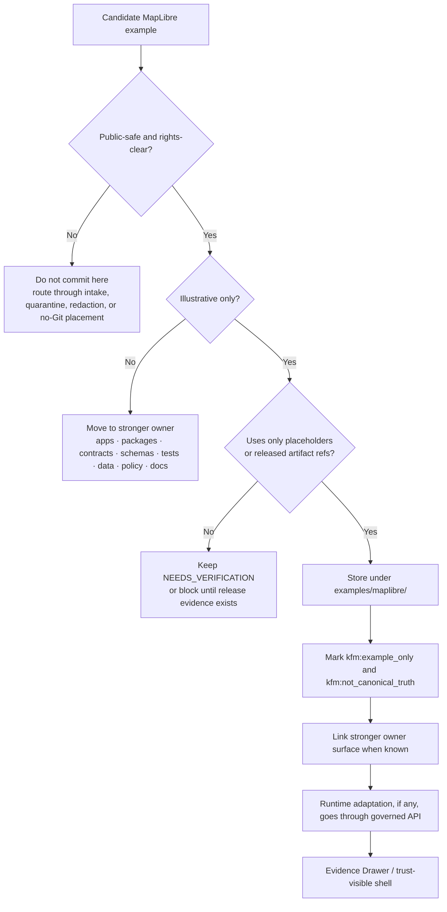

# MapLibre Examples

Public-safe MapLibre source/layer examples that demonstrate shape only.

> [!IMPORTANT]
> **Status:** `experimental`  
> **Owners:** `@bartytime4life`  
> **Path:** `examples/maplibre/README.md`  
> **Truth posture:** `CONFIRMED` current target directory and example filename · `CONFIRMED` KFM MapLibre doctrine · `PROPOSED` review workflow · `UNKNOWN` runtime enforcement depth  
> **Authority posture:** illustrative examples only; not canonical truth, not release approval, not a policy decision  
>
> 
> 
> 
> 
> 
> 
> 
>
> **Quick jumps:** [Scope](#scope) · [Repo fit](#repo-fit) · [Included example](#included-example) · [Accepted inputs](#accepted-inputs) · [Exclusions](#exclusions) · [Directory map](#directory-map) · [Usage](#usage) · [Diagram](#diagram) · [Review checklist](#review-checklist--definition-of-done) · [FAQ](#faq) · [Appendix](#appendix)

> [!NOTE]
> This directory is for MapLibre example **shape**: source objects, layer objects, placeholder metadata, and reviewable conventions. It does not prove that any endpoint exists, any layer is released, any source is rights-cleared, or any application route has been implemented.

---

## Scope

`examples/maplibre/` is the public-safe example lane for MapLibre style/source/layer snippets.

It demonstrates how KFM wants MapLibre examples to look before they harden into app code, schema-owned examples, tests, release manifests, or governed layer registries.

A good example in this directory is:

- small enough to review in one diff
- explicitly marked as illustrative
- safe to inspect publicly
- free of live secrets, private endpoints, sensitive coordinates, or raw/canonical store paths
- clear about what it demonstrates and what it does **not** prove
- easy to move later into `apps/`, `packages/`, `schemas/`, `contracts/`, `tests/`, `data/`, `policy/`, or `docs/` when ownership becomes stronger

This lane keeps one KFM rule visible:

> MapLibre is a downstream renderer and interaction surface. It is not the truth system.

[Back to top](#maplibre-examples)

---

## Repo fit

`examples/maplibre/README.md` documents the MapLibre example lane under KFM’s public-safe example surface.

| Field | Value |
| --- | --- |
| Path | `examples/maplibre/README.md` |
| Parent example surface | [`../README.md`](../README.md) |
| Root project posture | [`../../README.md`](../../README.md) |
| Current included file | [`maplibre_layer__released_pmtiles_source__example.json`](./maplibre_layer__released_pmtiles_source__example.json) |
| Adjacent example lanes | [`../api/`](../api/) · [`../story/`](../story/) · [`../thin_slice/`](../thin_slice/) · [`../ui/`](../ui/) |
| Stronger owner surfaces | [`../../apps/`](../../apps/) · [`../../contracts/`](../../contracts/) · [`../../schemas/`](../../schemas/) · [`../../policy/`](../../policy/) · [`../../tests/`](../../tests/) · [`../../data/`](../../data/) · [`../../docs/`](../../docs/) · [`../../packages/`](../../packages/) |
| Primary role | Public-safe MapLibre layer/source examples that teach shape and trust posture |
| Not its role | Runtime implementation, canonical layer registry, publication approval, source authority, policy authority, or release evidence |
| Parent-link status | `NEEDS VERIFICATION`: ensure `examples/README.md` links to this lane when this README is committed |

### Placement rule

Use `examples/maplibre/` only when the file is primarily instructional.

| Material | Best home |
| --- | --- |
| Tiny illustrative MapLibre source/layer snippets | `examples/maplibre/` |
| Runtime-owned shell code, adapters, or app state | `../../apps/` or `../../packages/` |
| Stable layer contracts, DTOs, or shared object examples | `../../contracts/` |
| Schema-owned valid/invalid examples | `../../schemas/` or `../../tests/` |
| Release manifests, catalog records, receipts, proof packs | `../../data/`, `../../release/`, or the owning release/proof surface |
| Policy decisions, deny rules, reason codes, tests | `../../policy/` |
| Long-form architecture, runbooks, ADRs, screenshots | `../../docs/` |

> [!TIP]
> Keep this lane boring in the right way: small examples, obvious placeholders, no hidden authority.

[Back to top](#maplibre-examples)

---

## Included example

| File | Status | Demonstrates | Does not prove |
| --- | --- | --- | --- |
| [`maplibre_layer__released_pmtiles_source__example.json`](./maplibre_layer__released_pmtiles_source__example.json) | `CONFIRMED` current example file | MapLibre style JSON shape for a released-vector source placeholder and one public-safe fill layer | Endpoint existence, source rights, release state, application wiring, schema validation, or publication approval |

The current JSON example intentionally uses reviewable placeholders such as:

- `NEEDS_VERIFICATION__released_tilejson_or_pmtiles_uri`
- `NEEDS_VERIFICATION__source_attribution`
- `NEEDS_VERIFICATION__source_layer`

It also carries metadata flags that preserve the example boundary:

- `kfm:example_only`
- `kfm:not_canonical_truth`

Those flags should remain unless the file moves out of `examples/` into a stronger owner surface and passes the relevant governance gates.

[Back to top](#maplibre-examples)

---

## Accepted inputs

Content that belongs here includes:

- small MapLibre style fragments that demonstrate source/layer shape
- public-safe layer examples whose URLs are placeholders or already released artifact references
- examples of `metadata` fields that make KFM trust posture explicit
- illustrative PMTiles or TileJSON source shapes with `NEEDS_VERIFICATION` placeholders
- source/layer examples that show how a rendered feature should route to governed evidence resolution
- redacted visual examples that explain layer meaning without exposing sensitive geometry
- tiny examples used by docs, onboarding, screenshots, or review notes
- negative examples, if clearly labeled, that demonstrate why a source or layer must not be published

A useful MapLibre example should answer these questions in the file or nearby notes:

1. What visual shape does this demonstrate?
2. What artifact would own the real endpoint?
3. What source role or release object would have to exist before runtime use?
4. What evidence, policy, freshness, and review state should travel with the layer?
5. What must remain unknown or denied until verified?

[Back to top](#maplibre-examples)

---

## Exclusions

The following do **not** belong in `examples/maplibre/`.

| Do not store here | Why | Put it instead in… |
| --- | --- | --- |
| RAW, WORK, QUARANTINE, canonical store, object-store, or database URLs | Public examples must not bypass the trust membrane | governed data/runtime owners |
| Live source endpoints presented as release-ready | Source role, rights, review, and release state must be verified first | `../../data/registry/`, `../../docs/`, or source intake surfaces |
| Secrets, API keys, signed URLs, tokens, cookies, local credentials | Secret exposure risk | secret manager or private environment config |
| Exact sensitive locations or steward-only geometry | KFM fails closed on sensitive location exposure | quarantine, redaction, generalization, or staged access |
| Runtime implementation code | Examples are not app truth | `../../apps/` or `../../packages/` |
| Authoritative schemas or contracts | Schema/contract authority should stay centralized | `../../schemas/` or `../../contracts/` |
| Merge-blocking fixtures | Executable proof belongs with the harness | `../../tests/` |
| Policy bundles, deny logic, reason-code registries | Policy should not hide in a demo lane | `../../policy/` |
| Release manifests, proof packs, receipts, correction notices | These are operational trust objects, not examples | release/proof/catalog owners |
| Narrative claims without evidence references | Violates cite-or-abstain posture | `../../docs/` or review drafts until evidence is attached |

> [!WARNING]
> If a MapLibre example is needed to make a release pass, a policy decide, an API answer, or CI fail, it probably has a stronger owner than `examples/maplibre/`.

[Back to top](#maplibre-examples)

---

## Directory map

Current verified shape for this lane:

```text
examples/maplibre/
├── README.md
└── maplibre_layer__released_pmtiles_source__example.json
```

Recommended growth shape:

```text
examples/maplibre/
├── README.md
├── maplibre_layer__released_pmtiles_source__example.json
├── maplibre_layer__abstain_unreleased_source__example.json        # PROPOSED
├── maplibre_layer__generalized_sensitive_geometry__example.json   # PROPOSED
└── sidecars/                                                      # PROPOSED
    └── maplibre_layer__released_pmtiles_source__example.meta.yaml
```

Do not create the proposed files until there is a reviewer need and a clear owner surface to link.

[Back to top](#maplibre-examples)

---

## Usage

### Inspect the current example

From the repository root:

```bash
python -m json.tool examples/maplibre/maplibre_layer__released_pmtiles_source__example.json
```

Check that placeholders remain visible:

```bash
grep -R "NEEDS_VERIFICATION" -n examples/maplibre
```

Check for obvious materials that should not appear in this lane:

```bash
grep -R -nE "token|secret|api[_-]?key|raw|quarantine|canonical|localhost|127\.0\.0\.1" examples/maplibre || true
```

### Review before copying into runtime code

Before adapting an example for an app or package, verify:

- the source URI points to a released public-safe artifact
- attribution is correct and rights-cleared
- the source layer name is real and stable
- the layer is represented by a `LayerManifest`, `GeoManifest`, or equivalent release-owned object
- the style does not encode policy decisions that belong in a governed API or policy engine
- feature click behavior resolves through governed evidence, not local client assumptions
- the layer can show `ABSTAIN`, `DENY`, stale, generalized, withdrawn, or restricted states when needed

> [!CAUTION]
> Do not replace `NEEDS_VERIFICATION` placeholders with live endpoints unless the endpoint is release-approved, rights-cleared, policy-safe, and linked to the owning artifact or manifest.

[Back to top](#maplibre-examples)

---

## Diagram



[Back to top](#maplibre-examples)

---

## Review checklist / Definition of done

A MapLibre example contribution is ready when every relevant check below passes.

- [ ] The file is public-safe, rights-clear, and small enough to review quickly.
- [ ] The example is explicitly marked as illustrative, sample, redacted, or demo.
- [ ] Any endpoint is either a visible placeholder or a verified released artifact reference.
- [ ] The example does not contain secrets, tokens, private endpoints, local machine paths, or precise sensitive geometry.
- [ ] The example does not point to RAW, WORK, QUARANTINE, canonical stores, unpublished candidate data, or direct model/runtime endpoints.
- [ ] The style does not make policy, release, or evidence claims that should be resolved by a governed API.
- [ ] Layer metadata preserves the example boundary, preferably with `kfm:example_only` and `kfm:not_canonical_truth`.
- [ ] Attribution and source-layer placeholders remain reviewable until verified.
- [ ] The stronger owner surface has been identified when one exists.
- [ ] Any behavior-heavy example has a matching negative or constrained example planned somewhere reviewable.
- [ ] Parent navigation in [`../README.md`](../README.md) has been checked and updated when needed.
- [ ] Deletion or relocation will not break canonical truth, tests, release artifacts, or runtime behavior.

[Back to top](#maplibre-examples)

---

## FAQ

### Why keep a MapLibre lane separate from `examples/ui/`?

`examples/ui/` can hold broader shell walkthroughs, Evidence Drawer examples, review-state examples, or interaction assets. `examples/maplibre/` is narrower: it teaches MapLibre source/layer/style shape and the renderer boundary.

### Why are the example URL and source layer placeholders?

Because an example file is not release evidence. Real endpoints require source role, rights, sensitivity, attribution, artifact integrity, release state, and review support.

### Can these examples be loaded directly into the app?

Only after adaptation by the app or package owner. Runtime use should consume released artifacts and governed API responses, not raw example files copied into production behavior.

### Why include negative-state language in a style example README?

Because KFM’s map surface must not hide missing evidence, denied policy, restricted access, stale sources, generalized geometry, withdrawn releases, or citation failures behind polished empty states.

### When should a file move out of this directory?

Move it once it becomes authoritative, merge-blocking, release-bearing, schema-governing, policy-bearing, runtime-owned, or the only place an important behavior is described.

[Back to top](#maplibre-examples)

---

## Appendix

### PROPOSED sidecar fields

Use a sidecar only when the example needs more context than a filename can carry.

```yaml
example_id: NEEDS_VERIFICATION
title: Released PMTiles source/layer shape example
purpose: Demonstrates MapLibre source/layer shape without asserting release readiness.
lane: examples/maplibre
authority_status: illustrative_only
owner_surface: ../../apps/ | ../../packages/ | ../../contracts/ | ../../schemas/ | ../../tests/ | ../../data/
source_uri_status: NEEDS_VERIFICATION
release_status: not_asserted
rights_status: NEEDS_VERIFICATION
sensitivity_status: public_safe_example_only
evidence_route: governed_api_required
notes:
  - Keep placeholders until release and source rights are verified.
  - Do not treat this example as canonical layer registry state.
  - Link LayerManifest, GeoManifest, or release artifact when known.
```

### Naming guidance

Prefer names that explain what the example demonstrates:

- `maplibre_layer__released_pmtiles_source__example.json`
- `maplibre_layer__abstain_unreleased_source__example.json`
- `maplibre_layer__generalized_sensitive_geometry__example.json`
- `maplibre_source__tilejson_placeholder__example.json`
- `maplibre_style__trust_metadata_example.json`

Avoid names that imply operational authority:

- `production-layer.json`
- `final-style.json`
- `truth-layer.json`
- `release-ready.json`
- `canonical-source.json`

### Working rule

MapLibre examples may teach rendering shape. They may not replace source descriptors, evidence bundles, policy decisions, review records, release manifests, proof packs, catalog records, correction notices, or rollback targets.

[Back to top](#maplibre-examples)
