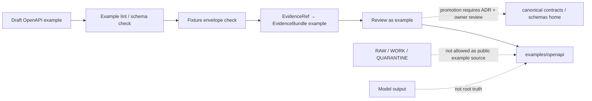

<!-- [KFM_META_BLOCK_V2]
doc_id: kfm://doc/NEEDS-VERIFICATION
title: OpenAPI Examples
type: standard
version: v1
status: draft
owners: OWNER_TBD
created: 2026-05-02
updated: 2026-05-02
policy_label: NEEDS VERIFICATION
related: [../../README.md NEEDS VERIFICATION, ../README.md NEEDS VERIFICATION, ../../contracts/README.md NEEDS VERIFICATION, ../../schemas/README.md NEEDS VERIFICATION, ../../policy/README.md NEEDS VERIFICATION]
tags: [kfm, openapi, examples, governed-api, evidence, documentation]
notes: [Target path supplied by user; repo implementation depth UNKNOWN; adjacent links and owner need verification in mounted checkout.]
[/KFM_META_BLOCK_V2] -->

# OpenAPI Examples

Example OpenAPI documents for KFM governed API patterns, finite response envelopes, evidence resolution, and public-safe contract review.

> [!IMPORTANT]
> **Status:** experimental  
> **Owner:** OWNER_TBD  
> **Path:** `examples/openapi/README.md`  
> **Truth posture:** CONFIRMED doctrine / PROPOSED examples / UNKNOWN repo implementation depth  
> **Authority posture:** examples only; not canonical production API authority
>
> 
> 
> 
> 
>
> **Quick links:** [Scope](#scope) · [Repo fit](#repo-fit) · [Accepted inputs](#accepted-inputs) · [Exclusions](#exclusions) · [Directory map](#directory-map) · [Authoring rules](#authoring-rules) · [Validation checklist](#validation-checklist) · [Rollback](#rollback) · [Open backlog](#open-verification-backlog)

> [!NOTE]
> Current implementation evidence was not available during this authoring pass. This README is written as a safe bounded directory guide. File names, adjacent links, validator commands, owners, OpenAPI version pins, and canonical contract homes remain **NEEDS VERIFICATION** until the real repository is inspected.

## Scope

This directory is for **small, reviewable OpenAPI examples** that demonstrate how KFM public or semi-public API surfaces should preserve evidence, policy, review, release, and rollback boundaries.

The examples here may show:

- how a governed API response can carry `EvidenceRef` / `EvidenceBundle` references;
- how finite outcomes such as `ANSWER`, `ABSTAIN`, `DENY`, and `ERROR` appear in example envelopes;
- how Evidence Drawer, Focus Mode, promotion, catalog, proof, and rollback payloads can be illustrated without claiming production behavior;
- how negative-path examples prevent public clients from bypassing the KFM trust membrane.

This directory is **not** the canonical API contract registry unless a future ADR and repo inspection explicitly promote it.

## Repo fit

| Field | Value |
| --- | --- |
| Target path | `examples/openapi/README.md` |
| Document type | Directory README / README-like doc |
| Upstream context | [Root README](../../README.md) — NEEDS VERIFICATION |
| Neighbor context | [Examples README](../README.md) — NEEDS VERIFICATION |
| Contract homes | [contracts](../../contracts/README.md) / [schemas](../../schemas/README.md) — CONFLICTED / NEEDS VERIFICATION |
| Policy context | [policy](../../policy/README.md) — NEEDS VERIFICATION |
| Downstream consumers | validators, tests, review docs, UI fixtures, governed API docs — all NEEDS VERIFICATION |

The intended flow is:



## Accepted inputs

The following belong here when they are small, labeled, and safe to review:

| Input | Required posture |
| --- | --- |
| `*.example.openapi.yaml` / `*.example.openapi.json` | Must be labeled example-only and non-authoritative. |
| Example request / response fixtures | Must be synthetic or public-safe; no secrets, live credentials, sensitive exact locations, or real restricted payloads. |
| Negative-path fixtures | Should show `ABSTAIN`, `DENY`, and `ERROR`, not only successful `ANSWER` cases. |
| Evidence Drawer / Focus Mode payload examples | Must resolve to fixture-backed `EvidenceBundle` references or be labeled illustrative. |
| Validator notes | Must be clearly marked `PROPOSED` unless connected to actual repo tooling. |
| Review checklists | Must include evidence, rights, sensitivity, policy, and rollback checks. |

## Exclusions

Do **not** place these in `examples/openapi/`:

| Excluded item | Goes elsewhere |
| --- | --- |
| Canonical production OpenAPI contracts | `contracts/` or `schemas/` after repo inspection and ADR. |
| Runtime route handlers or generated server/client code | App/package directories after framework verification. |
| RAW, WORK, or QUARANTINE data payloads | Governed lifecycle storage only. |
| Source descriptors, rights records, or policy bundles | Source registry and policy homes after verification. |
| Proof packs, receipts, release manifests, or catalog records | Dedicated proof / receipt / catalog / release object families. |
| Secrets, tokens, internal hostnames, private URLs, exact sensitive coordinates | Never in examples. |
| AI-generated claims presented as truth | Not allowed; AI output is interpretive and evidence-subordinate. |

> [!CAUTION]
> Examples can become misleading if they look like production authority. Every OpenAPI file in this directory should make its example-only status visible in the file name, metadata, server URL, and comments.

## Directory map

PROPOSED layout only. Create or adjust after repo inspection.

```text
examples/openapi/
├── README.md
├── governed-api/
│   ├── evidence-resolution.example.openapi.yaml
│   ├── runtime-response-envelope.example.openapi.yaml
│   ├── evidence-drawer.example.openapi.yaml
│   └── focus-mode.example.openapi.yaml
├── promotion/
│   ├── promotion-decision.example.openapi.yaml
│   └── release-manifest-summary.example.openapi.yaml
├── fixtures/
│   ├── answer.example.json
│   ├── abstain.example.json
│   ├── deny.example.json
│   └── error.example.json
└── validation/
    └── VALIDATION_NOTES.md
```

If the mounted repo already has a different examples convention, preserve that convention and update this README rather than forcing this tree.

## Governed OpenAPI posture

OpenAPI examples in KFM should demonstrate the governed boundary, not bypass it.

| Surface | Example may show | Example must not imply |
| --- | --- | --- |
| Governed API | Public-safe request and response envelopes | Direct access to canonical/internal stores |
| Evidence resolution | `EvidenceRef` resolving to `EvidenceBundle` support | Citation-free authoritative answers |
| Policy decision | `ALLOW`, `ABSTAIN`, `DENY`, `ERROR`-style outcomes | Silent fallback or unchecked publication |
| Evidence Drawer | Source role, review state, rights, sensitivity, freshness, correction lineage | UI as source of truth |
| Focus Mode | Evidence-bounded synthesis with citations or abstention | Raw model output as public truth |
| Promotion | Reviewable decision with proof refs and rollback target | Publication as a file move |
| Catalog / proof closure | Linked release, evidence, catalog, integrity, and provenance refs | Receipts, proofs, and catalog records collapsed into one object |

## Authoring rules

### 1. Mark every example as non-authoritative

Use file names and metadata that say the file is an example.

Recommended pattern:

```yaml
x-kfm-example: true
x-kfm-status: PROPOSED
x-kfm-truth-posture: "CONFIRMED doctrine / PROPOSED example / UNKNOWN implementation"
x-kfm-authority: "example-only"
x-kfm-do-not-promote-without:
  - schema_home_adr
  - owner_review
  - validator_report
  - policy_review
  - rollback_target
```

### 2. Use safe server URLs

Examples should use inert or local placeholder URLs only.

```yaml
servers:
  - url: https://example.invalid/kfm
    description: "Illustrative only; not a live KFM endpoint."
```

Do not include production hostnames, LAN hostnames, VPN addresses, reverse-proxy domains, tokens, cookies, API keys, or private paths.

### 3. Include finite negative outcomes

A good example does not only show success. KFM examples should include cases where the governed API refuses, abstains, or reports a process error.

| Outcome | Meaning in examples |
| --- | --- |
| `ANSWER` | Evidence exists, policy permits, citations validate, and response is bounded. |
| `ABSTAIN` | Evidence is insufficient, stale, unresolved, or outside scope. |
| `DENY` | Policy blocks release, access, precision, source role, rights, or sensitivity. |
| `ERROR` | Tooling, validation, resolver, runtime, or process failure occurred. |

### 4. Keep evidence visible

Every consequential example response should include a visible path to evidence support.

Minimum example fields:

| Field | Purpose |
| --- | --- |
| `evidence_refs` | Opaque references used by public clients. |
| `evidence_bundle_refs` | Fixture-backed support bundle references. |
| `source_role` | Why the source can support the claim. |
| `review_state` | Whether the example is draft, reviewed, or release-grade. |
| `policy_decision_ref` | Link to the relevant policy result or fixture. |
| `release_manifest_ref` | Release context when the example claims a published artifact. |
| `rollback_ref` | Reversal target for release-like examples. |

### 5. Separate canonical truth from derivatives

Examples may describe tiles, scenes, vector indexes, summaries, graph edges, dashboards, or model responses only as **derived surfaces**.

They must not imply that derived surfaces replace canonical evidence, source roles, policy decisions, review records, release manifests, or correction lineage.

## Example classes

| Class | Naming pattern | Notes |
| --- | --- | --- |
| Evidence resolution | `evidence-resolution.example.openapi.yaml` | Shows `EvidenceRef → EvidenceBundle` behavior. |
| Runtime response envelope | `runtime-response-envelope.example.openapi.yaml` | Shows finite outcomes and citation checks. |
| Evidence Drawer payload | `evidence-drawer.example.openapi.yaml` | Shows UI trust payloads without UI implementation claims. |
| Focus Mode payload | `focus-mode.example.openapi.yaml` | Shows evidence-bounded synthesis, abstention, denial, and error cases. |
| Promotion decision | `promotion-decision.example.openapi.yaml` | Shows release gate inputs, outcome, reasons, obligations, proof refs, and rollback ref. |
| Catalog closure | `release-manifest-summary.example.openapi.yaml` | Shows release/catalog/evidence/proof linkage at example scale. |

## Inspection quickstart

After the real repo is mounted and this directory exists, maintainers can inspect the directory without assuming package tooling:

```bash
find examples/openapi -maxdepth 3 -type f | sort
```

The repo-native OpenAPI validator, schema validator, linter, and CI commands are **NEEDS VERIFICATION**.

Do not add package-manager commands here until the mounted checkout confirms the project’s toolchain.

## Validation checklist

Use this checklist before adding or changing an example:

- [ ] Target path exists in the mounted repo.
- [ ] Owner is confirmed.
- [ ] Example file name includes `.example.` or an equivalent repo-approved marker.
- [ ] OpenAPI version and validator are repo-approved.
- [ ] `servers` does not expose real production, LAN, VPN, reverse-proxy, or private hostnames.
- [ ] No secrets, credentials, tokens, cookies, private URLs, exact restricted locations, or sensitive records are present.
- [ ] Example includes finite outcomes where relevant: `ANSWER`, `ABSTAIN`, `DENY`, `ERROR`.
- [ ] Consequential claims include `EvidenceRef` / `EvidenceBundle` fixture references.
- [ ] Rights, sensitivity, source role, review state, and release state are visible where relevant.
- [ ] Example does not imply direct access to RAW, WORK, QUARANTINE, canonical stores, vector indexes, graph internals, or model runtimes.
- [ ] Any promotion-like example includes proof refs, policy decision, release manifest context, and rollback target.
- [ ] Adjacent links are verified from `examples/openapi/README.md`.
- [ ] Any future move from example to canonical contract goes through ADR / owner review.

## Definition of done

This directory is healthy when:

- examples are small enough to inspect in review;
- every example is visibly non-authoritative;
- negative outcomes are represented, not hidden;
- evidence, policy, review, release, and rollback fields are present where the example requires them;
- no public example bypasses governed APIs or released artifacts;
- canonical contract homes are not duplicated here;
- validators can run without live source activation;
- maintainers can tell which files are examples, fixtures, validation notes, and future backlog.

## Rollback

Rollback is required if an example:

- looks like a production contract;
- introduces route names that conflict with verified implementation;
- bypasses governed interfaces;
- exposes secrets, private hostnames, sensitive locations, or restricted payloads;
- weakens cite-or-abstain behavior;
- collapses receipts, proofs, catalogs, reviews, or release manifests into one object;
- causes downstream tooling to treat examples as canonical contracts.

Rollback target: `ROLLBACK_TARGET_TBD_AFTER_REPO_INSPECTION`

Minimum rollback action:

1. Remove or revert the misleading example.
2. Record why the example was withdrawn.
3. Restore prior links or aliases if affected.
4. Invalidate any derived fixture or generated documentation created from the withdrawn example.
5. Add a review note so the same confusion does not recur.

## Open verification backlog

| Item | Status | Needed check |
| --- | --- | --- |
| Target directory exists | UNKNOWN | Confirm `examples/openapi/` in mounted checkout. |
| Owner | OWNER_TBD | Confirm team or maintainer. |
| Canonical contract home | CONFLICTED / NEEDS VERIFICATION | Resolve `contracts/` vs `schemas/` vs app-local OpenAPI home. |
| OpenAPI version | NEEDS VERIFICATION | Confirm project-pinned OpenAPI dialect and validator. |
| JSON Schema version | NEEDS VERIFICATION | Confirm schema dialect used by example components. |
| Validator command | NEEDS VERIFICATION | Confirm repo-native command and CI gate. |
| Adjacent README links | NEEDS VERIFICATION | Verify relative links from this file. |
| Example naming convention | PROPOSED | Align with existing examples once inspected. |
| Promotion path | PROPOSED | Require ADR before examples become canonical contracts. |

<details>
<summary>Appendix: example review card</summary>

Use this lightweight review card for each new example.

| Review field | Answer |
| --- | --- |
| Example file | `PATH_TBD_AFTER_REPO_INSPECTION` |
| Purpose | `TODO(owner): state what behavior this example demonstrates` |
| Canonical authority? | No |
| Evidence fixture refs | `SOURCE_ID_TBD` |
| Finite outcomes included | `ANSWER / ABSTAIN / DENY / ERROR` |
| Sensitive data check | `NEEDS VERIFICATION` |
| Rights / source role check | `NEEDS VERIFICATION` |
| Validator result | `VALIDATION_REPORT_TBD` |
| Reviewer | `OWNER_TBD` |
| Rollback target | `ROLLBACK_TARGET_TBD_AFTER_REPO_INSPECTION` |

</details>

---

Back to [top](#openapi-examples).
