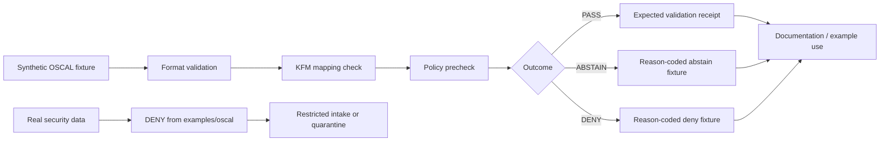

<!-- [KFM_META_BLOCK_V2]
doc_id: kfm://doc/NEEDS-VERIFICATION
title: OSCAL Examples
type: standard
version: v1
status: draft
owners: OWNER_TBD
created: NEEDS VERIFICATION: set on commit
updated: NEEDS VERIFICATION: set on commit
policy_label: public
related: [PATH_TBD_AFTER_REPO_INSPECTION]
tags: [kfm, oscal, examples, compliance, evidence, fixtures]
notes: [Repo implementation depth UNKNOWN; target path PROPOSED until mounted repo inspection confirms examples/oscal/ exists.]
[/KFM_META_BLOCK_V2] -->

# OSCAL Examples

Public-safe OSCAL fixtures and mapping notes for testing how KFM can represent compliance artifacts without turning them into root truth.


> [!IMPORTANT]
> **Status:** experimental  
> **Owners:** `OWNER_TBD`  
> **Path:** `examples/oscal/README.md`  
> **Truth posture:** CONFIRMED KFM doctrine / PROPOSED example plan / UNKNOWN repo implementation depth  
> **Quick jumps:** [Scope](#scope) · [Repo fit](#repo-fit) · [Inputs](#accepted-inputs) · [Exclusions](#exclusions) · [Model coverage](#oscal-model-coverage) · [Validation](#validation-checklist) · [Rollback](#rollback)

> [!NOTE]
> This directory is for **examples only**. It must not contain production system security plans, real assessment findings, live vulnerability data, credentials, private infrastructure diagrams, sensitive locations, private people data, or unpublished KFM evidence.

## Scope

`examples/oscal/` is a proposed example area for small, reviewable Open Security Controls Assessment Language (OSCAL) fixtures and KFM-to-OSCAL mapping notes.

Its job is to help maintainers test and explain how KFM might exchange security-control, assessment, and remediation artifacts while preserving KFM’s normal trust posture:

```text
RAW -> WORK / QUARANTINE -> PROCESSED -> CATALOG / TRIPLET -> PUBLISHED
```

OSCAL examples in this directory are **not** canonical KFM truth. They are public-safe fixtures, mapping sketches, validator inputs, and review aids.

## Repo fit

| Item | Value | Status |
| --- | --- | --- |
| Target path | `examples/oscal/README.md` | PROPOSED until repo inspection confirms the path |
| Parent examples index | `../README.md` | NEEDS VERIFICATION |
| Root README | `../../README.md` | NEEDS VERIFICATION |
| Related docs | `../../docs/README.md` | NEEDS VERIFICATION |
| Related schemas/contracts | `../../schemas/` or `../../contracts/` | CONFLICTED / NEEDS VERIFICATION |
| Related policy files | `../../policy/` | NEEDS VERIFICATION |
| Related validators | `../../tools/validators/` | NEEDS VERIFICATION |

This README should be linked from the nearest confirmed examples index after the real repository tree is inspected.

[Back to top](#oscal-examples)

## Accepted inputs

Only public-safe, reviewable example material belongs here.

| Input | Allowed? | Conditions |
| --- | --- | --- |
| Minimal synthetic OSCAL JSON/YAML/XML fixtures | YES | Must be clearly synthetic and small enough for review. |
| NIST-linked sample references | YES | Prefer links and attribution over copying; verify current source terms. |
| KFM-to-OSCAL mapping notes | YES | Must be labeled `PROPOSED` unless implemented and tested. |
| Validator expected outputs | YES | Use deterministic fixtures and avoid live source calls. |
| Negative examples | YES | Useful for `DENY`, `ABSTAIN`, invalid import, stale metadata, or missing evidence tests. |
| Real-world compliance package excerpts | NO by default | Use only after rights, sensitivity, redaction, and review are documented. |

## Exclusions

| Do not place here | Where it should go instead |
| --- | --- |
| Real system security plans, real assessment plans, real assessment results, real POA&Ms | `QUARANTINE` or restricted evidence storage after source intake |
| Credentials, tokens, hostnames, IP inventories, cloud account IDs, diagrams, or private architecture details | Never in public examples; restricted security process only |
| Live vulnerability scans, exploit details, or security findings from real systems | Restricted security evidence process; no public example path |
| KFM canonical evidence, proof packs, release manifests, receipts, or source registries | Their governed object-family homes after repo inspection |
| Generated AI summaries used as compliance evidence | Nowhere as root truth; AI output may only be an interpretive draft |
| OSCAL development snapshots used as if stable | Use pinned release fixtures or label intentionally experimental |

> [!CAUTION]
> A valid OSCAL file is not automatically a KFM-publishable artifact. KFM publication still requires evidence, source role, policy posture, rights, sensitivity handling, review state, validation, release state, and rollback support.

## Proposed directory tree

The tree below is a proposed first fixture layout. Do not treat these files as present until the repository is inspected.

```text
examples/oscal/
├── README.md
├── fixtures/
│   ├── catalog.min.json
│   ├── profile.min.json
│   ├── component-definition.min.json
│   ├── system-security-plan.min.json
│   ├── assessment-plan.min.json
│   ├── assessment-results.min.json
│   └── poam.min.json
├── mappings/
│   ├── kfm-evidencebundle-to-oscal-assessment-results.md
│   ├── kfm-policydecision-to-oscal-poam.md
│   └── kfm-source-descriptor-to-oscal-back-matter.md
└── expected/
    ├── validation-pass.receipt.json
    ├── validation-abstain.receipt.json
    └── validation-deny.receipt.json
```

## OSCAL model coverage

Use the official NIST OSCAL reference as the authority for OSCAL syntax and model semantics. This README does not pin an OSCAL release; fixture PRs must record the release they target.

| OSCAL area | Example purpose | KFM posture |
| --- | --- | --- |
| Catalog | Minimal control catalog fixture | Example only; not KFM policy authority |
| Profile | Minimal profile/import fixture | Example only; import resolution must be tested |
| Component Definition | Component/control implementation sketch | Synthetic only; no real component inventory |
| System Security Plan | System context fixture | Synthetic only; no real system details |
| Assessment Plan | Assessment scope and activities fixture | Must remain linked and non-orphaned |
| Assessment Results | Observations, risks, findings, evidence fixture | Useful for EvidenceBundle mapping tests |
| POA&M | Risk/remediation tracking fixture | Useful for PolicyDecision and remediation-state examples |
| Back Matter | Citations, attachments, links | Candidate bridge for KFM evidence references, not proof storage |

## KFM-to-OSCAL bridge principles

| KFM object family | Possible OSCAL expression | Status | Rule |
| --- | --- | --- | --- |
| `EvidenceRef` | Link or reference into OSCAL back matter or assessment evidence | PROPOSED | Must resolve to an `EvidenceBundle` before any consequential answer. |
| `EvidenceBundle` | Assessment Results observation evidence, citation, attachment, or linked resource | PROPOSED | OSCAL may carry or reference evidence; it does not outrank KFM evidence policy. |
| `SourceDescriptor` | Metadata, parties, links, resources, or back matter | PROPOSED | Preserve source role, rights, cadence, and sensitivity outside the fixture if OSCAL cannot express them cleanly. |
| `PolicyDecision` | Finding, risk, POA&M item, or local property | PROPOSED | Do not collapse every policy outcome into a compliance finding. `DENY` and `ABSTAIN` remain first-class. |
| `RunReceipt` | Expected output fixture or linked resource | PROPOSED | Receipts remain KFM process memory, not OSCAL truth. |
| `ReleaseManifest` | Linked release metadata only | PROPOSED | KFM release state is governed separately from OSCAL document validity. |

## Example lifecycle



## Operating rules

1. **Synthetic first.** Fixtures should be synthetic unless a maintainer can prove rights, sensitivity clearance, and review.
2. **Pinned release.** Each fixture PR must state the OSCAL release used for validation.
3. **No orphaned imports.** Assessment Results and POA&M examples must document the Assessment Plan, SSP, or system identifier they rely on.
4. **Metadata discipline.** When OSCAL content changes, update document identity and modified metadata according to the applicable OSCAL release guidance.
5. **KFM labels stay visible.** Use `CONFIRMED`, `PROPOSED`, `UNKNOWN`, `NEEDS VERIFICATION`, `DENY`, and `ABSTAIN` where uncertainty matters.
6. **No direct publication.** Passing OSCAL validation is not a publication gate.
7. **No model authority.** AI may summarize an example only after evidence and policy context are provided; generated language is not evidence.

## Quickstart

Run these only after `examples/oscal/` exists in a mounted repository.

```bash
# From the repository root.
cd examples/oscal
find . -maxdepth 3 -type f | sort
```

```bash
# NEEDS VERIFICATION: replace with the repo-native validator command.
# This is a placeholder shape, not a confirmed KFM tool.
python ../../tools/validators/validate_oscal_examples.py --root .
```

```bash
# NEEDS VERIFICATION: replace with the official or repo-approved OSCAL validator.
# Pin the OSCAL release before using validation results in CI.
oscal-cli validate fixtures/assessment-results.min.json
```

> [!WARNING]
> Do not add commands here that fetch live compliance content, upload artifacts, publish releases, or contact production systems. This directory should be safe for no-network fixture validation.

## Validation checklist

Before merging this README or any future OSCAL fixture PR:

- [ ] Confirm `examples/oscal/` is the correct repo home.
- [ ] Confirm owner or team in the meta block.
- [ ] Confirm adjacent README links.
- [ ] Confirm whether `schemas/`, `contracts/`, or another path is the authoritative schema home.
- [ ] Pin the OSCAL release used by each fixture.
- [ ] Validate OSCAL syntax and import relationships.
- [ ] Verify no real system identifiers, credentials, hostnames, IPs, cloud account IDs, or private diagrams are present.
- [ ] Verify no production assessment findings, vulnerability scans, or POA&M items are present.
- [ ] Verify every KFM mapping is labeled `PROPOSED` unless implementation evidence exists.
- [ ] Verify `DENY` and `ABSTAIN` examples are reason-coded.
- [ ] Verify fixture metadata identity and `last-modified` behavior matches the target OSCAL release.
- [ ] Verify expected receipts remain separate from OSCAL fixtures.
- [ ] Verify rollback target and removal path.

## Definition of done

This directory becomes useful when it contains:

- [ ] One minimal valid fixture for each selected OSCAL model.
- [ ] One invalid fixture for each important failure mode.
- [ ] One KFM mapping note for EvidenceBundle-style assessment evidence.
- [ ] One expected `PASS`, `ABSTAIN`, and `DENY` receipt.
- [ ] One no-network validation command wired into repo-native tests.
- [ ] A maintainer-approved source and version note for every copied or linked example.

## FAQ

### Can real SSPs or POA&Ms be stored here?

No. Real system security plans, assessment findings, and remediation records can expose sensitive security posture. They must not be placed in a public example directory.

### Can OSCAL replace KFM EvidenceBundle?

No. OSCAL can represent or reference structured compliance information. KFM still requires EvidenceBundle resolution, policy checks, review state, release state, and correction lineage before consequential claims are answered or published.

### Can a valid OSCAL Assessment Results file become a published KFM claim?

Not by itself. It must pass KFM evidence, policy, rights, sensitivity, validation, review, release, and rollback gates.

### Should examples be JSON, YAML, or XML?

Use whichever representation the repo can validate consistently. If no repo-native convention exists, start with JSON because it is easier to diff, schema-check, and use in fixture tests. Mark that choice `PROPOSED` until confirmed.

## Evidence ledger

| Source | Status | Supports | Limits |
| --- | --- | --- | --- |
| [NIST OSCAL][nist-oscal] | CONFIRMED external source | OSCAL purpose and machine-readable formats | Does not define KFM governance or repo paths |
| [NIST OSCAL model reference][nist-oscal-reference] | CONFIRMED external source | Current model reference and release documentation | Version must be rechecked before pinning |
| [NIST OSCAL downloads][nist-oscal-downloads] | CONFIRMED external source | Official releases, GitHub release source, versioning | Does not prove repo tooling exists |
| KFM source corpus | CONFIRMED doctrine / UNKNOWN implementation | KFM lifecycle, evidence-first posture, source-ledgered operation | Uploaded PDFs do not prove current repo files |
| Current repo inspection | UNKNOWN repo implementation depth | No mounted repo evidence available in this authoring pass | Must be rerun in the target checkout |

## Rollback

Rollback is required if this directory starts to imply false implementation maturity, contains real security data, bypasses KFM policy gates, or treats OSCAL validation as KFM publication approval.

Rollback target: `ROLLBACK_TARGET_TBD_AFTER_REPO_INSPECTION`

Minimum rollback actions:

1. Remove unsafe fixtures from `examples/oscal/`.
2. Remove or correct links from parent example indexes.
3. Record why the example was removed.
4. Preserve any review or denial receipt outside the example fixture set.
5. Re-run no-network example validation.

## Open verification backlog

- [ ] Confirm this path exists or should be created: `examples/oscal/`.
- [ ] Confirm owner/team and CODEOWNERS behavior.
- [ ] Confirm whether examples should live under `examples/`, `docs/examples/`, or a test fixture path.
- [ ] Confirm OSCAL release pin for first fixtures.
- [ ] Confirm approved OSCAL validator.
- [ ] Confirm schema home and contract home.
- [ ] Confirm whether KFM has existing `EvidenceBundle`, `PolicyDecision`, `RunReceipt`, or `ReleaseManifest` schemas to reference.
- [ ] Confirm parent README links.
- [ ] Confirm whether examples are included in CI and which command is authoritative.
- [ ] Confirm publication policy for public security/compliance examples.

<details>
<summary>Reference links</summary>

- [NIST OSCAL][nist-oscal]
- [NIST OSCAL model reference][nist-oscal-reference]
- [NIST OSCAL downloads][nist-oscal-downloads]
- [NIST OSCAL layers and models][nist-oscal-layers]
- [NIST OSCAL Assessment Results model][nist-oscal-assessment-results]
- [NIST OSCAL POA&M model][nist-oscal-poam]

</details>

[nist-oscal]: https://pages.nist.gov/OSCAL/
[nist-oscal-reference]: https://pages.nist.gov/OSCAL-Reference/models/
[nist-oscal-downloads]: https://pages.nist.gov/OSCAL/resources/downloads/
[nist-oscal-layers]: https://pages.nist.gov/OSCAL/learn/concepts/layer/
[nist-oscal-assessment-results]: https://pages.nist.gov/OSCAL/learn/concepts/layer/assessment/assessment-results/
[nist-oscal-poam]: https://pages.nist.gov/OSCAL/learn/concepts/layer/assessment/poam/
