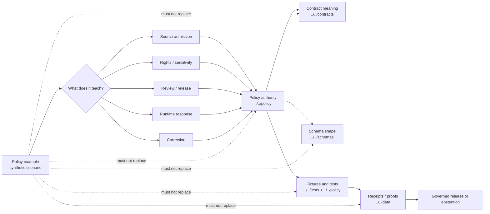

<!-- [KFM_META_BLOCK_V2]
doc_id: kfm://doc/NEEDS-VERIFICATION
title: Policy Examples
type: standard
version: v1
status: draft
owners: OWNER_TBD
created: NEEDS VERIFICATION: YYYY-MM-DD from git history
updated: NEEDS VERIFICATION: YYYY-MM-DD from git history
policy_label: NEEDS VERIFICATION: public|restricted
related: [../../policy/README.md, ../../tests/policy/README.md, ../../tests/fixtures/README.md, ../../contracts/README.md, ../../schemas/README.md]
tags: [kfm, examples, policy, governance, evidence, fixtures-adjacent]
notes: [Target path requested as examples/policy/README.md; current branch inventory, owners, dates, workflow coverage, and child directories need verification before merge.]
[/KFM_META_BLOCK_V2] -->

<a id="top"></a>

# Policy Examples

Small, reviewable examples that show how KFM policy decisions should be explained without becoming policy law, executable fixtures, schemas, receipts, proofs, or published truth.

<div align="left">


</div>

> [!IMPORTANT]
> **Status:** experimental  
> **Owners:** `OWNER_TBD`  
> **Path:** `examples/policy/README.md`  
> **Truth posture:** CONFIRMED KFM doctrine / PROPOSED directory contract / UNKNOWN current branch inventory  
> **Quick jumps:** [Scope](#scope) · [Repo fit](#repo-fit) · [Accepted inputs](#accepted-inputs) · [Exclusions](#exclusions) · [Directory tree](#directory-tree) · [Quickstart](#quickstart) · [Usage](#usage) · [Diagram](#diagram) · [Example seams](#example-seams) · [Definition of done](#definition-of-done) · [FAQ](#faq) · [Appendix](#appendix)

> [!NOTE]
> This directory is for **pedagogical and review examples**. It may illustrate policy decisions, expected outcomes, reason codes, obligations, and handoffs. It must not become the source of policy authority, fixture authority, schema authority, or proof-object authority.

---

## Scope

`examples/policy/` helps maintainers, reviewers, and future implementation agents understand policy behavior through small, inspectable examples.

It should make KFM policy decisions easier to review by showing:

- what an example input is trying to demonstrate;
- which policy seam it exercises;
- which outcome is expected;
- which reason or obligation codes are illustrative;
- which upstream contract, schema, policy, or fixture home should be checked before implementation;
- which negative states must stay visible instead of being smoothed into a silent allow.

### Evidence posture used here

| Label | Meaning in this README |
| --- | --- |
| **CONFIRMED** | Supported by KFM doctrine or current-session workspace evidence. |
| **INFERRED** | Reasonable from the target path and project documentation, but not directly proven in the mounted repo. |
| **PROPOSED** | Commit-ready structure or example practice not verified as current branch reality. |
| **UNKNOWN** | Not verified because current repo files, workflows, tests, logs, dashboards, or emitted artifacts were not available. |
| **NEEDS VERIFICATION** | Concrete branch-local check required before treating a path, owner, status, runner, or example family as current. |

### Guardrails

| Guardrail | Practical rule |
| --- | --- |
| Examples are not policy law | Policy decision logic belongs under `../../policy/`, not here. |
| Examples are not fixtures | Reusable validation fixtures belong under `../../tests/fixtures/`, `../../policy/fixtures/`, or another verified fixture home. |
| Examples are not schemas | Machine-checkable structure belongs under `../../schemas/` or the repo-approved schema home. |
| Examples are not contracts | Human semantic contract authority belongs under `../../contracts/`. |
| Examples are not receipts or proofs | Emitted process memory and release proof objects belong under `../../data/receipts/`, `../../data/proofs/`, or the verified artifact home. |
| Examples are not published claims | Example payloads must not imply public release, rights clearance, review approval, or source authority. |

<p align="right"><a href="#top">Back to top ↑</a></p>

---

## Repo fit

**Path:** `examples/policy/README.md`  
**Role:** directory README for policy explanation examples under the broader examples surface.

This directory is a rehearsal and explanation surface. It sits near policy, tests, contracts, schemas, and proof objects, but it must stay downstream from all of them.

| Direction | Surface | Relationship | Status |
| --- | --- | --- | --- |
| Parent | [`../README.md`](../README.md) | Parent examples index and example-family navigation. | NEEDS VERIFICATION |
| Root | [`../../README.md`](../../README.md) | KFM system identity and root doctrine. | NEEDS VERIFICATION |
| Policy authority | [`../../policy/README.md`](../../policy/README.md) | Authoritative policy lane for allow, deny, review, obligation, and fail-closed behavior. | NEEDS VERIFICATION |
| Policy bundles | [`../../policy/bundles/README.md`](../../policy/bundles/README.md) | Executable rule packs belong there, not here. | NEEDS VERIFICATION |
| Policy fixtures | [`../../policy/fixtures/README.md`](../../policy/fixtures/README.md) | Policy-owned positive and negative fixture cases may live there. | NEEDS VERIFICATION |
| Policy tests | [`../../policy/tests/README.md`](../../policy/tests/README.md) | Bundle-local assertions belong there. | NEEDS VERIFICATION |
| Repo policy tests | [`../../tests/policy/README.md`](../../tests/policy/README.md) | Repo-facing policy proof should live there. | NEEDS VERIFICATION |
| Fixture authority | [`../../tests/fixtures/README.md`](../../tests/fixtures/README.md) | Reusable valid/invalid fixture payloads belong there. | NEEDS VERIFICATION |
| Contract authority | [`../../contracts/README.md`](../../contracts/README.md) | Trust-bearing object meanings stay upstream from examples. | NEEDS VERIFICATION |
| Schema authority | [`../../schemas/README.md`](../../schemas/README.md) | Machine-checkable shapes stay upstream from examples. | NEEDS VERIFICATION |
| Receipts | [`../../data/receipts/README.md`](../../data/receipts/README.md) | Run and validation process memory belongs there. | NEEDS VERIFICATION |
| Proofs | [`../../data/proofs/README.md`](../../data/proofs/README.md) | Release proof packs and attestations belong there. | NEEDS VERIFICATION |
| Runbooks | [`../../docs/runbooks/README.md`](../../docs/runbooks/README.md) | Operational release, rollback, and correction procedures belong there. | NEEDS VERIFICATION |
| Workflow boundary | [`../../.github/workflows/README.md`](../../.github/workflows/README.md) | Workflow documentation does not itself prove merge-blocking enforcement. | NEEDS VERIFICATION |
| Ownership boundary | [`../../.github/CODEOWNERS`](../../.github/CODEOWNERS) | Owner routing should be confirmed before merge. | NEEDS VERIFICATION |

> [!TIP]
> Keep the split visible: **examples explain**, **fixtures verify**, **policy decides**, **contracts define**, **schemas validate**, **receipts remember**, and **proofs justify release**.

<p align="right"><a href="#top">Back to top ↑</a></p>

---

## Accepted inputs

Content here should be small enough to review in a pull request and clear enough to teach a policy seam without creating new authority.

| Input class | Good examples | Why it belongs here |
| --- | --- | --- |
| Policy scenario card | “missing rights metadata should deny publication” | Explains policy intent without becoming an executable rule. |
| Tiny illustrative payload | A synthetic, public-safe JSON or YAML fragment with obvious fake IDs | Shows shape pressure without claiming schema authority. |
| Expected outcome note | `DENY` with illustrative reason `RIGHTS_UNVERIFIED` | Keeps negative outcomes visible. |
| Handoff map | Links to policy, contract, schema, fixture, test, receipt, and proof homes | Makes authority boundaries reviewable. |
| Reviewer checklist | Questions a maintainer should ask before promoting a similar real case | Helps policy review without bypassing gates. |
| Correction example | Synthetic `withdrawn` or `superseded` story card | Keeps correction lineage visible. |
| Runtime example note | Example `ANSWER`, `ABSTAIN`, `DENY`, or `ERROR` response expectations | Clarifies runtime behavior while leaving implementation to governed APIs. |
| Release-gate example note | Example `PASS`, `HOLD`, `DENY`, or `ERROR` gate result | Clarifies review behavior without becoming CI. |

### Input rules

1. Use synthetic or generalized data only.
2. State the policy seam up front.
3. Label every example as `illustrative`, `PROPOSED`, or `NEEDS VERIFICATION`.
4. Include at least one negative or blocked outcome for every example family.
5. Link to the intended contract, schema, policy, test, fixture, receipt, and proof homes when known.
6. Do not include secrets, credentials, private source material, living-person sensitive data, precise sensitive locations, or rights-uncertain third-party records.
7. Preserve the boundary: **example ≠ fixture ≠ test ≠ policy bundle ≠ contract ≠ schema ≠ receipt ≠ proof**.

<p align="right"><a href="#top">Back to top ↑</a></p>

---

## Exclusions

| Does **not** belong here | Put it here instead | Why |
| --- | --- | --- |
| Executable policy bundles | `../../policy/bundles/` | Policy law must stay in the policy lane. |
| Policy runtime adapters or loaders | `../../packages/` or verified app/package boundary | Enforcement code is not an example. |
| Canonical reason, obligation, rights, or sensitivity vocabularies | `../../policy/`, `../../contracts/`, or `../../schemas/` after authority is verified | Shared vocabularies must not drift into examples. |
| JSON Schema, OpenAPI, or machine contract definitions | `../../schemas/` and `../../contracts/` | Examples may pressure-test shapes but must not define them. |
| Reusable valid/invalid fixtures | `../../tests/fixtures/` or `../../policy/fixtures/` | Fixtures carry verification burden. |
| Runnable policy tests | `../../tests/policy/` or `../../policy/tests/` | Tests prove behavior; examples explain behavior. |
| Run receipts, validation reports, or process memory | `../../data/receipts/` | Receipts are emitted artifacts, not examples. |
| Release manifests, proof packs, attestations, or signatures | `../../data/proofs/` or verified release/proof home | Proof objects justify release. |
| RAW, WORK, QUARANTINE, PROCESSED, CATALOG, TRIPLET, or PUBLISHED data | `../../data/` lifecycle zones | Examples must not become data lifecycle shortcuts. |
| Source credentials, tokens, `.env` files, or private host notes | Secret manager / host configuration | Operational secrets must never enter example docs. |
| Exact sensitive archaeology, ecology, living-person, DNA, title, security, or restricted-location examples | Stewarded restricted workflow | Sensitive detail should fail closed or be generalized. |
| Claims that a workflow, runner, or policy engine is active | Verified workflow files, logs, checks, or platform settings | Documentation cannot prove enforcement depth by itself. |

<p align="right"><a href="#top">Back to top ↑</a></p>

---

## Directory tree

### Current target path

```text
examples/
└── policy/
    └── README.md
```

### Possible starter shape

The tree below is **PROPOSED** and illustrative. Do not treat child folders as current branch inventory until direct repo inspection confirms them.

```text
examples/
└── policy/
    ├── README.md
    ├── decision-grammar/
    │   └── README.md
    ├── source-admission/
    │   └── README.md
    ├── rights-sensitivity/
    │   └── README.md
    ├── release-gate/
    │   └── README.md
    ├── runtime-response/
    │   └── README.md
    └── correction/
        └── README.md
```

### Reading rule

Use this README as the lane contract. Use discovered child files only after running the inspection commands below.

<p align="right"><a href="#top">Back to top ↑</a></p>

---

## Quickstart

These commands are inspection-first. They prove what is present in a checkout; they do not prove runtime enforcement, branch protections, or policy maturity.

```bash
# 1) Confirm repo state before claiming current inventory.
pwd
git status --short || true
git branch --show-current || true

# 2) Inspect this examples lane.
find examples -maxdepth 3 -type f 2>/dev/null | sort
find examples/policy -maxdepth 4 -type f 2>/dev/null | sort
find examples/policy -maxdepth 4 -type d 2>/dev/null | sort

# 3) Inspect adjacent policy, contract, schema, test, and workflow surfaces.
find policy tests/policy tests/fixtures contracts schemas data/receipts data/proofs .github/workflows \
  -maxdepth 4 -type f 2>/dev/null | sort

# 4) Search for trust-bearing object and outcome vocabulary.
grep -RInE \
  'EvidenceBundle|DecisionEnvelope|RuntimeResponseEnvelope|PolicyDecision|ReviewRecord|ReleaseManifest|ReleaseProofPack|CorrectionNotice|reason_codes|obligation_codes|rights_class|sensitivity_class|ANSWER|ABSTAIN|DENY|ERROR|PASS|HOLD|PROMOTED|BLOCKED|REVERTED' \
  examples/policy policy tests contracts schemas docs data 2>/dev/null || true
```

> [!CAUTION]
> The commands above are safe discovery commands. They do not validate policies, run tests, prove CI, or authorize publication.

<p align="right"><a href="#top">Back to top ↑</a></p>

---

## Usage

### Add a new policy example

1. Pick one policy seam:
   - source admission
   - rights
   - sensitivity / redaction
   - review
   - release / export
   - runtime response
   - correction / withdrawal
2. Write a one-paragraph scenario using synthetic or generalized data.
3. State the expected outcome and why.
4. Mark the example status as `illustrative`, `PROPOSED`, or `NEEDS VERIFICATION`.
5. Link the intended authority surfaces:
   - contract meaning
   - schema shape
   - policy bundle
   - fixture home
   - test home
   - receipt/proof handoff
6. Include at least one negative path.
7. Update this README’s [Example seams](#example-seams) table if the example family becomes a stable child folder.
8. Do not claim enforcement until a verified policy bundle, fixture, test, workflow, and emitted result exist.

### Promote an example into a fixture or test

An example can inspire a fixture or test, but it does not become one by being copied.

| Promotion target | Required next step |
| --- | --- |
| Policy fixture | Move or duplicate the payload into the verified fixture home and add validation expectations. |
| Policy test | Add runner-specific assertions in the verified test lane. |
| Policy bundle | Add or revise machine-readable rule logic in the verified policy bundle home. |
| Contract/schema update | Open an ADR or contract/schema change; do not smuggle object definition changes through examples. |
| Runbook update | Update release, rollback, correction, or review procedures where operational behavior changes. |

<p align="right"><a href="#top">Back to top ↑</a></p>

---

## Diagram



<p align="right"><a href="#top">Back to top ↑</a></p>

---

## Example seams

| Example family | Purpose | Expected outcomes to illustrate | Authority handoff |
| --- | --- | --- | --- |
| `decision-grammar/` | Show how finite policy outcomes should be explained. | `PASS`, `HOLD`, `DENY`, `ERROR` for gate/review; `ANSWER`, `ABSTAIN`, `DENY`, `ERROR` for runtime. | `../../policy/`, `../../contracts/`, `../../schemas/` |
| `source-admission/` | Show why missing source role, rights, cadence, or sensitivity posture blocks admission. | `DENY`, `HOLD`, `QUARANTINE`-like review notes where applicable. | `../../data/registry/`, `../../policy/`, `../../tests/fixtures/` |
| `rights-sensitivity/` | Show how rights uncertainty or sensitive detail prevents public release. | `DENY`, `RESTRICT`, `GENERALIZE`, `NEEDS REVIEW`. | `../../policy/`, `../../docs/runbooks/`, `../../data/proofs/` |
| `release-gate/` | Show why publication is a governed state transition. | `PASS`, `HOLD`, `DENY`, `ERROR`; release receipt examples stay illustrative only. | `../../data/receipts/`, `../../data/proofs/`, `../../.github/workflows/` |
| `runtime-response/` | Show how a governed answer remains evidence-bound. | `ANSWER`, `ABSTAIN`, `DENY`, `ERROR`. | `../../contracts/`, `../../schemas/`, `../../apps/` or verified governed API path |
| `correction/` | Show how `withdrawn`, `superseded`, and `review_pending` states stay visible. | `REVERTED`, `BLOCKED`, `SUPERSEDED`, `WITHDRAWN`. | `../../contracts/`, `../../data/receipts/`, `../../data/proofs/`, `../../docs/runbooks/` |

> [!NOTE]
> Child folder names are **PROPOSED** unless a branch-local scan confirms them.

<p align="right"><a href="#top">Back to top ↑</a></p>

---

## Definition of done

This README is healthy when the following remain true:

- [ ] The meta block has verified `doc_id`, owner, created date, updated date, policy label, and related links.
- [ ] The parent `examples/` README exists or this file clearly notes that the parent README is missing.
- [ ] Relative links have been checked from `examples/policy/README.md`.
- [ ] Every example family is labeled as `CONFIRMED`, `PROPOSED`, or `NEEDS VERIFICATION`.
- [ ] No example contains secrets, credentials, real sensitive records, exact protected locations, or rights-uncertain third-party payloads.
- [ ] Each stable example family includes at least one negative or blocked outcome.
- [ ] No example claims to be executable policy, a schema, a contract, a fixture, a receipt, a proof, or a published artifact.
- [ ] Contract, schema, policy, fixture, and test authority are linked rather than duplicated.
- [ ] Any promotion from example to fixture/test/policy bundle is done in the appropriate lane.
- [ ] Workflow or merge-gate claims are backed by actual workflow files and branch settings, not by this README.
- [ ] Rollback is simple: remove the example, remove its index row, and leave policy/contract/schema/test artifacts untouched unless they were separately changed.

<p align="right"><a href="#top">Back to top ↑</a></p>

---

## FAQ

### Is `examples/policy/` a policy bundle lane?

No. Policy bundles belong under `../../policy/` after the active repo convention is verified. This directory can explain a policy decision but cannot define the decision.

### Is this the same as `tests/policy/`?

No. `tests/policy/` should prove policy behavior. `examples/policy/` should make policy behavior easier to understand before or after tests are written.

### Can this directory contain JSON or YAML?

Yes, when the payload is synthetic, public-safe, small, clearly labeled as illustrative, and not presented as a canonical schema fixture.

### Can examples include reason and obligation codes?

Yes, but only as illustrative references unless the canonical vocabulary home is linked and verified. Do not create a second vocabulary registry here.

### Can this directory document a real denied source?

Only if the source record is public-safe, rights-cleared for documentation, and generalized enough to avoid sensitive exposure. Prefer synthetic examples.

### Does this README prove policy enforcement exists?

No. Enforcement requires branch-local evidence such as policy bundles, fixtures, tests, workflow checks, runtime behavior, emitted receipts, and proof objects.

<p align="right"><a href="#top">Back to top ↑</a></p>

---

## Appendix

<details>
<summary><strong>Illustrative policy example card template</strong></summary>

```yaml
# PROPOSED illustrative example card.
# This is not a schema, fixture, policy bundle, receipt, proof, or release artifact.

example_id: "policy-example/deny-missing-rights"
status: "illustrative"
seam: "rights"
summary: "A release-like action should be denied when rights metadata is missing."

example_input:
  payload_kind: "synthetic_release_candidate"
  source_ref: "SOURCE_ID_TBD"
  evidence_ref: "kfm://evidence/NEEDS-VERIFICATION"
  rights_class: "UNKNOWN"
  sensitivity_class: "public_safe_example"
  release_intent: "public"

expected_policy_result:
  surface: "gate_review"
  outcome: "DENY"
  reason_codes:
    - "RIGHTS_UNVERIFIED"
  obligations:
    - "VERIFY_SOURCE_TERMS"
    - "DO_NOT_PUBLISH"

authority_handoff:
  policy: "../../policy/README.md"
  contracts: "../../contracts/README.md"
  schemas: "../../schemas/README.md"
  fixtures: "../../tests/fixtures/README.md"
  tests: "../../tests/policy/README.md"
  receipts: "../../data/receipts/README.md"
  proofs: "../../data/proofs/README.md"

notes:
  - "Synthetic example only."
  - "Move to fixture/test lanes only after schema and policy homes are verified."
```

</details>

<details>
<summary><strong>No-loss preservation notes for maintainers</strong></summary>

Keep these distinctions visible in any future rewrite:

| Distinction | Why it matters |
| --- | --- |
| Example vs fixture | Prevents documentation examples from becoming unvalidated test data. |
| Policy vs validator | Validators shape-check; policy decides. |
| Contract vs schema | Human meaning and executable structure may have separate homes. |
| Receipt vs proof | Process memory and release proof must not collapse. |
| Runtime answer vs evidence bundle | Generated or rendered output must stay subordinate to evidence. |
| Published state vs folder copy | Publication is a governed state transition. |

</details>
