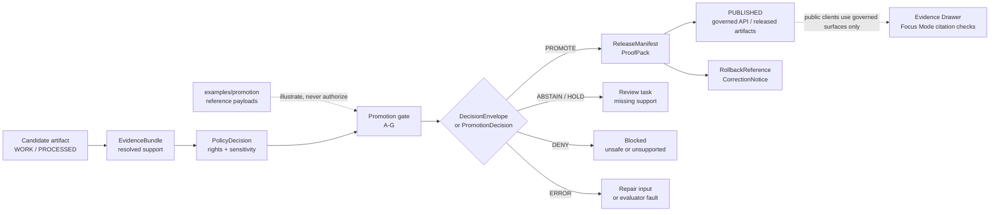

<!-- [KFM_META_BLOCK_V2]
doc_id: kfm://doc/NEEDS-VERIFICATION
title: Promotion Examples
type: standard
version: v1
status: draft
owners: OWNER_TBD
created: 2026-05-02
updated: 2026-05-02
policy_label: NEEDS VERIFICATION
related: [../../contracts/README.md, ../../schemas/README.md, ../../policy/README.md, ../../tools/validators/promotion_gate/README.md, ../../tests/e2e/release_assembly/README.md, ../../data/receipts/README.md, ../../data/proofs/README.md, ../../release/README.md]
tags: [kfm, examples, promotion, release, evidence, governance]
notes: [Target path requested as examples/promotion/README.md. Current repo implementation depth is UNKNOWN because the mounted repository was not available during authoring. Related paths are PROPOSED / NEEDS VERIFICATION until checked in the real repository. This directory is a reference example lane, not a canonical schema, policy, validator, fixture, receipt, proof, or release authority.]
[/KFM_META_BLOCK_V2] -->

<a id="top"></a>

# Promotion Examples

Reviewable, public-safe examples that show how KFM promotion candidates, decisions, receipts, proofs, release manifests, and rollback references should relate without becoming publication authority.

> [!IMPORTANT]
> **Status:** `experimental`  
> **Owners:** `OWNER_TBD`  
> **Path:** `examples/promotion/README.md`  
> **Authority level:** reference examples  
> **Truth posture:** CONFIRMED doctrine / PROPOSED example layout / UNKNOWN repo implementation depth  
> **Rule:** examples explain governed promotion; they do not approve, publish, sign, or release anything.  
>
> 
> 
> 
> 
> 
> 
>
> **Quick jumps:** [Scope](#scope) · [Repo fit](#repo-fit) · [Accepted inputs](#accepted-inputs) · [Exclusions](#exclusions) · [Directory tree](#directory-tree) · [Quickstart](#quickstart) · [Promotion flow](#promotion-flow) · [Gate matrix](#gate-matrix) · [Example roles](#example-roles) · [Usage](#usage) · [Definition of done](#definition-of-done) · [FAQ](#faq) · [Appendix](#appendix)

> [!NOTE]
> This README is written from KFM doctrine and current-session evidence boundaries. It does **not** prove that `examples/promotion/`, adjacent schemas, validators, workflows, receipts, proofs, or release manifests already exist in the active repository checkout.

---

## Scope

`examples/promotion/` is a **pedagogical and review-support lane** for small, synthetic, public-safe promotion examples.

It helps maintainers understand the shape of a governed promotion handoff:

- what a release candidate should reference before promotion is considered;
- how an A–G gate decision can be inspected;
- why receipts, proofs, catalogs, reviews, release manifests, and rollback references remain separate;
- how examples differ from normative schemas, executable validators, CI fixtures, and emitted proof objects.

It should make promotion easier to review without turning example payloads into release authority.

[Back to top](#top)

---

## Repo fit

| Field | Value |
|---|---|
| Requested target path | `examples/promotion/README.md` |
| Directory role | Reference examples for promotion objects and reviewer handoff language |
| Upstream doctrine | `../../docs/architecture/promotion/README.md` and `../../docs/runbooks/PROMOTION_GATE.md` — **NEEDS VERIFICATION** |
| Contract neighbors | `../../contracts/README.md`, `../../contracts/release-manifest.md`, `../../contracts/evidence-bundle.md` — **NEEDS VERIFICATION** |
| Schema neighbors | `../../schemas/README.md`, `../../schemas/promotion/` — **NEEDS VERIFICATION** |
| Policy neighbors | `../../policy/README.md`, `../../policy/promotion.md` — **NEEDS VERIFICATION** |
| Validator neighbors | `../../tools/validators/promotion_gate/README.md` — **NEEDS VERIFICATION** |
| Test neighbors | `../../tests/e2e/release_assembly/README.md`, `../../tests/fixtures/` — **NEEDS VERIFICATION** |
| Emitted artifact neighbors | `../../data/receipts/`, `../../data/proofs/`, `../../release/` — **NEEDS VERIFICATION** |
| Should link here | Promotion runbooks, validator READMEs, release-assembly tests, reviewer handoff docs |
| Should not depend on this as authority | Runtime APIs, public clients, validators, policies, release manifests, proof packs |

> [!WARNING]
> If a mounted repository already has a different examples convention, keep the repo convention and update this README through a small compatibility edit. Do **not** create a parallel promotion authority.

[Back to top](#top)

---

## Accepted inputs

Use this directory for **small, synthetic, clearly labeled examples** such as:

- illustrative release candidate payloads;
- illustrative `DecisionEnvelope` or `PromotionDecision` outputs;
- passing and failing gate examples;
- example `ReleaseManifest`, `ReleaseProofPack`, or `RollbackReference` snippets;
- reviewer-facing summaries that explain how to read promotion artifacts;
- example bundle-diff or handoff documents when they are explicitly labeled non-authoritative;
- short notes that help maintainers compare examples against contracts, schemas, policies, validators, and tests.

Every example should be:

- public-safe;
- synthetic or rights-cleared;
- small enough to inspect in a pull request;
- marked as illustrative unless directly tied to a verified fixture;
- linked back to the governing contract/schema/policy surface when that surface is verified.

[Back to top](#top)

---

## Exclusions

Do **not** put these in `examples/promotion/`:

| Do not place here | Put it here instead | Why |
|---|---|---|
| Canonical object definitions | `../../contracts/` | Human semantics belong in contracts, not examples. |
| JSON Schema / executable shape | `../../schemas/` | Machine-checkable authority belongs in schemas. |
| Rego or policy rules | `../../policy/` | Allow/deny/abstain logic belongs in policy. |
| Runnable validators | `../../tools/validators/` | Enforcement code belongs in validator lanes. |
| Golden fixtures used by CI | `../../tests/fixtures/` or `../../tests/e2e/` | Test fixtures are verification assets, not teaching examples. |
| Emitted run receipts | `../../data/receipts/` | Receipts are process memory and should stay with emitted artifacts. |
| Proof packs or signed attestations | `../../data/proofs/` | Proof objects are evidence-bearing instances. |
| Release manifests or published artifacts | `../../release/` or `../../data/published/` | Publication is a governed state transition, not an example copy. |
| RAW, WORK, QUARANTINE, or sensitive source material | governed lifecycle storage only | Examples must not expose internal or sensitive lifecycle zones. |
| Real secrets, tokens, private coordinates, or living-person data | nowhere in this lane | This directory must remain public-safe by default. |

[Back to top](#top)

---

## Directory tree

PROPOSED layout only. Verify against the real repository before adding files.

```text
examples/promotion/
├── README.md
├── candidates/
│   ├── valid-release-candidate.example.json
│   └── invalid-checksum-mismatch.example.json
├── decisions/
│   ├── promote.example.json
│   ├── abstain-missing-evidence.example.json
│   ├── deny-rights-unknown.example.json
│   └── error-malformed-candidate.example.json
├── bundles/
│   ├── promotion-bundle.example.json
│   └── promotion-bundle-diff.example.json
├── release/
│   ├── release-manifest.example.json
│   └── release-proof-pack.example.json
└── rollback/
    └── rollback-reference.example.json
```

> [!NOTE]
> The tree above describes a useful example shape. It does not claim these files exist.

[Back to top](#top)

---

## Quickstart

Run these only from a real repository checkout. They are discovery commands, not proof of policy enforcement.

```bash
# 1. Inspect the example lane.
find examples/promotion -maxdepth 3 -type f 2>/dev/null | sort

# 2. Inspect adjacent authority surfaces before trusting links.
find contracts schemas policy tools tests data release -maxdepth 4 -type f 2>/dev/null \
  | grep -Ei 'promotion|release|receipt|proof|manifest|evidence|decision|rollback' \
  | sort || true

# 3. Confirm JSON examples are syntactically valid when present.
find examples/promotion -name '*.json' -type f -print0 2>/dev/null \
  | xargs -0 -I {} python -m json.tool {} >/dev/null

# 4. Search for canonical promotion-gate wiring before assuming it exists.
grep -RInE 'PromotionDecision|DecisionEnvelope|ReleaseManifest|ReleaseProofPack|EvidenceBundle|run_receipt|spec_hash|rollback' \
  contracts schemas policy tools tests docs data release 2>/dev/null || true
```

> [!TIP]
> Validation becomes meaningful only after the mounted repo confirms schema homes, validator commands, CI workflow names, and policy tooling.

[Back to top](#top)

---

## Promotion flow



The examples in this directory should help reviewers understand the flow. They must not replace the actual validator, policy gate, review record, release manifest, proof pack, rollback record, or governed API response.

[Back to top](#top)

---

## Gate matrix

PROPOSED illustrative map. If the repository has a canonical gate vocabulary, use the canonical vocabulary and update this table.

| Gate | Example question | Example failure | Normal disposition |
|---|---|---|---|
| A — identity and version closure | Does the candidate have stable identity, declared version, deterministic `spec_hash`, and immutable target posture? | Missing ID, mutable `latest/` target, unstable hash | `ABSTAIN` or `DENY` |
| B — asset integrity and contract shape | Do declared assets, digests, and required contract fields match the reviewed candidate? | Checksum mismatch, malformed object, missing required field | `DENY` or `ERROR` |
| C — rights and sensitivity | Are rights, license, policy label, steward review, and redaction/generalization obligations resolved? | Unknown rights, sensitive exact geometry, unreviewed obligation | `DENY` or `ABSTAIN` |
| D — evidence and catalog closure | Do `EvidenceRef` values resolve and do STAC/DCAT/PROV catalog references cross-link cleanly? | Broken evidence link, missing catalog triplet, unresolvable provenance | `ABSTAIN` or `DENY` |
| E — QA and domain thresholds | Did domain-specific validation pass with documented thresholds and no unresolved quarantine issues? | QA report missing, threshold failed, domain validator not run | `ABSTAIN` or `DENY` |
| F — receipts, review, and audit | Are run receipts, transform receipts, policy decisions, reviewer state, and audit references inspectable? | Missing receipt, missing reviewer, incomplete audit reference | `ABSTAIN` |
| G — release and rollback closure | Does the release manifest reference all artifacts, digests, proof objects, and rollback targets? | No rollback target, release inventory mismatch, supersession without correction path | `DENY` |

[Back to top](#top)

---

## Example roles

| Example family | Teaches | Must not become |
|---|---|---|
| Candidate example | What a promotable or non-promotable candidate might reference | A real release candidate |
| Decision example | How finite outcomes and reason codes can be read | A live policy decision |
| Bundle example | How candidate, decision, receipt, proof, catalog, and review references can be grouped for review | A proof pack or release bundle |
| Bundle diff example | How prior/current promotion state can be compared | A blocking policy by itself |
| Release manifest example | What closure should look like before publication | An emitted release manifest |
| Proof-pack example | How evidence-bearing proof objects might be summarized | Signed or verified proof |
| Rollback example | How prior state and correction lineage remain visible | A real rollback instruction |

[Back to top](#top)

---

## Usage

1. Start with the example name and outcome.
2. Read the candidate references before reading the decision.
3. Compare the example against verified contracts, schemas, policies, and validators.
4. Check whether the example demonstrates a positive path, a hold/abstain path, a denial path, or an error path.
5. Use the example to write or review real fixtures only after the target schema and validator homes are confirmed.
6. Promote nothing from this directory.

> [!CAUTION]
> Do not copy an example into `data/proofs/`, `release/`, `data/published/`, or a public endpoint. Examples are not release evidence.

[Back to top](#top)

---

## Example conventions

Use these conventions for new examples unless the mounted repo defines a stronger local convention.

| Convention | Rule |
|---|---|
| Filename suffix | Use `.example.json` for non-authoritative payloads. |
| Synthetic IDs | Prefer `example:` or `kfm://example/...` prefixes. |
| No real secrets | Never include tokens, credentials, cookies, private URLs, or signing keys. |
| No sensitive exact locations | Use generalized geometry or placeholder geometry only. |
| Rights posture | Use explicit synthetic or public-safe rights fields; never imply rights were verified unless they were. |
| Outcome label | Make the intended result visible in the filename and payload. |
| Reason codes | Keep reason codes stable enough to diff, but defer canonical authority to policy/contracts. |
| Back references | Link examples to governing contracts/schemas/policy only when those paths are verified or clearly marked. |

[Back to top](#top)

---

## Definition of done

Before this README and any child examples are considered merge-ready:

- [ ] Confirm `examples/promotion/` exists in the real checkout or create it through the repo’s accepted documentation path.
- [ ] Confirm owners and update `OWNER_TBD`.
- [ ] Confirm `policy_label` for this README and any child examples.
- [ ] Verify all related links from this path.
- [ ] Confirm whether this README should remain a standard doc with `KFM_META_BLOCK_V2`.
- [ ] Confirm canonical promotion-gate vocabulary and update the gate matrix if needed.
- [ ] Add only public-safe, synthetic, clearly labeled example payloads.
- [ ] Validate JSON syntax for all `.example.json` files.
- [ ] Validate examples against schemas when canonical schema paths are confirmed.
- [ ] Ensure negative examples fail closed under the actual validator or remain labeled as illustrative.
- [ ] Confirm no example points directly to RAW, WORK, QUARANTINE, internal stores, or live publication paths.
- [ ] Confirm examples do not shadow contracts, schemas, policies, validators, fixtures, receipts, proofs, or release manifests.
- [ ] Add rollback or correction examples when release examples are added.
- [ ] Record remaining unknowns in the repo’s verification backlog.

[Back to top](#top)

---

## FAQ

### Does this directory publish artifacts?

No. It explains promotion examples. Publication remains a governed state transition through release, proof, policy, review, and rollback controls.

### Are these examples test fixtures?

Not by default. Test fixtures belong under `../../tests/fixtures/` or `../../tests/e2e/`. An example may inspire a fixture, but the fixture must live in the verification lane and be wired to the repo-native test runner.

### Why include denied or errored examples?

Negative examples make fail-closed behavior inspectable. A promotion lane that only shows happy paths will eventually hide the cases where KFM should abstain, deny, quarantine, or require review.

### Is `DecisionEnvelope` the same as `RuntimeResponseEnvelope`?

No. Promotion is a release decision surface. Runtime answers are request-time answer surfaces. Keep promotion decisions and runtime answers separate even when both use finite outcomes.

### Can an example contain a proof pack?

Only as an illustrative, clearly labeled example. Real proof packs belong in the proof/release object families and must be produced by governed processes.

### What should happen if the mounted repo has a different layout?

Preserve the repo’s actual convention. Update this README with a compatibility note instead of forcing a new parallel layout.

[Back to top](#top)

---

## Appendix

<details>
<summary><strong>Illustrative release candidate input</strong></summary>

```json
{
  "object_type": "kfm.example.promotion_candidate",
  "example_only": true,
  "candidate_id": "example:floodplain-kansas-v1",
  "declared_spec_hash": "sha256:example-spec-hash",
  "release_target": "kfm://example/release/floodplain-kansas/v1",
  "assets": [
    {
      "asset_id": "example:floodplain-kansas-geojson",
      "href": "kfm://example/work/floodplain-kansas/floodplain.example.geojson",
      "checksum": "sha256:example-asset-hash",
      "media_type": "application/geo+json"
    }
  ],
  "evidence": {
    "evidence_bundle_ref": "kfm://example/evidence-bundle/floodplain-kansas/v1",
    "evidence_ref_status": "resolved_in_example_only"
  },
  "catalog_refs": {
    "stac": "kfm://example/catalog/stac/floodplain-kansas/v1",
    "dcat": "kfm://example/catalog/dcat/floodplain-kansas/v1",
    "prov": "kfm://example/catalog/prov/floodplain-kansas/v1"
  },
  "receipts": {
    "run_receipt_ref": "kfm://example/receipt/run/floodplain-kansas/v1",
    "transform_receipt_ref": "kfm://example/receipt/transform/floodplain-kansas/v1"
  },
  "rights": {
    "license": "example-public-domain",
    "rights_verified": false,
    "rights_note": "Illustrative only; do not treat as verified source rights."
  },
  "sensitivity": {
    "policy_label": "public-safe-example",
    "exact_sensitive_location": false
  },
  "review": {
    "approved": false,
    "reviewer_required": true,
    "steward_id": "OWNER_TBD"
  },
  "rollback": {
    "prior_release_ref": "kfm://example/release/floodplain-kansas/v0",
    "prior_spec_hash": "sha256:example-prior-spec-hash"
  }
}
```

</details>

<details>
<summary><strong>Illustrative denied decision output</strong></summary>

```json
{
  "object_type": "kfm.example.promotion_decision",
  "example_only": true,
  "decision": "DENY",
  "candidate_id": "example:floodplain-kansas-v1",
  "spec_hash": "sha256:example-spec-hash",
  "reason_codes": [
    "integrity.asset_checksum_mismatch"
  ],
  "obligations": [],
  "gates": [
    {
      "gate": "A",
      "name": "identity_and_version_closure",
      "status": "PASS",
      "details": []
    },
    {
      "gate": "B",
      "name": "asset_integrity_and_contract_shape",
      "status": "FAIL",
      "details": [
        "Declared asset checksum does not match reviewed candidate checksum."
      ]
    },
    {
      "gate": "C",
      "name": "rights_and_sensitivity",
      "status": "NOT_EVALUATED",
      "details": [
        "Evaluation stopped after fail-closed integrity denial."
      ]
    }
  ],
  "release_allowed": false,
  "publication_allowed": false,
  "audit_ref": "kfm://example/audit/promotion/floodplain-kansas/v1",
  "generated_at": "2026-05-02T00:00:00Z"
}
```

</details>

<details>
<summary><strong>Illustrative rollback reference</strong></summary>

```json
{
  "object_type": "kfm.example.rollback_reference",
  "example_only": true,
  "rollback_id": "example:rollback-floodplain-kansas-v1-to-v0",
  "from_release_ref": "kfm://example/release/floodplain-kansas/v1",
  "to_release_ref": "kfm://example/release/floodplain-kansas/v0",
  "from_spec_hash": "sha256:example-spec-hash",
  "to_spec_hash": "sha256:example-prior-spec-hash",
  "reason": "validation_regression_detected",
  "public_notice_required": false,
  "receipts": [
    "kfm://example/receipt/rollback/floodplain-kansas/v1"
  ],
  "correction_notice_ref": "kfm://example/correction/floodplain-kansas/v1"
}
```

</details>

[Back to top](#top)
