<!-- [KFM_META_BLOCK_V2]
doc_id: kfm://doc/NEEDS-VERIFICATION-examples-runtime-readme
title: Runtime Examples
type: standard
version: v1
status: draft
owners: OWNER_TBD
created: NEEDS VERIFICATION: set on first commit
updated: NEEDS VERIFICATION: set on first commit
policy_label: NEEDS VERIFICATION: public-doc-candidate
related: [PATH_TBD_AFTER_REPO_INSPECTION]
tags: [kfm, examples, runtime, governed-ai, evidence, fixtures]
notes: [Target path supplied by user: examples/runtime/README.md; repo implementation depth UNKNOWN; all adjacent paths require mounted repo inspection.]
[/KFM_META_BLOCK_V2] -->

# Runtime Examples

Small, reviewable runtime fixtures for proving KFM governed responses without touching raw data, live connectors, direct model runtimes, or public release state.

> [!IMPORTANT]
> **Impact block**
>
> | Field | Value |
> |---|---|
> | Status | `experimental` until the mounted repository confirms this path, fixture conventions, validators, and CI gates |
> | Owners | `TODO(owner): confirm runtime examples steward` |
> | Target path | `examples/runtime/README.md` |
> | Badges |     |
> | Truth posture | **CONFIRMED doctrine** / **PROPOSED example structure** / **UNKNOWN repo implementation depth** |
> | Boundary posture | Runtime examples must demonstrate governed interfaces, finite outcomes, evidence linkage, and safe failure. They must not become hidden source ingestion, publication, or model-provider paths. |
>
> **Quick jumps:** [Scope](#scope) · [Repo fit](#repo-fit) · [Accepted inputs](#accepted-inputs) · [Exclusions](#exclusions) · [Proposed directory tree](#proposed-directory-tree) · [Usage](#usage) · [Runtime flow](#runtime-flow) · [Validation](#validation) · [Rollback](#rollback) · [FAQ](#faq)

> [!NOTE]
> This README is written for the requested path, but current repository contents were not available during drafting. Treat paths, commands, owners, and fixture names as **PROPOSED** until verified in a mounted KFM checkout.

---

## Scope

`examples/runtime/` is the place for **tiny, deterministic, no-network examples** that show how KFM runtime-facing objects should behave.

A runtime example should make one governed interaction inspectable:

1. a request enters a governed boundary;
2. admissible released evidence is resolved or found missing;
3. policy and sensitivity checks produce a finite outcome;
4. the response returns a `DecisionEnvelope` or `RuntimeResponseEnvelope`;
5. receipts, audit references, and rollback references remain traceable without turning the example into production state.

The directory is not a data lake, not a live source connector, not a model playground, and not a public publishing folder.

### What belongs here

Runtime examples belong here when they are:

- **fixture-first** and small enough to review in a pull request;
- safe to run offline with no credentials, no live upstream calls, and no external model provider;
- explicit about outcome: `ANSWER`, `ABSTAIN`, `DENY`, or `ERROR`;
- tied to `EvidenceRef`, `EvidenceBundle`, `PolicyDecision`, `DecisionEnvelope`, `RuntimeResponseEnvelope`, `RunReceipt`, `AIReceipt`, or equivalent shared object families;
- designed to prove failure modes as clearly as success modes;
- public-safe or intentionally synthetic.

### What this README does not prove

| Claim | Current label | Required proof before upgrade |
|---|---:|---|
| `examples/runtime/` exists in the repo | **NEEDS VERIFICATION** | mounted repo tree |
| runtime example validators exist | **NEEDS VERIFICATION** | validator files and passing test output |
| CI runs these examples | **NEEDS VERIFICATION** | workflow YAML and CI logs |
| exact schema homes are settled | **UNKNOWN / CONFLICTED** | contracts/schemas inspection and ADR if needed |
| examples emit real receipts or proof packs | **UNKNOWN** | emitted artifacts and tests |
| examples call real model providers | **DENY for first slice** | provider adapters disabled until contracts, policy, citation validation, and mock tests pass |

<p align="right"><a href="#runtime-examples">Back to top ↑</a></p>

---

## Repo fit

### Target path

`examples/runtime/README.md`

### Boundary role

This directory should sit between **contracts/tests** and **runtime documentation**. It gives maintainers concrete examples to inspect before wiring API routes, Focus Mode, Evidence Drawer payloads, or model adapters.

| Relationship | Proposed path or object | Status | Why it matters |
|---|---|---:|---|
| Upstream contracts | [`../../contracts/`](../../contracts/) | **NEEDS VERIFICATION** | Contract authority may live in `contracts/`, `schemas/`, or both. Do not create parallel authority without an ADR. |
| Upstream schemas | [`../../schemas/`](../../schemas/) | **NEEDS VERIFICATION** | Examples should reference schemas; they should not silently become schema authority. |
| Upstream policy | [`../../policy/`](../../policy/) | **NEEDS VERIFICATION** | Runtime examples must preserve fail-closed policy behavior. |
| Upstream released fixtures | [`../../data/published/`](../../data/published/) or release fixture home | **NEEDS VERIFICATION** | Examples should use released/public-safe fixture references, not raw/work/quarantine data. |
| Downstream tests | [`../../tests/`](../../tests/) | **NEEDS VERIFICATION** | Runtime examples should become executable test fixtures where repo conventions support that. |
| Downstream docs | [`../../docs/`](../../docs/) | **NEEDS VERIFICATION** | Runbooks and architecture docs should link here after path verification. |
| Runtime consumers | Governed API, Focus Mode, Evidence Drawer, review tools | **PROPOSED** | Consumers should read governed envelopes, not direct model output or internal stores. |

> [!WARNING]
> Do not let this directory become the normal public path to canonical stores, unpublished candidate data, model runtimes, raw source APIs, or sensitive geometry. It is an examples surface, not a trust bypass.

<p align="right"><a href="#runtime-examples">Back to top ↑</a></p>

---

## Accepted inputs

Runtime examples may include the following, when each file is small, reviewable, and safe:

| Input family | Accepted shape | Required posture |
|---|---|---|
| Request fixture | `request.json` or equivalent | Must declare scope, intended outcome family, and schema reference. |
| Expected decision | `expected.decision.json` | Must include finite outcome and reason codes. |
| Expected runtime envelope | `expected.envelope.json` | Must link evidence, policy, review, freshness, obligations, and audit references where applicable. |
| Evidence references | `EvidenceRef` values, `bundle_ref`, `release_ref` | Must point to public-safe or synthetic fixtures. |
| Notes | `notes.md` | Must explain what the example proves and what it does not prove. |
| Negative-state examples | malformed request, missing evidence, denied sensitivity, invalid citation | Must make `ABSTAIN`, `DENY`, or `ERROR` first-class, not incidental. |
| Mock AI examples | `MockAdapter` or `NullAdapter` fixture | Must not call real providers. Must validate citations before returning `ANSWER`. |
| Tiny synthetic data | public-safe invented identifiers | Must be clearly labeled `synthetic` or `illustrative`. |

### Minimum metadata for each example

Every example should make the following inspectable:

| Field | Requirement |
|---|---|
| `example_id` | Stable local identifier. Use `kfm://example/runtime/...` only when the repo’s identifier convention is confirmed. |
| `truth_label` | `PROPOSED`, `CONFIRMED`, `UNKNOWN`, `DENY`, `ABSTAIN`, or `ERROR` as applicable. |
| `outcome` | One of `ANSWER`, `ABSTAIN`, `DENY`, `ERROR`. |
| `schema_ref` | Reference to the governing contract/schema. Mark `NEEDS VERIFICATION` until schema home is confirmed. |
| `evidence_refs` | Zero or more evidence references. Missing required evidence should produce `ABSTAIN` or `ERROR`, not a fluent guess. |
| `policy_ref` | Policy or policy fixture used to make the allow/deny/abstain decision. |
| `release_ref` | Required for authoritative/public-safe answer examples. |
| `audit_ref` | Required as a placeholder or real emitted reference when a validator exists. |
| `notes_ref` | Human-readable explanation of what the example proves. |

<p align="right"><a href="#runtime-examples">Back to top ↑</a></p>

---

## Exclusions

The safest runtime example is boring in the right ways: small, deterministic, inspectable, and unable to leak private or unpublished truth.

| Do not put here | Goes instead | Reason |
|---|---|---|
| `RAW`, `WORK`, or `QUARANTINE` data | `data/raw/`, `data/work/`, `data/quarantine/` after repo verification | Runtime examples must not bypass lifecycle controls. |
| Live source connector code | `pipelines/`, `tools/connectors/`, or repo-native connector home | Source activation requires source role, rights, cadence, sensitivity, and tests. |
| API keys, tokens, cookies, `.env` files | Secret manager, deployment config, or local operator docs | Examples must be safe to publish and review. |
| Browser-to-model or browser-to-Ollama examples | governed API adapter tests after approval | Public clients must not talk directly to model runtimes. |
| Real exact sensitive locations | redacted/generalized fixtures or staged-access tests | Sensitive ecological, archaeological, cultural, living-person, land/title, and security-relevant locations fail closed. |
| Large files, tiles, COGs, PMTiles, 3D Tiles, or point clouds | released artifact storage or fixture store | Runtime examples should stay small and diffable. |
| Production receipts, proof packs, release manifests | `data/receipts/`, `data/proofs/`, `data/catalog/`, `data/published/` after repo verification | Receipts, proofs, catalogs, and releases are separate object families. |
| Emergency, medical, legal, title, or life-safety instructions | official sources or restricted reviewed workflows | KFM examples must not imply operational authority it does not have. |
| Unreviewed generated prose | generated-output review queue | AI text is interpretive, not root truth. |

<p align="right"><a href="#runtime-examples">Back to top ↑</a></p>

---

## Proposed directory tree

The tree below is a **PROPOSED shape**, not a confirmed repo inventory.

```text
examples/runtime/
├── README.md
├── _shared/
│   ├── README.md                         # PROPOSED: local conventions for fixture authors
│   ├── schema-refs.md                    # PROPOSED: links to governing schemas; no schema copies
│   └── synthetic-ids.md                  # PROPOSED: safe placeholder identifiers
├── hydrology/
│   ├── answer-public-safe/
│   │   ├── request.json
│   │   ├── expected.decision.json
│   │   ├── expected.envelope.json
│   │   └── notes.md
│   └── abstain-missing-evidence/
│       ├── request.json
│       ├── expected.decision.json
│       ├── expected.envelope.json
│       └── notes.md
├── policy/
│   ├── deny-sensitive-location/
│   │   ├── request.json
│   │   ├── expected.decision.json
│   │   ├── expected.envelope.json
│   │   └── notes.md
│   └── error-malformed-request/
│       ├── request.json
│       ├── expected.decision.json
│       ├── expected.envelope.json
│       └── notes.md
└── ai/
    ├── mock-focus-answer/
    │   ├── request.json
    │   ├── expected.envelope.json
    │   └── notes.md
    └── citation-failure-abstain/
        ├── request.json
        ├── expected.envelope.json
        └── notes.md
```

### Naming convention

Use folder names that describe the behavior being proven:

```text
<domain>/<outcome-or-scenario>/
```

Examples:

- `hydrology/answer-public-safe/`
- `hydrology/abstain-missing-evidence/`
- `policy/deny-sensitive-location/`
- `policy/error-malformed-request/`
- `ai/mock-focus-answer/`
- `ai/citation-failure-abstain/`

> [!CAUTION]
> Do not encode real sensitive place names, private person identifiers, source credentials, or exact protected-location hints in file names.

<p align="right"><a href="#runtime-examples">Back to top ↑</a></p>

---

## Usage

### Add a new runtime example

1. Choose the behavior the example proves.
2. Choose the finite outcome: `ANSWER`, `ABSTAIN`, `DENY`, or `ERROR`.
3. Use a released/public-safe fixture or synthetic fixture.
4. Write `request.json`.
5. Write `expected.decision.json` or `expected.envelope.json`.
6. Add `notes.md` explaining:
   - why the outcome is expected;
   - what evidence is used or missing;
   - which policy rule matters;
   - whether the example is synthetic, fixture-backed, or release-backed;
   - which validator should exercise it.
7. Run the repo-native validator after it is confirmed.
8. Link the example from this README or a future `INDEX.md`.

### PROPOSED validator command

The command below is intentionally marked **PROPOSED** because repo tool paths are not confirmed.

```bash
# PROPOSED — run only after the validator path is confirmed in the mounted repo.
python3 tools/validators/runtime_examples/validate.py \
  --root . \
  --examples examples/runtime
```

### PROPOSED no-direct-model-client check

```bash
# PROPOSED — confirms examples do not normalize browser/client access to local model runtimes.
python3 tools/ci/no_direct_model_client_check.py --root .
```

### PROPOSED schema validation

```bash
# PROPOSED — adapt to repo-native schema tooling after contracts/schemas home is confirmed.
python3 tools/validators/schema_validate.py \
  --root . \
  --include examples/runtime
```

<p align="right"><a href="#runtime-examples">Back to top ↑</a></p>

---

## Runtime flow

Runtime examples should prove the governed path, not bypass it.

```mermaid
flowchart LR
  RAW["RAW / WORK / QUARANTINE"]:::blocked
  Published["Released or synthetic fixture"]:::safe
  Request["request.json"]:::artifact
  PolicyPre["Policy precheck"]:::gate
  Resolver["EvidenceRef → EvidenceBundle"]:::gate
  Adapter["MockAdapter / NullAdapter"]:::adapter
  Cite["Citation validation"]:::gate
  PolicyPost["Policy postcheck"]:::gate
  Envelope["DecisionEnvelope / RuntimeResponseEnvelope"]:::artifact
  Receipt["RunReceipt / AIReceipt reference"]:::artifact
  UI["Evidence Drawer / Focus Mode / review consumer"]:::surface

  RAW -. "excluded from runtime examples" .-> Request
  Published --> Request
  Request --> PolicyPre
  PolicyPre --> Resolver
  Resolver --> Adapter
  Adapter --> Cite
  Cite --> PolicyPost
  PolicyPost --> Envelope
  Envelope --> Receipt
  Envelope --> UI

  classDef blocked fill:#fff,stroke:#999,stroke-dasharray: 5 5,color:#666;
  classDef safe fill:#fff,stroke:#555,color:#111;
  classDef artifact fill:#fff,stroke:#333,color:#111;
  classDef gate fill:#fff,stroke:#222,stroke-width:2px,color:#111;
  classDef adapter fill:#fff,stroke:#666,color:#111;
  classDef surface fill:#fff,stroke:#444,color:#111;
```



### Runtime law

| Rule | Runtime example implication |
|---|---|
| Evidence first | `ANSWER` examples need `EvidenceBundle` or release-backed support. |
| Cite or abstain | Missing or invalid support becomes `ABSTAIN` or `ERROR`. |
| Policy fail-closed | Unknown rights, sensitivity, or source role should deny, abstain, or require review. |
| AI is subordinate | Mock model output cannot outrank evidence, policy, review, or release state. |
| Derived is not sovereign | Tiles, scenes, summaries, vectors, and model text are examples only unless release-backed. |
| Promotion is governed | No example is “published” by being placed here. |

<p align="right"><a href="#runtime-examples">Back to top ↑</a></p>

---

## Example families

Start with a small set that proves the trust posture.

| Family | Outcome | Purpose | First safe slice |
|---|---:|---|---|
| Public-safe answer | `ANSWER` | Shows evidence-backed success. | Hydrology fixture with release reference. |
| Missing evidence | `ABSTAIN` | Shows cite-or-abstain. | Request references unavailable evidence. |
| Sensitive location | `DENY` | Shows fail-closed policy. | Synthetic protected-location example. |
| Malformed request | `ERROR` | Shows schema failure. | Missing required field or invalid enum. |
| Citation failure | `ABSTAIN` or `ERROR` | Shows model text cannot invent support. | MockAdapter returns unsupported claim. |
| Review required | `ABSTAIN` or `DENY` | Shows unresolved review state. | Rights or steward review is unknown. |

### Outcome semantics

| Outcome | Means | Should include |
|---|---|---|
| `ANSWER` | The request can be answered from admissible evidence under policy. | evidence refs, citations, confidence/support notes, release ref, audit ref. |
| `ABSTAIN` | The system cannot support the claim strongly enough. | reason code, missing evidence or citation note, next review action where useful. |
| `DENY` | Policy blocks the output. | policy reason, obligations, safe alternative or redaction/generalization note. |
| `ERROR` | The request or fixture is invalid, incomplete, or failed validation. | schema or process error code, audit ref, no authoritative claim. |

<p align="right"><a href="#runtime-examples">Back to top ↑</a></p>

---

## Fixture skeletons

The following examples are **illustrative only**. They are not confirmed emitted objects.

<details>
<summary>Expand illustrative request fixture</summary>

```json
{
  "runtime_example_version": "v1",
  "example_id": "kfm://example/runtime/hydrology/answer-public-safe-001",
  "truth_label": "PROPOSED",
  "intended_outcome": "ANSWER",
  "schema_ref": "NEEDS VERIFICATION: RuntimeRequest schema home",
  "request": {
    "subject_ref": "kfm://example/place/public-safe-cell-001",
    "as_of": "2026-04-30T00:00:00Z",
    "question": "What released hydrology evidence is available for this public-safe example area?"
  },
  "evidence_refs": [
    {
      "ref": "kfm://evidence/NEEDS-VERIFICATION/public-safe-hydrology-fixture",
      "role": "supporting_fixture"
    }
  ],
  "policy_expectation": {
    "expected_outcome": "allow",
    "reason": "Synthetic or released public-safe fixture only."
  }
}
```

</details>

<details>
<summary>Expand illustrative expected runtime envelope</summary>

```json
{
  "runtime_response_envelope_version": "v1",
  "example_id": "kfm://example/runtime/hydrology/answer-public-safe-001",
  "truth_label": "PROPOSED",
  "outcome": "ANSWER",
  "answer": {
    "summary": "This synthetic example demonstrates a release-backed hydrology answer shape. It is not a real hydrology finding.",
    "claim_status": "illustrative"
  },
  "evidence": {
    "bundle_ref": "kfm://bundle/NEEDS-VERIFICATION/public-safe-hydrology-fixture",
    "release_ref": "kfm://release/NEEDS-VERIFICATION/public-safe-hydrology-fixture",
    "citations": [
      {
        "kind": "release",
        "ref": "kfm://release/NEEDS-VERIFICATION/public-safe-hydrology-fixture"
      }
    ]
  },
  "policy": {
    "decision": "ALLOW",
    "obligations": [],
    "review_state": "NEEDS VERIFICATION"
  },
  "audit": {
    "run_receipt_ref": "kfm://receipt/NEEDS-VERIFICATION/runtime-example-run",
    "ai_receipt_ref": "kfm://receipt/NEEDS-VERIFICATION/mock-adapter-run"
  },
  "limits": [
    "Illustrative example only.",
    "Does not prove the target repo emits this envelope.",
    "Does not authorize live source activation or publication."
  ]
}
```

</details>

<details>
<summary>Expand illustrative denial envelope</summary>

```json
{
  "runtime_response_envelope_version": "v1",
  "example_id": "kfm://example/runtime/policy/deny-sensitive-location-001",
  "truth_label": "PROPOSED",
  "outcome": "DENY",
  "reason": {
    "code": "sensitivity.exact_location",
    "message": "Exact location output is blocked for this synthetic sensitive-location example."
  },
  "obligations": [
    "generalize",
    "withhold",
    "review_required"
  ],
  "evidence": {
    "bundle_ref": "kfm://bundle/NEEDS-VERIFICATION/sensitive-location-policy-fixture",
    "citations": []
  },
  "audit": {
    "run_receipt_ref": "kfm://receipt/NEEDS-VERIFICATION/deny-sensitive-location"
  }
}
```

</details>

<p align="right"><a href="#runtime-examples">Back to top ↑</a></p>

---

## Validation

### Markdown QA

- [ ] One H1 only.
- [ ] KFM meta block is present and placeholders are reviewable.
- [ ] Impact block includes status, owners, badges, path, quick jumps, and evidence boundary.
- [ ] Accepted inputs and exclusions are explicit.
- [ ] Proposed paths are marked **NEEDS VERIFICATION** where repo evidence is missing.
- [ ] Mermaid diagram renders.
- [ ] All code fences are language-tagged and closed.
- [ ] No example claims real implementation, runtime maturity, or publication state without proof.

### Runtime example gates

- [ ] Every example has one finite expected outcome: `ANSWER`, `ABSTAIN`, `DENY`, or `ERROR`.
- [ ] Every `ANSWER` example has evidence refs and citation/release linkage.
- [ ] Every `ABSTAIN` example explains what support is missing.
- [ ] Every `DENY` example identifies policy reason and obligations.
- [ ] Every `ERROR` example identifies schema or process failure.
- [ ] No example reads `RAW`, `WORK`, or `QUARANTINE`.
- [ ] No example calls live upstream APIs.
- [ ] No example contains credentials, tokens, private hostnames, or API keys.
- [ ] No example contains exact sensitive locations unless synthetic and clearly denied.
- [ ] Mock model outputs are validated against citations before `ANSWER`.
- [ ] Receipts, proofs, catalogs, release manifests, and corrections remain separate object families.
- [ ] The validator fails closed when rights, review state, sensitivity, schema, or evidence closure is unknown.

### Repo verification checklist

- [ ] Confirm `examples/runtime/` exists or create it in a PR.
- [ ] Confirm owner or CODEOWNERS pattern.
- [ ] Confirm schema home: `contracts/`, `schemas/`, or ADR-backed split.
- [ ] Confirm validator path and command.
- [ ] Confirm CI workflow includes runtime examples.
- [ ] Confirm no-direct-model-client check exists or add it.
- [ ] Confirm examples link to released/public-safe fixtures only.
- [ ] Confirm adjacent docs link here after path is created.
- [ ] Confirm rollback target before landing fixtures.

<p align="right"><a href="#runtime-examples">Back to top ↑</a></p>

---

## Rollback

Rollback is required if a runtime example:

- implies implementation maturity that is not proven;
- uses raw, work, quarantine, unpublished, sensitive, or rights-uncertain data;
- normalizes direct model runtime access;
- hides an evidence, policy, review, or release gap;
- creates schema authority outside the confirmed schema home;
- lets generated language stand in for evidence;
- causes CI or validation drift.

Rollback target:

```text
ROLLBACK_TARGET_TBD_AFTER_REPO_INSPECTION
```

Safe rollback options:

1. Remove the offending example directory.
2. Revert the PR that introduced it.
3. Disable the example in the runtime-example index while preserving an audit note.
4. Move the example to quarantine/review docs if it is useful but unsafe.
5. Add a correction note if the example was already referenced by docs or tests.

<p align="right"><a href="#runtime-examples">Back to top ↑</a></p>

---

## Evidence boundary

| Source | Status | Supports | Limits |
|---|---:|---|---|
| KFM Pipeline Living Implementation Manual v0.3 | **CONFIRMED doctrine / PROPOSED implementation** | Lifecycle, object families, governed loop, no-repo evidence boundary. | Does not prove this repo path exists. |
| KFM Governed AI source-ledger architecture | **CONFIRMED doctrine / PROPOSED implementation** | Provider-neutral adapter, citation validation, finite runtime envelope, receipts. | Does not prove runtime examples are implemented. |
| KFM Documentation Architecture materials | **CONFIRMED doctrine** | Truth labels, source hierarchy, intake categories, documentation control plane. | Does not settle current schema home or CI. |
| KFM Components Pass 24 | **CORPUS-CONFIRMED synthesis** | Fixture-first, hydrology-first, source descriptors, policy gates, rollback posture. | Does not prove mounted repo maturity. |
| New Ideas runtime packet | **EXPLORATORY / PROPOSED** | Example `examples/runtime` decision-envelope pattern and fixture concept. | Explicitly needs final path/schema verification. |
| Current mounted repo evidence | **UNKNOWN / not available during drafting** | None. | Cannot confirm file presence, package manager, validators, workflows, or emitted artifacts. |

---

## FAQ

### Can runtime examples call Ollama, OpenAI, or another model provider?

Not in the first safe slice. Use `MockAdapter` or `NullAdapter` examples until provider contracts, citation validation, policy gates, receipts, and no-direct-client checks are verified.

### Can examples fetch live USGS, FEMA, GBIF, NWS, or other public data?

No. Live source activation belongs in source descriptors, watchers, connector lanes, and pipeline tests after rights, cadence, and source-role checks. Runtime examples should use frozen public-safe fixtures or synthetic data.

### Can an example be useful if it returns `ABSTAIN`, `DENY`, or `ERROR`?

Yes. Negative outcomes are first-class KFM behavior. A good `DENY` or `ABSTAIN` fixture often proves more about the trust membrane than a happy-path answer.

### Are runtime examples published artifacts?

No. Placement in `examples/runtime/` does not equal publication. Publication remains a governed state transition with release, review, catalog, proof, and rollback support.

---

## Definition of done

A runtime example is ready for review when:

- [ ] it is small enough to inspect in one PR;
- [ ] it has a declared finite outcome;
- [ ] it references evidence or explains absence of evidence;
- [ ] it contains no raw, unpublished, sensitive, or rights-uncertain data;
- [ ] it has expected decision/envelope output;
- [ ] it has notes explaining what is proven;
- [ ] it runs offline;
- [ ] it passes schema and policy validation after validators are confirmed;
- [ ] it has a rollback path.

<p align="right"><a href="#runtime-examples">Back to top ↑</a></p>
