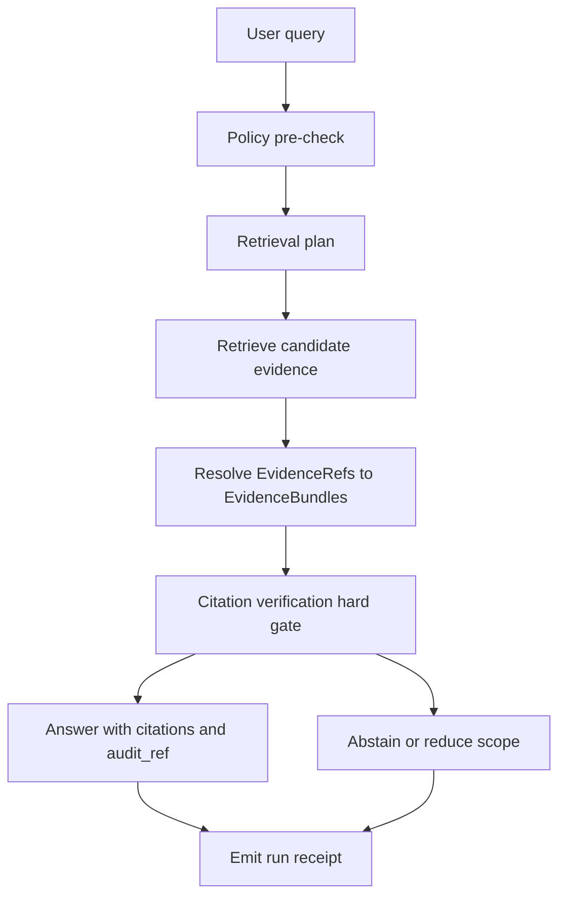

<!--
[KFM_META_BLOCK_V2]
doc_id: kfm://doc/examples/sample_focus/readme@v1
title: Sample Focus Mode (Cite-or-Abstain)
type: doc
version: v1
status: draft
owners: kfm-engineering; kfm-governance
created: 2026-02-22
updated: 2026-02-22
policy_label: public
[/KFM_META_BLOCK_V2]
-->

# Sample Focus Mode (Cite-or-Abstain)
Evidence-led Q&A example that **must cite or abstain**, and always emits an **audit receipt**.

**Status:** sample / reference (not production)  
**Owners:** KFM Engineering + Governance (update as needed)  
**North stars:** map-first • time-aware • governed • evidence-first

---

## Navigation
- [What this sample is](#what-this-sample-is)
- [Non-goals](#non-goals)
- [Conceptual control loop](#conceptual-control-loop)
- [Key contracts](#key-contracts)
- [EvidenceRef and EvidenceBundle](#evidenceref-and-evidencebundle)
- [Abstention UX](#abstention-ux)
- [Evaluation harness](#evaluation-harness)
- [Security and governance notes](#security-and-governance-notes)
- [Suggested directory layout](#suggested-directory-layout)
- [Definition of Done](#definition-of-done)

---

## What this sample is

This folder is a **thin-slice example** of KFM **Focus Mode**: a governed “research assistant” surface that:
- treats each question as a **governed run** (with a receipt),
- retrieves admissible evidence (from catalogs / indexes / DB),
- resolves evidence via the **Evidence Resolver**,
- **hard-gates** on citation verification,
- and returns either:
  - an answer with **resolvable citations**, or
  - a **policy-safe abstention / partial answer** with an `audit_ref`.

> **NOTE**
> This sample is intentionally small and reversible. If your repo’s actual implementation differs, update this README to match the real file layout and scripts—**but keep the invariants** (policy boundary, evidence resolver, citation hard gate).

[Back to top](#sample-focus-mode-cite-or-abstain)

---

## Non-goals

This example is **not**:
- a full retrieval system (vector search, full graph traversal, etc.),
- a production policy pack,
- a UI implementation,
- or a substitute for dataset Promotion Contract gates.

It **is** a reference for Focus Mode’s **contracts and safety invariants**.

[Back to top](#sample-focus-mode-cite-or-abstain)

---

## Conceptual control loop

The recommended control loop is intentionally explicit, and includes a **hard gate** on citation verification.



**Hard gate:** if citations cannot be verified as resolvable and policy-allowed, the response **must abstain** or reduce scope.

[Back to top](#sample-focus-mode-cite-or-abstain)

---

## Key contracts

Focus Mode depends on two contract surfaces:

1) **Governed Focus endpoint**  
   `POST /api/v1/focus/ask`  
   Returns: answer OR abstain + `citations[]` + `audit_ref`.

2) **Evidence Resolver**  
   `POST /api/v1/evidence/resolve`  
   Input: `EvidenceRef` (scheme://...) or structured reference  
   Output: an `EvidenceBundle` (policy decision + digests + inspectable views).

> **WARNING**
> Focus Mode must never “cite” raw text from an index directly. Retrieval outputs must map back to **EvidenceRefs** that can be resolved into evidence bundles.

### Focus ask request (illustrative)

```json
{
  "query": "What changed in storm frequency in this region after 1980?",
  "view_state": {
    "bbox": [-102.0, 36.9, -94.6, 40.0],
    "time_window": { "start": "1980-01-01", "end": "2024-12-31" },
    "layers": [
      { "layer_id": "noaa_storm_events", "dataset_version_id": "2026-02.abcd1234" }
    ]
  }
}
```

### Focus ask response (illustrative)

```json
{
  "answer": "I can summarize the publicly available storm event counts in your selected window, but I cannot infer causality from this evidence alone. See cited datasets and run receipts.",
  "citations": [
    { "ref": "dcat://noaa_ncei_storm_events@2026-02.abcd1234", "kind": "dcat" },
    { "ref": "prov://run/2026-02-20T12:34:56Z.noaa_ncei_storm_events.abcd1234", "kind": "prov" }
  ],
  "audit_ref": "kfm://run/2026-02-22T18:03:11Z.focus_query.1234abcd"
}
```

> **TIP**
> If your repo includes a schema (e.g., `contracts/schemas/focus_response_v1.schema.json`), treat it as the canonical contract and keep this README’s examples aligned.

[Back to top](#sample-focus-mode-cite-or-abstain)

---

## EvidenceRef and EvidenceBundle

### Citation principles

A Focus Mode “citation” is an `EvidenceRef` that:
- resolves to a **stable, inspectable** view inside KFM,
- references an **immutable dataset version** (and where relevant, a **span**),
- survives re-hosting because it uses canonical IDs (not fragile URLs).

### EvidenceRef schemes

At minimum, support schemes that resolve into the catalog/provenance/doc surfaces:

- `dcat://...` → dataset/distribution metadata  
- `stac://...` → collection/item/asset metadata  
- `prov://...` → lineage / run receipts  
- `doc://...` → governed documents and page/span citations  
- `graph://...` → entity relations (optional)

**Rules of thumb**
- EvidenceRefs should be parseable (and syntax-checkable) **without network calls**.
- The Evidence Resolver must validate syntax and return **policy-safe** errors.

### Document EvidenceRefs (page + span)

For scanned docs / OCR, use page anchors and spans (typically character offsets):

```text
doc://sha256:<artifact_digest>#page=<page_number>&span=<start>:<end>
```

### EvidenceBundle (template)

Evidence Resolver returns a bundle that the UI can render as a human “card” and the system can treat as machine-verifiable metadata.

```json
{
  "bundle_id": "sha256:bundle...",
  "dataset_version_id": "2026-02.abcd1234",
  "title": "Storm event record: 2026-02-19",
  "policy": {
    "decision": "allow",
    "policy_label": "public",
    "obligations_applied": []
  },
  "license": { "spdx": "CC-BY-4.0", "attribution": "Source org" },
  "provenance": { "run_id": "kfm://run/2026-02-20T12:00:00Z.abcd" },
  "artifacts": [
    {
      "href": "processed/events.parquet",
      "digest": "sha256:2222",
      "media_type": "application/x-parquet"
    }
  ],
  "checks": { "catalog_valid": true, "links_ok": true },
  "audit_ref": "kfm://audit/entry/123"
}
```

### Citation verification and linting

At minimum, CI (and/or the Focus orchestrator) should validate:
- syntax of EvidenceRefs,
- resolver check (evidence resolves in a test environment),
- policy check (citations allowed for the user/role),
- rights check (if media is included, rights metadata exists).

[Back to top](#sample-focus-mode-cite-or-abstain)

---

## Abstention UX

Abstention is a feature: the UI should make it understandable **without leaking restricted info**.

When abstaining:
- state **why** in policy-safe terms (e.g., “restricted evidence not available to your role”),
- suggest **safe alternatives** (broader time range; public datasets),
- always include `audit_ref` so stewards can review.

> **WARNING**
> Never show “ghost metadata” that reveals restricted dataset existence unless policy explicitly allows.

[Back to top](#sample-focus-mode-cite-or-abstain)

---

## Evaluation harness

Before broad release, Focus Mode should have an evaluation harness with tests for:
- citation coverage (claims supported by citations),
- citation resolvability (citations resolve for allowed users),
- refusal correctness (restricted questions get policy-safe refusals),
- sensitivity leakage (no restricted coordinates / metadata in outputs),
- regression tests (“golden queries” across dataset versions).

> **TIP**
> Run the harness in CI for Focus Mode changes and before each release.

[Back to top](#sample-focus-mode-cite-or-abstain)

---

## Security and governance notes

Focus Mode must resist:
- **prompt injection** from documents (e.g., malicious OCR text),
- **data exfiltration** attempts (e.g., “show me the restricted dataset list”).

Defensive posture:
- tool allowlist (model cannot call arbitrary tools),
- explicit system policy about refusing restricted sources,
- Evidence Resolver is the only source of truth for citations,
- redaction obligations applied **before** model sees restricted text.

Additional invariants:
- UI shows policy badges/notices; **UI never makes policy decisions**.
- Audit logs are sensitive; apply retention and redaction policies.
- Avoid embedding precise coordinates in outputs unless policy explicitly allows.

[Back to top](#sample-focus-mode-cite-or-abstain)

---

## Suggested directory layout

> **NOTE**
> This is an example layout. Adjust to match your repo.

```text
examples/sample_focus/
  README.md

  fixtures/
    catalogs/            # DCAT/STAC/PROV fixtures used by tests
    policy/              # allow/deny fixtures + obligations cases
    golden_queries/      # regression prompts + expected outcomes

  contracts/
    schemas/             # focus response schema, evidence bundle schema (if present)

  src/
    focus/               # orchestrator and citation verifier
    evidence/            # resolver adapter (or mock for sample)
    policy/              # PDP/PEP adapter (or mock for sample)

  tests/
    eval/                # focus harness runner
```

[Back to top](#sample-focus-mode-cite-or-abstain)

---

## Definition of Done

This sample is “done” when:

- [ ] `POST /api/v1/focus/ask` returns either:
  - [ ] answer + resolvable citations + `audit_ref`, or
  - [ ] abstain/partial + `audit_ref`
- [ ] Citation verification is enforced as a **hard gate**
- [ ] Evidence resolver contract test exists (resolve allow + deny without metadata leakage)
- [ ] Run receipt is emitted for Focus queries
- [ ] Evaluation harness runs and includes golden queries; regressions block merge

[Back to top](#sample-focus-mode-cite-or-abstain)

---

## Appendix: run receipt template (reference)

<details>
<summary>Run receipt JSON (v1 template)</summary>

```json
{
  "kfm_run_receipt_version": "v1",
  "run_id": "kfm://run/2026-02-20T12:34:56Z.noaa_ncei_storm_events.abcd1234",
  "run_type": "pipeline",
  "dataset_slug": "noaa_ncei_storm_events",
  "dataset_version_id": "2026-02.abcd1234",
  "spec_hash": "sha256:abcd1234...",

  "inputs": [
    {
      "artifact_id": "kfm://artifact/sha256:1111...",
      "zone": "raw",
      "uri": "s3://kfm-raw/noaa/stormevents/2026-02.csv",
      "digest": "sha256:1111..."
    }
  ],
  "outputs": [
    {
      "artifact_id": "kfm://artifact/sha256:2222...",
      "zone": "processed",
      "path": "data/processed/noaa_ncei_storm_events/2026-02.abcd1234/events.parquet",
      "digest": "sha256:2222...",
      "media_type": "application/x-parquet"
    }
  ],

  "validation": {
    "status": "pass",
    "reports": [
      { "name": "schema_check", "status": "pass" },
      { "name": "geometry_valid", "status": "pass", "value": 1.0 }
    ]
  },

  "policy": {
    "policy_label": "public",
    "decision_id": "kfm://policy_decision/xyz",
    "obligations": []
  },

  "environment": {
    "git_commit": "<commit>",
    "container_image": "sha256:<image_digest>",
    "runtime": "kubernetes",
    "parameters": {}
  },

  "timestamps": {
    "started_at": "2026-02-20T12:34:56Z",
    "ended_at": "2026-02-20T12:45:10Z"
  }
}
```

</details>
