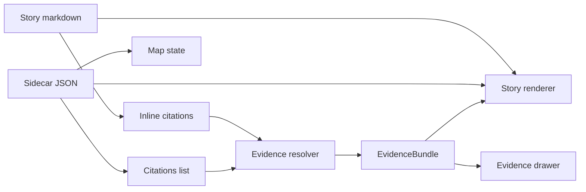

# Sample Story Node v3 (KFM) — Example Folder

Minimal, copy‑pasteable example of a **KFM Story Node v3**: **markdown narrative + JSON sidecar** that binds narrative to **map state** and **citations**.

**Status:** Draft (example) · **Spec:** Story Node v3 · **Policy label:** `public` (example) · **Format:** Markdown + JSON sidecar

---

## Jump to

- [What this is](#what-this-is)
- [Folder layout](#folder-layout)
- [Quick start](#quick-start)
- [Story Node v3 anatomy](#story-node-v3-anatomy)
- [Map state checklist](#map-state-checklist)
- [Citations and EvidenceRefs](#citations-and-evidencerefs)
- [Governance and review](#governance-and-review)
- [Definition of Done](#definition-of-done)
- [Appendix: Flow diagram](#appendix-flow-diagram)

---

## What this is

A **Story Node** is a publishable narrative artifact that connects:

- **Narrative text** (human‑readable markdown)
- **Map state** (bbox / time window / layer selections)
- **Citations** (EvidenceRefs that must resolve under policy)

This folder exists to give you a “known‑good shape” for a Story Node v3 before you wire it into any UI renderer or API pipeline.

> NOTE  
> IDs, dataset versions, and citation refs below are **placeholders**. Replace with real values that exist in your environment.

[Back to top](#jump-to)

---

## Folder layout

```text
examples/sample_story/
  README.md                      # This file
  sample_story.md                # (recommended) Story Node markdown
  sample_story.story.json        # (recommended) Story Node sidecar JSON
  assets/                        # (optional) images/media used by the story
    example-image.png
```

If `sample_story.md` / `sample_story.story.json` don’t exist yet, create them by copy‑pasting the templates in the next section.

[Back to top](#jump-to)

---

## Quick start

1. Create the two files:
   - `examples/sample_story/sample_story.md`
   - `examples/sample_story/sample_story.story.json`
2. Paste the templates from [Story Node v3 anatomy](#story-node-v3-anatomy).
3. Replace placeholders:
   - Generate a new `story_id` UUID and keep it stable.
   - Set `version_id` (e.g., `v1`).
   - Set `policy_label` appropriately.
   - Replace `dataset_version_id` with a **promoted** dataset version.
4. Add citations:
   - Every factual claim should have a citation (EvidenceRef).
   - Ensure citations resolve via your evidence resolver (see [Citations and EvidenceRefs](#citations-and-evidencerefs)).
5. Don’t publish until it passes the [Definition of Done](#definition-of-done).

[Back to top](#jump-to)

---

## Story Node v3 anatomy

A Story Node v3 is **two files**: a markdown document + a JSON sidecar.

### 1) Markdown file: `sample_story.md`

```md
[KFM_META_BLOCK_V2]
doc_id: kfm://story/<uuid>@v1
title: Sample Story — Replace Me
type: story
version: v3
status: draft
owners: <names/teams>
created: YYYY-MM-DD
updated: YYYY-MM-DD
policy_label: public
related:
  - kfm://dataset/<slug>@<dataset_version_id>
[/KFM_META_BLOCK_V2]

# Sample Story — Replace Me

## Summary
Short summary of the story, including scope, geography, and time window.

## Claims
1. Example factual claim. [CITATION: dcat://<dataset>@<dataset_version_id>]
2. Example factual claim tied to a spatial item. [CITATION: stac://<collection-or-item-id>]
3. Example provenance claim (how a layer was produced). [CITATION: prov://run/<run-id>]

## Narrative
Write the narrative. Use inline citations for factual assertions:
- A sentence with a cite. [CITATION: doc://<doc-id-or-url-like-ref>]

## Evidence
- [CITATION: dcat://<dataset>@<dataset_version_id>]
- [CITATION: stac://<collection-or-item-id>]
- [CITATION: prov://run/<run-id>]
```

### 2) Sidecar JSON: `sample_story.story.json`

```json
{
  "kfm_story_node_version": "v3",
  "story_id": "kfm://story/<uuid>",
  "version_id": "v1",

  "status": "draft",
  "policy_label": "public",
  "review_state": "needs_review",

  "map_state": {
    "bbox": [-102.0, 36.9, -94.6, 40.0],
    "zoom": 6,
    "layers": [
      { "layer_id": "example_layer_id", "dataset_version_id": "YYYY-MM.<hash>" }
    ],
    "time_window": { "start": "YYYY-MM-DD", "end": "YYYY-MM-DD" }
  },

  "citations": [
    { "ref": "dcat://example_dataset@YYYY-MM.<hash>", "kind": "dcat" },
    { "ref": "prov://run/YYYY-MM-DDThh:mmZ.example", "kind": "prov" }
  ]
}
```

> TIP  
> Keep the sidecar small and deterministic: treat it like a **contract** the UI and APIs can validate.

[Back to top](#jump-to)

---

## Map state checklist

Use these rules of thumb when editing `map_state`:

- Reference **promoted dataset versions** (not work-in-progress IDs).
- Keep filters policy‑safe (avoid hidden/restricted fields).
- Keep map state small enough to embed in the sidecar without turning the Story Node into a giant blob.

[Back to top](#jump-to)

---

## Citations and EvidenceRefs

In KFM, “citations” should be treated as **resolvable EvidenceRefs**.

### Practical guidance

- Prefer stable, versioned references:
  - `dcat://<dataset>@<dataset_version_id>`
  - `stac://<collection-or-item>`
  - `prov://run/<run-id>`
  - `doc://<doc-id>` (or another agreed doc reference scheme)
- Keep citations in **two places**:
  1. Inline in markdown near the claim (`[CITATION: ...]`)
  2. Listed in the sidecar `citations[]` (so the renderer can prefetch/validate)

### Why this matters

A story is publishable only if its citations can be validated and resolved under policy. If a citation can’t resolve, treat that as a **fail‑closed** event: fix the ref or downgrade the claim.

[Back to top](#jump-to)

---

## Governance and review

This is an example folder, but the same governance rules apply when you move from “draft” to “published”.

### Content standards

A publishable Story Node should:

- Declare scope (time window, geography).
- Separate observation claims from interpretive claims.
- Include citations for every factual claim.
- Include uncertainty notes where sources conflict or are incomplete.
- Include licensing and attribution for embedded media.
- Include policy label and review state.

### Review workflow

Typical flow:

1. Draft (citations must resolve in-editor)
2. Review (steward + historian/editor)
3. Governance review (triggered for sensitive topics/locations, Indigenous histories, etc.)
4. Publish (immutable; edits create a new version)

### Sensitivity defaults

- Do **not** publish precise locations for culturally sensitive sites.
- Prefer generalized public derivatives by default.
- If permissions/rights are unclear: **fail closed** and flag for governance review.

[Back to top](#jump-to)

---

## Definition of Done

Use this as the minimum publish gate for a Story Node example.

### Story Node files

- [ ] `sample_story.md` exists and includes `[KFM_META_BLOCK_V2] ... [/KFM_META_BLOCK_V2]`
- [ ] `sample_story.story.json` exists and is valid JSON
- [ ] `doc_id`, `story_id`, and `version_id` are present and stable
- [ ] `policy_label` is set correctly in both files

### Map state

- [ ] `map_state` references **promoted** `dataset_version_id`s
- [ ] `time_window` is set (or intentionally omitted with a documented reason)
- [ ] No policy‑unsafe filters or restricted fields

### Citations and evidence

- [ ] Every factual claim has an inline `[CITATION: ...]`
- [ ] Sidecar `citations[]` includes the same (or a superset) of refs
- [ ] All citations resolve under policy and do not violate rights/permissions
- [ ] Any embedded media includes license + attribution notes

### Review + publish readiness

- [ ] `review_state` reflects reality (e.g., `needs_review` vs `approved`)
- [ ] Sensitive topics / Indigenous histories / sensitive locations have been flagged for governance review where required
- [ ] No restricted coordinates or vulnerable infrastructure details are exposed

[Back to top](#jump-to)

---

## Appendix: Flow diagram



> The core invariant: narrative + map state + evidence must remain **traceable** and **policy-governed**.

[Back to top](#jump-to)
