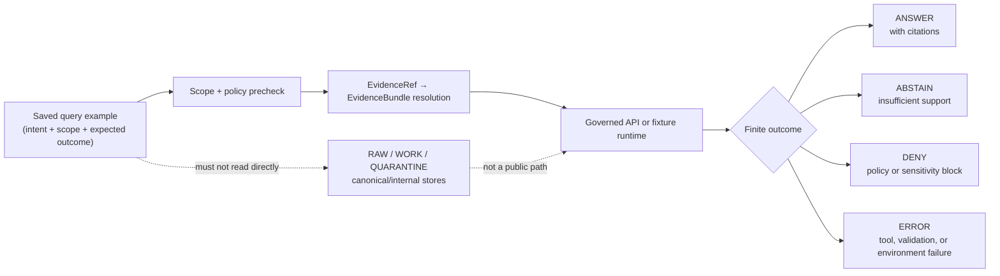

<!-- [KFM_META_BLOCK_V2]
doc_id: kfm://doc/NEEDS-VERIFICATION
title: Saved Queries Examples README
type: standard
version: v1
status: draft
owners: OWNER_TBD
created: "NEEDS VERIFICATION: YYYY-MM-DD"
updated: "NEEDS VERIFICATION: YYYY-MM-DD"
policy_label: "NEEDS VERIFICATION: public-doc"
related: ["../README.md NEEDS VERIFICATION", "../../README.md NEEDS VERIFICATION", "kfm://doc/NEEDS-VERIFICATION"]
tags: [kfm, examples, saved-queries, evidence, policy, fixtures]
notes: ["Target path supplied by request.", "Repo implementation depth UNKNOWN.", "Doc ID, owners, dates, related links, validator command, and adjacent docs require repo inspection."]
[/KFM_META_BLOCK_V2] -->

# Saved Queries Examples

Reusable query-intent fixtures for exercising KFM evidence resolution, policy decisions, and cite-or-abstain behavior without treating examples as publication truth.

> [!IMPORTANT]
> **Status:** experimental  
> **Owners:** `OWNER_TBD`  
> **Path:** `examples/saved_queries/README.md`  
> **Truth posture:** CONFIRMED KFM doctrine / PROPOSED directory conventions / UNKNOWN repo implementation depth  
>
> 
> 
> 
> 
> 
>
> **Quick jumps:** [Scope](#scope) · [Repo fit](#repo-fit) · [Accepted inputs](#accepted-inputs) · [Exclusions](#exclusions) · [Saved query shape](#saved-query-shape) · [Review gates](#review-gates) · [Rollback](#rollback) · [Verification backlog](#verification-backlog)

---

## Scope

`examples/saved_queries/` is the proposed home for **public-safe saved-query examples**: small, inspectable records that describe a query intent, its spatial and temporal scope, the evidence expectations required to answer it, and the expected finite outcome.

A saved query is **not** a saved answer.

It should help maintainers test whether KFM can move from a user-facing question to a governed response path:

```text
scope -> policy precheck -> EvidenceRef resolution -> EvidenceBundle -> governed outcome
```

The examples in this directory should make it easier to review whether KFM preserves its trust membrane:

```text
RAW -> WORK / QUARANTINE -> PROCESSED -> CATALOG / TRIPLET -> PUBLISHED
```

> [!NOTE]
> This directory should contain examples and fixtures only. It must not contain live source credentials, unpublished evidence, sensitive exact locations, raw source data, or authoritative published claims.

[Back to top](#saved-queries-examples)

---

## Repo fit

| Relationship | Path or surface | Status | Notes |
| --- | --- | --- | --- |
| This README | `examples/saved_queries/README.md` | PROPOSED from request | Target path supplied by the current task. |
| Parent examples area | `examples/` | NEEDS VERIFICATION | Confirm parent README, naming style, and fixture conventions after repo inspection. |
| Repo landing page | `../../README.md` | NEEDS VERIFICATION | Link only after confirming root README exists from this path. |
| Downstream consumers | validators, governed API fixtures, Focus Mode tests, Evidence Drawer examples | PROPOSED | Exact commands, packages, and DTO names are UNKNOWN. |
| Contract authority | `schemas/`, `contracts/`, or other repo-native home | CONFLICTED / NEEDS VERIFICATION | This README must not create parallel schema authority. |

The directory belongs near examples because its records are **teaching, testing, and review fixtures**. They should demonstrate KFM behavior without becoming canonical source records, catalog records, release manifests, or proof objects.

---

## Accepted inputs

Use this directory for public-safe, reviewable example records such as:

- Saved-query intent fixtures that exercise `ANSWER`, `ABSTAIN`, `DENY`, or `ERROR`.
- Synthetic or fully public-safe query scenarios.
- Query records that require `EvidenceRef -> EvidenceBundle` resolution before answering.
- Examples that test spatial scope, temporal scope, source-role constraints, citation behavior, stale-state handling, or policy denial.
- Small manifests that help validators discover saved-query examples.
- Notes explaining why a query should abstain or deny under current evidence conditions.

Preferred file posture:

| File kind | Suggested pattern | Status |
| --- | --- | --- |
| Saved query example | `*.example.yaml` or `*.example.json` | PROPOSED |
| Directory index | `index.example.yaml` | PROPOSED |
| Notes for maintainers | `README.md` | CONFIRMED target |
| Local scratch files | Do not commit | PROPOSED rule |

> [!TIP]
> A strong saved-query example should be boringly inspectable: one question, one scope, one evidence expectation, one policy expectation, one expected outcome.

[Back to top](#saved-queries-examples)

---

## Exclusions

Do **not** place these here:

| Excluded material | Why it does not belong | Safer destination |
| --- | --- | --- |
| Raw source records | Bypasses the KFM lifecycle. | `RAW` intake area after repo policy is verified. |
| WORK or QUARANTINE data | Not public-safe and not release-ready. | Governed work/quarantine storage. |
| Published claims | A saved query is not a publication artifact. | `PUBLISHED`, release, or catalog surfaces after promotion. |
| API keys, tokens, cookies, secrets | Security risk. | Secret manager or local untracked configuration. |
| Exact sensitive locations | Can expose archaeological, ecological, cultural, living-person, or infrastructure risk. | Redacted/generalized fixture with policy receipt. |
| Model prompts that bypass evidence | Violates evidence-subordinate AI posture. | Governed AI test fixture with citation validation. |
| Schema definitions with authority claims | Could create parallel contract authority. | Repo-native schema/contract home after ADR. |
| Live scraping or watcher configs | Source rights and cadence require activation gates. | Source registry and pipeline docs after verification. |

If an example needs sensitive behavior, encode the **policy expectation** rather than the sensitive fact.

Example: use `expected_runtime_outcome: DENY` with a reason such as `sensitive_location_exact_geometry_not_allowed`.

---

## Directory shape

The actual repo tree is UNKNOWN until inspected. If no existing convention conflicts, this directory can grow toward a compact shape like this:

```text
examples/saved_queries/
├── README.md
├── index.example.yaml                 # PROPOSED: discoverable list of examples
├── core/
│   ├── evidence-resolution-abstain.example.yaml
│   ├── policy-deny-sensitive-location.example.yaml
│   └── citation-required-answer.example.yaml
├── hydrology/
│   └── huc12-flood-context.example.yaml
└── ui/
    └── evidence-drawer-focus-context.example.yaml
```

> [!WARNING]
> The tree above is a proposed example layout, not verified repo state. Confirm adjacent examples, package conventions, validator discovery paths, and schema authority before adding files.

[Back to top](#saved-queries-examples)

---

## Saved query shape

The repository’s canonical saved-query schema is UNKNOWN. Until a repo-native contract is verified, saved-query examples should be treated as **illustrative records** with reviewable fields.

Minimum useful fields:

| Field family | Purpose | Requirement posture |
| --- | --- | --- |
| Identity | Stable ID, title, owner, status | Required once schema exists |
| Query text | The human question or query intent | Required |
| Scope | Spatial, temporal, domain, and release scope | Required |
| Evidence expectations | Required EvidenceRefs, source roles, bundle resolution behavior | Required |
| Policy expectations | Public-safe, sensitivity, rights, freshness, review behavior | Required |
| Expected outcome | `ANSWER`, `ABSTAIN`, `DENY`, or `ERROR` | Required |
| Review state | Who reviewed the example and why it exists | NEEDS VERIFICATION |
| Rollback target | How to remove or quarantine the example | Recommended |

<details>
<summary>Illustrative saved-query record</summary>

```yaml
# PROPOSED illustrative record only.
# Do not treat this as the canonical schema until repo contracts are verified.

query_id: SOURCE_ID_TBD
title: "Hydrology flood context with unresolved evidence"
status: example
owner: OWNER_TBD
truth_label: PROPOSED

question: "What released evidence supports flood-context claims for this Kansas HUC12 fixture?"

scope:
  domain: hydrology
  spatial_scope:
    type: generalized_fixture_area
    value: "Kansas HUC12 fixture area"
    precision_policy: public_safe_only
  temporal_scope:
    valid_time: "TODO(date): confirm fixture date"
    as_of_time: "TODO(date): confirm catalog snapshot"

required_evidence:
  resolution_rule: "EvidenceRef -> EvidenceBundle"
  required_source_roles:
    - authoritative_or_regulatory_context
    - observational_or_catalog_context
  unresolved_evidence_behavior: ABSTAIN

policy_expectation:
  public_release: "requires released artifact and review state"
  sensitive_location: fail_closed
  rights_status: "NEEDS VERIFICATION"
  raw_store_access: DENY

expected_runtime_outcome: ABSTAIN
expected_reason: "No confirmed EvidenceBundle fixture exists until repo inspection verifies the example data and contracts."

review:
  reviewer: OWNER_TBD
  review_state: NEEDS VERIFICATION
  notes:
    - "Fixture must stay public-safe."
    - "Do not convert this query into a published hydrology claim."
```

</details>

---

## Query lifecycle diagram



Diagram rule: saved queries exercise the governed response path. They do not authorize direct access to canonical stores or unpublished lifecycle stages.

[Back to top](#saved-queries-examples)

---

## Usage

Use saved queries to make evidence behavior testable.

1. Start with a single question.
2. Declare the spatial and temporal scope.
3. Declare the evidence that must exist before an answer is allowed.
4. Declare the policy outcome when evidence, rights, sensitivity, or review state is insufficient.
5. Mark whether the example should produce `ANSWER`, `ABSTAIN`, `DENY`, or `ERROR`.
6. Keep fixtures synthetic or public-safe.
7. Run the repo-native validator after the command is verified.

Validator command:

```text
NEEDS VERIFICATION: confirm repo-native saved-query validator command after package manager and test conventions are inspected.
```

Do not invent a package manager, test runner, schema path, or route name for this directory.

---

## Review gates

Before a saved-query example is committed, reviewers should confirm:

- [ ] The example is public-safe.
- [ ] The example does not contain secrets, tokens, cookies, or credentials.
- [ ] The example does not include raw, work, quarantine, or unpublished data.
- [ ] The expected outcome is finite: `ANSWER`, `ABSTAIN`, `DENY`, or `ERROR`.
- [ ] Any `ANSWER` expectation requires citation-bearing EvidenceBundle resolution.
- [ ] Any missing evidence expectation is marked `ABSTAIN`, not filled with fluent prose.
- [ ] Any policy or sensitivity block is marked `DENY`.
- [ ] Sensitive location, living-person, land/title, archaeology, cultural, ecological, DNA, or security-relevant examples fail closed unless a reviewed public-safe transform is documented.
- [ ] File names, schema references, and validator discovery paths match repo convention.
- [ ] Rollback is obvious.

> [!CAUTION]
> Do not add examples that make KFM appear to support emergency response, legal/title determination, medical advice, financial advice, cultural-site disclosure, exact sensitive species disclosure, or other high-risk authoritative claims without explicit policy, evidence, review, and release support.

---

## Maintenance

Saved-query examples should be revisited when any of these change:

| Trigger | Required action |
| --- | --- |
| EvidenceBundle contract changes | Revalidate examples and update expected outcomes. |
| Policy rules change | Recheck all `DENY` and `ABSTAIN` examples. |
| Source registry changes | Confirm source roles and rights expectations. |
| Release/catalog structure changes | Confirm examples do not imply stale publication paths. |
| Focus Mode or Evidence Drawer payloads change | Update UI-facing examples after contract review. |
| New sensitive domain examples are added | Require fail-closed review before commit. |

Keep examples small. Large examples hide trust failures.

---

## Rollback

Rollback is required when a saved-query example weakens evidence discipline, bypasses the trust membrane, includes sensitive or unpublished material, creates schema authority conflict, breaks validator discovery, or implies an unsupported authoritative answer.

Rollback target: `ROLLBACK_TARGET_TBD_AFTER_REPO_INSPECTION`

Recommended rollback actions:

1. Remove or quarantine the offending example file.
2. Remove it from `index.example.yaml` if that index exists.
3. Record why the example was removed.
4. Re-run the repo-native saved-query validator after the command is verified.
5. Confirm no downstream fixture, screenshot, generated doc, or UI example still depends on the removed query.

---

## Verification backlog

These items must be resolved before this directory can be treated as stable repo convention:

- [ ] Confirm `examples/saved_queries/` exists or create it through repo-accepted placement.
- [ ] Confirm owners and reviewers.
- [ ] Confirm adjacent `examples/` README and root README links.
- [ ] Confirm whether saved-query examples use YAML, JSON, Markdown, or another repo-native format.
- [ ] Confirm schema or contract authority; do not create parallel definitions.
- [ ] Confirm validator command and CI integration.
- [ ] Confirm whether examples are discovered by tests, docs, UI fixtures, or governed API fixtures.
- [ ] Confirm naming convention for example files.
- [ ] Confirm public policy label for this README.
- [ ] Confirm rollback target and correction-note convention.

---

## Appendix: placeholder index format

<details>
<summary>PROPOSED <code>index.example.yaml</code> shape</summary>

```yaml
# PROPOSED illustrative index only.
# Do not treat as repo schema authority.

saved_query_examples:
  - path: core/evidence-resolution-abstain.example.yaml
    expected_runtime_outcome: ABSTAIN
    reason: unresolved_evidence_ref
    public_safe: true

  - path: core/policy-deny-sensitive-location.example.yaml
    expected_runtime_outcome: DENY
    reason: sensitive_exact_location
    public_safe: true

  - path: core/citation-required-answer.example.yaml
    expected_runtime_outcome: ANSWER
    reason: released_evidence_bundle_available
    public_safe: true
    needs_verification: "Confirm fixture EvidenceBundle and citation validator."
```

</details>

[Back to top](#saved-queries-examples)
