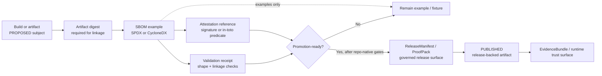

<!-- [KFM_META_BLOCK_V2]
doc_id: kfm://doc/NEEDS-VERIFICATION__examples_sbom_readme
title: SBOM Examples
type: standard
version: v1
status: draft
owners: OWNER_TBD_AFTER_REPO_INSPECTION
created: 2026-05-02
updated: 2026-05-02
policy_label: NEEDS_VERIFICATION__public_or_internal
related: [NEEDS_VERIFICATION:../README.md, NEEDS_VERIFICATION:../../README.md, NEEDS_VERIFICATION:../../.github/README.md, NEEDS_VERIFICATION:../../docs/security/README.md, NEEDS_VERIFICATION:../../schemas/README.md, NEEDS_VERIFICATION:../../tools/README.md]
tags: [kfm, examples, sbom, supply-chain, provenance, attestations]
notes: [Target path and child fixture inventory require mounted-repo verification, This README is example-facing and does not claim production SBOM generation or release-signing automation, Exact SBOM standard versions and tooling pins must be verified before activation]
[/KFM_META_BLOCK_V2] -->

<a id="top"></a>

# SBOM Examples

Small, reviewable SBOM fixtures for proving KFM supply-chain evidence patterns without turning examples into release authority.

> [!IMPORTANT]
> **Impact block**
>
> | Field | Value |
> |---|---|
> | Status | `experimental` |
> | Owners | `OWNER_TBD_AFTER_REPO_INSPECTION` |
> | Path | `examples/sbom/README.md` |
> | Repo fit | Example-fixture lane for SBOM shape, artifact linkage, validation receipts, and attestation references |
> | Truth posture | CONFIRMED KFM doctrine / PROPOSED example layout / UNKNOWN repo implementation depth |
> | Quick jumps | [Scope](#scope) · [Repo fit](#repo-fit) · [Accepted inputs](#accepted-inputs) · [Exclusions](#exclusions) · [Directory tree](#directory-tree) · [Quickstart](#quickstart) · [Usage](#usage) · [Diagram](#diagram) · [Operating tables](#operating-tables) · [Task list](#task-list--definition-of-done) · [FAQ](#faq) · [Appendix](#appendix) |


> [!NOTE]
> This directory is for **examples**, not production release evidence. A fixture here can demonstrate SBOM shape, expected links, and validation behavior. It cannot prove that an artifact was built, signed, promoted, or published.

---

## Scope

`examples/sbom/` exists to hold tiny, public-safe SBOM examples that help maintainers test and explain KFM supply-chain evidence patterns.

These examples should make four relationships easy to inspect:

1. an artifact has a stable digest;
2. an SBOM describes the artifact or build output;
3. validation produces a receipt or verdict;
4. promotion consumes release evidence from governed homes, not from this example directory.

This README does **not** claim that SBOM generation, signing, attestation upload, release promotion, branch protection, or CI validation already exists in the mounted repository.

---

## Repo fit

| Neighbor | Relationship | Status |
|---|---|---|
| `../README.md` | Parent examples landing page that should link to this directory | NEEDS VERIFICATION |
| `../../README.md` | Root orientation and trust posture | NEEDS VERIFICATION |
| `../../.github/` | Possible workflow and policy-check surface for SBOM generation or validation | NEEDS VERIFICATION |
| `../../docs/security/` | Possible supply-chain security documentation home | PROPOSED / NEEDS VERIFICATION |
| `../../schemas/` | Possible schema home for SBOM index, receipt, or verdict shapes | PROPOSED / NEEDS VERIFICATION |
| `../../tools/` | Possible validator or attestation-verifier home | PROPOSED / NEEDS VERIFICATION |
| `../../data/proofs/` or release bundle home | Production release proof location, if the repo uses that convention | PROPOSED / NEEDS VERIFICATION |

> [!CAUTION]
> Do not make `examples/sbom/` a backdoor release store. Production SBOMs, signatures, attestations, proof packs, and release manifests belong in governed release/proof surfaces after validation and review.

[Back to top](#top)

---

## Accepted inputs

The directory may contain **synthetic**, **minimal**, and **reviewable** examples such as:

- SPDX or CycloneDX JSON fixtures with intentionally small component sets;
- an `sbom-index.example.json` that links artifact digests to SBOM files;
- example validation receipts that state what was checked and what was not checked;
- example attestation or signature-verdict payloads that point to an SBOM and artifact digest;
- negative fixtures that demonstrate fail-closed behavior;
- README notes explaining exact fields, expected validator behavior, and known limitations.

Every example file should make its status explicit:

| Example status | Meaning |
|---|---|
| `illustrative` | Useful for docs and review, not intended as a validator fixture |
| `valid_fixture` | Expected to pass repo-native validation once validators exist |
| `invalid_fixture` | Expected to fail validation for a named reason |
| `deprecated_example` | Retained only to document a former shape or migration path |

---

## Exclusions

Do not place these materials in `examples/sbom/`:

| Excluded material | Why it does not belong here | Put it here instead |
|---|---|---|
| Production SBOMs for released artifacts | Examples are not release authority | `data/proofs/`, `release/`, or repo-confirmed release bundle home |
| Real CI signing bundles | Release-significant proof must stay governed | Release/proof surface after policy and review |
| Secrets, tokens, private CI logs, or credentials | Public examples must be safe to inspect | Never commit; use secret-management path |
| Vulnerability triage records with active remediation details | SBOM shape is not incident handling | `docs/security/`, issue tracker, or incident-response surface |
| Raw dependency scans from unpublished internal code | Could expose sensitive implementation details | Quarantine or private review surface |
| Generated model or AI conclusions about dependency risk | AI output is interpretive, not root truth | Governed AI receipt/evidence lane if adopted |
| Policy bundles or Rego source | Examples may reference policy but do not own it | `policy/` or repo-confirmed policy home |

[Back to top](#top)

---

## Directory tree

PROPOSED starter layout:

```text
examples/sbom/
├── README.md
├── sbom-index.example.json
├── spdx/
│   ├── minimal.spdx.json
│   └── README.md
├── cyclonedx/
│   ├── minimal.cdx.json
│   └── README.md
├── attestations/
│   ├── example.sbom.intoto.jsonl
│   └── example.signature-verdict.json
└── receipts/
    ├── example-sbom-validation.receipt.json
    └── invalid-missing-artifact-digest.receipt.json
```

Directory status:

| Path | Role | Status |
|---|---|---|
| `README.md` | This boundary document | PROPOSED for commit |
| `sbom-index.example.json` | Fixture index linking artifact, SBOM, digest, and receipt references | PROPOSED |
| `spdx/` | SPDX-shaped examples | PROPOSED |
| `cyclonedx/` | CycloneDX-shaped examples | PROPOSED |
| `attestations/` | Example attestation and signature-verdict payloads | PROPOSED |
| `receipts/` | Example validation receipts and negative fixtures | PROPOSED |

---

## Quickstart

These commands are **inspection helpers**, not confirmed repo validation commands.

```bash
# From the repository root, after this directory exists.
find examples/sbom -maxdepth 3 -type f | sort
```

```bash
# Optional JSON readability check if jq is available.
jq . examples/sbom/sbom-index.example.json
jq . examples/sbom/spdx/minimal.spdx.json
jq . examples/sbom/cyclonedx/minimal.cdx.json
```

```bash
# PROPOSED only: replace with repo-native validator once confirmed.
python tools/validators/validate_sbom_examples.py examples/sbom
```

> [!WARNING]
> The final command is intentionally labeled **PROPOSED**. Do not add it to CI or documentation as a required check until `tools/validators/validate_sbom_examples.py` exists and has passing tests.

[Back to top](#top)

---

## Usage

Use this directory as a safe place to answer review questions like:

- What does an SBOM example look like when it is linked to an artifact digest?
- What fields should a KFM validation receipt include before an SBOM can support release evidence?
- How does a validator distinguish a missing digest from a missing license field?
- How should an attestation reference an SBOM without turning the example into release proof?
- Which fields need policy review before SBOM material is promoted into a release bundle?

### Recommended review pattern

1. Read this README.
2. Inspect the SBOM fixture.
3. Inspect the paired receipt or verdict.
4. Confirm the example marks itself as `illustrative`, `valid_fixture`, or `invalid_fixture`.
5. Confirm no public example claims production release status.
6. Confirm production proof references point outside `examples/`.

---

## Diagram



The key boundary is deliberate: `examples/sbom/` can teach and test shapes, but it cannot substitute for release proof, policy review, or publication approval.

[Back to top](#top)

---

## Operating tables

### Fixture role map

| Fixture family | Must include | Must not claim |
|---|---|---|
| SBOM JSON | format, version, component identity, component version, producer/tool note, artifact reference or subject | production release validity |
| SBOM index | `artifact_ref`, `artifact_digest`, `sbom_ref`, `standard`, `example_status` | that artifact exists in the repo |
| Validation receipt | check name, input paths, outcome, reason, checked timestamp, validator identity placeholder | CI enforcement unless confirmed |
| Signature verdict | artifact path, bundle path or attestation reference, outcome, issuer/identity placeholders | live Sigstore or Cosign verification unless command output proves it |
| Negative fixture | exact expected failure reason | ambiguous failure or “should fail somehow” |

### Minimum example fields

PROPOSED starter fields for `sbom-index.example.json`:

| Field | Purpose | Status |
|---|---|---|
| `example_id` | Stable fixture identity | PROPOSED |
| `example_status` | `illustrative`, `valid_fixture`, `invalid_fixture`, or `deprecated_example` | PROPOSED |
| `standard` | `spdx` or `cyclonedx` | PROPOSED |
| `standard_version` | Version used by the fixture | NEEDS VERIFICATION |
| `artifact_ref` | Subject artifact path or URI | PROPOSED |
| `artifact_digest` | Digest of the subject artifact | Required for meaningful validation |
| `sbom_ref` | Relative path to SBOM document | PROPOSED |
| `attestation_ref` | Optional path to attestation/verdict | PROPOSED |
| `validation_receipt_ref` | Optional path to receipt | PROPOSED |
| `release_ref` | Empty or placeholder unless a release proof exists elsewhere | MUST NOT point to this directory as release authority |

### Example index shape

```json
{
  "example_id": "kfm-example-sbom-minimal-001",
  "example_status": "illustrative",
  "standard": "cyclonedx",
  "standard_version": "NEEDS_VERIFICATION",
  "artifact_ref": "examples/sbom/artifacts/example-tool.tar.gz",
  "artifact_digest": "sha256:EXAMPLE_ONLY_REPLACE_WITH_REAL_DIGEST",
  "sbom_ref": "cyclonedx/minimal.cdx.json",
  "attestation_ref": "attestations/example.sbom.intoto.jsonl",
  "validation_receipt_ref": "receipts/example-sbom-validation.receipt.json",
  "release_ref": "NEEDS_VERIFICATION__external_release_manifest_if_promoted",
  "notes": [
    "Synthetic example only",
    "Does not prove production SBOM generation, signing, or release promotion"
  ]
}
```

[Back to top](#top)

---

## Task list / definition of done

This README is done enough to commit when:

- [ ] Target path `examples/sbom/README.md` is confirmed or created intentionally.
- [ ] Owner is replaced with the repo-confirmed owner or CODEOWNERS-backed placeholder.
- [ ] Parent `examples/README.md` links to this directory or explicitly defers it.
- [ ] Child fixture paths are created or the proposed tree is marked as future work.
- [ ] Each example declares `example_status`.
- [ ] No example fixture contains secrets, private logs, production credentials, or private dependency data.
- [ ] At least one valid and one invalid fixture exist once validators are introduced.
- [ ] Validator expectations are documented before CI enforcement.
- [ ] Production SBOMs and release proof objects are routed away from `examples/`.
- [ ] Rollback is clear: remove this directory or unlink it without changing production release artifacts.

### Promotion gate for stronger claims

Do not upgrade this README from `experimental` until the repo confirms:

- [ ] SBOM example files exist.
- [ ] The validator exists and is tested.
- [ ] CI or local validation commands are real and documented.
- [ ] Release/proof homes are confirmed.
- [ ] Any Sigstore, Cosign, SPDX, CycloneDX, or generator versions are pinned in repo-native tooling docs.
- [ ] A maintainer has reviewed the examples for public-safe disclosure.

---

## FAQ

### Are these examples release evidence?

No. They are examples and fixtures. Release evidence belongs in governed proof/release surfaces after validation, policy review, and promotion.

### Can a production SBOM be copied here for convenience?

No. Copying production release evidence into `examples/` blurs the trust membrane. Link to the production proof object from a governed release surface instead.

### Do these examples require a specific SBOM standard?

No single standard is forced by this README. SPDX and CycloneDX examples may both be useful. Exact versions and validator support must be verified before enforcement.

### Can this directory include vulnerability findings?

Only as synthetic examples with clear labels. Real vulnerability triage belongs in the security or incident-response surface, not this example lane.

### Can AI summarize these SBOMs?

Only as an interpretive layer over released or explicitly example-bounded evidence. AI output must not become the root truth source for dependency, license, vulnerability, or release claims.

[Back to top](#top)

---

## Appendix

### Evidence boundary

| Claim | Truth label |
|---|---|
| KFM doctrine requires governed, evidence-first, release-aware artifact handling | CONFIRMED doctrine |
| This target file path was requested by the user | CONFIRMED request |
| A mounted repo implementation exists at `examples/sbom/` | UNKNOWN |
| Child fixtures exist under `examples/sbom/` | UNKNOWN |
| Validator commands exist | UNKNOWN |
| SBOM generation/signing CI exists | UNKNOWN |
| The proposed directory tree is appropriate for a safe first slice | PROPOSED |
| Exact SBOM standard versions and generator tooling are current | NEEDS VERIFICATION |

### Rollback

Rollback is simple because this directory is example-facing.

Rollback target: `examples/sbom/`

Rollback should remove or revert:

- `examples/sbom/README.md`;
- any example fixtures added under `examples/sbom/`;
- parent README links to this directory;
- CI references to SBOM example validators, if any were added.

Rollback must **not** remove production release proof, published SBOMs, signatures, attestations, or vulnerability-management records from their governed homes.

### Maintenance rule

When a fixture changes, update the paired receipt/verdict expectation or mark the fixture `illustrative`. A fixture that silently drifts away from its validator expectation should be treated as stale.

[Back to top](#top)
