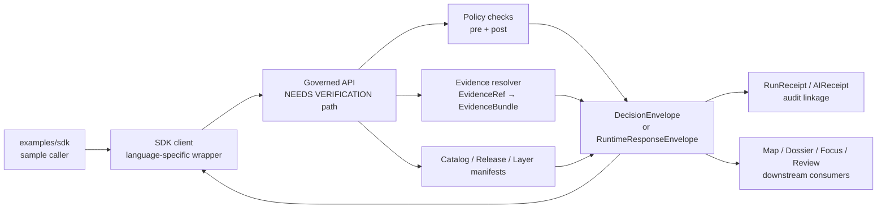

<!-- [KFM_META_BLOCK_V2]
doc_id: kfm://doc/NEEDS-VERIFICATION/examples-sdk-readme
title: KFM SDK Examples
type: standard
version: v1
status: draft
owners: OWNER_TBD_AFTER_REPO_INSPECTION
created: 2026-05-02
updated: 2026-05-02
policy_label: NEEDS VERIFICATION
related: [../../README.md NEEDS VERIFICATION, ../README.md NEEDS VERIFICATION, ../../contracts/README.md NEEDS VERIFICATION, ../../schemas/README.md NEEDS VERIFICATION, ../../policy/README.md NEEDS VERIFICATION, ../../apps/governed-api/README.md NEEDS VERIFICATION]
tags: [kfm, sdk, examples, governed-api, evidence, policy, receipts]
notes: [Repo implementation depth UNKNOWN; target path supplied by user; adjacent links and owners require mounted repository inspection.]
[/KFM_META_BLOCK_V2] -->

# KFM SDK Examples

Runnable and reviewable SDK examples for calling KFM through governed interfaces without bypassing evidence, policy, release, or audit boundaries.

> [!IMPORTANT]
> **Impact block**
>
> | Field | Value |
> |---|---|
> | Status | `experimental` |
> | Owners | `OWNER_TBD_AFTER_REPO_INSPECTION` |
> | Target path | `examples/sdk/README.md` |
> | Repo depth | **UNKNOWN** — no mounted repository, tests, workflows, schemas, dashboards, logs, or runtime artifacts were inspected when this draft was prepared |
> | Boundary posture | SDK examples must call governed API surfaces and released artifacts only |
> | Truth posture | CONFIRMED doctrine / PROPOSED example layout / UNKNOWN implementation |
>
> 
> 
> 
> 
>
> **Quick jumps:** [Scope](#scope) · [Repo fit](#repo-fit) · [Accepted inputs](#accepted-inputs) · [Exclusions](#exclusions) · [Directory tree](#directory-tree) · [Quickstart](#quickstart) · [Usage pattern](#usage-pattern) · [Scenario matrix](#scenario-matrix) · [Validation](#validation) · [Rollback](#rollback) · [FAQ](#faq)

> [!NOTE]
> This README is a bounded, repo-useful draft for `examples/sdk/`. It states KFM doctrine where supported by project sources. Current implementation depth remains **UNKNOWN** until the actual repository tree, adjacent docs, package manager, route contracts, tests, CI, runtime receipts, and release artifacts are inspected.

---

## Scope

`examples/sdk/` should hold small SDK examples that demonstrate how an external or semi-external caller interacts with KFM safely.

The examples are not the source of truth. They are teaching fixtures and integration references that show the expected shape of governed access:



This directory should help maintainers and integrators prove that a client can request KFM output while preserving:

- `EvidenceRef → EvidenceBundle` resolution before consequential claims;
- finite outcomes: `ANSWER`, `ABSTAIN`, `DENY`, and `ERROR`;
- policy-aware behavior for rights, sensitivity, source role, precision, freshness, and review state;
- release linkage and rollback traceability;
- audit references instead of unreviewed generated text;
- explicit failure states rather than silent success.

<p align="right"><a href="#kfm-sdk-examples">Back to top ↑</a></p>

---

## Repo fit

### Intended location

`examples/sdk/README.md`

### Directory role

`examples/sdk/` is the example surface for safe client integration. It should sit downstream of KFM contracts and governed API behavior, and upstream of any public integration guide that teaches users how to consume KFM.

It must not become a parallel API contract, parallel schema home, hidden source connector, or direct runtime backdoor.

### Upstream and downstream references

> [!NOTE]
> The paths below are intentionally written as path text rather than active links. Convert them to relative Markdown links only after the mounted repository confirms they exist from `examples/sdk/`.

| Relationship | Reference path | Status | Why it matters |
|---|---|---:|---|
| Repository root | `../../README.md` | **NEEDS VERIFICATION** | Root orientation and project-level trust rules may already define example conventions. |
| Examples index | `../README.md` | **NEEDS VERIFICATION** | This directory should align with nearby example conventions. |
| Governed API docs | `../../apps/governed-api/README.md` or repo-native equivalent | **CONFLICTED / NEEDS VERIFICATION** | SDK examples must not invent route authority. |
| API contracts | `../../contracts/README.md` | **NEEDS VERIFICATION** | SDK payloads should be contract-led. |
| Schema registry | `../../schemas/README.md` or `../../schemas/contracts/README.md` | **CONFLICTED / NEEDS VERIFICATION** | `EvidenceBundle`, envelopes, and fixtures need one canonical machine-contract home. |
| Policy docs | `../../policy/README.md` | **NEEDS VERIFICATION** | Deny/abstain behavior must match policy files and invalid fixtures. |
| Tests | `../../tests/README.md` | **NEEDS VERIFICATION** | Examples should be executable or fixture-validated through repo-native tests. |
| Runbooks | `../../docs/runbooks/` | **NEEDS VERIFICATION** | Local bring-up, restore drills, and correction drills belong in runbooks, not this README. |
| Downstream SDK package | `../../packages/` or repo-native equivalent | **UNKNOWN** | The actual SDK package location is not verified. |
| Downstream UI consumers | `../../apps/web/`, `../../apps/explorer-web/`, or repo-native equivalent | **UNKNOWN** | Map, Evidence Drawer, Focus, Review, and Export surfaces may consume the same envelopes. |

<p align="right"><a href="#kfm-sdk-examples">Back to top ↑</a></p>

---

## Accepted inputs

Add material here when it helps someone understand or test governed SDK access without weakening the trust membrane.

| Accepted input | Requirements |
|---|---|
| Minimal request examples | Must be scoped, policy-aware, and clearly tied to a governed API surface. |
| Minimal response examples | Must use finite outcomes and include evidence, policy, release, and audit references where relevant. |
| Language-specific SDK snippets | Must be small, reviewed, and aligned with repo-native package conventions. |
| Valid fixtures | Must resolve to released or synthetic public-safe evidence fixtures. |
| Invalid fixtures | Must prove `ABSTAIN`, `DENY`, and `ERROR` paths, not just successful calls. |
| Citation examples | Must show how citations are carried, validated, and failed closed. |
| Correction / rollback examples | Must show supersession, withdrawal, or rollback references without erasing lineage. |
| Local-only examples | Must avoid live credentials and must not expose local model runtimes or canonical stores directly. |

### Example quality bar

Every example should answer these review questions:

1. What governed contract does this example demonstrate?
2. What evidence or synthetic fixture supports the response?
3. What release scope is the caller allowed to see?
4. What policy decision is expected?
5. What should happen if evidence is missing, stale, restricted, or citation-invalid?
6. What receipt, audit reference, or rollback target proves the example is inspectable?

<p align="right"><a href="#kfm-sdk-examples">Back to top ↑</a></p>

---

## Exclusions

Do not place these in `examples/sdk/`.

| Excluded material | Why it is excluded | Better home |
|---|---|---|
| Canonical source data | Examples must not become source-of-truth storage. | `data/` or repo-native lifecycle directories after verification |
| `RAW`, `WORK`, or `QUARANTINE` access examples | Public and normal client paths must not bypass governance. | Internal runbooks or steward-only fixtures |
| Live source connector code | Source activation requires rights, cadence, sensitivity, policy, and validation gates. | `tools/`, `pipelines/`, or repo-native connector home |
| Direct model-runtime calls | SDK users must not call Ollama, OpenAI-compatible adapters, or model endpoints directly. | Governed API adapter tests |
| Direct database, graph, tile-builder, or canonical-store access | These are internal implementation surfaces, not normal public SDK paths. | Internal service docs |
| Secrets, tokens, cookies, private URLs, or personal access keys | SDK examples must be safe to publish and fork. | Secret manager or local `.env` ignored by Git |
| Sensitive exact-location examples | Archaeology, rare species, critical infrastructure, private land, living-person, DNA, and similar surfaces fail closed or generalize. | Steward-reviewed restricted fixtures |
| Claims that route names, DTOs, workflows, or package managers exist | Repo implementation is not verified here. | Add only after mounted repo inspection and tests |
| Vendor-compatibility examples as public contract | Provider compatibility may help internally, but KFM public contracts stay KFM-native. | Internal adapter docs |

> [!CAUTION]
> An SDK example that succeeds by bypassing the governed API is a failing example, even if it returns plausible data.

<p align="right"><a href="#kfm-sdk-examples">Back to top ↑</a></p>

---

## Directory tree

The tree below is **PROPOSED**. It is a review target, not a claim that these files exist.

```text
examples/sdk/
├── README.md
├── fixtures/
│   ├── valid/
│   │   ├── answer-released-evidence.example.json
│   │   └── answer-with-citations.example.json
│   └── invalid/
│       ├── abstain-missing-evidence.example.json
│       ├── deny-sensitive-geometry.example.json
│       └── error-runtime-failure.example.json
├── requests/
│   ├── governed-read.request.example.json
│   └── focus-synthesis.request.example.json
├── responses/
│   ├── runtime-envelope.answer.example.json
│   ├── runtime-envelope.abstain.example.json
│   ├── runtime-envelope.deny.example.json
│   └── runtime-envelope.error.example.json
├── python/
│   └── README.md
├── typescript/
│   └── README.md
└── review/
    ├── expected-policy-decisions.md
    └── verification-checklist.md
```

### Tree rules

- Keep examples tiny.
- Prefer synthetic public-safe fixtures until released evidence fixtures are verified.
- Keep valid and invalid examples side by side.
- Do not add language folders unless the repo confirms the SDK package or client conventions.
- Do not add package-manager commands until the mounted repo confirms the stack.

<p align="right"><a href="#kfm-sdk-examples">Back to top ↑</a></p>

---

## Quickstart

### Before adding an SDK example

Use this sequence during implementation review.

1. Confirm the real target path exists or create it through a small docs PR.
2. Confirm adjacent example conventions under `examples/`.
3. Confirm the governed API contract or mark the example `PROPOSED`.
4. Confirm the schema home for request and response fixtures.
5. Confirm the policy reason and obligation codes.
6. Add one positive fixture and one negative fixture.
7. Validate that the example never calls raw stores, canonical stores, unpublished artifacts, or direct model runtimes.
8. Add or update tests using the repo-native test runner.

> [!WARNING]
> Do not add runnable install commands here until the package manager, SDK package location, and test runner are confirmed from the mounted repository.

### Minimal review flow

```text
example request
  -> governed API contract
  -> policy precheck
  -> EvidenceRef → EvidenceBundle
  -> released artifact / catalog scope check
  -> optional bounded adapter call
  -> citation validation
  -> policy postcheck
  -> finite response envelope
  -> receipt / audit reference
```

<p align="right"><a href="#kfm-sdk-examples">Back to top ↑</a></p>

---

## Usage pattern

The exact route, DTO, and SDK method names are **NEEDS VERIFICATION**. The shape below is illustrative and should be replaced with canonical contract examples after repo inspection.

### Illustrative request shape

```json
{
  "request_status": "ILLUSTRATIVE_NEEDS_VERIFICATION",
  "surface": "sdk_example",
  "operation": "governed_read",
  "scope": {
    "place_ref": "kfm://place/NEEDS-VERIFICATION",
    "time": {
      "valid_time": "NEEDS_VERIFICATION",
      "as_of": "NEEDS_VERIFICATION"
    },
    "audience": "public"
  },
  "evidence_request": {
    "evidence_refs": [
      "kfm://evidence/NEEDS-VERIFICATION"
    ],
    "require_bundle_resolution": true
  },
  "policy_context": {
    "requested_precision": "public_safe",
    "allow_generalization": true,
    "deny_if_sensitive_or_rights_unclear": true
  }
}
```

### Illustrative response envelope

```json
{
  "response_status": "ILLUSTRATIVE_NEEDS_VERIFICATION",
  "outcome": "ANSWER",
  "reason": {
    "code": "PUBLIC_SAFE_EVIDENCE_AVAILABLE",
    "message": "Released evidence was available for the requested public-safe scope."
  },
  "evidence": {
    "bundle_refs": [
      "kfm://evidence-bundle/NEEDS-VERIFICATION"
    ],
    "citation_status": "validated"
  },
  "policy": {
    "decision": "ALLOW",
    "obligations": [
      "show_scope",
      "show_source_role",
      "show_release_state"
    ]
  },
  "release": {
    "release_ref": "kfm://release/NEEDS-VERIFICATION",
    "correction_state": "current"
  },
  "audit": {
    "run_receipt_ref": "kfm://receipt/run/NEEDS-VERIFICATION"
  }
}
```

### Required negative examples

SDK examples must demonstrate failure clearly.

```json
{
  "response_status": "ILLUSTRATIVE_NEEDS_VERIFICATION",
  "outcome": "ABSTAIN",
  "reason": {
    "code": "MISSING_EVIDENCE",
    "message": "No admissible released EvidenceBundle supported the requested claim."
  },
  "evidence": {
    "bundle_refs": [],
    "citation_status": "not_applicable"
  },
  "audit": {
    "run_receipt_ref": "kfm://receipt/run/NEEDS-VERIFICATION"
  }
}
```

<p align="right"><a href="#kfm-sdk-examples">Back to top ↑</a></p>

---

## Scenario matrix

| Scenario | Expected outcome | Fixture class | Must prove |
|---|---:|---|---|
| Released evidence supports the requested public-safe claim | `ANSWER` | valid | EvidenceBundle resolved; citations valid; policy allows; release state present. |
| Evidence is missing, stale, citation-invalid, or unsupported | `ABSTAIN` | invalid | The client receives a visible reason instead of fabricated confidence. |
| Rights, sensitivity, precision, source role, or review state forbids release | `DENY` | invalid | The response fails closed and carries reason / obligation codes. |
| Runtime, adapter, resolver, or contract validation fails | `ERROR` | invalid | Failure is auditable and does not become a partial claim. |
| Sensitive geometry is requested at unsafe precision | `DENY` or generalized `ANSWER` | invalid or constrained valid | Exact exposure is blocked unless policy and review explicitly allow it. |
| AI-assisted synthesis is requested | `ANSWER`, `ABSTAIN`, `DENY`, or `ERROR` | valid + invalid | Generated language remains subordinate to evidence, policy, citation validation, and receipts. |

<p align="right"><a href="#kfm-sdk-examples">Back to top ↑</a></p>

---

## SDK example rules

### Must do

- Use governed API surfaces.
- Echo scope in requests and responses.
- Carry evidence references and release references.
- Include policy decision and reason codes where relevant.
- Include audit or receipt references.
- Demonstrate negative states.
- Keep examples public-safe by default.
- Mark illustrative field names until canonical contracts are verified.
- Keep language-specific examples thin and contract-aligned.

### Must never do

- Call canonical stores directly.
- Read `RAW`, `WORK`, `QUARANTINE`, or unpublished candidate data.
- Treat tiles, vector indexes, graph projections, summaries, screenshots, scenes, or generated text as sovereign truth.
- Call model providers directly from SDK examples.
- Publish uncited claims.
- Hide denied, stale, generalized, or missing-evidence states.
- Include secrets or live credentials.
- Imply CI, route, package, or runtime maturity without proof.

<p align="right"><a href="#kfm-sdk-examples">Back to top ↑</a></p>

---

## Validation

Current validation commands are **UNKNOWN** because the package manager and test runner were not verified. The validation intent is still clear.

### Verification checklist

- [ ] Confirm `examples/sdk/` exists or create it in a small docs/examples PR.
- [ ] Confirm owners and CODEOWNERS coverage.
- [ ] Confirm adjacent `examples/` documentation style.
- [ ] Confirm whether `apps/governed-api`, `apps/governed_api`, or another API path is canonical.
- [ ] Confirm schema home for request / response fixtures.
- [ ] Confirm finite response envelope schema.
- [ ] Confirm policy reason and obligation code registry.
- [ ] Confirm SDK package location, if any.
- [ ] Confirm package manager and test runner.
- [ ] Add one valid `ANSWER` fixture.
- [ ] Add one `ABSTAIN` fixture for missing or citation-invalid evidence.
- [ ] Add one `DENY` fixture for sensitivity or rights failure.
- [ ] Add one `ERROR` fixture for runtime or contract failure.
- [ ] Add no-direct-model-client test.
- [ ] Add no-public-raw-path test.
- [ ] Add citation-negative test.
- [ ] Add correction / rollback example or link to a verified runbook.
- [ ] Confirm examples do not contain secrets, live tokens, or precise sensitive locations.

### Definition of done

This README is ready to move from `experimental` to `active` only when:

- the path exists in the mounted repository;
- owner and policy label are confirmed;
- at least one SDK example is validated against canonical contracts;
- positive and negative fixtures are tested;
- the examples call only governed interfaces;
- invalid fixtures fail for the expected reason;
- related docs are real relative links;
- rollback guidance points to a real target or runbook.

<p align="right"><a href="#kfm-sdk-examples">Back to top ↑</a></p>

---

## Rollback

Rollback is required if an SDK example weakens source integrity, creates a parallel contract, bypasses governed APIs, exposes sensitive data, includes secrets, normalizes direct model access, or publishes unsupported claims.

Rollback target: `ROLLBACK_TARGET_TBD_AFTER_REPO_INSPECTION`

Rollback actions:

1. Remove or revert the unsafe example.
2. Preserve a correction note if the example was previously referenced by documentation.
3. Invalidate any derived tutorial, generated output, or cached fixture that depended on the example.
4. Confirm tests fail for the unsafe pattern.
5. Confirm no downstream docs still recommend the removed access path.

<p align="right"><a href="#kfm-sdk-examples">Back to top ↑</a></p>

---

## Evidence boundary

| Source | Status | Supports | Does not prove |
|---|---|---|---|
| KFM Pipeline Living Implementation Manual v0.3 | CONFIRMED doctrine / PROPOSED implementation | Lifecycle law, object families, no-autopublish posture, finite envelopes, loop-safe receipts. | Current repo files, tests, or SDK behavior. |
| KFM MapLibre Operating Architecture | CONFIRMED doctrine / PROPOSED implementation | Governed UI, trust membrane, Evidence Drawer / Focus posture, public-client rule. | Actual UI routes, MapLibre package pins, or API implementation. |
| Ollama & Ubuntu Information | CONFIRMED doctrine / PROPOSED implementation | Model runtime remains behind governed API and adapter; direct model calls are an anti-pattern. | Actual local runtime, model profiles, or SDK adapter code. |
| KFM Components / Pass lineage | CORPUS-CONFIRMED doctrine | Inspectable claim, source descriptors, evidence bundles, receipts, proof and release vocabulary. | Mounted implementation maturity. |
| Current workspace scan | CONFIRMED session evidence | No mounted Git repository was visible in this session. | Anything about the real target repo beyond absence in this workspace. |

<p align="right"><a href="#kfm-sdk-examples">Back to top ↑</a></p>

---

## FAQ

### Is this the SDK package README?

No. This is the README for SDK examples. The package location remains **UNKNOWN** until the repo is mounted and inspected.

### Can examples use OpenAI-compatible or Ollama-compatible client paths?

Only as internal adapter examples after the governed API contract is proven. Do not make vendor compatibility the public SDK contract.

### Can examples query map tiles directly?

They may demonstrate public-safe released artifact references only when manifest-bound and policy-safe. They must not treat tile properties or rendered pixels as evidence authority.

### Can examples include AI-generated answers?

Only when wrapped in a governed response envelope with EvidenceBundle support, citation validation, policy checks, visible AI participation, and audit references.

### What should an example do when evidence is missing?

Return or demonstrate `ABSTAIN`. Do not fill gaps with plausible prose.

### What should an example do when rights or sensitivity are unclear?

Return or demonstrate `DENY`, or a reviewed generalized response if policy allows it. Exact sensitive outputs fail closed.

<details>
<summary><strong>Appendix: glossary for this directory</strong></summary>

| Term | Meaning here |
|---|---|
| Governed API | Executable trust boundary for policy, evidence resolution, release scope, and response envelopes. |
| EvidenceRef | Pointer to evidence that must be resolved before consequential claims are emitted. |
| EvidenceBundle | Resolved evidence support object that outranks generated language. |
| RuntimeResponseEnvelope | Outward response wrapper with finite outcome, reason, policy, evidence, release, and audit context. |
| SDK example | A tiny caller-side demonstration, not a canonical contract or source-of-truth implementation. |
| ABSTAIN | Safe outcome when evidence support is insufficient. |
| DENY | Safe outcome when policy, rights, sensitivity, role, precision, or review state forbids release. |
| ERROR | Auditable failure state for contract, runtime, resolver, adapter, or validation failure. |
| Receipt | Process memory for what happened; useful for audit but not a substitute for truth. |
| ReleaseManifest | Publication object that binds released artifacts to proof, policy, review, correction, and rollback context. |

</details>

<p align="right"><a href="#kfm-sdk-examples">Back to top ↑</a></p>
