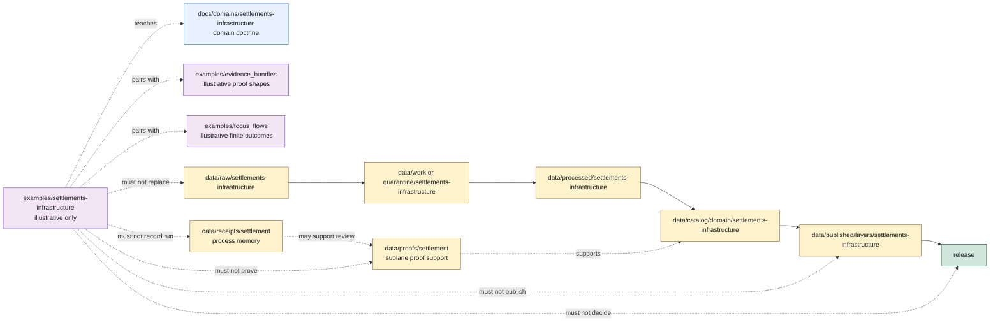

<!-- [KFM_META_BLOCK_V2]
doc_id: kfm://doc/examples/settlements-infrastructure/readme
title: Settlements / Infrastructure Examples README
type: standard
version: v0.1.0
status: draft
owners: TODO(owner): examples steward; TODO(owner): settlements-infrastructure steward; TODO(owner): settlement identity steward; TODO(owner): infrastructure sensitivity reviewer; TODO(owner): evidence steward; TODO(owner): policy steward; TODO(owner): release steward; TODO(owner): docs steward
created: NEEDS VERIFICATION - one-character placeholder existed before 2026-06-30 expansion
updated: 2026-06-30
policy_label: public-review
related: [../README.md, ../evidence_bundles/README.md, ../focus_flows/README.md, ../../docs/domains/settlements-infrastructure/README.md, ../../docs/domains/settlements-infrastructure/CANONICAL_PATHS.md, ../../docs/domains/settlements-infrastructure/DATA_LIFECYCLE.md, ../../data/raw/settlements-infrastructure/README.md, ../../data/work/settlements-infrastructure/README.md, ../../data/processed/settlements-infrastructure/README.md, ../../data/catalog/domain/settlements-infrastructure/README.md, ../../data/proofs/settlement/README.md, ../../data/receipts/settlement/README.md, ../../data/published/layers/settlements-infrastructure/README.md, ../../docs/doctrine/directory-rules.md]
tags: [kfm, examples, settlements-infrastructure, settlement, infrastructure, municipality, census-place, townsite, ghost-town, fort, mission, reservation-community, facility, service-area, operator, condition-observation, dependency, source-role, public-safe, geoprivacy, critical-infrastructure, finite-outcomes, non-authoritative, cite-or-abstain]
notes: ["This README replaces a one-character placeholder at `examples/settlements-infrastructure/README.md`.", "Settlements/Infrastructure examples are illustrative and review aids only; operational data belongs under `data/<phase>/settlements-infrastructure/` or an ADR-resolved compatibility lane.", "The `settlements-infrastructure` versus `settlement` segment conflict is preserved; examples do not resolve ADR-class path variance.", "Examples must not become settlement truth, municipal-status certification, infrastructure condition truth, operator/dependency disclosure, proof authority, receipt authority, catalog closure, policy authority, release authority, public artifact authority, or direct AI output authority by placement.", "README presence does not prove example files, schemas, validators, fixtures, CI checks, source descriptors, proof objects, receipts, governed API route behavior, public layer payloads, or release readiness."]
[/KFM_META_BLOCK_V2] -->

<a id="top"></a>

# Settlements / Infrastructure Examples

Illustrative examples for teaching how KFM reviewers should handle settlement identity, municipality/census-place context, historic place context, public-safe infrastructure context, source-role separation, sensitive joins, EvidenceBundle support, and finite public outcomes without creating operational authority.

<p>
  
  
  
  
  
</p>

**Status:** draft / example-lane guidance  
**Owners:** `TODO(owner): examples steward` · `TODO(owner): settlements-infrastructure steward` · `TODO(owner): settlement identity steward` · `TODO(owner): infrastructure sensitivity reviewer` · `TODO(owner): evidence steward` · `TODO(owner): policy steward` · `TODO(owner): release steward` · `TODO(owner): docs steward`  
**Path:** `examples/settlements-infrastructure/README.md`  
**Quick links:** [Scope](#scope) · [Path posture](#path-posture) · [Repo fit](#repo-fit) · [Accepted material](#accepted-material) · [Exclusions](#exclusions) · [Example contract](#example-contract) · [Guardrails](#guardrails) · [Lifecycle relationship](#lifecycle-relationship) · [Suggested layout](#suggested-layout) · [Validation checklist](#validation-checklist) · [Status notes](#status-notes) · [Evidence ledger](#evidence-ledger)

> [!IMPORTANT]
> Files under `examples/settlements-infrastructure/` are examples. They are not source captures, working candidates, processed objects, catalog records, triplets, EvidenceBundles, ProofPacks, receipts, policy decisions, release decisions, published layers, governed API responses, Focus Mode answers, Evidence Drawer payloads, fixtures, validators, or tests.

> [!CAUTION]
> Examples must not expose exact critical-infrastructure detail, operator-sensitive detail, dependency graphs, condition/vulnerability detail, private land or person-parcel joins, archaeology/burial/sacred-site clues, cultural/sovereignty-sensitive detail, restricted facility geometry, credentials, secrets, or reconstructive redaction clues. Use synthetic, generalized, redacted, aggregated, delayed, restricted, or denied examples by default.

---

## Scope

`examples/settlements-infrastructure/` is a documentation and review aid for the Settlements/Infrastructure domain.

Use this lane to demonstrate:

- how settlement/place examples should keep legal, census, historic, military, religious, reservation-community, and administrative identities distinct;
- how source roles should stay explicit for source families such as Census/TIGER, GNIS, municipal records, historical maps, local GIS, operator inventories, bridge/facility records, and cross-lane hazard/hydrology/roads/people-land context;
- how example object families may reference `Settlement`, `Municipality`, `CensusPlace`, `Townsite`, `GhostTown`, `Fort`, `Mission`, `ReservationCommunity`, `InfrastructureAsset`, `NetworkNode`, `NetworkSegment`, `Facility`, `ServiceArea`, `Operator`, `ConditionObservation`, and `Dependency` without becoming operational records;
- how public-safe examples should generalize, suppress, aggregate, redact, or deny sensitive infrastructure, cultural, archaeology, person/land, or exact-location detail;
- how `ANSWER`, `ABSTAIN`, `DENY`, and `ERROR` public outcomes may be illustrated with synthetic payloads;
- how examples should avoid direct public reads from RAW, WORK, QUARANTINE, PROCESSED, unpublished CATALOG/TRIPLET, proof stores, receipt stores, source registries, model runtimes, graph/vector stores, or canonical/internal stores.

This folder should make reviewers faster. It should not become a shortcut around lifecycle data lanes, source descriptors, schemas, contracts, validators, proof lanes, policy review, release gates, or governed API behavior.

---

## Path posture

The target file existed as a one-character placeholder:

```text
examples/settlements-infrastructure/README.md
```

Current placement evidence:

- `examples/README.md` describes `examples/` as walkthroughs and example assemblies.
- `examples/habitat/README.md` provides the current example-lane pattern: examples are illustrative and non-authoritative by placement.
- `docs/domains/settlements-infrastructure/README.md` defines the domain scope and object families.
- `docs/domains/settlements-infrastructure/CANONICAL_PATHS.md` identifies `settlements-infrastructure` as the working domain slug while preserving an ADR-class conflict with `settlement`.
- `docs/domains/settlements-infrastructure/DATA_LIFECYCLE.md` applies the KFM lifecycle invariant and marks the segment conflict as unresolved.
- `data/raw/settlements-infrastructure/`, `data/work/settlements-infrastructure/`, `data/processed/settlements-infrastructure/`, `data/catalog/domain/settlements-infrastructure/`, `data/published/layers/settlements-infrastructure/`, `data/proofs/settlement/`, and `data/receipts/settlement/` each define operational homes that this examples lane must not replace.

Therefore this README treats `examples/settlements-infrastructure/` as **CONFIRMED path presence / DRAFT example-lane guidance / NON-AUTHORITATIVE by placement**.

### Segment conflict

The long segment is used here because the requested path and current domain/lifecycle evidence use:

```text
settlements-infrastructure
```

The singular segment also appears in compatibility or sublane contexts such as `data/proofs/settlement/` and `data/receipts/settlement/`.

This README does **not** resolve that conflict. Until an ADR or migration note settles the topology, examples must avoid creating parallel authority or implying that one example path can decide schema, contract, policy, proof, receipt, release, or public route placement.

---

## Repo fit

| Responsibility | Correct home | Boundary |
|---|---|---|
| Settlements/Infrastructure example snippets, synthetic payloads, and walkthroughs | `examples/settlements-infrastructure/` | This lane. Illustrative only. |
| Example EvidenceBundle snippets used beside settlement/infrastructure examples | [`../evidence_bundles/`](../evidence_bundles/README.md) | Example lane only; not proof authority. |
| Focus Mode or governed-answer examples involving settlement/infrastructure context | [`../focus_flows/`](../focus_flows/README.md) | Example lane only; not runtime or API behavior. |
| Domain doctrine | [`../../docs/domains/settlements-infrastructure/`](../../docs/domains/settlements-infrastructure/README.md) | Human-facing doctrine. |
| Canonical-path / slug-conflict guidance | [`../../docs/domains/settlements-infrastructure/CANONICAL_PATHS.md`](../../docs/domains/settlements-infrastructure/CANONICAL_PATHS.md) | Path registry guidance; not examples. |
| Lifecycle doctrine | [`../../docs/domains/settlements-infrastructure/DATA_LIFECYCLE.md`](../../docs/domains/settlements-infrastructure/DATA_LIFECYCLE.md) | Lifecycle gates and failure-closed posture. |
| RAW source captures | [`../../data/raw/settlements-infrastructure/`](../../data/raw/settlements-infrastructure/README.md) | Immutable source-capture lane; no public path. |
| WORK candidates and intermediates | [`../../data/work/settlements-infrastructure/`](../../data/work/settlements-infrastructure/README.md) | Working normalization lane; no public path. |
| PROCESSED artifacts | [`../../data/processed/settlements-infrastructure/`](../../data/processed/settlements-infrastructure/README.md) | Validated upstream data; not public by default. |
| CATALOG-stage records | [`../../data/catalog/domain/settlements-infrastructure/`](../../data/catalog/domain/settlements-infrastructure/README.md) | Catalog carriers; release-gated. |
| Settlement-sublane proof support | [`../../data/proofs/settlement/`](../../data/proofs/settlement/README.md) | Proof support; examples do not prove claims. |
| Settlement-sublane receipt support | [`../../data/receipts/settlement/`](../../data/receipts/settlement/README.md) | Process memory; examples do not record runs. |
| Published public-safe layers | [`../../data/published/layers/settlements-infrastructure/`](../../data/published/layers/settlements-infrastructure/README.md) | Released delivery artifacts only. |
| Release decisions | `release/` | ReleaseManifest, PromotionDecision, correction, withdrawal, rollback, signatures. |
| Schemas, contracts, policy, validators, tests, fixtures, apps, packages, pipelines | `schemas/`, `contracts/`, `policy/`, `tools/validators/`, `tests/`, `fixtures/`, `apps/`, `packages/`, `pipelines/` | Separate responsibility roots. Examples must not define or enforce them. |

---

## Accepted material

Accepted files should be small, synthetic, reviewable, and visibly marked as examples.

| Accepted item | Use | Required markings |
|---|---|---|
| Settlement identity example | Teach how legal, census, historic, and name-variant identity should stay separated. | `example: true`, synthetic IDs, source-role labels, no legal-status claim. |
| Municipality / CensusPlace comparison | Show how municipal status and census geography differ. | Synthetic or generalized boundaries; cite-or-abstain posture. |
| Historic townsite, ghost town, fort, or mission walkthrough | Show temporal status, uncertainty, rights, and cultural/archaeology review posture. | Generalized geometry; no sensitive site clues. |
| ReservationCommunity context example | Teach sovereignty/cultural review boundaries. | No sensitive detail; review and policy placeholders visible. |
| Public-safe facility or service-area summary | Show aggregation/generalization and field allowlist behavior. | No operator-sensitive or dependency detail. |
| Critical-infrastructure negative example | Show `DENY`, `ABSTAIN`, `HOLD`, or restricted behavior. | No exact facility geometry, vulnerability, dependency graph, or operational detail. |
| Cross-lane relation example | Show Roads/Rail, Hydrology, Hazards, People/Land, or Archaeology references without absorbing ownership. | Owning-lane truth and EvidenceRef support remain explicit. |
| Evidence Drawer / Focus example note | Show how governed UI might explain support and limitations. | Must state public UI consumes governed projections, not this folder. |

Examples may use Markdown, JSON, YAML, or tiny tabular snippets. Keep examples deterministic and easy to diff.

---

## Exclusions

| Do not place here | Correct home or action |
|---|---|
| Real source payloads, agency exports, municipal records, operator files, GIS layers, scans, OCR inputs, or source-system mirrors | `data/raw/settlements-infrastructure/` or restricted storage as applicable |
| WORK transforms, identity matching outputs, geometry repair, dependency analysis, QA outputs, notebooks, or review drafts | `data/work/settlements-infrastructure/` |
| Quarantined rights/source-role/sensitivity/release-unclear material | `data/quarantine/settlements-infrastructure/` |
| Validated processed settlement or infrastructure artifacts | `data/processed/settlements-infrastructure/` or ADR-resolved lane |
| Catalog records, triplets, graph exports, or release candidates | `data/catalog/`, `data/triplets/`, or `release/candidates/` as appropriate |
| EvidenceBundles, ProofPacks, citation-validation records, validation reports, or proof indexes | `data/proofs/` |
| Run, transform, validation, redaction, aggregation, policy, AI, telemetry, release, correction, or rollback receipts | `data/receipts/` |
| Published PMTiles, GeoParquet, GeoJSON, COGs, reports, stories, API payloads, screenshots, or public downloads | `data/published/` after release gates |
| ReleaseManifest, PromotionDecision, RollbackCard, CorrectionNotice, WithdrawalNotice, signatures, or changelog entries | `release/` |
| Contracts, schemas, policy bundles, validators, tests, fixtures, apps, packages, pipelines, connectors, or workflows | Their canonical responsibility roots |
| Exact critical infrastructure, operator-sensitive, condition/vulnerability, dependency, cultural/sovereignty, archaeology, sacred-site, private parcel, living-person, credential, or secret detail | Quarantine, restrict, redact, generalize, synthesize, or deny |
| Generated summaries presented as evidence | Governed AI surfaces may cite evidence; generated text is not evidence |

---

## Example contract

Every example in this lane should answer eight questions without claiming operational maturity:

| Question | Expected answer |
|---|---|
| What scenario is illustrated? | A bounded synthetic settlement, place, facility, service-area, condition, dependency, or cross-lane relation scenario. |
| Which object family is involved? | One of the owned object families, or an explicitly synthetic teaching object. |
| What source role applies? | Observed, regulatory, modeled, aggregate, administrative, candidate, authority, context, or synthetic, without role collapse. |
| What evidence support is implied? | Synthetic or clearly marked sample EvidenceRef/EvidenceBundle-like refs, with cite-or-abstain posture. |
| What sensitivity posture applies? | Public-safe, restricted, hold, deny, generalized, redacted, or needs-review. |
| What release posture applies? | Example release reference or `not_released`; examples do not publish. |
| What public outcome should render? | Exactly one of `ANSWER`, `ABSTAIN`, `DENY`, or `ERROR` when public behavior is illustrated. |
| What must not happen? | No legal-status certification, ownership proof, infrastructure disclosure, emergency guidance, proof, receipt, catalog closure, release, or policy decision by example placement. |

Illustrative JSON should include a visible marker like this:

```json
{
  "example": true,
  "authority": "non_authoritative_example",
  "do_not_publish": true,
  "domain": "settlements-infrastructure",
  "example_id": "kfm://example/settlements-infrastructure/NEEDS-VERIFICATION",
  "object_family": "Settlement",
  "source_role": "synthetic",
  "expected_outcome": "ABSTAIN",
  "reason": "illustrative example only; evidence, policy, release, schema, route, and validator behavior NEEDS VERIFICATION"
}
```

> [!WARNING]
> Do not copy example IDs, example coordinates, example source roles, example evidence refs, example policy decisions, example release refs, example geometry, or example generated text into operational data. Examples teach shape and failure behavior; they do not certify facts.

---

## Guardrails

| Risk | Guardrail |
|---|---|
| Example becomes settlement truth | Examples can illustrate identity patterns but cannot certify settlement, municipal, census-place, townsite, ghost-town, fort, mission, or reservation-community status. |
| CensusPlace becomes Municipality | Census geography and legal municipal status remain separate unless evidence supports the relation. |
| Historic context exposes sensitive places | Fort, mission, townsite, ghost-town, cultural, sovereignty, archaeology, sacred-site, and burial-adjacent examples use generalized or denied detail. |
| Infrastructure context becomes operational disclosure | Facility, service-area, operator, condition, dependency, vulnerability, and network examples fail closed unless explicitly public-safe and released. |
| Cross-lane truth collapses | Roads/Rail owns routes; Hydrology owns water evidence; Hazards owns events/warnings; People/Land owns parcels/living-person joins; Archaeology owns sensitive site truth. |
| Example becomes proof | This directory is outside the lifecycle/proof/release spine and cannot prove, publish, or release claims. |
| AI becomes authority | AI-generated settlement or infrastructure summaries are downstream carriers; EvidenceBundle, policy, review, and release state outrank generated language. |
| Slug conflict gets hidden | `settlements-infrastructure` and `settlement` variance remains visible until ADR or migration resolves it. |

---

## Lifecycle relationship



The examples lane is outside the lifecycle spine. It can illustrate lifecycle behavior, but it cannot become RAW, WORK, QUARANTINE, PROCESSED, CATALOG, TRIPLET, PUBLISHED, proof, receipt, registry, or release authority.

---

## Suggested layout

This tree is **PROPOSED**. Confirm actual examples, schema paths, fixture strategy, validator expectations, and slug-governance decisions before adding files.

```text
examples/settlements-infrastructure/
├── README.md
├── settlement-identity/
│   ├── census-place-not-municipality.example.json
│   ├── legal-status-timeline.example.json
│   └── name-variant-abstain.example.json
├── historic-places/
│   ├── ghost-town-context.example.json
│   ├── fort-generalized-context.example.json
│   └── mission-sensitive-context-deny.example.json
├── infrastructure/
│   ├── public-safe-facility-summary.example.json
│   ├── service-area-generalized.example.json
│   └── dependency-detail-deny.example.json
├── cross-lane/
│   ├── hydrology-reference-not-water-truth.walkthrough.md
│   ├── roads-reference-not-route-truth.walkthrough.md
│   └── people-land-join-deny.example.json
└── walkthroughs/
    └── settlement-context-to-evidence-drawer.walkthrough.md
```

Recommended file naming:

| Pattern | Use |
|---|---|
| `*.example.json` | Non-authoritative JSON example. |
| `*.example.yaml` | Non-authoritative YAML example. |
| `*.walkthrough.md` | Narrative walkthrough, not operational proof. |
| `README.md` | Local explanation and boundaries. |

---

## Validation checklist

Before adding or changing examples here, verify:

- [ ] The file is marked as an example and non-authoritative.
- [ ] The file contains no exact critical infrastructure detail, operator-sensitive detail, dependency graph, condition/vulnerability detail, archaeology/burial/sacred-site clue, private parcel join, living-person data, credential, secret, or reconstruction clue.
- [ ] The example does not create schema, contract, policy, proof, receipt, release, source-registry, route, model-runtime, fixture, validator, or test authority.
- [ ] Any IDs are synthetic or clearly marked `NEEDS VERIFICATION`.
- [ ] Source role, temporal scope, evidence support, sensitivity posture, review state, release state, correction path, and rollback posture are visible where material.
- [ ] Any evidence-missing, stale, conflicting, citation-failed, role-unclear, rights-unclear, sensitivity-unclear, or release-missing example renders `ABSTAIN`, `DENY`, `HOLD`, or `ERROR`, not implied public truth.
- [ ] Any infrastructure, facility, service-area, operator, condition, dependency, or network example is public-safe, generalized, aggregated, redacted, or denied.
- [ ] Any cross-domain example preserves owning-lane truth for Roads/Rail, Hydrology, Hazards, People/Land, Archaeology, Agriculture, and other referenced lanes.
- [ ] Relative links from this README still resolve.
- [ ] Operational fixtures, if needed, are placed under the accepted test/fixture strategy rather than silently becoming examples.

---

## Status notes

| Item | Status | Notes |
|---|---:|---|
| Target path presence | CONFIRMED | `examples/settlements-infrastructure/README.md` existed as a one-character placeholder before this update. |
| Examples root | CONFIRMED README | `examples/README.md` describes walkthroughs and example assemblies. |
| Example-lane pattern | CONFIRMED README | `examples/habitat/README.md` defines a non-authoritative domain example-lane pattern. |
| Domain doctrine | CONFIRMED README | `docs/domains/settlements-infrastructure/README.md` defines object families, source families, cross-lane boundaries, and sensitivity posture. |
| Canonical path registry | CONFIRMED README | `CANONICAL_PATHS.md` marks `settlements-infrastructure` as the working slug and preserves `settlement` as conflicted. |
| Data lifecycle doctrine | CONFIRMED README | `DATA_LIFECYCLE.md` applies the KFM lifecycle invariant and preserves the segment conflict. |
| RAW lane | CONFIRMED README | `data/raw/settlements-infrastructure/README.md` defines RAW as no-public-path source capture. |
| WORK lane | CONFIRMED README | `data/work/settlements-infrastructure/README.md` defines WORK as no-public-path candidate/intermediate material. |
| PROCESSED lane | CONFIRMED README | `data/processed/settlements-infrastructure/README.md` defines processed artifacts as upstream of catalog, triplet, publication, and release. |
| Catalog lane | CONFIRMED README | `data/catalog/domain/settlements-infrastructure/README.md` defines CATALOG-stage records as release-gated and not truth/public by placement. |
| Settlement proof/receipt sublanes | CONFIRMED README | `data/proofs/settlement/` and `data/receipts/settlement/` exist as singular settlement sublane support while naming remains unresolved. |
| Published layer lane | CONFIRMED README | `data/published/layers/settlements-infrastructure/README.md` defines released public-safe layer artifacts and preserves slug variance. |
| Example payload inventory | UNKNOWN | This edit did not verify child files beyond this README. |
| Schemas, validators, fixtures, CI checks, policy enforcement, governed route behavior, release linkage | NEEDS VERIFICATION | No runtime or validation enforcement was proven by this README. |
| Public release readiness | DENY | Examples cannot publish, prove, release, or answer claims. |

---

## Evidence ledger

| Source | Status | Supports | Limits |
|---|---|---|---|
| Previous target file | CONFIRMED | Target existed as a one-character placeholder. | Did not define boundaries, accepted material, or exclusions. |
| [`../README.md`](../README.md) | CONFIRMED README | `examples/` is for walkthroughs and example assemblies. | It is short and status `PROPOSED`. |
| [`../evidence_bundles/README.md`](../evidence_bundles/README.md) | CONFIRMED README | Establishes non-authoritative example-lane behavior and proof separation. | Covers EvidenceBundle examples, not Settlements/Infrastructure examples directly. |
| [`../habitat/README.md`](../habitat/README.md) | CONFIRMED README | Current domain example-lane pattern: non-authoritative examples, accepted material, exclusions, guardrails, and status notes. | Habitat-specific content does not define Settlements/Infrastructure behavior. |
| [`../../docs/domains/settlements-infrastructure/README.md`](../../docs/domains/settlements-infrastructure/README.md) | CONFIRMED doctrine / PROPOSED implementation | Domain scope, object families, source families, cross-lane boundaries, and sensitivity defaults. | Implementation maturity remains NEEDS VERIFICATION. |
| [`../../docs/domains/settlements-infrastructure/CANONICAL_PATHS.md`](../../docs/domains/settlements-infrastructure/CANONICAL_PATHS.md) | CONFIRMED doctrine / conflict register | Working slug `settlements-infrastructure` and unresolved `settlement` variance. | Does not prove final ADR resolution or runtime adoption. |
| [`../../docs/domains/settlements-infrastructure/DATA_LIFECYCLE.md`](../../docs/domains/settlements-infrastructure/DATA_LIFECYCLE.md) | CONFIRMED doctrine / PROPOSED implementation | Lifecycle invariant, object-family ownership, cross-lane boundaries, failure-closed gates, and segment conflict. | Does not prove implementation paths, validators, schemas, routes, or CI. |
| [`../../data/raw/settlements-infrastructure/README.md`](../../data/raw/settlements-infrastructure/README.md) | CONFIRMED README | RAW source-capture lane and no-public-path posture. | Does not prove payloads, SourceDescriptors, connectors, or release readiness. |
| [`../../data/work/settlements-infrastructure/README.md`](../../data/work/settlements-infrastructure/README.md) | CONFIRMED README | WORK candidate/intermediate lane, no public path, and slug compatibility warning. | Does not prove validators, payloads, or policy enforcement. |
| [`../../data/processed/settlements-infrastructure/README.md`](../../data/processed/settlements-infrastructure/README.md) | CONFIRMED README | Processed artifacts remain upstream of catalog/triplet/publication/release and are not normal public sources. | Actual child inventory and runtime enforcement remain NEEDS VERIFICATION. |
| [`../../data/catalog/domain/settlements-infrastructure/README.md`](../../data/catalog/domain/settlements-infrastructure/README.md) | CONFIRMED README | Domain catalog records are CATALOG-stage carriers, release-gated, and not truth/public by placement. | Catalog inventory, schemas, validators, access controls, and route behavior remain NEEDS VERIFICATION. |
| [`../../data/proofs/settlement/README.md`](../../data/proofs/settlement/README.md) | CONFIRMED README | Settlement-sublane proof support exists inside broader Settlements/Infrastructure doctrine. | It does not resolve the broader proof-path segment conflict. |
| [`../../data/receipts/settlement/README.md`](../../data/receipts/settlement/README.md) | CONFIRMED README | Settlement-sublane process-memory receipts exist as support, not proof or release authority. | It does not prove emitted receipts or final naming governance. |
| [`../../data/published/layers/settlements-infrastructure/README.md`](../../data/published/layers/settlements-infrastructure/README.md) | CONFIRMED README | Published layer lane is for released public-safe artifacts and preserves slug variance. | Concrete released payloads and route behavior remain NEEDS VERIFICATION. |
| [`../../docs/doctrine/directory-rules.md`](../../docs/doctrine/directory-rules.md) | CONFIRMED doctrine | Lifecycle root shape, receipt/proof/published/release separation, and promotion as governed state transition. | Some implementation path claims remain PROPOSED / NEEDS VERIFICATION per doctrine notes. |

[Back to top](#top)
