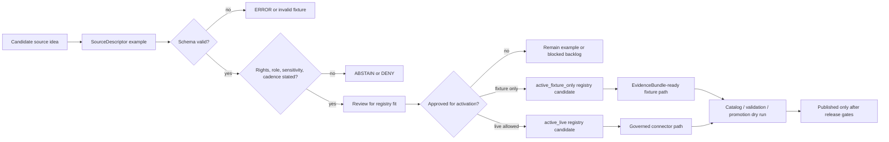

<!-- [KFM_META_BLOCK_V2]
doc_id: kfm://doc/NEEDS-VERIFICATION__examples_source_descriptors_readme
title: Source Descriptor Examples
type: standard
version: v1
status: draft
owners: OWNER_TBD_AFTER_REPO_INSPECTION
created: 2026-05-02
updated: 2026-05-02
policy_label: NEEDS_VERIFICATION__public_or_internal
related: [
  ../../README.md,
  ../README.md,
  ../../schemas/contracts/v1/source/source_descriptor.schema.json,
  ../../data/registry/sources/README.md,
  ../../policy/sources/README.md,
  ../../tools/validators/source_descriptor/README.md,
  ../../docs/source-map/README.md
]
tags: [kfm, examples, source-descriptor, source-registry, evidence, governance]
notes: [
  Target path is PROPOSED because no mounted KFM repository was available in the current session.
  Related links are reviewable path assumptions and require repo inspection before merge.
  This directory is example-facing; it does not activate live sources, publish artifacts, or prove validator/CI existence.
]
[/KFM_META_BLOCK_V2] -->

<a id="top"></a>

# Source Descriptor Examples

Reviewable example `SourceDescriptor` records for proving source admission, rights posture, sensitivity posture, and fail-closed validation before any live connector or public release.

> [!IMPORTANT]
> **Status:** `experimental`  
> **Owners:** `OWNER_TBD_AFTER_REPO_INSPECTION`  
> **Path:** `examples/source-descriptors/README.md`  
> **Truth posture:** CONFIRMED doctrine / PROPOSED path and examples / UNKNOWN repo implementation depth  
> **Quick jumps:** [Scope](#scope) · [Repo fit](#repo-fit) · [Accepted inputs](#accepted-inputs) · [Exclusions](#exclusions) · [Directory tree](#directory-tree) · [Usage](#usage) · [Diagram](#diagram) · [Review gates](#review-gates) · [Examples](#example-shapes) · [Verification](#verification-checklist) · [Rollback](#rollback) · [FAQ](#faq)


> [!NOTE]
> This README states KFM source-descriptor doctrine where supported by project sources. Current repository implementation depth remains **UNKNOWN** where repo files, schemas, tests, workflow YAML, dashboards, logs, or emitted artifacts have not been inspected.

## Scope

This directory is for small, deterministic, reviewable examples that show what a KFM `SourceDescriptor` should carry before a source can influence ingestion, evidence resolution, UI trust state, Focus Mode, catalog closure, or publication.

A `SourceDescriptor` example should make the source boundary inspectable:

- who publishes or stewards the source;
- what role the source is allowed to play;
- what rights, terms, and attribution constraints apply;
- what sensitivity posture applies by default;
- what access method is allowed;
- what spatial, temporal, CRS, support, cadence, caveat, and freshness claims are supported;
- which validation checks must pass before connector activation or public use.

This directory is **not** a live source registry. It is an examples surface that helps maintainers build and review future registry entries, fixtures, policies, schemas, and validators without guessing.

## Repo fit

| Layer | PROPOSED path or surface | Relationship to this directory | Verification status |
| --- | --- | --- | --- |
| Root orientation | [`../../README.md`](../../README.md) | Should explain how examples fit the repository. | NEEDS VERIFICATION |
| Examples index | [`../README.md`](../README.md) | Should link to this directory when `examples/` exists. | NEEDS VERIFICATION |
| Canonical schema | [`../../schemas/contracts/v1/source/source_descriptor.schema.json`](../../schemas/contracts/v1/source/source_descriptor.schema.json) | Should define the checked machine contract if this is the repo’s canonical schema home. | NEEDS VERIFICATION |
| Source registry | [`../../data/registry/sources/README.md`](../../data/registry/sources/README.md) | Registry entries may graduate from examples only after validation, review, and source-role approval. | NEEDS VERIFICATION |
| Policy | [`../../policy/sources/README.md`](../../policy/sources/README.md) | Should encode deny/abstain behavior for unknown rights, roles, sensitivity, or activation state. | NEEDS VERIFICATION |
| Validators | [`../../tools/validators/source_descriptor/README.md`](../../tools/validators/source_descriptor/README.md) | Should document validator entry points when implemented. | NEEDS VERIFICATION |
| Source map docs | [`../../docs/source-map/README.md`](../../docs/source-map/README.md) | Should explain source families, authority limits, and stewardship decisions. | NEEDS VERIFICATION |

> [!WARNING]
> If the mounted repository later shows competing homes such as `contracts/source/`, `contracts/objects/source-descriptor/`, and `schemas/contracts/v1/source/`, do not create parallel authority. Add or update an ADR that names the canonical schema home, then mark the other locations as generated, legacy, mirror-only, or deprecated.

## Accepted inputs

Use this directory for examples that are intentionally small and reviewable.

| Input | Belongs here when | Required posture |
| --- | --- | --- |
| Valid descriptor examples | The record is intentionally minimal but complete enough to pass schema and source-role checks. | `valid` example; no credentials; no provider mirror. |
| Invalid descriptor examples | The record demonstrates one named failure reason. | `invalid` example named by failure cause. |
| Lane-specific sketches | The example clarifies hydrology, soils, flora, fauna, roads, archaeology, or another lane’s source burden. | Label lane and sensitivity assumptions. |
| Review notes | The note explains why an example should remain illustrative, graduate to registry, or be blocked. | Include reviewer, reason, and verification gap when known. |
| Validator fixtures | The example is reused by tests without network calls or clock-dependent behavior. | Deterministic and fixture-bounded. |

## Exclusions

| Do not put here | Why | PROPOSED home instead |
| --- | --- | --- |
| Live source connectors | A connector can be built faster than a source can be governed. | `packages/`, `pipelines/`, or `tools/connectors/` after source review. |
| Raw provider data | Examples must not become a data mirror or bypass RAW intake controls. | `data/raw/` only after governed intake, or `data/quarantine/` when blocked. |
| Activated registry records | Activation is a governed registry decision, not an example-file side effect. | `data/registry/sources/` after review. |
| Ingest receipts | Receipts are process memory for actual runs, not example descriptors. | `data/receipts/` or repo-standard receipt home. |
| Proof packs or release manifests | Proof and release objects carry publication burden. | `data/proofs/`, `data/releases/`, or repo-standard release home. |
| Secrets, API keys, private endpoints | Source examples must be safe for public or semi-public review. | Secret manager, local config, or restricted operational docs. |
| Exact sensitive coordinates | Archaeological, ecological, cultural, critical-infrastructure, living-person, DNA, or land-title sensitivity can fail closed. | Restricted registry or generalized public-safe derivative after policy review. |
| UI or AI responses | Generated language and map popups are downstream surfaces. | Evidence Drawer, Focus Mode, runtime envelope, or UI fixture homes. |

## Directory tree

`PROPOSED` structure only; verify actual repo conventions before creating child folders.

```text
examples/source-descriptors/
├── README.md
├── valid/
│   ├── README.md
│   └── example_public_observation.source_descriptor.yaml
├── invalid/
│   ├── README.md
│   ├── missing-rights.source_descriptor.yaml
│   ├── unknown-source-role.source_descriptor.yaml
│   └── missing-sensitivity.source_descriptor.yaml
├── lanes/
│   ├── hydrology.source_descriptor.example.yaml
│   ├── soil.source_descriptor.example.yaml
│   ├── habitat-fauna.source_descriptor.example.yaml
│   └── documentary.source_descriptor.example.yaml
└── _review/
    └── descriptor-review-notes.example.md
```

## Usage

### 1. Confirm the active schema and validator

Before adding or editing examples, verify the repo’s canonical schema home and validator path.

```bash
# PROPOSED — verify these paths in the mounted repository before use.
test -f ../../schemas/contracts/v1/source/source_descriptor.schema.json
test -d ../../tools/validators/source_descriptor
```

### 2. Add one example per behavior

Prefer one clear example over a large bundle of loosely related cases.

```text
valid/example_public_observation.source_descriptor.yaml
invalid/missing-rights.source_descriptor.yaml
invalid/unknown-source-role.source_descriptor.yaml
```

### 3. Run the repo-native validator

Use the repository’s actual validator command once verified. Do not invent a CI claim from this README.

```bash
# PROPOSED — command shape only. Replace with the repo-native validator.
python ../../tools/validators/source_descriptor/validate_source_descriptor.py \
  --schema ../../schemas/contracts/v1/source/source_descriptor.schema.json \
  --examples .
```

### 4. Keep example status separate from activation status

Passing examples may demonstrate contract behavior. They do not activate a live source.

```text
example passes schema      ≠ source is active
example passes policy      ≠ source is publishable
registry record exists     ≠ public release is allowed
connector runs successfully ≠ evidence is admissible
```

## Diagram



## Review gates

Every descriptor example should make these gates easy to inspect.

| Gate | Required question | PASS | ABSTAIN / DENY / ERROR trigger |
| --- | --- | --- | --- |
| Identity | Is `source_id` stable and not just a display label? | Stable identifier is present. | Missing or ambiguous identifier. |
| Role | Is `source_role` explicit and bounded? | Role is declared and allowed for the intended claim type. | `unknown` role used as authority. |
| Rights | Are rights, terms, attribution, and redistribution posture stated? | Public or restricted posture is explicit. | Unknown rights used for public release. |
| Sensitivity | Is the default sensitivity class stated? | Public-safe or restricted behavior is explicit. | Unknown sensitivity silently allowed. |
| Access | Is access mode documented without secrets? | Public, restricted, fixture-only, or blocked access is clear. | Credentials, scraping assumptions, or undocumented access. |
| Temporal support | Are cadence, valid time, as-of time, or update signal stated where relevant? | Time basis is inspectable. | Freshness implied but not evidenced. |
| Spatial support | Are spatial scope, CRS/support limits, and precision caveats stated where relevant? | Spatial burden is visible. | Precision implied but not supported. |
| Activation | Is `activation_state` explicit? | `draft`, `review`, `active_fixture_only`, `active_live`, `deprecated`, or `blocked`. | Example quietly treated as activated. |
| Downstream use | Are allowed consumers and blocked consumers clear? | Pipelines, validators, EvidenceBundle builder, API, or UI roles are bounded. | UI, AI, or connector infers authority directly. |

## Operating rules

1. **Examples precede activation.** Source descriptors should be reviewable before live connector code runs.
2. **Unknown fails closed.** Unknown rights, source role, steward, terms, or sensitivity blocks activation and public use.
3. **Fixture is not proof.** A fixture can validate contract shape; it cannot prove source truth, ingestion success, or release readiness.
4. **Registry is not publication.** A registry record may describe a source; publication still requires evidence, catalog/provenance closure, policy checks, review, release state, and rollback.
5. **Derived surfaces stay downstream.** Map tiles, graph projections, indexes, summaries, screenshots, Focus Mode answers, and Evidence Drawer payloads must not outrank the EvidenceBundle.
6. **Sensitive examples stay generalized.** Exact sensitive locations, living-person identifiers, DNA material, cultural/archaeological site details, critical infrastructure, and rights-uncertain details do not belong in public examples.

## Example shapes

<details>
<summary><strong>Minimal valid descriptor sketch</strong> — illustrative only</summary>

```yaml
version: v1
kind: SourceDescriptor

identity:
  source_id: example_public_observation_source
  title: Example Public Observation Source
  publisher: Example Steward
  jurisdiction: NEEDS_VERIFICATION__jurisdiction

role_and_scope:
  source_role: observation
  primary_lane: NEEDS_VERIFICATION__lane
  publication_intent: fixture_only
  authority_limits:
    - does_not_prove_publication
    - does_not_replace_evidence_bundle

rights_and_sensitivity:
  rights_status: known_public
  terms_summary: NEEDS_VERIFICATION__summarize_terms_before_activation
  citation_text: NEEDS_VERIFICATION__citation_text
  sensitivity_class: public_safe

access:
  access_method: fixture_only
  source_uri: NEEDS_VERIFICATION__source_uri_or_catalog_ref
  authentication: none_for_fixture
  allowed_actions:
    - validate_example
    - compare_schema
    - policy_dry_run
  blocked_actions:
    - live_fetch
    - auto_publish
    - direct_ui_authority

coverage:
  spatial_scope: NEEDS_VERIFICATION__spatial_scope
  temporal_coverage: NEEDS_VERIFICATION__temporal_coverage
  cadence: NEEDS_VERIFICATION__cadence
  crs: NEEDS_VERIFICATION__crs_if_spatial
  support: NEEDS_VERIFICATION__support_or_resolution_if_relevant

governance:
  steward_owner: OWNER_TBD_AFTER_REPO_INSPECTION
  review_state: draft
  activation_state: active_fixture_only
  content_hash_policy: sha256_canonical_json_or_yaml_NEEDS_VERIFICATION
  spec_hash: NEEDS_VERIFICATION__sha256
  validation_checks:
    - source_identity_present
    - rights_status_present
    - sensitivity_class_present
    - source_role_allowed
    - activation_state_explicit
```

</details>

<details>
<summary><strong>Minimal invalid descriptor sketch</strong> — missing rights and sensitivity</summary>

```yaml
version: v1
kind: SourceDescriptor

identity:
  title: Example Source Without Stable Identity

role_and_scope:
  source_role: unknown

access:
  access_method: public_http

# invalid because:
# - source_id is missing
# - rights_status is missing
# - sensitivity_class is missing
# - source_role is unknown but would be unsafe for authority use
# - activation_state is missing
```

</details>

## Validation checklist

- [ ] Confirm `examples/source-descriptors/` exists or create it through a reviewed PR.
- [ ] Confirm owner and CODEOWNERS coverage.
- [ ] Confirm README policy label.
- [ ] Confirm canonical `SourceDescriptor` schema home.
- [ ] Confirm validator path and command.
- [ ] Confirm examples are deterministic and no-network.
- [ ] Confirm every valid example has source identity, role, rights, sensitivity, access method, cadence/update posture, and activation state.
- [ ] Confirm every invalid example is named by one failure reason.
- [ ] Confirm no examples contain secrets, credentials, restricted endpoints, private records, or exact sensitive locations.
- [ ] Confirm unknown rights, unknown role, unknown sensitivity, or unknown activation state cannot pass public-release checks.
- [ ] Confirm examples do not bypass `RAW -> WORK / QUARANTINE -> PROCESSED -> CATALOG / TRIPLET -> PUBLISHED`.
- [ ] Confirm examples do not imply that the repo has active live connectors, passing CI, emitted proof packs, or published releases.
- [ ] Confirm downstream docs link here only as examples, not as source authority.

## Definition of done

A source-descriptor example is ready for merge when it satisfies all of the following:

| Requirement | Done means |
| --- | --- |
| Reviewable identity | The example has a stable `source_id`, title, publisher/steward, and lane context. |
| Source-role discipline | The example states what the source may and may not support. |
| Rights posture | Rights and terms are explicit, or the example is marked denied/blocked. |
| Sensitivity posture | Public-safe, generalized-only, restricted, steward-review, or unknown is explicit. |
| Activation posture | The example cannot be mistaken for active live source approval. |
| Validation behavior | At least one positive and one negative case exist for the intended behavior. |
| No-network behavior | Tests or examples do not depend on live service availability. |
| Downstream boundary | UI, AI, catalog, and release surfaces are named as downstream consumers only. |
| Rollback safety | Removing or reverting the example does not mutate published artifacts. |

## Rollback

Rollback is required if an example weakens source integrity, hides rights or sensitivity uncertainty, creates schema-home conflict, implies live activation, leaks sensitive detail, or lets UI/AI infer authority from an example.

Rollback target: `ROLLBACK_TARGET_TBD_AFTER_REPO_INSPECTION`

Safe rollback actions:

1. Revert the example file or README change.
2. Remove any CI path filter that treats this example directory as release evidence.
3. Preserve review notes when they explain a blocked or withdrawn example.
4. Do not delete emitted receipts or proof objects from actual governed runs; this directory should not create those objects in the first place.
5. Re-run source-descriptor validation and policy dry-run after rollback.

## FAQ

### Does a valid example activate a source?

No. A valid example only demonstrates descriptor shape and expected validator behavior. Activation belongs in the source registry and must pass source-role, rights, sensitivity, policy, and review gates.

### Can these examples include real source names?

Yes, when the source name is public and the example does not imply activation, rights clearance, or live connector readiness. Use `NEEDS VERIFICATION` markers when current terms, cadence, endpoints, or publication rights have not been checked.

### Can examples include exact coordinates?

Only when public-safe and policy-reviewed. Sensitive ecological, archaeological, cultural, critical-infrastructure, living-person, land/title, DNA, or private-location material must be generalized, restricted, or omitted.

### What is the minimum useful first addition?

One valid descriptor example and one invalid descriptor example that fails closed on a missing or unknown field such as `rights_status`, `source_role`, `sensitivity_class`, or `activation_state`.

### Is this directory a substitute for `data/registry/sources/`?

No. This directory teaches and tests source-descriptor shape. The source registry governs actual source admission.

## Evidence boundary

| Source | Status | Supports | Limits |
| --- | --- | --- | --- |
| KFM Pipeline Living Implementation Manual v0.3 | CONFIRMED doctrine / PROPOSED implementation | Source descriptors before live connectors; unknown source role, rights, steward, terms, or sensitivity blocks activation/public use; no-network fixture-first posture. | Does not prove this path exists in the current repo. |
| KFM Components Pass 19 / Pass 24 | CORPUS-CONFIRMED doctrine | Source families should enter through descriptors with rights, role, cadence, access, sensitivity, caveats, and validation checks. | Does not prove current schema or validator implementation. |
| KFM Documentation Architecture Pass 13 | LINEAGE / doctrine | `SourceDescriptor` is a source-intake and catalog-entry concept needing schema, examples, validators, and policy linkage. | File homes remain NEEDS VERIFICATION. |
| Current-session workspace scan | CONFIRMED evidence boundary | No mounted KFM Git repository was available in the inspected workspace. | Cannot prove repo topology, owners, CI, schemas, validator commands, branch protections, or emitted artifacts. |

[Back to top](#top)
