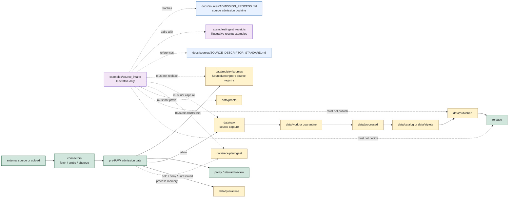

<!-- [KFM_META_BLOCK_V2]
doc_id: kfm://doc/examples/source-intake/readme
title: Source Intake Examples README
type: standard
version: v0.1.0
status: draft
owners: TODO(owner): examples steward; TODO(owner): source steward; TODO(owner): ingest steward; TODO(owner): connector steward; TODO(owner): registry steward; TODO(owner): evidence steward; TODO(owner): policy steward; TODO(owner): docs steward
created: NEEDS VERIFICATION - greenfield stub existed before 2026-06-30 expansion
updated: 2026-06-30
policy_label: public-review
related: [../README.md, ../ingest_receipts/README.md, ../evidence_bundles/README.md, ../../docs/sources/README.md, ../../docs/sources/ADMISSION_PROCESS.md, ../../docs/sources/SOURCE_DESCRIPTOR_STANDARD.md, ../../docs/sources/catalog/README.md, ../../connectors/README.md, ../../data/registry/sources/README.md, ../../data/raw/README.md, ../../data/receipts/ingest/README.md, ../../docs/doctrine/directory-rules.md]
tags: [kfm, examples, source-intake, source-admission, pre-raw, sourcedescriptor, sourceactivationdecision, sourceintakerecord, source-role, rights, sensitivity, connectors, raw, quarantine, ingest-receipts, non-authoritative, fail-closed, cite-or-abstain]
notes: ["This README replaces the greenfield stub at `examples/source_intake/README.md`.", "Source-intake examples are illustrative and review aids only; operational source admission doctrine lives under `docs/sources/`, SourceDescriptor/source-registry authority lives under `data/registry/sources/` or ADR-accepted registry homes, connector implementation belongs under `connectors/`, RAW captures belong under `data/raw/`, and ingest process memory belongs under `data/receipts/ingest/`.", "Examples must not become SourceDescriptors, SourceActivationDecisions, SourceIntakeRecords, emitted receipts, RAW payloads, quarantine records, proof records, catalog records, policy decisions, release decisions, public artifacts, governed API responses, or source truth by placement.", "README presence does not prove example payload inventory, source schemas, validators, fixtures, CI checks, source activation, connector runtime behavior, policy enforcement, evidence closure, release linkage, or governed route behavior."]
[/KFM_META_BLOCK_V2] -->

<a id="top"></a>

# Source Intake Examples

Illustrative pre-RAW source-intake examples for showing how KFM should evaluate external material before it enters the governed lifecycle.

<p>
  
  
  
  
  
</p>

**Status:** draft / example-lane guidance  
**Owners:** `TODO(owner): examples steward` · `TODO(owner): source steward` · `TODO(owner): ingest steward` · `TODO(owner): connector steward` · `TODO(owner): registry steward` · `TODO(owner): evidence steward` · `TODO(owner): policy steward` · `TODO(owner): docs steward`  
**Path:** `examples/source_intake/README.md`  
**Quick links:** [Scope](#scope) · [Path posture](#path-posture) · [Repo fit](#repo-fit) · [Accepted material](#accepted-material) · [Exclusions](#exclusions) · [Example contract](#example-contract) · [Source-intake guardrails](#source-intake-guardrails) · [Lifecycle relationship](#lifecycle-relationship) · [Suggested layout](#suggested-layout) · [Validation checklist](#validation-checklist) · [Status notes](#status-notes) · [Evidence ledger](#evidence-ledger)

> [!IMPORTANT]
> Files under `examples/source_intake/` are examples. They are not SourceDescriptors, SourceActivationDecisions, SourceIntakeRecords, connector outputs, RAW captures, quarantine records, emitted ingest receipts, EvidenceBundles, ProofPacks, catalog records, policy decisions, release decisions, public payloads, governed API responses, fixtures, validators, tests, or source truth.

> [!CAUTION]
> Source-intake examples must not include real credentials, API keys, private tokens, full source payloads, restricted coordinates, exact sensitive localities, living-person data, consent or revocation tokens, private review notes, proprietary terms, or unsupported source-as-authority claims. Use synthetic source IDs, fake source heads, fake hashes, redacted fields, and visible non-authority markers.

---

## Scope

`examples/source_intake/` is a documentation and review aid for source-admission examples at the pre-RAW edge.

Use this lane to demonstrate:

- how an external source candidate might be described before any material enters `data/raw/`;
- how a `SourceDescriptor`-like sketch should show identity, source role, rights, sensitivity, cadence, steward, citation posture, and release posture without becoming the actual descriptor;
- how a `SourceActivationDecision`-like sketch should represent `allow`, `restrict`, `quarantine`, `deny`, or `hold` without becoming a policy or activation record;
- how a source-intake scenario should preserve source-role boundaries for observed, regulatory, modeled, aggregate, administrative, candidate, synthetic, advisory, or interpretation sources;
- how missing rights, unknown source role, unresolved sensitivity, retired source state, digest mismatch, stale source head, unsupported citation, or missing steward review should fail closed;
- how a source-intake example differs from an ingest receipt example: source-intake examples teach the admission scenario; ingest-receipt examples teach process-memory receipt shape;
- how examples should avoid direct public reads from RAW, WORK, QUARANTINE, PROCESSED, unpublished CATALOG/TRIPLET, proof stores, receipt stores, source registries, model runtimes, graph/vector stores, or canonical/internal stores.

This folder should make reviewers faster. It should not become a shortcut around SourceDescriptor governance, source registry records, connector implementation, RAW capture, quarantine routing, ingest receipts, validators, policy gates, proof lanes, catalog closure, release decisions, or governed API behavior.

---

## Path posture

The target file existed as a greenfield stub:

```text
examples/source_intake/README.md
```

Current placement evidence:

- `examples/README.md` describes `examples/` as walkthroughs and example assemblies, including source intake.
- `examples/ingest_receipts/README.md` defines the sibling ingest-receipt example lane and keeps operational ingest receipts under `data/receipts/ingest/`.
- `docs/sources/ADMISSION_PROCESS.md` defines admission as the governed membrane between external sources and the lifecycle, before material touches RAW.
- `docs/sources/SOURCE_DESCRIPTOR_STANDARD.md` defines SourceDescriptor doctrine and warns that source role, rights, and sensitivity are fixed at admission.
- `docs/sources/README.md` defines `docs/sources/` as the human-facing source doctrine lane, not schemas, policy, source registers, or connector code.
- `data/registry/sources/README.md` defines the source registry as an admission and authority-control surface, not a bibliography.
- `connectors/README.md` defines connectors as source-specific fetch/probe/admission support that can hand off to RAW, QUARANTINE, and receipts, but do not publish or promote.
- `data/raw/README.md` defines RAW as no-public-path source capture, not proof, registry, receipt, policy, release, or public authority.
- `data/receipts/ingest/README.md` defines operational ingest/source-intake receipt process memory.

Therefore this README treats `examples/source_intake/` as **CONFIRMED path presence / DRAFT example-lane guidance / NON-AUTHORITATIVE by placement**.

---

## Repo fit

| Responsibility | Correct home | Boundary |
|---|---|---|
| Source-intake example snippets, synthetic source cards, and admission walkthroughs | `examples/source_intake/` | This lane. Illustrative only. |
| Ingest receipt example snippets | [`../ingest_receipts/`](../ingest_receipts/README.md) | Example lane only; not emitted receipts. |
| Example EvidenceBundle snippets used beside source examples | [`../evidence_bundles/`](../evidence_bundles/README.md) | Example lane only; not proof authority. |
| Source admission doctrine | [`../../docs/sources/ADMISSION_PROCESS.md`](../../docs/sources/ADMISSION_PROCESS.md) | Human-facing admission process standard. |
| SourceDescriptor doctrine | [`../../docs/sources/SOURCE_DESCRIPTOR_STANDARD.md`](../../docs/sources/SOURCE_DESCRIPTOR_STANDARD.md) | Prose standard; not instance or schema authority. |
| Source doctrine root | [`../../docs/sources/`](../../docs/sources/README.md) | Human-facing source doctrine. |
| Source-to-catalog documentation | [`../../docs/sources/catalog/`](../../docs/sources/catalog/README.md) | Documentation companion; not catalog artifact authority. |
| Connector implementation | [`../../connectors/`](../../connectors/README.md) | Source-specific fetch/probe/admission code and handoff helpers. |
| SourceDescriptor / source registry records | [`../../data/registry/sources/`](../../data/registry/sources/README.md) or ADR-accepted registry home | Admission and authority-control surface. |
| RAW source captures | [`../../data/raw/`](../../data/raw/README.md) | Immutable source-capture lifecycle root; no public path. |
| Operational ingest receipts | [`../../data/receipts/ingest/`](../../data/receipts/ingest/README.md) | Process-memory receipt lane. |
| Quarantine records | `data/quarantine/` | Failed/unresolved source material and reasoned holds. |
| Proof support | `data/proofs/` | EvidenceBundle, ProofPack, citation validation, integrity support. |
| Catalog records | `data/catalog/` | STAC/DCAT/PROV/domain catalog records. |
| Release decisions | `release/` | ReleaseManifest, PromotionDecision, rollback, correction, withdrawal, signatures. |
| Schemas, contracts, policy, validators, tests, fixtures | `schemas/`, `contracts/`, `policy/`, `tools/validators/`, `tests/`, `fixtures/` | Separate authority roots. Examples must not define or enforce them. |

---

## Accepted material

Accepted files should be small, synthetic, reviewable, and visibly marked as examples.

| Accepted item | Use | Required markings |
|---|---|---|
| Synthetic source candidate card | Teach identity, family, steward, source role, rights, sensitivity, cadence, and citation posture. | `example: true`, synthetic refs, no payload. |
| SourceDescriptor-like sketch | Show the fields a real descriptor would need without becoming an instance. | `authority: non_authoritative_example`, `do_not_activate: true`. |
| SourceActivationDecision-like sketch | Demonstrate `allow`, `restrict`, `quarantine`, `deny`, or `hold` outcomes. | Not a policy or activation record. |
| Source-head sketch | Teach ETag, Last-Modified, generation, cursor, or digest handling. | Fake source-head values and no credentials. |
| Admission-outcome examples | Show `ALLOW_TO_RAW`, `ALLOW_RESTRICTED`, `HOLD`, `DENY`, `QUARANTINE`, or `ERROR`. | Explicit reason code and no sensitive details. |
| Quarantine-routing walkthrough | Explain why source material should not enter RAW. | No raw payload or private review notes. |
| Manual-upload scenario | Teach uploader identity, rights declaration, steward review, and quarantine behavior. | Synthetic user/uploader identity only. |
| Source-to-catalog pathway note | Show what later catalog closure would need. | Must state catalog records do not live here. |

Examples may use Markdown, JSON, YAML, or tiny tables. Keep examples deterministic and easy to diff.

---

## Exclusions

| Do not place here | Correct home or action |
|---|---|
| Real source payloads, agency downloads, API responses, file drops, scans, rasters, vectors, or restricted source bytes | `data/raw/` or governed restricted storage as applicable |
| Operational SourceDescriptor records, source registry entries, source authority registers, source activation records, source supersession records, or source-type vocabularies | `data/registry/sources/`, `control_plane/`, or ADR-accepted registry roots |
| Connector code, fetch clients, endpoint logic, auth handling, parsers, or connector fixtures | `connectors/`, `tests/`, or `fixtures/` as applicable |
| Operational RunReceipts, ingest receipts, validation receipts, receipt manifests, checksums, signatures, or receipt indexes | `data/receipts/` |
| Work/scratch transforms, normalized candidates, or repair outputs | `data/work/` |
| Quarantine payloads or unresolved sensitive records | `data/quarantine/` |
| Processed/canonical domain records | `data/processed/` |
| EvidenceBundles, ProofPacks, citation-validation reports, integrity bundles, or proof indexes | `data/proofs/` |
| STAC, DCAT, PROV, or domain catalog records | `data/catalog/` |
| ReleaseManifest, PromotionDecision, CorrectionNotice, RollbackCard, withdrawal notice, signature, or release changelog | `release/` |
| Contracts, schemas, policy bundles, validators, tests, fixtures, apps, packages, pipelines, workflows | Their canonical responsibility roots |
| Credentials, tokens, secrets, full private source responses, exact restricted coordinates, private identifiers, consent tokens, revocation tokens, private review notes, culturally sensitive detail, or reconstructive clues | Restricted storage, quarantine, redaction, or deny |
| Public map/API/UI payloads, graph edges, vector-index content, emergency/life-safety guidance, or generated answer text | Governed public outputs only after evidence, policy, validation, review, release, correction, and rollback gates close |

---

## Example contract

Every source-intake example should answer eight questions without claiming operational maturity:

| Question | Expected answer |
|---|---|
| What source scenario is illustrated? | A bounded synthetic source discovery, manual upload, watcher event, HTTP source-head check, catalog feed, live feed, or authority crosswalk scenario. |
| What source identity is involved? | A synthetic source URI or SourceDescriptor-like ref; not a real activation decision. |
| What source role applies? | A clearly marked role that does not collapse into truth, proof, release, or public authority. |
| What rights and sensitivity posture applies? | Known, restricted, needs review, unknown, denied, or quarantined as an illustrative posture. |
| What source-head or integrity state is shown? | Synthetic source-head, digest, cursor, version, or generation fields. |
| What outcome occurred? | `ALLOW_TO_RAW`, `ALLOW_RESTRICTED`, `HOLD`, `DENY`, `QUARANTINE`, or `ERROR`. |
| What downstream handoff is allowed? | Connector, RAW, quarantine, ingest receipt, registry, proof, catalog, or release references only after their own gates close. |
| What must not happen? | No source truth, source activation, RAW capture, receipt emission, proof, catalog closure, release approval, public payload, or generated answer by example placement. |

Illustrative JSON should include a visible marker like this:

```json
{
  "example": true,
  "authority": "non_authoritative_example",
  "do_not_publish": true,
  "do_not_activate": true,
  "example_id": "kfm://example/source-intake/NEEDS-VERIFICATION",
  "intake_family": "source_admission_example",
  "source_role": "synthetic",
  "expected_outcome": "HOLD",
  "reason_codes": ["SOURCE_DESCRIPTOR_UNRESOLVED_EXAMPLE"],
  "forbidden_use": [
    "source_descriptor",
    "source_activation_decision",
    "source_intake_record",
    "raw_payload",
    "emitted_receipt",
    "proof_record",
    "catalog_record",
    "release_decision",
    "public_payload"
  ]
}
```

> [!WARNING]
> Do not copy example IDs, example source refs, example source-head values, example policy decisions, example evidence refs, example hashes, example release refs, or example signatures into operational source-intake data. Examples teach shape and failure behavior; they do not admit sources.

---

## Source-intake guardrails

| Risk | Guardrail |
|---|---|
| Example becomes SourceDescriptor | Keep examples visibly synthetic; operational descriptors belong in source registry/schema/contract/policy-governed roots. |
| Example becomes activation decision | A sketch can teach `allow`, `restrict`, `quarantine`, `deny`, or `hold`; it does not authorize a connector or source. |
| Example becomes RAW payload | Store no real source bytes, full API responses, restricted payloads, credentials, or private identifiers here. |
| Intake becomes promotion | Admission decides whether material may enter RAW. It does not clear processed, catalog, proof, release, or public gates. |
| Source role collapses | Source role must remain explicit and must not be upgraded by a README, example, generated summary, or downstream convenience. |
| Rights or sensitivity are deferred | Unknown rights, unresolved source role, unresolved sensitivity, hash mismatch, or missing activation state routes to `HOLD`, `DENY`, `QUARANTINE`, or `ERROR`. |
| Watcher becomes publisher | Watchers/connectors may observe, propose, hand off, or emit receipts. They must not publish, promote, or answer public claims. |
| Receipt becomes proof | Ingest receipts are process memory; proof support remains in `data/proofs/`. |
| Catalog becomes publication | Catalog entries are discovery/provenance carriers; release authority remains in `release/`. |
| Public reads internal lane | Public UI/API/AI examples must show governed APIs and released/evidence-supported context, not examples as truth. |

---

## Lifecycle relationship



The examples lane is outside the pre-RAW admission membrane and outside the lifecycle spine. It can illustrate source-intake behavior, but it cannot admit, capture, prove, catalog, release, publish, or answer claims.

---

## Suggested layout

This tree is **PROPOSED**. Confirm actual examples, schema paths, fixture strategy, validator expectations, and source-governance decisions before adding files.

```text
examples/source_intake/
├── README.md
├── source-cards/
│   ├── minimal-source-candidate.example.json
│   ├── rights-unknown-hold.example.json
│   └── source-role-unknown-quarantine.example.json
├── outcomes/
│   ├── allow-to-raw.example.json
│   ├── allow-restricted.example.json
│   ├── hold-for-review.example.json
│   ├── deny.example.json
│   ├── quarantine.example.json
│   └── error.example.json
├── source-heads/
│   ├── http-etag-last-modified.example.json
│   ├── stac-item-head.example.json
│   └── object-store-generation.example.json
├── walkthroughs/
│   ├── manual-upload-to-hold.walkthrough.md
│   ├── watcher-event-to-pr-not-publish.walkthrough.md
│   └── descriptor-missing-to-deny.walkthrough.md
└── handoffs/
    ├── source-intake-to-ingest-receipt.example.json
    └── source-intake-to-quarantine.example.json
```

Recommended file naming:

| Pattern | Use |
|---|---|
| `*.example.json` | Non-authoritative JSON example. |
| `*.example.yaml` | Non-authoritative YAML example. |
| `*.walkthrough.md` | Narrative walkthrough, not operational source admission. |
| `README.md` | Local explanation and boundaries. |

---

## Validation checklist

Before adding or changing examples here, verify:

- [ ] The file is marked as an example and non-authoritative.
- [ ] The file contains no real credentials, tokens, secrets, full API responses, restricted source payloads, exact sensitive coordinates, protected localities, private identifiers, consent tokens, revocation tokens, private review notes, or reconstruction clues.
- [ ] The example does not create SourceDescriptor, SourceActivationDecision, SourceIntakeRecord, source registry, schema, contract, policy, proof, catalog, release, route, receipt, fixture, validator, or test authority.
- [ ] Any IDs, hashes, signatures, source refs, and source-head values are synthetic or clearly marked `NEEDS VERIFICATION`.
- [ ] Source role is explicit and not upgraded by the example.
- [ ] Rights, citation, cadence, timestamps, sensitivity, review state, policy refs, receipt refs, evidence refs, correction refs, and rollback refs are visible where material.
- [ ] Any source-role-unclear, rights-unclear, citation-unsupported, stale, conflicting, sensitive, retired, hash-mismatched, or activation-missing example returns `HOLD`, `DENY`, `ABSTAIN`, `QUARANTINE`, or `ERROR`, not implied public truth.
- [ ] Any public-summary example is redacted and cannot be used as source truth or public claim text.
- [ ] Relative links from this README still resolve.
- [ ] Operational fixtures, if needed, are placed under the accepted test/fixture strategy rather than silently becoming examples.

---

## Status notes

| Item | Status | Notes |
|---|---:|---|
| Target path presence | CONFIRMED | `examples/source_intake/README.md` existed as a greenfield stub before this update. |
| Examples root | CONFIRMED README | `examples/README.md` describes walkthroughs and example assemblies, including source intake. |
| Ingest receipt example lane | CONFIRMED README | `examples/ingest_receipts/README.md` defines non-authoritative ingest receipt examples and points operational receipts to `data/receipts/ingest/`. |
| Source admission process | CONFIRMED README | `docs/sources/ADMISSION_PROCESS.md` defines the pre-RAW source admission membrane, SourceDescriptor, SourceActivationDecision, SourceIntakeRecord, and fail-closed admission gates. |
| SourceDescriptor standard | CONFIRMED README | `docs/sources/SOURCE_DESCRIPTOR_STANDARD.md` defines SourceDescriptor doctrine and admission-time role/rights/sensitivity posture. |
| Source doctrine root | CONFIRMED README | `docs/sources/README.md` separates source doctrine from schemas, policy, source registers, connectors, RAW capture, and validators. |
| Source catalog docs | CONFIRMED README | `docs/sources/catalog/README.md` is a docs-side companion lane, not source identity or catalog authority. |
| Source registry lane | CONFIRMED README | `data/registry/sources/README.md` defines the registry as source admission and authority-control surface. |
| Connector root | CONFIRMED README | `connectors/README.md` defines connectors as source admission implementation support with RAW/QUARANTINE/receipt handoffs only. |
| RAW root | CONFIRMED README | `data/raw/README.md` defines RAW as no-public-path source capture and not proof/registry/receipt/policy/release/public authority. |
| Operational ingest receipt lane | CONFIRMED README | `data/receipts/ingest/README.md` defines source-intake receipt process memory and notes emitted receipt maturity remains unproven. |
| Example payload inventory | UNKNOWN | This edit did not verify child files beyond this README. |
| Source schemas, validators, fixtures, CI checks, source activation, connector runtime behavior, policy enforcement, evidence closure, release linkage, governed route behavior | NEEDS VERIFICATION | No runtime or validation enforcement was proven by this README. |
| Public release readiness | DENY | Examples cannot admit, capture, publish, prove, release, or answer claims. |

---

## Evidence ledger

| Source | Status | Supports | Limits |
|---|---|---|---|
| Previous target file | CONFIRMED | Target existed as a greenfield stub. | Did not define boundaries, accepted material, or exclusions. |
| [`../README.md`](../README.md) | CONFIRMED README | `examples/` is for walkthroughs and example assemblies, including source intake. | It is short and status `PROPOSED`. |
| [`../ingest_receipts/README.md`](../ingest_receipts/README.md) | CONFIRMED README | Sibling example lane for ingest receipt shapes; keeps operational receipts under `data/receipts/ingest/`. | Covers receipt examples, not source-intake examples directly. |
| [`../evidence_bundles/README.md`](../evidence_bundles/README.md) | CONFIRMED README | Establishes non-authoritative example-lane behavior and proof separation. | Covers EvidenceBundle examples, not source-intake examples directly. |
| [`../../docs/sources/README.md`](../../docs/sources/README.md) | CONFIRMED README | Source doctrine explains; machine schemas, policy, source registers, connector code, RAW capture, and validators live elsewhere. | Some implementation maturity remains PROPOSED / NEEDS VERIFICATION. |
| [`../../docs/sources/ADMISSION_PROCESS.md`](../../docs/sources/ADMISSION_PROCESS.md) | CONFIRMED standard draft | Source admission is the pre-RAW membrane; describes SourceDescriptor, SourceActivationDecision, SourceIntakeRecord, RAW/quarantine routing, fail-closed gates, and watcher non-publisher posture. | Specific schema homes and implementation routing remain PROPOSED / NEEDS VERIFICATION. |
| [`../../docs/sources/SOURCE_DESCRIPTOR_STANDARD.md`](../../docs/sources/SOURCE_DESCRIPTOR_STANDARD.md) | CONFIRMED standard draft | SourceDescriptor doctrine: source role, rights, sensitivity, cadence, access, steward, citation guidance, and fail-closed posture. | Field-level machine shape and validator behavior remain NEEDS VERIFICATION. |
| [`../../docs/sources/catalog/README.md`](../../docs/sources/catalog/README.md) | CONFIRMED README | Source-to-catalog docs are explanatory and do not decide source admissibility, rights, or catalog authority. | The subfolder is marked PROPOSED in its own README. |
| [`../../connectors/README.md`](../../connectors/README.md) | CONFIRMED README | Connectors support fetch/probe/admission and handoffs to RAW, QUARANTINE, and receipts; they do not publish or promote. | Does not prove connector implementations, schedules, tests, or runtime behavior. |
| [`../../data/registry/sources/README.md`](../../data/registry/sources/README.md) | CONFIRMED README | Source registry is admission and authority-control surface, not a bibliography; SourceDescriptor anchors source treatment. | Schema filename, validators, fixtures, and registry inventory remain PROPOSED / NEEDS VERIFICATION. |
| [`../../data/raw/README.md`](../../data/raw/README.md) | CONFIRMED README | RAW holds source captures and source-admission sidecars; no public path; not proof, registry, receipt, policy, release, or public authority. | Does not prove payloads or source activation. |
| [`../../data/receipts/ingest/README.md`](../../data/receipts/ingest/README.md) | CONFIRMED README | Operational ingest receipt process-memory lane and boundary from source truth, RAW payloads, SourceDescriptors, proof, catalog, release, and public surfaces. | Does not prove emitted receipts, schemas, validators, or CI. |
| [`../../docs/doctrine/directory-rules.md`](../../docs/doctrine/directory-rules.md) | CONFIRMED doctrine | Lifecycle root shape, receipt/proof/published/release separation, and promotion as governed state transition. | Some implementation path claims remain PROPOSED / NEEDS VERIFICATION per doctrine notes. |

[Back to top](#top)
