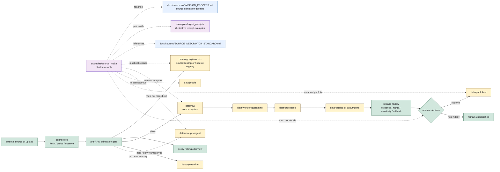

<!-- [KFM_META_BLOCK_V2]
doc_id: kfm://doc/examples/source-intake/readme
title: Source Intake Examples README
type: standard
version: v0.3.0
status: draft
owners: NEEDS VERIFICATION - examples, source, ingest, connector, registry, evidence, policy, and docs stewardship assignments; default GitHub review route is @bartytime4life
created: NEEDS VERIFICATION - greenfield stub existed before 2026-06-30 expansion
updated: 2026-09-06
policy_label: public-review
related: [../README.md, usgs_nwis_walkthrough.md, ../ingest_receipts/README.md, ../evidence_bundles/README.md, ../../docs/sources/README.md, ../../docs/sources/ADMISSION_PROCESS.md, ../../docs/sources/SOURCE_DESCRIPTOR_STANDARD.md, ../../docs/sources/catalog/README.md, ../../connectors/README.md, ../../data/registry/sources/README.md, ../../data/raw/README.md, ../../data/receipts/ingest/README.md, ../../contracts/runtime/decision_envelope.md, ../../docs/doctrine/truth-posture.md, ../../docs/doctrine/directory-rules.md, ../../docs/adr/ADR-0029-adopt-directory-governance-standard-v2.md, ../../.github/CODEOWNERS]
tags: [kfm, examples, source-intake, source-admission, pre-raw, sourcedescriptor, sourceactivationdecision, sourceintakerecord, source-role, rights, sensitivity, connectors, raw, quarantine, ingest-receipts, static-walkthrough, non-authoritative, fail-closed, cite-or-abstain]
notes: ["The current v0.2.0 README had already replaced the historical greenfield stub at `examples/source_intake/README.md`; v0.3.0 refreshes that substantive baseline in place against current `main` evidence.", "At current `main`, the lane contains exactly this README and `usgs_nwis_walkthrough.md`; no runnable package, fixture mirror, operational admission, or public release is established.", "Source-intake examples are illustrative and review aids only; operational source admission doctrine lives under `docs/sources/`, SourceDescriptor/source-registry authority lives under `data/registry/sources/` or ADR-accepted registry homes, connector implementation belongs under `connectors/`, RAW captures belong under `data/raw/`, and ingest process memory belongs under `data/receipts/ingest/`.", "Examples must not become SourceDescriptors, SourceActivationDecisions, SourceIntakeRecords, emitted receipts, RAW payloads, quarantine records, proof records, catalog records, policy decisions, release decisions, public artifacts, governed API responses, or source truth by placement.", "README presence does not prove example payload inventory, source schemas, validators, fixtures, CI checks, source activation, connector runtime behavior, policy enforcement, evidence closure, release linkage, or governed route behavior.", "Drive proposal material and Notion coordination remain lineage/input only; current GitHub files and accepted repository decisions remain implementation and governance authority."]
[/KFM_META_BLOCK_V2] -->

<a id="top"></a>

# Source Intake Examples

Illustrative pre-RAW source-intake examples for showing how KFM should evaluate external material before it enters the governed lifecycle.

[](#status-notes)
[](#current-maturity)
[](#path-posture)
[](../../docs/doctrine/truth-posture.md)
[](#source-intake-guardrails)

**Status:** draft / static walkthrough lane / non-authoritative  
**Owners:** `NEEDS VERIFICATION` — examples, source, ingest, connector, registry, evidence, policy, and docs stewardship assignments; GitHub currently routes review to `@bartytime4life` by default  
**Path:** `examples/source_intake/README.md`  
**Quick links:** [Scope](#scope) · [Path posture](#path-posture) · [Repo fit](#repo-fit) · [Accepted material](#accepted-material) · [Exclusions](#exclusions) · [Example contract](#example-contract) · [Authoring workflow](#authoring-workflow) · [Source-intake guardrails](#source-intake-guardrails) · [Lifecycle relationship](#lifecycle-relationship) · [Suggested layout](#suggested-layout) · [Current maturity](#current-maturity) · [Validation checklist](#validation-checklist) · [Review and maintenance](#review-and-maintenance) · [Status notes](#status-notes) · [Change history](#change-history) · [Evidence ledger](#evidence-ledger)

> [!IMPORTANT]
> Files under `examples/source_intake/` are examples. They are not SourceDescriptors, SourceActivationDecisions, SourceIntakeRecords, connector outputs, RAW captures, quarantine records, emitted ingest receipts, EvidenceBundles, ProofPacks, catalog records, policy decisions, release decisions, public payloads, governed API responses, fixtures, validators, tests, or source truth.

> [!CAUTION]
> Source-intake examples must not include real credentials, API keys, private tokens, full source payloads, restricted coordinates, exact sensitive localities, living-person data, consent or revocation tokens, private review notes, proprietary terms, or unsupported source-as-authority claims. Use synthetic source IDs, fake source heads, fake hashes, redacted fields, and visible non-authority markers.

---

## Scope

`examples/source_intake/` is a documentation and review aid for source-admission examples at the pre-RAW edge.

Use this lane to demonstrate:

- how an external source candidate might be described before any material enters `data/raw/`;
- how a `SourceDescriptor`-like sketch should show identity, source role, rights, sensitivity, cadence, steward, citation posture, and release posture without becoming the actual descriptor;
- how a `SourceActivationDecision`-like sketch should represent `allow`, `restrict`, `quarantine`, `deny`, or `hold` without becoming a policy or activation record;
- how a source-intake scenario should preserve source-role boundaries for observed, regulatory, modeled, aggregate, administrative, candidate, synthetic, advisory, or interpretation sources;
- how missing rights, unknown source role, unresolved sensitivity, retired source state, digest mismatch, stale source head, unsupported citation, or missing steward review should fail closed;
- how a source-intake example differs from an ingest receipt example: source-intake examples teach the admission scenario; ingest-receipt examples teach process-memory receipt shape;
- how examples should avoid direct public reads from RAW, WORK, QUARANTINE, PROCESSED, unpublished CATALOG/TRIPLET, proof stores, receipt stores, source registries, model runtimes, graph/vector stores, or canonical/internal stores.

This folder should make reviewers faster. It should not become a shortcut around SourceDescriptor governance, source registry records, connector implementation, RAW capture, quarantine routing, ingest receipts, validators, policy gates, proof lanes, catalog closure, release decisions, or governed API behavior.

---

## Path posture

The target is a substantive v0.2.0 README, not a placeholder. Repository evidence pinned for this revision:

| Evidence | Observation | Status |
|---|---|---|
| Current default branch `main@61368f63707df32d3f796a29028e66e715d083c9` | Current branch tip read immediately before this revision; merge of PR #4342 at `2026-09-06T18:32:44Z`. | `CONFIRMED` |
| Target at current `main` | v0.2.0, 442 lines, blob `45ba3a401a05981e576250bd342c6caa7a4399e5`. | `CONFIRMED` |
| Historical lineage | Target metadata records that v0.1.0 replaced a greenfield stub. | `CONFIRMED metadata claim`; original creation date remains `NEEDS VERIFICATION` |
| Direct-child inventory | The current `examples/source_intake/` directory contains only [`README.md`](README.md) and [`usgs_nwis_walkthrough.md`](usgs_nwis_walkthrough.md); the child blob is `3681e2d2937300066a9cffb0eac0aa3a445fc713`. | `CONFIRMED bounded directory read` |
| Open pull-request overlap | No open pull request matching `source_intake` surfaced in the repository-scoped search before authoring. | `CONFIRMED bounded search`; not an exhaustive branch audit |

ADR-0029 is the accepted repository decision that makes `docs/doctrine/directory-rules.md` the single writable human-readable Directory Rules authority. Its preserved internal document-control block still says `PROPOSED_FOR_ADOPTION`; this README records that metadata conflict rather than silently collapsing it. The adopted responsibility model places worked examples under the `examples/` root. `source_intake` is a lane within that root, not a new authority root, so the file remains in place and this change creates no parallel schema, contract, policy, registry, connector, receipt, proof, release, or publication home.

Current placement evidence also establishes that:

- [`../README.md`](../README.md) defines the root maturity vocabulary and non-authority boundary (current blob `749dfd2f387589f8ef1edd639a13f066eb2d2958`);
- [`../../docs/sources/ADMISSION_PROCESS.md`](../../docs/sources/ADMISSION_PROCESS.md) defines the pre-RAW admission membrane;
- [`../../docs/adr/ADR-0029-adopt-directory-governance-standard-v2.md`](../../docs/adr/ADR-0029-adopt-directory-governance-standard-v2.md) records the accepted Directory Rules decision and compatibility boundary;
- [`../../docs/doctrine/directory-rules.md`](../../docs/doctrine/directory-rules.md) is the canonical rules path (current blob `fd49a0b83e55cef52c1124281f093e263526898d`); its preserved internal `PROPOSED_FOR_ADOPTION` label is recorded as a conflict above;
- [`../../docs/sources/SOURCE_DESCRIPTOR_STANDARD.md`](../../docs/sources/SOURCE_DESCRIPTOR_STANDARD.md) fixes source role, rights, and sensitivity at admission;
- [`../../data/registry/sources/README.md`](../../data/registry/sources/README.md) describes source-registry authority;
- [`../../connectors/README.md`](../../connectors/README.md) keeps connector implementation separate from publication;
- [`../../data/raw/README.md`](../../data/raw/README.md) keeps RAW off the public path; and
- [`../../data/receipts/ingest/README.md`](../../data/receipts/ingest/README.md) owns ingest process memory.

Therefore this README is **CONFIRMED path presence / DRAFT guidance / `STATIC_WALKTHROUGH` maturity / NON-AUTHORITATIVE by placement**.

---

## Repo fit

| Responsibility | Correct home | Boundary |
|---|---|---|
| Source-intake example snippets, synthetic source cards, and admission walkthroughs | `examples/source_intake/` | This lane. Illustrative only. |
| Ingest receipt example snippets | [`../ingest_receipts/`](../ingest_receipts/README.md) | Example lane only; not emitted receipts. |
| Example EvidenceBundle snippets used beside source examples | [`../evidence_bundles/`](../evidence_bundles/README.md) | Example lane only; not proof authority. |
| Source admission doctrine | [`../../docs/sources/ADMISSION_PROCESS.md`](../../docs/sources/ADMISSION_PROCESS.md) | Human-facing admission process standard. |
| SourceDescriptor doctrine | [`../../docs/sources/SOURCE_DESCRIPTOR_STANDARD.md`](../../docs/sources/SOURCE_DESCRIPTOR_STANDARD.md) | Prose standard; not instance or schema authority. |
| Source doctrine root | [`../../docs/sources/`](../../docs/sources/README.md) | Human-facing source doctrine. |
| Source-to-catalog documentation | [`../../docs/sources/catalog/`](../../docs/sources/catalog/README.md) | Documentation companion; not catalog artifact authority. |
| Connector implementation | [`../../connectors/`](../../connectors/README.md) | Source-specific fetch/probe/admission code and handoff helpers. |
| SourceDescriptor / source registry records | [`../../data/registry/sources/`](../../data/registry/sources/README.md) or ADR-accepted registry home | Admission and authority-control surface. |
| RAW source captures | [`../../data/raw/`](../../data/raw/README.md) | Immutable source-capture lifecycle root; no public path. |
| Operational ingest receipts | [`../../data/receipts/ingest/`](../../data/receipts/ingest/README.md) | Process-memory receipt lane. |
| Quarantine records | `data/quarantine/` | Failed/unresolved source material and reasoned holds. |
| Proof support | `data/proofs/` | EvidenceBundle, ProofPack, citation validation, integrity support. |
| Catalog records | `data/catalog/` | STAC/DCAT/PROV/domain catalog records. |
| Release decisions | `release/` | ReleaseManifest, PromotionDecision, rollback, correction, withdrawal, signatures. |
| Schemas, contracts, policy, validators, tests, fixtures | `schemas/`, `contracts/`, `policy/`, `tools/validators/`, `tests/`, `fixtures/` | Separate authority roots. Examples must not define or enforce them. |

---

## Accepted material

Accepted files should be small, synthetic, reviewable, and visibly marked as examples.

| Accepted item | Use | Required markings |
|---|---|---|
| Synthetic source candidate card | Teach identity, family, steward, source role, rights, sensitivity, cadence, and citation posture. | `example: true`, synthetic refs, no payload. |
| SourceDescriptor-like sketch | Show the fields a real descriptor would need without becoming an instance. | `authority: non_authoritative_example`, `do_not_activate: true`. |
| SourceActivationDecision-like sketch | Demonstrate `allow`, `restrict`, `quarantine`, `deny`, or `hold` outcomes. | Not a policy or activation record. |
| Source-head sketch | Teach ETag, Last-Modified, generation, cursor, or digest handling. | Fake source-head values and no credentials. |
| Admission-outcome examples | Show `ALLOW_TO_RAW`, `ALLOW_RESTRICTED`, `HOLD`, `DENY`, `QUARANTINE`, or `ERROR`. | Explicit reason code and no sensitive details. |
| Quarantine-routing walkthrough | Explain why source material should not enter RAW. | No raw payload or private review notes. |
| Manual-upload scenario | Teach uploader identity, rights declaration, steward review, and quarantine behavior. | Synthetic user/uploader identity only. |
| Source-to-catalog pathway note | Show what later catalog closure would need. | Must state catalog records do not live here. |

Examples may use Markdown, JSON, YAML, or tiny tables. Keep examples deterministic and easy to diff.

Current bounded inventory: this README plus [`usgs_nwis_walkthrough.md`](usgs_nwis_walkthrough.md). The walkthrough is synthetic and instructional; it does not contact a live endpoint or admit a source.

---

## Exclusions

| Do not place here | Correct home or action |
|---|---|
| Real source payloads, agency downloads, API responses, file drops, scans, rasters, vectors, or restricted source bytes | `data/raw/` or governed restricted storage as applicable |
| Operational SourceDescriptor records, source registry entries, source authority registers, source activation records, source supersession records, or source-type vocabularies | `data/registry/sources/`, `control_plane/`, or ADR-accepted registry roots |
| Connector code, fetch clients, endpoint logic, auth handling, parsers, or connector fixtures | `connectors/`, `tests/`, or `fixtures/` as applicable |
| Operational RunReceipts, ingest receipts, validation receipts, receipt manifests, checksums, signatures, or receipt indexes | `data/receipts/` |
| Work/scratch transforms, normalized candidates, or repair outputs | `data/work/` |
| Quarantine payloads or unresolved sensitive records | `data/quarantine/` |
| Processed/canonical domain records | `data/processed/` |
| EvidenceBundles, ProofPacks, citation-validation reports, integrity bundles, or proof indexes | `data/proofs/` |
| STAC, DCAT, PROV, or domain catalog records | `data/catalog/` |
| ReleaseManifest, PromotionDecision, CorrectionNotice, RollbackCard, withdrawal notice, signature, or release changelog | `release/` |
| Contracts, schemas, policy bundles, validators, tests, fixtures, apps, packages, pipelines, workflows | Their canonical responsibility roots |
| Credentials, tokens, secrets, full private source responses, exact restricted coordinates, private identifiers, consent tokens, revocation tokens, private review notes, culturally sensitive detail, or reconstructive clues | Restricted storage, quarantine, redaction, or deny |
| Public map/API/UI payloads, graph edges, vector-index content, emergency/life-safety guidance, or generated answer text | Governed public outputs only after evidence, policy, validation, review, release, correction, and rollback gates close |

---

## Example contract

Every source-intake example should answer nine questions without claiming operational maturity:

| Question | Expected answer |
|---|---|
| What source scenario is illustrated? | A bounded synthetic source discovery, manual upload, watcher event, HTTP source-head check, catalog feed, live-feed sketch, or authority crosswalk. |
| What source identity is involved? | A synthetic source URI or SourceDescriptor-like ref; not a real activation decision. |
| What source role applies? | A clearly marked role that does not collapse into truth, proof, release, or public authority. |
| What rights and sensitivity posture applies? | Known, restricted, needs review, unknown, denied, or quarantined as an illustrative posture. |
| What source-head or integrity state is shown? | Synthetic source-head, digest, cursor, version, or generation fields. |
| What illustrative admission disposition occurred? | `ALLOW_TO_RAW_EXAMPLE`, `ALLOW_RESTRICTED_EXAMPLE`, `HOLD`, `DENY`, `QUARANTINE`, or `ERROR`, with a reason code. |
| What operational action occurred? | `none` for a static example unless separate governed runtime evidence proves otherwise. |
| What downstream handoff is allowed? | Connector, RAW, quarantine, ingest receipt, registry, proof, catalog, or release references only after their own gates close. |
| What must not happen? | No source truth, activation, RAW capture, receipt emission, proof, catalog closure, release approval, public payload, or generated answer by example placement. |

These are source-admission teaching dispositions, not the public runtime `DecisionEnvelope.outcome` enum. Public runtime delivery uses `ANSWER`, `ABSTAIN`, `DENY`, or `ERROR`; `HOLD` and `QUARANTINE` are pre-runtime review/lifecycle states. See the [runtime decision-envelope contract](../../contracts/runtime/decision_envelope.md).

Illustrative JSON should include a visible marker like this:

```json
{
  "example": true,
  "authority": "non_authoritative_example",
  "do_not_publish": true,
  "do_not_activate": true,
  "operational_admission_state": "none",
  "example_id": "kfm://example/source-intake/NEEDS-VERIFICATION",
  "intake_family": "source_admission_example",
  "source_role": "synthetic",
  "instructional_outcome": "HOLD",
  "reason_codes": ["SOURCE_DESCRIPTOR_UNRESOLVED_EXAMPLE"],
  "forbidden_use": [
    "source_descriptor",
    "source_activation_decision",
    "source_intake_record",
    "raw_payload",
    "emitted_receipt",
    "proof_record",
    "catalog_record",
    "release_decision",
    "public_payload"
  ]
}
```

> [!WARNING]
> Do not copy example IDs, source refs, source-head values, policy decisions, evidence refs, hashes, release refs, or signatures into operational source-intake data. Examples teach shape and failure behavior; they do not admit sources.

## Authoring workflow

1. **Bound the teaching goal.** State the single admission behavior or failure mode being demonstrated.
2. **Use synthetic inputs.** Replace source IDs, heads, hashes, identities, coordinates, terms, and payload content with visibly fake values.
3. **Resolve governing evidence.** Link the admission, descriptor, registry, connector, RAW, receipt, rights, sensitivity, and runtime contracts actually relied on.
4. **Declare role, rights, and sensitivity.** Never infer or upgrade them for narrative convenience.
5. **Choose a finite instructional disposition.** Include a reason code and fail closed when identity, rights, sensitivity, integrity, activation, or review is unresolved.
6. **Keep operational state explicit.** Static examples use `operational_admission_state: none` and must not imply that a connector ran.
7. **Check boundaries.** Verify non-authority markers, relative links, fragments, diagrams, tables, secret patterns, and sensitive detail.
8. **Seek review before graduation.** Runnable code, fixtures, schemas, validators, or policies move to their owning roots through a separately reviewed change.

---

## Source-intake guardrails

| Risk | Guardrail |
|---|---|
| Example becomes SourceDescriptor | Keep examples visibly synthetic; operational descriptors belong in source registry/schema/contract/policy-governed roots. |
| Example becomes activation decision | A sketch can teach `allow`, `restrict`, `quarantine`, `deny`, or `hold`; it does not authorize a connector or source. |
| Example becomes RAW payload | Store no real source bytes, full API responses, restricted payloads, credentials, or private identifiers here. |
| Intake becomes promotion | Admission decides whether material may enter RAW. It does not clear processed, catalog, proof, release, or public gates. |
| Source role collapses | Source role must remain explicit and must not be upgraded by a README, example, generated summary, or downstream convenience. |
| Rights or sensitivity are deferred | Unknown rights, unresolved source role, unresolved sensitivity, hash mismatch, or missing activation state routes to `HOLD`, `DENY`, `QUARANTINE`, or `ERROR`. |
| Watcher becomes publisher | Watchers/connectors may observe, propose, hand off, or emit receipts. They must not publish, promote, or answer public claims. |
| Receipt becomes proof | Ingest receipts are process memory; proof support remains in `data/proofs/`. |
| Catalog becomes publication | Catalog entries are discovery/provenance carriers; release authority remains in `release/`. |
| Public reads internal lane | Public UI/API/AI examples must show governed APIs and released/evidence-supported context, not examples as truth. |

---

## Lifecycle relationship


```mermaid
flowchart LR
    EX["examples/source_intake<br/>illustrative only"] -. "teaches" .-> ADMIT["docs/sources/ADMISSION_PROCESS.md<br/>source admission doctrine"]
    EX -. "pairs with" .-> IREX["examples/ingest_receipts<br/>illustrative receipt examples"]
    EX -. "references" .-> SDS["docs/sources/SOURCE_DESCRIPTOR_STANDARD.md"]

    EXT["external source or upload"] --> CON["connectors<br/>fetch / probe / observe"]
    CON --> PRE["pre-RAW admission gate"]
    PRE --> REG["data/registry/sources<br/>SourceDescriptor / source registry"]
    PRE --> POL["policy / steward review"]
    PRE -->|"allow"| RAW["data/raw<br/>source capture"]
    PRE -->|"hold / deny / unresolved"| QUAR["data/quarantine"]
    PRE -. "process memory" .-> REC["data/receipts/ingest"]
    RAW --> WORK["data/work or quarantine"]
    WORK --> PROC["data/processed"]
    PROC --> CAT["data/catalog or data/triplets"]
    CAT --> RREV["release review<br/>evidence / rights / sensitivity / rollback"]
    RREV --> RDEC{"release decision"}
    RDEC -->|"approve"| PUB["data/published"]
    RDEC -->|"hold / deny"| STOP["remain unpublished"]

    EX -. "must not replace" .-> REG
    EX -. "must not capture" .-> RAW
    EX -. "must not record run" .-> REC
    EX -. "must not prove" .-> PROOF["data/proofs"]
    EX -. "must not publish" .-> PUB
    EX -. "must not decide" .-> RDEC

    classDef example fill:#f3e5f5,stroke:#6f42c1,color:#202124;
    classDef doc fill:#e7f1ff,stroke:#2b6cb0,color:#202124;
    classDef data fill:#fff3cd,stroke:#8a6d3b,color:#202124;
    classDef gate fill:#d1e7dd,stroke:#0f5132,color:#202124;
    class EX,IREX example;
    class ADMIT,SDS doc;
    class RAW,QUAR,REC,WORK,PROC,CAT,PUB,REG,PROOF data;
    class EXT,CON,PRE,POL,RREV,RDEC,STOP gate;
```

The examples lane is outside the pre-RAW admission membrane and the lifecycle spine. Release review and decision precede `data/published`; publication is not the action that creates release authority. This lane can illustrate source-intake behavior, but it cannot admit, capture, prove, catalog, release, publish, or answer claims.

---

## Suggested layout

Current bounded inventory is **CONFIRMED** as this README plus [`usgs_nwis_walkthrough.md`](usgs_nwis_walkthrough.md). The tree below remains **PROPOSED** and is not a claim about repository contents. Confirm schema paths, fixture strategy, validator expectations, and source-governance decisions before adding or moving files; do not relocate the existing walkthrough without a reviewed migration.

```text
examples/source_intake/
├── README.md
├── source-cards/
│   ├── minimal-source-candidate.example.json
│   ├── rights-unknown-hold.example.json
│   └── source-role-unknown-quarantine.example.json
├── outcomes/
│   ├── allow-to-raw.example.json
│   ├── allow-restricted.example.json
│   ├── hold-for-review.example.json
│   ├── deny.example.json
│   ├── quarantine.example.json
│   └── error.example.json
├── source-heads/
│   ├── http-etag-last-modified.example.json
│   ├── stac-item-head.example.json
│   └── object-store-generation.example.json
├── walkthroughs/
│   ├── manual-upload-to-hold.walkthrough.md
│   ├── watcher-event-to-pr-not-publish.walkthrough.md
│   └── descriptor-missing-to-deny.walkthrough.md
└── handoffs/
    ├── source-intake-to-ingest-receipt.example.json
    └── source-intake-to-quarantine.example.json
```

Recommended file naming:

| Pattern | Use |
|---|---|
| `*.example.json` | Non-authoritative JSON example. |
| `*.example.yaml` | Non-authoritative YAML example. |
| `*.walkthrough.md` | Narrative walkthrough, not operational source admission. |
| `README.md` | Local explanation and boundaries. |

---

## Current maturity

The highest evidenced lane state is **`STATIC_WALKTHROUGH`**. That label describes reviewable example form, not source truth or runtime capability.

| Maturity state | Result | Evidence required or observed |
|---|---:|---|
| `README_ONLY` | PASS | This boundary README exists and parses. |
| `STATIC_WALKTHROUGH` | CONFIRMED | [`usgs_nwis_walkthrough.md`](usgs_nwis_walkthrough.md) has synthetic/non-authority markers, source-role posture, an expected instructional outcome, failure cases, and `operational_admission_state: none`. |
| `STRUCTURE_VALIDATED` | UNKNOWN | Requires an accepted schema/contract reference and an observed validation result for the example artifact. |
| `RUNNABLE_LOCAL` | UNKNOWN | Requires pinned runtime/dependencies, a deterministic no-network command, input/output contract, cleanup, and positive/negative observed runs. |
| `FIXTURE_MIRRORED` | UNKNOWN | Requires a separate fixture/test artifact, lineage/update contract, consumer test, and drift check. |
| `STALE` | NOT ESTABLISHED | Age alone is insufficient; contract or behavior disagreement must be shown. |
| `RETIRED` | NOT ESTABLISHED | Requires replacement/history and consumer/reference review. |

No source activation, connector execution, RAW capture, receipt emission, schema conformance, fixture parity, runtime behavior, or publication is inferred from this maturity.

---

## Validation checklist

Before adding or changing examples here, verify:

- [ ] The file is marked as an example and non-authoritative.
- [ ] It contains no real credentials, tokens, full API responses, restricted payloads, exact sensitive coordinates, protected localities, private identifiers, consent or revocation tokens, private review notes, or reconstruction clues.
- [ ] It creates no SourceDescriptor, activation record, registry, schema, contract, policy, proof, catalog, release, route, receipt, fixture, validator, or test authority.
- [ ] IDs, hashes, signatures, source refs, and source-head values are synthetic or visibly `NEEDS VERIFICATION`.
- [ ] Source role is explicit and is not upgraded by the example.
- [ ] Rights, citation, cadence, timestamps, sensitivity, review state, policy refs, receipt refs, evidence refs, correction refs, and rollback refs are visible where material.
- [ ] Unclear role, rights, citation, sensitivity, activation, integrity, or review yields a fail-closed instructional disposition.
- [ ] Any public-summary sketch is redacted and cannot serve as source truth or public claim text.
- [ ] Relative links and local fragments resolve.
- [ ] Operational fixtures, if needed, use the accepted test/fixture strategy rather than silently becoming examples.
- [ ] Claimed maturity does not exceed observed evidence.

### Current validation evidence

| Check | Result | Boundary |
|---|---|---|
| Exact current-main branch and target-lane read | `PASS` | `main@61368f63707df32d3f796a29028e66e715d083c9`; direct-child listing returned exactly the README and walkthrough; target blob `45ba3a401a05981e576250bd342c6caa7a4399e5`, child blob `3681e2d2937300066a9cffb0eac0aa3a445fc713`; not a recursive repository inventory. |
| Markdown source sanity | `PASS` | One H1, six balanced fenced-block delimiters, final newline, and no conflict markers; source-level only, not host render or semantic execution. |
| Repository-relative link targets | `PASS` | All 21 extracted local file links resolved on `main` during this update; fragments were not host-rendered. External freshness is not implied. |
| Badge retrieval and SVG content type | `NOT RUN` | This currentness refresh did not re-fetch external badge URLs; no badge availability claim is made. |
| Secret/sensitive-pattern review | `PASS (bounded manual review)` | Documentation-only source review; not a repository-wide secret or sensitivity scan. |
| [`docs-build.yml`](../../.github/workflows/docs-build.yml) | `WORKFLOW_HOLD` by definition | Workflow definition still holds until an accepted docs generator/build and preview artifact exist. |
| [`link-check.yml`](../../.github/workflows/link-check.yml) | `DEFINED / NOT RUN` | The current workflow defines deterministic no-network local Markdown target checking for changed docs; no hosted run was fetched in this update. |
| [`accessibility.yml`](../../.github/workflows/accessibility.yml) | `PARTIAL / NOT RUN` | `keyboard-navigation` is executable by workflow definition; `axe` remains an explicit hold; no hosted run or WCAG claim is made. |
| GitHub-rendered visual inspection | `NEEDS VERIFICATION` | Required before claiming a host-render pass. |
| Runnable source-intake behavior, schema validation, fixture parity, connector execution, or operational admission | `UNKNOWN / NEEDS VERIFICATION` | This lane remains static and non-authoritative. |

## Review and maintenance

[`CODEOWNERS`](../../.github/CODEOWNERS) currently applies the default `@bartytime4life` route because no dedicated `/examples/` rule exists. That is GitHub routing only; it is not a StewardshipAssignment, independent approval, policy decision, source activation, or release authorization.

Request focused review when an example changes:

- source identity, role, rights, sovereignty, sensitivity, cadence, citation, or access posture;
- admission outcomes, reason codes, quarantine behavior, or operational-state markers;
- connector, registry, RAW, receipt, proof, catalog, release, runtime, or public-surface references;
- reusable payload shapes or anything proposed for fixture/test graduation; or
- content that could expose sensitive locations, living-person data, proprietary terms, credentials, or reconstructive clues.

Maintenance rules:

- correct stale links, labels, outcomes, or governing references in place and record the change;
- mark the walkthrough `STALE` when a referenced contract or behavior changes and agreement is not re-established;
- keep runnable commands, fixtures, schemas, policies, validators, receipts, and release objects in their owning roots;
- preserve identity and lineage when retiring or replacing an example;
- remove unsafe detail immediately and use quarantine/redaction procedures where material may already have escaped; and
- before merge, rollback is closing the draft pull request and abandoning its branch; after merge, use a transparent revert rather than history rewriting.

---

## Status notes

| Item | Status | Notes |
|---|---:|---|
| Target baseline | CONFIRMED | v0.2.0 at current blob `45ba3a401a05981e576250bd342c6caa7a4399e5`; 442 lines; substantive, with historical stub lineage retained. |
| Directory placement | CONFIRMED accepted decision / CONFLICTED metadata label | ADR-0029 adopts the canonical `docs/doctrine/directory-rules.md` path and the `examples/` responsibility root; the canonical file still preserves `PROPOSED_FOR_ADOPTION` in its internal block. |
| Current maturity | CONFIRMED `STATIC_WALKTHROUGH` | README plus one synthetic, non-operational USGS/NWIS walkthrough. |
| Direct-child inventory | CONFIRMED bounded read | The lane contains exactly the README and walkthrough at the current `main` ref. |
| Child walkthrough | CONFIRMED | [`usgs_nwis_walkthrough.md`](usgs_nwis_walkthrough.md), blob `3681e2d2937300066a9cffb0eac0aa3a445fc713`, declares `operational_admission_state: none` and `ALLOW_TO_RAW_EXAMPLE` as instructional only. |
| Source admission and descriptor doctrine | CONFIRMED documents | Admission is pre-RAW; source role, rights, and sensitivity are fixed there and fail closed when unresolved. |
| Public runtime vocabulary | CONFIRMED contract | `ANSWER`, `ABSTAIN`, `DENY`, `ERROR`; pre-runtime `HOLD`/`QUARANTINE` remain distinct. |
| Dedicated stewardship assignments | NEEDS VERIFICATION | CODEOWNERS provides only a default GitHub review route. |
| Examples-specific schema, validator, fixture parity, accessibility execution, connector execution, or runtime parity | NEEDS VERIFICATION | The bounded link-target read passed, but no hosted workflow result or operational maturity is claimed. |
| Operational admission | None | Example placement cannot admit a source or write RAW/quarantine/receipt state. |
| Release/publication authority | None | No data, source, connector, policy, proof, release, or public artifact changes in this revision. |

## Change history

### v0.3.0 — 2026-09-06

- re-pinned the README and its direct child inventory to current `main@61368f63707df32d3f796a29028e66e715d083c9`;
- refreshed the current target, child walkthrough, root README, Directory Rules, ADR, CODEOWNERS, and workflow evidence anchors;
- recorded the accepted ADR-0029 versus preserved Directory Rules metadata conflict explicitly;
- replaced stale workflow claims with the current documentation-link and partial-accessibility boundaries; and
- changed documentation only; no source admission, connector execution, RAW capture, receipt emission, release, deployment, publication, or repository-settings action occurred.

### v0.2.0 — 2026-07-24

- modernized the substantive v0.1.0 README in place and retained its stable headings and historical lineage;
- reconciled the lane with the current root maturity contract and the confirmed USGS/NWIS walkthrough;
- added an authoring workflow, `STATIC_WALKTHROUGH` maturity matrix, validation evidence, review burden, maintenance, correction, graduation, and rollback guidance;
- separated illustrative source-admission dispositions from public runtime outcomes;
- repaired the lifecycle diagram so release review and decision gate publication;
- replaced decorative badges with five linked, evidence-bearing flat-square badges; and
- changed documentation only.

### v0.1.0 — 2026-06-30

- replaced the historical greenfield stub with the initial governed source-intake example-lane contract.

---

## Evidence ledger

| Source | Status | Supports | Limits |
|---|---|---|---|
| Current repository branch `main@61368f63707df32d3f796a29028e66e715d083c9` | CONFIRMED | Exact comparison base read immediately before authoring; merge of PR #4342 at `2026-09-06T18:32:44Z`. | Point-in-time pin; refresh before follow-up work. |
| Current target at `main` | CONFIRMED | v0.2.0 README, 442 lines, blob `45ba3a401a05981e576250bd342c6caa7a4399e5`. | Historical creation date remains `NEEDS VERIFICATION`. |
| Previous target at `fc0f77ac32103ee355c1e595b6e554267930ed14` | CONFIRMED historical | v0.1.0 substantive baseline, blob `6cfd4f4d1f6dd128a24b320b283380435f760446`. | Historical creation date remains `NEEDS VERIFICATION`. |
| Current direct-child directory read | CONFIRMED | Exactly `README.md` and `usgs_nwis_walkthrough.md`; child blob `3681e2d2937300066a9cffb0eac0aa3a445fc713`. | Bounded direct-child read, not recursive inventory. |
| [`../README.md`](../README.md) | CONFIRMED bounded read | Current examples-root contract at blob `749dfd2f387589f8ef1edd639a13f066eb2d2958`; it records the source-intake lane as `STATIC_WALKTHROUGH`. | Its embedded evidence snapshot predates current `main`; not a recursive currentness proof. |
| [`usgs_nwis_walkthrough.md`](usgs_nwis_walkthrough.md) | CONFIRMED static walkthrough | Synthetic markers, source-role separation, instructional outcome, and `operational_admission_state: none`. | No live endpoint, connector run, admission, RAW write, receipt, or hydrologic truth. |
| [`../../docs/adr/ADR-0029-adopt-directory-governance-standard-v2.md`](../../docs/adr/ADR-0029-adopt-directory-governance-standard-v2.md) | ACCEPTED decision | `docs/doctrine/directory-rules.md` is the single writable human-readable Directory Rules authority and `examples/` is the worked-example responsibility root. | Does not prove executable topology enforcement or runtime maturity. |
| [`../../docs/doctrine/directory-rules.md`](../../docs/doctrine/directory-rules.md) | CONFLICTED metadata / adopted bytes | Canonical rules content and placement protocol; internal document-control block still says `PROPOSED_FOR_ADOPTION`. | ADR-0029 acceptance is the higher authority; metadata conflict remains open. |
| [`../../docs/sources/ADMISSION_PROCESS.md`](../../docs/sources/ADMISSION_PROCESS.md) | CONFIRMED active draft standard | Pre-RAW membrane, SourceDescriptor, SourceActivationDecision, SourceIntakeRecord, and fail-closed routing. | Open ADRs and proposed paths remain as labeled there. |
| [`../../docs/sources/SOURCE_DESCRIPTOR_STANDARD.md`](../../docs/sources/SOURCE_DESCRIPTOR_STANDARD.md) | CONFIRMED draft standard | Admission-time source role, rights, sensitivity, cadence, access, steward, and citation posture. | Machine shape and implementation maturity remain bounded by that document. |
| [`../../contracts/runtime/decision_envelope.md`](../../contracts/runtime/decision_envelope.md) | CONFIRMED contract text | Public runtime outcomes are `ANSWER`, `ABSTAIN`, `DENY`, and `ERROR`. | Does not define source-admission disposition storage. |
| [`../../connectors/README.md`](../../connectors/README.md) | CONFIRMED README | Connector/admission support remains separate from promotion/publication. | Does not prove source-specific runtime execution. |
| [`../../data/registry/sources/README.md`](../../data/registry/sources/README.md) | CONFIRMED README | Registry is an admission and authority-control surface. | Inventory, schemas, and validators remain as labeled there. |
| [`../../.github/CODEOWNERS`](../../.github/CODEOWNERS) | CONFIRMED routing | Default review route is `@bartytime4life`; no dedicated `/examples/` rule. | Not proof of stewardship, enforcement, independence, or approval. |
| [`../../.github/workflows/docs-build.yml`](../../.github/workflows/docs-build.yml) | CONFIRMED workflow definition | Docs build/preview remain explicit readiness holds. | No render, preview artifact, or publication. |
| [`../../.github/workflows/link-check.yml`](../../.github/workflows/link-check.yml) | CONFIRMED workflow definition | Current workflow defines a bounded no-network local Markdown link check for changed docs. | No hosted run was fetched in this revision; external targets remain unverified. |
| [`../../.github/workflows/accessibility.yml`](../../.github/workflows/accessibility.yml) | CONFIRMED workflow definition | Keyboard-navigation has a bounded Explorer Web job; `axe` remains an explicit hold. | No hosted run, whole-app audit, or WCAG conformance is claimed. |
| Recursive tree, local execution, deployments, production telemetry, and consumer inventory | UNKNOWN | No claim. | Requires separate evidence. |

Exact reads and bounded searches do not replace a recursive tree, dependency install, example run, deterministic fixture suite, CI history, deployed-consumer inventory, runtime telemetry, or host-render review.

[Back to top](#top)
