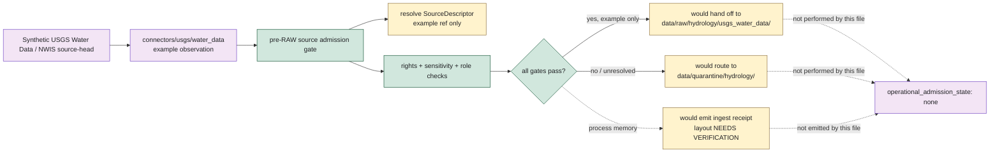

<!-- [KFM_META_BLOCK_V2]
doc_id: kfm://example/source-intake/usgs-nwis-walkthrough
title: USGS Water Data / NWIS Source Intake Walkthrough
type: example
version: v0.1.0
status: draft
owners: TODO(owner): examples steward; TODO(owner): source steward; TODO(owner): USGS steward; TODO(owner): hydrology steward; TODO(owner): connector steward; TODO(owner): receipt steward; TODO(owner): policy steward; TODO(owner): docs steward
created: NEEDS VERIFICATION - greenfield placeholder existed before 2026-06-30 expansion
updated: 2026-06-30
policy_label: public-review
related: [README.md, ../ingest_receipts/README.md, ../../docs/sources/ADMISSION_PROCESS.md, ../../docs/sources/SOURCE_DESCRIPTOR_STANDARD.md, ../../docs/sources/catalog/usgs/nwis-water.md, ../../connectors/usgs/README.md, ../../connectors/usgs/water_data/README.md, ../../data/raw/hydrology/README.md, ../../data/raw/hydrology/usgs_water_data/README.md, ../../data/receipts/ingest/README.md, ../../data/registry/sources/README.md]
tags: [kfm, examples, source-intake, usgs, nwis, water-data, hydrology, gauge, instantaneous-values, daily-values, site-metadata, provisional-approved, source-role, pre-raw, source-descriptor, source-activation-decision, source-intake-record, raw, quarantine, ingest-receipt, non-authoritative, fail-closed]
notes: ["This file replaces a greenfield placeholder at `examples/source_intake/usgs_nwis_walkthrough.md`.", "This walkthrough is synthetic and non-authoritative. It does not admit a real USGS/NWIS source, query a live endpoint, create a SourceDescriptor, emit a receipt, write RAW data, or assert hydrologic truth.", "The walkthrough teaches a nominal `ALLOW_TO_RAW_EXAMPLE` path while keeping `operational_admission_state: none` because example placement cannot admit or publish anything.", "USGS Water Data/NWIS source-role posture is heterogeneous: site metadata, instantaneous values, daily values, peak flows, annual statistics, water-quality records, and rating-curve context must not collapse.", "Endpoint migration and current endpoint behavior remain NEEDS VERIFICATION; this example preserves endpoint-family identity without asserting current operational status."]
[/KFM_META_BLOCK_V2] -->

<a id="top"></a>

# Walkthrough: Admitting a USGS Water Data / NWIS Source

Synthetic pre-RAW source-intake walkthrough for a USGS Water Data / NWIS-style hydrology source candidate.

<p>
  
  
  
  
  
</p>

**Path:** `examples/source_intake/usgs_nwis_walkthrough.md`  
**Example status:** synthetic / illustrative / non-authoritative  
**Instructional outcome:** `ALLOW_TO_RAW_EXAMPLE`  
**Operational admission state:** `none`  
**Quick links:** [Scenario](#scenario) · [What this demonstrates](#what-this-demonstrates) · [Synthetic source candidate](#synthetic-source-candidate) · [Gate walkthrough](#gate-walkthrough) · [Instructional handoff](#instructional-handoff) · [Negative branches](#negative-branches) · [USGS/NWIS guardrails](#usgsnwis-guardrails) · [Forbidden uses](#forbidden-uses) · [Status notes](#status-notes) · [Evidence ledger](#evidence-ledger)

> [!IMPORTANT]
> This walkthrough is an example. It is not a SourceDescriptor, SourceActivationDecision, SourceIntakeRecord, connector output, RAW capture, quarantine entry, ingest RunReceipt, EvidenceBundle, ProofPack, catalog record, policy decision, release decision, public API response, test fixture, validator, or source truth.

> [!CAUTION]
> The site ID, parameter code, endpoint, times, hashes, source refs, receipt refs, policy refs, and decision refs below are synthetic. Do not copy them into operational data.

---

## Scenario

A connector observes a synthetic source-head change for a USGS Water Data / NWIS-style instantaneous-values query.

The example asks:

> Could this source material be admitted into KFM RAW Hydrology as source capture for later normalization?

The example answers:

> It can only be shown as `ALLOW_TO_RAW_EXAMPLE` inside this walkthrough. No real source is admitted, no endpoint is queried, no descriptor is activated, and no receipt is emitted by this file.

| Field | Synthetic example value | Boundary |
|---|---|---|
| Source family | `usgs_water_data` | Example family label only. |
| Source surface | `nwis_water_data` | Legacy/modern endpoint status remains `NEEDS VERIFICATION`. |
| Domain lane | `hydrology` | RAW operational lane would be `data/raw/hydrology/usgs_water_data/`. |
| Sub-product | `instantaneous_values` | Observed reading example; not daily aggregate. |
| Site ID | `USGS-SITE-EXAMPLE-00000000` | Not a real site. |
| Parameter code | `PARAM-EXAMPLE-00060` | Synthetic discharge-like parameter marker; not an operational code. |
| Approval state | `provisional` | Preserved as metadata; not approved. |
| Operational admission | `none` | Example placement cannot admit material. |

---

## What this demonstrates

This walkthrough demonstrates the pre-RAW admission sequence for source material whose identity, role, rights, sensitivity, source-head, approval state, digest, and activation posture are all visible.

It does **not** demonstrate:

- live USGS endpoint behavior;
- current endpoint migration status;
- real site metadata;
- real gauge readings;
- real rights review;
- real SourceDescriptor or SourceActivationDecision records;
- emitted ingest receipts;
- RAW payload inventory;
- downstream Hydrology truth;
- flood warning, dam-operation, water-rights, engineering, or life-safety guidance;
- public release readiness.

---

## Synthetic source candidate

```json
{
  "example": true,
  "authority": "non_authoritative_example",
  "do_not_publish": true,
  "do_not_activate": true,
  "operational_admission_state": "none",
  "example_id": "kfm://example/source-intake/usgs-nwis/walkthrough-001",
  "intake_family": "source_admission_example",
  "source_candidate": {
    "source_family": "usgs_water_data",
    "source_surface": "nwis_water_data",
    "domain_lane": "hydrology",
    "adjacent_context_lane": "hazards",
    "subproduct": "instantaneous_values",
    "source_role": "observed",
    "approval_status": "provisional",
    "endpoint_family": "synthetic_legacy_or_modern_water_data_endpoint",
    "endpoint_migration_state": "needs_verification",
    "source_descriptor_ref": "kfm://example/source-descriptor/usgs-water-data/nwis-iv/NEEDS-VERIFICATION",
    "source_activation_decision_ref": "kfm://example/source-activation/usgs-water-data/nwis-iv/NEEDS-VERIFICATION",
    "source_head": {
      "etag": "W/\"SYNTHETIC-ETAG\"",
      "last_modified": "2026-06-30T00:00:00Z",
      "retrieval_time": "2026-06-30T00:05:00Z",
      "content_length_bytes": 1234,
      "digest_sha256": "sha256:SYNTHETIC000000000000000000000000000000000000000000000000000000"
    },
    "query_scope": {
      "site_id": "USGS-SITE-EXAMPLE-00000000",
      "parameter_code": "PARAM-EXAMPLE-00060",
      "time_window": "SYNTHETIC-RECENT-WINDOW",
      "value_type": "instantaneous"
    }
  },
  "expected_instructional_outcome": "ALLOW_TO_RAW_EXAMPLE",
  "forbidden_use": [
    "source_descriptor",
    "source_activation_decision",
    "source_intake_record",
    "raw_payload",
    "emitted_receipt",
    "proof_record",
    "catalog_record",
    "release_decision",
    "public_payload"
  ]
}
```

---

## Gate walkthrough

| # | Gate | Example result | Required evidence in a real run |
|---:|---|---|---|
| 1 | Observe source-head | `PASS_EXAMPLE` | Connector records endpoint family, query scope, retrieval time, status, source-head metadata, and digest. |
| 2 | Resolve source identity | `PASS_EXAMPLE` | Current SourceDescriptor resolves and matches source family, product, sub-product, role, rights, sensitivity, cadence, and steward. |
| 3 | Check source role | `PASS_EXAMPLE` | Instantaneous values remain `observed`; site metadata remains `administrative`; daily/annual values remain `aggregate`. |
| 4 | Check rights/citation | `PASS_EXAMPLE` | Rights, attribution, reuse, and citation posture are known and admissible. |
| 5 | Check sensitivity | `PASS_EXAMPLE` | Hydrology precision and infrastructure-adjacent joins are reviewed; no restricted detail is exposed. |
| 6 | Preserve approval state | `PASS_EXAMPLE` | `provisional` travels as binding metadata and is not cited as `approved`. |
| 7 | Preserve endpoint migration context | `PASS_EXAMPLE` | Legacy/modern endpoint family and cutover posture are recorded. Current status remains `NEEDS VERIFICATION`. |
| 8 | Verify integrity | `PASS_EXAMPLE` | Hash/digest, source-head, row/series counts, parameter code, site ID, and time window are pinned. |
| 9 | Activation decision | `PASS_EXAMPLE` | SourceActivationDecision permits this scope or routes it to hold/quarantine. |
| 10 | Handoff | `ALLOW_TO_RAW_EXAMPLE` | Real handoff would write RAW capture/material references and emit an ingest receipt. This file does neither. |



---

## Instructional handoff

This is the handoff this walkthrough teaches. It is not an emitted artifact.

```json
{
  "example": true,
  "authority": "non_authoritative_example",
  "operational_admission_state": "none",
  "instructional_outcome": "ALLOW_TO_RAW_EXAMPLE",
  "would_write_if_operational": {
    "raw_lane": "data/raw/hydrology/usgs_water_data/instantaneous-values/<run_id>/",
    "raw_material": [
      "source_reference.json",
      "iv_series_ref.json",
      "approval_status_ref.json",
      "parameter_code_ref.json",
      "checksums.sha256",
      "README.md"
    ],
    "receipt_lane": "data/receipts/ingest/ or accepted domain ingest receipt lane — NEEDS VERIFICATION",
    "quarantine_lane_on_failure": "data/quarantine/hydrology/"
  },
  "must_preserve": [
    "source_descriptor_ref",
    "source_activation_decision_ref",
    "source_role",
    "approval_status",
    "endpoint_family",
    "site_id",
    "parameter_code",
    "observation_time",
    "retrieval_time",
    "unit",
    "qualifier",
    "digest",
    "rights_state",
    "sensitivity_state"
  ],
  "must_not_emit": [
    "hydrologic_truth_claim",
    "approved_value_claim_from_provisional_input",
    "daily_value_as_instantaneous_observation",
    "flood_warning",
    "dam_operation_guidance",
    "water_rights_determination",
    "public_layer_or_api_payload"
  ]
}
```

---

## Negative branches

| Defect | Required example outcome | Why |
|---|---|---|
| SourceDescriptor unresolved | `DENY` or `HOLD` | No source, no admission. |
| SourceActivationDecision missing | `DENY` | The connector cannot activate itself. |
| Rights unknown | `QUARANTINE` or `DENY` | Rights cannot be deferred to publication. |
| Source role unknown | `QUARANTINE` | Observed, aggregate, administrative, modeled, candidate, and synthetic roles cannot collapse. |
| Provisional value treated as approved | `DENY` / `ABSTAIN` | Approval status is binding metadata. |
| Daily value treated as instantaneous reading | `DENY` / `ABSTAIN` | Aggregate source role cannot be converted into per-instant observation. |
| Endpoint family ambiguous | `HOLD` | Legacy/modern endpoint migration posture must remain explicit. |
| Digest mismatch | `QUARANTINE` | Integrity mismatch blocks admission. |
| Sensitive infrastructure join requested | `DENY` or generalized output | Infrastructure-adjacent hydrology precision requires policy review. |
| Flood warning or life-safety intent | `DENY` | USGS Water Data is source material, not a public warning/advisory system. |

---

## USGS/NWIS guardrails

| Risk | Guardrail |
|---|---|
| Site metadata becomes observation | Site records are administrative context; they do not prove a current water condition. |
| Provisional becomes approved | Provisional readings must carry their approval state and cannot be cited as approved values. |
| Daily values become instantaneous readings | Daily means, minima, maxima, and annual statistics are aggregate values with aggregation scope. |
| Peak flow loses caveats | Peak-flow examples must preserve uncertainty, rating context, water-year/period, and method caveats where material. |
| Rating curve becomes observation | Rating curves and calibration context are modeled/calibration support, not direct water observations. |
| Endpoint migration is hidden | Endpoint family, query scope, response status, retrieval time, and cutover/migration posture must remain visible. |
| Gauge reading becomes flood warning | Observed water readings are not NWS warnings, emergency guidance, dam-operation directions, or water-rights enforcement. |
| Example becomes source truth | This file is a walkthrough only; EvidenceBundle, SourceDescriptor, receipt, proof, catalog, policy, and release gates outrank it. |

---

## Forbidden uses

Do not use this walkthrough as:

- a real USGS/NWIS SourceDescriptor;
- a real SourceActivationDecision;
- a real SourceIntakeRecord;
- a connector fixture or endpoint test;
- a raw source payload or source-reference manifest;
- an emitted ingest receipt;
- an EvidenceBundle, ProofPack, citation-validation record, catalog record, or release artifact;
- a public Hydrology API/UI payload;
- a flood-warning, dam-operation, engineering, water-rights, emergency, or life-safety instruction;
- evidence that any current endpoint, migration window, rate limit, schema, validator, connector code path, CI check, or receipt emitter works.

---

## Status notes

| Item | Status | Notes |
|---|---:|---|
| Target path presence | CONFIRMED | `examples/source_intake/usgs_nwis_walkthrough.md` existed as a greenfield placeholder before this update. |
| Example-lane contract | CONFIRMED README | `examples/source_intake/README.md` defines source-intake examples as illustrative and non-authoritative. |
| Source admission doctrine | CONFIRMED README | `docs/sources/ADMISSION_PROCESS.md` defines SourceDescriptor, SourceActivationDecision, SourceIntakeRecord, RAW/quarantine routing, and fail-closed gates. |
| USGS Water Data / NWIS product page | CONFIRMED README | `docs/sources/catalog/usgs/nwis-water.md` defines product-source-role and provisional/approved guardrails as docs-side product doctrine. |
| USGS connector coordination lane | CONFIRMED README | `connectors/usgs/README.md` defines USGS connector work as source-admission support only. |
| USGS Water Data connector lane | CONFIRMED README | `connectors/usgs/water_data/README.md` defines the product connector boundary, source-role posture, endpoint migration discipline, and RAW/quarantine-only handoff. |
| Hydrology RAW parent | CONFIRMED README | `data/raw/hydrology/README.md` confirms `usgs_water_data/` as a RAW child lane and says RAW is no-public-path source capture. |
| Hydrology USGS Water Data RAW lane | CONFIRMED README | `data/raw/hydrology/usgs_water_data/README.md` defines accepted RAW material and source-role/approval-state handling. |
| Ingest receipt parent lane | CONFIRMED README | `data/receipts/ingest/README.md` defines ingest receipts as process memory, not source truth, proof, catalog, release, or public output. |
| Live endpoint behavior | NEEDS VERIFICATION | This edit did not query external USGS endpoints or validate current migration status. |
| SourceDescriptor records, activation decisions, emitted receipts, schemas, validators, fixtures, CI, connector runtime, RAW payload inventory, policy enforcement, release linkage | NEEDS VERIFICATION | This walkthrough proves none of those. |
| Public release readiness | DENY | Examples cannot admit, publish, prove, release, warn, or answer hydrologic claims. |

---

## Evidence ledger

| Source | Status | Supports | Limits |
|---|---|---|---|
| Previous target file | CONFIRMED | Target existed as a greenfield placeholder. | Did not define boundaries, walkthrough, or guardrails. |
| [`README.md`](README.md) | CONFIRMED README | Source-intake examples are illustrative, pre-RAW, non-authoritative, and separate from SourceDescriptors, activation decisions, RAW, quarantine, receipts, proofs, catalogs, and release. | Does not prove child example payloads or enforcement. |
| [`../../docs/sources/ADMISSION_PROCESS.md`](../../docs/sources/ADMISSION_PROCESS.md) | CONFIRMED standard draft | Admission is pre-RAW, produces SourceDescriptor/SourceActivationDecision/SourceIntakeRecord, and uses fail-closed gates. | Specific schema homes and implementation routing remain PROPOSED / NEEDS VERIFICATION. |
| [`../../docs/sources/SOURCE_DESCRIPTOR_STANDARD.md`](../../docs/sources/SOURCE_DESCRIPTOR_STANDARD.md) | CONFIRMED standard draft | Source role, rights, sensitivity, cadence, access, steward, and citation posture are admission-time concerns. | Field-level machine shape and validator behavior remain NEEDS VERIFICATION. |
| [`../../docs/sources/catalog/usgs/nwis-water.md`](../../docs/sources/catalog/usgs/nwis-water.md) | CONFIRMED product page | USGS Water Data / NWIS source-role heterogeneity, provisional-vs-approved distinction, aggregate-vs-observed guardrails, endpoint migration caution, and non-warning boundary. | Current endpoint behavior and exact migration status remain NEEDS VERIFICATION. |
| [`../../connectors/usgs/README.md`](../../connectors/usgs/README.md) | CONFIRMED README | USGS connector coordination lane; connector outputs may enter RAW/QUARANTINE/receipts only and do not publish or promote. | Does not prove connector implementation, endpoint health, or emitted receipts. |
| [`../../connectors/usgs/water_data/README.md`](../../connectors/usgs/water_data/README.md) | CONFIRMED README | USGS Water Data connector lane, source-role discipline, temporal/approval-state discipline, API migration discipline, and RAW/quarantine-only lifecycle sketch. | Connector code, endpoint config, fixtures, tests, CI, emitted receipts, and release behavior remain NEEDS VERIFICATION. |
| [`../../data/raw/hydrology/README.md`](../../data/raw/hydrology/README.md) | CONFIRMED README | Hydrology RAW parent, confirmed `usgs_water_data/` child lane, no-public-path RAW posture, and source-role preservation. | Does not prove payloads, SourceDescriptors, connectors, or release readiness. |
| [`../../data/raw/hydrology/usgs_water_data/README.md`](../../data/raw/hydrology/usgs_water_data/README.md) | CONFIRMED README | RAW lane for USGS Water Data/NWIS source captures, accepted material, approval-state/source-role handling, and exclusions. | Does not prove actual source captures or validators. |
| [`../../data/receipts/ingest/README.md`](../../data/receipts/ingest/README.md) | CONFIRMED README | Ingest receipts record process memory and do not replace RAW payloads, SourceDescriptors, proofs, catalogs, policies, release, or public output. | Exact receipt subtype layout remains NEEDS VERIFICATION. |
| [`../../data/registry/sources/README.md`](../../data/registry/sources/README.md) | CONFIRMED README | Source registry is the admission and authority-control surface for source treatment. | Schema filename, validators, fixtures, and registry inventory remain PROPOSED / NEEDS VERIFICATION. |

[Back to top](#top)
