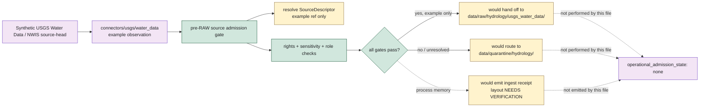

<!-- [KFM_META_BLOCK_V2]
doc_id: kfm://example/source-intake/usgs-nwis-walkthrough
title: USGS Water Data / NWIS Source Intake Walkthrough
type: example
version: v0.2.0
status: draft
owners: NEEDS VERIFICATION - examples, source, USGS, Hydrology, connector, receipt, policy, and docs stewardship assignments; default GitHub review route is @bartytime4life
created: NEEDS VERIFICATION - greenfield placeholder existed before 2026-06-30 expansion
updated: 2026-07-24
policy_label: public-review
related: [README.md, ../README.md, ../ingest_receipts/README.md, ../../docs/sources/ADMISSION_PROCESS.md, ../../docs/sources/SOURCE_DESCRIPTOR_STANDARD.md, ../../docs/sources/catalog/usgs/nwis-water.md, ../../connectors/usgs/README.md, ../../connectors/usgs/water_data/README.md, ../../data/raw/hydrology/README.md, ../../data/raw/hydrology/usgs_water_data/README.md, ../../data/receipts/ingest/README.md, ../../data/registry/sources/README.md, ../../contracts/runtime/decision_envelope.md, ../../docs/doctrine/truth-posture.md, ../../docs/doctrine/directory-rules.md, ../../.github/CODEOWNERS]
tags: [kfm, examples, source-intake, usgs, nwis, water-data, hydrology, gauge, instantaneous-values, daily-values, site-metadata, provisional-approved, source-role, pre-raw, source-descriptor, source-activation-decision, source-intake-record, raw, quarantine, ingest-receipt, static-walkthrough, non-authoritative, fail-closed, cite-or-abstain]
notes: ["The v0.1.0 walkthrough had already replaced the historical greenfield placeholder at `examples/source_intake/usgs_nwis_walkthrough.md`; v0.2.0 modernizes that substantive baseline in place.", "The highest evidenced maturity is `STATIC_WALKTHROUGH`; no schema validation, local execution, fixture parity, connector run, source activation, RAW write, receipt emission, or publication is established.", "This walkthrough is synthetic and non-authoritative. It does not admit a real USGS/NWIS source, query a live endpoint, create a SourceDescriptor, emit a receipt, write RAW data, or assert hydrologic truth.", "The walkthrough teaches a nominal `ALLOW_TO_RAW_EXAMPLE` path while keeping `operational_admission_state: none` because example placement cannot admit or publish anything.", "USGS Water Data/NWIS source-role posture is heterogeneous: site metadata, instantaneous values, daily values, peak flows, annual statistics, water-quality records, and rating-curve context must not collapse.", "Endpoint migration and current endpoint behavior remain NEEDS VERIFICATION; this example preserves endpoint-family identity without asserting current operational status."]
[/KFM_META_BLOCK_V2] -->

<a id="top"></a>

# Walkthrough: Admitting a USGS Water Data / NWIS Source

Synthetic pre-RAW source-intake walkthrough for a USGS Water Data / NWIS-style hydrology source candidate.

[](#status-notes)
[](#current-maturity)
[](#forbidden-uses)
[](#instructional-handoff)
[](../../docs/doctrine/truth-posture.md)

**Path:** `examples/source_intake/usgs_nwis_walkthrough.md`  
**Document status:** draft  
**Maturity:** `STATIC_WALKTHROUGH`  
**Example status:** synthetic / illustrative / non-authoritative  
**Instructional outcome:** `ALLOW_TO_RAW_EXAMPLE`  
**Operational admission state:** `none`  
**Owners:** `NEEDS VERIFICATION` — examples, source, USGS, Hydrology, connector, receipt, policy, and docs stewardship assignments; GitHub currently routes review to `@bartytime4life` by default  
**Quick links:** [Scenario](#scenario) · [Path and evidence posture](#path-and-evidence-posture) · [What this demonstrates](#what-this-demonstrates) · [Reader workflow](#reader-workflow) · [Synthetic source candidate](#synthetic-source-candidate) · [Gate walkthrough](#gate-walkthrough) · [Instructional handoff](#instructional-handoff) · [Current maturity](#current-maturity) · [Negative branches](#negative-branches) · [USGS/NWIS guardrails](#usgsnwis-guardrails) · [Forbidden uses](#forbidden-uses) · [Validation](#validation) · [Review and maintenance](#review-and-maintenance) · [Status notes](#status-notes) · [Change history](#change-history) · [Evidence ledger](#evidence-ledger)

> [!IMPORTANT]
> This walkthrough is an example. It is not a SourceDescriptor, SourceActivationDecision, SourceIntakeRecord, connector output, RAW capture, quarantine entry, ingest RunReceipt, EvidenceBundle, ProofPack, catalog record, policy decision, release decision, public API response, test fixture, validator, or source truth.

> [!CAUTION]
> The site ID, parameter code, endpoint, times, hashes, source refs, receipt refs, policy refs, and decision refs below are synthetic. Do not copy them into operational data.

---

## Scenario

A connector observes a synthetic source-head change for a USGS Water Data / NWIS-style instantaneous-values query.

The example asks:

> Could this source material be admitted into KFM RAW Hydrology as source capture for later normalization?

The example answers:

> It can only be shown as `ALLOW_TO_RAW_EXAMPLE` inside this walkthrough. No real source is admitted, no endpoint is queried, no descriptor is activated, and no receipt is emitted by this file.

| Field | Synthetic example value | Boundary |
|---|---|---|
| Source family | `usgs_water_data` | Example family label only. |
| Source surface | `nwis_water_data` | Legacy/modern endpoint status remains `NEEDS VERIFICATION`. |
| Domain lane | `hydrology` | RAW operational lane would be `data/raw/hydrology/usgs_water_data/`. |
| Sub-product | `instantaneous_values` | Observed reading example; not daily aggregate. |
| Site ID | `USGS-SITE-EXAMPLE-00000000` | Not a real site. |
| Parameter code | `PARAM-EXAMPLE-00060` | Synthetic discharge-like parameter marker; not an operational code. |
| Approval state | `provisional` | Preserved as metadata; not approved. |
| Operational admission | `none` | Example placement cannot admit material. |

---

## Path and evidence posture

The target is a substantive v0.1.0 walkthrough, not a placeholder. Evidence pinned for this revision:

| Evidence | Observation | Status |
|---|---|---|
| Target at `main@885597360635b0a42cb815f8da2bf50f642c7a5e` | v0.1.0, 321 lines, blob `a7b1f2b9cf23a5a7cf4822f9281f8728c7164934`. | `CONFIRMED` |
| Historical lineage | Target metadata records that v0.1.0 replaced a greenfield placeholder. | `CONFIRMED metadata claim`; original creation date remains `NEEDS VERIFICATION` |
| Parent lane contract | [`README.md`](README.md), v0.2.0, classifies this artifact as the lane's confirmed static walkthrough. | `CONFIRMED` |
| Open pull-request overlap | No open pull request matching this walkthrough surfaced before authoring. | `CONFIRMED bounded search`; not an exhaustive branch audit |

Directory Rules place worked examples under `examples/`. The `source_intake` segment is a lane within that root, and this file is its synthetic teaching artifact. Keeping it here creates no SourceDescriptor, registry, connector, RAW, receipt, proof, policy, release, or publication authority.

Repository documents describe modern and legacy USGS Water Data endpoint families and a migration posture, but this revision does not verify live endpoint availability, migration dates, response shape, rate limits, or current operating status. Those facts remain `NEEDS VERIFICATION` and are not required for this no-network walkthrough.

---

## What this demonstrates

This walkthrough demonstrates the pre-RAW admission sequence for source material whose identity, role, rights, sensitivity, source-head, approval state, digest, and activation posture are all visible.

It does **not** demonstrate:

- live USGS endpoint behavior;
- current endpoint migration status;
- real site metadata;
- real gauge readings;
- real rights review;
- real SourceDescriptor or SourceActivationDecision records;
- emitted ingest receipts;
- RAW payload inventory;
- downstream Hydrology truth;
- flood warning, dam-operation, water-rights, engineering, or life-safety guidance;
- public release readiness.

---

## Reader workflow

1. **Confirm the scenario is synthetic.** Check `example: true`, non-authority markers, fake IDs, fake source-head values, and `operational_admission_state: none`.
2. **Read the source-role split.** Site metadata is administrative, instantaneous values are observed, daily/annual summaries are aggregate, and rating context is not a direct observation.
3. **Trace the ten instructional gates.** Treat `EXPECTED_PASS_EXAMPLE` as a teaching expectation, never as an observed validator or connector result.
4. **Inspect the handoff sketch.** It names what an operational flow would need to preserve without writing RAW data or emitting a receipt.
5. **Exercise a negative branch.** Unresolved identity, activation, rights, role, integrity, endpoint posture, sensitivity, or life-safety framing must fail closed.
6. **Keep outcome vocabularies separate.** Pre-RAW `HOLD`, `DENY`, and `QUARANTINE` are not substitutes for public runtime `ANSWER`, `ABSTAIN`, `DENY`, or `ERROR`.
7. **Stop at the example boundary.** To validate real behavior, move to the owning connector, registry, policy, schema, fixture, validator, test, receipt, and release surfaces.

---

## Synthetic source candidate

```json
{
  "example": true,
  "authority": "non_authoritative_example",
  "do_not_publish": true,
  "do_not_activate": true,
  "operational_admission_state": "none",
  "example_id": "kfm://example/source-intake/usgs-nwis/walkthrough-001",
  "intake_family": "source_admission_example",
  "source_candidate": {
    "source_family": "usgs_water_data",
    "source_surface": "nwis_water_data",
    "domain_lane": "hydrology",
    "adjacent_context_lane": "hazards",
    "subproduct": "instantaneous_values",
    "source_role": "observed",
    "approval_status": "provisional",
    "endpoint_family": "synthetic_legacy_or_modern_water_data_endpoint",
    "endpoint_migration_state": "needs_verification",
    "source_descriptor_ref": "kfm://example/source-descriptor/usgs-water-data/nwis-iv/NEEDS-VERIFICATION",
    "source_activation_decision_ref": "kfm://example/source-activation/usgs-water-data/nwis-iv/NEEDS-VERIFICATION",
    "source_head": {
      "etag": "W/\"SYNTHETIC-ETAG\"",
      "last_modified": "2026-06-30T00:00:00Z",
      "retrieval_time": "2026-06-30T00:05:00Z",
      "content_length_bytes": 1234,
      "digest_sha256": "sha256:SYNTHETIC000000000000000000000000000000000000000000000000000000"
    },
    "query_scope": {
      "site_id": "USGS-SITE-EXAMPLE-00000000",
      "parameter_code": "PARAM-EXAMPLE-00060",
      "time_window": "SYNTHETIC-RECENT-WINDOW",
      "value_type": "instantaneous"
    }
  },
  "expected_instructional_outcome": "ALLOW_TO_RAW_EXAMPLE",
  "forbidden_use": [
    "source_descriptor",
    "source_activation_decision",
    "source_intake_record",
    "raw_payload",
    "emitted_receipt",
    "proof_record",
    "catalog_record",
    "release_decision",
    "public_payload"
  ]
}
```

---

## Gate walkthrough

| # | Gate | Instructional expectation | Required evidence in a real run |
|---:|---|---|---|
| 1 | Observe source-head | `EXPECTED_PASS_EXAMPLE` | Connector records endpoint family, query scope, retrieval time, status, source-head metadata, and digest. |
| 2 | Resolve source identity | `EXPECTED_PASS_EXAMPLE` | Current SourceDescriptor resolves and matches source family, product, sub-product, role, rights, sensitivity, cadence, and steward. |
| 3 | Check source role | `EXPECTED_PASS_EXAMPLE` | Instantaneous values remain `observed`; site metadata remains `administrative`; daily/annual values remain `aggregate`. |
| 4 | Check rights/citation | `EXPECTED_PASS_EXAMPLE` | Rights, attribution, reuse, and citation posture are known and admissible. |
| 5 | Check sensitivity | `EXPECTED_PASS_EXAMPLE` | Hydrology precision and infrastructure-adjacent joins are reviewed; no restricted detail is exposed. |
| 6 | Preserve approval state | `EXPECTED_PASS_EXAMPLE` | `provisional` travels as binding metadata and is not cited as `approved`. |
| 7 | Preserve endpoint migration context | `EXPECTED_PASS_EXAMPLE` | Legacy/modern endpoint family and cutover posture are recorded. Current status remains `NEEDS VERIFICATION`. |
| 8 | Verify integrity | `EXPECTED_PASS_EXAMPLE` | Hash/digest, source-head, row/series counts, parameter code, site ID, and time window are pinned. |
| 9 | Activation decision | `EXPECTED_PASS_EXAMPLE` | SourceActivationDecision permits this scope or routes it to hold/quarantine. |
| 10 | Handoff | `ALLOW_TO_RAW_EXAMPLE` | Real handoff would write RAW capture/material references and emit an ingest receipt. This file does neither. |

The table records expected teaching behavior only. It is not an observed run, validation report, activation decision, or receipt.


```mermaid
flowchart LR
    EXT["Synthetic USGS Water Data / NWIS source-head"] --> CONN["connectors/usgs/water_data<br/>example observation"]
    CONN --> PRE["pre-RAW source admission gate"]
    PRE --> REG["resolve SourceDescriptor<br/>example ref only"]
    PRE --> POL["rights + sensitivity + role checks"]
    POL --> DECIDE{"all gates pass?"}
    DECIDE -->|"yes, example only"| RAW["would hand off to<br/>data/raw/hydrology/usgs_water_data/"]
    DECIDE -->|"no / unresolved"| QUAR["would route to<br/>data/quarantine/hydrology/"]
    DECIDE -. "process memory" .-> REC["would emit ingest receipt<br/>layout NEEDS VERIFICATION"]

    RAW -. "not performed by this file" .-> STOP["operational_admission_state: none"]
    QUAR -. "not performed by this file" .-> STOP
    REC -. "not emitted by this file" .-> STOP

    classDef example fill:#f3e5f5,stroke:#6f42c1,color:#202124;
    classDef data fill:#fff3cd,stroke:#8a6d3b,color:#202124;
    classDef gate fill:#d1e7dd,stroke:#0f5132,color:#202124;
    class EXT,CONN,STOP example;
    class PRE,POL,DECIDE gate;
    class REG,RAW,QUAR,REC data;
```

---

## Instructional handoff

This is the handoff this walkthrough teaches. It is not an emitted artifact.

```json
{
  "example": true,
  "authority": "non_authoritative_example",
  "operational_admission_state": "none",
  "instructional_outcome": "ALLOW_TO_RAW_EXAMPLE",
  "would_write_if_operational": {
    "raw_lane": "data/raw/hydrology/usgs_water_data/instantaneous-values/<run_id>/",
    "raw_material": [
      "source_reference.json",
      "iv_series_ref.json",
      "approval_status_ref.json",
      "parameter_code_ref.json",
      "checksums.sha256",
      "README.md"
    ],
    "receipt_lane": "data/receipts/ingest/ or accepted domain ingest receipt lane — NEEDS VERIFICATION",
    "quarantine_lane_on_failure": "data/quarantine/hydrology/"
  },
  "must_preserve": [
    "source_descriptor_ref",
    "source_activation_decision_ref",
    "source_role",
    "approval_status",
    "endpoint_family",
    "site_id",
    "parameter_code",
    "observation_time",
    "retrieval_time",
    "unit",
    "qualifier",
    "digest",
    "rights_state",
    "sensitivity_state"
  ],
  "must_not_emit": [
    "hydrologic_truth_claim",
    "approved_value_claim_from_provisional_input",
    "daily_value_as_instantaneous_observation",
    "flood_warning",
    "dam_operation_guidance",
    "water_rights_determination",
    "public_layer_or_api_payload"
  ]
}
```

---

## Current maturity

The highest evidenced state is **`STATIC_WALKTHROUGH`**. That label describes a reviewable synthetic document, not source truth or executable capability.

| Maturity state | Result | Evidence required or observed |
|---|---:|---|
| `README_ONLY` | PASS | The parent boundary README exists and parses. |
| `STATIC_WALKTHROUGH` | CONFIRMED | This file has synthetic/non-authority markers, source-role distinctions, an instructional outcome, negative branches, diagrams, and `operational_admission_state: none`. |
| `STRUCTURE_VALIDATED` | UNKNOWN | Requires an accepted example schema/contract and an observed validation result for this artifact. |
| `RUNNABLE_LOCAL` | UNKNOWN | Requires pinned runtime/dependencies, deterministic no-network inputs and outputs, cleanup, and positive/negative observed runs. |
| `FIXTURE_MIRRORED` | UNKNOWN | Requires a separate fixture/test artifact, lineage/update contract, consumer test, and drift check. |
| `STALE` | NOT ESTABLISHED | Age or unresolved live-endpoint status alone is insufficient; disagreement with governing behavior must be shown. |
| `RETIRED` | NOT ESTABLISHED | Requires replacement/history and consumer/reference review. |

No live HTTP request, connector execution, source activation, schema conformance, RAW capture, receipt emission, fixture parity, Hydrology claim, warning authority, or public release is inferred from this maturity.

---

## Negative branches

The table keeps pre-RAW instructional disposition separate from any later public-runtime outcome.

| Defect | Pre-RAW instructional disposition | If a public claim is requested | Why |
|---|---|---|---|
| SourceDescriptor unresolved | `HOLD` or `DENY` | `ABSTAIN` or `DENY` under the governing policy | No resolved source identity, no admission or supported claim. |
| SourceActivationDecision missing | `DENY` | `DENY` when the source would be required | A connector cannot activate itself. |
| Rights unknown | `QUARANTINE` or `DENY` | `DENY` | Rights cannot be deferred to publication. |
| Source role unknown | `QUARANTINE` | `ABSTAIN` or `DENY` | Observed, aggregate, administrative, modeled, candidate, and synthetic roles cannot collapse. |
| Provisional value treated as approved | `DENY` | `ABSTAIN` or `DENY` | Approval status is binding metadata. |
| Daily value treated as instantaneous reading | `DENY` | `ABSTAIN` or `DENY` | Aggregate source role cannot become a per-instant observation. |
| Endpoint family ambiguous | `HOLD` | `ABSTAIN` when endpoint lineage is material | Modern/legacy endpoint identity and migration posture must remain explicit. |
| Digest mismatch | `QUARANTINE` | `ABSTAIN` or `ERROR` according to the failed surface | Integrity mismatch blocks admission and reliance. |
| Sensitive infrastructure join requested | `HOLD`, `QUARANTINE`, or `DENY` | `DENY` or a separately governed generalized answer | Infrastructure-adjacent precision requires policy review. |
| Flood-warning or life-safety intent | `DENY` | `DENY` with referral to the verified issuing authority | USGS Water Data is source material, not KFM warning authority. |
| Tool or connector failure | `ERROR` or `HOLD` according to the admission contract | `ERROR` | Never fall back to an uncited generated claim. |

Public runtime delivery uses the [`DecisionEnvelope` outcomes](../../contracts/runtime/decision_envelope.md): `ANSWER`, `ABSTAIN`, `DENY`, or `ERROR`. `HOLD` and `QUARANTINE` remain pre-runtime review or lifecycle states.

---

## USGS/NWIS guardrails

| Risk | Guardrail |
|---|---|
| Site metadata becomes observation | Site records are administrative context; they do not prove a current water condition. |
| Provisional becomes approved | Provisional readings must carry their approval state and cannot be cited as approved values. |
| Daily values become instantaneous readings | Daily means, minima, maxima, and annual statistics are aggregate values with aggregation scope. |
| Peak flow loses caveats | Peak-flow examples must preserve uncertainty, rating context, water-year/period, and method caveats where material. |
| Rating curve becomes observation | Rating curves and calibration context are modeled/calibration support, not direct water observations. |
| Endpoint migration is hidden | Endpoint family, query scope, response status, retrieval time, and cutover/migration posture must remain visible. |
| Gauge reading becomes flood warning | Observed water readings are not NWS warnings, emergency guidance, dam-operation directions, or water-rights enforcement. |
| Example becomes source truth | This file is a walkthrough only; EvidenceBundle, SourceDescriptor, receipt, proof, catalog, policy, and release gates outrank it. |

---

## Forbidden uses

Do not use this walkthrough as:

- a real USGS/NWIS SourceDescriptor;
- a real SourceActivationDecision;
- a real SourceIntakeRecord;
- a connector fixture or endpoint test;
- a raw source payload or source-reference manifest;
- an emitted ingest receipt;
- an EvidenceBundle, ProofPack, citation-validation record, catalog record, or release artifact;
- a public Hydrology API/UI payload;
- a flood-warning, dam-operation, engineering, water-rights, emergency, or life-safety instruction;
- evidence that any current endpoint, migration window, rate limit, schema, validator, connector code path, CI check, or receipt emitter works.

---

## Validation

Before changing this walkthrough, verify:

- [ ] `example: true`, `authority: non_authoritative_example`, `do_not_publish: true`, `do_not_activate: true`, and `operational_admission_state: none` remain visible.
- [ ] Site IDs, parameter codes, endpoint values, times, hashes, refs, and payload fragments remain synthetic.
- [ ] Site metadata, IV readings, daily/annual aggregates, peak flows, water quality, rating context, and approval state do not collapse.
- [ ] Provisional data is never presented as approved.
- [ ] No flood warning, dam-operation direction, engineering determination, water-rights decision, or life-safety instruction is generated.
- [ ] Admission dispositions and public runtime outcomes remain separate.
- [ ] Relative links, local fragments, diagrams, tables, alerts, and code fences remain valid.
- [ ] Claimed maturity does not exceed observed evidence.
- [ ] Runnable code, fixtures, schemas, validators, policies, receipts, and release artifacts stay in their owning roots.

### Current validation evidence

| Check | Result | Boundary |
|---|---|---|
| Complete v0.1.0 baseline and governing-document read | `PASS` | Exact pinned files; not a repository-wide inventory. |
| Markdown heading, fence, table, alert, and fragment source checks | `PASS` for this revision | Source validation; not a GitHub-render or semantic execution. |
| Repository-relative link targets | `PASS` for checked destinations | Exact pinned paths; does not establish external freshness. |
| Badge retrieval and SVG content type | `PASS` for five admitted badges | Network availability can change. |
| Secret/sensitive-pattern review | `PASS` for this documentation-only change | Not a repository-wide scanner result. |
| [`docs-build.yml`](../../.github/workflows/docs-build.yml) | `WORKFLOW_HOLD` by definition | No accepted documentation generator/build or preview artifact. |
| [`link-check.yml`](../../.github/workflows/link-check.yml) | `WORKFLOW_HOLD` by definition | No accepted executable link/anchor checker. |
| [`accessibility.yml`](../../.github/workflows/accessibility.yml) | `WORKFLOW_HOLD` by definition | No axe or keyboard-navigation execution. |
| Live USGS endpoint, migration, response, and rate-limit checks | `NOT RUN` | The walkthrough is deliberately no-network; current behavior remains `NEEDS VERIFICATION`. |
| Connector, schema, policy, fixture, validator, RAW, receipt, and runtime execution | `UNKNOWN / NEEDS VERIFICATION` | This file proves none of those. |
| GitHub-rendered visual inspection | `NEEDS VERIFICATION` | Required before claiming a host-render pass. |

## Review and maintenance

[`CODEOWNERS`](../../.github/CODEOWNERS) currently applies the default `@bartytime4life` route because no dedicated `/examples/` rule exists. That is GitHub routing only; it is not a StewardshipAssignment, USGS or Hydrology review, policy decision, source activation, or release authorization.

Request focused review when changing:

- source identity, endpoint-family wording, query scope, source role, approval state, rights, sensitivity, cadence, citation, or integrity posture;
- site, parameter, temporal, unit, qualifier, aggregation, method, datum, rating, or uncertainty fields;
- admission outcomes, reason codes, quarantine behavior, or operational-state markers;
- infrastructure-adjacent joins, location precision, warning language, or life-safety boundaries;
- reusable payload shapes or anything proposed for connector, fixture, test, schema, validator, policy, or receipt graduation; or
- statements about current USGS endpoints, migrations, terms, limits, product behavior, or authority.

Maintenance rules:

- correct stale labels, links, outcome mappings, or governing references in place and record the change;
- mark the walkthrough `STALE` if a referenced contract or implemented behavior changes and agreement is not re-established;
- keep time-sensitive endpoint and migration claims `NEEDS VERIFICATION` until authoritative current evidence is checked;
- graduate executable or machine-enforced material through its owning root with deterministic no-network fixtures, negative cases, and drift checks;
- remove unsafe location, infrastructure, personal, credential, proprietary, or reconstructive detail immediately; and
- before merge, rollback is closing the draft PR and abandoning its branch; after merge, use a transparent revert rather than rewriting history.

---

## Status notes

| Item | Status | Notes |
|---|---:|---|
| Target baseline | CONFIRMED | v0.1.0 at `main@885597360635b0a42cb815f8da2bf50f642c7a5e`, blob `a7b1f2b9cf23a5a7cf4822f9281f8728c7164934`; already substantive, with historical placeholder lineage retained. |
| Parent source-intake contract | CONFIRMED | [`README.md`](README.md) v0.2.0 records this file as the lane's synthetic static walkthrough. |
| Directory placement | CONFIRMED doctrine | `examples/source_intake/` is the worked-example lane; this file has no operational authority. |
| Current maturity | CONFIRMED `STATIC_WALKTHROUGH` | Reviewable synthetic narrative, JSON sketches, gate table, diagram, negative cases, and explicit `operational_admission_state: none`. |
| Source-admission and descriptor doctrine | CONFIRMED documents | Admission is pre-RAW; identity, role, rights, sensitivity, integrity, and activation fail closed when unresolved. |
| USGS/NWIS repository posture | CONFIRMED documents | Product, connector, and RAW documents preserve sub-product role, provisional/approved state, endpoint identity, and non-warning boundaries. |
| Current live endpoint behavior and migration dates | NEEDS VERIFICATION | No external endpoint, current USGS documentation, response schema, rate limit, or cutover status was checked for this revision. |
| Public runtime vocabulary | CONFIRMED contract | `ANSWER`, `ABSTAIN`, `DENY`, and `ERROR`; pre-runtime `HOLD`/`QUARANTINE` remain distinct. |
| Dedicated stewardship assignments | NEEDS VERIFICATION | CODEOWNERS provides only a default GitHub review route. |
| Connector runtime, SourceDescriptor inventory, activation decisions, schemas, validators, fixtures, CI enforcement, RAW payloads, emitted receipts, policy enforcement, or release linkage | NEEDS VERIFICATION | No operational behavior is claimed. |
| Operational admission | None | The instructional outcome is not a source activation or RAW handoff. |
| Release/publication/warning authority | None | Examples cannot publish, prove, release, warn, or answer Hydrology claims by placement. |

## Change history

### v0.2.0 — 2026-07-24

- modernized the substantive v0.1.0 walkthrough in place while retaining its scenario, stable headings, synthetic payloads, ten gates, handoff, negative cases, guardrails, exclusions, and evidence links;
- reconciled the document with the merged v0.2.0 parent lane contract and `STATIC_WALKTHROUGH` maturity;
- changed gate results from ambiguous pass-style labels to `EXPECTED_PASS_EXAMPLE` teaching expectations;
- separated pre-RAW dispositions from public runtime outcomes;
- added path/evidence posture, reader workflow, maturity, validation, review, maintenance, correction, graduation, and rollback guidance;
- linked five compact evidence-bearing badges; and
- changed documentation only.

### v0.1.0 — 2026-06-30

- replaced the historical greenfield placeholder with the initial synthetic USGS Water Data / NWIS source-intake walkthrough.

---

## Evidence ledger

| Source | Status | Supports | Limits |
|---|---|---|---|
| Previous target at `main@885597360635b0a42cb815f8da2bf50f642c7a5e` | CONFIRMED | v0.1.0 substantive baseline, blob `a7b1f2b9cf23a5a7cf4822f9281f8728c7164934`. | Historical creation date remains `NEEDS VERIFICATION`. |
| [`README.md`](README.md) | CONFIRMED v0.2.0 lane contract, blob `45ba3a401a05981e576250bd342c6caa7a4399e5` | Pre-RAW example boundary, authoring workflow, `STATIC_WALKTHROUGH` classification, and non-authority posture. | Does not prove schema, runtime, fixture, connector, or release maturity. |
| [`../README.md`](../README.md) | CONFIRMED examples-root contract | Root authority boundary and maturity vocabulary. | Root guidance does not prove this artifact's operational behavior. |
| [`../../docs/sources/ADMISSION_PROCESS.md`](../../docs/sources/ADMISSION_PROCESS.md) | CONFIRMED draft standard | Pre-RAW admission membrane, SourceDescriptor, SourceActivationDecision, SourceIntakeRecord, and fail-closed routing. | Open ADRs and proposed paths remain as labeled there. |
| [`../../docs/sources/SOURCE_DESCRIPTOR_STANDARD.md`](../../docs/sources/SOURCE_DESCRIPTOR_STANDARD.md) | CONFIRMED draft standard | Admission-time role, rights, sensitivity, cadence, access, steward, and citation posture. | Machine shape and implementation maturity remain bounded by that document. |
| [`../../docs/sources/catalog/usgs/nwis-water.md`](../../docs/sources/catalog/usgs/nwis-water.md) | CONFIRMED repository product page | Source-role heterogeneity, provisional/approved distinction, aggregate/observed guardrails, endpoint-family discipline, and non-warning boundary. | Current endpoint availability, phase-out schedule, response shape, and external correctness were not independently verified. |
| [`../../connectors/usgs/README.md`](../../connectors/usgs/README.md) | CONFIRMED README | USGS connector coordination remains source-admission support, not promotion/publication. | Does not prove runtime implementation or endpoint health. |
| [`../../connectors/usgs/water_data/README.md`](../../connectors/usgs/water_data/README.md) | CONFIRMED README | Product connector boundary, role/approval-state discipline, endpoint identity, and RAW/quarantine-only handoff. | Code, config, fixtures, tests, emitted receipts, and current endpoint behavior remain bounded. |
| [`../../data/raw/hydrology/README.md`](../../data/raw/hydrology/README.md) | CONFIRMED README | Hydrology RAW parent and no-public-path posture. | Does not prove captured payloads or source activation. |
| [`../../data/raw/hydrology/usgs_water_data/README.md`](../../data/raw/hydrology/usgs_water_data/README.md) | CONFIRMED README | Accepted RAW material and source-role/approval-state handling. | Does not prove actual captures, validation, or release. |
| [`../../data/receipts/ingest/README.md`](../../data/receipts/ingest/README.md) | CONFIRMED README | Ingest receipts are process memory, not source truth or publication. | Exact emitted receipt subtype remains `NEEDS VERIFICATION`. |
| [`../../data/registry/sources/README.md`](../../data/registry/sources/README.md) | CONFIRMED README | Registry is the source admission and authority-control surface. | Inventory, schema, and validator maturity remain as labeled there. |
| [`../../contracts/runtime/decision_envelope.md`](../../contracts/runtime/decision_envelope.md) | CONFIRMED contract text | Public runtime outcomes are `ANSWER`, `ABSTAIN`, `DENY`, and `ERROR`. | Does not define operational source-admission storage. |
| [`../../.github/CODEOWNERS`](../../.github/CODEOWNERS) | CONFIRMED routing | Default review route is `@bartytime4life`; no dedicated `/examples/` rule. | Not proof of stewardship, enforcement, independence, or approval. |
| [`../../.github/workflows/docs-build.yml`](../../.github/workflows/docs-build.yml), [`link-check.yml`](../../.github/workflows/link-check.yml), and [`accessibility.yml`](../../.github/workflows/accessibility.yml) | CONFIRMED workflow text | Documentation build, link, and accessibility surfaces are explicit readiness holds. | They do not establish render, link, accessibility, release, or publication success. |
| Directory Rules and [`directory-rules.md`](../../docs/doctrine/directory-rules.md) | CONFIRMED doctrine | `examples/` owns worked examples; lifecycle and authority roots remain separate. | Does not establish runtime maturity. |
| Live USGS endpoints, external current documentation, dependency closure, execution, deployments, telemetry, and consumer inventory | UNKNOWN / NOT RUN | No claim. | Requires separate governed verification. |

Exact reads and bounded searches do not replace a recursive tree, external source verification, dependency install, connector run, deterministic fixture suite, CI history, runtime telemetry, or host-render review.

[Back to top](#top)
