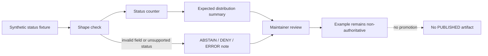

<!-- [KFM_META_BLOCK_V2]
doc_id: kfm://doc/NEEDS-VERIFICATION
title: Status Distribution Minimal Example
type: standard
version: v1
status: draft
owners: OWNER_TBD
created: 2026-05-02
updated: 2026-05-02
policy_label: NEEDS_VERIFICATION
related: [PATH_TBD_AFTER_REPO_INSPECTION]
tags: [kfm, examples, status-distribution, fixture, governance]
notes: [Target path is PROPOSED until mounted repo inspection confirms examples/ conventions; current implementation depth is UNKNOWN.]
[/KFM_META_BLOCK_V2] -->

# Status Distribution Minimal Example

Minimal fixture-only example for counting KFM status labels without publishing, promoting, or treating the example as canonical truth.

> [!IMPORTANT]
> **Status:** experimental  
> **Owners:** OWNER_TBD  
> **Path:** `examples/status_distribution_minimal/README.md` — **PROPOSED** until repo inspection confirms this location  
> **Truth posture:** CONFIRMED KFM doctrine / PROPOSED example shape / UNKNOWN repo implementation depth  
>
> 
> 
> 
> 
>
> **Quick jumps:** [Scope](#scope) · [Repo fit](#repo-fit) · [Accepted inputs](#accepted-inputs) · [Exclusions](#exclusions) · [Minimal flow](#minimal-flow) · [Fixture shape](#proposed-fixture-shape) · [Validation](#validation-checklist) · [Rollback](#rollback)

> [!NOTE]
> This README is written from KFM doctrine and current-session workspace evidence. The target repository, tests, schemas, workflows, runtime logs, dashboards, package manager, and actual example files were not inspectable during authoring. Treat implementation details below as **PROPOSED** until verified in the mounted repository.

## Scope

This directory is intended to hold the smallest useful example for a **status distribution** check: given a tiny, synthetic set of status-labeled records, count how many records fall into each status value and compare the result to an expected summary.

The example should help maintainers answer one narrow question:

> Can a fixture-only status distribution flow preserve KFM truth labels, abstain/deny/error posture, and reviewability without turning an example into a release artifact?

This README does **not** claim that the example runner, fixture files, schemas, or expected output already exist.

### What this example demonstrates

| Demonstration target | Status | Notes |
| --- | --- | --- |
| Count a small set of status labels | PROPOSED | Use a synthetic fixture only. |
| Keep unknown or unsupported status values visible | PROPOSED | Do not silently coerce unsupported values into `CONFIRMED`. |
| Preserve cite-or-abstain posture | CONFIRMED doctrine / PROPOSED example | Any consequential claim must resolve to evidence or abstain. |
| Avoid publication side effects | CONFIRMED doctrine / PROPOSED example | This example should not promote, publish, sign, or release anything. |
| Keep examples separate from normative fixtures | PROPOSED | If the repo has `tests/fixtures/`, validation fixtures belong there, not here. |

## Repo fit

| Item | Proposed value | Verification state |
| --- | --- | --- |
| Target path | `examples/status_distribution_minimal/` | PROPOSED |
| Document path | `examples/status_distribution_minimal/README.md` | PROPOSED |
| Upstream examples index | [`../README.md`](../README.md) | NEEDS VERIFICATION |
| Project root orientation | [`../../README.md`](../../README.md) | NEEDS VERIFICATION |
| Doctrine / control-plane docs | `../../docs/` | NEEDS VERIFICATION |
| Machine schemas or contracts | `../../schemas/` or `../../contracts/` | CONFLICTED / NEEDS VERIFICATION |
| Normative test fixtures | `../../tests/fixtures/` | NEEDS VERIFICATION |
| Emitted receipts, proofs, manifests | `../../data/receipts/`, `../../data/proofs/`, `../../data/manifests/` | NEEDS VERIFICATION |

This directory should remain a **pedagogical example**. It should not become the schema authority, proof-object store, source registry, policy registry, release directory, or canonical evidence home.

## Accepted inputs

The example may accept only small, reviewable, non-sensitive inputs.

| Input | Belongs here? | Conditions |
| --- | --- | --- |
| Synthetic status records | Yes | Must be clearly marked as synthetic and non-authoritative. |
| Public-safe toy claim records | Yes, if sanitized | Must not imply current KFM truth unless backed by EvidenceBundle resolution. |
| Expected distribution summary | Yes | Should be deterministic and easy to inspect. |
| Negative example records | Yes | Useful for `UNKNOWN`, `NEEDS VERIFICATION`, `ABSTAIN`, `DENY`, or `ERROR` handling. |
| Minimal README-driven examples | Yes | Must not replace tests or schemas. |

## Exclusions

Do not place the following in this directory.

| Excluded material | Where it belongs instead | Reason |
| --- | --- | --- |
| RAW source material | `data/raw/` or repo-native raw source home after verification | Examples must not bypass the trust membrane. |
| WORK or QUARANTINE records | `data/work/` or `data/quarantine/` after verification | These are not public/example surfaces. |
| PROCESSED canonical records | Repo-native processed/canonical home | Examples are not canonical truth. |
| Evidence bundles, receipts, proofs, release manifests | Repo-native `data/evidence/`, `data/receipts/`, `data/proofs/`, `release/`, or equivalent | Emitted proof families must remain separate. |
| Source descriptors or policy definitions | Repo-native registry/policy homes | Avoid parallel authority. |
| Sensitive location, living-person, DNA, land/title, archaeological, cultural, ecological, or security-sensitive records | Restricted governed lifecycle homes only | Public examples fail closed by default. |
| Live source connectors or network fetches | Pipeline/source-adapter code after source activation gates | This example should be no-network. |
| Generated AI answers or private chain-of-thought | Nowhere in this example | AI is interpretive, not root truth. |

> [!CAUTION]
> A status distribution can look harmless while still leaking sensitive workflow state, source activation posture, or unpublished review outcomes. Use synthetic records unless a maintainer has explicitly verified rights, sensitivity, review state, and release posture.

## Proposed directory tree

The exact tree is **PROPOSED** and should be adapted to repo conventions after inspection.

```text
examples/status_distribution_minimal/
├── README.md
├── input/
│   └── status_records.minimal.json          # PROPOSED synthetic fixture
├── expected/
│   └── status_distribution.summary.json     # PROPOSED deterministic expected output
└── notes/
    └── verification-notes.md                # OPTIONAL / PROPOSED maintainer notes
```

Do not create generated receipt, proof, release, or catalog objects inside this example unless the mounted repo already has a documented convention for example-local generated artifacts.

## Minimal flow



The flow is intentionally narrow. It tests status handling, not source ingestion, publication, map rendering, AI synthesis, graph projection, or release signing.

## Status axis

Until the mounted repo confirms a canonical status enum, use one status axis per fixture.

Recommended default for the minimal example:

| Field | Proposed meaning |
| --- | --- |
| `status_axis` | The status family being counted. Recommended initial value: `truth_label`. |
| `status` | The record’s value within that axis. |
| `record_id` | Synthetic stable identifier for the example record. |
| `object_family` | Human-readable family name, such as `ExampleClaim` or `ExampleArtifact`. |
| `evidence_ref` | Optional in synthetic examples; required for consequential real claims. |
| `note` | Short explanation of why the record has that status. |

Recommended initial labels for a small fixture:

| Status | Use in this minimal example |
| --- | --- |
| `CONFIRMED` | Synthetic record representing a verified item inside the toy fixture only. |
| `PROPOSED` | Synthetic record representing a recommendation or design assumption. |
| `UNKNOWN` | Synthetic record representing missing implementation or evidence proof. |
| `NEEDS VERIFICATION` | Synthetic record representing a concrete follow-up check. |
| `ABSTAIN` | Synthetic record representing insufficient support for an answer or release. |
| `DENY` | Synthetic record representing a policy-blocked output or release. |
| `ERROR` | Synthetic record representing tool, validation, input, or process failure. |

> [!IMPORTANT]
> `CONFIRMED` inside a synthetic fixture means “confirmed by the fixture’s own toy setup,” not “confirmed KFM production truth.”

## Proposed fixture shape

The JSON below is illustrative. Replace it with the repo’s canonical schema, field names, and validator conventions after inspection.

```json
{
  "example_id": "status_distribution_minimal",
  "status_axis": "truth_label",
  "records": [
    {
      "record_id": "example:status:001",
      "object_family": "ExampleClaim",
      "status": "CONFIRMED",
      "evidence_ref": "kfm://evidence/SYNTHETIC-EXAMPLE",
      "note": "Synthetic example record; not a public KFM claim."
    },
    {
      "record_id": "example:status:002",
      "object_family": "ExampleClaim",
      "status": "PROPOSED",
      "evidence_ref": "kfm://evidence/SYNTHETIC-EXAMPLE",
      "note": "Synthetic proposal record for distribution counting."
    },
    {
      "record_id": "example:status:003",
      "object_family": "ExampleArtifact",
      "status": "UNKNOWN",
      "evidence_ref": "kfm://evidence/NEEDS-VERIFICATION",
      "note": "Used to verify that unknowns remain visible."
    },
    {
      "record_id": "example:status:004",
      "object_family": "ExampleArtifact",
      "status": "NEEDS VERIFICATION",
      "evidence_ref": "kfm://evidence/NEEDS-VERIFICATION",
      "note": "Used to verify reviewable follow-up handling."
    }
  ]
}
```

## Expected output behavior

A status distribution output should be deterministic, compact, and reviewable.

| Output field | Proposed meaning |
| --- | --- |
| `example_id` | Echoes the input example identifier. |
| `status_axis` | Echoes the counted axis. |
| `total_records` | Count of records inspected. |
| `distribution` | Map from status value to count. |
| `unrecognized_statuses` | List of unsupported labels, if any. |
| `validation_outcome` | One of `PASS`, `ABSTAIN`, `DENY`, or `ERROR` after repo convention is confirmed. |
| `notes` | Human-readable caveats. |

No output from this example should be treated as a proof pack, release manifest, catalog record, public dataset, map layer, or AI answer.

## Validation checklist

Before committing or linking this README, verify:

- [ ] Target path `examples/status_distribution_minimal/` exists or is accepted by repo convention.
- [ ] `OWNER_TBD` is replaced with a real maintainer, team, or stewardship role.
- [ ] KFM meta block values are confirmed or intentionally left as reviewable placeholders.
- [ ] Upstream and downstream relative links resolve from this README.
- [ ] Schema home is confirmed: `schemas/`, `contracts/`, or another repo-native location.
- [ ] Fixture field names match the canonical schema or are clearly marked illustrative.
- [ ] Example input is synthetic, no-network, and public-safe.
- [ ] No RAW, WORK, QUARANTINE, unpublished, sensitive, or rights-uncertain records appear here.
- [ ] The example does not invoke live connectors, source activation, model inference, publication, signing, or promotion.
- [ ] Unknowns, denials, abstentions, and errors remain visible in output.
- [ ] Expected output is deterministic and reviewable.
- [ ] Any command added later is repo-native and does not imply an unverified package manager.

## Definition of done

This example is ready to keep when:

1. The mounted repo confirms the target path and adjacent README convention.
2. A maintainer confirms ownership.
3. The fixture and expected summary validate with the repo-native validator.
4. The example remains separate from normative fixtures and emitted proof objects.
5. The README links resolve.
6. No KFM invariant is weakened.

## Rollback

Rollback is required if this example:

- creates schema or contract authority outside the accepted home;
- claims current implementation behavior without proof;
- stores real source data or sensitive records;
- bypasses governed lifecycle stages;
- produces release, proof, catalog, or publication artifacts from an example;
- turns generated language into evidence;
- normalizes direct access to canonical/internal stores.

Rollback target: `ROLLBACK_TARGET_TBD_AFTER_REPO_INSPECTION`

Minimal rollback action:

1. Remove `examples/status_distribution_minimal/`.
2. Remove links to this example from any examples index or documentation page.
3. Remove any generated artifacts accidentally created by the example.
4. Record the reason in the repo-native changelog, correction log, or review note if such a convention exists.

## Placeholder register

| Placeholder | Why it remains |
| --- | --- |
| `kfm://doc/NEEDS-VERIFICATION` | No confirmed document ID registry was inspectable. |
| `OWNER_TBD` | No owner or CODEOWNERS evidence was available. |
| `PATH_TBD_AFTER_REPO_INSPECTION` | Related document paths were not confirmed. |
| `NEEDS_VERIFICATION` policy label | Public/restricted policy label for this README was not confirmed. |
| `ROLLBACK_TARGET_TBD_AFTER_REPO_INSPECTION` | Rollback convention was not inspectable. |

<details>
<summary><strong>Maintainer note: why this example is deliberately small</strong></summary>

A minimal status distribution example should be boring in the right way. Its value is not analytical sophistication. Its value is showing that even tiny examples keep KFM’s review posture intact: unsupported claims stay unsupported, unknowns stay visible, policy-blocked outcomes do not disappear, and example outputs do not become authoritative artifacts.

</details>

[Back to top](#status-distribution-minimal-example)
