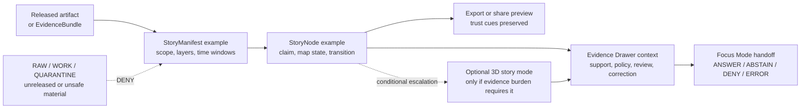

<!-- [KFM_META_BLOCK_V2]
doc_id: kfm://doc/NEEDS-VERIFICATION
title: Examples / Stories
type: standard
version: v1
status: draft
owners: OWNER_TBD
created: 2026-05-02
updated: 2026-05-02
policy_label: NEEDS VERIFICATION: expected public-safe examples only
related: ["PROPOSED: schemas/contracts/v1/story/story_manifest.schema.json", "PROPOSED: schemas/contracts/v1/story/story_node.schema.json", "NEEDS VERIFICATION: docs/architecture/shell/README.md", "NEEDS VERIFICATION: tests/fixtures/README.md"]
tags: [kfm, examples, stories, story-manifest, story-node, evidence-drawer]
notes: [Directory README for examples/stories; target path provided by request; repo implementation depth UNKNOWN in authoring session.]
[/KFM_META_BLOCK_V2] -->

<div id="top"></div>

# Examples / Stories

Example story payloads and walkthroughs that demonstrate KFM story behavior without becoming canonical evidence, schemas, fixtures, or publication authority.

> [!IMPORTANT]
> **Status:** experimental / PROPOSED  
> **Owners:** OWNER_TBD  
> **Path:** `examples/stories/README.md`  
> **Truth posture:** CONFIRMED doctrine / PROPOSED examples path / UNKNOWN repo implementation depth  
> **Badges:**  
> 
> 
> 
> 
> 
>
> **Quick jumps:** [Scope](#scope) · [Repo fit](#repo-fit) · [Accepted inputs](#accepted-inputs) · [Exclusions](#exclusions) · [Directory map](#directory-map) · [Story lifecycle](#story-lifecycle) · [Example standards](#example-standards) · [Quickstart](#quickstart) · [Definition of done](#definition-of-done) · [FAQ](#faq)

## Scope

`examples/stories/` is the home for **reviewable, public-safe story examples** that help maintainers, contributors, and reviewers understand how KFM story objects should preserve geography, time, evidence, policy posture, review state, release state, and correction lineage.

This directory is a **reference surface**, not an authority surface.

| This directory is for | Truth posture |
|---|---|
| Demo `StoryManifest` and `StoryNode` payloads | PROPOSED until repo schemas are verified |
| Narrative walkthroughs that explain how a story remains evidence-bound | PROPOSED |
| Public-safe examples of Evidence Drawer continuity | PROPOSED |
| Examples that illustrate `ANSWER / ABSTAIN / DENY / ERROR` behavior around story claims | PROPOSED |
| Documentation for how to read and review story examples | CONFIRMED as this README’s purpose |

> [!NOTE]
> Current implementation depth is **UNKNOWN**. This README was authored from KFM doctrine and attached project sources. A mounted repository, current `examples/` inventory, tests, workflows, story schemas, emitted artifacts, and runtime behavior were not available in the authoring session.

[Back to top](#top)

## Repo fit

`examples/stories/` sits downstream of doctrine, contracts, schemas, policy, and released evidence. It should make story behavior easier to understand without creating a second source of truth.

| Neighboring surface | Relationship | Status |
|---|---|---|
| `contracts/` | Defines human-readable object meaning and invariants. | NEEDS VERIFICATION |
| `schemas/contracts/v1/story/` | Proposed machine schema home for `StoryManifest` and `StoryNode`. | PROPOSED / NEEDS VERIFICATION |
| `tests/fixtures/` | Owns valid/invalid normative validation examples. | NEEDS VERIFICATION |
| `policy/` | Owns allow / deny / abstain behavior for release, evidence, sensitivity, and export. | NEEDS VERIFICATION |
| `data/manifests/`, `data/receipts/`, `data/proofs/`, `data/catalog/` | Own emitted release, proof, receipt, and catalog instances. | NEEDS VERIFICATION |
| `docs/architecture/shell/` | Owns shell, Evidence Drawer, Focus Mode, and trust-visible interaction doctrine. | NEEDS VERIFICATION |
| Story Editor / Map shell app paths | Consume governed story payloads through released and policy-safe interfaces. | UNKNOWN |

**Placement rule:** a file belongs here only when it teaches or demonstrates story behavior. If it defines authority, validates schema behavior, stores emitted proof, or carries real unpublished evidence, it belongs elsewhere.

[Back to top](#top)

## Evidence boundary

| Claim | Status | Evidence needed to strengthen it |
|---|---|---|
| The target file path is `examples/stories/README.md`. | CONFIRMED by current request | None |
| `examples/` is a reference/pedagogical area rather than a normative fixture area. | CONFIRMED doctrine | Verify current repo convention |
| `StoryManifest` and `StoryNode` are proposed story contract objects. | PROPOSED from KFM UI/governed-AI planning corpus | Inspect mounted schemas and contracts |
| Existing files under `examples/stories/` are unknown. | UNKNOWN | Run directory inventory in mounted repo |
| Owners are not confirmed. | UNKNOWN | Confirm CODEOWNERS or maintainer assignment |
| Validator commands are not confirmed. | UNKNOWN | Inspect package manager, scripts, workflow YAML, and validator tools |

[Back to top](#top)

## Accepted inputs

| Accepted input | What it should include | Required label |
|---|---|---|
| `*.story.md` walkthroughs | Scenario purpose, scope, evidence posture, review notes, expected DENY/ABSTAIN behavior | `PROPOSED` or `ILLUSTRATIVE` |
| `*.example.json` story manifests | Public-safe scope, required layers, time windows, EvidenceRef placeholders or released refs, drawer expectations | `PROPOSED` |
| `*.story-node.example.json` nodes | Camera or map state, active time, layer references, evidence continuity, optional 3D admission notes | `PROPOSED` |
| Review checklists | What a reviewer must confirm before treating an example as reusable | `NEEDS VERIFICATION` when tied to unconfirmed tools |
| Small diagrams | Trust flow, story-node transition, evidence handoff, or 2D → conditional 3D boundary | `PROPOSED` unless backed by implementation proof |

Every example should be safe to open in public, safe to diff in Git, and clear about whether it uses real released evidence or placeholder evidence.

[Back to top](#top)

## Exclusions

| Do not put here | Put it there instead | Why |
|---|---|---|
| Normative schema definitions | `schemas/` or repo-confirmed schema home | Examples must not become machine authority. |
| Human-readable contract definitions | `contracts/` | Object meaning belongs in contract docs. |
| Valid/invalid validator fixtures | `tests/fixtures/` | Fixtures are verification support, not pedagogy. |
| Emitted receipts, proofs, manifests, or catalog objects | `data/receipts/`, `data/proofs/`, `data/manifests/`, `data/catalog/` | Emitted artifacts are evidence-bearing instances. |
| RAW, WORK, or QUARANTINE samples | Governed data lifecycle homes | Public examples must not expose unpublished or unsafe material. |
| Exact sensitive location examples | Restricted data lanes or generalized public-safe examples | KFM fails closed where sensitivity is unresolved. |
| Living-person, DNA, title, cultural, archaeological, ecological, or security-sensitive details | Restricted/steward-reviewed lanes | Story examples must not normalize unsafe publication. |
| Raw model prompts, hidden chain-of-thought, or model-only answers | Governed AI policy / runtime test surfaces | AI output is interpretive, not root truth. |
| Story claims without evidence posture | Nowhere; revise first | KFM cites or abstains. |

> [!CAUTION]
> A story example that looks polished but omits evidence, policy, review, release, or correction state is a bad example. Visual narrative must not outrun trust.

[Back to top](#top)

## Directory map

The tree below is a **PROPOSED starter shape**, not a confirmed repo inventory.

```text
examples/
└── stories/
    ├── README.md
    ├── manifests/
    │   ├── README.md                                  # PROPOSED
    │   └── public-safe-story-manifest.example.json     # PROPOSED
    ├── nodes/
    │   ├── README.md                                  # PROPOSED
    │   └── terrain-transition.story-node.example.json  # PROPOSED
    ├── walkthroughs/
    │   └── evidence-bound-story.story.md              # PROPOSED
    └── _review/
        └── EXAMPLE_REVIEW_CHECKLIST.md                # PROPOSED
```

> [!NOTE]
> Add child folders only when the repo actually needs them. A small, honest examples directory is better than a busy subtree that implies unverified maturity.

[Back to top](#top)

## Story lifecycle

A KFM story is not a detached article. It is a guided, map-aware, time-aware, evidence-bearing narrative surface downstream of released artifacts and governed interfaces.



**Interpretation rule:** the story may guide attention, but evidence support comes from resolved EvidenceBundles, release state, review state, source roles, and policy decisions.

[Back to top](#top)

## Example standards

### Required front matter for Markdown walkthroughs

Use this shape for `.story.md` walkthroughs. It is illustrative, not a normative schema.

```yaml
---
example_id: "story-example-NEEDS-VERIFICATION"
example_status: "illustrative"
truth_label: "PROPOSED"
uses_real_evidence: false
evidence_refs:
  - "kfm://evidence/NEEDS-VERIFICATION"
scope:
  place: "Kansas or generalized area"
  time_basis: "NEEDS VERIFICATION"
  audience: "public-safe demo"
policy:
  label: "public-safe-example"
  sensitive_location_handling: "none | generalized | redacted | NEEDS VERIFICATION"
review:
  review_state: "draft"
  reviewer: "OWNER_TBD"
release:
  release_state: "not-published"
  release_ref: "kfm://release/NEEDS-VERIFICATION"
correction:
  correction_ref: "kfm://correction/NEEDS-VERIFICATION"
notes:
  - "Illustrative example only. Do not treat as evidence or fixture authority."
---
```

### Required fields for JSON examples

A JSON example should be small, readable, and explicit about its limits.

```json
{
  "example_status": "illustrative",
  "truth_label": "PROPOSED",
  "story_manifest_id": "kfm://story-manifest/NEEDS-VERIFICATION",
  "scope": {
    "place": "Kansas | generalized",
    "time_window": "NEEDS VERIFICATION",
    "audience": "public-safe demo"
  },
  "nodes": [
    {
      "story_node_id": "kfm://story-node/NEEDS-VERIFICATION",
      "title": "Illustrative evidence-bound story node",
      "claim_text": "NEEDS VERIFICATION: replace with a released, cited claim or remove.",
      "evidence_refs": ["kfm://evidence/NEEDS-VERIFICATION"],
      "drawer_required": true,
      "on_missing_evidence": "ABSTAIN"
    }
  ],
  "policy": {
    "public_release_allowed": false,
    "reason": "Example only; no release evidence verified."
  }
}
```

### Naming rules

| File kind | Naming pattern | Notes |
|---|---|---|
| Story manifest example | `kebab-case-name.story-manifest.example.json` | Include `.example.` unless the file is promoted elsewhere. |
| Story node example | `kebab-case-name.story-node.example.json` | Keep one node per file when review clarity matters. |
| Walkthrough | `kebab-case-name.story.md` | Must include front matter. |
| Review checklist | `EXAMPLE_REVIEW_CHECKLIST.md` | Reviewable, not decorative. |
| README | `README.md` | Keep this file as the directory contract. |

[Back to top](#top)

## Story guardrails

| Guardrail | Required behavior |
|---|---|
| Cite or abstain | If an example contains a consequential claim, it must carry released EvidenceRefs or clearly abstain. |
| Public-safe by default | Examples should be safe to display publicly unless marked restricted and excluded from public rendering. |
| No direct canonical access | Story examples should demonstrate governed APIs and released artifacts, not direct internal stores. |
| Evidence Drawer parity | Any story claim, layer, Focus handoff, export, or 3D transition must preserve drawer context. |
| 2D first, 3D conditional | A 3D story node is valid only when it answers a burden-bearing question and preserves the same trust model. |
| Derived is not truth | Tiles, scenes, screenshots, summaries, embeddings, and generated language are downstream delivery surfaces. |
| Correction visible | Corrected, withdrawn, stale, or superseded examples must show the correction or rollback path. |

[Back to top](#top)

## Quickstart

Run these only after the real repository is mounted. They are safe inspection commands, not proof that the repo already has these files.

```bash
# Inspect this examples surface.
find examples/stories -maxdepth 4 -type f 2>/dev/null | sort

# Inspect nearby examples and fixtures so this README stays repo-native.
find examples tests/fixtures -maxdepth 4 -type f 2>/dev/null | sort | grep -E 'story|node|manifest|drawer|focus|evidence' || true

# Inspect proposed story contract/schema homes.
find contracts schemas -maxdepth 5 -type f 2>/dev/null | sort | grep -E 'story|node|manifest|drawer|focus|runtime|evidence' || true
```

> [!WARNING]
> Do not add validator commands, package-manager scripts, CI workflow names, or app route names here until the mounted repo proves them.

### PROPOSED validation sequence

```text
1. Confirm target path and adjacent examples convention.
2. Confirm owner and review route.
3. Confirm whether StoryManifest and StoryNode schemas already exist.
4. Confirm whether examples are validated directly or only used as reference material.
5. Confirm no file in this directory contains raw, restricted, unpublished, or sensitive source material.
6. Confirm every consequential example claim either resolves to released evidence or visibly ABSTAINS.
```

[Back to top](#top)

## Review checklist

Before adding or changing a story example:

- [ ] Confirm the example is pedagogical/reference material, not a fixture or schema.
- [ ] Confirm the example does not contain RAW, WORK, QUARANTINE, or unpublished candidate material.
- [ ] Confirm exact sensitive locations are absent, generalized, or explicitly denied.
- [ ] Confirm real EvidenceRefs, if used, are released and policy-safe.
- [ ] Confirm placeholder EvidenceRefs are clearly labeled `NEEDS VERIFICATION`.
- [ ] Confirm every story claim has source role, time scope, spatial scope, and review posture.
- [ ] Confirm missing evidence produces `ABSTAIN`, not invented narrative.
- [ ] Confirm policy-blocked material produces `DENY`, not silent omission.
- [ ] Confirm optional 3D story examples preserve Evidence Drawer parity.
- [ ] Confirm relative links are valid from `examples/stories/` or marked `NEEDS VERIFICATION`.

[Back to top](#top)

## Definition of done

This README is done enough for initial commit when:

- [ ] The mounted repo confirms `examples/stories/` exists or the PR creates it intentionally.
- [ ] `OWNER_TBD` is replaced with a real owner or a documented fallback owner.
- [ ] Related links are verified against the repo tree.
- [ ] The examples-vs-fixtures boundary is reviewed by maintainers.
- [ ] At least one public-safe example exists or the directory intentionally remains README-only.
- [ ] The example metadata format is either linked to a real schema or clearly retained as illustrative.
- [ ] No example implies a real publication, release, workflow, validator, route, or runtime path without proof.
- [ ] The rollback path is clear: remove examples, keep this README, and revert any links that pointed to removed files.

Rollback target: `ROLLBACK_TARGET_TBD_AFTER_REPO_INSPECTION`

[Back to top](#top)

## Related surfaces

| Surface | Expected role | Status |
|---|---|---|
| `../README.md` | Parent examples landing page | NEEDS VERIFICATION |
| `../../tests/fixtures/README.md` | Fixture boundary and validation examples | NEEDS VERIFICATION |
| `../../contracts/OBJECT_MAP.md` | Object-family map | NEEDS VERIFICATION |
| `../../schemas/contracts/v1/story/story_manifest.schema.json` | Proposed `StoryManifest` schema | PROPOSED |
| `../../schemas/contracts/v1/story/story_node.schema.json` | Proposed `StoryNode` schema | PROPOSED |
| `../../docs/architecture/shell/README.md` | Shell and Evidence Drawer doctrine | NEEDS VERIFICATION |
| `../../docs/runbooks/CORRECTION_AND_ROLLBACK.md` | Correction and rollback procedure | NEEDS VERIFICATION |
| `../../policy/evidence/README.md` | Evidence admissibility policy | NEEDS VERIFICATION |
| `../../policy/ui/README.md` | UI-visible policy behavior | NEEDS VERIFICATION |

[Back to top](#top)

## FAQ

### Does a story example make a claim true?

No. A story example can show how a claim should be carried, scoped, cited, denied, or abstained. Truth support comes from resolved EvidenceBundles, release state, source role, policy posture, review state, and correction lineage.

### Can examples use real evidence?

Yes, but only when the evidence is released, policy-safe, rights-clear, and appropriate for public demonstration. Otherwise use clearly labeled placeholders.

### Are examples the same as fixtures?

No. Fixtures are validation exemplars and belong under `tests/fixtures/` or the repo-confirmed fixture home. This directory teaches story behavior.

### Can story examples include Focus Mode output?

Yes, when the output is framed as a governed response envelope with citations or a visible negative outcome. Raw model text does not belong here.

### Can a story example include 3D?

Only as a conditional story mode. The 3D transition must preserve the same Evidence Drawer, policy, release, and correction model as the 2D story flow.

### What should happen when evidence is missing?

Use `ABSTAIN`. Do not fill gaps with generated language, map properties, or plausible narrative.

[Back to top](#top)

## Appendix: story vocabulary

| Term | Working meaning in this directory |
|---|---|
| `StoryManifest` | PROPOSED story-level object describing sequence, scope, required layers, time windows, drawer refs, and optional 3D constraints. |
| `StoryNode` | PROPOSED node-level object describing a story step, map/camera/time state, evidence continuity, and transition behavior. |
| Evidence Drawer | Mandatory trust surface for inspecting evidence, freshness, rights/sensitivity, review state, and correction lineage. |
| Focus Mode | Evidence-bounded synthesis surface with finite outcomes; not a detached chatbot. |
| EvidenceRef | Stable pointer to evidence that must resolve before a consequential claim is treated as supported. |
| EvidenceBundle | Governed support package for a claim or story context. |
| ReleaseManifest | Release-scoped object that defines what outward artifacts exist and what they depend on. |
| CorrectionNotice | Public or steward-visible record of correction, withdrawal, supersession, or rollback. |
