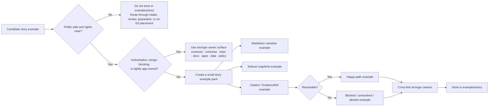

# story

Public-safe, non-authoritative Story Node examples, sidecars, and citation-behavior illustrations for Kansas Frontier Matrix.

> **Status:** Experimental  
> **Owners:** NEEDS VERIFICATION  
>        
> **Quick jumps:** [Scope](#scope) · [Repo fit](#repo-fit) · [Accepted inputs](#accepted-inputs) · [Exclusions](#exclusions) · [Directory tree](#directory-tree) · [Quickstart](#quickstart) · [Usage](#usage) · [Diagram](#diagram) · [Tables](#tables) · [Task list](#task-list--definition-of-done) · [FAQ](#faq) · [Appendix](#appendix)  
> **Repo fit:** `examples/story/README.md` · upstream [../README.md](../README.md) · [../../README.md](../../README.md) · stronger owners [../../contracts/](../../contracts/) · [../../schemas/](../../schemas/) · [../../tests/](../../tests/) · [../../docs/](../../docs/) · [../../apps/](../../apps/) · [../../data/](../../data/) · [../../policy/](../../policy/)  
> [!IMPORTANT]
> This README is **repo-aware** and **evidence-bounded**.
>
> Read status words here as:
> - **CONFIRMED** — directly supported by visible repo state or stable KFM doctrine
> - **INFERRED** — strongly suggested by repo/doctrine alignment, but not re-run here
> - **PROPOSED** — recommended next shape
> - **UNKNOWN** — not established strongly enough from current evidence
> - **NEEDS VERIFICATION** — placeholder or branch-local detail to check before merge
>
> Current visible evidence supports the existence of this directory and its README scaffold. Additional story-example assets, exact owners, mounted routes, and active schema/test filenames remain **NEEDS VERIFICATION** until the active branch is inspected directly.

---

## Scope

`examples/story/` is KFM’s **story-example lane**.

Its job is to help contributors, reviewers, and maintainers understand how story-shaped KFM artifacts are supposed to look without confusing example material with:

- published Story Nodes
- authoritative schema or contract truth
- merge-blocking fixtures
- production API behavior
- release evidence
- rights-unclear or sensitive source material

A good file here should make **story structure**, **citation behavior**, **map-state context**, and **evidence drill-through expectations** easier to understand in one review pass.

A bad file here quietly becomes a shadow authority.

[Back to top](#story)

## Repo fit

`examples/story/README.md` is the directory README for the story-focused example lane inside `examples/`.

| Field | Value |
| --- | --- |
| Path | `examples/story/README.md` |
| Branch posture | `main`-aligned README pattern; exact branch-local contents still require direct inspection |
| Visibility target | public-safe |
| Current verified contents | this README only |
| Role | cross-surface story example lane for markdown narratives, sidecars, citation packs, and trust-visible publishing illustrations |
| Upstream anchors | [../README.md](../README.md) · [../../README.md](../../README.md) |
| Stronger owner surfaces | [../../contracts/](../../contracts/) · [../../schemas/](../../schemas/) · [../../tests/](../../tests/) · [../../docs/](../../docs/) · [../../apps/](../../apps/) · [../../data/](../../data/) · [../../policy/](../../policy/) |

### Why this lane exists

KFM’s design doctrine does **not** treat stories as detached essays. Story-shaped outputs sit inside the same governed shell as Explorer, Timeline, Evidence Drawer, and Focus Mode. That means story examples should demonstrate:

- markdown narrative structure
- map and timeline context
- citation and EvidenceRef behavior
- publication and review-state expectations
- clean drill-through to evidence

This lane exists so those behaviors can be shown **illustratively** before or alongside stronger owner surfaces.

[Back to top](#story)

## Accepted inputs

Content that belongs here includes:

- tiny, public-safe Story Node markdown examples
- sidecars that illustrate **map state**, **time scope**, or **citation bundles**
- happy-path and blocked-path story publish examples
- redacted example payloads for story reader, story editor, Evidence Drawer, or Focus handoff
- story-specific screenshots or assets that are public-safe and clearly labeled as illustrative
- onboarding examples that explain how a story should connect to evidence, not replace it
- temporary cross-surface story examples that do not yet have a stronger owner surface and are easy to relocate later

A useful heuristic:

- **illustrative**
- **small**
- **redacted or public-safe**
- **cross-linked back to stronger owners**
- **easy to delete or move later**

> [!TIP]
> Prefer **paired** story examples for behavior-heavy changes:
> - one publishable / happy-path example
> - one blocked, abstaining, or unresolved-citation example

[Back to top](#story)

## Exclusions

The following do **not** belong here:

| Do not store here | Why | Put it instead in… |
| --- | --- | --- |
| published or release-bearing Story Nodes | examples must not become publication truth | governed story, docs, data, or runtime owner surfaces |
| authoritative story schemas or stable outward contracts | these are authority-bearing, not illustrative | `../../schemas/` or `../../contracts/` |
| merge-blocking citation fixtures | executable proof belongs with the harness that enforces it | `../../tests/`, `../../schemas/`, or `../../contracts/` |
| review receipts, promotion decisions, correction notices, or proof packs | these are operational trust objects | governed data, runtime, review, or runbook owners |
| rights-unclear archival media or precise sensitive coordinates | KFM should fail closed under ambiguity | intake, review, quarantine, redaction, or no-Git placement |
| screenshot-only “truth” with no evidence route | story must not inherit authority from presentation state alone | docs or review drafts until evidence is attached |
| app-owned route payloads tightly coupled to implementation | runtime truth should stay near the emitting surface | `../../apps/` |
| large binaries or convenience dumps | high maintenance cost, weak review value | owner-specific artifact/storage surface |

> [!WARNING]
> If a file is needed to make CI fail, a policy decision execute, a citation resolve, or a release pass, it probably has a stronger owner than `examples/story/`.

[Back to top](#story)

## Directory tree

### Current verified shape

```text
examples/
├── README.md
└── story/
    └── README.md
```

The story lane is intentionally minimal right now.

### PROPOSED growth shape

```text
examples/story/
├── README.md
├── story-citation-happy-path.md
├── story-citation-unresolved.md
├── story-sidecar-example.json
├── story-review-state-example.json
└── assets/
    └── redacted/
```

### Working rule

Grow this directory only when example material is:

1. clearly story-shaped,
2. clearly non-authoritative, and
3. not better owned by a stronger surface.

[Back to top](#story)

## Quickstart

Inspect the lane first. Do not assume more than the branch proves.

```bash
# Inspect the story example lane
ls -la examples/story
find examples/story -maxdepth 3 -type f | sort
```

Inspect stronger owner surfaces before adding story-shaped material:

```bash
# Check likely stronger owners first
find contracts schemas policy tests docs data apps -maxdepth 3 -type f \
  | grep -Ei 'story|citation|evidence|focus|drawer|dossier|review' \
  | sed -n '1,200p'
```

Use a verification-first local flow before documenting behavior as fact:

```bash
# Illustrative only — run only if analogous targets exist in your checkout
make validate-schemas
make test
```

Before adding a new artifact, answer these questions:

1. Is it public-safe and rights-clear?
2. Is it obviously illustrative rather than authoritative?
3. Does it belong more naturally in `contracts/`, `schemas/`, `policy/`, `tests/`, `docs/`, `data/`, or `apps/`?
4. If it demonstrates publishing or citation behavior, where is the owner surface that proves it?
5. Can it be moved or deleted later without breaking the repo’s source of truth?

[Back to top](#story)

## Usage

### 1. Start from the stronger owner

A story example should never become the only place where story rules are described.

Check the likely owner first:

- use `../../schemas/` for schema truth
- use `../../contracts/` for outward payload truth
- use `../../tests/` for executable positive and negative cases
- use `../../docs/` for long-form explanation and runbooks
- use `../../apps/` for runtime-owned editor/reader behavior
- use `../../data/` for governed manifests, bundles, and release-linked objects
- use `../../policy/` for reason/obligation logic and policy tests

Put something in `examples/story/` only when its value is **instructional**, **cross-surface**, and **public-safe**.

### 2. Keep story examples paired

If an example is meant to explain governed behavior, pair it:

- `story-citation-happy-path.md`
- `story-citation-unresolved.md`

If an example is meant to explain state, pair it:

- a small narrative markdown file
- a sidecar showing map/time/citation context

That keeps the lane aligned with KFM’s fail-closed posture instead of documenting only the polished path.

### 3. Preserve the route back to evidence

A strong story example should make it obvious how a reviewer would move from:

**story text → citation/EvidenceRef → evidence surface → release context**

Do not store examples that make trust cues disappear.

### 4. Prefer “small but complete” over “large but vague”

A good example here should be:

- small enough to inspect in one diff
- explicit about what it proves
- explicit about what it does **not** prove
- safe to share publicly
- easy to replace as stronger owner surfaces mature

### 5. Move examples out when they harden

Move material out of `examples/story/` once it becomes:

- merge-blocking
- schema-governing
- contract-defining
- release-bearing
- tightly owned by one app or one contract family
- the only place where story behavior is described

[Back to top](#story)

## Diagram



[Back to top](#story)

## Tables

### Placement matrix

| Artifact class | Keep in `examples/story/`? | Stronger owner when authoritative | Why |
| --- | --- | --- | --- |
| Tiny redacted story markdown | Yes | `../../docs/`, `../../contracts/`, or app/runtime owner | Great for review and onboarding; weak as source of truth |
| Story sidecar capturing map/time/citation state | Yes, if public-safe | `../../contracts/`, `../../apps/`, or `../../tests/` | Useful for explanation; risky if treated as live payload truth |
| Citation happy-path example | Yes | `../../tests/` or `../../contracts/` | Helpful for understanding publishable flow |
| Unresolved-citation negative example | Yes | `../../tests/` | Best when paired with executable validation elsewhere |
| Story schema fixture | Sometimes | `../../schemas/` or `../../tests/` | Canonical validation ownership should stay near schema/harness |
| Story review-state example | Sometimes | `../../contracts/`, `../../docs/`, or review owner surface | Good for explanation; weak home for live review logic |
| Evidence Drawer example launched from a story | Yes, if illustrative | `../../apps/`, `../../contracts/`, or `../../docs/` | Makes trust flow visible |
| Published story release object | No | governed publication owner surface | Release-bearing objects are not examples |
| Rights-unclear media or precise sensitive locations | No | nowhere in Git until resolved | Violates KFM trust posture |
| 3D story concept asset | Sometimes, concept-only | 3D/runtime/docs owner once real | Fine as a concept; dangerous as parallel truth surface |

### Story example pack rubric

| Review question | Expected answer in this directory |
| --- | --- |
| Does it prove a complete idea quickly? | yes — one review pass, one diff, one story-shaped concept |
| Is the authority clear? | yes — illustrative, sample, redacted, or demo |
| Is evidence drill-through visible? | yes — links, refs, or clearly paired placeholders |
| Is blocked behavior represented? | yes, when citation/policy/error behavior matters |
| Can a stronger owner be named? | yes — even if the file remains here temporarily |
| Is deletion safe? | yes — examples should be easy to move out later |

[Back to top](#story)

## Task list / Definition of done

A contribution to `examples/story/` is ready when all relevant checks below are true:

- [ ] It is public-safe, rights-clear, and small enough to review quickly.
- [ ] It is labeled as `example`, `demo`, `illustrative`, `sample`, or `redacted`.
- [ ] It does not pretend to be published story truth, a release object, or a canonical schema.
- [ ] The stronger owner surface was checked first.
- [ ] Markdown, sidecar, and citation examples agree with each other when paired.
- [ ] If it demonstrates behavior, the related schema, contract, test, policy, or runbook is linked.
- [ ] If a negative case matters, a blocked or constrained example exists somewhere reviewable.
- [ ] Sensitive places, coordinates, or rights-unclear media are omitted, generalized, or excluded.
- [ ] It does not imply that screenshots, UI state, or prose alone are evidence.
- [ ] Deletion or relocation will be easy once the stronger owner surface becomes clearer.

[Back to top](#story)

## FAQ

### Why can this directory stay almost empty?

Because the lane still has value even when it contains only its README. A good directory README tells contributors where story-shaped examples belong and where they do **not** belong.

### Why not store real published stories here?

Because KFM separates examples from publication truth. Published stories, release state, and correction chains belong with governed owners, not a convenience lane.

### Where should authoritative story schemas and validation live?

Usually in `../../schemas/`, `../../contracts/`, and `../../tests/`, depending on whether the truth is schema-owned, outward-payload-owned, or executable-harness-owned.

### Can screenshots or small assets live here?

Yes — when they are public-safe, small, clearly labeled, and not the only place where important behavior is described.

### Why mention the Evidence Drawer in a story examples README?

Because KFM’s story doctrine is not “write prose and hope for trust.” Story, Explorer, Focus, and Evidence Drawer are part of one governed evidence flow. Story examples that hide that relationship teach the wrong thing.

### When should a file move out of `examples/story/`?

Move it once it becomes authoritative, merge-blocking, release-bearing, tightly runtime-owned, or the only place where an important story rule is documented.

[Back to top](#story)

## Appendix

### PROPOSED sidecar fields for story example packs

Use a sidecar only when the example needs more context than a filename can carry.

```yaml
example_id: NEEDS-VERIFICATION
title: Story example title
purpose: Short sentence explaining what this demonstrates
authority_status: illustrative
content_kind: story_markdown | story_sidecar | review_state | asset
owner_surface: ../../docs/ | ../../contracts/ | ../../schemas/ | ../../tests/ | ../../apps/ | ../../data/ | ../../policy/
redaction_status: public_safe
citation_mode: resolvable | intentionally_broken | omitted_for_demo
map_state_ref: ./story-sidecar-example.json
validation_links:
  - ../../contracts/
  - ../../schemas/
  - ../../tests/
notes:
  - Replace placeholders before standardizing filenames
  - Keep narrative claims paired with evidence links
  - Re-check branch-local path assumptions before merge
```

A sidecar should reduce ambiguity, not add ceremony.

### PROPOSED naming guidance

Prefer names that tell a reviewer what the file is doing:

- `story-citation-happy-path.md`
- `story-citation-unresolved.md`
- `story-sidecar-redacted.json`
- `story-review-state-example.json`
- `story-focus-abstain-example.md`

Avoid names that imply authority or production state:

- `final-story.md`
- `real_story.md`
- `release-ready-story.json`
- `production-sidecar.json`
- `official-citations.md`

### Story-specific working rule

If a story example helps someone understand **structure**, **evidence route**, or **trust-visible behavior**, it may belong here.

If it starts defining the real contract, the real publication path, or the real release chain, move it to its stronger owner.

[Back to top](#story)
