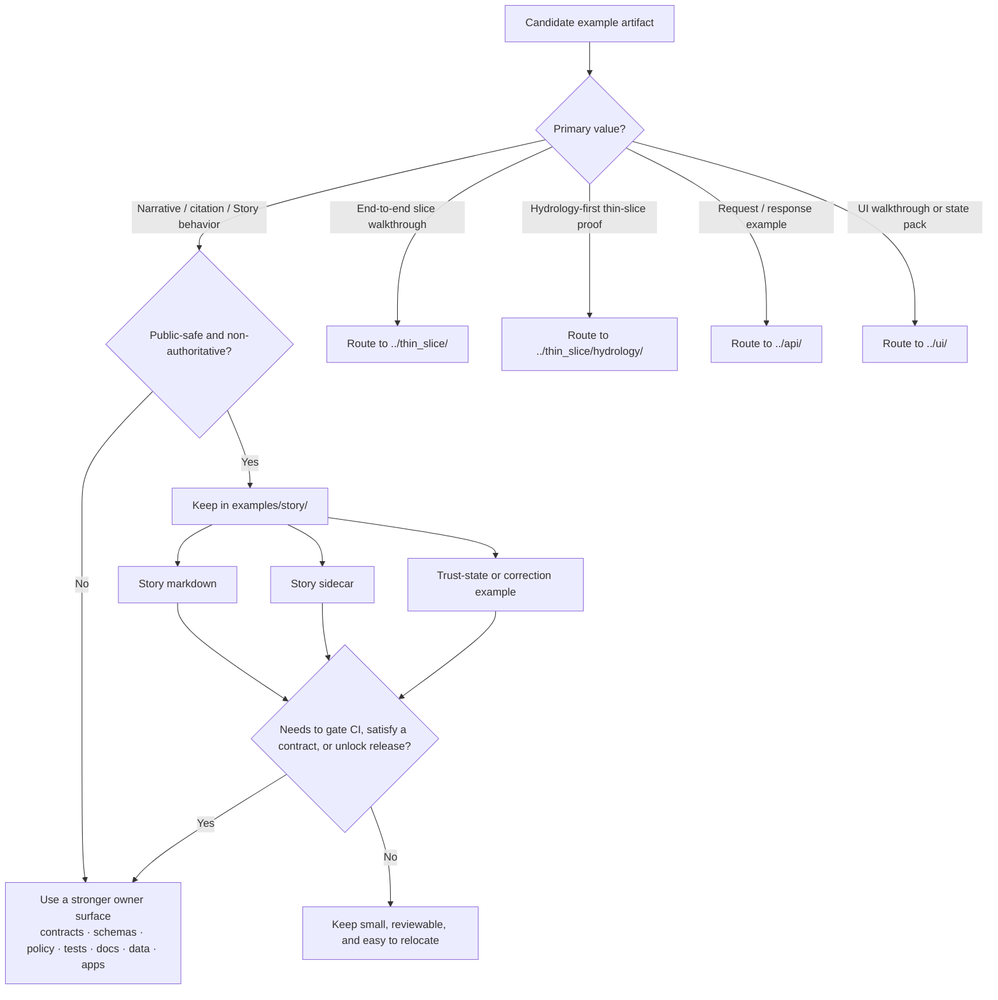

<!-- [KFM_META_BLOCK_V2]
doc_id: kfm://doc/NEEDS-VERIFICATION
title: story
type: standard
version: v1
status: draft
owners: @bartytime4life
created: NEEDS-VERIFICATION
updated: NEEDS-VERIFICATION
policy_label: NEEDS-VERIFICATION
related: [../README.md, ../api/README.md, ../thin_slice/README.md, ../thin_slice/hydrology/README.md, ../ui/README.md, ../../README.md, ../../CONTRIBUTING.md, ../../.github/README.md]
tags: [kfm, examples, story]
notes: [Current public main confirms examples/story/README.md exists as a README-only lane; doc UUID, created/updated dates, and final policy label still need verification.]
[/KFM_META_BLOCK_V2] -->

# story

Public-safe, non-authoritative Story Node examples, sidecars, and citation-behavior illustrations for Kansas Frontier Matrix.

> **Status:** Experimental  
> **Owners:** `@bartytime4life`  
>        
> **Quick jumps:** [Scope](#scope) · [Repo fit](#repo-fit) · [Accepted inputs](#accepted-inputs) · [Exclusions](#exclusions) · [Directory tree](#directory-tree) · [Quickstart](#quickstart) · [Usage](#usage) · [Diagram](#diagram) · [Tables](#tables) · [Task list / definition of done](#task-list--definition-of-done) · [FAQ](#faq) · [Appendix](#appendix)  
> **Repo fit:** `examples/story/README.md` · parent [`../README.md`](../README.md) · repo doctrine [`../../README.md`](../../README.md), [`../../CONTRIBUTING.md`](../../CONTRIBUTING.md), [`../../.github/README.md`](../../.github/README.md) · sibling lanes [`../api/README.md`](../api/README.md), [`../thin_slice/README.md`](../thin_slice/README.md), [`../ui/README.md`](../ui/README.md) · current thin-slice neighbor [`../thin_slice/hydrology/README.md`](../thin_slice/hydrology/README.md)

> [!IMPORTANT]
> This README is public-tree-grounded.
>
> Current public `main` confirms that `examples/story/` exists and currently contains only this `README.md`.
> Treat additional filenames below as **PROPOSED** until the working branch proves them.

> [!NOTE]
> `examples/story/` is for narrative and citation-behavior examples.
> [`../thin_slice/`](../thin_slice/README.md) and [`../thin_slice/hydrology/`](../thin_slice/hydrology/README.md) are the current public lanes for end-to-end slice walkthroughs, so do not let `story/` absorb thin-slice duties.

## Scope

`examples/story/` is KFM’s nested example lane for Story Node and narrative-behavior examples.

Use it to show what story-shaped material should look like inside a governed, map-first, time-aware product without turning this directory into publication truth, fixture truth, or runtime truth.

This lane is best for:

- public-safe story markdown
- citation and Evidence Drawer handoff examples
- sidecars that make place, time, and trust state visible
- paired happy-path and fail-closed narrative examples
- reviewer-oriented examples of correction, generalization, or stale-visible story behavior

A weak story example teaches style without trust.  
A strong story example keeps the route from claim to evidence obvious.

[Back to top](#story)

## Repo fit

### What this directory is

A compact, repo-local lane for narrative examples that sits between the parent `examples/` surface and stronger owner surfaces such as contracts, schemas, policy, tests, docs, data, and apps.

### What this directory is not

Not a replacement for:

- machine-enforced contracts in [`../../contracts/README.md`](../../contracts/README.md)
- schema-owned valid/invalid examples in [`../../schemas/README.md`](../../schemas/README.md)
- merge-blocking fixtures in [`../../tests/README.md`](../../tests/README.md)
- policy bundles or decision grammar in [`../../policy/README.md`](../../policy/README.md)
- release-bearing narrative docs in [`../../docs/README.md`](../../docs/README.md) or governed data lanes
- runtime-owned story payloads emitted by apps or governed APIs

### Repo-fit table

| Field | Value |
| --- | --- |
| Path | `examples/story/README.md` |
| Parent lane | [`../README.md`](../README.md) |
| Sibling example lanes | [`../api/README.md`](../api/README.md) · [`../thin_slice/README.md`](../thin_slice/README.md) · [`../ui/README.md`](../ui/README.md) |
| Current thin-slice neighbor | [`../thin_slice/hydrology/README.md`](../thin_slice/hydrology/README.md) |
| Current visible contents | `README.md` only |
| Owner coverage | `@bartytime4life` via repo-wide fallback in [`../../.github/CODEOWNERS`](../../.github/CODEOWNERS) |
| Root anchors | [`../../README.md`](../../README.md) · [`../../CONTRIBUTING.md`](../../CONTRIBUTING.md) · [`../../.github/README.md`](../../.github/README.md) |
| Stronger owner surfaces | [`../../contracts/README.md`](../../contracts/README.md) · [`../../schemas/README.md`](../../schemas/README.md) · [`../../policy/README.md`](../../policy/README.md) · [`../../tests/README.md`](../../tests/README.md) · [`../../docs/README.md`](../../docs/README.md) · [`../../data/README.md`](../../data/README.md) · [`../../apps/`](../../apps/) |

### Working interpretation

This lane inherits the parent `examples/` rule: examples explain, illustrate, and de-risk; they do not silently replace canonical, policy-bearing, or release-bearing surfaces.

For story-specific work, that means:

- every consequential claim must still resolve through evidence
- review state must be visible
- narrative updates should model versioned correction, not silent rewrite
- polished prose must not hide missing citations, missing scope, or missing rights cues

[Back to top](#story)

## Accepted inputs

The following material belongs here when it is small, public-safe, and explicitly instructional:

- Story Node example markdown
- sidecars that carry place, time, evidence-route, or trust-state context
- citation happy-path and citation-failure examples
- redacted review-state or correction-state sketches
- screenshots or diagrams that explain story-to-evidence flow without becoming the only evidence
- mock or miniature payloads that help reviewers understand Story + Evidence Drawer + Focus handoff

### Good fit heuristic

A good artifact here is:

- **story-shaped**
- **clearly illustrative**
- **public-safe**
- **easy to review in Git**
- **easy to relocate once a stronger owner exists**

> [!TIP]
> If the artifact’s primary value is end-to-end slice proof rather than narrative behavior, route it to [`../thin_slice/`](../thin_slice/README.md) instead.

[Back to top](#story)

## Exclusions

The following do **not** belong here:

| Do not place here | Why | Put it instead in… |
| --- | --- | --- |
| Published or release-bearing Story Nodes | example space must not become publication truth | governed publication owner surface |
| Canonical schemas, route contracts, or policy registries | these carry authority, not illustration | `../../contracts/` · `../../schemas/` · `../../policy/` |
| Merge-blocking fixtures or negative-path test packs | executable proof belongs with the harness that enforces it | `../../tests/` |
| Review receipts, release proof packs, or correction notices | these are operational trust artifacts | review / release / correction owner surfaces |
| Runtime-owned story payloads tied to implementation | example drift must not become API drift | `../../apps/` or governed API owner surfaces |
| Sensitive coordinates, rights-unclear media, or exact-location story props | KFM fails closed on unresolved rights or precision risk | stewarded review / quarantine / generalized release lanes |
| Screenshot-only “truth” with no evidence route | presentation must stay downstream of provenance | `../../docs/` drafts until evidence linkage exists |
| Files that must make CI fail, satisfy a contract, or unlock promotion | that is stronger-than-example responsibility | contracts / schemas / policy / tests / data |

> [!WARNING]
> If a file needs to participate in policy evaluation, evidence resolution, runtime guarantees, or release gates, it almost certainly has a stronger owner than `story`.

[Back to top](#story)

## Directory tree

### Current verified shape

```text
examples/
└── story/
    └── README.md
```

Current public `main` shows no visible nested folders, no `.sample.*` or `.redacted.*` assets, and no companion example packs under this lane yet.

### PROPOSED example pack if the lane grows

```text
examples/story/
├── README.md
├── story-citation-happy-path.md
├── story-citation-unresolved.md
├── story-sidecar-redacted.json
├── story-review-state-example.json
└── assets/
    └── redacted/
```

### Working rule

Grow this lane only when the artifact is:

1. clearly story-shaped
2. clearly non-authoritative
3. clearly public-safe
4. not better owned by a stronger surface

[Back to top](#story)

## Quickstart

Start with local inspection rather than assumption.

```bash
# Verify the example surfaces present in the checkout
git ls-files 'examples/**' | sort
```

```bash
# Re-read the adjacent routing docs before adding a story example
sed -n '1,220p' examples/README.md
sed -n '1,260p' examples/story/README.md
sed -n '1,260p' examples/thin_slice/README.md
sed -n '1,260p' examples/thin_slice/hydrology/README.md
```

```bash
# Check stronger owner surfaces for story/evidence/focus/citation material first
git ls-files 'contracts/**' 'schemas/**' 'policy/**' 'tests/**' 'docs/**' 'data/**' 'apps/**' \
  | grep -Ei 'story|focus|evidence|bundle|citation|receipt|review|manifest|correction'
```

```text
Use branch-verified validation commands only.
Do not invent a story-specific validator if the checkout does not expose one.
```

Before adding a file, answer these questions:

1. Is it public-safe and rights-clear?
2. Is it obviously illustrative rather than authoritative?
3. Would `api/`, `thin_slice/`, `thin_slice/hydrology/`, or `ui/` be a better fit?
4. Does every consequential claim still have a visible route back to evidence?
5. If the example models failure, does it show a valid trust-visible outcome instead of a bluff?

[Back to top](#story)

## Usage

### 1. Choose the right example lane first

Use the current public example lanes deliberately:

| Lane | Best use | Not for |
| --- | --- | --- |
| `story/` | narrative examples, sidecars, citation behavior, correction/generalization storytelling | end-to-end slice proof, contract truth, merge gates |
| [`../thin_slice/`](../thin_slice/README.md) | small end-to-end walkthroughs | narrative-only story examples |
| [`../thin_slice/hydrology/`](../thin_slice/hydrology/README.md) | hydrology-first proof and walkthrough examples | generic story examples |
| [`../api/`](../api/README.md) | governed request/response examples | story prose or UI walkthroughs |
| [`../ui/`](../ui/README.md) | UI example packs and walkthrough assets | contract or release truth |

If none of these lanes is right, the artifact may belong with a stronger owner instead of `examples/`.

### 2. Keep the claim → evidence route visible

A story example should make the trust path legible:

```text
story text → citation / EvidenceRef → evidence resolution / EvidenceBundle → release scope → correction or review context
```

If a reader cannot tell where a claim came from, the example is teaching the wrong behavior.

### 3. Keep place, time, and review state explicit

A strong story example shows, directly or via sidecar:

- the place it speaks about
- the time window it speaks for
- whether the content is observed, modeled, generalized, partial, stale-visible, withdrawn, or corrected
- whether review or publication state affects what can be shown

This lane should model visible review state, not silent narrative rewriting.

### 4. Show negative outcomes, not just polished success

KFM’s valid outward states are not limited to success. Story examples are stronger when they also demonstrate one or more of:

- citation failure
- abstention
- denial
- error
- generalization
- stale-visible disclosure
- correction / replacement

A story lane that only shows polished happy paths encourages uncited helpfulness and weak correction discipline.

### 5. Move examples out when they harden

Relocate material out of `story` when it becomes:

- authoritative
- release-bearing
- merge-blocking
- tightly runtime-owned
- the only place an important rule exists
- too sensitive for a public-safe lane

[Back to top](#story)

## Diagram



[Back to top](#story)

## Tables

### Story placement matrix

| Artifact class | Keep in `story`? | Stronger owner when authoritative | Why |
| --- | --- | --- | --- |
| Tiny redacted story markdown | Yes | docs / contracts / app owner | good for review and onboarding |
| Story sidecar with place/time/citation context | Yes, if public-safe | contracts / apps / tests | useful for explanation, risky as live payload truth |
| Citation happy-path example | Yes | tests / contracts | teaches supported narrative flow |
| Citation-failure or abstention example | Yes | tests / policy | teaches fail-closed behavior |
| Review-state or correction-state sketch | Sometimes | docs / contracts / review owner | explanation aid, not operational truth |
| Evidence Drawer handoff example | Yes, if illustrative | apps / contracts / docs | keeps provenance route visible |
| Published story release object | No | publication owner surface | release-bearing objects are not examples |
| Rights-unclear archival material | No | nowhere public until resolved | violates KFM trust posture |
| Exact-location narrative example with sensitivity burden | No, unless generalized | review / generalized publication lane | must not leak precision |

### Trust-state reminders

| State | What a reader should see | What the example should avoid |
| --- | --- | --- |
| promoted | release-linked, evidence-linked narrative | implying unpublished drafts are equivalent |
| generalized | visible narrowing or precision reduction | silent redaction |
| partial | explicit incompleteness | false completeness |
| stale-visible | visible freshness caveat | pretending currentness |
| denied / abstained | reasoned non-answer or blocked state | “best-effort” bluffing |
| withdrawn / corrected | visible lineage and replacement context | erasing history |

### Current public inventory snapshot

| Path | Current visible contents | Working reading |
| --- | --- | --- |
| `examples/` | `api/`, `story/`, `thin_slice/`, `ui/`, `README.md` | parent routing lane for example surfaces |
| `examples/story/` | `README.md` only | story lane exists but is still scaffold-light |
| `examples/thin_slice/` | `README.md`, `hydrology/README.md` | end-to-end slice lane with a current hydrology-first neighbor |
| `.github/CODEOWNERS` | `/examples/` owned by `@bartytime4life` | safe owner baseline for this lane until narrower coverage is verified |

[Back to top](#story)

## Task list / Definition of done

A contribution to this lane is ready when all relevant checks below are true:

- [ ] It is public-safe, rights-clear, and small enough to review in one pass.
- [ ] It is explicitly labeled as illustrative, example, demo, sample, or redacted.
- [ ] It does not pretend to be canonical story truth, a release object, or a policy artifact.
- [ ] The parent `examples/` README and the stronger owner surfaces were checked first.
- [ ] The file would not fit better in `api/`, `thin_slice/`, `thin_slice/hydrology/`, or `ui/`.
- [ ] Place, time, and evidence route are visible.
- [ ] Review or correction state is visible where it matters.
- [ ] If it models failure, it uses a real trust-visible outcome such as Answer, Abstain, Deny, or Error rather than a vague placeholder.
- [ ] It does not imply screenshots, prose, or layout alone are evidence.
- [ ] Sensitive places, exact locations, or reuse-unclear material are excluded or generalized.
- [ ] Deletion or relocation will be easy once a stronger owner becomes real.
- [ ] Any unverified path-local claims are marked **INFERRED**, **PROPOSED**, **UNKNOWN**, or **NEEDS VERIFICATION**.

[Back to top](#story)

## FAQ

### Why is this lane still so small?

Because current public `main` shows `examples/story/` as a README-only lane. That is acceptable. A small lane is better than a misleading lane.

### When should I use `thin_slice/` instead of `story/`?

Use `thin_slice/` when the example’s primary job is to show an end-to-end governed slice. Use `story/` when the example’s primary job is to show narrative, citation, Evidence Drawer, review-state, or trust-visible story behavior.

### Why can’t a polished story example stand on its own?

Because consequential claims still have to resolve through evidence. Story examples should show the route from claim to evidence rather than replacing provenance with fluent prose.

### Why does this README care about Focus Mode and the Evidence Drawer?

Because current repo guidance treats story, evidence, and bounded question answering as neighboring trust surfaces. A story example that ignores those adjacent surfaces teaches the wrong product behavior.

### Why keep `NEEDS-VERIFICATION` placeholders in the meta block?

Because the current public tree confirms path and owner coverage, but it does not directly confirm this file’s canonical doc UUID, created date, updated date, or final policy label.

### Why mention hydrology here at all?

Because the current public examples tree already includes `../thin_slice/hydrology/` as the hydrology-first teaching lane. Story examples should coexist with that lane, not quietly absorb its purpose.

[Back to top](#story)

## Appendix

<details>
<summary><strong>PROPOSED sidecar fields for story example packs</strong></summary>

Use a sidecar only when the filename and markdown body cannot carry enough context.

```yaml
example_id: NEEDS-VERIFICATION
title: Story example title
purpose: Short sentence explaining what this demonstrates
authority_status: illustrative
content_kind: story_markdown | story_sidecar | review_state | asset
owner_surface: examples/story
redaction_status: public_safe
citation_mode: resolvable | intentionally_broken | omitted_for_demo
place_scope: NEEDS-VERIFICATION
time_scope: NEEDS-VERIFICATION
trust_state: promoted | generalized | partial | stale_visible | denied | abstained | withdrawn | corrected
evidence_bundle_ref: NEEDS-VERIFICATION
notes:
  - Keep narrative claims downstream of evidence and policy
  - Replace placeholders only when the working branch proves them
  - Do not silently upgrade this file into a proof object
```

</details>

<details>
<summary><strong>PROPOSED filename guidance</strong></summary>

Prefer names that tell a reviewer exactly what the example does:

- `story-citation-happy-path.md`
- `story-citation-unresolved.md`
- `story-sidecar-redacted.json`
- `story-review-state-example.json`
- `story-generalized-example.md`

Avoid names that imply authority or production state:

- `final-story.md`
- `official-story.md`
- `production-sidecar.json`
- `release-ready-story.json`

</details>

<details>
<summary><strong>Illustrative story example skeleton</strong></summary>

```markdown
# Example title

> Status: Example
> Trust state: generalized
> Place scope: county-level
> Time scope: 1930s drought period
> Evidence route: EvidenceRef -> EvidenceBundle

Narrative text here.

## Why this example exists

Explain the behavior being taught.

## What happens when support fails

Show the visible negative outcome instead of bluffing.
```

</details>

[Back to top](#story)
