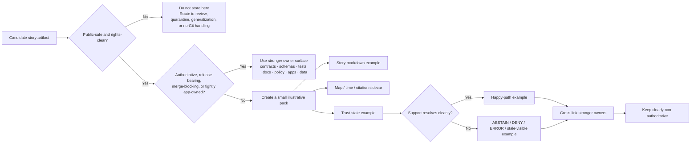

<!-- [KFM_META_BLOCK_V2]
doc_id: kfm://doc/NEEDS-VERIFICATION
title: story
type: standard
version: v1
status: draft
owners: NEEDS VERIFICATION
created: NEEDS-VERIFICATION
updated: NEEDS-VERIFICATION
policy_label: NEEDS VERIFICATION
related: [NEEDS-VERIFICATION]
tags: [kfm]
notes: [Target path, adjacent links, owners, dates, and mounted repo shape were not directly verified in this session.]
[/KFM_META_BLOCK_V2] -->

# story

Public-safe, non-authoritative Story Node examples, sidecars, and citation-behavior illustrations for Kansas Frontier Matrix.

> **Status:** Experimental  
> **Owners:** NEEDS VERIFICATION  
>       
> **Quick jumps:** [Scope](#scope) · [Repo fit](#repo-fit) · [Accepted inputs](#accepted-inputs) · [Exclusions](#exclusions) · [Directory tree](#directory-tree) · [Quickstart](#quickstart) · [Usage](#usage) · [Diagram](#diagram) · [Tables](#tables) · [Task list](#task-list--definition-of-done) · [FAQ](#faq) · [Appendix](#appendix)  
> **Repo fit:** **INFERRED target path from task:** `examples/story/README.md` · **Upstream / downstream anchors:** NEEDS VERIFICATION · **Stronger owner surfaces (conceptually confirmed; mounted paths NEEDS VERIFICATION):** `contracts/`, `schemas/`, `tests/`, `docs/`, `policy/`, `apps/`, `data/`

> [!IMPORTANT]
> This README is **evidence-bounded**.
>
> Current-session evidence confirmed KFM’s **Story surface doctrine**, **Evidence Drawer**, **Focus Mode**, **EvidenceBundle**, **route-family obligations**, and **fail-closed runtime outcomes**.
>
> Current-session evidence did **not** directly verify the mounted repository tree, adjacent README files, schemas, tests, workflows, manifests, or runtime logs. Treat path-level details here as:
>
> - **CONFIRMED** — directly supported by the mounted KFM corpus
> - **INFERRED** — strongly implied by KFM doctrine, but not directly verified in the repo tree
> - **PROPOSED** — recommended starter shape consistent with doctrine
> - **UNKNOWN** — not established strongly enough in this session
> - **NEEDS VERIFICATION** — placeholder requiring direct repo inspection before merge

> [!NOTE]
> The freshest canonical KFM manual directly proposes a **hydrology thin slice** as the smallest public-safe example-first move. A dedicated `examples/story/` lane is therefore **compatible with doctrine** but still **NEEDS VERIFICATION** as mounted repo reality.

---

## Scope

`story` is the **story-example lane** for KFM — or, where the lane is not yet mounted, the **intended story-example role** this README describes.

Its job is to help contributors, reviewers, and maintainers understand what a **story-shaped KFM artifact** should look like without confusing example material with:

- authoritative release truth
- canonical schema or contract law
- merge-blocking fixtures
- live runtime payloads
- review receipts or proof objects
- rights-unclear or sensitivity-bearing source material

A strong artifact here makes four things legible in one review pass:

1. **story structure**
2. **place/time anchor**
3. **evidence drill-through**
4. **trust-visible behavior**

A weak artifact here becomes a shadow source of truth.

[Back to top](#story)

## Repo fit

KFM’s doctrine places **Story** in the same governed shell as **Map Explorer**, **Timeline**, **Dossier**, **Evidence Drawer**, **Focus Mode**, **Review / Stewardship**, **Compare**, and **Export**. Story is not a detached article lane. It is a narrative surface that stays downstream of evidence, release state, policy, and correction visibility.

| Field | Value |
| --- | --- |
| Target path | `examples/story/README.md` (**INFERRED from task**) |
| Mounted path status | **NEEDS VERIFICATION** |
| Baseline doctrinal anchor | KFM canonical manual |
| Story role | human-authored narrative publication in the same shell |
| Story must carry | evidence-linked excerpts, dates, perspective labels, review/correction state |
| Trust dependencies | Evidence Drawer, EvidenceBundle, Focus Mode, release state, correction state |
| Related lane directly proposed in doctrine | `examples/thin_slice/hydrology/` (**PROPOSED in KFM manual**) |
| Adjacent README links | **NEEDS VERIFICATION** |

### Why this lane exists

KFM does **not** treat story as “prose first, evidence maybe later.”

A story example in this repo should demonstrate how a narrative stays anchored to:

- geography
- time scope
- released evidence
- visible uncertainty
- fail-closed runtime behavior when support is partial or blocked

That makes this lane useful for onboarding and review, but only when it remains clearly **illustrative**.

[Back to top](#story)

## Accepted inputs

Content that belongs here includes:

- tiny, public-safe Story Node examples
- story markdown illustrating evidence-linked excerpts
- sidecars that clarify map state, time scope, or citation / EvidenceBundle expectations
- paired happy-path and fail-closed examples
- redacted example payloads for Story, Evidence Drawer, or Focus handoff
- public-safe screenshots or diagrams that explain story behavior without becoming the only proof
- onboarding examples that teach story-to-evidence routing
- temporary cross-surface examples that are easy to relocate once a stronger owner exists

### Good fit heuristic

A good artifact here is:

- **small**
- **redacted or public-safe**
- **obviously illustrative**
- **easy to delete or move**
- **cross-linked back to stronger owners**

> [!TIP]
> Prefer paired examples when the behavior matters:
>
> - one **publishable / supported** story example
> - one **unresolved / abstaining / denied / stale-visible** story example

[Back to top](#story)

## Exclusions

The following do **not** belong here:

| Do not store here | Why | Put it instead in… |
| --- | --- | --- |
| published or release-bearing Story Nodes | examples must not become publication truth | governed publication owner surface |
| canonical schemas, route contracts, or policy registries | these carry authority, not illustration | `contracts/`, `schemas/`, `policy/` |
| merge-blocking fixtures | executable proof belongs beside the harness that enforces it | `tests/` |
| review receipts, release proof packs, or correction notices | these are operational trust artifacts | release / review / correction owner surfaces |
| exact sensitive locations or rights-unclear media | KFM fails closed under unresolved rights or sensitivity | review, quarantine, generalized release, or no-Git handling |
| app-owned runtime payloads tightly coupled to live behavior | runtime truth should stay near the governed API or app owner | `apps/` or runtime contract owners |
| screenshot-only “truth” with no evidence route | presentation must not outrank evidence | docs drafts until evidence linkage exists |
| examples that are the only place a story rule is documented | examples must not become doctrine by accident | doctrinal docs, contracts, or runbooks |

> [!WARNING]
> If a file is needed to make CI fail, a policy decision execute, a citation resolve, or a release pass, it probably has a stronger owner than `story`.

[Back to top](#story)

## Directory tree

### Current session evidence

```text
NEEDS VERIFICATION
(repo tree was not directly mounted in this session)

User-requested target:
examples/story/README.md
```

### Compatible lane shape

```text
examples/story/
├── README.md
├── story-citation-happy-path.md
├── story-citation-unresolved.md
├── story-sidecar-redacted.json
├── story-review-state-example.json
└── assets/
    └── redacted/
```

### Working rule

Grow this lane only when the artifact is:

1. clearly story-shaped,
2. clearly non-authoritative,
3. clearly public-safe, and
4. not better owned by a stronger surface.

[Back to top](#story)

## Quickstart

Start by verifying the repo shape instead of assuming it.

```bash
# Inspect the repo tree first
pwd
find . -maxdepth 3 -type f | sort | sed -n '1,200p'
```

Check stronger owners before adding story-shaped material:

```bash
# Verify likely stronger owners before adding examples
find contracts schemas tests docs policy apps data -maxdepth 4 -type f 2>/dev/null \
  | grep -Ei 'story|evidence|bundle|citation|focus|drawer|review|manifest|correction'
```

Use the repo’s **actual** validation commands only after they are directly verified.

```text
PSEUDOCODE — replace with repo-verified commands
<schema validation>
<policy tests>
<runtime negative-path tests>
<docs / accessibility gate>
```

Before adding a file, answer these questions:

1. Is it public-safe and rights-clear?
2. Is it obviously illustrative rather than authoritative?
3. Does a stronger owner surface already exist?
4. If it demonstrates citation or fail-closed behavior, where is the governing source of truth?
5. Can it be deleted or relocated later without breaking the repo’s trust model?

[Back to top](#story)

## Usage

### 1. Start from the stronger owner

A story example should never be the only place where KFM story behavior is explained.

Check the likely owner first:

- **contracts / schemas** for typed truth
- **tests** for executable positive and negative cases
- **docs / runbooks** for explanation and operational guidance
- **apps / governed API** for runtime-owned payload shape
- **policy** for denial, generalization, and review logic
- **data / release artifacts** for promoted scope and outward truth

Put something in `story` only when its value is **instructional**, **cross-surface**, and **public-safe**.

### 2. Keep examples paired across trust states

KFM’s outward runtime posture is not “answer at any cost.”

Story examples should teach both:

- supported narrative flow
- fail-closed behavior when evidence, rights, sensitivity, freshness, or citation checks break the path

Good pairs include:

- `story-citation-happy-path.md`
- `story-citation-unresolved.md`

or:

- `story-review-state-example.json`
- `story-generalized-example.json`

### 3. Preserve the evidence route

A strong story example makes the review path obvious:

**story text → citation / EvidenceRef → EvidenceBundle → release scope → source / correction context**

If that route disappears, the example is teaching the wrong system.

### 4. Keep place and time visible

KFM doctrine requires story to stay in the same shell as map and time-aware inspection.

A good story example therefore exposes, directly or via sidecar:

- what place it is about
- what time window it speaks for
- whether the material is observed, modeled, generalized, partial, stale-visible, or withdrawn
- how a reader drills into evidence without leaving the governed experience

### 5. Separate current fact from intended shape

Use the vocabulary openly:

- **CONFIRMED** for mounted doctrine or repo evidence
- **INFERRED** for minimal structural completion
- **PROPOSED** for recommended starter shape
- **UNKNOWN** for unresolved repo reality
- **NEEDS VERIFICATION** for branch-local or path-local facts still to check

### 6. Move examples out when they harden

Move an artifact out of `story` when it becomes:

- authoritative
- release-bearing
- merge-blocking
- tightly runtime-owned
- the only place an important rule exists
- too sensitive to remain a public-safe example

[Back to top](#story)

## Diagram



[Back to top](#story)

## Tables

### Placement matrix

| Artifact class | Keep in story lane? | Stronger owner when authoritative | Why |
| --- | --- | --- | --- |
| Tiny redacted story markdown | Yes | docs / contracts / app owner | good for review and onboarding |
| Story sidecar with map/time/citation context | Yes, if public-safe | contracts / apps / tests | useful for explanation, risky as live payload truth |
| Citation happy-path example | Yes | tests / contracts | teaches supported flow |
| Unresolved-citation negative example | Yes | tests | teaches fail-closed behavior |
| Story schema fixture | Sometimes | schemas / tests | canonical validation should not drift into examples |
| Story review-state sketch | Sometimes | contracts / docs / review owner | explanation aid, not operational truth |
| Evidence Drawer example launched from story | Yes, if illustrative | apps / contracts / docs | makes provenance route visible |
| Published story release object | No | publication owner surface | release-bearing objects are not examples |
| Rights-unclear archival material | No | nowhere public until resolved | violates KFM trust posture |
| Exact-location narrative example with sensitivity burden | No, unless generalized | review / generalized publication lane | must not leak precision |

### Story example pack rubric

| Review question | Expected answer here |
| --- | --- |
| Does it prove a small, complete idea quickly? | yes |
| Is the authority clearly labeled? | yes — example / illustrative / sample / redacted |
| Is evidence drill-through visible? | yes |
| Is a fail-closed or constrained state shown where relevant? | yes |
| Can a stronger owner be named? | yes |
| Is deletion or relocation safe later? | yes |

### Trust-state reminders for story examples

| State | What a reader should see | What the example should avoid |
| --- | --- | --- |
| promoted | release-linked, evidence-linked narrative | implying unpublished drafts are equivalent |
| generalized | visible narrowing or precision reduction | silent redaction |
| partial | explicit incompleteness | false completeness |
| stale-visible | visible freshness caveat | pretending currentness |
| denied / abstained | reasoned non-answer or blocked state | “best-effort” bluffing |
| withdrawn / corrected | visible lineage and replacement context | erasing history |

[Back to top](#story)

## Task list / Definition of done

A contribution to this lane is ready when all relevant checks below are true:

- [ ] It is public-safe, rights-clear, and small enough to review in one pass.
- [ ] It is explicitly labeled as illustrative, example, demo, sample, or redacted.
- [ ] It does not pretend to be canonical story truth, a release object, or a policy artifact.
- [ ] The stronger owner surface was checked first.
- [ ] Place, time, and evidence route are visible.
- [ ] If it demonstrates behavior, the related contract, policy, test, or runbook is named.
- [ ] If a negative case matters, a visible fail-closed example exists somewhere reviewable.
- [ ] It does not imply screenshots, prose, or layout alone are evidence.
- [ ] Sensitive places, exact locations, or reuse-unclear source material are excluded or generalized.
- [ ] Deletion or relocation will be easy once a stronger owner becomes real.
- [ ] Any path-level claims beyond this file are marked **INFERRED**, **PROPOSED**, or **NEEDS VERIFICATION**.

[Back to top](#story)

## FAQ

### Why can this lane stay almost empty?

Because a good directory README can still do real work: it keeps story examples from drifting into release truth and tells contributors what belongs here versus elsewhere.

### Why not store real published stories here?

Because KFM separates **illustration** from **governed publication**. Published stories, release state, correction chains, and proof artifacts belong with stronger owner surfaces.

### Why does this README talk so much about Evidence Drawer and Focus Mode?

Because KFM story is not a detached essay surface. Story, Evidence Drawer, and Focus live in the same governed shell and share trust obligations.

### Why are negative examples important?

Because KFM treats **ABSTAIN**, **DENY**, **ERROR**, **generalized**, **partial**, and **stale-visible** as valid outward states. A story examples lane that only shows the polished path teaches the wrong system.

### Why is the target path marked as INFERRED?

Because this session directly verified doctrinal PDFs, not the repo tree. The task names `examples/story/README.md`, but mounted workspace evidence for that exact path still needs direct repo inspection.

### Why is hydrology mentioned in a story README?

Because the canonical manual directly proposes hydrology as the preferred first thin slice. That matters here: it shows what is actually evidenced today, and it keeps this story lane from overstating its repo reality.

[Back to top](#story)

## Appendix

<details>
<summary><strong>PROPOSED sidecar fields for story example packs</strong></summary>

Use a sidecar only when the example needs context a filename cannot carry.

```yaml
example_id: NEEDS-VERIFICATION
title: Story example title
purpose: Short sentence explaining what this demonstrates
authority_status: illustrative
content_kind: story_markdown | story_sidecar | review_state | asset
owner_surface: NEEDS-VERIFICATION
redaction_status: public_safe
citation_mode: resolvable | intentionally_broken | omitted_for_demo
place_scope: NEEDS-VERIFICATION
time_scope: NEEDS-VERIFICATION
trust_state: promoted | generalized | partial | stale_visible | denied | abstained | withdrawn
evidence_bundle_ref: ./story-sidecar-redacted.json
validation_links:
  - NEEDS-VERIFICATION
notes:
  - Keep narrative claims downstream of evidence and policy
  - Replace path placeholders after direct repo inspection
  - Do not silently upgrade this file into a proof object
```

</details>

<details>
<summary><strong>PROPOSED naming guidance</strong></summary>

Prefer names that tell a reviewer what the file is doing:

- `story-citation-happy-path.md`
- `story-citation-unresolved.md`
- `story-sidecar-redacted.json`
- `story-review-state-example.json`
- `story-generalized-example.md`

Avoid names that imply authority or production state:

- `final-story.md`
- `official-story.md`
- `production-sidecar.json`
- `release-ready-story.json`

</details>

<details>
<summary><strong>Story-specific runtime-state vocabulary to illustrate, not to overclaim</strong></summary>

These are good illustrative states to model in examples when relevant:

| Example code / state | Meaning in story examples |
| --- | --- |
| `runtime.evidence_missing` | no reconstructible evidence path |
| `runtime.citation_failed` | evidence was found but user-visible claim verification failed |
| `generalize` | only a generalized representation may be shown |
| `withhold` | do not publish on the requested surface |
| `disclose_partial` | mark incompleteness in place |
| `disclose_modeled` | mark modeled or assimilated content in place |

Use them as **behavior illustrations**, not as proof that a mounted implementation already exists.

</details>

[Back to top](#story)
