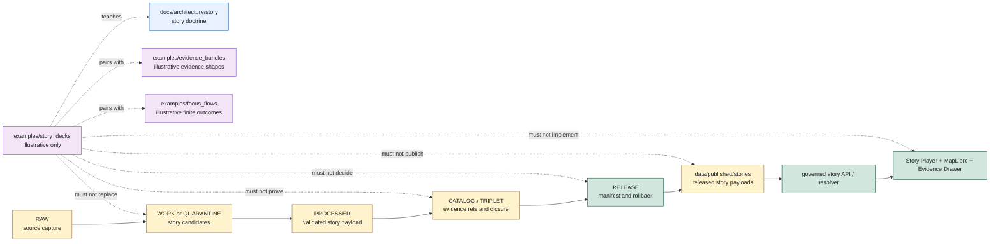

<!-- [KFM_META_BLOCK_V2]
doc_id: kfm://doc/examples/story-decks/readme
title: Story Deck Examples README
type: standard
version: v0.1.0
status: draft
owners: TODO(owner): examples steward; TODO(owner): story subsystem steward; TODO(owner): UI steward; TODO(owner): evidence steward; TODO(owner): policy steward; TODO(owner): release steward; TODO(owner): docs steward
created: NEEDS VERIFICATION - greenfield stub existed before 2026-06-30 expansion
updated: 2026-06-30
policy_label: public-review
related: [../README.md, ../evidence_bundles/README.md, ../focus_flows/README.md, ../../docs/architecture/story/README.md, ../../data/published/README.md, ../../data/published/stories/README.md, ../../release/manifests/README.md, ../../docs/doctrine/directory-rules.md]
tags: [kfm, examples, story-decks, story, story-manifest, story-node, maplibre, evidence-drawer, reality-boundary-note, cite-or-abstain, finite-outcomes, published-stories, release-gated, non-authoritative]
notes: ["This README replaces a greenfield stub at `examples/story_decks/README.md`.", "Story deck examples are illustrative review aids only; operational story architecture lives under `docs/architecture/story/`, released public-safe story payloads belong under `data/published/stories/`, and release decisions belong under `release/`.", "Examples must not become StoryManifest authority, StoryNode authority, published story payloads, scene/layer artifacts, EvidenceBundles, ProofPacks, receipts, policy decisions, release decisions, governed API responses, UI runtime behavior, or public story truth by placement.", "README presence does not prove example deck inventory, story schemas, validators, fixtures, CI checks, story route behavior, story player implementation, published story payloads, release-manifest approval, or hosting readiness."]
[/KFM_META_BLOCK_V2] -->

<a id="top"></a>

# Story Deck Examples

Illustrative story-deck examples for teaching how KFM story sequences should handle map camera state, time state, layer requirements, node narration, Evidence Drawer handoffs, reality-boundary notes, finite outcomes, and release gates without becoming operational story payloads.

<p>
  
  
  
  
  
</p>

**Status:** draft / example-lane guidance  
**Owners:** `TODO(owner): examples steward` · `TODO(owner): story subsystem steward` · `TODO(owner): UI steward` · `TODO(owner): evidence steward` · `TODO(owner): policy steward` · `TODO(owner): release steward` · `TODO(owner): docs steward`  
**Path:** `examples/story_decks/README.md`  
**Quick links:** [Scope](#scope) · [Path posture](#path-posture) · [Repo fit](#repo-fit) · [Accepted material](#accepted-material) · [Exclusions](#exclusions) · [Example contract](#example-contract) · [Story deck guardrails](#story-deck-guardrails) · [Lifecycle relationship](#lifecycle-relationship) · [Suggested layout](#suggested-layout) · [Validation checklist](#validation-checklist) · [Status notes](#status-notes) · [Evidence ledger](#evidence-ledger)

> [!IMPORTANT]
> Files under `examples/story_decks/` are examples. They are not governed `StoryManifest` files, `StoryNode` payloads, published story bundles, scene/layer artifacts, release manifests, EvidenceBundles, ProofPacks, receipts, policy decisions, public API responses, UI components, tests, fixtures, validators, or public story truth.

> [!CAUTION]
> A story deck is a presentation sequence. It cannot make evidence true, publish a claim, approve a release, hide sensitive detail by camera position, or turn generated narration into source authority. Every consequential claim must cite evidence or abstain.

---

## Scope

`examples/story_decks/` is a documentation and review aid for example story sequences.

Use this lane to demonstrate:

- how a story deck might sequence title cards, map camera states, time locks, visible layers, narrative panels, evidence callouts, and finite outcomes;
- how a story node should preserve claim scope, source role, evidence refs, policy posture, release posture, caveats, and rollback/correction expectations;
- how node narration should remain downstream of EvidenceBundle support and should not become the evidence itself;
- how `ANSWER`, `ABSTAIN`, `DENY`, and `ERROR` story-node states should look in a review example;
- how a story deck should handle missing evidence, unresolved release state, denied sensitivity, stale layer dependencies, citation failure, plugin/3D admission failure, and story player failure;
- how Reality Boundary Notes should be surfaced for interpretive, synthetic, generalized, or 3D presentation content;
- how examples should avoid direct public reads from RAW, WORK, QUARANTINE, PROCESSED, unpublished CATALOG/TRIPLET, proof stores, receipt stores, source registries, model runtimes, graph/vector stores, or canonical/internal stores.

This folder should make reviewers faster. It should not become a shortcut around story schemas, story validators, governed APIs, UI implementation, evidence closure, policy review, release manifests, published story payloads, correction paths, or rollback targets.

---

## Path posture

The target file existed as a greenfield stub:

```text
examples/story_decks/README.md
```

Current placement evidence:

- `examples/README.md` describes `examples/` as walkthroughs and example assemblies, including source intake, story decks, and focus mock flows.
- `docs/architecture/story/README.md` defines Story subsystem architecture as draft/proposed doctrine and says Story sequences move camera, time, layers, and panels while consequential claims resolve to drawer evidence or abstain.
- `data/published/README.md` identifies `data/published/stories/` as the published story payload child lane and says published artifacts are downstream delivery carriers, not truth roots.
- `data/published/stories/README.md` defines released public-safe story payloads and requires consequential story claims to resolve to evidence or abstain.
- `examples/evidence_bundles/README.md` establishes the example-lane pattern: examples teach shape and failure behavior but do not become proof authority.
- `release/manifests/README.md` exists only as a greenfield stub in this pass, so release-manifest implementation maturity remains `NEEDS VERIFICATION`.

Therefore this README treats `examples/story_decks/` as **CONFIRMED path presence / DRAFT example-lane guidance / NON-AUTHORITATIVE by placement**.

---

## Repo fit

| Responsibility | Correct home | Boundary |
|---|---|---|
| Story deck example outlines, synthetic node walkthroughs, negative-state examples, and review notes | `examples/story_decks/` | This lane. Illustrative only. |
| Example EvidenceBundle snippets used beside story examples | [`../evidence_bundles/`](../evidence_bundles/README.md) | Example lane only; not proof authority. |
| Focus-flow examples related to story questions | [`../focus_flows/`](../focus_flows/README.md) | Example lane only; not runtime Focus behavior. |
| Story subsystem doctrine | [`../../docs/architecture/story/`](../../docs/architecture/story/README.md) | Architecture guidance; code maturity remains `NEEDS VERIFICATION` where not proven. |
| Published story payloads | [`../../data/published/stories/`](../../data/published/stories/README.md) | Released public-safe delivery artifacts only. |
| Parent published lifecycle lane | [`../../data/published/`](../../data/published/README.md) | Published delivery carriers; not truth/release/proof authority. |
| Release manifests and promotion decisions | `release/` | Release authority, correction, withdrawal, rollback, and signatures. Current manifest README is a stub. |
| EvidenceBundle / ProofPack / citation validation | `data/proofs/` | Proof authority and citation closure, not examples. |
| Receipts, including story-build or representation receipts | `data/receipts/` | Process memory, not proof/release/public truth. |
| Story schemas and contracts | `schemas/contracts/v1/story/`, `contracts/` | Machine shape and semantic meaning; examples must not define them. |
| Story policy | `policy/story/` or accepted policy home | Admissibility and sensitivity decisions; examples must not decide policy. |
| Story player, governed API routes, MapLibre runtime, plugins | `apps/`, `packages/`, or accepted implementation roots | Runtime behavior; examples are not implementation. |
| Tests, fixtures, validators | `tests/`, `fixtures/`, `tools/validators/` | Operational validation strategy; examples are not tests by placement. |

---

## Accepted material

Accepted files should be small, synthetic, reviewable, and clearly marked as examples.

| Accepted item | Use | Required markings |
|---|---|---|
| Deck outline | Show a sequence of story cards/nodes and intended review flow. | `example: true`, `authority: non_authoritative_example`, `do_not_publish: true`. |
| Story node walkthrough | Show camera, time, layer, panel, evidence, policy, and outcome state for one node. | Synthetic IDs and explicit finite outcome. |
| Evidence callout example | Teach how a node links narrative text to Evidence Drawer support. | Example EvidenceRefs only unless operational proof is in the correct root. |
| Negative-state example | Show `ABSTAIN`, `DENY`, or `ERROR` for missing evidence, policy denial, layer mismatch, plugin denial, or runtime fault. | No restricted claim leakage. |
| Reality-boundary example | Show interpretive/synthetic/generalized/3D presentation caveats. | Clear `RealityBoundaryNote`-like marker and no overclaim. |
| 2D/3D parity note | Show that 3D is presentation/admission, not evidence. | Must preserve 2D evidence baseline. |
| Release-readiness checklist | Teach what a real story payload would need before publication. | Must state this folder does not release. |
| Accessibility/state note | Teach keyboard, screen-reader, motion, and non-color trust labels. | Example only; no UI implementation claim. |

Examples may use Markdown, JSON, YAML, or small tables. Keep examples deterministic and easy to diff.

---

## Exclusions

| Do not place here | Correct home or action |
|---|---|
| Operational `StoryManifest`, `StoryNode`, story index, story bundle, story snapshot, story payload digest, `latest.json`, or public story package | `data/published/stories/` after release gates close |
| Story authoring drafts, unresolved story nodes, prompts, generated narration drafts, media scratch, or unpublished candidate decks | `data/work/` or accepted story authoring workspace; quarantine when rights/sensitivity are unclear |
| Quarantined story material, rights-unclear content, policy-held nodes, sensitive joins, or restricted presentation variants | `data/quarantine/` or governed restricted lanes |
| Scene/layer artifacts, PMTiles, scene manifests, layer manifests, or MapLibre delivery artifacts | `data/published/layers/`, `data/published/pmtiles/`, or accepted published layer lanes after release |
| EvidenceBundles, ProofPacks, citation-validation reports, proof indexes, or integrity bundles | `data/proofs/` |
| Story-build, representation, validation, transform, AI, release, correction, or rollback receipts | `data/receipts/` |
| ReleaseManifest, PromotionDecision, CorrectionNotice, WithdrawalNotice, RollbackCard, signatures, or release changelog | `release/` |
| Story schemas, contracts, policy bundles, validators, tests, fixtures, UI source, API routes, MapLibre runtime code, plugins, or package code | Their canonical responsibility roots |
| Exact sensitive locations, living-person data, DNA/genomic records, archaeology site locations, rare species locations, critical infrastructure detail, private land/parcel joins, credentials, secrets, proprietary terms, or reconstructive redaction clues | Quarantine, restrict, redact, generalize, synthesize, or deny |
| Generated story narration presented as evidence | Governed AI and story surfaces may cite evidence; generated text is not evidence |
| Presentation files meant as distributable slide artifacts unless governed separately | A slide artifact is not automatically a KFM story payload or release artifact. |

---

## Example contract

Every story deck example should answer eight questions without claiming operational maturity:

| Question | Expected answer |
|---|---|
| What story scenario is illustrated? | A bounded synthetic narrative sequence over map/time/layer context. |
| What nodes are included? | Synthetic node IDs with title, map state, time state, layer requirements, panel state, and expected outcome. |
| What claims are consequential? | Explicit claim list or `none`; consequential claims require evidence refs or abstain. |
| What evidence support is implied? | Synthetic or clearly marked sample EvidenceRef/EvidenceBundle-like refs. |
| What policy/sensitivity posture applies? | `allow`, `restrict`, `hold`, `deny`, `abstain`, or `error` as an illustrative posture only. |
| What release posture applies? | Example release reference or `not_released`; examples do not publish. |
| What finite outcome should render? | Exactly one of `ANSWER`, `ABSTAIN`, `DENY`, or `ERROR` when public behavior is illustrated. |
| What must not happen? | No story truth, proof, receipt, release, policy, runtime, or publication authority by example placement. |

Illustrative JSON should include a visible marker like this:

```json
{
  "example": true,
  "authority": "non_authoritative_example",
  "do_not_publish": true,
  "deck_id": "kfm://example/story-deck/NEEDS-VERIFICATION",
  "surface": "story_deck_example",
  "expected_outcome": "ABSTAIN",
  "reason": "illustrative example only; story schema, validator, route, release, and EvidenceBundle behavior NEEDS VERIFICATION",
  "forbidden_use": [
    "story_manifest",
    "published_story_payload",
    "proof_record",
    "receipt_record",
    "policy_decision",
    "release_decision",
    "public_api_response",
    "ui_runtime_fixture"
  ]
}
```

> [!WARNING]
> Do not copy example deck IDs, node IDs, coordinates, camera states, layer refs, evidence refs, release refs, policy refs, caveat text, or generated narration into operational story payloads. Examples teach shape and failure behavior; they do not publish facts.

---

## Story deck guardrails

| Risk | Guardrail |
|---|---|
| Deck becomes published story | Keep examples visibly synthetic and non-authoritative; released story payloads belong in `data/published/stories/` after release gates close. |
| Story narration becomes evidence | Narrative text must cite EvidenceBundle support or abstain. Generated narration is a downstream carrier. |
| Camera hides sensitivity | Zoom, camera angle, blur, styling, or client filtering cannot substitute for redaction, generalization, policy, review, or release state. |
| 3D becomes truth | 3D/scene presentation requires governed admission and Reality Boundary Notes where applicable; visual realism is not evidence. |
| Story reads internal stores | Story examples must show governed story/API/Evidence Drawer surfaces, not direct reads from lifecycle/internal/proof/receipt stores. |
| Layer dependency becomes truth | A layer or tile is a delivery carrier. Underlying EvidenceBundle, policy, release, and source-role posture remain authoritative. |
| Partial state leaks | Missing evidence, failed citations, denied sensitivity, stale dependencies, invalid nodes, plugin denial, or runtime failures render finite `ABSTAIN`, `DENY`, or `ERROR`. |
| Release boundary collapses | Examples cannot issue release approval, rollback targets, correction notices, or withdrawal decisions. |
| Accessibility omitted | Story examples that illustrate UI behavior should include non-color trust labels, keyboard/screen-reader posture, and motion/fallback considerations. |

---

## Lifecycle relationship



The examples lane is outside the lifecycle spine. It can illustrate story behavior, but it cannot become a lifecycle phase, story authoring workspace, published story payload, release authority, proof authority, receipt authority, or runtime implementation.

---

## Suggested layout

This tree is **PROPOSED**. Confirm actual example needs, schema paths, fixture strategy, validator expectations, story-route behavior, and release-manifest governance before adding files.

```text
examples/story_decks/
├── README.md
├── deck-outlines/
│   ├── minimal-three-node-deck.example.json
│   ├── evidence-missing-abstain.example.json
│   └── policy-denied-node.example.json
├── node-walkthroughs/
│   ├── map-time-layer-node.walkthrough.md
│   ├── evidence-drawer-callout.walkthrough.md
│   └── reality-boundary-note.walkthrough.md
├── negative-states/
│   ├── citation-failed-abstain.example.json
│   ├── restricted-detail-deny.example.json
│   ├── stale-layer-error.example.json
│   └── plugin-admission-deny.example.json
├── accessibility/
│   └── story-player-state-labels.example.md
└── release-readiness/
    └── story-deck-publication-checklist.walkthrough.md
```

Recommended file naming:

| Pattern | Use |
|---|---|
| `*.example.json` | Non-authoritative JSON example. |
| `*.example.yaml` | Non-authoritative YAML example. |
| `*.walkthrough.md` | Narrative walkthrough, not operational proof. |
| `README.md` | Local explanation and boundaries. |

---

## Validation checklist

Before adding or changing examples here, verify:

- [ ] The file is marked as an example and non-authoritative.
- [ ] The file contains no real sensitive coordinates, living-person data, DNA/genomic data, archaeology site locations, rare species locations, critical infrastructure detail, private parcel joins, secrets, credentials, proprietary terms, or reconstruction clues.
- [ ] The example does not create StoryManifest, StoryNode, schema, contract, policy, proof, receipt, release, source-registry, route, model-runtime, fixture, validator, UI, plugin, or test authority.
- [ ] Any IDs, coordinates, layer refs, evidence refs, release refs, policy refs, camera states, and story text are synthetic or clearly marked `NEEDS VERIFICATION`.
- [ ] Consequential `ANSWER` examples demonstrate evidence support, citation posture, policy allow, release/review posture, limitations, correction path, and rollback posture.
- [ ] Evidence-missing, citation-failed, unreleased, stale, conflicting, or unsupported examples render `ABSTAIN`.
- [ ] Sensitive, rights-unclear, role-forbidden, restricted, sovereignty/cultural-review-needed, infrastructure-sensitive, or exact-location examples render `DENY` or safely generalized alternatives.
- [ ] Malformed nodes, missing dependencies, plugin failure, route failure, or runtime failure examples render `ERROR` without claim leakage.
- [ ] Any 3D, synthetic, reconstructed, generalized, or interpretive presentation includes a reality-boundary posture.
- [ ] Relative links from this README still resolve.
- [ ] Operational fixtures, if needed, are placed under the accepted test/fixture strategy rather than silently becoming examples.

---

## Status notes

| Item | Status | Notes |
|---|---:|---|
| Target path presence | CONFIRMED | `examples/story_decks/README.md` existed as a greenfield stub before this update. |
| Examples root | CONFIRMED README | `examples/README.md` names story decks as an examples family. |
| Story subsystem architecture | CONFIRMED README | `docs/architecture/story/README.md` defines draft/proposed Story subsystem doctrine and cite-or-abstain story invariants. |
| Published parent lane | CONFIRMED README | `data/published/README.md` identifies published artifacts as downstream carriers and includes `stories/` as a child lane. |
| Published story payload lane | CONFIRMED README | `data/published/stories/README.md` defines released public-safe story payloads and excludes drafts, proofs, receipts, release authority, scenes, UI code, and model-generated uncited claims. |
| EvidenceBundle examples pattern | CONFIRMED README | `examples/evidence_bundles/README.md` defines example-lane non-authority and proof separation. |
| Release manifests README | CONFIRMED STUB | `release/manifests/README.md` exists as a greenfield stub only. Release-manifest maturity remains `NEEDS VERIFICATION`. |
| Story deck child payload inventory | UNKNOWN | This edit did not verify child files beyond this README. |
| Story schemas, validators, fixtures, CI checks, Story API route behavior, Story Player implementation, MapLibre runtime behavior, release-manifest approval, hosting readiness | NEEDS VERIFICATION | No runtime or validation enforcement was proven by this README. |
| Public release readiness | DENY | Examples cannot publish, prove, release, or answer claims. |

---

## Evidence ledger

| Source | Status | Supports | Limits |
|---|---|---|---|
| Previous target file | CONFIRMED | Target existed as a greenfield stub. | Did not define boundaries, accepted material, or exclusions. |
| [`../README.md`](../README.md) | CONFIRMED README | `examples/` is for walkthroughs and example assemblies and explicitly includes story decks. | It is short and status `PROPOSED`. |
| [`../evidence_bundles/README.md`](../evidence_bundles/README.md) | CONFIRMED README | Establishes non-authoritative example-lane behavior, proof separation, finite outcomes, and no-public-path behavior. | Covers EvidenceBundle examples, not story decks directly. |
| [`../../docs/architecture/story/README.md`](../../docs/architecture/story/README.md) | CONFIRMED architecture doc | Story subsystem moves camera, time, layers, and panels; consequential claims resolve to drawer evidence or abstain; finite outcomes and 3D admission boundaries apply. | The doc itself marks many implementation paths, schemas, routes, and components as PROPOSED / NEEDS VERIFICATION. |
| [`../../data/published/README.md`](../../data/published/README.md) | CONFIRMED README | Published artifacts are downstream delivery carriers, not source/proof/receipt/release/catalog/registry/policy/truth authority. | Child README presence does not prove payloads or release approval. |
| [`../../data/published/stories/README.md`](../../data/published/stories/README.md) | CONFIRMED README | Released story payload lane, story artifact families, inputs/exclusions, publication boundary, and checks before use. | Actual story payloads, schema validation, release-manifest approval, validator wiring, and CI enforcement remain UNKNOWN unless verified per release. |
| [`../../release/manifests/README.md`](../../release/manifests/README.md) | CONFIRMED STUB | Path exists as release-manifest lane stub. | Provides no substantive release-manifest implementation evidence. |
| [`../../docs/doctrine/directory-rules.md`](../../docs/doctrine/directory-rules.md) | REFERENCED DOCTRINE | Root placement and lifecycle separation basis for examples vs data/published/release/proofs/receipts. | Not re-read in full during this edit; current README relies on previously established KFM directory doctrine and adjacent file evidence. |

[Back to top](#top)
