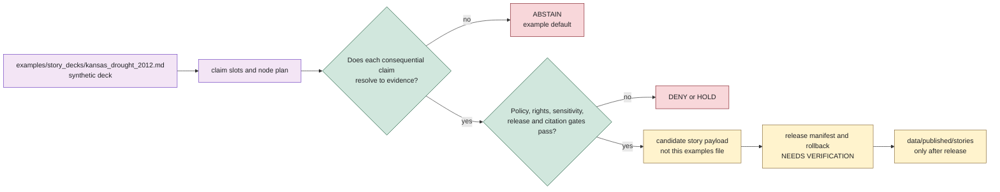

<!-- [KFM_META_BLOCK_V2]
doc_id: kfm://example/story-deck/kansas-drought-2012
title: Kansas Drought 2012 Story Deck Example
type: example
version: v0.1.0
status: draft
owners: TODO(owner): examples steward; TODO(owner): story subsystem steward; TODO(owner): hazards steward; TODO(owner): atmosphere steward; TODO(owner): hydrology steward; TODO(owner): agriculture steward; TODO(owner): evidence steward; TODO(owner): release steward; TODO(owner): docs steward
created: NEEDS VERIFICATION - greenfield placeholder existed before 2026-06-30 expansion
updated: 2026-06-30
policy_label: public-review
related: [README.md, ../evidence_bundles/README.md, ../focus_flows/README.md, ../../docs/architecture/story/README.md, ../../data/published/stories/README.md, ../../docs/domains/hazards/README.md, ../../docs/domains/atmosphere/README.md, ../../docs/domains/hydrology/README.md, ../../docs/domains/agriculture/README.md, ../../release/manifests/README.md]
tags: [kfm, examples, story-decks, kansas, drought, 2012, hazards, atmosphere, hydrology, agriculture, drought-indicator, drought-stress-indicator, story-node, evidence-drawer, finite-outcomes, not-for-life-safety, non-authoritative, cite-or-abstain]
notes: ["This file replaces a greenfield placeholder at `examples/story_decks/kansas_drought_2012.md`.", "This is a synthetic example deck. It is not a published story, StoryManifest, StoryNode payload, drought record, climate record, hydrology record, agriculture record, EvidenceBundle, receipt, policy decision, or release decision.", "All factual 2012 Kansas drought claims in this example are represented as evidence-gated claim slots with `NEEDS_VERIFICATION` evidence refs. The deck demonstrates story structure and failure behavior, not historical truth.", "Hazards owns drought as hazard context and is not a life-safety alerting system. Atmosphere owns weather/climate observations and model context. Hydrology owns water observations and HUC/gauge context. Agriculture owns crop/yield/irrigation/stress indicators and denies field/operator detail by default."]
[/KFM_META_BLOCK_V2] -->

<a id="top"></a>

# Example Story Deck: Kansas Drought 2012

Synthetic KFM story-deck example for reviewing how a public story about the 2012 Kansas drought should be structured before any real evidence, release, story schema, or Story Player implementation is treated as operational.

<p>
  
  
  
  
  
</p>

**Path:** `examples/story_decks/kansas_drought_2012.md`  
**Example status:** synthetic / illustrative / non-authoritative  
**Operational release state:** `not_released`  
**Default public behavior:** `ABSTAIN` for every consequential claim until evidence, policy, story validation, release, correction, and rollback gates close  
**Quick links:** [Scenario](#scenario) · [Deck contract](#deck-contract) · [Claim slots](#claim-slots) · [Node sequence](#node-sequence) · [Story payload sketch](#story-payload-sketch) · [Evidence gates](#evidence-gates) · [Negative states](#negative-states) · [Cross-domain guardrails](#cross-domain-guardrails) · [Forbidden uses](#forbidden-uses) · [Status notes](#status-notes) · [Evidence ledger](#evidence-ledger)

> [!IMPORTANT]
> This file is an example story deck. It is not a published KFM story, not a `StoryManifest`, not a `StoryNode` payload, not a drought dataset, not a climate record, not a hydrology record, not an agricultural impact record, not an EvidenceBundle, not a ProofPack, not a receipt, not a release artifact, and not a public API response.

> [!CAUTION]
> This example intentionally avoids asserting real 2012 Kansas drought facts. It names a historical topic and proposes evidence slots. Any real story must replace those slots with governed EvidenceRefs that resolve to EvidenceBundles and citation validation.

---

## Scenario

A reviewer wants to draft a public map-first story about the 2012 Kansas drought.

The story should help a public user understand how drought context can be narrated across:

- **Hazards** — drought as hazard context, drought indicators, disaster/resilience context, and not-for-life-safety boundary;
- **Atmosphere** — precipitation, temperature, climate anomaly, weather observation, and model context;
- **Hydrology** — streamflow, groundwater, HUC/gauge context, and drought links;
- **Agriculture** — drought stress, aggregate crop/yield/irrigation context, and field/operator privacy boundaries.

The deck remains an example because no operational story schema, story route, story player, published story payload, EvidenceBundle inventory, release manifest, or validation result is proven by this file.

---

## Deck contract

| Field | Example value | Boundary |
|---|---|---|
| Deck ID | `kfm://example/story-deck/kansas-drought-2012` | Synthetic example ID only. |
| Story topic | Kansas drought, 2012 | Topic label only; no facts asserted without evidence. |
| Spatial scope | `Kansas statewide / county / HUC / climate-division candidates` | Proposed scopes; exact geometry requires released layer support. |
| Temporal scope | `2012 calendar year plus optional antecedent context` | Proposed; real story must pin event time and source time separately. |
| Public release state | `not_released` | Examples cannot publish. |
| Evidence state | `unresolved_example_refs` | All claim-bearing nodes default to `ABSTAIN`. |
| Sensitivity state | `public-safe aggregate only` | Field/operator/private joins are denied by default. |
| Life-safety posture | `not_for_life_safety` | No warning, advisory, emergency, or operational guidance. |

---

## Claim slots

The table below is a claim plan, not claim truth.

| Claim slot | Claim family | Owning lane | Example evidence ref | Default outcome |
|---|---|---|---|---|
| `claim-001` | Drought extent / severity timeline | Hazards | `kfm://example/evidence-ref/hazards/drought/2012-kansas/usdm/NEEDS-VERIFICATION` | `ABSTAIN` |
| `claim-002` | Precipitation and temperature context | Atmosphere | `kfm://example/evidence-ref/atmosphere/climate/2012-kansas/NEEDS-VERIFICATION` | `ABSTAIN` |
| `claim-003` | Hydrologic response context | Hydrology | `kfm://example/evidence-ref/hydrology/drought-link/2012-kansas/NEEDS-VERIFICATION` | `ABSTAIN` |
| `claim-004` | Agricultural drought stress context | Agriculture | `kfm://example/evidence-ref/agriculture/drought-stress/2012-kansas/NEEDS-VERIFICATION` | `ABSTAIN` |
| `claim-005` | Resilience / impact framing | Hazards plus domain refs | `kfm://example/evidence-ref/hazards/resilience/2012-kansas/NEEDS-VERIFICATION` | `ABSTAIN` |
| `claim-006` | Official-source redirection / not-for-life-safety caveat | Hazards / Story | `kfm://example/evidence-ref/hazards/not-for-life-safety/NEEDS-VERIFICATION` | `ANSWER` only if non-claim caveat text validates. |

Candidate source families for a real implementation may include drought-monitor products, climate observations, mesonet/weather observations, streamflow/gauge observations, USDA/NASS aggregate products, and state/local review sources. This example does not activate or verify any of those sources.

---

## Node sequence

| Node | Title | Purpose | Expected state in this example | Evidence behavior |
|---:|---|---|---|---|
| 0 | Title and boundary | Introduce the story topic and warn that the deck is not life-safety guidance. | `ANSWER` | No substantive drought claim beyond scope label. |
| 1 | The drought timeline | Show how a timeline node would anchor drought extent/severity. | `ABSTAIN` | Drought timeline EvidenceRef is unresolved. |
| 2 | Weather and climate context | Show precipitation/temperature anomaly context as Atmosphere-owned evidence. | `ABSTAIN` | Climate evidence bundle is unresolved. |
| 3 | Water systems context | Show streamflow/groundwater/HUC context without becoming a water-warning surface. | `ABSTAIN` | Hydrology evidence bundle is unresolved. |
| 4 | Agriculture stress context | Show aggregate crop/yield/irrigation stress framing. | `ABSTAIN` | Agriculture evidence bundle is unresolved and field/operator detail is denied. |
| 5 | Public-safe impact framing | Show resilience/impact framing without emergency instruction or private detail. | `ABSTAIN` | Impact evidence is unresolved; sensitive joins are held. |
| 6 | Evidence drawer and next checks | Show how the story should let a user inspect support and caveats. | `ANSWER` as process-only example, or `ABSTAIN` if rendered as public story. | Evidence Drawer handoff remains illustrative. |

---

## Story payload sketch

This sketch is deliberately not a valid operational `StoryManifest`. It teaches shape and failure behavior.

```json
{
  "example": true,
  "authority": "non_authoritative_example",
  "do_not_publish": true,
  "not_a_story_manifest": true,
  "deck_id": "kfm://example/story-deck/kansas-drought-2012",
  "topic": "Kansas drought 2012",
  "operational_release_state": "not_released",
  "default_truth_posture": "cite_or_abstain",
  "story_nodes": [
    {
      "node_id": "kfm://example/story-node/kansas-drought-2012/00-title",
      "title": "Kansas Drought 2012 — Example Boundary",
      "expected_outcome": "ANSWER",
      "claim_slots": [],
      "public_message": "This example deck is not an official drought record, warning, advisory, or published KFM story."
    },
    {
      "node_id": "kfm://example/story-node/kansas-drought-2012/01-drought-timeline",
      "title": "How drought status changed across 2012",
      "expected_outcome": "ABSTAIN",
      "claim_slots": ["claim-001"],
      "map_state": {
        "spatial_scope": "kansas_statewide_generalized",
        "time_lock": "2012-NEEDS-VERIFICATION",
        "required_layers": [
          "kfm://example/layer/hazards/drought-indicator/2012-kansas/NEEDS-VERIFICATION"
        ]
      },
      "evidence_refs": [
        "kfm://example/evidence-ref/hazards/drought/2012-kansas/usdm/NEEDS-VERIFICATION"
      ],
      "abstain_reason": "No operational EvidenceBundle or citation validation is provided by this example."
    },
    {
      "node_id": "kfm://example/story-node/kansas-drought-2012/02-atmosphere-context",
      "title": "Weather and climate context",
      "expected_outcome": "ABSTAIN",
      "claim_slots": ["claim-002"],
      "required_layers": [
        "kfm://example/layer/atmosphere/climate-anomaly/2012-kansas/NEEDS-VERIFICATION"
      ],
      "evidence_refs": [
        "kfm://example/evidence-ref/atmosphere/climate/2012-kansas/NEEDS-VERIFICATION"
      ]
    },
    {
      "node_id": "kfm://example/story-node/kansas-drought-2012/03-hydrology-context",
      "title": "Water systems context",
      "expected_outcome": "ABSTAIN",
      "claim_slots": ["claim-003"],
      "required_layers": [
        "kfm://example/layer/hydrology/drought-link/2012-kansas/NEEDS-VERIFICATION"
      ],
      "evidence_refs": [
        "kfm://example/evidence-ref/hydrology/drought-link/2012-kansas/NEEDS-VERIFICATION"
      ]
    },
    {
      "node_id": "kfm://example/story-node/kansas-drought-2012/04-agriculture-context",
      "title": "Agricultural drought stress context",
      "expected_outcome": "ABSTAIN",
      "claim_slots": ["claim-004"],
      "policy_state": "aggregate_public_safe_only",
      "denied_detail": [
        "field polygons",
        "operator identity",
        "private parcel joins",
        "farm-level yield claims"
      ],
      "evidence_refs": [
        "kfm://example/evidence-ref/agriculture/drought-stress/2012-kansas/NEEDS-VERIFICATION"
      ]
    },
    {
      "node_id": "kfm://example/story-node/kansas-drought-2012/05-public-safe-impact",
      "title": "Public-safe impact framing",
      "expected_outcome": "ABSTAIN",
      "claim_slots": ["claim-005"],
      "policy_state": "sensitivity_review_required",
      "evidence_refs": [
        "kfm://example/evidence-ref/hazards/resilience/2012-kansas/NEEDS-VERIFICATION"
      ]
    },
    {
      "node_id": "kfm://example/story-node/kansas-drought-2012/06-evidence-drawer",
      "title": "Inspect the evidence before believing the story",
      "expected_outcome": "ABSTAIN",
      "claim_slots": [],
      "drawer_behavior": "example_only_no_operational_bundle"
    }
  ],
  "forbidden_use": [
    "story_manifest",
    "published_story_payload",
    "drought_record",
    "climate_record",
    "hydrology_record",
    "agriculture_record",
    "proof_record",
    "receipt_record",
    "policy_decision",
    "release_decision",
    "public_api_response"
  ]
}
```

---

## Evidence gates



---

## Negative states

| Condition | Required public story state | Reason |
|---|---|---|
| Drought timeline evidence unresolved | `ABSTAIN` | Story cannot narrate drought extent or severity without evidence closure. |
| Climate evidence unresolved | `ABSTAIN` | Atmosphere claims must cite climate/weather evidence. |
| Hydrology evidence unresolved | `ABSTAIN` | Gauge, groundwater, HUC, and water-context claims remain Hydrology-owned. |
| Agriculture evidence unresolved | `ABSTAIN` | Crop/yield/irrigation stress claims require aggregate, public-safe evidence. |
| Field/operator/private joins requested | `DENY` | Agriculture and People/Land privacy boundaries fail closed. |
| Exact sensitive infrastructure dependency requested | `DENY` | Infrastructure-sensitive details require policy review and likely suppression. |
| Emergency or life-safety guidance requested | `DENY` | KFM is not an emergency alert or advisory system. |
| 3D/scene reconstruction overclaims certainty | `ABSTAIN` or `DENY` | Visual presentation is not evidence and needs Reality Boundary Notes. |
| Story route/schema/player fails | `ERROR` | System failure is not a partial claim. |
| Release manifest missing | `HOLD` / `ABSTAIN` | Published story payloads require release approval and rollback path. |

---

## Cross-domain guardrails

| Lane | What it may contribute | What this deck must not do |
|---|---|---|
| Hazards | Drought indicators, hazard timeline, official-source redirection, resilience context, not-for-life-safety boundary. | Issue warnings, advisories, emergency instructions, or life-safety guidance. |
| Atmosphere | Weather observations, climate anomaly/normal context, precipitation and temperature context, model/advisory context with caveats. | Treat model fields as observations or climate context as agriculture/hydrology truth. |
| Hydrology | HUC/gauge/water observation context, drought links, streamflow/groundwater context. | Treat regulatory or modeled context as observed water truth, or issue flood/water warnings. |
| Agriculture | Aggregate drought stress indicators, crop/yield/irrigation context, public-safe agricultural economy context. | Publish field-level, operator-level, parcel-linked, or private farm-management detail. |
| Story subsystem | Sequence camera, time, layers, panels, evidence callouts, caveats, and finite outcomes. | Become proof, release, source, policy, runtime, or story-payload authority by example placement. |

---

## Forbidden uses

Do not use this file as:

- a real drought chronology;
- a real Kansas 2012 drought fact sheet;
- a `StoryManifest` or `StoryNode` payload;
- a published story package under `data/published/stories/`;
- a source, proof, catalog, receipt, policy, or release artifact;
- a drought warning, advisory, emergency, water-rights, crop-insurance, financial, or life-safety instruction;
- a map layer, scene manifest, Evidence Drawer payload, Story API response, UI fixture, or validator fixture;
- evidence that story schemas, routes, Story Player, MapLibre runtime, release manifests, or external drought datasets are implemented.

---

## Status notes

| Item | Status | Notes |
|---|---:|---|
| Target path presence | CONFIRMED | `examples/story_decks/kansas_drought_2012.md` existed as a greenfield placeholder before this update. |
| Story deck example lane | CONFIRMED README | `examples/story_decks/README.md` defines story decks as illustrative and non-authoritative. |
| Published story lane | CONFIRMED README | `data/published/stories/README.md` defines released public-safe story payloads and requires evidence-bound story claims. |
| Hazards boundary | CONFIRMED README | Hazards owns drought indicators/hazard context and is not a life-safety alerting system. |
| Atmosphere boundary | CONFIRMED README | Atmosphere owns weather/climate observations and model context, not emergency or agriculture/hydrology truth. |
| Hydrology boundary | CONFIRMED README | Hydrology owns HUC/gauge/water context and is not an emergency warning system. |
| Agriculture boundary | CONFIRMED README | Agriculture owns drought stress indicators and denies field/operator/private joins by default. |
| 2012 Kansas drought facts in this file | NOT ASSERTED | All factual story claims are evidence slots with unresolved example refs. |
| Story schemas, validators, fixtures, story route behavior, Story Player implementation, MapLibre runtime behavior, released story payloads, release-manifest approval, EvidenceBundles, citation validation | NEEDS VERIFICATION | This example proves none of those. |
| Public release readiness | DENY | Examples cannot publish, prove, release, warn, or answer claims. |

---

## Evidence ledger

| Source | Status | Supports | Limits |
|---|---|---|---|
| Previous target file | CONFIRMED | Target existed as a greenfield placeholder. | Did not define deck boundaries or evidence gates. |
| [`README.md`](README.md) | CONFIRMED README | Story deck examples are illustrative, non-authoritative, release-gated, cite-or-abstain examples. | Does not prove this child file is a valid story payload. |
| [`../../data/published/stories/README.md`](../../data/published/stories/README.md) | CONFIRMED README | Published story payloads are release-approved downstream carriers; consequential story claims resolve to EvidenceBundles or abstain. | Actual payloads, schemas, validators, release approval, and CI remain UNKNOWN unless verified per release. |
| [`../../docs/domains/hazards/README.md`](../../docs/domains/hazards/README.md) | CONFIRMED README | Hazards owns drought indicators/hazard context and states KFM is not an emergency alerting/life-safety system. | Implementation maturity remains PROPOSED / NEEDS VERIFICATION where noted. |
| [`../../docs/domains/atmosphere/README.md`](../../docs/domains/atmosphere/README.md) | CONFIRMED README | Atmosphere owns weather/climate observations and model context and is not an emergency advisory system. | Source descriptors, rights, endpoint behavior, proof/release closure remain NEEDS VERIFICATION. |
| [`../../docs/domains/hydrology/README.md`](../../docs/domains/hydrology/README.md) | CONFIRMED README | Hydrology owns HUC/gauge/water observations and drought links; it is not an emergency warning system. | Specific data/path implementation remains PROPOSED / NEEDS VERIFICATION. |
| [`../../docs/domains/agriculture/README.md`](../../docs/domains/agriculture/README.md) | CONFIRMED README | Agriculture owns drought stress indicators and requires aggregate/public-safe treatment; field/operator detail is denied by default. | Implementation maturity remains PROPOSED / NEEDS VERIFICATION. |
| [`../../release/manifests/README.md`](../../release/manifests/README.md) | CONFIRMED STUB | Release manifest path exists. | Stub provides no substantive release-manifest implementation evidence. |

[Back to top](#top)
