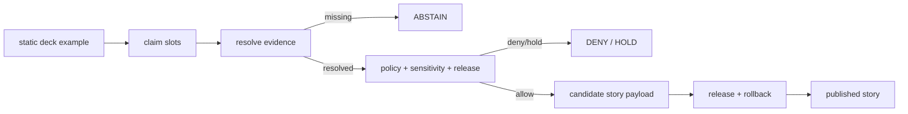

<!-- [KFM_META_BLOCK_V2]
doc_id: kfm://example/story-deck/kansas-drought-2012
title: Kansas Drought 2012 Story Deck Example
type: example; static-walkthrough; non-authoritative
version: v0.2.0
status: STATIC_WALKTHROUGH; synthetic; evidence-gated; not-released
owners: NEEDS VERIFICATION — examples, story, Hazards, Atmosphere, Hydrology, Agriculture, evidence, release, and docs stewards
updated: 2026-07-24
supersedes: v0.1.0 at the same path; no historical claim, runtime, release, or publication state
prepared_under_prompt: KFM Markdown Engineering, Modernization & GitHub Documentation Implementation Agent v5.0.0
review_packet_id: kfm-md-examples-wave-20260724
current_path: examples/story_decks/kansas_drought_2012.md
evidence_snapshot:
  repository: bartytime4life/Kansas-Frontier-Matrix
  base_commit: fe9442ef01ed676e11ccea2796c6fe4090dd1e7e
  prior_blob: a194fd6f42d117e303590170b5b7fea2493f87cc
notes:
  - "The historical topic is named, but this file asserts no substantive 2012 Kansas drought fact."
[/KFM_META_BLOCK_V2] -->

<a id="top"></a>

# Example Story Deck: Kansas Drought 2012

> **Scenario.** Review a map-first public story plan about the 2012 Kansas drought without treating the plan as historical evidence or a released story.

[](#validation)
[](#authority-boundary)
[](#claim-slots)

> [!CAUTION]
> This deck is not a drought chronology, warning, advisory, emergency guide, climate record, Hydrology record, Agriculture impact record, StoryManifest, published story, or EvidenceBundle.

## Scenario

A reviewer wants to plan a story that could eventually combine:

- **Hazards:** drought indicators, resilience context, and not-for-life-safety boundary;
- **Atmosphere:** precipitation, temperature, and climate observations/model context;
- **Hydrology:** HUC, streamflow, groundwater, and drought-link context;
- **Agriculture:** aggregate crop, yield, irrigation, and drought-stress context.

No real claim is asserted here. All consequential slots default to `ABSTAIN`.

## Authority boundary

This file is a static story-plan example. It cannot create StoryManifest/StoryNode authority, evidence, proof, receipts, policy, release, map layers, runtime behavior, or publication.

Fields, operators, private parcels, exact infrastructure dependencies, and emergency guidance are denied by default.

## Deck contract

| Field | Static example value |
|---|---|
| Deck ID | `kfm://example/story-deck/kansas-drought-2012` |
| Spatial scope | Kansas aggregate candidates; exact released geometry not supplied |
| Temporal scope | 2012 topic label; event/source/release times unresolved |
| Release state | `not_released` |
| Evidence state | `synthetic_unresolved` |
| Sensitivity | `public_safe_aggregate_only` |
| Life-safety posture | `not_for_life_safety` |

## Claim slots

| Slot | Claim family | Owning lane | Example evidence ref | Outcome |
|---|---|---|---|---|
| `claim-001` | drought extent/severity timeline | Hazards | `kfm://example/evidence-ref/hazards/drought/SYNTHETIC` | `ABSTAIN` |
| `claim-002` | precipitation/temperature context | Atmosphere | `kfm://example/evidence-ref/atmosphere/climate/SYNTHETIC` | `ABSTAIN` |
| `claim-003` | hydrologic response context | Hydrology | `kfm://example/evidence-ref/hydrology/drought-link/SYNTHETIC` | `ABSTAIN` |
| `claim-004` | aggregate agricultural stress context | Agriculture | `kfm://example/evidence-ref/agriculture/drought-stress/SYNTHETIC` | `ABSTAIN` |
| `claim-005` | resilience/impact framing | Hazards + cited lanes | `kfm://example/evidence-ref/hazards/resilience/SYNTHETIC` | `ABSTAIN` |

## Node sequence

| Node | Purpose | Static state |
|---:|---|---|
| 0 | title, scope, and not-for-life-safety boundary | `ANSWER` for process-only text |
| 1 | drought timeline slot | `ABSTAIN` |
| 2 | Atmosphere context slot | `ABSTAIN` |
| 3 | Hydrology context slot | `ABSTAIN` |
| 4 | aggregate Agriculture context slot | `ABSTAIN` |
| 5 | public-safe impact framing slot | `ABSTAIN` |
| 6 | Evidence Drawer and next checks | `ABSTAIN` until bundles resolve |

## Story payload sketch

```json
{
  "example": true,
  "authority": "non_authoritative_example",
  "do_not_publish": true,
  "not_a_story_manifest": true,
  "maturity": "STATIC_WALKTHROUGH",
  "deck_id": "kfm://example/story-deck/kansas-drought-2012",
  "topic": "Kansas drought 2012",
  "release_state": "not_released",
  "default_claim_outcome": "ABSTAIN",
  "nodes": [
    {
      "node_id": "kfm://example/story-node/kansas-drought-2012/title",
      "purpose": "scope and boundary",
      "outcome": "ANSWER",
      "substantive_claims": []
    },
    {
      "node_id": "kfm://example/story-node/kansas-drought-2012/drought-timeline",
      "outcome": "ABSTAIN",
      "evidence_refs": ["kfm://example/evidence-ref/hazards/drought/SYNTHETIC"],
      "reason": "no operational EvidenceBundle"
    },
    {
      "node_id": "kfm://example/story-node/kansas-drought-2012/agriculture-context",
      "outcome": "ABSTAIN",
      "policy_state": "aggregate_public_safe_only",
      "denied_detail": ["field polygons", "operator identity", "private parcel joins"]
    }
  ]
}
```

## Evidence gates


```mermaid
flowchart LR
    EX["static deck example"] --> SLOTS["claim slots"]
    SLOTS --> EVID["resolve evidence"]
    EVID -->|"missing"| ABSTAIN["ABSTAIN"]
    EVID -->|"resolved"| POLICY["policy + sensitivity + release"]
    POLICY -->|"deny/hold"| DENY["DENY / HOLD"]
    POLICY -->|"allow"| STORY["candidate story payload"]
    STORY --> RELEASE["release + rollback"]
    RELEASE --> PUBLISHED["published story"]
```

## Negative states

| Condition | Required state |
|---|---|
| Any claim evidence unresolved or citation-invalid | `ABSTAIN` |
| Field/operator/private-person/parcel detail requested | `DENY` |
| Exact sensitive infrastructure dependency requested | `DENY` |
| Emergency/life-safety guidance requested | `DENY` |
| 3D/reconstruction overclaims reality | `ABSTAIN` or `DENY` with Reality Boundary Note |
| Story schema/route/player/runtime failure | `ERROR` |
| Release or rollback support missing | `HOLD` / `ABSTAIN` |

## Cross-domain guardrails

- Hazards owns drought hazard context but does not issue emergency guidance.
- Atmosphere owns weather/climate observations and model context.
- Hydrology owns water observations and HUC/gauge context.
- Agriculture owns aggregate drought-stress context and denies private field/operator detail.
- Story presentation does not absorb any domain's truth authority.

## Validation

- `PASS`: complete file read and static Markdown/JSON/Mermaid review.
- `PASS`: all evidence and layer references are synthetic.
- `PASS`: no substantive historical fact is asserted.
- `NOT_RUN`: external source verification, story schema, validators, route, Story Player, MapLibre runtime, EvidenceBundle, citation, release, and hosting tests.

## Correction and rollback

Replace claim slots only through governed evidence and release work outside `examples/`. Mark this example `STALE` when story/domain/evidence/policy/release contracts change. Roll back to prior blob `a194fd6f42d117e303590170b5b7fea2493f87cc`.

## Evidence ledger

| Evidence | Supports | Limit |
|---|---|---|
| [`README.md`](README.md) | Story example boundary and release separation. | Not a valid story payload. |
| [Published stories](../../data/published/stories/README.md) | Released stories are downstream carriers. | No release verified. |
| [Hazards](../../docs/domains/hazards/README.md) | Drought hazard and not-life-safety boundary. | No 2012 claim verified. |
| [Atmosphere](../../docs/domains/atmosphere/README.md) | Climate/weather source-role boundary. | No source checked. |
| [Hydrology](../../docs/domains/hydrology/README.md) | Water/HUC ownership. | No evidence bundle checked. |
| [Agriculture](../../docs/domains/agriculture/README.md) | Aggregate/public-safe and private-detail boundary. | No impact claim checked. |

<p align="right"><a href="#top">Back to top</a></p>
