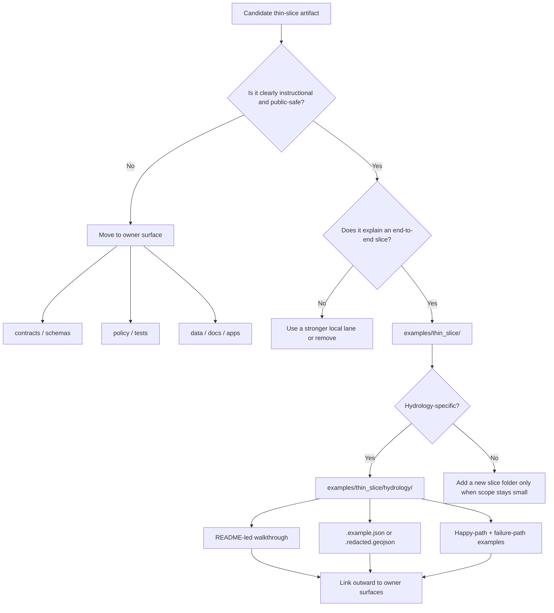

# thin slice

Public-safe, non-authoritative example lane for end-to-end KFM slice walkthroughs and instructional artifacts.

> Status: Experimental  
> Owners: `@bartytime4life`  
>       
> Quick jumps: [Scope](#scope) · [Repo fit](#repo-fit) · [Accepted inputs](#accepted-inputs) · [Exclusions](#exclusions) · [Directory tree](#directory-tree) · [Quickstart](#quickstart) · [Usage](#usage) · [Diagram](#diagram) · [Tables](#tables) · [Task list](#task-list) · [FAQ](#faq) · [Appendix](#appendix)  
> Repo fit: `examples/thin_slice/README.md` · upstream [`../README.md`](../README.md) · [`../../README.md`](../../README.md) · downstream [`./hydrology/README.md`](./hydrology/README.md)

> [!IMPORTANT]
> This README is intentionally evidence-bounded.
>
> Current public `main` shows that `examples/thin_slice/` currently contains this `README.md` plus a nested `hydrology/` directory with its own `README.md`. The lane is still README-heavy and light on example assets, so read statements here with KFM discipline:
>
> | Label | Meaning here |
> | --- | --- |
> | **CONFIRMED** | Directly visible in the current repository branch or inherited from stronger repo-visible doctrine |
> | **INFERRED** | Strong local reading from adjacent repo docs, but not yet proven as implemented under this lane |
> | **PROPOSED** | Recommended structure, naming, or usage pattern for future commits |
> | **UNKNOWN** | Not verified from the current branch view |
> | **NEEDS VERIFICATION** | Plausible target, but should be checked against the active checkout or branch under review before hardening |

> [!NOTE]
> `examples/README.md` on current public `main` already lists the scaffolded sublanes `api/`, `story/`, `thin_slice/`, and `ui`, and it names `thin_slice/hydrology/` as the first nested pack. Keep this README synchronized with that parent lane instead of preserving older inventory notes.

---

## Scope

`examples/thin_slice/` is the nested example lane for **small, reviewable, end-to-end KFM slice walkthroughs**.

Its job is to make a thin slice easy to inspect without quietly becoming a second truth system. In practice, that means this directory is best used for:

- public-safe walkthrough packs
- redacted or miniature example payloads
- README-led slice explanations
- instructional sequence maps that show how a slice should move through KFM
- small example files that clarify contracts, evidence flow, or trust-visible behavior

The current doctrinal center of gravity is **hydrology-first**, but that does **not** make this directory authoritative. A thin slice can be the place where KFM explains a route from source admission to visible correction; it should not become the place where unreconciled truth-bearing artifacts accumulate.

[Back to top](#thin-slice)

## Repo fit

### Path and role

| Field | Value |
| --- | --- |
| Path | `examples/thin_slice/README.md` |
| Parent lane | [`examples/`](../README.md) |
| Current public contents | `README.md` and [`hydrology/README.md`](./hydrology/README.md) |
| Sibling example lanes | [`../api/`](../api/) · [`../story/`](../story/) · [`../ui/`](../ui/) |
| Current nested pack | [`examples/thin_slice/hydrology/`](./hydrology/README.md) |
| Owner coverage | `@bartytime4life` via current `/.github/CODEOWNERS` coverage for `/examples/` |
| Root doctrine anchor | [`../../README.md`](../../README.md) |
| Governance / workflow context | [`../../.github/README.md`](../../.github/README.md) |
| Stronger owner surfaces | [`../../contracts/`](../../contracts/) · [`../../schemas/`](../../schemas/) · [`../../policy/`](../../policy/) · [`../../tests/`](../../tests/) · [`../../docs/`](../../docs/) · [`../../data/`](../../data/) · [`../../apps/`](../../apps/) |

### Working interpretation

This directory sits **below** the repo-wide examples lane and therefore inherits its strongest rule:

> examples explain, illustrate, and de-risk; they do not silently replace canonical, policy-bearing, or release-bearing surfaces.

That makes `examples/thin_slice/` the right place for **instructional slice packs** and the wrong place for **authoritative release memory**.

The parent `examples/README.md` now reflects the current public sublane inventory, so this README should stay aligned with it while still keeping its own lane-specific boundary explicit.

### Current verified shape

At the time of writing, the verified local shape under this lane is intentionally small:

- this README
- one nested `hydrology/` subdirectory
- one directory README inside that subdirectory
- no visible `.example.*`, `.sample.*`, or `.redacted.*` assets yet on current public `main`

That small footprint is a feature, not a defect. It leaves room to add only the files that can remain clearly illustrative.

[Back to top](#thin-slice)

## Accepted inputs

The following content belongs here when it is **small**, **public-safe**, and **explicitly instructional**:

- thin-slice overview READMEs
- redacted example JSON or GeoJSON files
- miniature end-to-end artifact sketches
- example Evidence Drawer payloads that are clearly marked as examples
- walkthrough diagrams showing stage transitions
- mock or sample folder structures
- constrained happy-path and negative-path examples
- small screenshot references or view descriptions used to explain trust-visible states

A good acceptance test is simple:

> would a reviewer mistake this file for canonical truth, a release artifact, or an executable gate input?

If yes, it likely belongs somewhere stronger.

[Back to top](#thin-slice)

## Exclusions

The following do **not** belong in `examples/thin_slice/` unless they are clearly redacted, non-executable, and named as examples:

| Do not put this here | Put it with stronger owners instead |
| --- | --- |
| Canonical source captures, processed datasets, or promoted release assets | [`../../data/`](../../data/) |
| Machine-enforced schemas and contract definitions | [`../../schemas/`](../../schemas/) and/or [`../../contracts/`](../../contracts/) |
| Executable policy bundles and registries | [`../../policy/`](../../policy/) |
| Merge-blocking fixtures, gate tests, and proof harnesses | [`../../tests/`](../../tests/) |
| Runbooks that govern real publication, rollback, or correction | [`../../docs/`](../../docs/) |
| Live API routes, runtime payload emitters, or app wiring | [`../../apps/`](../../apps/) and adjacent implementation surfaces |
| Secrets, tokens, exact sensitive coordinates, or rights-unclear material | never in examples |

> [!WARNING]
> A thin-slice example is useful only while it stays obviously illustrative. The moment a file becomes authoritative, executable, merge-blocking, or release-bearing, move it to its owner surface.

[Back to top](#thin-slice)

## Directory tree

### Current verified shape

```text
examples/
└── thin_slice/
    ├── README.md
    └── hydrology/
        └── README.md
```

### Proposed instructional growth shape

```text
examples/
└── thin_slice/
    ├── README.md
    └── hydrology/
        ├── README.md
        ├── source_descriptor.example.json
        ├── ingest_receipt.example.json
        ├── dataset_version.example.json
        ├── catalog_closure.example.json
        ├── release_manifest.example.json
        ├── evidence_bundle.example.json
        └── focus_negative_outcomes.example.json
```

> [!TIP]
> Prefer suffixes such as `.example.json`, `.sample.json`, or `.redacted.geojson` in this lane. They keep example assets from being confused with canonical or gate-bearing files.

[Back to top](#thin-slice)

## Quickstart

Inspect what is actually present before adding new prose or files:

```bash
ls -la examples/thin_slice
find examples/thin_slice -maxdepth 3 -type f | sort
```

Check the surrounding lane rules first:

```bash
sed -n '1,220p' examples/README.md
sed -n '1,220p' examples/thin_slice/README.md
sed -n '1,260p' examples/thin_slice/hydrology/README.md
sed -n '1,160p' .github/CODEOWNERS
```

Check likely owner surfaces before deciding that an asset belongs here:

```bash
ls -la contracts schemas policy tests docs data apps
```

Search for existing hydrology-related material before inventing a new example shape:

```bash
git grep -n "hydrology" -- examples docs contracts schemas tests data apps
```

[Back to top](#thin-slice)

## Usage

### 1. Start from the slice question, not the file type

A thin slice should answer a concrete question such as:

- What is the smallest end-to-end path KFM can explain honestly?
- Which artifacts must exist before a public-safe slice is credible?
- What should a correction look like at the surface, not just in storage?
- How does one lane prove the law without claiming broader maturity?

### 2. Keep the pack instructional

A good pack under this lane explains the slice using a bounded set of small files:

1. a README that names the slice and its scope
2. one or more example artifacts
3. one sequence table showing where the real owner surface lives
4. one negative-path example if failure semantics matter

### 3. Model the full slice without claiming to own it

For KFM, the usual end-to-end shape is:

1. source admission
2. raw capture
3. validation / quarantine
4. processed dataset version
5. catalog closure
6. release / projection
7. surface exposure
8. evidence drill-through
9. correction / rollback

`examples/thin_slice/` may **show** that sequence. It should not automatically **become** the authoritative home for every step.

### 4. Pair happy-path and negative-path examples

KFM trust depends on visible negative states. When the example is about a slice that could deny, abstain, stale-visible, withdraw, or supersede, include both:

- one happy-path example
- one constrained or failure-path example

### 5. Move hardening artifacts out early

Use this directory to clarify structure. Do not wait too long to migrate real artifacts into their stronger homes.

A practical rule:

- keep examples here while they teach
- move them out when they enforce

[Back to top](#thin-slice)

## Diagram



[Back to top](#thin-slice)

## Tables

### Thin-slice sequence and ownership

| Slice step | Illustrative example allowed here? | Stronger owner when authoritative | Notes |
| --- | --- | --- | --- |
| Source admission | Yes | `../../data/` and/or `../../contracts/` | Example descriptors are fine; real source admission should not drift |
| Ingest receipt | Yes, if redacted | `../../data/` | Avoid storing operational truth here |
| Dataset version | Yes, as a miniature or sample | `../../data/` | Real versions belong with governed lifecycle artifacts |
| Catalog closure | Yes, as a sample | `../../data/` and/or catalog-owning surfaces | Keep this lane explanatory |
| Release manifest / proof memory | Only as an example | `../../docs/`, `../../tests/`, and release-bearing owner surfaces | Do not confuse with real promotion memory |
| Evidence bundle example | Yes | `../../contracts/`, `../../apps/`, runtime-owning surfaces | Good fit when teaching drawer drill-through |
| Focus negative outcome example | Yes | `../../tests/`, `../../apps/`, `../../policy/` | Strong value in showing abstain / deny / stale-visible behavior |
| Screenshot baseline | Maybe | `../../tests/` or `../../docs/` | If executable or regression-bearing, move it out |

### Truth labels used in this directory

| Label | Use it when |
| --- | --- |
| **CONFIRMED** | The current branch shows the path, file, or repo rule directly |
| **INFERRED** | The pattern is strongly implied by adjacent repo materials |
| **PROPOSED** | The structure is recommended but not yet present here |
| **UNKNOWN** | The repo does not prove the detail yet |
| **NEEDS VERIFICATION** | The detail might be right, but should be checked against the active checkout before hardening |

[Back to top](#thin-slice)

## Task list

- [ ] Keep this README synchronized with the actual tree under `examples/thin_slice/`
- [ ] Keep `examples/README.md` and this README aligned whenever nested-lane inventory changes
- [ ] Preserve the examples-lane rule that this directory is explanatory, not authoritative
- [ ] Keep hydrology as the first documented nested slice unless a stronger repo-backed lane supersedes it
- [ ] Use example naming (`.example.*`, `.sample.*`, `.redacted.*`) for any new small assets added here
- [ ] Link each example pack to stronger owner surfaces before adding more files
- [ ] Add at least one negative-path example before calling a slice pack “useful”
- [ ] Avoid placing merge-blocking fixtures, live manifests, or real proof packs in this lane
- [ ] Re-check owner coverage and relative links whenever `CODEOWNERS` or sibling-lane docs move
- [ ] Re-check this README whenever owner-surface conventions change

### Definition of done for a nested slice pack

A nested slice pack is ready when:

- its scope is obvious in under a minute
- every file is either clearly illustrative or clearly linked outward
- no file can be mistaken for canonical truth
- the README names accepted inputs and exclusions
- the pack shows at least one complete slice path
- the pack does not contradict stronger repo-visible doctrine
- the parent `examples/README.md` and this README do not disagree about the visible tree

[Back to top](#thin-slice)

## FAQ

### Why is this directory still so small?

Because small is honest. The current branch proves that this lane exists, but it does not yet prove a large example inventory. This README should scale by **clarifying** the lane before the lane scales by **accumulating** files.

### Why is hydrology the first nested pack?

Hydrology is the current doctrinal lead candidate for a first thin slice because it is public-safe, map-native, time-aware, and strong enough to exercise evidence flow without immediately taking on the repo’s highest-burden publication lanes.

### Should real manifests, receipts, and proof packs live here?

No. They may appear here only as explicit examples. Real release-bearing or merge-bearing artifacts belong with their stronger owners.

### Why does this README keep pointing back to stronger owner surfaces?

Because thin-slice teaching value drops the moment an example starts doubling as contract truth, policy truth, or release truth. This lane works best when it stays explanatory and routes hardened artifacts outward early.

### Why prefer `.example.json` instead of plain `.json`?

Because this lane should never bluff. The filename itself should help prevent accidental authority drift.

### Can non-hydrology thin slices live here later?

Yes—if they stay public-safe, small, and obviously instructional, and if the stronger owner surfaces remain clear.

[Back to top](#thin-slice)

## Appendix

<details>
<summary>Illustrative sidecar fields for a thin-slice example pack</summary>

```yaml
example_id: hydrology-thin-slice-overview
title: Hydrology thin-slice walkthrough
status: illustrative
public_safe: true
owner_surface_links:
  contracts: ../../contracts/
  schemas: ../../schemas/
  policy: ../../policy/
  tests: ../../tests/
  docs: ../../docs/
  data: ../../data/
  apps: ../../apps/
current_pack:
  readme: ./README.md
  nested_pack: ./hydrology/README.md
notes:
  - Keep executable truth with owner surfaces.
  - Prefer .example.* naming inside this lane.
  - Add a negative-path example before widening scope.
```

</details>

<details>
<summary>Naming guidance</summary>

Use names that keep illustrative intent visible.

Good:

- `source_descriptor.example.json`
- `catalog_closure.sample.json`
- `evidence_bundle.redacted.json`
- `focus_abstain.example.json`
- `watershed_selection.redacted.geojson`

Avoid:

- `final.json`
- `release_manifest.json` for anything that is only a mock
- `production.geojson`
- `approved.json`
- `current_truth.json`

</details>

<details>
<summary>Parent-lane sync checklist</summary>

Use this before merging a structural update to the examples lane.

- `examples/README.md` and this README agree on visible sublanes
- `examples/thin_slice/hydrology/README.md` is still the first nested pack unless a stronger repo-backed replacement exists
- any new nested slice added here is reflected in the parent `examples/README.md`
- quickstart commands still match the actual owner surfaces and current tree

</details>

<details>
<summary>When to move a file out of this directory</summary>

Move the file when any of the following becomes true:

- CI starts validating it
- policy starts deciding from it
- an app or API starts emitting it
- reviewers could mistake it for release-bearing truth
- it needs stable versioning beyond a small example lane

</details>

[Back to top](#thin-slice)
